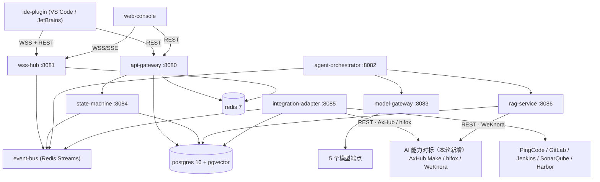
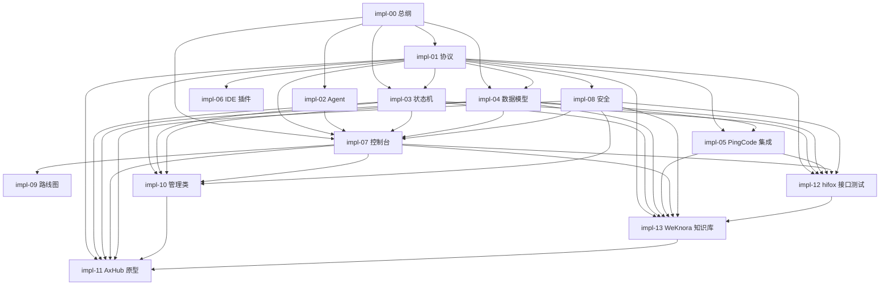
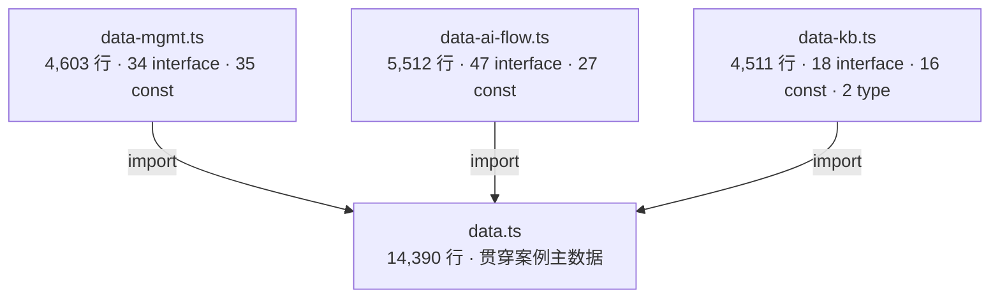

# impl-00 总体架构与部署拓扑

> 版本：v1.1 ｜ 对应设计方案 v1.0、原型 `ai-sdlc-console` ｜ 日期：2026-03-19（v1.0 编写日 2026-09-24）

## 本篇范围

本篇定义「AI 研发协作平台」的**四层架构职责边界**、**进程与部署拓扑**、**技术选型**、**私有化 VPC 与 SaaS 双形态差异**、**容量估算与高可用/降级策略**；自 v1.1 起追加**文档地图**、**数据模块划分**、**外部能力对标**、**AI 自动化编排全景**与**本轮扩展统计基线**五节（§8~§12），作为全套 14 篇 impl 文档的总纲入口。

本篇**不**覆盖：

- 消息信封字段与 REST/WSS 报文细节 → 见 `impl-01-protocol.md`
- Agent 的 Prompt 结构、模型路由与成本口径 → 见 `impl-02-agents.md`
- 任务 10 状态的迁移守卫与事件总线 → 见 `impl-03-state-machine.md`
- 管理类五域（项目 / 人员 / 团队 / 需求池 / 版本）的表与接口 → 见 `impl-10-management.md`（本轮扩展）
- AI 原型生成与 AxHub 集成 → 见 `impl-11-prototype-axhub.md`（本轮扩展）
- 接口自动化测试与 hifox 集成 → 见 `impl-12-api-test-hifox.md`（本轮扩展）
- 企业知识库与 WeKnora 集成 → 见 `impl-13-knowledge-weknora.md`（本轮扩展）

## 关联文档

| 文档 | 与本篇的关系 |
|:---|:---|
| `docs/AI研发平台设计方案.md` | 上层输入，本篇细化其第 1、4.2、7 节 |
| `.trae/specs/design-ai-sdlc-console/spec.md` | 原型规格，本篇的组件命名与页面能力以其为准 |
| `impl-01-protocol.md` | 依赖本篇的组件清单与端口规划 |
| `impl-02-agents.md` | 依赖本篇的模型网关与 Agent 编排组件定义 |
| `impl-03-state-machine.md` | 依赖本篇的事件总线与存储选型 |
| `impl-04-data-model.md` | 依赖本篇的存储选型（PostgreSQL 16 / pgvector 0.7 / MinIO）；是全部新增表的**唯一事实源**（既有 20 张表，见 §12.2）（本轮扩展补录） |
| `impl-07-console.md` | 依赖本篇的层 4 职责边界与「不做什么」清单；其 §3.1 三向映射表是 impl-10~13 的列定义母版（本轮扩展补录） |
| `impl-10-management.md` | 依赖本篇的术语基线、四层架构、组件清单与端口、私有化 / SaaS 形态差异（本轮扩展） |
| `impl-11-prototype-axhub.md` | 依赖本篇的术语基线、四层架构、组件清单与端口、私有化 / SaaS 出网形态（本轮扩展） |
| `impl-12-api-test-hifox.md` | 依赖本篇的架构与选型；`provider-hifox` 执行器落在本篇层 1 的 Jenkins 侧（本轮扩展） |
| `impl-13-knowledge-weknora.md` | 依赖本篇的架构与选型；把本篇 §3.1 的 `rag-service:8086` 升级为「知识库服务 `kb-service`」，并引入 NebulaGraph 3.8 图存储（本轮扩展） |

---

## 1. 术语基线（全 4 篇统一，禁止改写）

### 1.1 任务 10 状态（源：`data.ts` `TASK_STATES`，逐字照抄）

| 顺序 | `id` | 编码 | 中文名 | 推进方 `driver` | SLA(h) | PingCode 状态名 |
|:---:|:---|:---|:---|:---|:---:|:---|
| 1 | `backlog` | T01 | 需求池 | human | 72 | 待评审 |
| 2 | `refined` | T02 | 已拆解 | human | 48 | 未开始 |
| 3 | `taskCreated` | T03 | 任务已创建 | ai | 8 | 未开始 |
| 4 | `dev` | T04 | 开发中 | ai+human | 48 | 处理中 |
| 5 | `testGreen` | T05 | 本地测试通过 | ai+human | 8 | 处理中 |
| 6 | `committed` | T06 | 已提交 | ai+human | 12 | 处理中 |
| 7 | `deployed` | T07 | 已部署 | ai | 4 | 处理中 |
| 8 | `qa` | T08 | 自动化测试中 | ai | 12 | 测试中 |
| 9 | `bugfix` | T09 | 缺陷修复中 | ai+human | 24 | 处理中 |
| 10 | `released` | T10 | 已发布 | ai | 0 | 已关闭 |

### 1.2 7 个 Agent（源：`data.ts` `agents`）

| `id` | 名称 | 所属环节 | 默认模型 | 工具 |
|:---|:---|:---|:---|:---|
| `ag-pm` | 需求澄清 Agent | st-req 需求澄清 | `mdl-claude` | Brainstorm 对话 / PRD 编辑器 / PingCode 需求同步 |
| `ag-arch` | 架构设计 Agent | st-arch 架构设计 | `mdl-gpt5` | 架构画布 / OpenAPI 契约 / 任务拆解器 |
| `ag-code` | 编码实现 Agent | st-code 编码实现 | `mdl-claude` | IDE 插件 / AI 编码会话 / GitLab MR |
| `ag-review` | 代码评审 Agent | st-code 编码实现 | `mdl-claude` | GitLab MR / SonarQube / 编码规约 KB-CODE-02 |
| `ag-test` | 测试生成 Agent | st-test 测试验证 | `mdl-deepseek` | 用例库 / 接口自动化 / JMeter 压测 |
| `ag-ops` | 部署运维 Agent | st-deploy 部署发布 | `mdl-gpt5` | GitLab CI / Argo Rollouts / Kubernetes |
| `ag-ba` | 可观测分析 Agent | st-observe 运维观测 | `mdl-deepseek` | Prometheus / SkyWalking / Loki |

### 1.3 5 个模型（源：`data.ts` `models`）

| `id` | 名称 | 厂商 | 上下文 | 单价（元/1K tokens） | 部署形态 | 出域 |
|:---|:---|:---|:---:|:---:|:---|:---|
| `mdl-claude` | Claude 3.7 Sonnet | Anthropic | 200K | 0.021 | 公有云 SaaS | 允许出域（代码需先脱敏） |
| `mdl-deepseek` | DeepSeek-V3 | DeepSeek | 128K | 0.004 | 公有云 SaaS | 允许出域 |
| `mdl-qwen` | Qwen2.5-Max | Alibaba Cloud | 128K | 0.006 | 公有云 SaaS | 允许出域 |
| `mdl-gpt5` | GPT-5 | OpenAI | 400K | 0.035 | 公有云 SaaS | 允许出域（代码需先脱敏） |
| `mdl-local` | 私有化 Llama3-70B | 内部私有化部署 | 32K | 0.001 | 私有化 VPC | 禁止出域 |

### 1.4 与设计方案的差异说明（冲突以设计方案为准，此处逐条注明）

| 主题 | 设计方案原文 | 本平台实现基线（源：`data.ts`） | 处理 |
|:---|:---|:---|:---|
| 状态数量 | 第 3.3 节列出 11 项，含末态 `Done(已关闭)` | 10 态，末态为 `released`（已发布），PingCode 映射为「已关闭」 | 采 10 态；设计方案的 `Done` 语义由 `released` 的 PingCode 映射承接，**不新增第 11 态** |
| Agent 命名 | 产品 / 架构 / 编码 / 测试 / PMO / 部署 / QA Agent | 需求澄清 / 架构设计 / 编码实现 / 代码评审 / 测试生成 / 部署运维 / 可观测分析 Agent | 采 `data.ts` 7 名；设计方案名称作为**别名**保留在 `agents.alias`，见 1.5 |
| 模型清单 | DeepSeek / Qwen / GPT / Claude / 豆包 | Claude 3.7 Sonnet / DeepSeek-V3 / Qwen2.5-Max / GPT-5 / 私有化 Llama3-70B | 采 `data.ts` 5 模型；**豆包替换为私有化 Llama3-70B**（合规出域开关需要内网兜底模型，公有云豆包无法承担 DENY 场景） |
| 状态一致性 | 第 7 节「Redis Streams / RabbitMQ 二选一」 | 统一 Redis Streams | 见第 6 节选型理由 |
| 后端语言 | 第 4.2 节「Node.js（NestJS）或 Go」 | 业务服务 NestJS，网关类 Go | 见第 4 节选型理由 |

### 1.5 Agent 别名映射（兼容设计方案与外部工具命名）

| `data.ts` 名称（主用） | 设计方案别名 | `alias` 字段取值 |
|:---|:---|:---|
| 需求澄清 Agent | 产品 Agent | `product-agent` |
| 架构设计 Agent | 架构 Agent | `architect-agent` |
| 编码实现 Agent | 编码 Agent | `coding-agent` |
| 代码评审 Agent | （无，设计方案未单列） | `review-agent` |
| 测试生成 Agent | 测试 Agent | `test-agent` |
| 部署运维 Agent | 部署 Agent | `ops-agent` |
| 可观测分析 Agent | QA Agent / PMO Agent（能力合并） | `observability-agent` |

> 说明：设计方案的 **PMO Agent（排期与风险）** 与 **QA Agent（缺陷分析指派）** 在本平台**不设为独立 Agent**，分别由 `ag-ba`（可观测分析，负责缺陷归因）与 `ag-arch`（任务拆解输出工时，供 PMO 排期）承担；排期的规则计算由**状态机 + 规则引擎**（非 LLM）完成，理由：排期是确定性约束求解，LLM 输出不可复现，被否方案为「PMO Agent 直接生成甘特」。

---

## 2. 四层架构与职责边界

```
┌──────────────────────────────────────────────────────────────────────┐
│ 层 4 · 浏览器协同控制台 (web-console) —— 21 个页面 / 7 大导航分组      │
│   g-overview  总览       ：总览驾驶舱                                 │
│   g-resource  项目与资源 ：项目管理 / 人员管理 / 团队管理              │
│   g-discovery 需求与设计 ：需求管理 / 需求工作台 / AI 原型工坊 /       │
│                            架构设计与任务拆解                         │
│   g-delivery  交付执行   ：任务看板 / 排期甘特 / AI 编码协作           │
│   g-quality   发布与质量 ：版本管理 / 部署流水线 / 测试中心 /          │
│                            接口自动化测试 / Bug 流转                   │
│   g-insight   度量洞察   ：效能报表                                   │
│   g-platform  知识与平台 ：企业知识库 / PingCode 集成中心 /            │
│                            AI 能力观测 / 安全与审计                    │
│   （本轮扩展：13 页 → 21 页，6 分组 → 7 分组，源 index.tsx / Layout.tsx）│
├──────────────────────────────────────────────────────────────────────┤
│ 层 3 · 云端 AI 推理决策层 (cloud-ai)                                  │
│   api-gateway · wss-hub · agent-orchestrator · model-gateway ·        │
│   state-machine · rag-service（impl-13 升级为 kb-service，端口不变）· │
│   event-bus · integration-adapter                                     │
├──────────────────────────────────────────────────────────────────────┤
│ 层 2 · 本地 IDE 插件层 (ide-plugin)                                   │
│   ide-plugin-vscode (TypeScript) · ide-plugin-jetbrains (Kotlin)      │
│   上下文采集 / AI 交互 / Diff 审查 / 任务卡片 / 本地构建测试执行器      │
│   （本轮扩展：coding 页新增「本地 IDE 同步」区，回流会话与事件流）      │
├──────────────────────────────────────────────────────────────────────┤
│ 层 1 · 基础设施与工具链（已有系统，集成而非替代）                      │
│   GitLab · Jenkins · SonarQube · Harbor · K8s · 飞书 IM · 邮件        │
└──────────────────────────────────────────────────────────────────────┘
                              │
   ┌──────────────────────────┴───────────────────────────────────────┐
   │ 横向集成层 (integration-adapter:8085)                             │
   │ ① 项目管理 Provider：PingCode（已接入）·                          │
   │    Jira / 禅道 / ONES / TAPD（预留未接入）                        │
   │ ② 工程工具链（已接入）：GitLab · Jenkins · SonarQube · Harbor      │
   │ ③ AI 能力对标（本轮新增，均已接入）：                              │
   │    AxHub Make（provider-axhub · 原型生成 · 详见 impl-11）          │
   │    hifox（provider-hifox · 接口自动化 · 执行器在 Jenkins 侧 ·      │
   │           详见 impl-12）                                          │
   │    WeKnora（provider-weknora / engine-weknora · 企业知识库 ·       │
   │           私有化 VPC 内自持 · 详见 impl-13）                       │
   └──────────────────────────────────────────────────────────────────┘
```

| 层 | 核心职责 | 明确**不做**的事（边界） |
|:---|:---|:---|
| 层 2 本地 IDE 插件 | 上下文采集（文件树 / Git diff / 选中代码 / LSP 符号表）、AI 交互面板、Diff 审查、任务卡片、**本地**构建与单测执行、部署触发 | 不持有模型密钥（仅用短期 STS 换取网关调用令牌）；不做状态机的权威判定；不直连 PingCode；不落库业务数据（本地仅缓存 ≤ 24h） |
| 层 3 云端 AI 决策 | 多模型路由与限流、Agent 编排与工具调用、**状态机权威**、事件总线、RAG 检索、审计留痕、外部系统同步 | 不执行用户代码（本地构建在 IDE 侧）；不存储 Git 全量仓库（仅存切片索引）；不替代 Jenkins/GitLab CI（只编排与观测） |
| 层 4 浏览器控制台 | 监控、报告、跨角色协同、配置与审计查询、只读观测 AI 能力 | 不直接读写数据库；不承载长耗时 AI 推理（一律经 `wss-hub`/SSE 转发）；不做权限的最终判定（由 `api-gateway` 校验 JWT + RBAC） |
| 横向集成层 | 统一 `ProjectMgmtProvider` 抽象、幂等映射、双向同步、对账；（本轮扩展）以 `ai_tool_provider` / `ai_tool_capability` 两张表（impl-11 §4.2 / §4.3）统一登记 AxHub / hifox / WeKnora 三个 AI 能力对标 | 不承载业务状态机（状态机在层 3，集成层只做**投影**）；不修改外部系统的字段口径；不代理被测服务的请求流量（hifox 执行器在 Jenkins 侧，见 impl-12 §2.3） |

### 2.1 唯一事实源（Single Source of Truth）约定

| 数据 | 事实源 | 其余副本 |
|:---|:---|:---|
| 任务状态 | 层 3 `state-machine`（PostgreSQL `task`） | PingCode 工作项状态为**投影**；IDE 与控制台为**订阅缓存** |
| 需求 / PRD 基线 | 层 3（`requirement` / `prd_version`） | PingCode Story 为投影 |
| 工作项编号 | PingCode（`external_id`） | 平台以 `external_id ↔ 本地 uuid` 映射表持有 |
| 代码与提交 | GitLab | 平台仅存 MR/提交元数据 |
| 模型调用与成本 | 层 3 `model-gateway` 计量表 | 控制台报表为聚合视图 |

### 2.2 本轮扩展后的事实源补充（新增 4 条，不改动 §2.1 既有 5 条）

| 数据 | 事实源 | 其余副本 |
|:---|:---|:---|
| 项目 / 人员 / 团队 / 需求池 / 版本 五域主数据 | 层 3（impl-10 §2 的 24 张新表 + 扩展后的 `project` 表） | PingCode 项目与需求池工作项为**投影**（经 `external_id_map`，`entity_type` 扩展取值 `req_pool_item`）；控制台 `project`/`people`/`team`/`req-pool`/`release` 五页为订阅缓存 |
| 原型任务与版本基线 | 层 3（impl-11 §4 的 `prototype_job` / `prototype_version` 等 11 张表） | AxHub Make 侧项目（`AXH-PRJ-*`）为**协作副本**，锚点与版本快照双向同步；导出包（make / figma / html / sketch）为不可变产物 |
| 接口自动化用例与报告 | 层 3（impl-12 §6 的 `api_case` / `api_test_report` 等 7 张表） | hifox 侧执行器只承接场景定义与数据驱动集引用，**不持有**用例主数据；Jenkins 阶段日志为投影 |
| 知识文档与切片 | 层 3（impl-13 §8 的 `kb_doc` / `kb_chunk` 等 15 张表） | WeKnora 实例（`engine-weknora`）持有向量与 BM25 倒排索引，NebulaGraph 3.8 持有图拓扑，二者均可由 `kb_doc` + 原文（MinIO）重建；`rag_entry` 迁移期经只读视图 `v_rag_entry` 供 `ai-observe` 页读取 |

---

## 3. 组件清单与部署拓扑

### 3.1 组件清单

| 组件 | 归属层 | 语言/运行时 | 部署形态 | 容器端口 | 最小副本 | 关键依赖 |
|:---|:---|:---|:---|:---:|:---:|:---|
| `ide-plugin-vscode` | L2 | TypeScript / Node 20 | 开发者本机（VSIX） | — | — | `wss-hub`、本地 Git/LSP |
| `ide-plugin-jetbrains` | L2 | Kotlin / JDK 17 | 开发者本机（Plugin） | — | — | 同上 |
| `web-console` | L4 | React 18 + TS + Vite | K8s Deployment + Nginx | 443 | 2 | `api-gateway`、`wss-hub` |
| `api-gateway` | L3 | NestJS / Node 20 | K8s Deployment | 8080 | 3 | PostgreSQL、Redis、`state-machine` |
| `wss-hub` | L3 | Go 1.22 | K8s Deployment | 8081 | 3 | Redis（Pub/Sub 扇出）、`api-gateway` |
| `agent-orchestrator` | L3 | NestJS / Node 20 | K8s Deployment | 8082 | 3 | `model-gateway`、`rag-service`、Redis Streams |
| `model-gateway` | L3 | Go 1.22 | K8s Deployment | 8083 | 4 | 5 个模型端点、Redis（限流） |
| `state-machine` | L3 | NestJS / Node 20 | K8s Deployment | 8084 | 2 | PostgreSQL、Redis Streams |
| `integration-adapter` | 横向 | NestJS / Node 20 | K8s Deployment | 8085 | 2 | PingCode OpenAPI、GitLab、Jenkins、SonarQube、Harbor |
| `rag-service` | L3 | Python 3.11 / FastAPI | K8s Deployment | 8086 | 2 | 向量库（pgvector）、对象存储 |
| `event-bus` | L3 | Redis 7（Streams） | StatefulSet | 6379 | 3（Sentinel） | — |
| `postgres` | 存储 | PostgreSQL 16 | StatefulSet + 主备 | 5432 | 1 主 + 1 备 | 本地 SSD |
| `vector-store` | 存储 | pgvector 0.7（PG 扩展） | 复用 `postgres` 实例独立库 | 5432 | 同 PG | — |
| `object-store` | 存储 | MinIO / S3 兼容 | StatefulSet | 9000 | 4 | — |
| `prometheus` | 观测 | Prometheus 2.5x | K8s Deployment | 9090 | 2 | 各组件 `/metrics` |
| `loki` | 观测 | Loki 3.x | StatefulSet | 3100 | 3 | 留存 ≥ 180 天（G6 门禁） |

> **本轮扩展说明（不改动上表，组件数与端口口径保持 §7 验收标准不变）**：
>
> 1. `rag-service:8086` 在 impl-13 中升级为「知识库服务 `kb-service`」，**端口、副本数与依赖不变**，只扩充职责（归档规则引擎、7 步入库编排、三路召回与重排、图谱多跳、评测回归）；`stream:grp:kb` 为其独立消费组（impl-13 §9.4）。
> 2. impl-13 引入 **NebulaGraph 3.8** 作为知识图谱存储。它随 WeKnora 私有化实例一并交付（`engine-weknora.deployMode = 私有化 VPC`），**不作为平台独立组件部署**，故不进入上表；与 `postgres + pgvector` 的分工见 impl-13 §6.5。
> 3. 三个 AI 能力对标（AxHub / hifox / WeKnora）均通过既有 `integration-adapter:8085` 出网，**不新增独立组件**；各自的限流键为 `rl:axhub:{scope}`（impl-11 §2.2）、`rl:hifox:{endpoint}`（impl-12 §2.3）、`rl:kb:{callerId}`（impl-13 §11.5 R-05）。
> 4. 上表 16 行中 `vector-store` 复用 `postgres` 实例（端口 5432 非独立），故 §7 的「15 个组件 / 端口 `8080`~`8086` 唯一」口径继续成立。

### 3.2 依赖关系图



> **本轮扩展的依赖增量**：`integration-adapter:8085` 新增对 AxHub Make（`https://axhub.intra.example.com/api/v1`）与 hifox（`https://hifox.intra.example.com/openapi/v3`）的 REST 出向依赖；`rag-service:8086`（impl-13 的 `kb-service`）新增对 WeKnora（`https://weknora.intra.example.com/api/v1`）的 REST 出向依赖。**无新增循环依赖**：三者均为叶子节点，不反向调用平台任何组件（AxHub 的批注回流走 `POST /api/v1/integrations/axhub/callbacks` 入站，见 impl-11 §2.2）。

### 3.3 端口与命名规范

| 规范项 | 取值 |
|:---|:---|
| HTTP API 前缀 | `/api/v1/`（**控制面**；`data.ts` `API_CONTRACTS` 中的 `/api/v2/orders*` 是被研发业务系统「订单中心」的契约样例，非本平台 API，勿混用） |
| 内部服务间调用 | `http://<service>.<namespace>.svc.cluster.local:<port>/internal/v1/` |
| 健康检查 | `GET /healthz`（存活）、`GET /readyz`（就绪，含依赖探活） |
| 指标暴露 | `GET /metrics`（Prometheus 文本格式） |
| K8s 命名空间 | 生产 `ai-sdlc`；预发 `ai-sdlc-stg`；开发 `ai-sdlc-dev` |
| 镜像标签 | `<service>:<git-short-sha>-<build-no>` |

---

## 4. 技术选型总表

| 领域 | 选型 | 版本 | 选型理由 | 被否方案及原因 |
|:---|:---|:---|:---|:---|
| 控制台前端 | React + TypeScript + Vite | React 18 / Vite 5 | 与原型 `ai-sdlc-console`（React+TS）零迁移成本；图表用 SVG/CSS 手绘，不引重依赖 | Vue3：原型已用 React，切换成本高；ECharts 全量引入：包体大，原型约束「不新增依赖」 |
| 业务后端 | NestJS（TypeScript） | Nest 10 / Node 20 | 与前端同语言、DTO 类型可共享（`data.ts` 已是 TS 类型）；模块化天然适配「按域拆分」 | Spring Boot：团队 TS 占比高，双语言运维成本；纯 Go：CRUD 与 DTO 校验开发效率低于 Nest |
| 高并发网关 | Go | 1.22 | 长连接（WSS）与模型流式转发对内存/GC 敏感；单副本可扛 5,000 长连接 | Node 承载 WSS：单连接内存约 3 倍于 Go，10k 连接下 GC 抖动明显 |
| 事件总线 | Redis Streams | Redis 7.2 | 消费组 + ACK + PEL 原生支持；与缓存/限流共用一套中间件，运维面小 | RabbitMQ：多一套集群，且 Streams 的 `XACK`/`XCLAIM` 已满足本场景；Kafka：过重，日事件量 < 500 万 |
| 业务存储 | PostgreSQL | 16 | JSONB 存 Prompt/上下文快照；分区表存审计与状态历史；pgvector 复用同实例 | MySQL：JSON 与分区能力弱；MongoDB：事务与状态机强一致诉求不匹配 |
| 向量存储 | pgvector | 0.7 | 与 PG 同实例，避免额外中间件；RAG 条目量级（万级切片）无需专用库 | Milvus：运维成本与规模不匹配（v1.0 口径为 11 条知识库 / 千级切片；**本轮扩展**后 impl-13 承接该 11 条为 20 篇文档 / 2,406 切片，仍在万级以下，选型结论不变） |
| 对象存储 | MinIO（S3 兼容） | RELEASE.2024-xx | 私有化 VPC 内可自持，SaaS 可换云 OSS 同一 SDK | 直写本地磁盘：多副本与制品版本管理缺失 |
| IDE 插件（VS Code） | TypeScript + Extension API | Node 20 | 与协议层同语言，协议定义可复用 | — |
| IDE 插件（JetBrains） | Kotlin + IntelliJ Platform SDK | JDK 17 | 官方推荐，PSI 访问能力最全 | Java：无必要，Kotlin 与平台 API 更契合 |
| 鉴权 | JWT（RS256）+ OIDC SSO | — | 与 `ssoStatus`（飞书 SSO / OIDC）对齐，MFA 由 IdP 承担 | Session-Cookie：多端（IDE/浏览器）与 WSS 场景不友好 |
| 实时推送 | WSS（双向）+ SSE（AI 事件流） | — | WSS 承载双向命令与状态推送；SSE 承载只读 AI token 流，弱网更省 | 纯轮询：时延与负载不可接受 |
| 容器编排 | Kubernetes | 1.29 | 设计方案第 7 节「云端 K8s」；灰度与 HPA 原生支持 | 裸机 Compose：无自愈与滚动升级 |

### 4.1 本轮复核结论：既有选型全部成立，零新增依赖

对本轮扩展（13 → 21 页、10 → 14 篇文档、新增 3 个数据模块）逐项复核 `makepro/package.json` 与 `makepro/vite.config.ts`，上表选型**无一需要修改**：

| 选型项 | `package.json` 实测版本 | 本轮是否变化 | 复核结论 |
|:---|:---|:---:|:---|
| React | `18.2.0` | 否 | 21 个页面组件全部为函数组件 + Hooks，无新增模式 |
| TypeScript | `^5.9.3`（`strict: true`，源 `makepro/tsconfig.base.json`） | 否 | 3 个新数据模块（`data-mgmt.ts` / `data-ai-flow.ts` / `data-kb.ts`）合计 **99 个 `export interface` + 2 个 `export type` + 78 个 `export const`**，全部通过 `strict` 检查（明细见 §9.2） |
| Vite | `5.4.21` | 否 | 新增 14 篇 markdown 经 `?raw` 导入，未新增插件 |
| 图标 | `lucide-react@0.562.0` | 否 | `Layout.tsx` 中 7 分组 / 21 页面用到的图标（含 `Building2`、`FolderKanban`、`UserRound`、`Users`、`Inbox`、`LayoutTemplate`、`Package`、`Terminal`、`Library`）均来自该既有依赖，未新增图标库 |
| 批注 | `@axhub/annotation@^1.0.18` | 否 | 锚点由 87 → 171，wire format 不变（见 impl-07 §11） |
| 图表 | **内联 SVG 手绘**（无图表库） | 否 | 本轮新增的全部图表（四象限散点、热力网格、组织树、漏斗、力导向图、甘特泳道、版本时间线、场景链路图、瀑布图、哑铃图、雷达图）均为内联 SVG，**未引入 ECharts / Recharts / D3** |
| 样式 | 原生 CSS + `ac-` 前缀 token | 否 | 新增 8 个页面独占 CSS（`project.css` / `people.css` / `team.css` / `req-pool.css` / `prototype.css` / `release.css` / `api-test.css` / `knowledge.css`），`style.css` 仍为 1,762 非空行 |

### 4.2 工程红线（本轮真实踩到并修复的缺陷，全部 21 个 `.tsx` 必须遵守）

**现象**：某个 `.tsx` 文件漏写 `import React from 'react'` 时，`npm run typecheck` **通过**、`vite build` **exit 0**，但浏览器加载后抛 `ReferenceError: React is not defined`，整页白屏。

**根因（两处 JSX 运行时口径不一致）**：

```ts
// makepro/tsconfig.base.json —— 类型检查用「自动运行时」，无需 import React
{ "compilerOptions": { "jsx": "react-jsx", "strict": true, "noEmit": true } }

// makepro/vite.config.ts —— 非 IIFE 构建用「经典运行时」，必须在作用域内有 React
esbuild: isIifeBuild
  ? { target: 'es2015', legalComments: 'none', keepNames: true }
  : { jsx: 'transform', jsxFactory: 'React.createElement', jsxFragment: 'React.Fragment' },
```

`tsc` 按 `react-jsx` 判定「不写 `import React` 也合法」，而实际产物由 esbuild 按 `jsx: 'transform'` + `jsxFactory: 'React.createElement'` 生成，运行期必须能从闭包取到 `React` 标识符。二者一个管类型、一个管产物，**不会互相报错**，因此缺陷只能在浏览器里暴露。

**红线规则（强制）**：

1. 原型目录下**全部 21 个 `pages/*.tsx`** 以及 `index.tsx`、`components/Layout.tsx`、`components/Drawer.tsx`、`components/Modal.tsx`，首行必须是显式的 `import React` 或 `import React, { ... } from 'react'`；**不得**依赖 `react-jsx` 的自动注入。
2. 新增页面时把「首行 `import React`」作为 PR 检查项；`typecheck` 与 `build` 全绿**不足以**证明该文件可运行，必须做一次浏览器加载验证。
3. 长期修复方向（不在本轮范围）：把 `vite.config.ts` 非 IIFE 分支的 esbuild 选项改为 `jsx: 'automatic'`，与 `tsconfig.base.json` 对齐；在改完之前，规则 1 是唯一防线。

> 该缺陷属**静默失败**类（编译期无信号），故写入总览作为工程红线，而非仅记录在 impl-07 的前端章节。

---

## 5. 私有化 VPC 与 SaaS 两种形态差异

| 维度 | 私有化 VPC（企业合规首选） | SaaS 托管 |
|:---|:---|:---|
| **数据面** | 全量落在客户 VPC：PostgreSQL / Redis / MinIO / pgvector 均客户自持 | 平台侧多租户库（`tenant_id` 行级隔离 + 每租户独立 schema） |
| **控制面** | 控制面同 VPC 部署（`api-gateway`/`state-machine`/`agent-orchestrator`）；平台方仅提供升级镜像 | 控制面平台侧托管，按租户分片 |
| **网络出网** | 默认**禁止**出网；仅 `model-gateway` 可经**白名单出口代理**访问客户授权的模型端点；`EGRESS-DENY` 环境强制路由 `mdl-local` | 允许出网至模型厂商；按租户配置出域策略 |
| **模型可用集** | 默认仅 `mdl-local`；客户可申请开通指定公有云模型（需签署数据处理协议） | 全 5 模型可用（`mdl-local` 视租户是否部署私有化节点） |
| **密钥管理** | 客户 KMS / Vault；平台不落明文密钥；IDE 侧用 STS 短令牌（TTL ≤ 15 min） | 平台 KMS（信封加密），按租户隔离 CMK |
| **身份源** | 强制对接客户 SSO（`ssoStatus`：飞书 SSO/OIDC 或企业 LDAP v3） | 支持平台账号 + 可选 SSO 联邦 |
| **升级方式** | 离线镜像包 + Helm Chart，客户维护窗口内滚动升级；版本回滚靠 Helm release | 平台侧蓝绿/金丝雀，租户无感 |
| **可观测** | Prometheus/Loki 客户自持，留存 ≥ 180 天（G6 门禁） | 平台托管，租户可只读导出 |
| **合规** | 满足「代码不出域」红线；审计流水不可篡改（PG 分区 + 只追加） | 需签 DPA；敏感代码默认脱敏 |
| **多租户隔离** | 单租户单实例（物理隔离） | 逻辑隔离 + 网络策略隔离 |
| **成本模型** | 一次性 License + 年维保 | 按席位 + 按 Token 用量阶梯计费 |

### 5.1 部署形态开关（同一份 Chart，两套 values）

```yaml
# values-private-vpc.yaml（片段）
global:
  deploymentMode: private-vpc
  egress:
    defaultPolicy: DENY          # 对应 EGRESS-DENY
    allowExternalModel: false
    proxyEndpoint: ""            # 如需开通，填客户白名单出口代理
  kms:
    provider: customer-vault
    stsTtlSeconds: 900
  models:
    enabled: [mdl-local]         # 仅内网私有化模型
    endpoints:
      mdl-local: http://llama3-70b.inference.svc.cluster.local:8000/v1
# values-saas.yaml（片段）
global:
  deploymentMode: saas
  egress:
    defaultPolicy: MASK          # 对应 EGRESS-MASK
    allowExternalModel: true
  kms:
    provider: platform-kms
  models:
    enabled: [mdl-claude, mdl-deepseek, mdl-qwen, mdl-gpt5, mdl-local]
```

---

## 6. 容量估算与高可用策略

### 6.1 基线假设

| 假设项 | 取值 | 来源 |
|:---|:---|:---|
| 单迭代（2 周）工作项 | 24 个任务 | `data.ts` Sprint 24 = TASK-2401~2424 |
| 单迭代需求 / 用例 / 缺陷 | 8 需求 / 248 用例 / 12 缺陷 | `data.ts` `REQUIREMENTS`/`TEST_CASES`/`BUGS` |
| 单迭代发布单 | 3 个 | `data.ts` `RELEASE_ORDERS` |
| 近 7 日模型调用量 | 18,420 次（单项目实例） | `data.ts` `modelStats.totalCalls` |
| 近 7 日 Token 量 | 96,240 K | `data.ts` `modelStats.totalTokensK` |
| 平均时延 | 1,840 ms | `data.ts` `modelStats.avgLatencyMs` |

### 6.2 容量估算

| 指标 | 单项目/迭代 | 20 项目并发（日） | 峰值系数 | 峰值需求 | 扩容阈值（HPA） |
|:---|:---:|:---:|:---:|:---:|:---|
| 模型调用 | 26,300 次 | 52,600 次/日 | ×6 | ≈ 4 QPS | `model-gateway` CPU > 60% 或 P95 > 3s |
| Token 吞吐 | 137,500 K | 275,000 K/日 | ×6 | ≈ 19 K tokens/s | 同上 |
| 状态迁移事件 | 24 × 6 ≈ 150 次 | 3,000 次/日 | ×8 | ≈ 0.3 QPS | `state-machine` Streams 积压 > 5,000 |
| 并发编码会话 | 24 | 480 | — | 480 | `agent-orchestrator` 活跃会话 > 300/副本 |
| WSS 长连接 | 30 | 600（工程师）+ 120（控制台） | — | ≈ 1,000 | 单副本 > 5,000 连接 |
| 集成同步 QPS | — | 320/h 吞吐 | ×3 | ≈ 0.3 QPS | 队列 `pending` > 500 |

### 6.3 高可用与降级策略

| 层级 | 高可用措施 | 降级策略 | 触发条件 |
|:---|:---|:---|:---|
| `api-gateway` | 3 副本 + 反亲和 + PDB(minAvailable=2) | 关闭非核心报表接口，保留状态机与任务读写 | 错误率 > 5% |
| `model-gateway` | 4 副本，无状态；按模型维度独立熔断 | ① 主模型失败→备选模型（见 impl-02 §5）② 全失败→**规则引擎兜底**（模板化输出，标注 `degraded:true`） | 单模型连续 5 次超时 |
| `agent-orchestrator` | 3 副本；会话粘性由 Redis 保存检查点，可任意副本恢复 | 暂停低优先级 Agent（`ag-ba` 根因分析），保 `ag-code`/`ag-test` | 队列积压 > 10,000 |
| `state-machine` | 2 副本；迁移用 PostgreSQL 行级锁 + 乐观锁 `version` | **只读降级**：拒绝写迁移（返回 `SDLC-STATE-503`），读走备库 | PG 主库不可用 |
| `event-bus` | Redis Sentinel 3 节点；Streams `MAXLEN ~ 1000000` 截断 | 停止非关键订阅者（报表聚合），保状态机与同步 | 内存 > 80% |
| `integration-adapter` | 2 副本；幂等键 + 指数退避 + 死信队列 | 暂停 pull 方向同步，保 push（状态外发）；进入对账待办 | PingCode 429 连续 10 次 |
| `postgres` | 主备流复制 + 每日全备 + WAL 归档（PITR 7 天） | 读请求切备库；写请求排队（上限 30s） | 主库健康检查失败 |
| `rag-service` | 2 副本；向量库只读副本 | 降级为「无 RAG 注入」，Prompt 标注 `ragSkipped:true` | 检索 P95 > 1s |
| `wss-hub` | 3 副本 + Redis Pub/Sub 跨副本扇出 | 降级为 30s 轮询 REST 快照 | 单副本连接 > 8,000 |

### 6.4 故障域与 SLO

| 服务 | 可用性 SLO | RTO | RPO |
|:---|:---:|:---:|:---:|
| `api-gateway` | 99.9% | ≤ 5 min | 0 |
| `state-machine` | 99.95% | ≤ 5 min | ≤ 1 min |
| `model-gateway` | 99.5%（依赖上游） | ≤ 10 min | 0 |
| `wss-hub` | 99.9% | ≤ 2 min | 0（可重建快照） |
| `integration-adapter` | 99.0% | ≤ 30 min | ≤ 6 h（对账窗口） |
| `postgres` | 99.99% | ≤ 15 min | ≤ 5 min |

---

## 7. 可验收标准

- [ ] 组件清单中 15 个组件均有明确语言/端口/副本/依赖，且端口无冲突（`8080`~`8086` 唯一）。
- [ ] 依赖关系图中不存在循环依赖：`model-gateway` 不反向依赖 `agent-orchestrator`，`wss-hub` 不直连 PG。
- [ ] 四层架构「不做什么」列至少各 3 条，且每条可在代码评审中判定（如「IDE 插件无模型密钥」可用配置扫描验证）。
- [ ] 术语基线 1.1/1.2/1.3 与 `data.ts` `TASK_STATES`/`agents`/`models` 逐字一致（大小写、中文名全等）。
- [ ] 1.4 差异表列出全部 5 处冲突，并给出「采哪一方 + 理由」。
- [ ] 私有化 VPC 形态下，`values-private-vpc.yaml` 的 `egress.defaultPolicy=DENY` 与 `models.enabled=[mdl-local]` 可在部署后由 `GET /api/v1/security/egress` 读到一致值。
- [ ] 容量估算给出「单迭代基线 → 20 项目并发 → 峰值」三级推导，且每个 HPA 阈值有可采集指标名。
- [ ] 每个服务的 SLO 均可由 Prometheus 指标（`http_server_requests_total`、`*_latency_p95`）计算得出。
- [ ] 全文无「待补充/TBD/略」，所有不确定点均给出明确决策与理由。
- [ ] （本轮扩展）§2 架构图的层 4 列出 **21 个页面 / 7 大分组**，与 `index.tsx` 的 `route` 数组、`PAGE_TITLES`、`components/Layout.tsx` 的 `MENU_GROUPS` 三处逐字一致（分组 id、标题、成员顺序全等）。
- [ ] （本轮扩展）§2 横向集成层同时列出「已接入」（PingCode / GitLab / Jenkins / SonarQube / Harbor / AxHub / hifox / WeKnora）与「预留未接入」（Jira / 禅道 / ONES / TAPD），且三个 AI 能力对标的 `provider` id 与 `data-ai-flow.ts` `AI_TOOL_PROVIDERS` 逐字一致。
- [ ] （本轮扩展）§4.1 的选型复核表每行给出 `package.json` 实测版本号，且「本轮是否变化」列全部为「否」（零新增依赖可被 `git diff package.json` 验证）。
- [ ] （本轮扩展）§4.2 的工程红线可由 `makepro/tsconfig.base.json` 的 `"jsx": "react-jsx"` 与 `makepro/vite.config.ts` 的 `jsx: 'transform'` + `jsxFactory: 'React.createElement'` 两处原文复核；21 个 `pages/*.tsx` 首行 `import React` 可用 grep 全量验证。
- [ ] （本轮扩展）§8 文档地图覆盖全部 **14 篇** impl 文档，每篇给出编号、标题、职责一句话与主要读者，且依赖关系无环。
- [ ] （本轮扩展）§9 数据模块划分给出 4 个模块的非空行数、`export interface` / `export const` / `export type` 数量与覆盖数据域，依赖方向为「三个新模块 → `data.ts`」的单向星型，无横向依赖。
- [ ] （本轮扩展）§10 外部能力对标表的 `version` / `endpoint` / `protocol` 三列与 `data-ai-flow.ts` `AI_TOOL_PROVIDERS` 及 `data-kb.ts` `KB_ENGINE` 逐字一致。
- [ ] （本轮扩展）§11 的 6 条编排流的 `id` / `name` / `triggerEvent` / `triggerType` / `autoRatePct` / `avgEndToEndMin` / 步骤数 / 人工检查点数 / `lastRunStatus` 九项与 `data-ai-flow.ts` `AI_AUTOMATION_FLOWS` 逐字一致，加权自动化率口径给出算式。
- [ ] （本轮扩展）§12 统计基线的每个「旧值 → 新值」都可由代码或 `annotation-source.json` 复核；§12.2 的表数量并列写出四篇各自的声明值与统一口径，并逐条列出待校对的差异项（**只登记不代改**）。

---

## 8. 文档地图（本轮扩展）

### 8.1 14 篇 impl 文档总表

| 编号 | 文件名 | 标题 | 职责一句话 | 主要读者 |
|:---|:---|:---|:---|:---|
| impl-00 | `impl-00-overview.md` | 总体架构与部署拓扑 | **总纲**：四层架构职责边界、组件与端口、技术选型、私有化/SaaS 形态、容量与高可用 | 全体（尤其 R8 架构、R10 运维） |
| impl-01 | `impl-01-protocol.md` | 通信协议与接口契约 | 统一消息信封、`sdlc.<domain>.<event>` 主题命名、REST `/api/v1/` 契约、`SDLC-<DOMAIN>-<NNN>` 错误码、幂等与重连 | R1/R2/R3 后端、R4 前端、R5/R6 插件 |
| impl-02 | `impl-02-agents.md` | 多 Agent 编排与模型网关实施方案 | 7 个 Agent 的 Prompt 骨架、Function Calling、路由规则 `rr-01`~`rr-08`、Fallback 与上下文预算、成本口径 | R7 AI 工程、R2 后端 |
| impl-03 | `impl-03-state-machine.md` | 任务与缺陷状态机实施方案 | 任务 10 态 / 缺陷 6 态的迁移表与守卫表达式、事件总线消费组、Redis 键、非法迁移统一响应 | R1 后端、R9 测试 |
| impl-04 | `impl-04-data-model.md` | 数据模型与存储设计 | PostgreSQL 表结构的**唯一事实源**（既有 20 张表）、审计五列、索引、迁移规范、Redis 键规范 | R1/R2/R3 后端 |
| impl-05 | `impl-05-integration.md` | 项目管理平台集成（PingCode 适配） | `ProjectMgmtProvider` 抽象、双向同步、`external_id_map` 幂等映射、对账与死信 | R3 后端 |
| impl-06 | `impl-06-ide-plugin.md` | IDE 插件实施（VS Code + JetBrains） | 双端插件模块划分、Webview / Tool Window、上下文采集与脱敏、本地构建测试执行器、冒烟用例 | R5/R6 插件 |
| impl-07 | `impl-07-console.md` | 浏览器协同控制台实施方案 | 21 页 ↔ REST ↔ 订阅主题三向映射、前端选型与目录、共享组件与复用规则、状态与刷新、角色可见性、工时与并行组 | R4 前端 |
| impl-08 | `impl-08-security.md` | 安全、脱敏与合规 | `egressPolicy` 三档、CP-1~CP-7 校验点、`redactRules` `rd-01`~`rd-09`、审计哈希链、RBAC 矩阵 | R2 后端、R10 运维、安全合规 |
| impl-09 | `impl-09-roadmap.md` | 实施路线图与团队分工 | P0~P4 阶段划分与硬依赖、R1~R10 角色编制、各阶段人周、里程碑与关键路径、MVP 验证脚本 | 全体（尤其 PMO 与 R8） |
| **impl-10** | `impl-10-management.md` | 管理类模块实施方案（项目 / 人员 / 团队 / 需求池 / 版本） | **本轮新增**：5 个管理页的领域模型（24 张新表）、45 个 `MGMT-*` 接口、33 个事件主题、需求池 8 阶段与版本 6 状态机、7 项管理类 AI 能力与人工裁决 | R1/R2/R3 后端、R4 前端、R7 AI 工程、PMO / 研发管理者 |
| **impl-11** | `impl-11-prototype-axhub.md` | AI 原型生成与 AxHub 集成实施方案 | **本轮新增**：`provider-axhub` 对标与 6 项能力、7 步生成流水线（权重 8/12/30/18/14/12/6）、11 张新表、22 个 `PTP-*` 接口、16 个 `sdlc.prototype.*` 主题、`AIF-01`~`AIF-06` 端到端编排、批注锚点回流与门禁证据资格 | R4 前端、R3 后端、R7 AI 工程、`product` / `architect` |
| **impl-12** | `impl-12-api-test-hifox.md` | 接口自动化测试与 hifox 集成实施方案 | **本轮新增**：`provider-hifox` 对标与 `HFX-01`~`HFX-06`、用例/场景/Mock/数据驱动领域模型、`ag-test` 从冻结契约生成用例、7 张新表、24 项接口（26 端点）、8 个 `sdlc.apitest.*` 主题、CI 触发与 G4 报告签发禁用判据 | R1 后端、R4 前端、R7 AI 工程、`tester` |
| **impl-13** | `impl-13-knowledge-weknora.md` | 企业知识库与 WeKnora 集成实施方案 | **本轮新增**：`engine-weknora` 对标与 `WK-01`~`WK-08`、SDLC 六环节 18 项产物归档映射、8 条归档规则、7 步入库流水线、5 种切片策略与三路召回重排、18 节点 / 26 边知识图谱、15 张新表、30 项接口（33 端点）、10 个 `sdlc.kb.*` 主题、`rag_entry` 迁移 | R2 后端、R7 AI 工程、`architect`、安全合规 |

### 8.2 文档间依赖关系



**读图要点**：

1. **impl-00 是总纲**，向下派生 impl-01（协议）/ impl-02（Agent）/ impl-03（状态机）/ impl-04（数据模型）/ impl-07（控制台）五条主干。
2. **被引用最多的两个基础文档是 impl-01 与 impl-04**：impl-01 被其余 **13 篇**引用（共 161 处，除自身外全部文档均引用），提供信封、主题命名、`/api/v1/` 前缀与 `SDLC-<DOMAIN>-<NNN>` 错误码格式；impl-04 被 **12 篇**引用（共 222 处，除自身与 impl-01），是**表结构的唯一事实源**，impl-10/11/12/13 的 57 张新表全部沿用其命名、审计五列与索引写法。引用密度最高的是 impl-10（引用 impl-04 58 处、impl-01 25 处）与 impl-13（引用 impl-04 29 处、impl-01 20 处）。
3. **impl-10~13 是本轮新增的四个能力域文档**，四者共同依赖 impl-01 / impl-03 / impl-04 / impl-07 / impl-08；此外 impl-11 额外依赖 impl-10（版本管理与 G1/G2 门禁证据归属）与 impl-13（`KB_STAGE_ARTIFACT_MAP` 归档映射），impl-12 与 impl-13 互相依赖（`sdlc.apitest.report_published` → `KA-05` → `KD-18` 归档链路）。
4. **依赖图无环**：impl-11 ↔ impl-13 是双向**引用**而非双向**依赖**——impl-11 只消费 impl-13 已定义的 `KbStageArtifactDef` 字段规范（建议追加第 19 条 `st-req-4`），impl-13 只消费 impl-12 已定义的出站事件，落地顺序为 impl-13 表结构 → impl-12 报告签发 → impl-11 归档挂载。
5. **impl-07 是三张表的列定义母版**：impl-10 §6 / §7 / §9、impl-11 §8.1 / §9、impl-12 §9.1 / §9.2 / §9.3、impl-13 §11.1 / §11.2 / §11.3 的表格列定义均声明「与 impl-07 §3.1 / §6.1 / §7 完全同构，可被其直接引用合并」。

---

## 9. 数据模块划分（本轮扩展）

### 9.1 为什么拆分为 4 个模块

原型的数据层从单文件 `data.ts` 拆为 **4 个模块**，拆分依据是三条工程约束：

| 约束 | 说明 | 若不拆分的后果 |
|:---|:---|:---|
| **单文件可维护性上限** | `data.ts` 当前 **14,390 非空行**。本轮三个新域若并入，将逼近 **29,000 非空行**（14,390 + 4,603 + 5,512 + 4,511），远超单文件可维护阈值（约 1.5 万行）：编辑器折叠失效、`tsc` 单文件诊断变慢、搜索命中噪声剧增、Git 冲突面覆盖全文件 | 任何两人同时改数据层都会在同一文件上冲突 |
| **可并行开发** | 三个新模块对应三个**互不重叠**的能力域（管理域 / AI 流与原型域 / 知识域），拆开后三条线可由不同人同时推进，互不阻塞 | 单文件下并行开发退化为串行排队 |
| **可独立删除 / 回滚** | 每个模块自成一个「域」，删除任一模块只需同步删除其消费页面，不影响其余页面 | 单文件下无法做域级回滚 |

### 9.2 4 个模块的职责边界与体量

| 模块 | 非空行 | `export interface` | `export const` | `export type` | 覆盖的数据域 | 消费页面 |
|:---|:---:|:---:|:---:|:---:|:---|:---|
| `data.ts`（既有） | **14,390** | — | 90 | — | 贯穿案例主数据：`CURRENT_USER` / `ROLES`(7) / `USERS` / `SPRINTS` / `SDLC_STAGES`(6) / `TASK_STATES`(10) / `REQUIREMENTS`(8) / `USER_STORIES` / `PRD_VERSIONS` / `PRD_REVIEWS` / `BRAINSTORM_SCRIPT` / `ARCH_LAYERS` / `ARCH_COMPONENTS` / `ARCH_LINKS` / `API_CONTRACTS`(14) / `TASKS`(24) / `TASK_EVENTS` / `TASK_DEPS` / `CRITICAL_PATH` / `GANTT_CONFLICTS`(6) / `CODING_SESSIONS` / `PIPELINE_RUNS` / `PIPELINE_STAGE_TEMPLATE` / `GATES`(G1~G6) / `ENVIRONMENTS` / `RELEASE_ORDERS` / `DEPLOY_NOTIFY(_LOGS)` / `TEST_MODULES` / `TEST_PLANS` / `TEST_CASES` / `TEST_REPORT` / `BUGS` / `BUG_ANALYSIS` / `BUG_STATE_FLOW` / `BUG_TIMELINE` / `BUG_SLA_POLICIES` / `BUG_NOTIFY(_LOGS)` / `BUG_WATCH_SUBS` / `overviewMetrics` / `myTodos` / `recentEvents` / `efficiencyData` / `providers` / `pingcodeConfig` / `modelMappings` / `stateMappings` / `idMappings` / `syncQueue` / `models`(5) / `routingRules` / `modelStats` / `agents`(7) / `agentTraces` / `ragEntries`(11) / `egressPolicy` / `redactRules` / `auditLogs` / `rbacMatrix` / `ssoStatus` | 全部 21 页（`ROLES` / `SPRINTS` / `TODAY` / `GATES` 等为全站共用） |
| `data-mgmt.ts`（**本轮新增**） | **4,603** | **34** | **35** | 0 | **五域**：① 项目管理（`PROJECTS` 6 / `PROJECT_MILESTONES` 12 / `STAKEHOLDERS` / `PROJECT_RISKS` / `aiProjectReport`）② 人员管理（`SKILLS` / `SKILL_MATRIX` / `CERTIFICATIONS` / `MEMBER_PROFILES` / `WORKLOADS` / `AI_COLLAB_PREFS`）③ 团队管理（`TEAMS` 7 / `TEAM_METRICS` / `TEAM_COLLABS` / `CEREMONIES`）④ 需求管理（`REQ_POOL` 20 / `REQ_REVIEWS` / `REQ_FUNNEL` / `REQ_SOURCE_STATS`）⑤ 版本管理（`VERSIONS` / `VERSION_BASELINES` / `CHANGE_SETS` / `RELEASE_CALENDAR` / `VERSION_DIFFS`） | `project` / `people` / `team` / `req-pool` / `release` |
| `data-ai-flow.ts`（**本轮新增**） | **5,512** | **47** | **27** | 0 | **五域**：① 外部能力对标（`AI_TOOL_PROVIDERS` 3 / `AI_TOOL_CAPABILITIES` 12 = `AXHUB-01`~`06` + `HFX-01`~`06`；WeKnora 的 8 条 `WK-*` 在 `data-kb.ts`）② 端到端编排（`AI_AUTOMATION_FLOWS` 6）③ AxHub 原型生成（`PROTOTYPE_JOBS` 5 / `PROTOTYPE_JOB_STEPS` / `PROTOTYPE_PAGES` / `PROTOTYPE_COMPONENTS` 18 / `PROTOTYPE_REVIEWS` 12 / `PROTOTYPE_VERSIONS`）④ hifox 接口自动化（`API_CASES` 16 / `API_SCENARIOS` 5 / `API_SCENARIO_STEPS` 22 / `MOCK_RULES` 8 / `DATA_SETS` 4 / `API_TEST_RUNS` 8 / `apiTestReport`）⑤ IDE 同步与 AI 排期工时（`IDE_SYNC_SESSIONS` 10 / `IDE_SYNC_EVENTS` 24 / `IDE_PLUGINS` 2 / `AI_SCHEDULE_SUGGESTIONS` 8 / `AI_EFFORT_ESTIMATES` 12 / `EFFORT_ACCURACY_TREND_*` 3 / `AI_BREAKDOWN_SUGGESTIONS` 6） | `prototype` / `api-test` / `coding`（IDE 同步区）/ `schedule`（AI 排期与冲突消解）/ `design`（AI 工时预估与再拆解） |
| `data-kb.ts`（**本轮新增**） | **4,511** | **18** | **16** | **2**（`KbArtifactType` / `KbAccessLevel`） | **WeKnora 企业知识库**：`KB_ENGINE`（`engine-weknora`）/ `WEKNORA_CAPABILITIES` 8（`WK-01`~`WK-08`）/ `KB_STAGE_ARTIFACT_MAP` 18（6 环节 × 3 产物）/ `KB_ARCHIVE_RULES` 8 / `KB_SPACES` 6 / `KB_DOCS` 20 / `KB_CHUNKS` 14 样本（全库 2,406）/ `KB_GRAPH_NODES` 18 / `KB_GRAPH_EDGES` 26 / `KB_INGEST_STEPS` 7 / `KB_INGEST_RUNS` 8 / `KB_RETRIEVAL_LOGS` 14 / `KB_EVAL_SETS` 3 / `KB_CONSUME_STATS` 7 / `kbStats` / `KB_GOVERNANCE` 6 | `knowledge`（主）；`ai-observe` 经 `rag_entry` → `v_rag_entry` 间接关联 |
| **合计** | **29,016** | **99** | **168** | **2** | — | 21 页 |

> `data.ts` 的 `export interface` 与 `export const` 数按 `^export const` 统计为 **90 个 `export const`**（interface 未单独计数，因其散落于各段落且本轮未改动）。三个新模块的计数按 `^export (const|interface|type)` 全量统计。

### 9.3 依赖方向（单向星型，无横向依赖）



**三条硬规则**：

1. **三个新模块都只依赖 `data.ts`，彼此不互相依赖**。它们从 `data.ts` 取用的是全站共用的基础事实：`USERS` / `USER_MAP`（负责人与头像色）、`SPRINTS`（`SP-22`~`SP-24` 迭代口径）、`TODAY`（`2026-03-19` 数据快照日）、`TODAY` 派生的 `AI_FLOW_TODAY`、`REQUIREMENTS`（`REQ-2401`~`REQ-2408`）、`TASKS`（`TASK-2401`~`TASK-2424`）、`RELEASE_ORDERS`（`REL-2401`~`REL-2403`）、`GATES`（G1~G6）、`API_CONTRACTS`（`API-01`~`API-14`）、`BUGS`、`ragEntries`（11 条）、`redactRules`、`egressPolicy`、`auditLogs`、`Executor` / `Tone` 等类型。
2. **`data.ts` 不反向 import 任何新模块**，保证既有 13 页在三个新模块被整体删除时仍可编译运行。
3. **页面不跨模块拼数据**：需要跨域关联时在页面内用 `Record` 索引（如 `data-mgmt.ts` 导出的 `VERSION_ID_BY_RELEASE`、`REQ_POOL_ID_BY_REQUIREMENT`、`SKILL_MATRIX_BY_USER`）完成，不在数据层建立跨模块外键。

> **跨模块一致性由文档而非代码保证**：`data-mgmt.ts` 与 `data.ts` 之间已知的口径缺口（`SPRINTS.committed=96` vs `TASKS` 故事点合计 110、`release_order` 缺 `projectId`/`requirementIds` 等）登记在 impl-10 §2.9 的 **G-01~G-09**；`data-ai-flow.ts` 与 `data-kb.ts` 之间的缺口（`KB_STAGE_ARTIFACT_MAP` 无原型类产物、`triggerEvent` 命名缺 `sdlc.` 前缀、`tokenCost` 币种不一致等）登记在 impl-11 §10.3 的 **I-01~I-10** 与 impl-13 §11.5 的 **R-01~R-06**。本篇只汇总入口，不重复其内容。

---

## 10. 外部能力对标（本轮扩展）

本轮引入 **3 个外部能力对标**：三者均登记在 `data-ai-flow.ts` 的 `AI_TOOL_PROVIDERS`（3 条）；能力条目分两处存放——`AI_TOOL_CAPABILITIES`（**12 条** = AxHub `AXHUB-01`~`AXHUB-06` 6 条 + hifox `HFX-01`~`HFX-06` 6 条），以及 `data-kb.ts` 的 `WEKNORA_CAPABILITIES`（**8 条** `WK-01`~`WK-08`，因 WeKnora 另有 `KB_ENGINE` 引擎级权威副本，能力条目随引擎一并放在知识域模块）。

| 对标产品 | Provider id / 引擎 id | 版本 | 协议与端点 | 鉴权 | 状态 | SLA / 时延 / 日调用 | 集成的 SDLC 环节 | 负责的 Agent | 对应平台页面 | 能力条目 | 详见 |
|:---|:---|:---|:---|:---|:---|:---|:---|:---|:---|:---|:---|
| **AxHub Make** | `provider-axhub` | `Make 5.4.2`（组件库 `axhub-lib 5.4.2`） | `REST` · `https://axhub.intra.example.com/api/v1` | `OAuth2 授权码 + 项目级 Token` | `connected`（2026-01-14 10:20） | 99.5% / 420 ms / 1,860 次 | `st-req`、`st-arch` | `ag-pm` 需求澄清 Agent、`ag-arch` 架构设计 Agent | `prototype` AI 原型工坊 | `AXHUB-01`~`AXHUB-06` | **impl-11** |
| **hifox** | `provider-hifox` | `hifox 3.8.1` | `REST`（OpenAPI v3）· `https://hifox.intra.example.com/openapi/v3` | `API Key + IP 白名单（10.24.0.0/16）` | `connected`（2026-01-22 15:40） | 99.9% / 180 ms / 9,640 次 | `st-arch`、`st-code`、`st-test`、`st-deploy` | `ag-test` 测试生成 Agent、`ag-review` 代码评审 Agent、`ag-ops` 部署运维 Agent | `api-test` 接口自动化测试 | `HFX-01`~`HFX-06` | **impl-12** |
| **WeKnora** | `provider-weknora` / `engine-weknora`（腾讯开源，私有化 VPC） | `1.4.2`（`KB_ENGINE` 为唯一权威；`provider-weknora.version` 写作 `'WeKnora 1.4.2'`，同值不同书写格式，impl-13 §1.2 已裁定统一取 `1.4.2`） | `REST` · `https://weknora.intra.example.com/api/v1` | `mTLS 双向证书 + OIDC（飞书 SSO 联邦）` | `connected`（2026-01-06 10:20） | 99.95% / 检索 268 ms / `qpsLimit=60` | 全 6 环节（`st-req`、`st-arch`、`st-code`、`st-test`、`st-deploy`、`st-observe`） | 全 7 个 Agent（`ag-pm`、`ag-arch`、`ag-code`、`ag-review`、`ag-test`、`ag-ops`、`ag-ba`） | `knowledge` 企业知识库 | `WK-01`~`WK-08`（8 项，多于另两家的 6 项） | **impl-13** |

### 10.1 三者在 SDLC 闭环中的分工

| 对标 | 解决的核心问题 | 产出物 | 门禁角色 |
|:---|:---|:---|:---|
| AxHub Make | PRD 定稿后**自动生成高保真原型**，让业务方在编码前就能走查界面与交互流 | 8 个原型页面、18 个组件、12 条批注评审、5 个版本快照、4 格式导出包（make / figma / html / sketch） | 产物作为 **G1 需求门禁**与 **G2 架构门禁**的评审证据；只有 `make` 与 `html` 两种格式同时含批注锚点与交互流，可独立作为 G1 证据（`PTP-GUARD-06`，impl-11 §7.2） |
| hifox | 从**冻结契约自动生成接口用例**并执行，把契约变成可回归的资产 | 16 条用例、5 个场景 / 22 步、8 条 Mock 规则、4 个数据驱动集、8 次执行记录、迭代级报告 `AR-RPT-24` | 报告签发是 **G4 测试门禁**的判据之一；`gateImpact.pass=false` 时「签发报告」按钮禁用（impl-12 §5.4 / §9.1） |
| WeKnora | SDLC 六环节的 **18 项产物自动归档**，让 7 个 Agent 在项目管理与编码时有据可依 | 20 篇文档 / 2,406 切片 / 1.22 M tokens、18 节点 26 边知识图谱、8 次入库执行、14 条检索日志、3 套评测集（270 问） | 归档覆盖率 **88.9%**（16 ÷ 18）纳入 **G6 观测门禁**；`staleDocPct` 目标 ≤ 5%（当前 10.0%）；无知识注入幻觉率 12.04% → 注入后 2.50%（相对下降 **79.3%**） |

### 10.2 三条集成共性约束

1. **统一走 `integration-adapter:8085` 出网**，不引入任何厂商 SDK（impl-11 §2.2 / impl-12 §2.3 均明确「不引 SDK」，理由：SDK 自带连接池与重试策略会与平台统一退避 `15/30/60/120/240s` 冲突）。
2. **密钥只存掩码**：落库与接口响应一律 `tokenMasked`，命中脱敏规则 `rd-08`；明文存客户 KMS / Vault，轮转 90 天（impl-08 §7.2）。
3. **内网端点 ≠ 数据不出域**：三者端点均为 `*.intra.example.com`，不受 `egressPolicy` 出域管控；但链路中若调用**公有云模型**（如 hifox 的 `MK-06` `dynamic-ai` Mock、AxHub 的 PRD 解析），仍受 impl-08 CP-4 管控，`EGRESS-DENY` 时强制路由 `mdl-local`。

---

## 11. AI 自动化编排全景（本轮扩展）

`data-ai-flow.ts` 的 `AI_AUTOMATION_FLOWS` 定义 **6 条端到端编排流**，把「需求 → 原型 → 架构 → 编码 → 测试 → 发布 → 观测 → 知识归档」串成闭环。编排引擎为 `agent-orchestrator:8082`（本篇 §3.1），消费 `stream:sdlc.events` 上的触发事件（impl-11 §6.5）。

### 11.1 6 条编排流总表（逐字源自 `AI_AUTOMATION_FLOWS`）

| 流 id | 名称 | `triggerEvent` | `triggerType` | 步骤数 | 人工检查点数 | `autoRatePct` | `avgEndToEndMin` | `lastRunAt` | `lastRunStatus` | `tone` |
|:---|:---|:---|:---|:--:|:--:|:--:|:--:|:---|:---|:---|
| `AIF-01` | PRD 定稿 → 原型生成 → 批注评审 → 需求确认 | `sdlc.prd.baselined` | `event` | 8 | 2 | 78 | 142 | 2026-03-13 17:05 | `success` | `ok` |
| `AIF-02` | 任务认领 → IDE AI 编码 → 同步平台 → 自动提 MR | `sdlc.task.claimed` | `event` | 8 | 2 | 71 | 76 | 2026-03-19 10:31 | `partial` | `ai` |
| `AIF-03` | 接口契约冻结 → 用例生成 → 场景编排 → CI 触发 → 报告归档 → 知识库入库 | `sdlc.contract.frozen` | `event` | 8 | 1 | **92**（六条最高） | 24 | 2026-03-19 18:02 | `partial` | `teal` |
| `AIF-04` | 门禁失败 → 覆盖率缺口分析 → 用例反向生成 → 重跑流水线 | `sdlc.pipeline.gate_failed` | `event` | 5 | 1 | **68**（六条最低） | 52 | 2026-03-19 17:42 | **`failed`** | `danger` |
| `AIF-05` | 缺陷定级 → 根因分析 → 修复方案 → 回归用例补齐 → 经验入库 | `sdlc.bug.severity_assigned` | `event` | 5 | 1 | 74 | 18 | 2026-03-19 11:26 | `success` | `warn` |
| `AIF-06` | 迭代规划 → AI 排期与工时预估 → 冲突消解 → 甘特基线锁定 | `cron.sprint.planning.0730` | **`schedule`** | 8 | 1 | 84 | 56 | 2026-03-19 07:30 | `success` | `indigo` |
| **合计** | — | — | 5 `event` + 1 `schedule` | **42** | **8** | 加权 **76.9%** | — | — | 3 `success` / 2 `partial` / 1 `failed` | — |

### 11.2 闭环如何串起来

| SDLC 环节 | 由哪条流驱动 | 上游触发 | 下游产物 | 收口 |
|:---|:---|:---|:---|:---|
| ① 需求 | `AIF-01` | `sdlc.prd.baselined`（PRD 基线冻结） | AxHub 原型 8 页 + 批注评审 + 版本基线 `PTV-05` | 步骤 8 归档 WeKnora，作为 **G1** 证据 |
| ② 架构 | `AIF-01` → `AIF-03` | 原型基线 → `sdlc.contract.frozen`（契约冻结） | 接口契约冻结后触发用例生成 | **G2** 契约冻结证据 |
| ③④ 编码 | `AIF-02` | `sdlc.task.claimed`（任务认领） | 本地 IDE AI 编码 → Diff 与产物同步回平台 → 自动提 MR | 步骤末归档 WeKnora，联动 **G3** |
| ⑤⑥ 测试 | `AIF-03` | `sdlc.contract.frozen` | hifox 用例 + 场景编排 + CI 触发 + 报告归档 | 报告入库 WeKnora，联动 **G4 / G5 / G6** |
| 质量回环 | `AIF-04` | `sdlc.pipeline.gate_failed`（门禁失败） | 覆盖率缺口分析 → 用例反向生成 → 重跑流水线 | **G3 复判**；当前 `lastRunStatus='failed'`（连续 3 次门禁失败后停止自动重跑，转 `u-lin` 走门禁例外审批） |
| ⑦ 观测 | `AIF-05` | `sdlc.bug.severity_assigned`（缺陷定级） | 根因分析 → 修复方案 → 回归用例补齐 | 经验入库 WeKnora，缺陷闭环 |
| 全环节治理 | `AIF-06` | `cron.sprint.planning.0730`（每迭代规划日 07:30） | AI 排期与工时预估 → 冲突消解 → 甘特基线锁定 | 排期基线归档 WeKnora |

**结构性观察（三条，源 impl-11 §6.4）**：

1. **末步一律归档 WeKnora**：6 条流的末步 `toolProviderId` 全部为 `provider-weknora`、`executor` 全部为 `ai`、耗时 20~26 s（占端到端 < 3%）。这是「全流程 AI 自动化」的收口设计——任何一条流的产物都必须成为**可检索的组织资产**，否则 AI 产出会随会话消失。
2. **触发方式分布**：5 条 `event` + 1 条 `schedule`。只有排期是 `schedule` 型，因为排期是**周期性治理动作**而非对象状态变化；其余五条由对象生命周期事件驱动，天然按对象 id 幂等去重。
3. **人工检查点集中在「判断」而非「执行」**：8 个人工检查点分别是多角色批注评审（6 人）、需求确认并导出交付包、本地 AI 多轮编码与逐块接受、Diff 与产物同步回平台（含冲突三方合并）、编排端到端场景与变量提取、人工复核生成用例、生成修复方案与备选权衡、人工决策高影响建议。执行类动作已全自动化，人工只保留**语义判断与责任签署**。

### 11.3 自动化率与收益的口径（必须随数字一起披露）

```
① avgEndToEndMin = Σ(steps[].durationSec) ÷ 60 + overheadMin
   （overheadMin = 步骤间排队 + 事件投递 + 人工响应间隙，落库列 ai_automation_flow.overhead_min）

② autoRatePct 的语义 = 口径 C「步骤数加权」的人工标定值
   理论值 = (count(executor='ai') + 0.5 × count(executor='ai+human')) ÷ count(all steps)
   AIF-01 理论值 = (6 + 0.5) ÷ 8 = 81.25%，数据层给定 78，差 3.25 pp（人工标定下调）
   落库必须写 ai_automation_flow.auto_rate_basis = 'step-count'

③ 单流月节省人时 savedHours = avgEndToEndMin × (autoRatePct ÷ 100) × monthlyRuns ÷ 60
④ 加权自动化率 weightedAutoRatePct = Σ(autoRatePct × monthlyRuns) ÷ Σ(monthlyRuns)
⑤ 月执行总次数 totalRuns = Σ(monthlyRuns)；总节省人时 totalSavedHours = Σ(savedHours)
```

**加权自动化率 = 76.9%**，`totalRuns = 65` 次/月，`totalSavedHours = 48.6 h/月`（逐流：`AIF-01` 14.8 / `AIF-02` 21.6 / `AIF-03` 5.2 / `AIF-04` 3.5 / `AIF-05` 2.7 / `AIF-06` 0.8）。

**三条口径限制（必须与数字一起披露，源 impl-11 §6.2）**：

1. `monthlyRuns` **数据层未提供**，上表取值来自 `PrototypePage.tsx` 第 2940~2942 行的推算口径（各流触发源在 `SP-24` 内的对象规模：5 个原型任务 + 3 次 PRD 修订 = 8；24 个任务各认领一次 = 24；14 份契约冻结 = 14；近 30 天门禁失败 6 次 = 6；12 个缺陷定级 = 12；每迭代规划日 1 次 = 1）。
2. 节省人时**不含返工与复核成本**，属**上限口径**；实际收益需扣除人工检查点的复核工时。
3. `AIF-04` 的 `lastRunStatus='failed'`，其 3.5 h 属**未实现收益**；`AIF-02` / `AIF-03` 为 `partial`，按 50% 折算更稳妥，则总收益约 **41.9 h/月**。

**两个已被候选口径否掉的算法（不得复用）**：口径 A「耗时加权（含人工等待）」对 `AIF-01` 给出 31.3%（−46.7 pp）；口径 B「耗时加权（剔除纯人工等待）」给出 98.1%（+20.1 pp）。二者均与数据层的 78 相差过大，故裁定采用口径 C。

### 11.4 编排层执行语义（摘要，全文见 impl-11 §6.5）

| 项 | 规则 |
|:---|:---|
| 编排引擎 | `agent-orchestrator:8082`（本篇 §3.1），消费 `stream:sdlc.events` |
| 步骤串行 / 并行 | `AIF-01` 全串行（每步 `inputFrom` 依赖上一步 `outputTo`），无并行分支 |
| 检查点续跑 | 每步完成后把 `(flowId, runId, seq, outputRef)` 写 Redis；中断后经 `agent.invoke` 带 `resumeRunId` 续跑（impl-01 §7.2） |
| 人工检查点等待 | `executor='human'` 的步骤**不计入编排超时**，但有独立升级计时：48 h 未评审 → 升级提醒至研发总监；72 h 未闭环 → 阻断 G1 签署 |
| 降级执行者 | `fallbackAction` 由 `agent-orchestrator` 执行；降级发生时写 `model_call_log.fallback_from` 并发 `agent.model.fallback`（impl-02 §7.3） |
| 失败传播 | 任一步骤 `failed` 且 `fallbackAction` 无法兜底 → 整流 `lastRunStatus='failed'`，发对应域的 `job_failed` 事件；已产出中间产物标 `orphaned=true` 保留但不入库 |
| `partial` 语义 | 部分步骤成功 / 部分降级 / 部分产物缺失 → `lastRunStatus='partial'`，不阻断下游，页面流概览上标琥珀 |

---

## 12. 本轮扩展统计基线（13 → 21 页 / 10 → 14 篇）

### 12.1 原型规模对照

| 统计项 | v1.0（旧值） | v1.1（新值） | 增量 | 事实源（可复核） |
|:---|:---:|:---:|:---:|:---|
| 页面数（pageId） | 13 | **21** | +8（`project` / `people` / `team` / `req-pool` / `prototype` / `release` / `api-test` / `knowledge`） | `index.tsx` 的 `route` 数组、`PAGE_TITLES`、`PAGES` 三处均 21 项 |
| 侧边栏导航分组 | 6 | **7** | +1（新增 `g-resource` 项目与资源；`g-platform` 由「平台集成」改名为「知识与平台」） | `components/Layout.tsx` 的 `MENU_GROUPS` |
| 实施方案文档 | 10（impl-00 ~ impl-09） | **14**（impl-00 ~ impl-13） | +4（impl-10 ~ impl-13） | `docs/` 目录 14 个 `.md`；`index.tsx` 的 14 条 `?raw` 导入与 `DIRECTORY_MARKDOWN_BY_PATH` 14 个键 |
| 批注锚点 `data-annotation-id` | 87 | **171** | +84（8 个新页各 9 个 = 72；`schedule` / `design` / `coding` 三个增强页各 +4 = 12） | `pages/*.tsx` 按属性字面值去重后 171 个（原始出现 172 次，`ai-sdlc-coding-session-flow` 在 `CodingPage.tsx` 出现 2 次） |
| 每页锚点数区间 | 2 ~ 8 | **4 ~ 13** | 逐页明细见 impl-07 §11.2 | 同上 |
| 数据模块 | 1（`data.ts`） | **4** | +3（`data-mgmt.ts` / `data-ai-flow.ts` / `data-kb.ts`） | 见 §9.2 |
| 数据层非空行 | 14,390 | **29,016** | +14,626 | 见 §9.2 |
| 页面组件文件 | 13 `.tsx` + 13 `.css` | **21 `.tsx` + 21 `.css`** | +8 / +8 | `pages/` 目录实测（新增 `ProjectPage`/`PeoplePage`/`TeamPage`/`ReqPoolPage`/`PrototypePage`/`ReleasePage`/`ApiTestPage`/`KnowledgePage` 及同名 `.css`） |
| `annotation-source.json` 目录节点 | route 13 / markdown 10 / link 4 | **route 21 / markdown 14 / link 4**（folder 3 不变） | +8 / +4 / 0 | `annotation-source.json` 的 `directory.nodes` 递归统计 |
| PostgreSQL 表（全库统一口径） | 20 | **77** | +57 | 见 §12.2（四篇声明值互相矛盾，以逐篇相加为准） |
| 外部能力对标 Provider | 0 | **3**（AxHub / hifox / WeKnora） | +3 | `data-ai-flow.ts` `AI_TOOL_PROVIDERS`；`data-kb.ts` `KB_ENGINE` |
| 端到端自动化编排流 | 0 | **6**（`AIF-01`~`AIF-06`，42 步 / 8 个人工检查点） | +6 | `data-ai-flow.ts` `AI_AUTOMATION_FLOWS` |
| 工时（人日） | 173（impl-07 §7） | **451** | +278 | 见 impl-07 §7.2 |

### 12.2 表数量：四篇声明值与统一口径并列（差异项只登记，不代改）

impl-04 既有 **20 张表**（`project` / `requirement` / `user_story` / `prd_version` / `prd_review` / `task` / `task_state_history` / `code_link` / `build` / `pipeline_stage` / `test_case` / `test_plan` / `test_execution` / `defect` / `notification_log` / `external_id_map` / `sync_event` / `audit_log` / `rag_entry` / `model_call_log`）。本轮四篇新文档各自声明的新增表数与其「全库合计」表述如下：

| 文档 | 声明位置 | 自己新增的表数 | 自己声明的「合计 / 全库」 | 该合计实际包含哪些文档 | 是否计入 8 张待补基础表 |
|:---|:---|:---:|:---|:---|:---:|
| impl-10 | §2.10 | **24**（项目 5 / 人员 7 / 团队 5 / 需求 2 / 版本 5） | 「与 impl-04 既有 20 张合计 **44** 张」；「另需追加 6 张基础表，补齐后全库为 **50** 张」 | impl-04 + impl-10（明示「impl-11 / impl-12 / impl-13 各自新增的表不计入本文合计口径」） | 计入 6 张（→ 50） |
| impl-11 | §4.13 | **11**（外部能力与编排 4 / 原型生成 4 / 评审与交付 3） | 「与 impl-04 既有 20 张合计 **31** 张」；「若与 impl-10 的 24 张一并落地则为 **55** 张」；「再补齐 6 张基础表后为 **61** 张」；「本文另需 impl-04 追加 `api_contract` 与 `arch_component` 两张表，追加后全库 **63** 张」 | impl-04 + impl-11（+ impl-10）（明示「impl-12 / impl-13 各自新增的表不计入本文合计口径」） | 计入 6 + 2 张（→ 61 / 63） |
| impl-12 | §6 开头引言 | **7**（`api_case` / `api_scenario` / `api_scenario_step` / `api_mock_rule` / `api_data_set` / `api_test_run` / `api_test_report`） | 「与 impl-04 既有 20 张合计 **27** 张」；「两篇同时落地时全库为 20 + 7 + 15 = **42** 张，其中 impl-13 为 13 张核心表 + 2 张辅助表」 | impl-04 + impl-12 + impl-13（**未含** impl-10 的 24 张与 impl-11 的 11 张） | 未提及 |
| impl-13 | §8 开头引言 | **15**（13 张核心表 + 2 张辅助表 `kb_archive_decision` / `kb_stats_snapshot`） | 「与 impl-04 既有 20 张合计 **35** 张」；「若与 impl-12 的接口自动化 7 张同时落地，全库为 20 + 15 + 7 = **42** 张」 | impl-04 + impl-13 + impl-12（**未含** impl-10 的 24 张与 impl-11 的 11 张） | 未提及 |
| **统一口径（本篇裁定：逐篇相加）** | — | **57**（24 + 11 + 7 + 15） | **20 + 24 + 11 + 7 + 15 = 77 张** | impl-04 + impl-10 + impl-11 + impl-12 + impl-13 | **不计入**（77 张）；若补齐则 **77 + 6 + 2 = 85 张** |

**需要在下一轮校对的差异项（本篇只登记，不修改那四篇文档）**：

| # | 差异项 | 现象 | 影响 | 建议归属 |
|:--:|:---|:---|:---|:---|
| T-01 | 四篇的「全库合计」口径互不相同 | impl-10 给 44 / 50，impl-11 给 31 / 55 / 61 / 63，impl-12 与 impl-13 均给 27 / 35 / 42 —— **没有任何一篇给出四篇同时落地的合计** | 跨文档对照时「全库多少张表」有 5 个不同答案 | 四篇各自补一句「四篇同时落地为 77 张（不含 8 张待补基础表）」，或统一引用本篇 §12.2 |
| T-02 | impl-12 / impl-13 的 42 张被表述为「全库」 | 「两篇同时落地时**全库**为 20 + 7 + 15 = 42 张」——用词是「全库」，实际只是 impl-04 + impl-12 + impl-13 三篇的合计，漏掉 impl-10 的 24 张与 impl-11 的 11 张 | 「全库 42 张」与本篇统一口径 77 张直接矛盾，差 35 张 | impl-12 §6 引言、impl-13 §8 引言改「全库」为「三篇合计」 |
| T-03 | `api_contract` 的归属矛盾 | impl-12 §6 与「关联文档」表称 `api_contract` 为**既有**表并作为新表外键目标（「外键指向既有 `api_contract`（`data.ts` `API_CONTRACTS`）」）；而 impl-10 §2.9 缺口 **G-05** 与 impl-11 §10.3 **I-08** 均登记 impl-04 的 20 张表中**没有** `api_contract`，需追加 | impl-12 的 7 张新表外键在空库上会失败（违反 impl-04 §8 第 1 条验收标准） | impl-04 追加 `api_contract`；impl-12 同步改「既有」为「impl-04 待补」 |
| T-04 | `arch_component` 同类问题 | impl-11 §10.3 I-08 登记 impl-04 缺 `arch_component`（`data.ts` 有 `ARCH_COMPONENTS` 14 条）；impl-10 §6 的 `team` 行也引用了 `arch_component` 作为关联表 | 团队 `owned_component_ids` 与原型组件关联均无外键目标 | impl-04 追加 `arch_component` |
| T-05 | 8 张待补基础表是否计入「全库」未统一 | impl-10 G-04 / G-05 列出 6 张（`app_user`、`sprint`、`test_module`、`pipeline_run`、`gate`、`release_order`），impl-11 I-08 追加 2 张（`api_contract`、`arch_component`）；impl-10 / impl-11 计入合计，impl-12 / impl-13 未提及 | 「全库」在 77 与 85 之间摇摆 | impl-04 统一追加后，四篇一律以 **85 张**为全库口径 |

### 12.3 三个既有页面的 AI 能力增强（本轮完成）

| 页面 | 增强内容 | 数据源（`data-ai-flow.ts`） | 门禁 / 禁用态判据 | 锚点数 |
|:---|:---|:---|:---|:---:|
| `schedule` 排期甘特 | ① AI 排期建议（16 列表）② AI 冲突消解看板（与 `data.ts` `GANTT_CONFLICTS` 6 条真实关联，其中 4 条被 `accepted` / `auto-applied` 的建议消解）③ 一键 AI 自动排期**可回放**流程（基于 `AI_AUTOMATION_FLOWS` 的 `AIF-06`，8 步） | `AI_SCHEDULE_SUGGESTIONS` **8 条**（`SCH-01`~`SCH-08`） | **约束校验不通过时「采纳」按钮禁用**；真实禁用样例 `SCH-02`、`SCH-03`（`SchedulePage.tsx` 第 1530 / 2801 行：`blockers.length > 0` → `ac-btn--disabled`） | 9 → **13** |
| `design` 架构设计与任务拆解 | ① 既有「三点估算」升级为 **AI 工时预估**（16 列表，含特征权重贡献瀑布图、人工 vs AI 对照图、误差收敛折线 ensemble 28.8% → 9.0%）② 既有「AI 再拆解」升级为**真实拆解建议**（DAG 图 + 逐条 / 部分采纳 + 9 项拆解质量自检） | `AI_EFFORT_ESTIMATES` **12 条**（`EST-01`~`EST-12`）、`EFFORT_ACCURACY_TREND_ENSEMBLE` / `_CODE_SIZE` / `_COMPLEXITY`、`AI_BREAKDOWN_SUGGESTIONS` **6 条**（`BRK-01`~`BRK-06`） | **置信度 < 70% 且单一风险因子权重 ≥ 50% 时「采纳」禁用**；真实禁用样例 `EST-04` / `EST-06` / `EST-12`（`DesignPage.tsx` 第 2760 / 3565 行：`gate.blocked && !riskAck[e.id]` → `ac-btn--disabled`） | 8 → **12** |
| `coding` AI 编码协作 | 新增「**本地 IDE 同步**」区：16 列会话表 + 事件流 + 时序泳道图 + 双端插件卡，呈现本地 IDE 的 AI 使用结果如何回流平台 | `IDE_SYNC_SESSIONS` **10 条**（`IDE-01`~`IDE-10`）、`IDE_SYNC_EVENTS` **24 条**（`IDES-01`~`IDES-24`）、`IDE_PLUGINS` **2 条**（`IDE-PLG-VSC` / `IDE-PLG-JB`） | ① **出网管控因果**：`egressMode='DENY'` 的 **2 条**会话强制走 `mdl-local`，`'MASK'` 的 **7 条**走外部模型但先按 `redactRules` 脱敏；② **G3 门禁联动**：G3 当前 `failed`，「触发部署」按钮禁用并逐条列出禁用原因（`CodingPage.tsx` 第 842 / 1989 / 2001 行） | 7 → **11** |

---

## 13. 与 impl-09 路线图的衔接（本轮扩展）

impl-09 §1.1 把交付划分为 **P0 基建（2-3 周）→ P1 编码侧（4-6 周）→ P2 需求侧（3-4 周）→ P3 测试侧（4-6 周）→ P4 完善（持续）**，§3.2 给出 P0~P3 累计约 **134.5 人周**（按 7 人并行 ≈ 19 周）。本轮新增的 4 个能力域对阶段划分的影响，如实归纳自四篇文档各自的工时与「关联阶段」章节：

| 能力域 | 文档 | 落在 impl-09 的哪个阶段（原文口径） | 工时 | 并行组 | 对 P0~P4 划分的影响 |
|:---|:---|:---|:---:|:--:|:---|
| 管理类五域（`project` / `people` / `team` / `req-pool` / `release`） | impl-10 | **P4「完善」**（impl-10 §1.3：「本文 5 个页面落在 P4『完善』阶段的并行组」；§9：「管理域全部落在 P4『完善』阶段，可与 P1~P3 并行推进，**不占关键路径**」） | 132 人日 ≈ 26.4 人周 | **F~K** | P4 由「持续、按需并行」升级为**有明确工时与关键路径的最大阶段**；关键路径 `F → I → K`（`release` 页依赖 impl-04 补齐缺口 G-03 / G-04，是唯一有外部前置的页面） |
| AI 原型生成（`prototype`） | impl-11 | 未声明单一阶段；其并行组 **L~Q** 前置为「impl-04 迁移规范、impl-08 校验点、AxHub OpenAPI 与沙箱环境可用」+「impl-02 Agent 契约冻结」，跨 P0（契约与迁移）~P2（需求侧 `ag-pm` / `ag-arch`） | 106 人日 ≈ 21.2 人周 | **L~Q** | 关键路径 `L → N → Q`（批注-版本-导出闭环最长）；集成人日占比 **29%**（31/106），显著高于 impl-07 §7 的 13 页均值 16%（27/173），原因是涉及三方外部系统与四种导出格式保真验证 |
| 接口自动化（`api-test`） | impl-12 | **P3 测试侧（4-6 周）**（impl-12 头部「关联阶段」与 §9.3 原文） | 18 人日 ≈ 3.6 人周 | **E**（沿用 impl-07 §7.1 质量域，与 `test` / `bug` / `ai-observe` 同组） | P3 增加 3.6 人周；与 `test` 页（8+5+2 = 15 人日）合计 **33 人日**，建议 1 名前端 + 1 名后端（R1）+ 0.5 名测试（R9）在 P3 内并行完成 |
| 企业知识库（`knowledge`） | impl-13 | **P0 + P2 + P4 三段分摊**（impl-13 头部「关联阶段」：impl-09 §2.1 P0 `rag-service` 基建 + §2.3 P2 需求侧 RAG 注入 + §2.4 P4 评测与治理持续；§11.3 对应 R2 后端 3 人周 + R7 AI 工程 4 人周） | 22 人日 ≈ 4.4 人周 | **F**（impl-13 自定义的「知识与平台域」分组） | 唯一**跨三个阶段**的能力域；与 E 组可完全并行，唯一耦合点是 `sdlc.apitest.report_published` → `KA-05` → `KD-18` 的归档链路，建议在 P3 末期做一次端到端联调 |
| **合计** | — | — | **278 人日 ≈ 55.6 人周** | — | 与 impl-07 §7 既有 173 人日（34.6 人周）相加为 **451 人日 ≈ 90.2 人周** |

### 13.1 并行组编号冲突（必须在下一轮校对，本篇只登记）

| # | 冲突 | 现象 | 影响 | 建议 |
|:--:|:---|:---|:---|:---|
| P-01 | **`F` 组被两篇文档重复占用** | impl-10 §9.1 的 **F 组 = 管理域基底**（24 张表迁移脚本 + 触发器 + `tone` 派生服务 + 列级过滤中间件 + `stream:grp:mgmt` 消费者，前端 2 / 后端 8 / 联调 2 人日，**阻塞 G/H/I**）；impl-13 §11.3 的 **F 组 = 知识与平台域**（`knowledge` 页，前端 10 / 后端 8 / 联调 4 人日，前置 = A + impl-02 + impl-04） | 两组的**前置条件、阻塞关系与人日完全不同**，按组名排期会把两条独立线路误判为同一条；impl-10 的 F 组阻塞 G/H/I，impl-13 的 F 组不阻塞任何组 | 把 impl-13 的分组重命名为 **R 组**（接续 impl-11 的 L~Q），或在 impl-07 §7.1 的分组表中以「F-mgmt / F-kb」区分。合并后的完整分组见 impl-07 §7.1 |
| P-02 | impl-11 的组号跳过 impl-10 | impl-10 用 **F~K**（6 组），impl-11 用 **L~Q**（6 组），二者**接续正确**；但 impl-12 复用 impl-07 既有的 **E 组**、impl-13 又回到 **F**，导致字母序不再单调 | 无法从组号推断交付先后 | 在 impl-07 §7.1 给出唯一的分组总表（A~Q + R），四篇一律引用该表而不再自定义组号 |

### 13.2 对 impl-09 既有阶段划分的具体修订建议（只建议，不代改 impl-09）

1. **P0-8「控制台框架」的范围需扩**：impl-09 §2.1 P0-8 的交付物写「13 页面路由 + 6 角色 Mock 切换 + WSS 订阅」，验收标准写「13 个路由可达」。本轮实际为 **21 页面路由 + 7 角色切换**（`data.ts` `ROLES` 为 7 个，impl-09 的「6 角色」与 impl-07 §6 的 7 角色矩阵本就不一致）。建议改为「21 页面路由 + 7 角色 Mock 切换」，验收标准改为「21 个路由可达；7 分组可展开/收起」。
2. **P2-4「RAG 服务与首批知识库」需升级为 impl-13 全量范围**：impl-09 P2-4 的交付物为「pgvector 检索、11 条知识库、注入开关」。impl-13 已把 11 条 `rag_entry` 承接为 **20 篇文档 / 2,406 切片**，并新增归档规则引擎、7 步入库流水线、知识图谱与评测集。建议 P2-4 拆为「P2-4a 检索与注入（原范围）」+「P2-4b 归档与图谱（impl-13 新增）」，后者可延至 P4。
3. **P3 需补 `api-test` 工作项**：impl-09 §2.4 的 P3-1~P3-7 未包含接口自动化。impl-12 的 18 人日落在 P3，建议追加 **P3-8「接口自动化与 hifox 集成」**，验收标准取 impl-12 §10.1。
4. **P4 需从「持续、按需」升级为有工时上限的阶段**：impl-09 §1.1 中 P4 的周期为「持续」、人力为「按需」，而 impl-10 的 132 人日 + impl-13 的治理部分已使 P4 成为工时最大的阶段。建议给 P4 标注「≥ 26.4 人周（管理域）+ 4.4 人周（知识库）」并明确其关键路径 `F-mgmt → I → K`。
5. **关键路径需重算**：impl-09 §4.2 的关键路径以试点迭代为例，未含本轮 4 个能力域。合并后的全局关键路径为 **A（设计系统）→ F-mgmt（管理域基底）→ I（`release` 页，依赖 impl-04 补齐缺口 G-03/G-04）→ K（管理域集成测试）**，其长度由 impl-04 的缺口补齐时点决定，是当前唯一的**跨文档阻塞项**。

---

## 变更记录

| 版本 | 日期 | 变更说明 |
|:---|:---|:---|
| v1.0 | 2026-09-24 | 首版发布：术语基线（任务 10 状态 / 7 个 Agent / 5 个模型 / 与设计方案 5 处差异 / Agent 别名映射）、四层架构与职责边界、唯一事实源约定、16 行组件清单与端口规划、依赖关系图、技术选型总表、私有化 VPC 与 SaaS 双形态差异与部署开关、容量估算与高可用/降级策略、故障域与 SLO、可验收标准。 |
| v1.1 | 2026-03-19 | 同步本轮扩展：13→21 页、10→14 篇文档、6→7 导航分组、87→171 批注锚点、新增 3 个数据模块与 3 个外部能力对标。具体：① §2 架构图重绘为 21 页 / 7 分组，横向集成层补入 AxHub / hifox / WeKnora 与工程工具链，层 3 标注 `rag-service` → `kb-service`；② 新增 §2.2 四条事实源补充；③ §3.1 追加 4 条本轮扩展说明（`kb-service`、NebulaGraph 3.8、三个 Provider 走 `integration-adapter`、15 个组件口径不变），§3.2 依赖图新增 `AITOOL` 节点与两条出向边；④ §4 向量存储行更新知识库规模口径，新增 §4.1 选型复核表（零新增依赖）与 §4.2 工程红线（`tsconfig.base.json` 的 `react-jsx` 与 `vite.config.ts` 的 `jsx:'transform'` 口径不一致，21 个 `.tsx` 必须显式 `import React`）；⑤ 新增 §8 文档地图（14 篇总表 + 依赖关系图 + 5 条读图要点）、§9 数据模块划分（4 模块体量表 + 单向星型依赖 + 3 条硬规则）、§10 外部能力对标（3 家逐字元信息表 + 分工 + 3 条集成共性约束）、§11 AI 自动化编排全景（6 条流总表 + 闭环串联 + 自动化率与收益口径 + 执行语义）、§12 本轮扩展统计基线（13 项规模对照 + 表数量四篇声明值与统一口径 77 张并列 + T-01~T-05 差异登记 + 3 个既有页面 AI 增强）、§13 与 impl-09 路线图的衔接（4 个能力域的阶段归属与工时 + P-01/P-02 并行组冲突登记 + 5 条修订建议）；⑥ 关联文档表追加 impl-04 / impl-07 / impl-10~13 六行；⑦ §7 追加 9 条本轮扩展验收项。 |

> **日期口径**：v1.1 沿用全套 impl 文档统一的**数据快照日 2026-03-19**（`data.ts` `TODAY`），与 impl-10 ~ impl-13 的变更记录一致；v1.0 保留原 header 标注的编写日 2026-09-24。两者非同一口径，故 v1.1 的日期早于 v1.0 属预期，不代表时序倒置。
