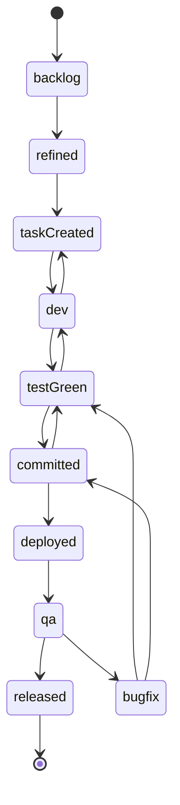

# impl-03 · 任务与缺陷状态机实施方案

> **文档编号**：impl-03-state-machine
> **文档版本**：v1.0
> **对应原型**：`makepro/src/prototypes/ai-sdlc-console`（数据源 `data.ts`：`TASK_STATES` / `TASK_STATE_MAP` / `BUG_STATE_FLOW` / `BUG_SLA_POLICIES`）
> **依赖文档**：
> - `docs/AI研发平台设计方案.md`（渐变状态机章节）
> - `impl-00-overview.md`（任务 10 状态表、组件清单、命名规范）
> - `impl-01-protocol.md`（统一消息信封、`sdlc.<domain>.<event>` 主题规范、`SDLC-<DOMAIN>-<NNN>` 错误码、幂等与退避）
> - `impl-04-data-model.md`（`task` / `task_state_history` / `defect` / `sync_event` 表与 Redis 键设计）
> - `impl-05-integration.md`（PingCode 状态工作流映射与双向同步、防回环）
> - `impl-06-ide-plugin.md`（`dev` → `testGreen` 守卫与 G3 覆盖率阈值）
> - `impl-08-security.md`（脱敏、审计）
> **事实基线**：状态 id/名称/迁移边/SLA 一律以 `data.ts` 为准；`data.ts` 未定义的细节（错误码数值、Redis 键、事件主题）在本文中显式标注「本文定义」。

---

## 目录

- [1. 文档定位与范围](#1-文档定位与范围)
- [2. 任务状态机（10 态）](#2-任务状态机10-态)
- [3. 缺陷状态机（6 态）](#3-缺陷状态机6-态)
- [4. 迁移触发条件与守卫](#4-迁移触发条件与守卫)
- [5. 非法迁移拦截](#5-非法迁移拦截)
- [6. 事件总线主题命名与消息体](#6-事件总线主题命名与消息体)
- [7. Redis Streams 消费组与重试](#7-redis-streams-消费组与重试)
- [8. 状态机与 PingCode 工作流映射与冲突处理](#8-状态机与-pingcode-工作流映射与冲突处理)
- [9. 可观测性与运维](#9-可观测性与运维)
- [10. 附录：任务状态 ↔ SDLC 环节 ↔ 门禁 ↔ 通知规则](#10-附录任务状态--sdlc-环节--门禁--通知规则)

---

## 1. 文档定位与范围

### 1.1 定位

本文描述 `state-machine:8084` 服务实现的**任务 10 状态机**与**缺陷 6 状态机**：状态定义、迁移表、守卫条件、非法迁移拦截、事件发布、Redis Streams 消费与重试、以及与 PingCode 工作流的映射与冲突仲裁。

### 1.2 范围

| 在范围内 | 不在范围内 |
|:---|:---|
| 任务 10 态与缺陷 6 态的定义与迁移 | 门禁 G1~G6 的内部校验算法（另见 impl-06） |
| 迁移守卫、幂等与并发控制 | PingCode 适配器全部端点（另见 impl-05） |
| 状态事件主题与消息体 | 通知渠道实现（飞书 / 短信 / 电话，另见通知服务） |
| Redis Streams 消费组、重试、死信 | 数据表 DDL 全量（另见 impl-04） |
| 与 PingCode 的状态映射与冲突仲裁 | 前端看板渲染（另见原型） |

### 1.3 术语

| 术语 | 说明 |
|:---|:---|
| stateId | 状态英文标识，任务态为 camelCase（如 `testGreen`），缺陷态为小写（如 `analyzing`） |
| code | 任务态编码 `T01`~`T10`（`data.ts` `TASK_STATES[].code`） |
| driver | 迁移驱动方：`human` / `ai` / `ai+human`（`data.ts` `TASK_STATES[].driver`） |
| trigger_type | 落库字段（impl-04 `task_state_history`）：`human` / `ai` / `external_sync` / `system` |
| 守卫（guard） | 迁移前置校验，失败返回 `SDLC-STATE-422` |
| 非法迁移 | 不在 `nextStates` 白名单内的迁移，返回 `SDLC-STATE-409` |

---

## 2. 任务状态机（10 态）

### 2.1 状态定义总表

逐字来自 `data.ts` 的 `TASK_STATES`（顺序即 `order`）。

| 顺序 | id | code | 名称 | tone | 驱动（driver） | SLA(h) | 允许的下一状态 | PingCode 状态 |
|:--:|:---|:--:|:---|:---|:---|:--:|:---|:---|
| 1 | `backlog` | T01 | 需求池 | neutral | human | 72 | `refined` | 待评审 |
| 2 | `refined` | T02 | 已拆解 | info | human | 48 | `taskCreated` | 未开始 |
| 3 | `taskCreated` | T03 | 任务已创建 | ai | ai | 8 | `dev` | 未开始 |
| 4 | `dev` | T04 | 开发中 | brand | ai+human | 48 | `testGreen`、`taskCreated` | 处理中 |
| 5 | `testGreen` | T05 | 本地测试通过 | teal | ai+human | 8 | `committed`、`dev` | 处理中 |
| 6 | `committed` | T06 | 已提交 | info | ai+human | 12 | `deployed`、`testGreen` | 处理中 |
| 7 | `deployed` | T07 | 已部署 | brand | ai | 4 | `qa` | 处理中 |
| 8 | `qa` | T08 | 自动化测试中 | warn | ai | 12 | `released`、`bugfix` | 测试中 |
| 9 | `bugfix` | T09 | 缺陷修复中 | danger | ai+human | 24 | `testGreen`、`committed` | 处理中 |
| 10 | `released` | T10 | 已发布 | ok | ai | 0 | （终态，无） | 已关闭 |

> `released` 承接设计方案中的 `Done` 语义（impl-00 §1.4 裁定）。

### 2.2 完整迁移表

| # | from | to | trigger_type | 触发来源 | 守卫（详见 §4） |
|:--:|:---|:---|:---|:---|:---|
| 1 | `backlog` | `refined` | human | 产品完成拆解 | 需求关联 PRD 基线已冻结 |
| 2 | `refined` | `taskCreated` | human | 架构拆解出任务卡 | 至少关联 1 个接口契约 |
| 3 | `taskCreated` | `dev` | ai | Agent 认领任务 | 任务已分配负责人 |
| 4 | `dev` | `testGreen` | ai | 本地测试全绿 | `exitCode === 0 && failed === 0 && coverage >= 85`（impl-06） |
| 5 | `dev` | `taskCreated` | human | 需求变更 / 任务退回 | 附变更说明 |
| 6 | `testGreen` | `committed` | ai | MR 创建并提交 | MR 关联任务卡 |
| 7 | `testGreen` | `dev` | human | 测试未通过 | 附失败用例 |
| 8 | `committed` | `deployed` | ai | 流水线部署成功 | G3 门禁通过 |
| 9 | `committed` | `testGreen` | human | 评审要求返工 | 附评审批注 |
| 10 | `deployed` | `qa` | ai | 进入自动化测试 | 环境健康检查通过 |
| 11 | `qa` | `released` | ai | 测试全通过并发布 | G4 门禁通过、缺陷闭环 |
| 12 | `qa` | `bugfix` | ai | 发现缺陷 | 关联缺陷 id（`BUG-*`） |
| 13 | `bugfix` | `testGreen` | ai | 修复并通过本地测试 | 覆盖率达标 |
| 14 | `bugfix` | `committed` | human | 修复提交 | MR 关联缺陷 |

### 2.3 状态图



---

## 3. 缺陷状态机（6 态）

### 3.1 状态定义

缺陷 6 态：`new` / `analyzing` / `fixing` / `verifying` / `closed` / `reopened`（以 `data.ts` `BUG_STATE_FLOW` 为准）。

| stateId | 名称 | 说明 |
|:---|:---|:---|
| `new` | 新建 | 建单即写入 `pcCode` / `reqId` / `caseIds` / `moduleId`，PingCode 侧同步为「新建」 |
| `analyzing` | 分析中 | AI 分析 Agent 认领或处理人接单，进行根因分析 |
| `fixing` | 修复中 | 根因报告 approved 且创建修复分支，关联 `mrId` / `branch` |
| `verifying` | 验证中 | 修复 MR 合并且流水线全绿，等待复验 |
| `closed` | 已关闭 | 验证通过并回填证据 |
| `reopened` | 重开 | 复验失败或生产再现同类问题 |

> ✅ **命名已统一**：缺陷第三态以 `data.ts` 的 `analyzing` 为准。impl-04 §3.14 `defect.status` 的 CHECK 约束与 impl-05 §4 状态映射表原先写作 `confirmed`，已在 impl-07 交叉校对阶段统一修正为 `analyzing`；若外部系统历史数据仍存 `confirmed`，由 impl-05 的适配层做 `confirmed → analyzing` 单向别名映射。

### 3.2 迁移边（`BUG_STATE_FLOW` 8 条，逐字）

| # | from | to | trigger | actorType | SLA(h) | note |
|:--:|:---|:---|:---|:---|:--:|:---|
| 1 | （无） | `new` | 用例失败自动建单 / 人工建单 / 监控告警建单 | system | 0 | 建单即写入 pcCode、reqId、caseIds、moduleId，PingCode 侧同步为「新建」 |
| 2 | `new` | `analyzing` | 分析 Agent 认领 / 处理人接单 | agent | 2 | P0 要求 30 分钟内进入分析，超时自动电话升级值班 |
| 3 | `analyzing` | `fixing` | 根因分析报告 approved 且创建修复分支 | human | 4 | 必须关联 mrId 与 branch，否则不允许流转 |
| 4 | `fixing` | `verifying` | 修复 MR 合并且流水线全绿 | system | 24 | 由 pipelineId 的成功事件自动驱动，人工不可越过 |
| 5 | `verifying` | `closed` | 验证人复验通过并回填证据 | human | 8 | 必须附用例执行记录（caseIds 全部 passed） |
| 6 | `verifying` | `reopened` | 复验失败 | human | 0 | 本迭代 0 次重开；重开 2 次以上自动升级优先级 |
| 7 | `reopened` | `fixing` | 处理人重新接单 | human | 8 | 重开后 SLA 重新计时，但保留首次超时记录用于效能统计 |
| 8 | `closed` | `reopened` | 生产环境同类问题再现 | human | 0 | 需附新的复现证据，并由需求负责人确认是否属同一根因 |

### 3.3 SLA 策略与升级（`BUG_SLA_POLICIES`）

| id | 优先级 | 名称 | ackMinutes | analyzeHours | fixHours | verifyHours | totalHours | autoBlockRelease |
|:---|:--:|:---|:--:|:--:|:--:|:--:|:--:|:---|
| `SLA-P0` | P0 | 致命 / 资损级 | 5 | 2 | 8 | 14 | 24 | true |
| `SLA-P1` | P1 | 严重 | 15 | 8 | 24 | 40 | 72 | true |
| `SLA-P2` | P2 | 一般 | 60 | 24 | 72 | 24 | 120 | false |
| `SLA-P3` | P3 | 轻微 | 240 | 48 | 96 | 24 | 168 | false |

**升级步骤（`escalations`，`afterHours` 为建单后经过小时数）**：

| 策略 | level | afterHours | toRoleId | channel | notifyId | 动作 |
|:---|:--:|:--:|:---|:---|:---|:---|
| `SLA-P0` | 1 | 0.08 | developer | lark-card | BN-01 | 飞书卡片推送处理人，5 分钟未点击「接单」进入下一级 |
| `SLA-P0` | 2 | 0.25 | architect | sms | BN-02 | 短信通知值班架构师与测试负责人，附 AI 初步定位链接 |
| `SLA-P0` | 3 | 1 | manager | phone | BN-03 | 电话语音升级研发总监（与 DN-05 共用值班电话通道） |
| `SLA-P0` | 4 | 4 | manager | lark-group | BN-04 | 资损级全员广播 + 拉起飞书应急会议，同步变更委员会 |
| `SLA-P1` | 1 | 0.25 | developer | lark-card | BN-01 | 飞书卡片推送处理人，15 分钟未接单提醒一次 |
| `SLA-P1` | 2 | 24 | tester | lark-card | BN-05 | SLA 消耗 1/3 仍停留在 analyzing，通知测试负责人评估是否降级或拆分 |
| `SLA-P1` | 3 | 57.6 | manager | lark-group | BN-08 | SLA 剩余不足 20%，日报置顶并通知研发总监 |
| `SLA-P2` | 1 | 1 | developer | lark-card | BN-05 | 飞书卡片推送处理人，进入当日待办清单 |
| `SLA-P2` | 2 | 96 | tester | lark-group | BN-08 | SLA 剩余不足 20%，纳入每日缺陷日报置顶区 |
| `SLA-P3` | 1 | 4 | developer | lark-card | BN-08 | 仅进入每日缺陷日报，不做即时打扰 |

**类目延长（`categoryOverrides`）**：`SLA-P2` 的「安全合规」类目 `totalHours` 由 120h 延长至 168h（`bugIds: BUG-1052, BUG-1054`），但 G6 一票否决权不变。

> 建单后若超时未确认/未闭环，按上表逐级升级；`autoBlockRelease=true` 的 P0/P1 会写入 G4 门禁 `actual` 并阻断发布。

---

## 4. 迁移触发条件与守卫

### 4.1 守卫表

| 迁移 | 守卫表达式（伪代码） | 失败错误码 |
|:---|:---|:---|
| `backlog` → `refined` | `req.prdVersion != null && req.status == 'frozen'` | `SDLC-STATE-422` |
| `refined` → `taskCreated` | `task.contractIds.length >= 1` | `SDLC-STATE-422` |
| `taskCreated` → `dev` | `task.assigneeId != null` | `SDLC-STATE-422` |
| `dev` → `testGreen` | `report.exitCode == 0 && report.failed == 0 && report.coverage >= 85` | `SDLC-STATE-422` |
| `dev` → `taskCreated` | `ctx.changeNote != null` | `SDLC-STATE-422` |
| `testGreen` → `committed` | `mr.id != null && mr.taskId == task.id` | `SDLC-STATE-422` |
| `testGreen` → `dev` | `ctx.failedCaseIds.length > 0` | `SDLC-STATE-422` |
| `committed` → `deployed` | `gate.G3.status == 'pass'` | `SDLC-STATE-422` |
| `committed` → `testGreen` | `ctx.reviewComments.length > 0` | `SDLC-STATE-422` |
| `deployed` → `qa` | `env.healthCheck == 'ok'` | `SDLC-STATE-422` |
| `qa` → `released` | `gate.G4.status == 'pass' && openDefects == 0` | `SDLC-STATE-422` |
| `qa` → `bugfix` | `ctx.bugId != null` | `SDLC-STATE-422` |
| `bugfix` → `testGreen` | `report.coverage >= 85 && report.failed == 0` | `SDLC-STATE-422` |
| `bugfix` → `committed` | `mr.bugId != null` | `SDLC-STATE-422` |
| `new` → `analyzing`（缺陷） | `bug.assigneeId != null \|\| actor.type == 'agent'` | `SDLC-BUG-409`（本文定义） |
| `analyzing` → `fixing`（缺陷） | `report.approved && bug.mrId != null && bug.branch != null` | `SDLC-BUG-409`（本文定义） |
| `fixing` → `verifying`（缺陷） | `pipeline.status == 'success' && mr.merged` | `SDLC-BUG-409`（本文定义） |
| `verifying` → `closed`（缺陷） | `caseIds.every(passed)` | `SDLC-BUG-409`（本文定义） |

### 4.2 迁移伪代码

```text
function transition(entityType, entityId, from, to, actor, ctx, expectedVersion):
    if dedupHit(msgId): return ALREADY_APPLIED                       # 1) 幂等去重（§5.4）
    if entity.version != expectedVersion: raise SDLC-TASK-409        # 2) 乐观锁（§5.3）
    if to not in NEXT_STATES[from]: raise SDLC-STATE-409             # 3) 白名单校验（§5.1）
    if not guard(from, to, ctx): raise SDLC-STATE-422                # 4) 守卫校验（§4.1）
    BEGIN                                                            # 5) 事务内更新实体 + 写历史
        UPDATE entity SET state = to, version = version + 1, state_entered_at = now()
        INSERT task_state_history(from_state, to_state, trigger_type, trigger_by, trace_id, reason)
    COMMIT
    publish(topicFor(entityType, 'state_changed'), { entityId, from, to, actor, traceId })  # 6) 发布状态事件（§6）
    return OK                                                        # 7) 触发副作用：SLA 计时重置、通知、PingCode 回写
```

### 4.3 守卫失败错误码与提示文案

| 错误码 | 场景 | 响应 `detail` 示例 |
|:---|:---|:---|
| `SDLC-STATE-422` | 任务守卫失败 | `{"guard":"coverage>=85","actual":68.2,"message":"增量分支覆盖率 68.2% 低于门禁阈值 85%，请补充用例后再流转"}` |
| `SDLC-STATE-409` | 非法迁移 | `{"from":"dev","to":"released","allowedNext":["testGreen","taskCreated"]}` |
| `SDLC-TASK-409` | 乐观锁冲突 | `{"expectedVersion":7,"actualVersion":9,"message":"任务已被他人修改，请刷新后重试"}` |
| `SDLC-BUG-409` | 缺陷非法迁移 / 守卫失败（本文定义） | `{"from":"analyzing","to":"fixing","message":"需先关联 mrId 与 branch 且根因报告 approved"}` |
| `SDLC-STATE-403` | 无权限执行该迁移（本文定义） | `{"role":"tester","action":"qa→released","message":"仅测试负责人或 ag-ops 可执行发布"}` |

---

## 5. 非法迁移拦截

### 5.1 允许迁移矩阵（任务态）

行 = from，列 = to；`✔` 表示允许（源自 `nextStates`）。

| from \ to | backlog | refined | taskCreated | dev | testGreen | committed | deployed | qa | bugfix | released |
|:---|:--:|:--:|:--:|:--:|:--:|:--:|:--:|:--:|:--:|:--:|
| `backlog` | — | ✔ | | | | | | | | |
| `refined` | | — | ✔ | | | | | | | |
| `taskCreated` | | | — | ✔ | | | | | | |
| `dev` | | | ✔ | — | ✔ | | | | | |
| `testGreen` | | | | ✔ | — | ✔ | | | | |
| `committed` | | | | | ✔ | — | ✔ | | | |
| `deployed` | | | | | | | — | ✔ | | |
| `qa` | | | | | | | | — | ✔ | ✔ |
| `bugfix` | | | | | ✔ | ✔ | | | — | |
| `released` | | | | | | | | | | — |

### 5.2 非法迁移统一响应

非法迁移（`to` 不在 `NEXT_STATES[from]`）统一返回 **HTTP 409 + `SDLC-STATE-409`**，响应体含 `from` / `to` / `allowedNext`，便于前端提示「当前状态仅可流转到 X / Y」。

### 5.3 幂等与并发控制

- **乐观锁**：`task.version` / `defect.version`，请求携带 `expectedVersion`，不一致返回 `SDLC-TASK-409`。
- **分布式锁**：Redis `lock:task:{taskId}:state`（与 impl-04 §5 一致），SET NX PX 5000，保证同一实体的迁移串行化。
- **幂等键**：`SET idem:{clientId}:{key} 1 NX EX 86400`（与 impl-01 §6 一致），去重窗口 24h。

### 5.4 重复事件去重

- **事件级去重**：`dedup:sync:{msgId}`（同步来源，impl-04）/ `dedup:event:{msgId}`（本文定义，事件总线来源），SET NX EX 86400。
- **乱序处理**：若收到 `seq` 小于已应用序号的迁移请求，记为 `SDLC-PROTO-409`（impl-01），不执行迁移。
- **重放窗口**：`REPLAY_WINDOW=5000`（impl-01 §7），窗口外的重放直接丢弃并告警。

---

## 6. 事件总线主题命名与消息体

### 6.1 主题命名规范

沿用 impl-01 §1：`sdlc.<domain>.<event>`，分隔符为**下划线**（如 `sdlc.task.state_changed`）。订阅通配见 impl-01 §3.2（`sdlc.task.*`、`sdlc.bug.*`、`sdlc.pipeline.*`、`sdlc.gate.*`、`sdlc.notify.*`、`sdlc.sync.*`）。

| 主题 | 发布时机 | 对应前端消息类型（impl-01 §3.2） |
|:---|:---|:---|
| `sdlc.task.state_changed` | 任务状态迁移成功 | `task.state_changed` |
| `sdlc.task.transition_rejected` | 任务迁移被拒（守卫/非法）（本文定义） | `error` |
| `sdlc.task.sla_breach` | 任务超 SLA（本文定义） | `notify.push` |
| `sdlc.bug.created` | 缺陷建单 | `bug.created` |
| `sdlc.bug.state_changed` | 缺陷状态迁移（本文定义） | `bug.created`（复用缺陷通道） |
| `sdlc.bug.sla_escalated` | 缺陷 SLA 升级（本文定义） | `notify.push` |
| `sdlc.gate.result` | 门禁结果 | `gate.result` |
| `sdlc.pipeline.stage_updated` | 流水线阶段更新 | `pipeline.stage_updated` |
| `sdlc.sync.status` | 外部同步状态 | `sync.status` |

> ⚠ 与 impl-05 §6 的 `sdlc.integration.*` 区分：`sdlc.integration.*` 为 **PingCode Webhook 入站**事件；本节主题为**平台内部状态机出站**事件。

### 6.2 消息体示例

**`sdlc.task.state_changed`**：

```json
{ "msgId": "0192f3a1-8c2e-7a41-b7d2-3f9a1c0e5b6d", "type": "task.state_changed", "traceId": "0192f3a1-8c2e-7a41-b7d2-3f9a1c0e5b6e", "seq": 128, "ts": "2026-03-19T15:22:10+08:00",
  "payload": { "taskId": "TASK-2401", "from": "dev", "to": "testGreen", "triggerType": "ai", "triggerBy": "ag-code", "reason": "本地测试全绿，覆盖率 88%", "version": 8, "stateEnteredAt": "2026-03-19T15:22:10+08:00" } }
```

**`sdlc.task.transition_rejected`**（本文定义）：

```json
{ "msgId": "0192f3a1-...", "type": "error", "traceId": "0192f3a1-...",
  "payload": { "code": "SDLC-STATE-422", "entityType": "task", "entityId": "TASK-2407", "from": "dev", "to": "testGreen", "detail": { "guard": "coverage>=85", "actual": 68.2 } } }
```

**`sdlc.bug.created`**：

```json
{ "msgId": "0192f3b2-...", "type": "bug.created", "traceId": "0192f3b2-...",
  "payload": { "bugId": "BUG-1043", "pcCode": "PC-BUG-2043", "reqId": "REQ-2401", "caseIds": ["TC-010"], "moduleId": "tm-promo", "priority": "P0", "status": "new", "slaPolicyId": "SLA-P0" } }
```

**`sdlc.bug.state_changed`**（本文定义）：

```json
{ "msgId": "0192f3c3-...", "type": "bug.created", "traceId": "0192f3c3-...",
  "payload": { "bugId": "BUG-1043", "from": "analyzing", "to": "fixing", "actorType": "human", "actorId": "u-10231", "mrId": "MR-2410", "branch": "fix/order-amount-precision", "trace_id": "0192f3c3-..." } }
```

**`sdlc.bug.sla_escalated`**（本文定义）：

```json
{ "msgId": "0192f3d4-...", "type": "notify.push", "traceId": "0192f3d4-...",
  "payload": { "bugId": "BUG-1043", "policyId": "SLA-P0", "level": 2, "afterHours": 0.25, "toRoleId": "architect", "channel": "sms", "notifyId": "BN-02" } }
```

### 6.3 与前端 WebSocket 订阅的对应

前端经 `client.subscribe`（impl-01 §3.1）订阅 `sdlc.task.*`、`sdlc.bug.*` 等通配主题；服务端在 `server.subscribe.ack` 返回确认后，将对应事件经 `wss-hub:8081` 推送。任务详情页订阅 `sdlc.task.state_changed`，看板订阅 `sdlc.task.*`，缺陷页订阅 `sdlc.bug.*`。

---

## 7. Redis Streams 消费组与重试

### 7.1 Stream 键与消费组

主通道沿用 impl-04 §5：`stream:sdlc.events`（MAXLEN ~ 1e6）。已有消费组 `stream:grp:notify` / `stream:grp:sync` / `stream:grp:console`；状态机专属消费组为**本文定义**。

| 键 / 组 | 类型 | 用途 | 来源 |
|:---|:---|:---|:---|
| `stream:sdlc.events` | Stream | 事件总线主通道，MAXLEN ≈ 1e6 | impl-04 §5 |
| `stream:grp:notify` | 消费组 | 通知服务消费 | impl-04 §5 |
| `stream:grp:sync` | 消费组 | 外部同步消费 | impl-04 §5 |
| `stream:grp:console` | 消费组 | 控制台推送消费 | impl-04 §5 |
| `stream:grp:state` | 消费组 | 状态机副作用消费（SLA 计时、通知触发）（本文定义） | 本文定义 |
| `q:sync:retry` | ZSet | 同步重试队列 | impl-04 §5 |
| `q:sync:dead` | List | 同步死信队列 | impl-04 §5 |
| `q:state:retry` | ZSet | 状态机重试队列（本文定义） | 本文定义 |
| `q:state:dead` | List | 状态机死信队列（本文定义） | 本文定义 |
| `stream:sdlc.events:dlq` | Stream | 事件总线死信流（本文定义） | 本文定义 |
| `lock:task:{taskId}:state` | String | 迁移串行化锁 | impl-04 §5 |
| `dedup:event:{msgId}` | String | 事件去重 | 本文定义 |

### 7.2 消费流程（XREADGROUP / XACK）

```text
# 消费
XREADGROUP GROUP stream:grp:state consumer-{podId} COUNT 50 BLOCK 2000 STREAMS stream:sdlc.events >
# 处理成功
XACK stream:sdlc.events stream:grp:state {id}
# 处理失败 → 重试队列（指数退避 15/30/60/120/240s，maxAttempts=5，与 impl-05 §8 对齐）
ZADD q:state:retry {now + backoff} {id}
# 超过 maxAttempts → 死信
RPUSH q:state:dead {payload}
```

### 7.3 Pending 处理

- 每 60s 执行 `XPENDING stream:sdlc.events stream:grp:state` 检查未 ACK 消息。
- 空闲 > 5 分钟的 Pending 由 `XAUTOCLAIM` 认领重投（`min-idle-time=300000`）。
- 认领次数达 `maxAttempts` 仍失败则转 `q:state:dead`。

### 7.4 死信与人工重放

- 死信落 `q:state:dead` 与 `stream:sdlc.events:dlq`，保留原始 `msgId` / `traceId` / 失败原因。
- 人工经控制台触发重放：读取死信 → 重新 `XADD` 到 `stream:sdlc.events` → 记 `audit_log`（`category=security`）。
- 重放需校验 `dedup:event:{msgId}`，避免重复应用。

### 7.5 顺序性保证

- 同一实体（`taskId` / `bugId`）的迁移经 `lock:task:{taskId}:state` 串行化，天然保证单实体顺序。
- 跨实体无全局顺序要求；消费端按 `seq` 丢弃乱序旧事件（`SDLC-PROTO-409`）。
- `MAXLEN ≈ 1e6` 防止 Stream 无限增长；超长时按 `MAXLEN ~` 近似裁剪，死信与审计日志为最终事实源。

---

## 8. 状态机与 PingCode 工作流映射与冲突处理

### 8.1 状态映射表（与 impl-05 §5 一致）

| stateId | code | 平台状态名 | PingCode 状态 | 方向 | 同步模式 |
|:---|:--:|:---|:---|:---|:---|
| `backlog` | T01 | 需求池 | 待评审 | 双向 | 自动 |
| `refined` | T02 | 已拆解 | 未开始 | 双向 | 自动 |
| `taskCreated` | T03 | 任务已创建 | 未开始 | 单向（出） | 自动 |
| `dev` | T04 | 开发中 | 处理中 | 双向 | 自动 |
| `testGreen` | T05 | 本地测试通过 | 处理中 | 单向（出） | 自动 |
| `committed` | T06 | 已提交 | 处理中 | 单向（出） | 自动 |
| `deployed` | T07 | 已部署 | 处理中 | 单向（出） | 自动 |
| `qa` | T08 | 自动化测试中 | 测试中 | 双向 | 自动 |
| `bugfix` | T09 | 缺陷修复中 | 处理中 | 双向 | 自动 |
| `released` | T10 | 已发布 | 已关闭 | 双向 | 自动 |

> 多对一反向映射消歧：`dev` / `testGreen` / `committed` / `deployed` / `bugfix` 在 PingCode 侧均为「处理中」，反向同步时按「保持平台当前态」处理（详见 impl-05 §5）。

### 8.2 双向同步回写方向与优先级

| 场景 | 优先级 | 处理 |
|:---|:---|:---|
| 平台内迁移（人工/AI） | 平台优先 | 发布 `sdlc.task.state_changed` → `integration-adapter` 回写 PingCode |
| PingCode Webhook 变更 | 平台优先（默认） | 若与平台态冲突，保留平台态并记录 `sync_event` 冲突 |
| 平台与 PingCode 同时变更 | 按 `state_entered_at` 时间戳 | 较新者胜，旧者丢弃并记 `state_conflict` |

### 8.3 冲突仲裁

- **仲裁规则**：以平台状态为权威（source of truth），PingCode 侧变更仅在平台未处于「终态」时被接受。
- **冲突分类**（与 impl-05 §9 一致）：`missing_remote` / `missing_local` / `field_mismatch` / `state_conflict`。
- **冲突处理**：`state_conflict` 进入对账队列，人工确认后回写；期间不自动覆盖。

### 8.4 幂等 external_id 映射

- 平台实体与 PingCode 实体经 `external_id_map`（impl-04 §3.16）建立映射，键为 `(entityType, localId)` ↔ `externalId`。
- 回写前先查映射；不存在则创建，存在则更新，保证同一实体不重复建单。

### 8.5 重试与对账

- **重试**：退避 15s → 30s → 60s → 120s → 240s，`maxAttempts=5`，失败入 `q:sync:dead`（与 impl-05 §8 一致）。
- **对账**：定时任务拉取 PingCode 全量状态，按 §8.3 差异分类比对，输出对账报告（算法见 impl-05 §9）。

---

## 9. 可观测性与运维

### 9.1 埋点字段

`task_state_history`（impl-04 §3.7）：`from_state` / `to_state` / `trigger_type` / `trigger_by` / `trace_id` / `reason`。
`sync_event`（impl-04 §3.17）：`topic` / `direction` / `msg_id` / `status` / `attempts` / `next_retry_at`。

### 9.2 看板指标

| 指标 | 定义 | 目标（本文定义） |
|:---|:---|:---|
| 状态驻留时长 | 各状态 `state_entered_at` 差值 | 不超过 `TASK_STATES[].slaHours` |
| 迁移成功率 | 成功迁移 / 总迁移请求 | ≥ 99% |
| 非法迁移率 | `SDLC-STATE-409` 次数占比 | ≤ 1% |
| 守卫失败率 | `SDLC-STATE-422` 次数占比 | 按状态分层监控 |
| Stream Pending 数 | `XPENDING` 长度 | ≤ 100 |
| 死信数 | `q:state:dead` / `stream:sdlc.events:dlq` 长度 | 0 |
| 同步冲突数 | `state_conflict` 计数 | 逐案清零 |

### 9.3 告警规则（本文定义）

| 规则 | 条件 | 级别 |
|:---|:---|:---|
| 迁移失败突增 | 5 分钟内 `SDLC-STATE-422` > 20 | 警告 |
| Pending 堆积 | `XPENDING` > 500 持续 5 分钟 | 严重 |
| 死信非空 | `q:state:dead` > 0 | 严重 |
| SLA 超时 | 任务超 `slaHours` 或缺陷触发升级 | 按 §3.3 逐级 |
| 状态机降级 | `SDLC-STATE-503`（impl-00 §6.3）触发 | 严重 |

### 9.4 常见故障排查手册

| 现象 | 可能原因 | 处置 |
|:---|:---|:---|
| 状态无法流转，返回 `SDLC-STATE-409` | 目标状态不在白名单 | 核对 `NEXT_STATES[from]`，确认是否为合法路径 |
| 状态无法流转，返回 `SDLC-STATE-422` | 守卫未满足（如覆盖率 < 85%） | 查看 `detail.guard` 与 `detail.actual`，补齐前置条件 |
| 返回 `SDLC-TASK-409` | 乐观锁版本冲突 | 刷新实体取最新 `version` 重试 |
| 状态回退到旧值 | 收到乱序旧事件 | 检查 `seq`，确认 `SDLC-PROTO-409` 是否被忽略 |
| 与 PingCode 状态不一致 | 同步失败或冲突 | 查 `sync_event`，触发对账，人工仲裁 |
| 状态事件重复推送 | 去重键过期或缺失 | 检查 `dedup:event:{msgId}` TTL |
| 状态机只读 | PG 主库不可用 | 见 impl-00 §6.3，返回 `SDLC-STATE-503`，等待主库恢复 |

---

## 10. 附录：任务状态 ↔ SDLC 环节 ↔ 门禁 ↔ 通知规则

| stateId | 名称 | 所属环节 | 门禁 | 通知触发 |
|:---|:---|:---|:--:|:---|
| `backlog` | 需求池 | `st-req` 需求澄清 | G1 | 进入需求池通知产品 |
| `refined` | 已拆解 | `st-arch` 架构设计 | G2 | 拆解完成通知架构师 |
| `taskCreated` | 任务已创建 | `st-arch` 架构设计 | G2 | 任务分配通知开发者 |
| `dev` | 开发中 | `st-code` 编码实现 | G3 | 任务启动通知 |
| `testGreen` | 本地测试通过 | `st-code` 编码实现 | G3 | 覆盖率达标通知评审 |
| `committed` | 已提交 | `st-code` 编码实现 | G3 | MR 创建通知评审人 |
| `deployed` | 已部署 | `st-deploy` 部署发布 | G5 | 部署成功通知测试 |
| `qa` | 自动化测试中 | `st-test` 测试验证 | G4 | 进入测试通知测试负责人 |
| `bugfix` | 缺陷修复中 | `st-test` 测试验证 | G4 | 缺陷发现通知处理人（关联 `BUG-*`） |
| `released` | 已发布 | `st-deploy` 部署发布 | G5 / G6 | 发布完成通知全员 |

> 缺陷 SLA 通知规则：按 §3.3 的 `escalations` 与 `notifyIds`（BN-01 ~ BN-08）执行；P0/P1 的 `autoBlockRelease=true` 会写入 G4 门禁 `actual`。
> 本文定义的事件主题：`sdlc.task.transition_rejected`、`sdlc.task.sla_breach`、`sdlc.bug.state_changed`、`sdlc.bug.sla_escalated`。
> 本文定义的 Redis 键：`stream:grp:state`、`q:state:retry`、`q:state:dead`、`stream:sdlc.events:dlq`、`dedup:event:{msgId}`。
> 本文定义的错误码：`SDLC-BUG-409`、`SDLC-STATE-403`。其余错误码沿用 impl-01 §4.10、impl-00 §6.3。
