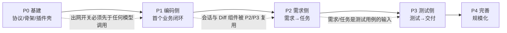

# impl-09 实施路线图与团队分工

> 版本：v1.0 ｜ 对应设计方案 v1.0（第 8、9、10 节）｜ 日期：2026-09-24

## 本篇范围

本篇给出「AI 研发协作平台」的**分阶段实施计划（P0~P4）**、**团队编制与人力分配**、**里程碑与关键路径**、**风险登记表**，以及 **MVP（P0+P1）的可执行验证脚本**。目标是让项目经理可直接据此建立排期与验收看板，让工程负责人可直接按阶段开工。

本篇**不**覆盖：

- 各阶段交付物的技术细节 → 见 `impl-00`~`impl-08`（本篇只引用其「可验收标准」作为阶段出口）
- 业务侧研发流程改造（需求模板、评审机制）→ 属组织流程，非本平台交付范围
- 商业定价与采购 → 不在技术实施范围

## 关联文档

| 文档 | 与本篇的关系 |
|:---|:---|
| `docs/AI研发平台设计方案.md` | 路线（8 节）、团队（9 节）、风险（10 节）的直接上游 |
| `impl-00-overview.md` | 组件清单（15 个）与部署形态，决定 P0 的部署任务粒度 |
| `impl-01-protocol.md` | P0 交付物「通信协议」的验收依据 |
| `impl-04-data-model.md` | P0 交付物「数据模型与迁移」的验收依据 |
| `impl-05-integration.md` | P1 交付物「PingCode 写入」的验收依据 |
| `impl-06-ide-plugin.md` | P0 插件壳 / P1 双向闭环的冒烟用例（SMK-01~12） |
| `impl-08-security.md` | P0 出网开关、P2 审计与合规的验收依据 |

---

## 1. 路线图总览

### 1.1 阶段总表

| 阶段 | 里程碑 | 核心内容 | 周期 | 累计周 | 前置依赖 | 并行度 |
|:---|:---|:---|:---:|:---:|:---|:---|
| **P0 基建** | 骨架跑通 | 项目骨架、模型网关、通信协议、双 IDE 插件壳、控制台框架、出网开关 | 2-3 周 | 3 | 无 | 4 条流并行：后端骨架 / 协议层 / 双端插件壳 / 控制台框架 |
| **P1 编码侧** | 首个闭环 | 编码 Agent + 代码补全 / Diff + 本地构建测试回传 + PingCode 任务写入 | 4-6 周 | 9 | P0 全部；需 PingCode 测试租户与 GitLab 机器人账号 | 3 条流并行：Agent 与网关 / 插件功能 / 集成写入 |
| **P2 需求侧** | 需求到任务 | 需求澄清 Agent（PRD）+ 架构设计 Agent（拆解 / 估算）+ 排期规则引擎 | 3-4 周 | 13 | P1（复用会话与 Diff 基建）；需 RAG 知识库首批 11 条 | 2 条流并行：Agent 与 RAG / 控制台页面 |
| **P3 测试侧** | 交付闭环 | 测试生成 Agent（用例 + 报告）+ Bug 流转与 AI 归因 + 部署流水线可视化 | 4-6 周 | 19 | P2；需 Jenkins/SonarQube/Harbor 只读凭据 | 3 条流并行：测试 Agent / 缺陷域 / 流水线与门禁 |
| **P4 完善** | 规模化 | 效能报表、多模型路由、RAG 扩充、多项目管理适配器（Jira/禅道/ONES/TAPD） | 持续 | — | P3 | 按需并行，可纳回 P3 尾部 |

### 1.2 阶段间的硬依赖（不可并行项）



| 硬依赖 | 原因 | 若违反的后果 |
|:---|:---|:---|
| P0 通信协议先于所有业务功能 | 所有域都走统一信封 | 后期改协议需改全部模块 |
| P0 出网开关先于首次模型调用 | 合规红线，不能「先跑通再补」 | 首月即产生未受控的代码出域记录 |
| P0 数据模型与迁移先于 P1 | `task` / `code_link` / `build` 是闭环载体 | 返工迁移脚本与索引 |
| P1 闭环先于 P2 | P2 的需求面板复用 `context.push` 会话与 Diff 组件 | 重复建设通信与会话层 |
| P2 先于 P3 | 测试用例挂在需求/任务上 | 用例无宿主对象，需补数据回填 |

---

## 2. 各阶段详细计划

### 2.1 P0 基建（2-3 周）

| # | 工作项 | 交付物 | 负责角色 | 验收标准（可执行） |
|:--|:---|:---|:---|:---|
| P0-1 | 仓库骨架与 CI | monorepo（`packages/*`）+ 流水线 | 后端 A | `pnpm -r build` 全绿；CI 含 lint / test / 镜像构建 |
| P0-2 | 数据模型与迁移 | `impl-04` 的 20 张表 DDL + `node-pg-migrate` 迁移 | 后端 A | `node-pg-migrate up` 空库执行成功；`down` 可完整回滚 |
| P0-3 | 通信协议与契约测试 | 信封、`client.hello`、REST 骨架 + `events.yaml` | 后端 B + 前端 | 契约测试覆盖 `impl-01 §3` 全部类型；未知 `type` 返回 `SDLC-PROTO-400` |
| P0-4 | `api-gateway` + `wss-hub` 骨架 | 鉴权（JWT RS256）、握手、心跳、退避重连 | 后端 B | `client.hello`→`server.welcome` 3s 内完成；断连退避序列 1/2/4/8/16/30s |
| P0-5 | `model-gateway` + `mdl-local` | 5 模型配置、路由规则、限流、成本计量 | 后端 B + AI | 单模型连续 5 次超时触发熔断降级；`model_call_log` 有计量行 |
| P0-6 | 出网开关 | 三档策略 + CP-1~CP-7 校验点 | 后端 B + 运维 | `DENY` 档下外部模型调用返回 `SDLC-SEC-403`；变更落审计 |
| P0-7 | 双 IDE 插件壳 | 连接、任务卡只读、心跳、离线队列 | 插件 A/B | `impl-06 §8.1` 中 SMK-01~03 通过（双端） |
| P0-8 | 控制台框架 | 13 页面路由 + 6 角色 Mock 切换 + WSS 订阅 | 前端 | 13 个路由可达；订阅主题 `sdlc.*` 收到后局部刷新 |
| P0-9 | 部署与可观测 | Helm Chart（私有化 / SaaS 两套 values）、Prometheus/Loki | 运维 | 从零部署到 `GET /readyz` 全绿 ≤ 30 min |

**P0 出口判据**：本地部署一套环境后，两个 IDE 各能握手成功、个人任务卡可见（只读）、`egressPolicy=DENY` 可被接口读回，且审计中有 P0-6 的配置变更记录。

### 2.2 P1 编码侧（4-6 周）

| # | 工作项 | 交付物 | 负责角色 | 验收标准 |
|:--|:---|:---|:---|:---|
| P1-1 | 上下文采集器 | 文件树 / 选中 / Git diff / LSP 符号 | 插件 A/B | `impl-06 §8.1` SMK-04~06 通过（双端） |
| P1-2 | 脱敏与最小切片上传 | 客户端预脱敏（`rd-01/02/04/05/08/09`）+ 双通道上传 | 插件 A/B + 后端 B | SMK-07~08 通过；超限返回 `SDLC-SEC-413` |
| P1-3 | 编码实现 Agent（`ag-code`） | 会话、工具调用、Diff 产出、采纳率统计 | AI + 后端 B | 单任务端到端产出可应用的 Diff；会话记录的 `acceptRate` 有值 |
| P1-4 | Diff 审查 UI | 块级接受 / 拒绝 + 局部修改 | 前端 + 插件 A/B | SMK-12 通过；`coding.diff.decision` 上报云端 |
| P1-5 | 本地构建测试执行器 | Maven / Gradle / pytest / npm / go / cargo 探测与解析 | 插件 A/B | `impl-06 §8.1` SMK-09~11 通过（两端至少各覆盖 Maven + pytest） |
| P1-6 | 状态机与事件总线 | 10 状态迁移 + 守卫 + `task_state_history` | 后端 A | `dev`→`testGreen` 覆盖率 < 85% 时返回 `SDLC-STATE-422` |
| P1-7 | PingCode 任务写入 | `createTask` / `createRequirement` / `updateTaskStatus` | 后端 C | 幂等键冲突不产生重复工作项；`external_id_map` 有映射行 |
| P1-8 | 订阅回写与幂等 | `watchWorkItems` + 三层防回环 | 后端 C | 外部改状态 5s 内反映到平台；回写不产生回环（`sync_event` 无自增风暴） |
| P1-9 | 失败重试与死信 | 指数退避 `15s→240s`、死信兜底、对账作业 | 后端 C | 模拟 PingCode 429 连续 10 次进入死信；`/reconcile` 可手动触发 |

**P1 出口判据（MVP 达标）**：见 §6 验证脚本全绿。

### 2.3 P2 需求侧（3-4 周）

| # | 工作项 | 交付物 | 负责角色 | 验收标准 |
|:--|:---|:---|:---|:---|
| P2-1 | 需求澄清 Agent（`ag-pm`） | Brainstorm 会话 + PRD 生成 + 版本对比 | AI + 后端 B | 一句话需求产出含用户故事的 PRD 草稿；`prd_version` 有 diff 摘要 |
| P2-2 | 架构设计 Agent（`ag-arch`） | 架构画布、OpenAPI 契约、任务拆解与估时 | AI + 后端 B | 拆解结果写入 `task`（状态 `taskCreated`）且含 `estimateHours` |
| P2-3 | 排期规则引擎 | 甘特 + 冲突检测（资源 / 依赖 / 产能 / 截止 / 门禁） | 后端 A | 与 `data.ts` `GANTT_CONFLICTS` 同类冲突可被检出并给出 `suggestion` |
| P2-4 | RAG 服务与首批知识库 | pgvector 检索、11 条知识库、注入开关 | AI | 代码生成前注入命中条目（`kbHits` 非空）；检索 P95 ≤ 1s |
| P2-5 | 需求工作台 / 架构设计页 | 2 个控制台页面 | 前端 | 页面数据全部来自 `/api/v1/requirements`、`/prd-versions`、`/ai/rag/entries` |
| P2-6 | 审计与合规（安全域二期） | 审计查询页、脱敏规则管理、RBAC 矩阵页 | 前端 + 后端 B | `impl-08 §8` 中 C-01~C-06、C-11 可勾选 |

### 2.4 P3 测试侧（4-6 周）

| # | 工作项 | 交付物 | 负责角色 | 验收标准 |
|:--|:---|:---|:---|:---|
| P3-1 | 测试生成 Agent（`ag-test`） | 用例生成（脑图 / Excel）、用例库导入导出 | AI + 后端 B | 导入 XMind 解析成功并落 `test_case`；导出可再导入（幂等） |
| P3-2 | 测试计划与执行 | `test_plan` / `test_execution`、报告结论与门禁判定 | 后端 A | `POST /test-plans/{id}/execute` 产出 `conclusion` 与 `gateVerdict` |
| P3-3 | 缺陷域与 AI 归因 | Bug 流转、`ag-ba` 根因分析、指派建议、SLA 通知 | 后端 A + AI | P0 缺陷 5 分钟内首响（对齐 `BUG_SLA_POLICIES`）；`analysis` 返回 `suspects` |
| P3-4 | 流水线与门禁可视化 | 6 道门禁（G1~G6）、发布单批次、灰度与回滚 | 后端 C + 前端 | G3 覆盖率 < 85% 时发布单被阻塞；`waive` 需 `approve` 权限并留痕 |
| P3-5 | 部署运维 Agent（`ag-ops`） | 流水线编排、部署通知 | AI + 后端 C | 部署状态经 `sdlc.pipeline.*` 推送；通知经飞书卡片下发 |
| P3-6 | 可观测分析 Agent（`ag-ba`） | Prometheus/SkyWalking/Loki 聚合与异常归因 | AI + 运维 | G6 门禁可自动产出扫描结论与整改建议 |
| P3-7 | 效能报表 | 交付效率、AI 采纳率、Token 成本多维报表 | 前端 | 报表口径与 `/metrics/*` 一致，可按 `dim=project\|team\|person` 下钻 |

### 2.5 P4 完善（持续）

| # | 工作项 | 验收标准 |
|:--|:---|:---|
| P4-1 | 多模型路由策略自优化 | 路由规则可按场景 A/B 并输出成本 / 时延对比 |
| P4-2 | RAG 知识库持续扩充 | 月度新增条目 ≥ 20，命中率（有用反馈占比）≥ 70% |
| P4-3 | 多项目管理适配器 | 新增 `JiraProvider` 仅实现 `ProjectMgmtProvider` 接口，不改业务代码 |
| P4-4 | 私有化版本能力补齐 | 离线升级包 + 无外网环境下 `mdl-local` 承担全部 Agent 场景 |

---

## 3. 团队分工与人力分配

### 3.1 角色编制（6-9 人）

| 编号 | 角色 | 人数 | 主要职责 | 对应 `ROLES` 视角 |
|:---|:---|:---:|:---|:---|
| R1 | 后端 A：状态机与业务域 | 1 | `state-machine`、任务 / 测试 / 缺陷域、迁移与索引 | `developer` |
| R2 | 后端 B：网关与 AI 平台 | 1 | `api-gateway`、`wss-hub`、`model-gateway`、出网与脱敏 | `developer` |
| R3 | 后端 C：集成与流水线 | 0.5-1 | `integration-adapter`、`pipeline`、门禁与发布 | `developer` |
| R4 | 前端 / 控制台 | 1-2 | 13 个页面、报表、审计查询 | `developer` |
| R5 | IDE 插件 A：VS Code | 1 | TypeScript 插件全部模块 | `developer` |
| R6 | IDE 插件 B：JetBrains | 1 | Kotlin 插件全部模块 | `developer` |
| R7 | AI 工程 | 1 | Prompt / Agent 编排、RAG、模型评测与成本 | `developer` |
| R8 | 架构 / 技术负责人 | 0.5 | 契约评审、跨端一致性、红线守护 | `architect` |
| R9 | 测试 / 质量 | 0.5-1 | 冒烟与回归、门禁阈值校准、验收 | `tester` |
| R10 | 运维 / SRE | 0.5 | 部署、可观测、密钥与出口代理 | `ops` |
| **合计** | — | **6-9** | — | — |

> 说明：0.5 FTE 表示可由同一人兼任（如 R8 兼 R3、R9 兼 R10），这正是 6 人与 9 人的区间来源。

### 3.2 各阶段人力投入（人周）

| 角色 | P0 (3w) | P1 (6w) | P2 (4w) | P3 (6w) | P4 |
|:---|:---:|:---:|:---:|:---:|:---:|
| R1 后端 A | 3 | 6 | 4 | 6 | 按需 |
| R2 后端 B | 3 | 6 | 4 | 3 | 按需 |
| R3 后端 C | 1.5 | 6 | 1 | 6 | 按需 |
| R4 前端 | 3 | 4 | 4 | 6 | 按需 |
| R5 插件 A | 3 | 6 | 2 | 2 | 按需 |
| R6 插件 B | 3 | 6 | 2 | 2 | 按需 |
| R7 AI 工程 | 1.5 | 6 | 4 | 4 | 按需 |
| R8 架构 | 1.5 | 3 | 2 | 3 | 按需 |
| R9 测试 | 0.5 | 3 | 2 | 6 | 按需 |
| R10 运维 | 1.5 | 1.5 | 1 | 2 | 按需 |
| **阶段合计** | **21** | **47.5** | **26** | **40** | — |

P0~P3 累计约 **134.5 人周**；按 7 人并行计算 ≈ **19 周**，与 §1.1 的累计 19 周吻合。

### 3.3 关键交接点（RACI 摘要）

| 交接物 | 上游 | 下游 | 交接验收 |
|:---|:---|:---|:---|
| 协议 Schema（`protocol/`） | R2 | R4/R5/R6 | `schema-gen --check` 无 diff |
| 数据模型迁移 | R1 | R2/R3/R4 | 空库 `up`/`down` 双向可执行 |
| 接口契约（OpenAPI） | R8 评审 | R2/R3 | 契约测试用例全绿 |
| 插件冒烟报告 | R5/R6 | R9 | 双端 12/12 通过且报文一致 |
| 门禁阈值配置 | R9 | R3 | 阈值与 `impl-03` 守卫一致 |
| 出网策略上线 | R2/R10 | R8 审核 | `GET /security/egress` 与配置一致 + 审计可查 |

---

## 4. 里程碑与关键路径

### 4.1 里程碑表

| 里程碑 | 名称 | 时点 | 判定（Go / No-Go） |
|:---|:---|:---|:---|
| M0 | 项目启动与契约冻结 | 第 0 周 | `impl-01`/`impl-04` 评审通过，协议 Schema 入库 |
| M1 | P0 骨架跑通 | 第 3 周末 | 双端握手 + 出网开关生效 + 一键部署 ≤ 30 min |
| M2 | MVP 首个闭环 | 第 9 周末 | §6 验证脚本全绿（一句话需求 → PingCode 任务 → AI 编码 → 本地测试 → 状态回写） |
| M3 | 需求到任务 | 第 13 周末 | 拆解产出可排期甘特且冲突可检出 |
| M4 | 交付闭环 | 第 19 周末 | 测试报告 + Bug 流转 + 发布门禁阻塞生效 |
| M5 | 试点推广 | 第 20-24 周 | 在 `SP-24`（2026-03-02 ~ 03-27，订单中心重构，24 个任务）上完成全流程试点 |
| M6 | 规模化 | 第 25 周起 | 多项目接入（≥ 3 个项目实例），报表口径稳定 |

### 4.2 关键路径（以试点迭代为例）

平台自身实施的关键路径（P0→P1→P2→P3）之外，**业务试点**的关键路径直接复用原型数据（`data.ts` `CRITICAL_PATH`）：

```
TASK-2401 → TASK-2403 → TASK-2405 → TASK-2413 → TASK-2412 → TASK-2409
          → TASK-2410 → TASK-2411 → TASK-2419 → TASK-2420 → TASK-2421
```

| 关键路径环节 | 平台能力依赖 | 未就绪时的影响 |
|:---|:---|:---|
| TASK-2401（幂等下单主链路） | 编码 Agent + Diff + 本地测试回传（P1） | 试点无法启动 |
| TASK-2403 / TASK-2405 | 状态机与门禁（P1 + P3） | 覆盖率门禁无法阻塞，质量失控 |
| TASK-2409 ~ TASK-2411 | 流水线可视化与发布门禁（P3） | 发布单无法分批复验 |
| TASK-2419 ~ TASK-2421 | 可观测与合规扫描（P3） | G6 门禁与整改闭环缺失 |

**关键路径看护规则**：关键路径任务每日站会过一遍状态；`state` 停留在非终态超过 SLA（`T01=72h`、`T04=48h`、`T03=8h`，见 `TASK_STATES`）即进入阻塞清单，由 PMO 角色（`pmo`）推动。

---

## 5. 风险登记表

概率 / 影响：高 / 中 / 低；等级 = 概率 × 影响。

| 编号 | 风险 | 概率 | 影响 | 等级 | 触发信号 | 应对措施 | 责任人 |
|:---|:---|:---:|:---:|:---:|:---|:---|:---|
| RK-01 | 代码安全与合规不达标 | 中 | 高 | 高 | 出域审计出现未脱敏内容；合规评审不通过 | P0 即上线出网开关（fail-closed）；脱敏双防线；私有化形态默认 `DENY` + `mdl-local`；G6 门禁纳入发布前置 | R8 + R2 |
| RK-02 | 模型生成质量不稳定 | 高 | 中 | 高 | Diff 采纳率 < 60%；返工率上升 | 多模型路由 + RAG 注入企业规范（KB-CODE-02）+ 强制人工 Diff 把关；低置信度（< 90%）转人工 | R7 |
| RK-03 | PingCode 接口变更 | 中 | 中 | 中 | 集成契约测试失败；`SDLC-INTG-502` 上升 | `ProjectMgmtProvider` 适配层隔离 + 每日契约测试；变更只改实现类 | R3 |
| RK-04 | 跨 IDE 一致性劣化 | 中 | 中 | 中 | 双端冒烟报文不一致 | 协议单一事实源 + CI 契约校验 + 双端 12 条冒烟用例（`impl-06 §8`） | R5 + R6 |
| RK-05 | 双写不一致 / 回环风暴 | 中 | 高 | 高 | `sync_event` 突增；对账差异行数 > 0 | 事件驱动单向为主 + 三层防回环 + 幂等 `external_id_map` + 6 小时全量对账 | R3 |
| RK-06 | 本地构建环境差异导致误判 | 高 | 中 | 高 | 本地绿 / 流水线红比例 > 20% | 执行器探测工具链版本并随 `test.report` 上报；门禁以流水线结果为准，本地结果仅作 `dev`→`testGreen` 依据 | R5 + R9 |
| RK-07 | Token 成本超预算 | 中 | 中 | 中 | 月度成本超预算 20% | 路由优先快模型 + 上下文压缩（切片上限）+ 成本看板告警 + 按租户配额 | R7 |
| RK-08 | 私有化环境性能不足 | 中 | 中 | 中 | `mdl-local` P95 > 8s；并发会话排队 | 私有化默认仅 LLM 小模型承担轻场景；重推理允许申请开通白名单外部模型（签 DPA） | R2 + R10 |
| RK-09 | 关键人员单点 | 中 | 高 | 高 | 某模块仅 1 人可维护 | 协议 / 数据模型有文档（`impl-01`/`impl-04`）+ 双端互为备份（A/B 角色互审） | R8 |
| RK-10 | 合规审批（数据出境 DPA）延期 | 中 | 中 | 中 | 法务反馈周期 > 4 周 | P1 阶段先以 `env-dev` + `mdl-local` 完成闭环，外部模型作为提速项而非阻塞项 | R8 |
| RK-11 | 需求范围蔓延 | 高 | 中 | 高 | 阶段内新增工作项 > 20% | 阶段门外锁定范围；新增项进入 P4 待办池，除非阻塞出口判据 | PMO（`pmo`） |
| RK-12 | 审计存储增长超预期 | 低 | 中 | 低 | `audit_log` 月增 > 预计 3 倍 | 按月分区 + 冷热分层归档（`impl-04 §6`）；采样非关键类别 | R10 |

---

## 6. MVP（P0+P1）验证脚本

### 6.1 前置条件

| 项 | 要求 |
|:---|:---|
| 环境 | `env-test`（`EGRESS-MASK`）；另需 `env-prod` 验证 `DENY` 拒绝路径 |
| 组件 | P0 全部 15 个组件部署完成，`GET /readyz` 全绿 |
| 账号 | PingCode 测试租户 + 集成令牌；GitLab 机器人账号；一个 `developer` 用户 `u-shen` |
| 数据 | 空库已执行迁移；`SP-24` 迭代与 1 条需求已录入 |
| 客户端 | VS Code 插件（P1 版本）已安装；本地具备 Maven 工程 |

### 6.2 执行步骤

```bash
BASE=https://console.artisan.internal/api/v1
export TOKEN=$(curl -s -X POST $BASE/auth/login -H 'Content-Type: application/json' \
  -d '{"provider":"feishu","code":"'"$SSO_CODE"'"}' | jq -r .data.accessToken)

# ① 基线检查：出网档位与集成连通性
curl -s -H "Authorization: Bearer $TOKEN" $BASE/security/egress | jq '{mode, allowRawData, maxSecretLevel}'
# 期望：{"mode":"MASK","allowRawData":false,"maxSecretLevel":"L2"}
curl -s -H "Authorization: Bearer $TOKEN" $BASE/integrations/pingcode/config | jq '{connected, authType, syncMode}'

# ② 一句话需求 → 需求澄清 Agent（PRD）
REQ=$(curl -s -X POST $BASE/requirements -H "Authorization: Bearer $TOKEN" \
  -H 'Content-Type: application/json' \
  -d '{"title":"下单接口支持幂等","type":"功能需求","desc":"避免重复下单","priority":"高"}' | jq -r .data.id)
curl -s -X POST $BASE/requirements/$REQ/decompose -H "Authorization: Bearer $TOKEN" \
  -H 'Content-Type: application/json' -d '{"targetProvider":"pingcode"}' | jq '{jobId, queued}'

# ③ 任务写入 PingCode（幂等验证：重复提交同一 idempotencyKey 不得产生第二条）
TASK=$(curl -s -X POST $BASE/tasks -H "Authorization: Bearer $TOKEN" \
  -H 'Content-Type: application/json' \
  -d "{\"title\":\"实现幂等下单\",\"reqId\":\"$REQ\",\"stageId\":\"st-code\",\"type\":\"开发\",\"priority\":\"高\",\"ownerId\":\"u-shen\",\"points\":5,\"estimateHours\":16}" \
  | jq -r .data.id)
curl -s -H "Authorization: Bearer $TOKEN" "$BASE/integrations/id-mappings?entityType=task&q=$TASK" \
  | jq '.items[] | {platformTitle, pingcodeCode, syncStatus}'
# 期望：syncStatus=已同步，pingcodeCode 非空

# ④ IDE 侧（人工）：认领任务 → 触发 ag-code → 产出 Diff → 块级接受
#    VS Code：命令面板执行 "AI SDLC: 认领任务" → 选择 $TASK → "AI SDLC: 生成实现"
#    校验：会话产生编码会话记录，云端收到 coding.diff.decision

# ⑤ 本地测试 → 状态推进（由插件触发，此处核验结果）
curl -s -H "Authorization: Bearer $TOKEN" $BASE/tasks/$TASK | jq '{state, history: (.history[-1] | {from,to,actorType,reason})}'
# 期望：state="testGreen"，history 末条 from="dev" to="testGreen" actorType="agent"

# ⑥ 覆盖率不足时的守卫验证（构造失败报告，期望被拒）
curl -s -X POST $BASE/tasks/$TASK/transitions -H "Authorization: Bearer $TOKEN" \
  -H 'Content-Type: application/json' \
  -d "{\"to\":\"testGreen\",\"evidence\":{\"exitCode\":0,\"failed\":0,\"coverage\":71.4},\"expectedVersion\":9}" \
  | jq '{code, message}'
# 期望：code="SDLC-STATE-422"（覆盖率 71.4% < 85%）

# ⑦ 外部回写与对账
curl -s -H "Authorization: Bearer $TOKEN" $BASE/integrations/sync-queue \
  | jq '{counts, successRate, lastReconcile, writebacks: (.writebacks|length)}'
curl -s -X POST $BASE/integrations/reconcile -H "Authorization: Bearer $TOKEN" \
  -H 'Content-Type: application/json' -d '{"scope":"task"}' | jq '{jobId, checkedAt}'

# ⑧ 合规与审计核验
curl -s -H "Authorization: Bearer $TOKEN" "$BASE/audit/logs?action=上传上下文" | jq '.items[0] | {actorName, action, category, result}'
curl -s -H "Authorization: Bearer $TOKEN" "$BASE/security/redact-rules" | jq '[.items[] | select(.enabled) | .id]'
# 期望：包含 rd-01/02/04/05/08/09（09 为代码场景扩展规则）

# ⑨ DENY 档拒绝路径（切档并验证外部模型被拒，完成后切回 MASK）
curl -s -X PUT $BASE/security/egress -H "Authorization: Bearer $TOKEN" \
  -H 'Content-Type: application/json' -d '{"mode":"DENY","expectedVersion":1}' | jq .ok
curl -s -X POST $BASE/ai/traces -H "Authorization: Bearer $TOKEN" \
  -H 'Content-Type: application/json' -d "{\"agentId\":\"ag-code\",\"targetId\":\"$TASK\",\"modelId\":\"mdl-claude\"}" \
  | jq '{code, message}'
# 期望：code="SDLC-SEC-403"（DENY 档禁止外部模型）
curl -s -X PUT $BASE/security/egress -H "Authorization: Bearer $TOKEN" \
  -H 'Content-Type: application/json' -d '{"mode":"MASK","expectedVersion":2}' | jq .ok
```

### 6.3 通过判定

| 步骤 | 通过判定 | 关联验收 |
|:---|:---|:---|
| ① | `mode=MASK`、`allowRawData=false`、`maxSecretLevel=L2` | `impl-08 §2.1` |
| ② | `queued ≥ 1`；`prd_version` 新增一条草稿版本 | `impl-04 §3.4` |
| ③ | `syncStatus=已同步`；重复提交同一 `idempotencyKey` 不产生第二条映射 | `impl-05 §7` |
| ④ | 会话记录存在且 `acceptRate` 有值；决策消息入库 | `impl-06 §7` |
| ⑤ | `state="testGreen"` 且 `task_state_history` 记录 actor 为 Agent | `impl-03` |
| ⑥ | 返回 `SDLC-STATE-422`，状态**未**迁移 | `impl-03` 守卫 |
| ⑦ | `counts.failed=0`；`reconcile` 返回 `jobId` 且差异行数 = 0 | `impl-05 §9` |
| ⑧ | 审计存在 `上传上下文` 类记录；启用的脱敏规则含 6 条代码相关规则 | `impl-08 §3`、`§5.4` |
| ⑨ | `DENY` 档外部模型调用被拒（`SDLC-SEC-403`），切回后恢复 | `impl-08 §2.3` |

**MVP 判定**：上述 9 步全部满足即为 MVP 达标（对应里程碑 M2）。

---

## 7. 可验收标准

- [ ] §1.1 阶段表 5 个阶段均有「里程碑 / 内容 / 周期 / 累计周 / 前置依赖 / 并行度」六列，周期与设计方案 8 节一致。
- [ ] §1.2 硬依赖图无循环，且每条硬依赖给出「违反后果」，其中「出网开关先于任何模型调用」明确列为合规前置。
- [ ] §2.1~§2.5 每个阶段的工作项均含「交付物 / 负责角色 / 可执行验收标准」三列，验收标准可被接口返回值或测试用例判定。
- [ ] §3.1 角色编制 R1~R10 人数合计落在 **6-9 人**区间，并说明 0.5 FTE 的兼任关系。
- [ ] §3.2 各阶段人周合计（21 / 47.5 / 26 / 40）与 §1.1 的累计周在 7 人并行假设下自洽。
- [ ] §3.3 交接点表中每一项都有可自动化的验收命令（`schema-gen --check`、迁移 up/down、契约测试等）。
- [ ] §4.1 里程碑 M0~M6 均有 Go/No-Go 判据；M2 与 §6 验证脚本一一对应。
- [ ] §4.2 业务试点关键路径与 `data.ts` `CRITICAL_PATH` 完全一致（11 个任务，顺序不变）。
- [ ] §5 风险登记表 12 条均给出「概率 / 影响 / 等级 / 触发信号 / 应对 / 责任人」，覆盖设计方案 10 节的 5 项风险（RK-01/02/03/04/05）。
- [ ] §6.2 验证脚本为可直接粘贴执行的命令序列，每步有明确的期望返回（含错误码 `SDLC-STATE-422`、`SDLC-SEC-403`）。
- [ ] §6.3 通过判定 9 行均指向具体文档小节，可回溯。
- [ ] 全文无「待补充 / TBD / 略」；所有周期、人数、阈值均为确定值。
