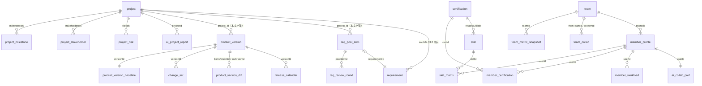
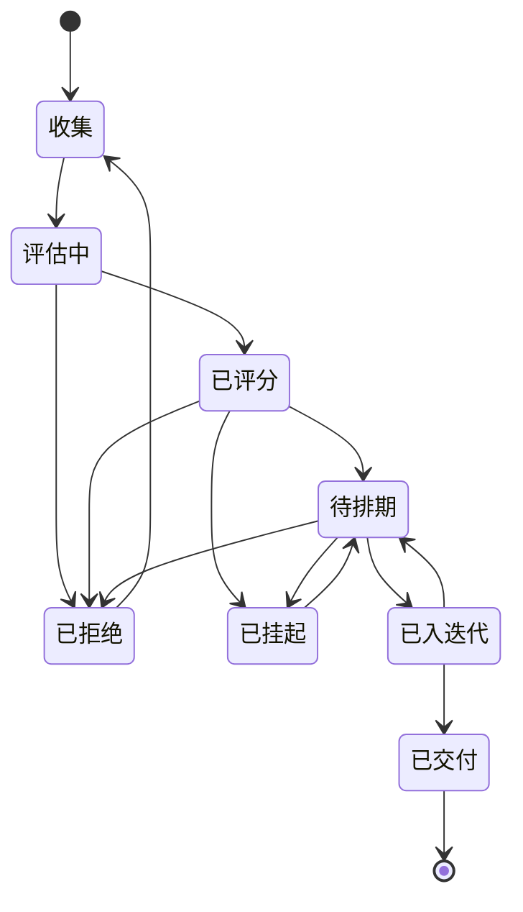
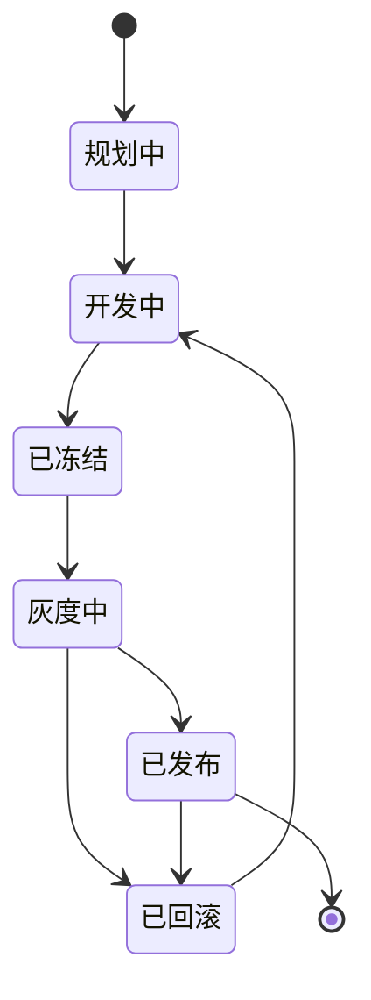

# impl-10 · 管理类模块实施方案（项目 / 人员 / 团队 / 需求池 / 版本）

> **文档编号**：impl-10-management
> **文档版本**：v1.0
> **对应原型**：`makepro/src/prototypes/ai-sdlc-console`（数据源 `data-mgmt.ts`：`PROJECTS` / `PROJECT_MILESTONES` / `STAKEHOLDERS` / `PROJECT_RISKS` / `aiProjectReport` / `SKILLS` / `SKILL_MATRIX` / `CERTIFICATIONS` / `MEMBER_PROFILES` / `WORKLOADS` / `AI_COLLAB_PREFS` / `TEAMS` / `TEAM_METRICS` / `TEAM_COLLABS` / `CEREMONIES` / `REQ_POOL` / `REQ_REVIEWS` / `REQ_FUNNEL` / `REQ_SOURCE_STATS` / `VERSIONS` / `VERSION_BASELINES` / `CHANGE_SETS` / `RELEASE_CALENDAR` / `VERSION_DIFFS`）
> **依赖文档**：
> - `impl-00-overview.md`（术语基线、四层架构、组件清单与端口、私有化 / SaaS 形态差异）
> - `impl-01-protocol.md`（统一消息信封 `{ msgId, type, payload, traceId }`、`sdlc.<domain>.<event>` 主题命名、`SDLC-<DOMAIN>-<NNN>` 错误码、幂等与退避）
> - `impl-02-agents.md`（7 个 Agent 的职责边界、路由规则 `rr-01`~`rr-08`、Fallback 链、上下文预算）
> - `impl-03-state-machine.md`（任务 10 态 / 缺陷 6 态的迁移表、守卫表达式写法、消费组与 Redis 键）
> - `impl-04-data-model.md`（PostgreSQL 表结构的**唯一事实源**，既有 20 张表；本文新增表沿用其命名、审计列与索引风格）
> - `impl-05-integration.md`（PingCode 双向同步、`external_id_map` 幂等映射、对账）
> - `impl-07-console.md`（pageId ↔ 数据域 ↔ REST ↔ 订阅三向映射表、角色可见性矩阵、工时拆分表的列定义）
> - `impl-08-security.md`（`egressPolicy` 三档、`redactRules` `rd-01`~`rd-09`、`audit_log` 字段与 10 类 `category`、RBAC 矩阵）
> **事实基线**：字段名、枚举值、算式一律以 `data-mgmt.ts` 为准；`data-mgmt.ts` 未定义的落地细节（表名、接口路径、事件主题、错误码、Redis 键）在本文中显式标注「本文定义」。

---

## 目录

- [1. 本文定位与范围](#1-本文定位与范围)
- [2. 领域模型](#2-领域模型)
- [3. REST 接口契约](#3-rest-接口契约)
- [4. 事件主题与状态流转](#4-事件主题与状态流转)
- [5. AI 能力设计](#5-ai-能力设计)
- [6. 页面 ↔ 数据 ↔ 接口 ↔ 订阅 三向映射表](#6-页面--数据--接口--订阅-三向映射表)
- [7. 角色可见性矩阵](#7-角色可见性矩阵)
- [8. 权限与审计](#8-权限与审计)
- [9. 工时拆分与并行度](#9-工时拆分与并行度)
- [10. 验收清单](#10-验收清单)
- [变更记录](#变更记录)

---

## 1. 本文定位与范围

### 1.1 本文定位

本文是「AI 研发协作平台」实施落地文档体系的第 11 篇，把原型本轮扩展出的 **5 个管理类页面**（`project` / `people` / `team` / `req-pool` / `release`）落到可开工的后端 + 前端实施方案，回答四个问题：

1. 管理类模块为什么必须独立成域，它与既有「需求工作台」「部署流水线」的边界在哪里；
2. 5 个管理域的数据模型如何落库（新增 22 张 PostgreSQL 表 + 扩展 impl-04 既有 `project` 表），字段如何与 `data-mgmt.ts` 逐字对齐；
3. 管理域的 REST 契约、事件主题、状态机（需求池 8 阶段 / 版本 6 状态）与错误码；
4. 管理类环节的 AI 具体做什么、怎么做、人工如何裁决（风险预测、周报生成、产能再平衡、优先级评分、里程碑延期预测、版本范围建议、发布窗口推荐）。

### 1.2 读者

| 读者 | 关注章节 |
|:---|:---|
| 后端研发（R1/R2/R3） | §2 表设计、§3 接口契约、§4 状态机与事件、§8 权限与审计 |
| 前端研发（R4） | §6 三向映射、§7 可见性矩阵、§9 工时与并行组 |
| AI 工程（R7） | §5 AI 能力设计（Prompt 骨架、Function Calling、输出 Schema、降级链） |
| PMO / 研发管理者 | §1 分工边界、§5 人工裁决点、§7 角色矩阵 |
| 测试（R9） | §4 状态机迁移表与守卫、§10 验收清单 |
| 安全与合规 | §8 分级访问控制、脱敏与审计埋点 |

### 1.3 与其他 impl 文档的关系

| 文档 | 关系 |
|:---|:---|
| `impl-01-protocol.md` | 本文全部接口沿用其 `/api/v1/` 前缀、`{ code, data, traceId }` 响应包、`SDLC-<DOMAIN>-<NNN>` 错误码格式与 24 h 幂等窗口（**遵循 impl-01 §1、§4、§6**） |
| `impl-03-state-machine.md` | 本文的需求池 8 阶段与版本 6 状态机沿用其「迁移表 + 守卫表达式 + 非法迁移统一响应」写法（**遵循 impl-03 §2.2、§4.1、§5.2**）；任务 10 态与缺陷 6 态**不重复定义** |
| `impl-04-data-model.md` | 本文新增表沿用其通用审计五列（`id` / `created_at` / `updated_at` / `deleted_at` / `version`）、`snake_case` 命名、`varchar + CHECK` 枚举与索引写法（**遵循 impl-04 §2、§3**） |
| `impl-02-agents.md` | 本文**不新增 Agent**，管理类 AI 能力全部挂在既有 7 个 Agent 上（见 §5.1 表）；模型路由沿用 `rr-01`~`rr-08`，Fallback 与降级沿用 impl-02 §7 |
| `impl-07-console.md` | 本文 §6 / §7 / §9 三张表的列定义与 impl-07 §3.1 / §6.1 / §7 **完全同构**，可被其直接引用合并 |
| `impl-08-security.md` | 本文 §8 的分级访问控制、脱敏规则引用（`rd-01`~`rd-09`）与审计 `category` 取值全部沿用 impl-08 §3.2、§5.2、§6.2 |
| `impl-05-integration.md` | 需求池条目与 PingCode「需求池」工作项的映射经 `external_id_map`（impl-04 §3.16），`entity_type` 扩展一个取值 `req_pool_item`（见 §2.9） |
| `impl-09-roadmap.md` | 本文 5 个页面落在 P4「完善」阶段的并行组，工时口径沿用 impl-09 §3.2 的角色代号 |

### 1.4 为什么需要独立的管理类模块

既有 13 页（impl-07）全部是**单一迭代的纵向作业面**：从需求工作台到部署流水线，贯穿的是「订单中心重构 · Sprint 24」这一条主线，回答的是「这个迭代怎么交付」。管理域回答的是另外四类问题，它们在既有 13 页中**没有承载面**：

| 管理诉求 | 既有 13 页能否承载 | 缺口 |
|:---|:---|:---|
| 跨迭代、跨项目的**组合视角**（6 个项目的健康度、预算执行、进度偏差、缺陷密度对比） | 否。`overview` 只聚合当前迭代 `SP-24`，`insight` 只按 `range × dim` 出效能指标 | 缺项目主数据（`PROJECTS`）、里程碑（`PROJECT_MILESTONES`）、干系人 RACI（`STAKEHOLDERS`）、风险登记册（`PROJECT_RISKS`） |
| **人**的产能、技能、成本与 AI 协作偏好 | 否。`board` / `schedule` 只把 `USERS` 当负责人标签用 | 缺成员档案（`MEMBER_PROFILES`）、技能矩阵（`SKILL_MATRIX`）、负载快照（`WORKLOADS`）、认证（`CERTIFICATIONS`） |
| **团队**的编制、效能趋势与跨团队阻塞治理 | 否。`insight` 的 `dim=team` 只有单期指标，无组织树与协作关系 | 缺团队（`TEAMS`）、效能快照（`TEAM_METRICS`，7 团队 × 3 周期）、协作关系（`TEAM_COLLABS`）、研发仪式（`CEREMONIES`） |
| 需求进入迭代**之前**的候选池治理与端到端追溯 | 否。`requirement` 从 `REQ-2401` 起，池内被拒绝 / 挂起的条目无处落地 | 缺需求池（`REQ_POOL`，20 条，8 阶段）、评审轮次（`REQ_REVIEWS`）、漏斗与来源（`REQ_FUNNEL` / `REQ_SOURCE_STATS`） |
| 发布**之前**的版本规划、范围冻结与基线 | 否。`pipeline` 从构建产物开始，回答「怎么发」，不回答「发什么」 | 缺版本（`VERSIONS`）、基线（`VERSION_BASELINES`）、变更集（`CHANGE_SETS`）、发布日历（`RELEASE_CALENDAR`）、版本对比（`VERSION_DIFFS`） |

**结论**：管理域是平台的「治理层」，与既有 13 页的「作业层」正交。治理层产生的决策（范围冻结、负载再平衡、里程碑基线调整）以事件形式下发到作业层；作业层产生的事实（覆盖率、缺陷、故事点完成）以指标形式上卷到治理层。二者通过 §4 的事件主题解耦，不共享页面状态。

### 1.5 与既有页面的分工边界（三条硬边界）

| 边界 | 本页（管理域） | 对侧页（作业域） | 关联键 |
|:---|:---|:---|:---|
| **需求管理（`req-pool`）↔ 需求工作台（`requirement`）** | 需求「池」的**横向全生命周期**治理：收集 → 评估中 → 已评分 → 待排期 → 已入迭代 → 已交付 / 已拒绝 / 已挂起，管的是 20 条候选需求的来源、AI 优先级评分、评审轮次、漏斗转化与端到端追溯 | 单条需求进入迭代后的**纵向深度作业**：Brainstorm → PRD → 评审 → 拆解 → 验收标准 | `REQ_POOL[i].requirementId` → `REQUIREMENTS[j].id`（`REQ_POOL_ID_BY_REQUIREMENT` 反查）；已入迭代的 8 条一一对应 `REQ-2401`~`REQ-2408` |
| **版本管理（`release`）↔ 部署流水线（`pipeline`）** | 版本**规划、范围冻结、基线与变更集**（发布前「做什么 / 含什么」） | 单次发布的**执行过程**（构建、门禁、灰度、回滚） | `VERSIONS[i].releaseIds` → `RELEASE_ORDERS[j].id`（`VERSION_ID_BY_RELEASE` 反查）；`VB-04.commitSha='f19d6c0'` 与 `REL-2403.version='order-api:2421-f19d6c0（待构建）'` 的构建号一致 |
| **项目管理（`project`）↔ 总览驾驶舱（`overview`）** | 跨迭代 / 跨项目的组合视角、里程碑基线、干系人沟通计划、风险登记册、AI 项目周报 | 当前迭代 `SP-24` 的六环节在制品、门禁健康色、我的待办与事件流 | `PROJECTS[i].sprintIds` → `SPRINTS[j].id`；`PRJ-01.milestoneIds[2]='MS-03'` 的 `gateId='G3'` 与 `GATES[G3].status='failed'` 同源 |

> 三条边界在页面首屏的 `ac-page-desc` 中**显式披露**（`ReqPoolPage.tsx` 第 1446 行、`ReleasePage.tsx` 第 1762 行），不做隐式约定。

### 1.6 本文覆盖的 5 个 pageId 与 5 个数据域

| # | pageId | 页面标题 | 组件文件 | 数据域（`data-mgmt.ts` 段落） | 标签页数 | 侧边栏分组（`components/Layout.tsx`） |
|:--:|:---|:---|:---|:---|:--:|:---|
| 1 | `project` | 项目管理 | `pages/ProjectPage.tsx` | ① 项目管理 | 5（项目组合 / 当前项目 / 里程碑 / 干系人 / 风险与 AI 周报） | `g-resource` 项目与资源 |
| 2 | `people` | 人员管理 | `pages/PeoplePage.tsx` | ② 人员管理 | 5（成员名册 / 技能矩阵 / 产能与负载 / AI 协作偏好 / 成长与认证） | `g-resource` 项目与资源 |
| 3 | `team` | 团队管理 | `pages/TeamPage.tsx` | ③ 团队管理 | 4（团队编制 / 团队效能 / 协作与依赖 / 研发仪式） | `g-resource` 项目与资源 |
| 4 | `req-pool` | 需求管理 | `pages/ReqPoolPage.tsx` | ④ 需求管理（需求池） | 5（需求池 / 价值成本矩阵 / 评审轮次 / 漏斗与来源 / 追溯与关联） | `g-discovery` 需求与设计 |
| 5 | `release` | 版本管理 | `pages/ReleasePage.tsx` | ⑤ 版本管理 | 5（版本规划 / 基线与冻结 / 变更集 / 版本对比 / 发布日历） | `g-quality` 发布与质量 |

合计 **24 个标签页**、**24 个数据集合**（`data-mgmt.ts` 的 24 个 `export const` 数组 / 对象）、**22 张新增表 + 1 张扩展表**。

### 1.7 不在本文范围

| 不覆盖 | 去向 |
|:---|:---|
| 消息信封字段定义、WSS 握手、断线重连 | impl-01 §2、§5、§7 |
| Agent 的 Prompt 全文、few-shot 样例、上下文压缩算法 | impl-02 §4、§8（本文 §5 只给骨架要点与参数） |
| 任务 10 态 / 缺陷 6 态的迁移与守卫 | impl-03 §2、§3、§4 |
| PingCode Provider 端点实现、对账算法 | impl-05 §3、§9 |
| 前端组件类名清单、可访问性规则、目录结构 | impl-07 §2、§4、§8 |
| 出网档位判定链路、脱敏规则 DSL、审计哈希链 | impl-08 §2、§3.4、§5.3 |
| AI 原型生成与 AxHub 集成 | impl-11 |
| 接口自动化与 hifox 集成 | impl-12 |
| 企业知识库与 WeKnora 集成 | impl-13 |

### 1.8 术语基线（本文新增，禁止改写）

| 术语 | 取值 / 说明 | 源 |
|:---|:---|:---|
| 项目 | `PRJ-01`~`PRJ-06`，共 6 个；`PRJ-01`（订单中心重构，`code='ORD-REF-2026'`）为贯穿案例，`isCurrent=true` | `PROJECTS` |
| 项目阶段 `phase` | `立项` / `规划` / `研发` / `测试` / `发布` / `运维` / `已结项` | `ProjectDef.phase` |
| 项目健康度 `health` | `green` / `amber` / `red`；`healthScore` 0~100 | `ProjectDef.health` |
| 里程碑 | `MS-01`~`MS-12`，共 12 条；`PRJ-01` 占 6 条，`gateId` 依次为 `G1`~`G6` | `PROJECT_MILESTONES` |
| RACI | `R` 执行 / `A` 问责 / `C` 咨询 / `I` 知会；全表**唯一 A**（`SH-07` 集团数字化负责人） | `StakeholderDef.raci` |
| 风险分 `score` | `概率值 × 影响值`，`low=1 / medium=3 / high=5`，取值 1~25 | `ProjectRiskDef.score` |
| 需求池阶段 `stage` | `收集` / `评估中` / `已评分` / `待排期` / `已入迭代` / `已交付` / `已拒绝` / `已挂起`，共 8 个原子值 | `ReqPoolItemDef.stage` |
| 需求来源 `sourceType` | `客户投诉` / `业务方提出` / `线上事故复盘` / `技术债` / `合规监管` / `竞品分析` / `AI 主动发现`，共 7 类 | `ReqPoolItemDef.sourceType` |
| 版本状态 `status` | `规划中` / `开发中` / `已冻结` / `灰度中` / `已发布` / `已回滚`，共 6 个 | `VersionDef.status` |
| 变更类型 `changeType` | `新增` / `变更` / `修复` / `移除` / `配置`，共 5 个 | `ChangeSetDef.changeType` |
| 日历事件 `eventType` | `版本冻结` / `灰度发布` / `全量发布` / `回滚窗口` / `大促封网` / `依赖方联调` / `安全扫描窗口`，共 7 类 | `ReleaseCalendarItem.eventType` |
| 职级 `seniority` | `P4` / `P5` / `P6` / `P7` / `P8` | `MemberProfileDef.seniority` |
| 用工类型 `employmentType` | `正式` / `外包` / `实习` / `AI 账号` | `MemberProfileDef.employmentType` |
| 自动采纳范围 `autoAcceptScope` | `none` / `tests` / `docs` / `refactor` / `all` | `AiCollabPrefDef.autoAcceptScope` |
| 执行主体 `executor` | `ai` / `human` / `ai+human` | `data.ts` `Executor` |
| 语义色 `tone` | 12 值：`brand`/`ai`/`ok`/`warn`/`danger`/`info`/`neutral`/`slate`/`teal`/`pink`/`indigo`/`amber`（前端按 impl-07 §4.1 经 `tagTone()` 归并为 7 值） | `data.ts` `Tone` |

---

## 2. 领域模型

### 2.1 五域 ER 总览



> 图中 `requirement` 为 impl-04 §3.2 既有表；`release_order` 为 impl-04 **缺失**的表（见 §2.9 缺口 G-04），本文按 `data.ts` `ReleaseOrderDef` 补齐定义建议但不代为落库，避免与 impl-04 事实源冲突。

### 2.2 通用约定（沿用 impl-04 §2，不再重复列列）

所有新增表统一包含 `id uuid PK default gen_random_uuid()`、`created_at`、`updated_at`（触发器 `set_updated_at()` 维护）、`deleted_at`（软删除）、`version integer NOT NULL default 0`（乐观锁）。表名 / 列名一律 `snake_case`；枚举落库为 `varchar(N) + CHECK`（不建 PG ENUM，便于加值不停机）；时间统一 `timestamptz` UTC 存储。

**本文的两条补充约定（本文定义）：**

| 约定 | 内容 | 理由 |
|:---|:---|:---|
| C-1 展示派生字段不落库 | `tone` 一律**不建列**，由服务端按分档规则实时派生（如 `ProjectRiskDef.score ≥ 20 → danger`） | `data-mgmt.ts` 的 `tone` 是前端语义色，落库会造成「改了分数忘了改色」的双写不一致；分档规则见 §2.7 |
| C-2 反向引用数组不建列 | `ProjectDef.sprintIds` / `milestoneIds` / `stakeholderIds` / `riskIds`、`TeamDef.memberIds`、`VersionDef.requirementIds` 等**由子表持外键**表达；仅当关系无独立实体（如 `VersionDef.taskIds` / `bugIds`、`ChangeSetDef.mrIds`）才用 `uuid[]` / `text[]` | 与 impl-04 §3.6 `task.component_ids uuid[]` 的既有取舍一致：有独立生命周期的建表，纯标签集合用数组 |

### 2.3 项目管理域（扩展 1 张 + 新增 4 张）

#### 2.3.1 `project`（**扩展 impl-04 §3.1 既有表**，非新建）

impl-04 §3.1 已定义 `project`，含 `code` / `name` / `tenant` / `owner_id` / `default_egress_policy` / `status` 六列。本文按 `ProjectDef` 补 **18 列**（`ADD COLUMN ... DEFAULT ... NOT VALID` 后补 `VALIDATE`，遵循 impl-04 §7 加列规范）：

| 字段 | 类型 | 约束 / 默认 | 说明（TS 源字段） |
|:---|:---|:---|:---|
| `manager_id` | `uuid` | NULL, FK→`app_user.id` ON DELETE SET NULL | 项目经理 PMO（`managerId`，全部 6 个项目均为 `u-gu`） |
| `phase` | `varchar(16)` | NOT NULL, `default '规划'`, CHECK IN (`立项`,`规划`,`研发`,`测试`,`发布`,`运维`,`已结项`) | 项目阶段（`phase`） |
| `status_label` | `varchar(128)` | NOT NULL, `default ''` | 阶段补充文案（`statusLabel`，如「研发中 · G3/G4 门禁未通过」） |
| `health` | `varchar(8)` | NOT NULL, `default 'green'`, CHECK IN (`green`,`amber`,`red`) | 健康灯（`health`） |
| `health_score` | `smallint` | NOT NULL, `default 100`, CHECK 0~100 | 健康度综合评分（`healthScore`） |
| `start_date` | `date` | NOT NULL | 立项日期（`startDate`） |
| `end_date` | `date` | NOT NULL | 计划结项日期（`endDate`） |
| `budget_wan` | `numeric(10,1)` | NOT NULL, `default 0` | 预算（万元）（`budgetWan`）｜**受限字段，见 §8** |
| `spent_wan` | `numeric(10,1)` | NOT NULL, `default 0` | 已花费（万元）（`spentWan`）｜**受限字段** |
| `headcount` | `smallint` | NOT NULL, `default 0` | 编制人数（`headcount`） |
| `progress` | `smallint` | NOT NULL, `default 0`, CHECK 0~100 | 总体进度（`progress`） |
| `schedule_variance_pct` | `numeric(5,1)` | NOT NULL, `default 0` | 进度偏差 %，负数为落后基线（`scheduleVariancePct`） |
| `req_change_rate_pct` | `numeric(5,1)` | NOT NULL, `default 0` | 需求变更率 %（`reqChangeRatePct`） |
| `defect_density` | `numeric(5,2)` | NOT NULL, `default 0` | 缺陷密度（个 / KLOC）（`defectDensity`） |
| `resource_utilization_pct` | `smallint` | NOT NULL, `default 0` | 资源利用率 %，>100 表示借调或透支（`resourceUtilizationPct`） |
| `key_objective` | `text` | NOT NULL, `default ''` | 关键目标（`keyObjective`） |
| `tech_stack` | `text[]` | NOT NULL, `default '{}'` | 技术栈（`techStack`） |
| `is_current` | `boolean` | NOT NULL, `default false` | 是否当前贯穿案例项目（`isCurrent`） |

新增索引：`idx_project_phase(phase, health)`；`idx_project_manager(manager_id)`；`CREATE UNIQUE INDEX uq_project_current ON project (tenant) WHERE is_current AND deleted_at IS NULL`（**每租户至多一个「当前项目」**）。

`desc` 落 impl-04 既有的 `name` 之外的 `description text NULL`（本文补 1 列，共 **19** 列扩展）。示例行：

```json
{ "id": "PRJ-01", "code": "ORD-REF-2026", "name": "订单中心重构", "tenant": "artisan-group",
  "owner_id": "u-lin", "manager_id": "u-gu", "phase": "研发", "status_label": "研发中 · G3/G4 门禁未通过",
  "health": "amber", "health_score": 68, "start_date": "2026-01-12", "end_date": "2026-04-24",
  "budget_wan": 860.0, "spent_wan": 512.0, "headcount": 9, "progress": 58,
  "schedule_variance_pct": -6.2, "req_change_rate_pct": 18.4, "defect_density": 0.61,
  "resource_utilization_pct": 91, "is_current": true, "default_egress_policy": "MASK", "status": "active" }
```

#### 2.3.2 `project_milestone`（新增）

| 字段 | 类型 | 约束 / 默认 | 说明（TS 源字段） |
|:---|:---|:---|:---|
| `project_id` | `uuid` | NOT NULL, FK→`project.id` ON DELETE CASCADE | 所属项目（`projectId`） |
| `code` | `varchar(16)` | NOT NULL, UNIQUE | 里程碑编号（`id`，如 `MS-03`） |
| `name` | `varchar(256)` | NOT NULL | 里程碑名（`name`） |
| `planned_date` | `date` | NOT NULL | 计划日期（`plannedDate`） |
| `actual_date` | `date` | NULL | 实际完成日期；未完成为 NULL（`actualDate`，原型用空串） |
| `forecast_date` | `date` | NULL | AI 推算完成日期；已完成时等于 `actual_date`（`forecastDate`） |
| `status` | `varchar(16)` | NOT NULL, `default '待开始'`, CHECK IN (`已完成`,`进行中`,`待开始`,`已取消`) | 状态（`status`） |
| `progress` | `smallint` | NOT NULL, `default 0`, CHECK 0~100 | 进度（`progress`） |
| `owner_id` | `uuid` | NOT NULL, FK→`app_user.id` | 责任人（`ownerId`） |
| `gate_id` | `varchar(8)` | NULL, CHECK IN (`G1`,`G2`,`G3`,`G4`,`G5`,`G6`) | 关联质量门禁（`gateId`），与 impl-04 §3.10 `pipeline_stage.gate_id` 同域 |
| `deliverables` | `text[]` | NOT NULL, `default '{}'` | 交付物清单（`deliverables`） |
| `slip_days` | `smallint` | NOT NULL, `default 0` | 相对计划日期的滑移天数（`slipDays`） |
| `slip_reason` | `text` | NOT NULL, `default ''` | 滑移原因；未滑移为空串（`slipReason`） |
| `baseline_version` | `smallint` | NOT NULL, `default 1` | 基线版本号，每次 `rebaseline` +1（**本文定义**，支撑 §5.5 的滑移归因） |

索引：`unique(code)`；`idx_ms_project_date(project_id, planned_date)`；`idx_ms_status(status)`；`idx_ms_slip(slip_days) WHERE slip_days > 0`。
示例行：

```json
{ "code": "MS-03", "project_id": "PRJ-01", "name": "编码完成并通过 G3 门禁（单测覆盖率 ≥ 85%）",
  "planned_date": "2026-03-18", "actual_date": null, "forecast_date": "2026-03-23",
  "status": "进行中", "progress": 71, "owner_id": "u-zhou", "gate_id": "G3", "slip_days": 5,
  "slip_reason": "G3 单测覆盖率停在 71.4%（阈值 85%），近 7 日增速仅 0.64pt/日；叠加 BLOCK-0312 生产迁移窗口未批复使 TASK-2419 阻塞 7 天，AI 补齐的 62 条边界用例（TASK-2405）尚未全部合入",
  "baseline_version": 1 }
```

#### 2.3.3 `project_stakeholder`（新增）

| 字段 | 类型 | 约束 / 默认 | 说明（TS 源字段） |
|:---|:---|:---|:---|
| `code` | `varchar(16)` | NOT NULL, UNIQUE | 干系人编号（`id`，如 `SH-07`） |
| `project_id` | `uuid` | NOT NULL, FK→`project.id` ON DELETE CASCADE | **主责**项目（`projectId`）；其他项目经关联表引用同一条目（见下） |
| `user_id` | `uuid` | NULL, FK→`app_user.id` ON DELETE SET NULL | 平台内成员；平台外业务方为 NULL（`userId`） |
| `external_name` | `varchar(128)` | NOT NULL, `default ''` | 平台外干系人姓名与组织（`externalName`，如「韩沐辰 · 集团 CTO 办公室 数字化负责人」） |
| `display_name` | `varchar(64)` | NOT NULL | 展示名（`displayName`） |
| `role` | `varchar(128)` | NOT NULL | 在本项目中承担的职责（`role`） |
| `raci` | `char(1)` | NOT NULL, CHECK IN (`R`,`A`,`C`,`I`) | RACI（`raci`） |
| `interest` | `text` | NOT NULL | 关注点（`interest`） |
| `influence` | `varchar(8)` | NOT NULL, `default 'medium'`, CHECK IN (`high`,`medium`,`low`) | 影响力（`influence`） |
| `communication_freq` | `varchar(128)` | NOT NULL | 沟通频率与形式（`communicationFreq`） |
| `expectation` | `text` | NOT NULL | 当前诉求或异议（`expectation`） |

索引：`unique(code)`；`idx_stk_project(project_id, raci)`；`idx_stk_user(user_id)`。
**跨项目引用（C-2 落地）**：新增关联表 `project_stakeholder_ref(project_id uuid FK, stakeholder_id uuid FK→project_stakeholder.id, PRIMARY KEY(project_id, stakeholder_id))`，承接 `ProjectDef.stakeholderIds`（如 `PRJ-02` 引用 `SH-01`/`SH-03`/`SH-06`）。该关联表无审计五列以外的业务字段，计入 §2.10 的新增表数。

**跨表约束（本文定义）**：`CREATE UNIQUE INDEX uq_stk_single_a ON project_stakeholder (project_id) WHERE raci = 'A' AND deleted_at IS NULL` —— 落实「全表唯一 A」（`SH-07`）。

#### 2.3.4 `project_risk`（新增）

| 字段 | 类型 | 约束 / 默认 | 说明（TS 源字段） |
|:---|:---|:---|:---|
| `project_id` | `uuid` | NOT NULL, FK→`project.id` ON DELETE CASCADE | 所属项目（`projectId`） |
| `code` | `varchar(16)` | NOT NULL, UNIQUE | 风险编号（`id`，如 `PR-02`） |
| `title` | `varchar(256)` | NOT NULL | 风险标题（`title`） |
| `description` | `text` | NOT NULL | 风险描述（`desc`） |
| `probability` | `varchar(8)` | NOT NULL, CHECK IN (`high`,`medium`,`low`) | 概率（`probability`），映射值 5/3/1 |
| `impact` | `varchar(8)` | NOT NULL, CHECK IN (`high`,`medium`,`low`) | 影响（`impact`），映射值 5/3/1 |
| `score` | `smallint` | NOT NULL, CHECK 1~25 | 风险分 = 概率值 × 影响值（`score`），**由触发器计算**，不接受写入值 |
| `owner_id` | `uuid` | NOT NULL, FK→`app_user.id` | 风险责任人（`owner`） |
| `mitigation` | `text` | NOT NULL | 缓解措施（`mitigation`） |
| `contingency` | `text` | NOT NULL | 应急预案（`contingency`） |
| `status` | `varchar(16)` | NOT NULL, `default 'open'`, CHECK IN (`open`,`mitigating`,`closed`,`occurred`) | 状态（`status`） |
| `detected_by` | `varchar(8)` | NOT NULL, `default 'human'`, CHECK IN (`ai`,`human`) | 首先识别方（`detectedBy`） |
| `detected_at` | `date` | NOT NULL | 识别日期（`detectedAt`） |
| `ai_evidence` | `text` | NOT NULL, `default ''` | AI 识别时引用的数据信号（`aiEvidence`）；`detected_by='human'` 时**必须**为空串 |
| `ai_confidence_pct` | `smallint` | NULL, CHECK 0~100 | AI 识别置信度（**本文定义**，见 §5.1） |
| `agent_id` | `varchar(24)` | NULL, CHECK IN (7 个 Agent id) | 产出该风险的 Agent（**本文定义**） |
| `trace_id` | `varchar(64)` | NULL | 生成链路追踪 id（**本文定义**，与 impl-04 §3.20 `model_call_log.trace_id` 同源） |

索引：`unique(code)`；`idx_risk_project_score(project_id, score DESC)`；`idx_risk_status(status)`；`idx_risk_detected_by(detected_by, detected_at DESC)`。
**CHECK 约束（本文定义）**：`CHECK ((detected_by = 'ai') = (ai_evidence <> ''))` —— AI 识别必带证据，人工登记不得伪造证据。
示例行：

```json
{ "code": "PR-02", "project_id": "PRJ-01", "title": "G3 编码门禁单测覆盖率长期低于阈值，v3.0-rc1 无法放行",
  "probability": "high", "impact": "medium", "score": 15, "owner_id": "u-zhou", "status": "mitigating",
  "detected_by": "ai", "detected_at": "2026-03-14", "agent_id": "ag-review", "ai_confidence_pct": 87,
  "ai_evidence": "ag-review 连续采样 PIPE-2405 ~ PIPE-2410 六次流水线：单测覆盖率 68.2% → 71.4%（阈值 85%），近 7 日增速 0.64pt/日，按此斜率达标需 21 天而 SP-24 仅剩 8 天；G3_FAILURE_TREND 显示同期新增用例 34 条但覆盖分支数只增加 11 个" }
```

#### 2.3.5 `ai_project_report`（新增）

| 字段 | 类型 | 约束 / 默认 | 说明（TS 源字段） |
|:---|:---|:---|:---|
| `project_id` | `uuid` | NOT NULL, FK→`project.id` ON DELETE CASCADE | 所属项目（`projectId`） |
| `week_label` | `varchar(128)` | NOT NULL | 周报周期标签（`weekLabel`） |
| `generated_at` | `timestamptz` | NOT NULL | 生成时刻（`generatedAt`） |
| `generated_by` | `varchar(24)` | NOT NULL, CHECK IN (7 个 Agent id) | 生成该报告的 Agent（`generatedBy`，本例 `ag-ba`） |
| `model_id` | `varchar(24)` | NOT NULL, CHECK IN (5 个模型 id) | 实际路由到的模型（`modelId`，本例 `mdl-gpt5`） |
| `routing_rule_id` | `varchar(24)` | NULL | 命中的路由规则（impl-04 §3.20 同名列） |
| `summary` | `text` | NOT NULL | 3~5 句总体结论（`summary`） |
| `progress_items` | `jsonb` | NOT NULL, `default '[]'` | `AiReportProgressItem[]`：`{ label, planned, actual, variancePct }`（`tone` 按 C-1 派生） |
| `highlights` | `text[]` | NOT NULL, `default '{}'` | 本期亮点（`highlights`） |
| `blockers` | `text[]` | NOT NULL, `default '{}'` | 阻塞项（`blockers`） |
| `next_week_plan` | `text[]` | NOT NULL, `default '{}'` | 下周计划（`nextWeekPlan`） |
| `forecast` | `jsonb` | NOT NULL | `AiReportForecast`：`{ finishDate, confidencePct, onTimeRisk, basis }` |
| `token_cost` | `numeric(10,2)` | NOT NULL, `default 0` | 本次生成的模型调用成本（元）（`tokenCost`） |
| `human_edited` | `boolean` | NOT NULL, `default false` | 是否经人工编辑（`humanEdited`） |
| `edited_diff` | `jsonb` | NULL | 人工编辑的字段级 diff（**本文定义**，用于 §5.2 的纠偏回流） |
| `review_status` | `varchar(16)` | NOT NULL, `default '待确认'`, CHECK IN (`待确认`,`已确认`,`已驳回`) | 评审状态（`reviewStatus`） |
| `reviewed_by` | `uuid` | NULL, FK→`app_user.id` | 评审人（**本文定义**） |
| `reviewed_at` | `timestamptz` | NULL | 评审时刻（**本文定义**） |
| `reject_reason` | `text` | NULL | 驳回理由，回流为 Agent 负反馈样本（**本文定义**） |
| `publish_channel` | `varchar(16)` | NULL, CHECK IN (`lark-card`,`lark-group`,`email`) | 发布渠道，落 `notification_log.channel`（impl-04 §3.15） |
| `published_at` | `timestamptz` | NULL | 发布时刻（**本文定义**） |
| `trace_id` | `varchar(64)` | NOT NULL | 生成链路追踪 id |

索引：`idx_report_project_time(project_id, generated_at DESC)`；`unique(project_id, week_label, generated_at)`；`idx_report_review(review_status)`。
示例行：

```json
{ "project_id": "PRJ-01", "week_label": "Sprint 24 · 第 3 周（2026-03-16 ~ 2026-03-22，滚动生成）",
  "generated_at": "2026-03-19T18:30:00+08:00", "generated_by": "ag-ba", "model_id": "mdl-gpt5",
  "token_cost": 18.42, "human_edited": true, "review_status": "已确认",
  "forecast": { "finishDate": "2026-05-08", "confidencePct": 58, "onTimeRisk": "high",
    "basis": "以近 3 周故事点燃烧速率（21.7 点 / 周）外推剩余 31 点需 1.4 周，叠加 BLOCK-0312 的 7 天阻塞与 G3 达标所需的 21 天斜率，取三者最大值得到 14 天滑移；置信度受迁移窗口批复时点这一单点不确定性压低" } }
```

### 2.4 人员管理域（新增 7 张）

#### 2.4.1 `member_profile`（新增）

| 字段 | 类型 | 约束 / 默认 | 说明（TS 源字段） |
|:---|:---|:---|:---|
| `user_id` | `uuid` | NOT NULL, UNIQUE, FK→`app_user.id` ON DELETE CASCADE | 成员（`userId`） |
| `employee_no` | `varchar(32)` | NOT NULL, UNIQUE | 工号（`employeeNo`，如 `AT-2018-0126`） |
| `join_date` | `date` | NOT NULL | 入职日期（`joinDate`） |
| `seniority` | `varchar(4)` | NOT NULL, CHECK IN (`P4`,`P5`,`P6`,`P7`,`P8`) | 职级（`seniority`） |
| `direct_report_to` | `uuid` | NULL, FK→`app_user.id` ON DELETE SET NULL | 直接汇报对象（`directReportTo`） |
| `location` | `varchar(128)` | NOT NULL | 办公地点（`location`） |
| `employment_type` | `varchar(16)` | NOT NULL, CHECK IN (`正式`,`外包`,`实习`,`AI 账号`) | 用工类型（`employmentType`） |
| `monthly_cost_wan` | `numeric(8,2)` | NOT NULL, `default 0` | 月度综合成本（万元）（`monthlyCostWan`）｜**L3 受限字段，见 §8.2** |
| `sprint_capacity` | `numeric(5,1)` | NOT NULL, `default 0` | 本迭代产能上限（故事点），等于 `USERS.capacity`（`sprintCapacity`） |
| `allocated_points` | `numeric(5,1)` | NOT NULL, `default 0` | 本迭代已分配故事点（`allocatedPoints`），与 `member_workload` 一致 |
| `load_pct` | `numeric(5,1)` | NOT NULL, `default 0` | `round(allocated ÷ capacity × 1000) ÷ 10`（`loadPct`） |
| `overtime_hours_month` | `numeric(5,1)` | NOT NULL, `default 0` | 近 30 日加班小时（`overtimeHoursMonth`）｜**L3 受限字段** |
| `ai_accept_rate_pct` | `numeric(5,1)` | NOT NULL, `default 0` | 近 30 日 AI 采纳率（`aiAcceptRatePct`），与 `ai_collab_pref.accept_rate_pct` 同源 |
| `ai_reject_reasons` | `text[]` | NOT NULL, `default '{}'` | Top3 拒绝理由；AI 账号为空数组（`aiRejectReasons`） |
| `review_avg_min` | `numeric(6,1)` | NOT NULL, `default 0` | 评审平均耗时（分钟）（`reviewAvgMin`） |
| `commit_count_30d` | `integer` | NOT NULL, `default 0` | 近 30 日提交数（`commitCount30d`） |
| `pr_count_30d` | `integer` | NOT NULL, `default 0` | 近 30 日 PR 数（`prCount30d`） |
| `defect_escape_count_30d` | `integer` | NOT NULL, `default 0` | 近 30 日缺陷逃逸数（`defectEscapeCount30d`）｜**绩效相关，L3 受限字段** |
| `growth_plan` | `jsonb` | NOT NULL | `MemberGrowthPlan`：`{ goal, actions[], reviewAt }`（`growthPlan`） |
| `status_label` | `varchar(16)` | NOT NULL, `default '在岗'`, CHECK IN (`在岗`,`休假`,`借调`,`离职交接`) | 在岗状态（`statusLabel`） |
| `note` | `text` | NOT NULL, `default ''` | 备注（`note`） |

索引：`unique(user_id)`；`unique(employee_no)`；`idx_mp_seniority(seniority)`；`idx_mp_status(status_label)`；`idx_mp_report_to(direct_report_to)`。
**说明**：`teamIds` 按 C-2 由关联表 `team_member(team_id uuid FK→team.id, user_id uuid FK→app_user.id, PRIMARY KEY(team_id, user_id))` 表达；`certifications` 由 `member_certification` 表达。`team_member` 计入 §2.10 新增表数。
示例行（`u-zhou`）：`{ "user_id": "u-zhou", "seniority": "P6", "employment_type": "正式", "sprint_capacity": 21, "allocated_points": 47, "load_pct": 223.8, "defect_escape_count_30d": 2, "overtime_hours_month": 41 }`。

#### 2.4.2 `skill`（新增）

| 字段 | 类型 | 约束 / 默认 | 说明（TS 源字段） |
|:---|:---|:---|:---|
| `code` | `varchar(16)` | NOT NULL, UNIQUE | 技能编号（`id`，`SK-01`~`SK-14`） |
| `name` | `varchar(128)` | NOT NULL | 技能名（`name`） |
| `category` | `varchar(24)` | NOT NULL, CHECK IN (`语言与框架`,`架构与设计`,`质量与测试`,`平台与运维`,`产品与管理`,`AI 协作`) | 分类（`category`） |
| `demand_level` | `varchar(8)` | NOT NULL, CHECK IN (`critical`,`high`,`medium`) | 业务需求强度（`demandLevel`） |
| `scarcity_pct` | `smallint` | NOT NULL, `default 0`, CHECK 0~100 | 团队稀缺度：level ≥ 4 的人数缺口占比 %（`scarcityPct`） |
| `related_ref` | `varchar(64)` | NOT NULL | 关联的架构组件 / 需求 / 知识库 id（`relatedRef`，如 `ac-order-domain` / `KB-ARCH-01` / `REQ-2404` / `PRD-ORD-v2.3`） |

索引：`unique(code)`；`idx_skill_category(category, demand_level)`。
**引用完整性（本文定义）**：`related_ref` 为**多态软引用**（可能指向 `arch_component.id` / `requirement.code` / `rag_entry.kb_id` / `prd_version.version_no`），不建外键，由每日对账任务校验并在 `audit_log`（`category='配置变更'`）登记悬空引用。理由：跨四类实体建多态外键会破坏 impl-04 §4 的级联策略。

#### 2.4.3 `skill_matrix`（新增）

| 字段 | 类型 | 约束 / 默认 | 说明（TS 源字段） |
|:---|:---|:---|:---|
| `user_id` | `uuid` | NOT NULL, FK→`app_user.id` ON DELETE CASCADE | 成员（`userId`） |
| `skill_id` | `uuid` | NOT NULL, FK→`skill.id` ON DELETE CASCADE | 技能（`skillId`） |
| `level` | `smallint` | NOT NULL, CHECK 1~5 | 能力等级（`level`） |
| `certified` | `boolean` | NOT NULL, `default false` | 是否持证（`certified`），**由 `member_certification` × `certification.related_skill_ids` 派生**，不接受直接写入 |
| `last_used_at` | `date` | NULL | 最近一次实际使用日期（`lastUsedAt`） |
| `ai_assist_rate_pct` | `smallint` | NOT NULL, `default 0`, CHECK 0~100 | 该技能上 AI 辅助比例 %（`aiAssistRatePct`） |
| `assessed_by` | `varchar(16)` | NOT NULL, `default 'self'`, CHECK IN (`self`,`peer`,`architect`,`ai`) | 等级评定来源（**本文定义**，用于 §8.3 的可验证证据对齐） |

索引：`PRIMARY KEY (user_id, skill_id)`（业务主键，另保留 `id`）；`idx_sm_skill_level(skill_id, level DESC)`；`idx_sm_certified(certified) WHERE certified`。
**数据规模**：9 位真人 × 14 项技能 = 126 行（`u-ai-copilot` 为 AI 共享账号，不入矩阵）。

#### 2.4.4 `certification`（新增）+ `member_certification`（新增）

`certification`：

| 字段 | 类型 | 约束 / 默认 | 说明（TS 源字段） |
|:---|:---|:---|:---|
| `code` | `varchar(16)` | NOT NULL, UNIQUE | 证书编号（`id`，`CERT-01`~`CERT-08`） |
| `name` | `varchar(192)` | NOT NULL | 证书名（`name`） |
| `issuer` | `varchar(128)` | NOT NULL | 发证机构（`issuer`） |
| `level` | `varchar(32)` | NOT NULL | 证书级别（`level`，如 `Professional` / `Advanced` / `Internal-L2` / `Internal-L3` / `Administrator`） |
| `valid_until` | `date` | NOT NULL | 有效期（`validUntil`） |
| `related_skill_ids` | `uuid[]` | NOT NULL, `default '{}'` | 覆盖的技能（`relatedSkillIds`），元素 FK→`skill.id`（应用层校验） |

索引：`unique(code)`；`idx_cert_valid(valid_until)`（临期扫描，见 §4.1 `sdlc.member.cert_expiring`）。

`member_certification`（承接 `CertificationDef.holderIds` ↔ `MemberProfileDef.certifications` 的**双向对账**）：

| 字段 | 类型 | 约束 / 默认 | 说明 |
|:---|:---|:---|:---|
| `cert_id` | `uuid` | NOT NULL, FK→`certification.id` ON DELETE CASCADE | 证书 |
| `user_id` | `uuid` | NOT NULL, FK→`app_user.id` ON DELETE CASCADE | 持证人 |
| `cert_no` | `varchar(64)` | NULL | 证书编号（纸质凭证号） |
| `verified_at` | `timestamptz` | NULL | 核验时刻 |

索引：`PRIMARY KEY (cert_id, user_id)`；`idx_mc_user(user_id)`。
**一致性约束（本文定义）**：`skill_matrix.certified = true` ⟺ 存在 `member_certification(user_id, cert_id)` 且 `skill_matrix.skill_id ∈ certification.related_skill_ids` 且 `certification.valid_until >= CURRENT_DATE`。由触发器 `trg_sync_skill_certified()` 在 `member_certification` / `certification` 写入后重算，避免 impl-04 §4 所说的「应用层同事务双写」漏写。

#### 2.4.5 `member_workload`（新增）

| 字段 | 类型 | 约束 / 默认 | 说明（TS 源字段） |
|:---|:---|:---|:---|
| `user_id` | `uuid` | NOT NULL, FK→`app_user.id` ON DELETE CASCADE | 成员（`userId`） |
| `sprint_id` | `uuid` | NOT NULL, FK→`sprint.id` | 迭代（**本文补**，原型按 `SP-24` 单期快照，落库需按迭代留历史） |
| `allocated_points` | `numeric(5,1)` | NOT NULL | 已分配故事点（`allocatedPoints`） |
| `capacity_points` | `numeric(5,1)` | NOT NULL | 产能上限，取 `USERS.capacity`（`capacityPoints`） |
| `load_pct` | `numeric(5,1)` | NOT NULL | `round(allocated ÷ capacity × 1000) ÷ 10`（`loadPct`），**由触发器计算** |
| `task_ids` | `uuid[]` | NOT NULL, `default '{}'` | 关联任务（`taskIds`），元素 FK→`task.id` |
| `overload` | `boolean` | NOT NULL, `default false` | `load_pct > 100`（`overload`），**由触发器计算** |
| `ai_offload_points` | `numeric(5,1)` | NOT NULL, `default 0` | AI 分担的故事点，按任务 `aiRatio` 折算，不超过 `allocated_points`（`aiOffloadPoints`） |
| `risk_note` | `text` | NOT NULL, `default ''` | 风险说明（`riskNote`） |
| `suggested_action` | `text` | NOT NULL, `default ''` | AI 给出的具体调配建议（`suggestedAction`） |
| `composition_note` | `text` | NOT NULL, `default ''` | `allocated_points` 的构成说明（`note`），保证算式可复核 |

索引：`PRIMARY KEY (user_id, sprint_id)`（另保留 `id`）；`idx_wl_overload(sprint_id) WHERE overload`；`idx_wl_load(sprint_id, load_pct DESC)`。
示例行：`{ "user_id": "u-zhou", "sprint_id": "SP-24", "allocated_points": 47, "capacity_points": 21, "load_pct": 223.8, "overload": true, "ai_offload_points": 12 }`。

#### 2.4.6 `ai_collab_pref`（新增）

| 字段 | 类型 | 约束 / 默认 | 说明（TS 源字段） |
|:---|:---|:---|:---|
| `user_id` | `uuid` | NOT NULL, UNIQUE, FK→`app_user.id` ON DELETE CASCADE | 成员（`userId`） |
| `preferred_agent_ids` | `varchar(24)[]` | NOT NULL, `default '{}'` | 常用 Agent，2~3 个（`preferredAgentIds`） |
| `preferred_model_ids` | `varchar(24)[]` | NOT NULL, `default '{}'` | 常用模型，1~2 个（`preferredModelIds`） |
| `auto_accept_scope` | `varchar(16)` | NOT NULL, `default 'none'`, CHECK IN (`none`,`tests`,`docs`,`refactor`,`all`) | 自动采纳范围（`autoAcceptScope`） |
| `prompt_template_ids` | `text[]` | NOT NULL, `default '{}'` | 常用提示词模板，与 `rag_entry.kb_id` 同源（`promptTemplateIds`） |
| `avg_session_min` | `numeric(5,1)` | NOT NULL, `default 0` | 单次会话平均时长（分钟）（`avgSessionMin`） |
| `daily_session_count` | `smallint` | NOT NULL, `default 0` | 日均会话数（`dailySessionCount`） |
| `accept_rate_pct` | `numeric(5,1)` | NOT NULL, `default 0` | 近 30 日采纳率（`acceptRatePct`），**与 `member_profile.ai_accept_rate_pct` 同值**，由触发器同步 |
| `feedback_score` | `smallint` | NOT NULL, `default 3`, CHECK 1~5 | 满意度评分（`feedbackScore`） |
| `top_use_cases` | `text[]` | NOT NULL, `default '{}'` | 高频用例（`topUseCases`） |
| `opt_out_stages` | `varchar(16)[]` | NOT NULL, `default '{}'` | 关闭 AI 的 SDLC 环节（`optOutStages`，取值 `st-req`~`st-observe`） |

索引：`unique(user_id)`；`idx_acp_auto_accept(auto_accept_scope)`；`idx_acp_opt_out USING gin(opt_out_stages)`。
**安全约束（本文定义）**：`auto_accept_scope='all'` 且 `preferred_model_ids` 含出域受控模型时，写入前必须校验 `security.egress.mode != 'DENY'`，否则返回 `SDLC-SEC-403`（impl-08 §2.3 CP-4）。`opt_out_stages` 命中时，`agent-orchestrator` 不得为该用户在该环节自动触发 Agent（人工唤起除外）。

### 2.5 团队管理域（新增 4 张 + 1 关联表）

#### 2.5.1 `team`（新增）

| 字段 | 类型 | 约束 / 默认 | 说明（TS 源字段） |
|:---|:---|:---|:---|
| `code` | `varchar(16)` | NOT NULL, UNIQUE | 团队编号（`id`，`TEAM-01`~`TEAM-07`） |
| `name` | `varchar(128)` | NOT NULL | 团队名（`name`） |
| `leader_id` | `uuid` | NOT NULL, FK→`app_user.id` | 负责人（`leaderId`） |
| `parent_team_id` | `uuid` | NULL, FK→`team.id` ON DELETE SET NULL | 上级团队（`parentTeamId`）；**当前 7 条全为 NULL**（技术中心下扁平一级），列仍保留以支持后续多级组织 |
| `mission` | `text` | NOT NULL | 团队使命（`mission`） |
| `established_at` | `date` | NOT NULL | 成立日期（`establishedAt`） |
| `headcount` | `smallint` | NOT NULL | 编制人数（`headcount`），**恒等于 `team_member` 行数**，由触发器维护 |
| `avg_seniority` | `numeric(3,1)` | NOT NULL, `default 0` | 平均职级（`avgSeniority`，P4=4 … P8=8），由 `member_profile.seniority` 聚合 |
| `tech_stack` | `text[]` | NOT NULL, `default '{}'` | 技术栈（`techStack`） |
| `owned_component_ids` | `text[]` | NOT NULL, `default '{}'` | 持有的架构组件（`ownedComponentIds`，取 `ARCH_COMPONENTS.id`，如 `ac-order-api`） |
| `current_sprint_ids` | `text[]` | NOT NULL, `default '{}'` | 当前参与迭代（`currentSprintIds`） |

索引：`unique(code)`；`idx_team_parent(parent_team_id)`；`idx_team_leader(leader_id)`；`idx_team_component USING gin(owned_component_ids)`。
**合计校验（本文定义，写入时对账）**：7 个团队 `headcount` 之和 = 9（真人成员数，`u-ai-copilot` 不归属任何团队）；`owned_component_ids` 并集 = `ARCH_COMPONENTS` 全部 14 个组件，且**不允许同一组件被两个团队持有**（`CREATE UNIQUE INDEX` 无法直接表达数组元素唯一，改由对账任务 + `SDLC-TEAM-422` 拦截）。

#### 2.5.2 `team_metric_snapshot`（新增）

| 字段 | 类型 | 约束 / 默认 | 说明（TS 源字段） |
|:---|:---|:---|:---|
| `team_id` | `uuid` | NOT NULL, FK→`team.id` ON DELETE CASCADE | 团队（`teamId`） |
| `sprint_id` | `uuid` | NOT NULL, FK→`sprint.id` | 迭代周期（`sprintId`） |
| `velocity_points` | `numeric(5,1)` | NOT NULL | 实际交付故事点（`velocityPoints`） |
| `committed_points` | `numeric(5,1)` | NOT NULL | 迭代初承诺故事点（`committedPoints`） |
| `completion_rate_pct` | `numeric(5,1)` | NOT NULL | **任务条数口径**完成率 %（`completionRatePct`），与故事点口径分开统计 |
| `defect_density` | `numeric(5,2)` | NOT NULL | 缺陷密度（个 / KLOC）（`defectDensity`） |
| `ai_adoption_pct` | `numeric(5,1)` | NOT NULL | AI 采纳率 %（`aiAdoptionPct`） |
| `avg_pr_review_hours` | `numeric(5,1)` | NOT NULL | PR 平均评审时长（小时）（`avgPrReviewHours`） |
| `cycle_time_days` | `numeric(5,1)` | NOT NULL | 平均周期时间（天，任务创建 → 发布）（`cycleTimeDays`） |
| `say_do_ratio_pct` | `numeric(6,1)` | NOT NULL | `round(velocity ÷ committed × 1000) ÷ 10`（`sayDoRatioPct`），**由触发器计算** |

索引：`PRIMARY KEY (team_id, sprint_id)`（另保留 `id`）；`idx_tms_sprint(sprint_id)`；`idx_tms_saydo(sprint_id, say_do_ratio_pct)`。
**合计校验（写入时对账，本文定义）**：同一 `sprint_id` 下 7 个团队的 `committed_points` 之和 = `SPRINTS.committed`，`velocity_points` 之和 = `SPRINTS.completed`（`SP-22`：88 / 88；`SP-23`：92 / 89；`SP-24`：96 / 65）。不满足即拒绝写入并返回 `SDLC-TEAM-422`。数据规模 7 × 3 = 21 行。

#### 2.5.3 `team_collab`（新增）

| 字段 | 类型 | 约束 / 默认 | 说明（TS 源字段） |
|:---|:---|:---|:---|
| `code` | `varchar(16)` | NOT NULL, UNIQUE | 协作关系编号（`id`，`COOP-01`~`COOP-08`） |
| `sprint_id` | `uuid` | NULL, FK→`sprint.id` | 统计周期（**本文补**，原型 `itemCount` 注释为「本迭代」） |
| `from_team_id` | `uuid` | NOT NULL, FK→`team.id` ON DELETE CASCADE | 发起方（`fromTeamId`） |
| `to_team_id` | `uuid` | NOT NULL, FK→`team.id` ON DELETE CASCADE | 承接方（`toTeamId`） |
| `collab_type` | `varchar(16)` | NOT NULL, CHECK IN (`依赖`,`接口对接`,`联合评审`,`资源共享`,`阻塞`) | 协作类型（`collabType`） |
| `item_count` | `integer` | NOT NULL, `default 0` | 本迭代协作事项数（`itemCount`） |
| `avg_wait_hours` | `numeric(6,1)` | NOT NULL, `default 0` | 平均等待时长（小时）（`avgWaitHours`） |
| `blocked_count` | `integer` | NOT NULL, `default 0` | 阻塞数（`blockedCount`） |
| `sla_hours` | `numeric(6,1)` | NOT NULL | 约定响应 SLA（小时）（`slaHours`） |
| `health` | `varchar(8)` | NOT NULL, `default 'ok'`, CHECK IN (`ok`,`warn`,`risk`) | 健康度（`health`），**由触发器按 F 节算式计算** |
| `note` | `text` | NOT NULL, `default ''` | 说明（`note`） |
| `ai_suggestion` | `text` | NOT NULL, `default ''` | AI 协作优化建议（`aiSuggestion`） |
| `block_ref` | `varchar(32)` | NULL | 关联阻塞单号（**本文定义**，如 `BLOCK-0312`，对应 `COOP-02`） |

索引：`unique(code)`；`idx_collab_pair(from_team_id, to_team_id)`；`idx_collab_health(health) WHERE health <> 'ok'`。
**`health` 算式（源：`data-mgmt.ts` F 节）**：`blocked_count >= 1 → 'risk'`；否则 `avg_wait_hours > sla_hours / 2 → 'warn'`；其余 `'ok'`。分布：`ok` 4（`COOP-01`/`04`/`06`/`08`）、`warn` 2（`COOP-03`/`07`）、`risk` 2（`COOP-02`/`05`）。

#### 2.5.4 `ceremony`（新增）

| 字段 | 类型 | 约束 / 默认 | 说明（TS 源字段） |
|:---|:---|:---|:---|
| `code` | `varchar(16)` | NOT NULL, UNIQUE | 仪式编号（`id`，`CER-01`~`CER-06`） |
| `name` | `varchar(32)` | NOT NULL, CHECK IN (`迭代规划会`,`每日站会`,`需求澄清会`,`架构评审会`,`迭代回顾会`,`发布评审会`) | 仪式名（`name`） |
| `cadence` | `varchar(128)` | NOT NULL | 频率（`cadence`） |
| `duration_min` | `smallint` | NOT NULL | 时长（分钟）（`durationMin`） |
| `owner_role_id` | `varchar(16)` | NOT NULL, CHECK IN (7 个角色 id) | 主持角色（`ownerRoleId`） |
| `attendee_role_ids` | `varchar(16)[]` | NOT NULL, `default '{}'` | 参与角色（`attendeeRoleIds`） |
| `ai_assist` | `varchar(16)` | NOT NULL, `default 'none'`, CHECK IN (`none`,`summary`,`agenda`,`full`) | AI 参与程度（`aiAssist`） |
| `ai_output` | `text` | NOT NULL, `default ''` | AI 产出的具体物料名（`aiOutput`） |
| `last_held_at` | `date` | NULL | 最近一次举行日期（`lastHeldAt`） |
| `attendance_rate_pct` | `numeric(5,1)` | NOT NULL, `default 0` | 出席率 %（`attendanceRatePct`） |
| `action_item_close_rate_pct` | `numeric(5,1)` | NOT NULL, `default 0` | 行动项按期闭环率 %（`actionItemCloseRatePct`） |

索引：`unique(code)`；`idx_ceremony_owner(owner_role_id)`；`idx_ceremony_ai(ai_assist)`。

### 2.6 需求管理域（新增 2 张）

#### 2.6.1 `req_pool_item`（新增）

| 字段 | 类型 | 约束 / 默认 | 说明（TS 源字段） |
|:---|:---|:---|:---|
| `project_id` | `uuid` | NULL, FK→`project.id` ON DELETE SET NULL | 归属项目（**本文补强**，原型无此列，见 §2.9 缺口 G-01） |
| `code` | `varchar(24)` | NOT NULL, UNIQUE | PingCode 需求池编号（`code`，如 `PC-POOL-0201`） |
| `local_code` | `varchar(16)` | NOT NULL, UNIQUE | 平台内编号（`id`，`RP-01`~`RP-20`） |
| `title` | `varchar(256)` | NOT NULL | 标题（`title`） |
| `source_type` | `varchar(24)` | NOT NULL, CHECK IN (`客户投诉`,`业务方提出`,`线上事故复盘`,`技术债`,`合规监管`,`竞品分析`,`AI 主动发现`) | 来源类型（`sourceType`） |
| `source_ref` | `varchar(192)` | NOT NULL, `default ''` | 来源单据号或会议名（`sourceRef`） |
| `submitted_by` | `uuid` | NULL, FK→`app_user.id` ON DELETE SET NULL | 提交人；平台外为 NULL（`submittedBy`） |
| `external_name` | `varchar(128)` | NOT NULL, `default ''` | 平台外提交人姓名与组织（`externalName`） |
| `submitted_at` | `date` | NOT NULL | 提交日期（`submittedAt`） |
| `stage` | `varchar(16)` | NOT NULL, `default '收集'`, CHECK IN (`收集`,`评估中`,`已评分`,`待排期`,`已入迭代`,`已交付`,`已拒绝`,`已挂起`) | 8 阶段状态机载体（`stage`），迁移守卫见 §4.4 |
| `business_value` | `smallint` | NOT NULL, CHECK 1~10 | 业务价值（`businessValue`） |
| `tech_complexity` | `smallint` | NOT NULL, CHECK 1~10 | 技术复杂度（`techComplexity`） |
| `risk_score` | `smallint` | NOT NULL, CHECK 1~10 | 风险分（不做的损失）（`riskScore`） |
| `urgency` | `smallint` | NOT NULL, CHECK 1~10 | 紧急度（`urgency`） |
| `ai_priority_score` | `smallint` | NOT NULL, CHECK 10~100 | AI 优先级分（`aiPriorityScore`），**由触发器按 §5.4 公式计算** |
| `ai_score_reason` | `text` | NOT NULL, `default ''` | AI 打分依据 2~3 句（`aiScoreReason`） |
| `scoring_profile_id` | `varchar(24)` | NOT NULL, `default 'standard'` | 评分口径 id（**本文定义**，取值 `standard` / `promo` / `compliance`，见 §5.4） |
| `ai_suggested_sprint_id` | `uuid` | NULL, FK→`sprint.id` | AI 建议排入的迭代；不建议为 NULL（`aiSuggestedSprintId`） |
| `estimate_points` | `numeric(5,1)` | NOT NULL, `default 0` | 预估故事点；未评估为 0（`estimatePoints`） |
| `requirement_id` | `uuid` | NULL, FK→`requirement.id` ON DELETE SET NULL | 已入迭代 / 已交付时关联的正式需求（`requirementId`） |
| `epic_id` | `varchar(32)` | NOT NULL, `default ''` | 归属 Epic；平台外 Epic 为空串（`epicId`，如 `EPIC-ORDER-REF`） |
| `tags` | `text[]` | NOT NULL, `default '{}'` | 标签（`tags`） |
| `owner_role_id` | `varchar(16)` | NOT NULL, CHECK IN (7 个角色 id) | 责任角色（`ownerRoleId`） |
| `reviewer_ids` | `uuid[]` | NOT NULL, `default '{}'` | 评审人（`reviewers`） |
| `decision_note` | `text` | NOT NULL, `default ''` | 决策结论说明（`decisionNote`） |
| `decided_at` | `date` | NULL | 决策日期（`decidedAt`，原型用空串） |
| `stage_entered_at` | `timestamptz` | NOT NULL, `default now()` | 进入当前阶段时刻（**本文定义**，SLA 与漏斗 `avgCycleDays` 计算基准，与 impl-04 §3.6 `task.state_entered_at` 同构） |

索引：`unique(code)`；`unique(local_code)`；`idx_pool_stage(stage, ai_priority_score DESC)`；`idx_pool_source(source_type, stage)`；`idx_pool_project(project_id, stage)`；`idx_pool_sprint(ai_suggested_sprint_id)`；`idx_pool_req(requirement_id)`；`idx_pool_tags USING gin(tags)`。
**数据规模与分布**：20 条。`stage` 分布 = 已入迭代 8（`RP-01`~`RP-08`）+ 已交付 1（`RP-16`）+ 待排期 2（`RP-09`/`RP-13`）+ 已评分 2（`RP-12`/`RP-14`）+ 评估中 2（`RP-10`/`RP-15`）+ 收集 2（`RP-11`/`RP-20`）+ 已挂起 1（`RP-19`）+ 已拒绝 2（`RP-17`/`RP-18`）。
**跨表一致性（本文定义）**：8 条 `已入迭代` 条目的 `decided_at` 与对应 `requirement.created_at` 完全一致、`estimate_points` 与 `requirement.story_points` 完全一致；由 `POST /req-pool/schedule`（`MGMT-30`）在同一事务内写入。

#### 2.6.2 `req_review_round`（新增）

| 字段 | 类型 | 约束 / 默认 | 说明（TS 源字段） |
|:---|:---|:---|:---|
| `pool_item_id` | `uuid` | NOT NULL, FK→`req_pool_item.id` ON DELETE CASCADE | 被评审条目（`poolItemId`） |
| `code` | `varchar(16)` | NOT NULL, UNIQUE | 轮次编号（`id`，`RPR-01`~`RPR-10`） |
| `round` | `smallint` | NOT NULL | 第几轮（`round`） |
| `held_at` | `timestamptz` | NOT NULL | 举行时刻（`heldAt`） |
| `mode` | `varchar(8)` | NOT NULL, CHECK IN (`会议`,`异步`) | 形式（`mode`） |
| `chair_id` | `uuid` | NOT NULL, FK→`app_user.id` | 主持人（`chairId`） |
| `attendee_ids` | `uuid[]` | NOT NULL, `default '{}'` | 参与人（`attendeeIds`） |
| `ai_pre_read_summary` | `text` | NOT NULL, `default ''` | AI 会前预读摘要 2~3 句（`aiPreReadSummary`） |
| `ai_questions` | `text[]` | NOT NULL, `default '{}'` | AI 提出的澄清问题 3~5 个（`aiQuestions`） |
| `outcome` | `varchar(16)` | NOT NULL, CHECK IN (`通过`,`有条件通过`,`退回修改`,`挂起`) | 结论（`outcome`） |
| `conditions` | `text[]` | NOT NULL, `default '{}'` | 有条件通过时的前置条件（`conditions`） |
| `score_before` | `smallint` | NOT NULL | 评审前 AI 优先级分（`scoreBefore`） |
| `score_after` | `smallint` | NOT NULL | 评审后 AI 优先级分（`scoreAfter`） |
| `duration_min` | `smallint` | NOT NULL, `default 0` | 时长（分钟）（`durationMin`） |
| `kb_retrieval_ids` | `text[]` | NOT NULL, `default '{}'` | 预读时检索到的知识库条目（**本文定义**，取 `rag_entry.kb_id`） |

索引：`unique(code)`；`unique(pool_item_id, round)`；`idx_review_outcome(outcome, held_at DESC)`。
**自洽约束（本文定义）**：每个 `pool_item_id` 的**最后一轮** `score_after` 恒等于该条目的 `req_pool_item.ai_priority_score`；由触发器 `trg_sync_pool_score()` 在轮次写入后回写，返回 `SDLC-POOL-422` 若人工试图绕过。数据规模 10 轮，覆盖 8 个条目（`RP-01` 与 `RP-07` 各 2 轮）。

### 2.7 版本管理域（新增 5 张）

> **命名说明（本文定义）**：`VersionDef` 落库表名取 `product_version` 而非 `version`，因为 impl-04 §2 规定**每张表都有一列 `version`（乐观锁）**，表名与列名同名会在 `SELECT version FROM version` 一类语句与 ORM 元数据推断中产生歧义。同理 `version_baseline` → `product_version_baseline`、`version_diff` → `product_version_diff`。

#### 2.7.1 `product_version`（新增）

| 字段 | 类型 | 约束 / 默认 | 说明（TS 源字段） |
|:---|:---|:---|:---|
| `project_id` | `uuid` | NULL, FK→`project.id` ON DELETE SET NULL | 归属项目（**本文补强**，见 §2.9 缺口 G-02） |
| `code` | `varchar(16)` | NOT NULL, UNIQUE | 版本编号（`id`，`VER-01`~`VER-05`） |
| `name` | `varchar(24)` | NOT NULL, UNIQUE | 版本号（`name`，`v2.2`/`v2.3`/`v2.4`/`v3.0-rc1`/`v3.0`） |
| `code_name` | `varchar(64)` | NOT NULL, `default ''` | 代号（`codeName`，如 `Lumen`） |
| `type` | `varchar(16)` | NOT NULL, CHECK IN (`feature`,`minor`,`major`,`patch`,`rc`) | 版本类型（`type`） |
| `status` | `varchar(16)` | NOT NULL, `default '规划中'`, CHECK IN (`规划中`,`开发中`,`已冻结`,`灰度中`,`已发布`,`已回滚`) | 6 状态机载体（`status`），迁移守卫见 §4.5 |
| `plan_date` | `date` | NOT NULL | 计划发布日期（`planDate`） |
| `actual_date` | `date` | NULL | 实际发布日期（`actualDate`） |
| `scope_summary` | `text` | NOT NULL | 范围摘要（`scopeSummary`） |
| `requirement_ids` | `uuid[]` | NOT NULL, `default '{}'` | 纳入需求（`requirementIds`），元素 FK→`requirement.id` |
| `task_ids` | `uuid[]` | NOT NULL, `default '{}'` | 纳入任务（`taskIds`），元素 FK→`task.id` |
| `bug_ids` | `uuid[]` | NOT NULL, `default '{}'` | 修复缺陷（`bugIds`），元素 FK→`defect.id` |
| `release_ids` | `uuid[]` | NOT NULL, `default '{}'` | 挂靠发布单（`releaseIds`），元素逻辑关联 `release_order.id`（见 §2.9 缺口 G-04） |
| `feature_count` | `integer` | NOT NULL, `default 0` | 特性数（`featureCount`）= `requirement_ids` 长度（`v2.2`/`v2.3` 例外，取其 `includedCounts`） |
| `breaking_changes` | `boolean` | NOT NULL, `default false` | 是否含破坏性变更（`breakingChanges`） |
| `compat_note` | `text` | NOT NULL, `default ''` | 兼容说明（`compatNote`） |
| `owner_id` | `uuid` | NOT NULL, FK→`app_user.id` | 版本负责人（`owner`） |
| `approver_ids` | `uuid[]` | NOT NULL, `default '{}'` | 审批人（`approverIds`） |
| `quality_gate` | `jsonb` | NOT NULL, `default '{}'` | `G1`~`G6` 六项 `{ pass: boolean, note: string }`（`qualityGate`，`QualityGateResult`） |
| `ai_release_note` | `text[]` | NOT NULL, `default '{}'` | AI 生成的发布说明草稿 3~5 条（`aiReleaseNote`） |
| `token_cost` | `numeric(10,2)` | NOT NULL, `default 0` | 生成发布说明的模型成本（元）（`tokenCost`） |
| `baseline_id` | `uuid` | NULL, FK→`product_version_baseline.id` | 基线（`baselineId`）；与基线表互为引用，建表顺序为先 `product_version`（`baseline_id` 暂空）→ `product_version_baseline` → 回填 |

索引：`unique(code)`；`unique(name)`；`idx_pv_status(status, plan_date)`；`idx_pv_project(project_id, status)`；`idx_pv_req USING gin(requirement_ids)`。
**划分校验（写入时对账，本文定义）**：8 条需求 / 24 个任务 / 12 个缺陷**有且仅有一个**归属版本。`VER-03`：`REQ-2406` · `TASK-2417`/`2418` · `BUG-1049`/`1050`/`1051`；`VER-04`：`REQ-2401`~`2405`、`REQ-2407`（6 条）· `TASK-2401`~`2416`、`TASK-2419`、`TASK-2420`（18 个）· `BUG-1043`/`1045`/`1046`/`1047`/`1048`/`1053`/`1055`（7 个）；`VER-05`：`REQ-2408` · `TASK-2421`~`2424` · `BUG-1052`/`1054`。重复归属返回 `SDLC-VER-409`。

#### 2.7.2 `product_version_baseline`（新增）

| 字段 | 类型 | 约束 / 默认 | 说明（TS 源字段） |
|:---|:---|:---|:---|
| `version_id` | `uuid` | NOT NULL, UNIQUE, FK→`product_version.id` ON DELETE CASCADE | 所属版本（`versionId`），**每版本一条** |
| `code` | `varchar(16)` | NOT NULL, UNIQUE | 基线编号（`id`，`VB-01`~`VB-05`） |
| `frozen_at` | `timestamptz` | NULL | 冻结时刻；未冻结为 NULL（`frozenAt`，原型用空串） |
| `frozen_by` | `uuid` | NOT NULL, FK→`app_user.id` | 冻结执行人；未冻结时为计划责任人（`frozenBy`） |
| `commit_sha` | `varchar(40)` | NOT NULL, `default ''` | 冻结时 commit SHA（`commitSha`） |
| `branch` | `varchar(128)` | NOT NULL | 分支（`branch`，如 `release/v2.3`） |
| `tag` | `varchar(64)` | NOT NULL, `default ''` | 标签（`tag`，如 `v2.3.0`） |
| `artifact_image` | `varchar(192)` | NOT NULL, `default ''` | 制品镜像（`artifactImage`） |
| `included_counts` | `jsonb` | NOT NULL | `BaselineIncludedCounts`：`{ requirements, tasks, bugs, apiContracts }` |
| `excluded_items` | `jsonb` | NOT NULL, `default '[]'` | `BaselineExcludedItem[]`：`{ id, title, reason }` |
| `checksum` | `varchar(128)` | NOT NULL, `default ''` | 制品校验和（`checksum`，`sha256:` 前缀） |
| `sign_off_ids` | `uuid[]` | NOT NULL, `default '{}'` | 签核人（`signOffIds`） |
| `gate_precheck` | `jsonb` | NULL | 冻结预检结论快照（**本文定义**，`{ gateId, pass, note, blocking }[]`，见 §5.6 与 `MGMT-38`） |

索引：`unique(version_id)`；`unique(code)`；`idx_vb_frozen(frozen_at DESC)`；`idx_vb_commit(commit_sha)`。
**冻结完整性约束（本文定义）**：`frozen_at IS NOT NULL` ⟹ `commit_sha <> '' AND checksum <> '' AND array_length(sign_off_ids,1) >= 2`，否则返回 `SDLC-VER-422`。`VB-05`（`v3.0` 规划中）三字段均为空串，符合未冻结态。`VB-04.commit_sha='f19d6c0'` 与 `REL-2403.version='order-api:2421-f19d6c0（待构建）'` 的构建号一致，由对账任务校验。

#### 2.7.3 `change_set`（新增）

| 字段 | 类型 | 约束 / 默认 | 说明（TS 源字段） |
|:---|:---|:---|:---|
| `version_id` | `uuid` | NOT NULL, FK→`product_version.id` ON DELETE CASCADE | 所属版本（`versionId`） |
| `code` | `varchar(16)` | NOT NULL, UNIQUE | 变更集编号（`id`，`CS-01`~`CS-14`） |
| `title` | `varchar(256)` | NOT NULL | 标题（`title`） |
| `change_type` | `varchar(8)` | NOT NULL, CHECK IN (`新增`,`变更`,`修复`,`移除`,`配置`) | 变更类型（`changeType`） |
| `module` | `varchar(64)` | NOT NULL | 所属模块（`module`） |
| `related_ids` | `text[]` | NOT NULL, `default '{}'` | 关联的需求 / 任务 / 缺陷 / 接口契约 / 发布单 id（`relatedIds`，多态软引用） |
| `db_migration` | `boolean` | NOT NULL, `default false` | 是否含库迁移（`dbMigration`） |
| `migration_script` | `varchar(192)` | NOT NULL, `default ''` | 迁移脚本名；无迁移为空串（`migrationScript`） |
| `rollback_plan` | `text` | NOT NULL | 回滚方案（`rollbackPlan`） |
| `risk_level` | `varchar(8)` | NOT NULL, `default 'low'`, CHECK IN (`high`,`medium`,`low`) | 风险级（`riskLevel`） |
| `reviewer_ids` | `uuid[]` | NOT NULL, `default '{}'` | 评审人（`reviewerIds`） |
| `mr_ids` | `text[]` | NOT NULL, `default '{}'` | 关联 GitLab MR，取 `TASKS.mrId` 真实值（`mrIds`） |
| `lines_added` | `integer` | NOT NULL, `default 0` | 新增行（`linesAdded`），聚合型变更集为对应任务之和 |
| `lines_deleted` | `integer` | NOT NULL, `default 0` | 删除行（`linesDeleted`） |
| `api_changed` | `boolean` | NOT NULL, `default false` | 是否改接口（`apiChanged`） |
| `breaking_api` | `boolean` | NOT NULL, `default false` | 是否破坏性接口变更（`breakingApi`） |
| `executor` | `varchar(16)` | NOT NULL, `default 'human'`, CHECK IN (`ai`,`human`,`ai+human`) | 执行主体（`executor`） |

索引：`unique(code)`；`idx_cs_version_type(version_id, change_type)`；`idx_cs_risk(risk_level) WHERE risk_level = 'high'`；`idx_cs_breaking(breaking_api) WHERE breaking_api`；`idx_cs_module(module)`。
**分布**：14 条 —— `VER-02` 2 条（`CS-01`/`CS-02`）、`VER-03` 2 条（`CS-03`/`CS-04`）、`VER-04` 9 条（`CS-05`~`CS-13`）、`VER-05` 1 条（`CS-14`）。`VER-01`（`v2.2`）无变更集：早于平台变更集纳管范围。
**约束（本文定义）**：`db_migration = true` ⟹ `migration_script <> '' AND rollback_plan <> ''`，否则 `SDLC-VER-422`；`breaking_api = true` ⟹ `product_version.breaking_changes = true`（由触发器上卷）。

#### 2.7.4 `release_calendar`（新增）

| 字段 | 类型 | 约束 / 默认 | 说明（TS 源字段） |
|:---|:---|:---|:---|
| `code` | `varchar(16)` | NOT NULL, UNIQUE | 日历项编号（`id`，`CAL-01`~`CAL-12`） |
| `event_date` | `date` | NOT NULL | 日期（`date`） |
| `version_id` | `uuid` | NULL, FK→`product_version.id` ON DELETE SET NULL | 关联版本；组织级事项为 NULL（`versionId`） |
| `event_type` | `varchar(24)` | NOT NULL, CHECK IN (`版本冻结`,`灰度发布`,`全量发布`,`回滚窗口`,`大促封网`,`依赖方联调`,`安全扫描窗口`) | 事件类型（`eventType`） |
| `title` | `varchar(256)` | NOT NULL | 标题（`title`） |
| `owner_id` | `uuid` | NOT NULL, FK→`app_user.id` | 责任人（`owner`） |
| `env_ids` | `varchar(24)[]` | NOT NULL, `default '{}'` | 涉及环境（`envIds`，取 `ENVIRONMENTS.id`：`env-dev`/`env-test`/`env-staging`/`env-prod`） |
| `all_day` | `boolean` | NOT NULL, `default false` | 是否全天（`allDay`） |
| `executor` | `varchar(16)` | NOT NULL, `default 'human'`, CHECK IN (`ai`,`human`,`ai+human`) | 执行主体（`executor`） |
| `conflict_note` | `text` | NOT NULL, `default ''` | 冲突说明；无冲突为空串（`conflictNote`） |
| `ai_resolution` | `text` | NOT NULL, `default ''` | AI 冲突消解建议（`aiResolution`） |
| `conflict_group_id` | `varchar(16)` | NULL | 冲突组标识（**本文定义**，`CAL-09`/`CAL-10` 为 `CFG-A`，`CAL-11`/`CAL-12` 为 `CFG-B`） |
| `resolution_status` | `varchar(16)` | NOT NULL, `default 'none'`, CHECK IN (`none`,`proposed`,`accepted`,`adjusted`) | 消解状态（**本文定义**） |

索引：`unique(code)`；`idx_cal_date(event_date)`；`idx_cal_env USING gin(env_ids)`；`idx_cal_conflict(conflict_group_id) WHERE conflict_group_id IS NOT NULL`；`idx_cal_type(event_type, event_date)`。
**冲突判定（本文定义）**：同一 `event_date`（或全天区间重叠）且 `env_ids` 有交集且 `event_type` 均属「生产变更类」（`灰度发布`/`全量发布`/`回滚窗口`/`依赖方联调`/`安全扫描窗口`）即判为冲突；`大促封网` 区间内的任何生产变更类事件**无条件**判为冲突。当前两组：`CFG-A` = `CAL-09`（DBA 生产迁移窗口）与 `CAL-10`（`REL-2403` 灰度批次 1）同为 2026-03-20 且同为 `env-prod`；`CFG-B` = `CAL-12`（`v3.0` 全量发布 2026-04-10）落在 `CAL-11`（618 大促预备封网 2026-04-01 ~ 04-20）期内。

#### 2.7.5 `product_version_diff`（新增）

| 字段 | 类型 | 约束 / 默认 | 说明（TS 源字段） |
|:---|:---|:---|:---|
| `code` | `varchar(16)` | NOT NULL, UNIQUE | 对比编号（`id`，`VD-01`~`VD-04`） |
| `from_version_id` | `uuid` | NOT NULL, FK→`product_version.id` ON DELETE CASCADE | 源版本（`fromVersionId`） |
| `to_version_id` | `uuid` | NOT NULL, FK→`product_version.id` ON DELETE CASCADE | 目标版本（`toVersionId`） |
| `summary` | `jsonb` | NOT NULL | `VersionDiffSummary`：`{ addedFeatures, changedFeatures, removedFeatures, fixedBugs, newApis, breakingApis, dbMigrations }` |
| `added_items` | `jsonb` | NOT NULL, `default '[]'` | `VersionDiffItem[]`：`{ id, title }`（`tone` 按 C-1 派生） |
| `removed_items` | `jsonb` | NOT NULL, `default '[]'` | `VersionDiffRemovedItem[]`：`{ id, title, reason }`，与 `product_version_baseline.excluded_items` 对应 |
| `metric_delta` | `jsonb` | NOT NULL, `default '[]'` | `VersionMetricDelta[]`：`{ metric, from, to, deltaPct, dir, good }` |
| `ai_compatibility_risk` | `varchar(8)` | NOT NULL, `default 'low'`, CHECK IN (`low`,`medium`,`high`) | AI 兼容性风险（`aiCompatibilityRisk`） |
| `ai_migration_advice` | `text` | NOT NULL, `default ''` | AI 迁移与兼容建议 2~3 句（`aiMigrationAdvice`） |
| `generated_by` | `varchar(24)` | NOT NULL, CHECK IN (7 个 Agent id) | 生成 Agent（`generatedBy`） |
| `generated_at` | `timestamptz` | NOT NULL | 生成时刻（`generatedAt`） |
| `trace_id` | `varchar(64)` | NOT NULL | 追踪 id |

索引：`unique(code)`；`unique(from_version_id, to_version_id)`；`idx_vd_to(to_version_id)`。
**派生口径（源：`data-mgmt.ts` H 节，落库时由 `summary` 重算任务保证）**：`summary` 由**目标版本的变更集**聚合而来 —— `addedFeatures` = `change_type='新增'` 的变更集数；`changedFeatures` = `change_type ∈ {变更, 配置}` 的变更集数；`removedFeatures` = `change_type='移除'` 的变更集数；`newApis` = `api_changed=true` 的变更集数；`breakingApis` = `breaking_api=true` 的变更集数；`dbMigrations` = `db_migration=true` 的变更集数；`fixedBugs` = 目标版本 `bug_ids` 长度。`metric_delta[].delta_pct = round((to − from) ÷ from × 1000) ÷ 10`，`dir = to > from ? 'up' : 'down'`，`good` 表示该变化方向对业务是否有利。

### 2.8 TS 驼峰 → SQL snake_case 映射与派生字段总表

**映射规则（遵循 impl-01 §1「字段 camelCase；数据库表/列 snake_case」）**：序列化层（NestJS `ClassSerializerInterceptor` + `camelCase-keys`）做双向转换，本文只登记**非机械转换**的特例。

| TS 字段 | SQL 列 | 转换类型 | 说明 |
|:---|:---|:---|:---|
| `ReqPoolItemDef.id` | `req_pool_item.local_code` | **改名** | `id` 已被 uuid 主键占用，业务编号改名 `local_code`（与 impl-04 §3.16 `external_id_map.local_code` 同名同义） |
| `ReqPoolItemDef.code` | `req_pool_item.code` | 直译 | 该值（`PC-POOL-0201`）为 **PingCode 外部编号**，同时写入 `external_id_map.external_code` |
| `ProjectDef.desc` | `project.description` | **改名** | `desc` 是 SQL 保留字（`ORDER BY ... DESC`） |
| `ProjectRiskDef.desc` | `project_risk.description` | **改名** | 同上 |
| `ProjectRiskDef.owner` | `project_risk.owner_id` | **加后缀** | 与 impl-04 全库 `*_id` 外键命名统一 |
| `VersionDef.owner` | `product_version.owner_id` | **加后缀** | 同上 |
| `ReleaseCalendarItem.date` | `release_calendar.event_date` | **改名** | `date` 是 PG 类型名，作列名易误读 |
| `ReleaseCalendarItem.owner` | `release_calendar.owner_id` | **加后缀** | 同上 |
| `WorkloadDef.note` | `member_workload.composition_note` | **改名** | 明确语义为「构成说明」，与 `risk_note` 区分 |
| `MemberProfileDef.certifications` | → `member_certification` 关联表 | **拆表** | 见 C-2 |
| `TeamDef.memberIds` | → `team_member` 关联表 | **拆表** | 见 C-2 |
| `ProjectDef.sprintIds` / `milestoneIds` / `stakeholderIds` / `riskIds` | → 子表持外键 + `project_stakeholder_ref` | **拆表** | 见 C-2 |
| `*.tone` | （不落库） | **删除** | 见 C-1，服务端按分档规则派生 |

**`tone` 派生规则总表（服务端统一实现，前端不重算）**：

| 实体 | 派生规则（源：`data-mgmt.ts` 文件头 B/C/D/E/F 节） |
|:---|:---|
| `req_pool_item` | `stage='已拒绝' → slate`；`stage='已交付' → ok`；否则 `ai_priority_score ≥ 80 → brand`（P0 级）、`65~79 → warn`（P1 级）、`45~64 → info`（P2 级）、`< 45 → neutral`（观察级） |
| `project_risk` | `status='closed' → ok`（覆写）；否则 `score ≥ 20 → danger`、`10~19 → warn`、`5~9 → info`、`< 5 → neutral` |
| `member_workload` | `load_pct ≥ 150 → danger`、`80~149.9 → warn`、`< 80 → ok` |
| `team_metric_snapshot` | `say_do_ratio_pct ≥ 95 → ok`、`70~94.9 → warn`、`< 70 → danger` |
| `team_collab` | `health` 映射：`risk → danger`、`warn → warn`、`ok → ok` |
| `project` | `health` 映射：`red → danger`、`amber → warn`、`green → ok` |
| `member_profile` | 取 `app_user.avatar_color`（`USERS.avatarColor`，12 值全支持，无需归并） |

### 2.9 既有模型需补强的字段（真实缺口清单）

以下为落地管理域时**必须**回填的既有模型缺口，均经代码核对确认。本文只登记，不代为修改 impl-04 与数据层。

| 缺口 | 现象（可复现） | 影响 | 建议补强 | 归属文档 |
|:---|:---|:---|:---|:---|
| **G-01** `req_pool_item` 无项目归属 | `ReqPoolItemDef` 无 `projectId` 字段，20 条池条目只能靠 `epicId`（`EPIC-ORDER-REF`）间接推断项目 | 跨项目需求池无法按 `project_id` 过滤，`GET /req-pool` 只能全租户扫描 | 本文 §2.6.1 已补 `project_id uuid NULL FK→project.id ON DELETE SET NULL`；`data-mgmt.ts` 需补 `ReqPoolItemDef.projectId` | impl-04（登记）、`data-mgmt.ts`（补字段） |
| **G-02** `product_version` 无项目归属 | `VersionDef` 无 `projectId`；`VER-01`/`VER-02` 的工作项属 PingCode「会员中心」「支付中台」项目，未纳入原型数据集，故三个数组为空 | 版本组合视图无法按项目分组；`PRJ-02`/`PRJ-03` 的版本健康度无来源 | 本文 §2.7.1 已补 `project_id`；建议 `data-mgmt.ts` 补 `VersionDef.projectId` 并为 `VER-01`=`PRJ-02`、`VER-02`=`PRJ-03` 赋值 | impl-04（登记）、`data-mgmt.ts`（补字段） |
| **G-03** `release_order` 缺 `project_id` / `requirement_ids` | `data.ts` `ReleaseOrderDef`（第 6788~6809 行）只有 `taskId`（且 `REL-2401.taskId` 为空串）、`version`（字符串镜像标签，非版本外键）、`envId`、`gateIds`、`gateBlockedIds`，**无** `projectId`、**无** `requirementIds`、**无** `versionId` | 追溯闭环断裂：发布单 → 版本 → 需求 → 需求池条目的链路只能靠 `VERSION_ID_BY_RELEASE`（用 `releaseIds` 反查）单向维系，反向不可查；`req-pool` 页「追溯与关联」标签的最后一跳（缺陷 → 发布单）无稳定外键 | 补 `release_order.project_id uuid NOT NULL FK→project.id`、`release_order.version_id uuid NULL FK→product_version.id`、`release_order.requirement_ids uuid[] NOT NULL DEFAULT '{}'` | impl-04、`data.ts` |
| **G-04** impl-04 的 20 张表中**没有** `release_order` 表 | impl-04 §3 全表清单为 `project`/`requirement`/`user_story`/`prd_version`/`prd_review`/`task`/`task_state_history`/`code_link`/`build`/`pipeline_stage`/`test_case`/`test_plan`/`test_execution`/`defect`/`notification_log`/`external_id_map`/`sync_event`/`audit_log`/`rag_entry`/`model_call_log`；而 impl-01 §4.4 已提供 `GET /releases`、`POST /releases/{id}/execute`、`POST /releases/{id}/rollback` | 发布单是 G5 门禁与灰度批次的事实载体，无表则 `batches` / `gateBlockedIds` / `rtoMin` 无处落库 | 建议在 impl-04 追加 §3.21 `release_order`（字段按 `ReleaseOrderDef` + `GrayBatchDef` 拆 `release_gray_batch` 子表） | impl-04 |
| **G-05** impl-04 引用的 5 张外键目标表未定义 | impl-04 中 FK→`app_user.id`（9 处）、`sprint.id`（2 处）、`test_module.id`（1 处）、`pipeline_run.id`（1 处）均无对应建表章节；`notification_log.target_type` 取值含 `gate` / `release`，`gate` 表亦未定义 | 迁移脚本 `node-pg-migrate up` 在空库上会因外键目标缺失而失败，违反 impl-04 §8 第 1 条验收标准 | 追加 `app_user`（按 `data.ts` `UserDef`）、`sprint`（按 `SprintDef`）、`test_module`（按 `TestModuleDef`）、`pipeline_run`（按 `PipelineRunDef`）、`gate`（按 `GateDef`）五张基础表 | impl-04 |
| **G-06** `teams.parent_team_id` 全为 NULL | `TEAMS` 7 条的 `parentTeamId` 均为 `null`（`data-mgmt.ts` 第 1981~1982 行注释：「本组织为技术中心下的扁平一级团队结构，故统一为 null」） | `TeamPage` 的「手绘 SVG 组织架构树」只能画出「技术中心 → 7 个一级团队」两层，无法验证多级组织的递归查询与循环引用防护 | 保留 `parent_team_id` 列（本文 §2.5.1）并加 `CHECK (parent_team_id <> id)`；组织树查询用 `WITH RECURSIVE`，深度上限 5 层，超限返回 `SDLC-TEAM-422` | 本文（已处理）、`data-mgmt.ts`（可选补一条二级团队样例） |
| **G-07** impl-04 §3.1 `project` 示例行的 `code` 与数据层不一致 | impl-04 示例行 `"code": "PC-ORD"`，而 `PROJECTS[0].code = 'ORD-REF-2026'`；`PC-ORD` 在 `data.ts` 中是 **PingCode 外部项目号**（见 `external_id_map.external_project`） | 项目主键编号与外部系统编号混用，会导致 `GET /projects/{id}` 与 `GET /integrations/id-mappings` 的口径打架 | 明确：`project.code` = 平台内项目编号（`ORD-REF-2026`）；PingCode 项目号（`PC-ORD`）只存 `external_id_map.external_project`。impl-04 §3.1 示例行需订正 | impl-04 |
| **G-08** `SPRINTS.committed` 与 `TASKS` 故事点合计不一致 | `data-mgmt.ts` 文件头 D 节已自陈：`TASKS` 故事点合计 110，而 `SPRINTS['SP-24'].committed` 为 96 | 负载率（`load_pct`）与承诺达成率（`say_do_ratio_pct`）的分母口径不同，若混用会得出矛盾的结论 | 已在 `data-mgmt.ts` D 节固化口径：`member_workload` 分母取 `USERS.capacity`、分子取 `TASKS` 明细求和；`team_metric_snapshot` 分母取 `SPRINTS.committed`。本文 §2.4.5 / §2.5.2 沿用，**不得交叉引用** | `data-mgmt.ts`（已处理）、本文（已登记） |
| **G-09** `BugPage` 的 `ASSIGN_WEIGHTS` 注释与取值不符 | `pages/BugPage.tsx` 第 229 行注释「合计 100」，但第 235 行 `{ taskOwner: 35, moduleOwner: 25, capacity: 20, experience: 10 }` 合计 **90**；`scoreAssignee()` 的理论最高分为 90 | 匹配度百分比展示会永远到不了 100%，「匹配度 100%」的文案不可达；本文 §5.3 的产能再平衡评分若照抄注释会算错 | 二选一：① 把 `capacity` 提到 30（合计 100）；② 把注释改为「合计 90，展示时按 `score / 90 × 100` 归一」。本文 §5.3 采用**方案 ②**（不改原型代码），并按归一后口径对齐 | `pages/BugPage.tsx`（注释订正） |

### 2.10 新增表数量声明

| 域 | 新增表 | 张数 |
|:---|:---|:--:|
| 项目管理 | `project_milestone`、`project_stakeholder`、`project_stakeholder_ref`、`project_risk`、`ai_project_report` | 5 |
| 人员管理 | `member_profile`、`skill`、`skill_matrix`、`certification`、`member_certification`、`member_workload`、`ai_collab_pref` | 7 |
| 团队管理 | `team`、`team_member`、`team_metric_snapshot`、`team_collab`、`ceremony` | 5 |
| 需求管理 | `req_pool_item`、`req_review_round` | 2 |
| 版本管理 | `product_version`、`product_version_baseline`、`change_set`、`release_calendar`、`product_version_diff` | 5 |
| **合计** | — | **24** |

> **本文新增 24 张表，扩展 impl-04 §3.1 既有 `project` 表 19 列，与 impl-04 既有 20 张表合计 44 张。**
> 另需在 impl-04 追加 6 张基础表（`app_user`、`sprint`、`test_module`、`pipeline_run`、`gate`、`release_order`，见缺口 G-04 / G-05），补齐后全库为 **50 张**。impl-11 / impl-12 / impl-13 各自新增的表不计入本文合计口径。

**不建表的两个数据集合（本文定义）**：`REQ_FUNNEL`（`ReqFunnelStat`，6 阶段）与 `REQ_SOURCE_STATS`（`ReqSourceStat`，7 类来源）是 `req_pool_item` 的**聚合视图**，不落库，由 `MGMT-34` 实时计算（算式见 §4.4.6 与 `data-mgmt.ts` I 节）并缓存 300 s。理由：落库会产生「明细改了、聚合没改」的双写不一致，而聚合成本极低（20 行全表扫描）。同理，`PROJECT_MAP` / `MEMBER_PROFILE_MAP` / `TEAM_MAP` / `VERSION_MAP` / `REQ_POOL_MAP` / `SKILL_MATRIX_BY_USER` / `VERSION_ID_BY_RELEASE` / `REQ_POOL_ID_BY_REQUIREMENT` / `SPRINT_LABEL_MAP` 九个 `Record` 型导出均为前端索引，服务端以主键查询替代，不建表。

---

## 3. REST 接口契约

### 3.1 通用约定（遵循 impl-01 §4）

- 前缀 `/api/v1/`；请求头 `Authorization: Bearer <accessToken>`、`X-Trace-Id: <32hex>`（缺省服务端生成）。
- 响应统一包 `{ "code": 0, "data": {...}, "traceId": "..." }`；失败 `code != 0` 且 `data.error = { code, message, retryable, detail? }`。
- 写接口一律要求 `expectedVersion`（乐观锁，impl-04 §2）与 `idempotencyKey`（缺省取 `msgId`，去重窗口 24 h，impl-01 §6）。
- 列表接口统一分页参数 `page`（从 1 起）/ `size`（默认 20，上限 200）与排序 `sort=<field>,<asc|desc>`；响应含 `{ items, total, page, size }`。
- 时间字段 ISO 8601 带时区（`2026-03-19T18:30:00+08:00`）；日期字段 `YYYY-MM-DD`。
- 所有查询接口的枚举参数越界返回 `SDLC-AI-400`（impl-01 §4.10，本文复用而不新造）。

**本文新增接口的权限标注约定**：`读` / `写` 后括注角色 id 集合，语义与 impl-08 §6.2 的 `view` / `edit` / `approve` / `admin` 四级对齐；标注「受限字段」的接口按 §8.2 做列级过滤。

### 3.2 项目域 `/api/v1/projects`（11 个）

| # | 方法 | 路径 | 请求参数 / 体 | 响应体（`data`） | 错误码 | 幂等性 | 权限 |
|:--:|:---|:---|:---|:---|:---|:---|:---|
| `MGMT-01` | GET | `/projects` | `?phase=&health=&ownerId=&managerId=&q=&sort=&page=&size=&view=list\|summary\|scatter` | `view=list`：`{ items:[Project], total, page, size }`；`view=summary`：`{ total, byPhase:{}, byHealth:{}, budgetTotalWan, spentTotalWan, avgHealthScore, avgProgress, headcountTotal }`（`ProjectPage` 6 张组合指标卡）；`view=scatter`：`{ points:[{projectId, code, name, scheduleVariancePct, reqChangeRatePct, healthScore, tone}] }`（偏差 × 变更率四象限） | `SDLC-AI-400` | 天然幂等（只读） | 读：全 7 角色（`budget*`/`spent*` 为受限字段，见 §8.2） |
| `MGMT-02` | GET | `/projects/{id}` | `?include=health,gates,milestones,releases,sprints` | `Project` 全字段 + `gates:[{gateId,name,status,blocking,passRate,actual[],criteria[]}]`（取 `GATES`）+ `milestones:[...]` + `releases:[{id,title,status,windowStart,gateBlockedIds[]}]`（取 `RELEASE_MAP`） | `SDLC-PRJ-404` | 只读 | 读：全 7 角色 |
| `MGMT-03` | GET | `/projects/{id}/health` | `?at=<date>` | `{ healthScore, health, signals:[{source,value,weight,contribution}], diagnosis:[{level,title,signals:[{source,value}],action}], blockedGates:[], budgetScissorPct }`（`ProjectPage` AI 健康诊断卡数据源） | `SDLC-PRJ-404` | 只读；结果按 `projectId+at` 缓存 300 s | 读：`manager`/`pmo` 全量，其余角色不含 `budgetScissorPct` |
| `MGMT-04` | GET | `/projects/{id}/milestones` | `?status=&gateId=` | `{ items:[{code,name,plannedDate,actualDate,forecastDate,status,progress,ownerId,gateId,deliverables[],slipDays,slipReason,baselineVersion,forecast:{finishDate,confidencePct,onTimeRisk,basis}}], slippedCount, totalSlipDays }`（含 §5.5 的 AI 延期预测） | `SDLC-PRJ-404` | 只读 | 读：全 7 角色；写：无（改期走 `MGMT-05`） |
| `MGMT-05` | POST | `/milestones/{id}/rebaseline` | `{ newPlannedDate, reason, signOffIds:[], expectedVersion, idempotencyKey }` | `{ code, from:{plannedDate,baselineVersion}, to:{plannedDate,baselineVersion}, at, auditId }` | `SDLC-MS-422`（缺签核 / 新日期早于今天 / 已完成的里程碑）、`SDLC-PRJ-409`、`SDLC-STATE-403` | 幂等键 24 h 去重；重复提交返回首次结果 | 写 + 审批：`pmo`（发起）、`manager`（签核） |
| `MGMT-06` | GET | `/projects/{id}/stakeholders` | `?view=registry\|raci-matrix\|power-interest&include=ai-comm-plan` | `registry`：`{ items:[Stakeholder], raciCounts:{R,A,C,I} }`；`raci-matrix`：`{ decisionDomains:[{name,desc}], cells:{domainId:{stakeholderId,raci}} }`；`power-interest`：`{ points:[{id,displayName,influence,interestScore,raci}] }`；`include=ai-comm-plan` 追加 `{ suggestions:[{stakeholderId,action,basis}] }` | `SDLC-PRJ-404` | 只读 | 读：`manager`/`pmo`/`product`；`expectation` 字段对 `developer`/`tester` 脱敏（见 §8.2） |
| `MGMT-07` | GET | `/projects/{id}/risks` | `?detectedBy=ai\|human&status=&minScore=&sort=` | `{ items:[ProjectRisk], heatmap:[[{probability,impact,count,riskIds[]}]], byDetectedBy:{ai,human}, topScore }`（5×5 概率影响热力矩阵） | `SDLC-PRJ-404` | 只读 | 读：全 7 角色 |
| `MGMT-08` | POST | `/projects/{id}/risks` | `{ title, desc, probability, impact, owner, mitigation, contingency, detectedBy:'ai'\|'human', aiEvidence?, aiConfidencePct?, agentId?, traceId?, idempotencyKey }` | `{ id, code, score, status:'open', detectedAt, tone }` | `SDLC-PRJ-422`（`detectedBy='ai'` 但 `aiEvidence` 为空）、`SDLC-PRJ-409` | 幂等键去重；`detectedBy='ai'` 时以 `(projectId, traceId)` 二次去重，防同一预测重复建单 | 写：`manager`/`pmo`；AI 走系统账号 `u-ai-copilot` |
| `MGMT-09` | PUT | `/risks/{id}` | `{ status?, mitigation?, contingency?, probability?, impact?, expectedVersion }` | `ProjectRisk`（`score` 由触发器重算） | `SDLC-PRJ-404`、`SDLC-PRJ-409` | 乐观锁 | 写：`manager`/`pmo`/风险 `owner` 本人 |
| `MGMT-10` | GET | `/projects/{id}/reports` | `?weekLabel=&reviewStatus=&page=&size=` | `{ items:[AiProjectReport] }`（含 `progressItems` / `highlights` / `blockers` / `nextWeekPlan` / `forecast` / `tokenCost` / `humanEdited` / `reviewStatus`） | `SDLC-PRJ-404` | 只读 | 读：`manager`/`pmo` 全量；`product`/`architect` 不含 `tokenCost` |
| `MGMT-11` | POST | `/projects/{id}/reports/generate` | `{ weekLabel, regenerate?:boolean, traceId?, idempotencyKey }` | `{ reportId, generatedBy:'ag-ba', modelId, tokenCost, reviewStatus:'待确认', streamUrl:'/api/v1/projects/{id}/reports/{reportId}/stream' }` | `SDLC-AGENT-503`、`SDLC-PRJ-409`（同 `weekLabel` 已有「待确认」报告且 `regenerate=false`） | 幂等键 24 h；`regenerate=true` 时新建一条，旧条保留（历史可追溯） | 写：`manager`/`pmo` |

### 3.3 项目域补充：周报裁决（1 个）

| # | 方法 | 路径 | 请求体 | 响应体 | 错误码 | 幂等性 | 权限 |
|:--:|:---|:---|:---|:---|:---|:---|:---|
| `MGMT-12` | POST | `/reports/{id}/decide` | `{ decision:'publish'\|'publish_edited'\|'regenerate'\|'reject', editedFields?:{summary?,highlights?,blockers?,nextWeekPlan?,forecast?}, rejectReason?, channel?:'lark-card'\|'lark-group'\|'email', receivers?:[], expectedVersion, idempotencyKey }` | `decision='publish'`：`{ reviewStatus:'已确认', humanEdited:false, publishedAt, notifyId, publishChannel }`；`publish_edited`：`{ reviewStatus:'已确认', humanEdited:true, editedDiff, publishedAt, notifyId }`；`regenerate`：`{ reviewStatus:'待确认', newReportId }`；`reject`：`{ reviewStatus:'已驳回', rejectReason, feedbackSampleId }` | `SDLC-PRJ-422`（`publish*` 时 `reviewStatus` 已为 `已确认`）、`SDLC-NOTIFY-503`、`SDLC-PRJ-404`、`SDLC-PRJ-409` | 幂等键 24 h；`notifyId` 落 `notification_log`，重复发布返回首次 `notifyId` | 审批：`manager`（研发总监签发）；`pmo` 可 `regenerate`，不可 `publish` |

> `MGMT-12` 的四个 `decision` 与 `ProjectPage.tsx` 的「采纳并发布到飞书 / 编辑后发布 / 重新生成 / 驳回」四个按钮一一对应（第 3571 / 3605 行附近）；驳回理由按 §5.2 回流为 `ag-ba` 的负反馈样本。

### 3.4 人员域 `/api/v1/members`、`/skill-matrix`、`/workloads`（7 个）

| # | 方法 | 路径 | 请求参数 / 体 | 响应体 | 错误码 | 幂等性 | 权限 |
|:--:|:---|:---|:---|:---|:---|:---|:---|
| `MGMT-13` | GET | `/members` | `?seniority=&teamId=&employmentType=&statusLabel=&roleId=&q=&sort=&page=&size=&fields=` | `{ items:[MemberProfile], total, page, size, summary:{headcount, avgSeniority, avgLoadPct, overloadedCount, avgAiAcceptRatePct, monthlyCostTotalWan}, dist:{byRole:[], bySeniority:[]} }`；`fields` 缺省即按 §8.2 做**列级过滤**（非授权角色拿不到 `monthlyCostWan` / `defectEscapeCount30d` / `overtimeHoursMonth`） | `SDLC-MBR-403`（显式请求受限字段但无权）、`SDLC-AI-400` | 只读 | 读：`manager`/`pmo` 全量；`architect`/`product`/`tester`/`ops` 脱敏；`developer` 仅 `own`（impl-08 §6.3） |
| `MGMT-14` | GET | `/members/{userId}` | `?include=skills,certifications,workload,aiCollabPref,growthPlan` | `MemberProfile` + `skills:[SkillMatrixCell]` + `certifications:[{code,name,issuer,level,validUntil,expiringSoon}]` + `workload:Workload` + `aiCollabPref:AiCollabPref` + `growthPlan` + `advices:[GrowthAdvice]`（§5.3 的 AI 成长建议） | `SDLC-MBR-404`、`SDLC-MBR-403` | 只读 | 同 `MGMT-13` |
| `MGMT-15` | GET | `/skill-matrix` | `?userId=&skillId=&category=&minLevel=&certified=&demandLevel=&include=skills,insights,personStats` | `{ cells:[SkillMatrixCell], skills:[Skill], personStats:[{userId,breadth,depth,avg,best,certCount,aiAssistAvg,lastUsed}], insights:[{id,level,title,signals:[{source,value}],action}] }`（`insights` 为 §5.3 的 AI 技能洞察，四类：单点依赖 / 关键技能缺口 / AI 补位倒挂 / 认证覆盖） | `SDLC-AI-400` | 只读；缓存 300 s | 读：全 7 角色；`aiAssistRatePct` 对个人可见，对同级同事可见，跨部门仅聚合值 |
| `MGMT-16` | GET | `/workloads` | `?sprintId=SP-24&overloadOnly=&sort=` | `{ sprintId, items:[Workload], totalAllocated, totalCapacity, overloadedCount, aiOffloadTotal, teamLoadPct }`（负载条形图 + 11 列负载表数据源） | `SDLC-AI-400` | 只读 | 读：`manager`/`pmo`/`architect` 全量；其余角色仅本人行 |
| `MGMT-17` | POST | `/workloads/rebalance` | `{ sprintId, scope?:'team'\|'project', targetLoadPct?:number, traceId?, idempotencyKey }` | `{ items:[{itemId,kind:'transfer'\|'release'\|'absorb'\|'bottleneck',fromId,toId,taskIds[],points,basis,action,scoreBreakdown:{taskOwner,moduleOwner,capacity,experience},normalizedScore}], beforeLoad:{}, afterLoad:{}, tokenCost }`（`scoreBreakdown` 口径见 §5.3） | `SDLC-AGENT-503`、`SDLC-MBR-422`（目标产能不足 / 关键路径任务转给无对应技能者） | 幂等键 24 h；同 `sprintId+scope` 5 分钟内重复请求返回缓存结果 | 写：`manager`/`pmo`（生成建议）；建议本身不落库 |
| `MGMT-18` | POST | `/workloads/rebalance/{itemId}/decision` | `{ decision:'accept'\|'reject', comment?, syncToTask?:boolean, expectedVersion, idempotencyKey }` | `accept`：`{ accepted:true, taskUpdates:[{taskId,fromOwnerId,toOwnerId,state:'taskCreated'}], eventTopic:'sdlc.workload.rebalanced' }`；`reject`：`{ accepted:false, feedbackSampleId }` | `SDLC-MBR-422`（转入方 `load_pct` 已 > 120）、`SDLC-TASK-409`、`SDLC-STATE-422` | 幂等键 24 h；`syncToTask=true` 时对每个 `taskId` 走 `PUT /tasks/{id}` 的乐观锁，任一失败整体回滚（事务） | 审批：`manager`；`pmo` 可发起，需 `manager` 复核 |
| `MGMT-19` | PUT | `/members/{userId}/ai-collab-pref` | `{ preferredAgentIds?, preferredModelIds?, autoAcceptScope?, promptTemplateIds?, optOutStages?, feedbackScore?, expectedVersion }` | `AiCollabPref` | `SDLC-SEC-403`（`autoAcceptScope='all'` 且出网档位为 `DENY`）、`SDLC-MBR-404`、`SDLC-MBR-409` | 乐观锁；本人或 `manager` 可改 | 写：本人（`own`）+ `manager` |

### 3.5 团队域 `/api/v1/teams`、`/team-metrics`、`/team-collabs`、`/ceremonies`（6 个）

| # | 方法 | 路径 | 请求参数 / 体 | 响应体 | 错误码 | 幂等性 | 权限 |
|:--:|:---|:---|:---|:---|:---|:---|:---|
| `MGMT-20` | GET | `/teams` | `?teamId=&q=&include=members,orgTree,roleMix` | `teamId` 缺省：`{ items:[Team], total, summary:{teamCount,headcountTotal,avgSeniority,componentCoverage}, orgTree:{rootId,nodes:[{id,name,parentId,headcount,leaderId}]}, roleMix:[{roleId,count,idealPct,actualPct}] }`；带 `teamId`：单团队详情 + `members:[MemberProfile 摘要]` + `ownedComponents:[{id,name,coverage,aiRatio}]` | `SDLC-TEAM-404`、`SDLC-AI-400` | 只读；`orgTree` 递归深度上限 5，超限 `SDLC-TEAM-422` | 读：全 7 角色 |
| `MGMT-21` | GET | `/team-metrics` | `?sprintId=SP-24&teamId=&compareSprintId=SP-23&include=trend,radar` | `{ items:[TeamMetricSnapshot], totals:{committedPoints,velocityPoints,sayDoRatioPct}, trend:[{sprintId,teamId,sayDoRatioPct,aiAdoptionPct,defectDensity,cycleTimeDays}], radar:{current:[{dim,value}],previous:[{dim,value}]} }`（承诺-速率分组柱状图 + 跨迭代趋势 + 6 维雷达数据源） | `SDLC-AI-400`、`SDLC-TEAM-404` | 只读；按 `sprintId+teamId` 缓存 300 s | 读：全 7 角色（`defectDensity` 不定位到个人，见 §8.2） |
| `MGMT-22` | GET | `/team-collabs` | `?sprintId=&health=ok\|warn\|risk&collabType=&teamId=` | `{ items:[TeamCollab], blockedBoard:[{id,blockRef,fromTeam,toTeam,waitHours,slaHours,overSlaPct,escalateTo}], graph:{nodes:[{teamId,name}],edges:[{from,to,collabType,health,itemCount}]}, suggestions:[{id,collabId,action,basis,impactHours}] }`（协作关系图 + 阻塞治理看板 + AI 协作优化建议） | `SDLC-AI-400` | 只读 | 读：全 7 角色 |
| `MGMT-23` | POST | `/team-collabs/{id}/suggestions/{suggestionId}/decision` | `{ decision:'accept'\|'transfer'\|'reject', transferToTeamId?, transferToUserId?, comment?, expectedVersion, idempotencyKey }` | `accept`：`{ decision:'accepted', actionItems:[{ownerRoleId,dueAt,text}], notifyId }`；`transfer`：`{ decision:'transferred', toTeamId, toUserId, slaHours, escalateAt }`；`reject`：`{ decision:'rejected', feedbackSampleId }` | `SDLC-TEAM-422`（`transfer` 目标团队无对应技能持有人）、`SDLC-TEAM-404`、`SDLC-TEAM-409` | 幂等键 24 h | 审批：`manager`/`pmo`；`transfer` 需目标团队 `leader` 二次确认（`approval.decide`，impl-01 §3.1） |
| `MGMT-24` | GET | `/ceremonies` | `?ownerRoleId=&aiAssist=&include=quadrant` | `{ items:[Ceremony], quadrant:[{id,name,aiAssist,attendanceRatePct,actionItemCloseRatePct,aiOutput}], avgAttendanceRatePct, avgCloseRatePct }`（6 张仪式卡 + 出席率-闭环率对比条 + AI 提效四象限） | `SDLC-AI-400` | 只读 | 读：全 7 角色 |
| `MGMT-25` | POST | `/ceremonies/{id}/ai-artifacts` | `{ action:'agenda'\|'summary'\|'action_items', meetingDate, attendeeIds:[], inputs?:{blockers[],metricsSnapshotId}, traceId?, idempotencyKey }` | `{ artifactId, action, content:{sections?[],minutes?,actionItems?:[{ownerRoleId,dueAt,text,source}]}, tokenCost, modelId, generatedBy, needsHuman:true }` | `SDLC-AGENT-503`、`SDLC-TEAM-404`、`SDLC-TEAM-422`（`aiAssist='none'` 的仪式不允许 AI 产出） | 幂等键 24 h；同 `(ceremonyId, action, meetingDate)` 只保留一份，重复请求返回既有产物 | 写：仪式 `ownerRoleId` 对应角色 + `pmo` |

### 3.6 需求池域 `/api/v1/req-pool`（10 个）

| # | 方法 | 路径 | 请求参数 / 体 | 响应体 | 错误码 | 幂等性 | 权限 |
|:--:|:---|:---|:---|:---|:---|:---|:---|
| `MGMT-26` | GET | `/req-pool` | `?stage=&sourceType=&ownerRoleId=&epicId=&minScore=&maxScore=&submittedBy=&q=&sort=&page=&size=` | `{ items:[ReqPoolItem], total, page, size, stageCounts:{收集,评估中,已评分,待排期,已入迭代,已交付,已拒绝,已挂起}, scoreBands:[{id,label,min,max,count}], quadrantCounts:{quick,strategic,filler,drop}, summary:{total,avgScore,scheduledCount,rejectedCount,pendingCount} }`（15 列需求池表 + 6 张指标卡 + 阶段流 + 四象限统计） | `SDLC-AI-400`、`SDLC-POOL-400` | 只读；缓存 120 s | 读：`product`/`manager`/`pmo`/`architect` 全量；`developer`/`tester` 只读不含 `decisionNote` |
| `MGMT-27` | POST | `/req-pool` | `{ title, sourceType, sourceRef, submittedBy?, externalName?, businessValue, techComplexity, riskScore, urgency, estimatePoints?, epicId?, tags?[], ownerRoleId, reviewerIds?[], projectId?, idempotencyKey }` | `{ id, localCode, code, stage:'收集', aiPriorityScore, aiScoreReason, scoringProfileId:'standard', submittedAt }` | `SDLC-POOL-422`（四个评分维度越界 1~10）、`SDLC-SYNC-409`（PingCode 建单冲突） | 幂等键 24 h；建单后经 `external_id_map`（`entity_type='req_pool_item'`）防重复 | 写：`product`（主）、`manager`/`pmo`；`sourceType='AI 主动发现'` 只允许系统账号写入 |
| `MGMT-28` | PUT | `/req-pool/{id}` | `{ title?, businessValue?, techComplexity?, riskScore?, urgency?, estimatePoints?, tags?, ownerRoleId?, reviewerIds?, decisionNote?, expectedVersion }` | `ReqPoolItem`（`ai_priority_score` 由触发器按当前 `scoring_profile_id` 重算，响应含 `scoreBefore` / `scoreAfter`） | `SDLC-POOL-404`、`SDLC-POOL-409`、`SDLC-POOL-422`（`stage ∈ {已入迭代, 已交付}` 时禁改四个评分维度） | 乐观锁 | 写：`product`/`pmo`；已入迭代后仅 `manager` 可改 |
| `MGMT-29` | POST | `/req-pool/{id}/transitions` | `{ to, reason?, conditions?[], requirementId?, sprintId?, expectedVersion, idempotencyKey }` | `{ from, to, at, stageEnteredAt, eventTopic:'sdlc.reqpool.item_stage_changed', requirementId?, historyId }` | `SDLC-STATE-409`（非法迁移，`detail.allowedNext` 返回允许集合）、`SDLC-STATE-422`（守卫失败）、`SDLC-POOL-409` | 幂等键 24 h；`(itemId, expectedVersion)` 乐观锁二次兜底（impl-03 §5.3） | 写 + 审批：见 §4.4 迁移表的 `actorType` 列 |
| `MGMT-30` | POST | `/req-pool/rescore` | `{ itemIds?:[], all?:boolean, scoringProfileId:'standard'\|'promo'\|'compliance', persist?:boolean, traceId?, idempotencyKey }` | `{ profileId, weights:{bv,urg,risk,inv}, items:[{localCode,title,scoreBefore,scoreAfter,delta,rankBefore,rankAfter,reason}], changedCount, top5:[], tokenCost, persisted:boolean }`（AI 优先级重算 + Top5 卡） | `SDLC-POOL-422`（权重合计 ≠ 1.00）、`SDLC-AGENT-503`、`SDLC-AI-400` | 幂等键 24 h；`persist=false` 为**试算**，不写库、不发事件；`persist=true` 时逐条走乐观锁事务 | 写：`product`（`persist=true` 需 `manager` 审批） |
| `MGMT-31` | POST | `/req-pool/schedule` | `{ itemIds:[], sprintId, createRequirements?:boolean, syncToPingCode?:boolean, expectedVersion, idempotencyKey }` | `{ scheduled:[{localCode,requirementId,requirementCode,estimatePoints,stage:'已入迭代',decidedAt,decisionNote}], skipped:[{localCode,reason}], totalPoints, eventTopic:'sdlc.reqpool.item_scheduled', syncJobId? }` | `SDLC-STATE-422`（条目未评分 / 迭代已锁定 / 容量超限）、`SDLC-POOL-409`、`SDLC-SYNC-409` | 幂等键 24 h；`itemIds` 内任一条失败则整体回滚（事务），响应 `skipped` 列出原因 | 审批：`product`（发起）+ `pmo`（容量校验）；`manager` 可否决 |
| `MGMT-32` | GET | `/req-pool/{id}/reviews` | `?round=` | `{ items:[ReqReviewRound], latestRound, scoreTrail:[{round,scoreBefore,scoreAfter,delta}], aiEfficiency:{avgPreReadMinSaved,questionAdoptRatePct,roundsSaved} }`（评审记录表 + 评分变化哑铃图 + AI 评审提效统计） | `SDLC-POOL-404` | 只读 | 读：`product`/`manager`/`pmo`/`architect`/`tester` |
| `MGMT-33` | POST | `/req-pool/{id}/reviews` | `{ round, heldAt, mode:'会议'\|'异步', chairId, attendeeIds:[], outcome, conditions?[], scoreBefore, scoreAfter, durationMin, aiPreRead?:boolean, kbIds?[], traceId?, idempotencyKey }` | `{ reviewId, code, aiPreReadSummary, aiQuestions:[], outcome, scoreAfter, poolItemScoreSynced:boolean }`（`aiPreRead=true` 时由 `ag-pm` 生成预读摘要与 3~5 个澄清问题） | `SDLC-POOL-422`（`round` 不连续 / `outcome='有条件通过'` 但 `conditions` 为空 / `scoreAfter` 与末轮不一致）、`SDLC-AGENT-503` | 幂等键 24 h；`unique(pool_item_id, round)` 兜底 | 写：`product`（主持）；`chairId` 必须属 `attendeeIds` |
| `MGMT-34` | GET | `/req-pool/stats` | `?dim=funnel\|source\|both&range=` | `funnel`：`{ items:[{stage,count,conversionRatePct,avgCycleDays}], leakAt:{stage,lostCount,lostIds[]} }`；`source`：`{ items:[{sourceType,count,sharePct,avgCycleDays,acceptRatePct,avgPriorityScore}], sourceByStage:[{sourceType,stageCounts:{}}], insights:[] }`（漏斗 SVG + 来源环形图 + 来源 × 阶段堆叠条 + AI 来源洞察） | `SDLC-AI-400` | 只读；缓存 300 s | 读：全 7 角色 |
| `MGMT-35` | GET | `/req-pool/traceability` | `?poolItemId=&requirementId=&brokenOnly=0\|1&depth=full\|req-only` | `{ chains:[{poolItem:{},requirement:{},userStories:[],tasks:[],bugs:[],release:{},coverage:{hasReq,hasStory,hasTask,hasBug,hasRelease}}], brokenLinks:[{type:'A'\|'B'\|'C',level:'break'\|'warn',localCode,title,reason,suggestedFix}], matrix:[{requirementId,poolItemId,storyCount,taskCount,bugCount,releaseId}], integrity:{scorePct,aiAssessment} }`（追溯链路图 + 追溯矩阵 + 断链检测 + AI 完整性评估） | `SDLC-POOL-404`、`SDLC-AI-400` | 只读；结果按 `projectId` 缓存 300 s | 读：`product`/`manager`/`pmo`/`architect`/`tester` |

> **断链分类（与 `ReqPoolPage.tsx` 第 2993 行「3 类断链 + 2 类预警」一致）**：`A` 已入迭代 / 已交付但无正式需求记录（`requirementId` 为空）；`B` 需求已开工（`task.state ∈` 10 态中 `dev` 及之后）但无关联用户故事；`C` 需求有任务但无缺陷记录且已进入 `qa` 之后。两类预警：故事点为 0 的需求、`estimatePoints` 与 `requirement.storyPoints` 不一致。

### 3.7 版本域 `/api/v1/versions`、`/version-diffs`、`/release-calendar`（10 个）

| # | 方法 | 路径 | 请求参数 / 体 | 响应体 | 错误码 | 幂等性 | 权限 |
|:--:|:---|:---|:---|:---|:---|:---|:---|
| `MGMT-36` | GET | `/versions` | `?versionId=&status=&type=&projectId=&q=&include=roadmap,scope` | `{ items:[ProductVersion], total, roadmap:[{id,name,codeName,status,planDate,actualDate,type,featureCount}], scope:{requirementCount,taskCount,bugCount,releaseCount}, activeVersion }`（版本路线图 + 版本卡网格 + 15 列版本表；`versionId` 非空时返回单版本详情） | `SDLC-VER-404`、`SDLC-AI-400` | 只读 | 读：全 7 角色 |
| `MGMT-37` | POST | `/versions/{id}/scope-suggest` | `{ constraint?:{maxPoints?,mustInclude?[],mustExclude?[],deadline?}, traceId?, idempotencyKey }` | `{ versionId, suggestions:[{itemId,code,title,points,action:'include'\|'exclude'\|'defer',reason,riskIfExcluded}], before:{requirementIds[],totalPoints}, after:{requirementIds[],totalPoints}, releasedPoints, aiCompatibilityRisk, tokenCost, needsHuman:true }`（AI 版本范围建议，`ReleasePage` 「AI 版本范围建议」卡） | `SDLC-AGENT-503`、`SDLC-VER-422`（版本已冻结）、`SDLC-VER-404` | 幂等键 24 h；建议**不落库**，采纳后经 `MGMT-38`/`PUT /versions/{id}` 生效 | 写：`manager`/`pmo`/`product`；采纳需 `manager` 审批 |
| `MGMT-38` | GET | `/versions/{id}/freeze-precheck` | — | `{ versionId, status, canFreeze:boolean, gates:[{gateId,name,status,blocking,passRate,criteria[],actual[],note}], blockingFailed:[], includedCounts:{requirements,tasks,bugs,apiContracts}, candidateExclusions:[{id,title,reason}], branch, lastCommitSha, checkedAt }`（冻结预检 Modal 数据源，含**门禁禁用态**判定） | `SDLC-VER-404` | 只读；结果不缓存（必须实时读 `GATES`） | 读：`manager`/`pmo`/`ops`/`architect`/`tester` |
| `MGMT-39` | POST | `/versions/{id}/baselines/freeze` | `{ commitSha, branch, tag, artifactImage, checksum, excludedItems:[{id,title,reason}], signOffIds:[], precheckAt, expectedVersion, idempotencyKey }` | `{ baselineId, code, frozenAt, frozenBy, versionStatus:'已冻结', includedCounts, eventTopic:'sdlc.version.baseline_frozen', auditId }` | `SDLC-VER-422`（阻断门禁未清零 / `signOffIds` < 2 / `precheckAt` 距今 > 15 min 需重跑预检）、`SDLC-VER-423`（版本已处 `已冻结`/`灰度中`/`已发布`/`已回滚`）、`SDLC-VER-409`、`SDLC-PIPE-403` | 幂等键 24 h；`unique(version_id)` 兜底（每版本一条基线） | 审批：`manager` + `ops`（双签）；`pmo` 可发起 |
| `MGMT-40` | GET | `/versions/{id}/change-sets` | `?changeType=&module=&riskLevel=&apiChanged=&breakingApi=&dbMigration=&executor=&q=&sort=` | `{ items:[ChangeSet], total, stats:{byType:{},byModule:[{module,added,deleted}],highRiskCount,breakingApiCount,dbMigrationCount}, linesTotal:{added,deleted} }`（15 列变更集表 + 变更规模双向条形 + 高风险聚合区） | `SDLC-VER-404`、`SDLC-AI-400` | 只读 | 读：全 7 角色 |
| `MGMT-41` | POST | `/versions/{id}/change-sets` | `{ title, changeType, module, relatedIds:[], dbMigration, migrationScript?, rollbackPlan, riskLevel, reviewerIds:[], mrIds?[], linesAdded, linesDeleted, apiChanged, breakingApi, executor, idempotencyKey }` | `{ id, code, versionId, eventTopic:'sdlc.changeset.created', versionFlagsUpdated:{breakingChanges} }` | `SDLC-VER-422`（`dbMigration=true` 但 `migrationScript` 为空 / `rollbackPlan` 为空；版本已冻结）、`SDLC-VER-423`、`SDLC-VER-409` | 幂等键 24 h | 写：`architect`/`developer`（`own`）；版本冻结后仅 `manager` 可追加 |
| `MGMT-42` | GET | `/version-diffs` | `?fromVersionId=&toVersionId=&pair=adjacent\|all` | `{ items:[ProductVersionDiff], pair, summary, addedItems:[], removedItems:[], metricDelta:[{metric,from,to,deltaPct,dir,good}], aiCompatibilityRisk, aiMigrationAdvice, generatedBy, generatedAt }`（summary 概览 + 指标哑铃图 + 增删清单 + AI 兼容性评估） | `SDLC-VER-404`、`SDLC-AI-400` | 只读；`pair=adjacent` 时返回 4 组相邻对比（`v2.2→v2.3`、`v2.3→v2.4`、`v2.4→v3.0-rc1`、`v3.0-rc1→v3.0`） | 读：全 7 角色 |
| `MGMT-43` | GET | `/release-calendar` | `?from=&to=&envId=&eventType=&versionId=&month=&include=conflicts` | `{ items:[ReleaseCalendarItem], monthGrid:[{date,items:[{code,eventType,title,tone,allDay}]}], conflicts:[{groupId,items:[{code,date,eventType,envIds[],conflictNote,aiResolution}],severity,resolutionStatus}], freezeWindows:[{from,to,title}] }`（手绘 SVG 月历 + 12 列日历项表 + 冲突治理区） | `SDLC-AI-400` | 只读 | 读：全 7 角色 |
| `MGMT-44` | POST | `/release-calendar/window-recommend` | `{ versionId, durationMin, envIds:[], avoidEventTypes?:[], avoidFreezeWindows?:boolean, earliest?, latest?, traceId?, idempotencyKey }` | `{ candidates:[{windowStart,windowEnd,score,conflicts:[],reasons:[],freezeWindowCleared:boolean}], recommended:{windowStart,windowEnd}, constraintsApplied:[], tokenCost, needsHuman:true }`（AI 发布窗口推荐，**含封网期约束**，见 §5.7） | `SDLC-AGENT-503`、`SDLC-CAL-409`（无任何无冲突窗口）、`SDLC-VER-404` | 幂等键 24 h；推荐不落库 | 写：`ops`/`pmo`/`manager` |
| `MGMT-45` | POST | `/release-calendar/conflicts/{groupId}/resolve` | `{ resolution:'move'\|'split'\|'waive'\|'accept-risk', movedItemId?, newDate?, splitBatches?:[{percent,at}], reason, approverId, expectedVersion, idempotencyKey }` | `{ groupId, resolutionStatus:'accepted'\|'adjusted', updatedItems:[{code,eventDate,conflictNote}], notifyId, eventTopic:'sdlc.calendar.conflict_resolved', auditId }` | `SDLC-CAL-409`（`resolution='move'` 但新日期仍冲突 / 落入封网期）、`SDLC-PIPE-403`、`SDLC-VER-409` | 幂等键 24 h；`resolution='waive'` 必须落审计（impl-08 §5.4「门禁豁免」同类） | 审批：`manager`（发布窗口变更）+ `ops`（环境侧确认） |

### 3.8 接口收敛建议

本文共 **45** 个接口，超出 impl-01 §4 单域规模的建议区间（25~35）。原因是管理域覆盖 5 个 pageId × 24 个标签页，且每个 AI 能力都需要「生成」与「裁决」两个独立端点（生成不落库、裁决才落库，二者幂等语义不同，不宜合并）。若需收敛到 32 个，可按以下 13 项合并（**本文默认不合并**，保留细粒度以便前端精准失效，见 impl-07 §5.5）：

| 合并项 | 合并方式 | 减少 |
|:---|:---|:--:|
| `MGMT-02` + `MGMT-03` | `GET /projects/{id}?include=health` | 1 |
| `MGMT-06` 三视图 | 已合并为 `view` 参数 | 0 |
| `MGMT-08` + `MGMT-09` | `POST /projects/{id}/risks` 支持 `id` 做 upsert | 1 |
| `MGMT-10` + `MGMT-11` + `MGMT-12` | `POST /projects/{id}/reports?action=list\|generate\|decide` | 2 |
| `MGMT-13` + `MGMT-14` | `GET /members?userId=` | 1 |
| `MGMT-15` + `MGMT-16` | `GET /workloads?include=skillMatrix` | 1 |
| `MGMT-17` + `MGMT-18` | `POST /workloads/rebalance?action=preview\|decide` | 1 |
| `MGMT-20` + `MGMT-21` | `GET /teams?include=metrics` | 1 |
| `MGMT-26` + `MGMT-34` | `GET /req-pool?include=stats` | 1 |
| `MGMT-32` + `MGMT-33` | `POST /req-pool/{id}/reviews?action=list\|create` | 1 |
| `MGMT-36` + `MGMT-40` + `MGMT-42` | `GET /versions/{id}?include=changeSets,diffs` | 2 |
| `MGMT-43` + `MGMT-44` | `GET /release-calendar?include=recommendation` | 1 |
| **合计** | — | **13** |

### 3.9 幂等性总则（遵循 impl-01 §6）

| 类别 | 规则 |
|:---|:---|
| 只读接口（`MGMT-01`/`03`/`04`/`06`/`07`/`10`/`13`~`16`/`20`~`22`/`24`/`26`/`32`/`34`~`36`/`38`/`40`/`42`/`43`） | 天然幂等，不要求 `idempotencyKey`；缓存 TTL 见各行 |
| 写接口（其余） | 必带 `idempotencyKey`（缺省取 `msgId`）；Redis `SET idem:{clientId}:{key} 1 NX EX 86400`，命中返回 `server.ack{status:'duplicate'}` 与首次结果 |
| 状态迁移类（`MGMT-29`/`MGMT-39`/`MGMT-45`） | 幂等键 + `expectedVersion` 乐观锁 + `lock:*` 分布式锁三重兜底（impl-03 §5.3） |
| AI 生成类（`MGMT-11`/`17`/`25`/`30`/`33`/`37`/`44`） | 幂等键 + `(targetId, traceId)` 二次去重；生成结果默认**不落库**（`persist=false`），仅裁决接口落库 |
| 批量类（`MGMT-31`） | 整批单事务；任一条失败全批回滚，响应 `skipped[]` 给原因；不允许部分成功（避免需求池与迭代容量账不平） |

### 3.10 本文新增错误码（遵循 impl-01 §4.10 格式）

| 错误码 | HTTP | 含义 | 可重试 | 触发接口 |
|:---|:---:|:---|:---:|:---|
| `SDLC-PRJ-404` | 404 | 项目 / 里程碑 / 干系人 / 风险 / 周报不存在 | 否 | `MGMT-02`~`12` |
| `SDLC-PRJ-409` | 409 | 项目域乐观锁冲突（`expectedVersion` 不匹配） | 是（重新拉取） | `MGMT-05`/`08`/`09`/`11`/`12` |
| `SDLC-PRJ-422` | 422 | 项目域守卫失败（`detectedBy='ai'` 缺 `aiEvidence`；同 `weekLabel` 已有待确认周报） | 否 | `MGMT-08`/`11`/`12` |
| `SDLC-MS-422` | 422 | 里程碑基线调整守卫失败（缺 `signOffIds` / 新日期早于今天 / 里程碑已 `已完成`） | 否 | `MGMT-05` |
| `SDLC-MBR-403` | 403 | 无权读取成员成本 / 绩效 / 加班字段（列级过滤被显式绕过） | 否 | `MGMT-13`/`14` |
| `SDLC-MBR-404` | 404 | 成员档案 / AI 协作偏好不存在 | 否 | `MGMT-14`/`19` |
| `SDLC-MBR-409` | 409 | 人员域乐观锁冲突 | 是 | `MGMT-18`/`19` |
| `SDLC-MBR-422` | 422 | 产能再平衡守卫失败（转入方 `load_pct > 120` / 关键路径任务转给无对应技能者 / 转出方为唯一 `level ≥ 4` 持有人） | 否 | `MGMT-17`/`18` |
| `SDLC-TEAM-404` | 404 | 团队 / 仪式不存在 | 否 | `MGMT-20`/`22`/`25` |
| `SDLC-TEAM-409` | 409 | 团队域乐观锁冲突 | 是 | `MGMT-23` |
| `SDLC-TEAM-422` | 422 | 团队域守卫失败（效能快照合计与 `SPRINTS` 不符 / 组织树递归超 5 层 / 组件被两个团队持有 / 仪式 `aiAssist='none'` 却请求 AI 产出 / 转派目标无技能持有人） | 否 | `MGMT-20`/`21`/`23`/`25` |
| `SDLC-POOL-400` | 400 | 需求池查询参数非法（`stage` / `sourceType` 枚举外） | 否 | `MGMT-26` |
| `SDLC-POOL-404` | 404 | 需求池条目 / 评审轮次不存在 | 否 | `MGMT-28`/`29`/`32`/`33`/`35` |
| `SDLC-POOL-409` | 409 | 需求池条目乐观锁冲突 | 是 | `MGMT-28`/`29`/`31` |
| `SDLC-POOL-422` | 422 | 需求池守卫失败（评分维度越界 / 未评分即入迭代 / 迭代容量超限 / 评审轮次不连续 / 末轮 `scoreAfter` 与条目分值不符 / 已入迭代后改评分维度） | 否 | `MGMT-27`/`28`/`29`/`30`/`31`/`33` |
| `SDLC-VER-404` | 404 | 版本 / 基线 / 变更集不存在 | 否 | `MGMT-36`~`42` |
| `SDLC-VER-409` | 409 | 版本域乐观锁冲突；或工作项重复归属两个版本 | 是 | `MGMT-39`/`41`/`45` |
| `SDLC-VER-422` | 422 | 版本域守卫失败（阻断门禁未清零 / 签核人 < 2 / 预检快照过期 > 15 min / `dbMigration` 缺脚本或回滚方案 / 评分权重合计 ≠ 1.00） | 否 | `MGMT-37`/`39`/`41` |
| `SDLC-VER-423` | 423 | 版本基线已锁定，范围不可变更（`status ∈ {已冻结, 灰度中, 已发布, 已回滚}`） | 否 | `MGMT-37`/`39`/`41` |
| `SDLC-CAL-409` | 409 | 发布日历冲突（同环境同日窗口重叠未消解 / 消解方案仍落入封网期 / 无任何无冲突窗口） | 否 | `MGMT-44`/`45` |

> 复用既有错误码（不新造）：`SDLC-AUTH-403`（RBAC 拒绝）、`SDLC-AI-400`（枚举参数越界）、`SDLC-AGENT-503`（Agent 不可用）、`SDLC-STATE-409`/`SDLC-STATE-422`（状态机通用非法迁移 / 守卫失败）、`SDLC-STATE-403`（无迁移权限）、`SDLC-TASK-409`（任务乐观锁）、`SDLC-SYNC-409`（外部同步冲突）、`SDLC-NOTIFY-503`（通知渠道不可用）、`SDLC-SEC-403`（出域策略禁止）、`SDLC-PIPE-403`（无发布审批权）、`SDLC-AUDIT-403`（无审计查看权）。

---

## 4. 事件主题与状态流转

### 4.1 新增主题清单（遵循 impl-01 §1「`sdlc.<domain>.<event>`，下划线风格」）

| # | 主题 | 发布时机 | 对应前端消息类型（impl-01 §3.2） | 消费组 | 幂等键 |
|:--:|:---|:---|:---|:---|:---|
| E-01 | `sdlc.project.created` | 项目立项 | `server.ack` | `stream:grp:sync`（PingCode 建项目）、`stream:grp:console` | `msgId` |
| E-02 | `sdlc.project.health_changed` | `healthScore` 跨档（green/amber/red 切换）或分值变动 ≥ 5 | `notify.push` | `stream:grp:notify`、`stream:grp:console`、`stream:grp:mgmt` | `(projectId, health, healthScore)` |
| E-03 | `sdlc.project.report_generated` | AI 周报生成完成（`reviewStatus='待确认'`） | `notify.push` | `stream:grp:notify`、`stream:grp:console` | `reportId` |
| E-04 | `sdlc.project.report_published` | 周报采纳并发布（`已确认` + 飞书卡片下发） | `notify.push` | `stream:grp:notify`、`stream:grp:sync` | `reportId` |
| E-05 | `sdlc.project.report_rejected` | 周报驳回（负反馈回流） | `server.ack` | `stream:grp:mgmt`（回流 Agent 评测集） | `reportId` |
| E-06 | `sdlc.milestone.slipped` | `slipDays` 由 0 变正，或已滑移里程碑 `slipDays` 再增 | `notify.push` | `stream:grp:notify`、`stream:grp:console`、`stream:grp:mgmt` | `(milestoneCode, slipDays)` |
| E-07 | `sdlc.milestone.rebaselined` | 里程碑基线调整签核通过 | `notify.push` | `stream:grp:notify`、`stream:grp:sync` | `auditId` |
| E-08 | `sdlc.milestone.completed` | `status` → `已完成` | `notify.push` | `stream:grp:notify`、`stream:grp:console` | `milestoneCode` |
| E-09 | `sdlc.stakeholder.updated` | 干系人 RACI / 诉求变更 | `server.ack` | `stream:grp:console` | `msgId` |
| E-10 | `sdlc.risk.registered` | 风险登记（AI 或人工） | `notify.push` | `stream:grp:notify`、`stream:grp:console`、`stream:grp:mgmt` | `riskCode` |
| E-11 | `sdlc.risk.status_changed` | 风险 `open`/`mitigating`/`closed`/`occurred` 迁移 | `notify.push` | `stream:grp:notify`、`stream:grp:console` | `(riskCode, status)` |
| E-12 | `sdlc.member.profile_updated` | 成员档案关键字段变更（职级 / 团队 / 在岗状态） | `server.ack` | `stream:grp:console`、`stream:grp:sync` | `msgId` |
| E-13 | `sdlc.member.cert_expiring` | 证书 `valid_until` 距今 ≤ 90 天（每日 08:00 扫描） | `notify.push` | `stream:grp:notify` | `(certCode, userId, validUntil)` |
| E-14 | `sdlc.workload.overloaded` | `load_pct > 100` 首次触发，或跨 150% 档位 | `notify.push` | `stream:grp:notify`、`stream:grp:console`、`stream:grp:mgmt` | `(userId, sprintId, band)` |
| E-15 | `sdlc.workload.rebalanced` | 再平衡建议被采纳且任务 `ownerId` 已变更 | `task.state_changed` 同源通道 + `notify.push` | `stream:grp:state`（改任务负责人）、`stream:grp:notify` | `itemId` |
| E-16 | `sdlc.team.metric_snapshotted` | 迭代结束生成团队效能快照 | `server.ack` | `stream:grp:console`、`stream:grp:mgmt` | `(teamId, sprintId)` |
| E-17 | `sdlc.team.collab_blocked` | `team_collab.blocked_count` 增加，或 `avg_wait_hours > sla_hours` | `notify.push` | `stream:grp:notify`、`stream:grp:console` | `collabCode` |
| E-18 | `sdlc.ceremony.summary_generated` | AI 议程 / 纪要 / 行动项生成完成 | `notify.push` | `stream:grp:notify` | `artifactId` |
| E-19 | `sdlc.reqpool.item_created` | 需求池条目入池（`stage='收集'`） | `server.ack` | `stream:grp:sync`（PingCode 建单）、`stream:grp:console` | `localCode` |
| E-20 | `sdlc.reqpool.item_scored` | AI 优先级评分产出或重算（含口径切换） | `notify.push` | `stream:grp:console`、`stream:grp:mgmt` | `(localCode, scoringProfileId, aiPriorityScore)` |
| E-21 | `sdlc.reqpool.item_stage_changed` | 8 阶段状态机迁移成功 | `server.ack` | `stream:grp:console`、`stream:grp:sync`、`stream:grp:state` | `(localCode, from, to)` |
| E-22 | `sdlc.reqpool.item_scheduled` | 批量入迭代成功（含创建的正式需求） | `notify.push` | `stream:grp:notify`、`stream:grp:sync`、`stream:grp:console` | `(sprintId, idempotencyKey)` |
| E-23 | `sdlc.reqpool.item_rejected` | 条目被拒绝（含理由回流提出人） | `notify.push` | `stream:grp:notify` | `localCode` |
| E-24 | `sdlc.reqpool.review_held` | 评审轮次登记完成 | `notify.push` | `stream:grp:notify`、`stream:grp:console` | `reviewCode` |
| E-25 | `sdlc.reqpool.trace_broken` | 断链检测发现 A/B/C 三类断链 | `notify.push` | `stream:grp:notify`、`stream:grp:mgmt` | `(breakType, localCode)` |
| E-26 | `sdlc.version.scope_suggested` | AI 版本范围建议产出 | `notify.push` | `stream:grp:notify`、`stream:grp:console` | `(versionId, traceId)` |
| E-27 | `sdlc.version.state_changed` | 版本 6 状态机迁移成功 | `server.ack` | `stream:grp:console`、`stream:grp:sync`、`stream:grp:state` | `(versionCode, from, to)` |
| E-28 | `sdlc.version.baseline_frozen` | 基线冻结成功（G1/G2 门禁证据齐备） | `gate.result` 同源通道 + `notify.push` | `stream:grp:notify`、`stream:grp:sync`、`stream:grp:state`、`stream:grp:console` | `baselineId` |
| E-29 | `sdlc.changeset.created` | 变更集登记 | `server.ack` | `stream:grp:console`、`stream:grp:mgmt` | `changeSetCode` |
| E-30 | `sdlc.changeset.risk_raised` | 变更集 `risk_level='high'` 或 `breaking_api=true` | `notify.push` | `stream:grp:notify`、`stream:grp:console` | `changeSetCode` |
| E-31 | `sdlc.calendar.conflict_detected` | 发布日历冲突被检出（含封网期命中） | `notify.push` | `stream:grp:notify`、`stream:grp:console` | `conflictGroupId` |
| E-32 | `sdlc.calendar.conflict_resolved` | 冲突消解方案被审批 | `notify.push` | `stream:grp:notify`、`stream:grp:sync` | `conflictGroupId` |
| E-33 | `sdlc.calendar.window_recommended` | AI 发布窗口推荐产出 | `notify.push` | `stream:grp:notify`、`stream:grp:console` | `(versionId, traceId)` |

合计 **33** 个新增主题。命名校验：全部满足 impl-01 §2.1 的 `^[a-z]+(\.[a-z_]+)+$`（事件段用下划线），且与 impl-03 §6.1、impl-05 §6、impl-08 §2.2 既有主题（`sdlc.task.*` / `sdlc.bug.*` / `sdlc.gate.*` / `sdlc.pipeline.*` / `sdlc.sync.*` / `sdlc.notify.*` / `sdlc.integration.*` / `sdlc.security.*`）以及 `data-kb.ts` 的归档触发事件（`sdlc.prd.baselined` / `sdlc.contract.frozen` / `sdlc.mr.merged` / `sdlc.coverage.reported` / `sdlc.review.approved` / `sdlc.testplan.executed` / `sdlc.testreport.published` / `sdlc.release.completed` / `sdlc.alert.fired` / `sdlc.rca.approved` / `sdlc.gate.passed`）**无重名**。

### 4.2 payload 示例（信封四元组 `msgId` / `type` / `payload` / `traceId` 齐备，遵循 impl-01 §2）

**`sdlc.project.health_changed`**：

```json
{ "msgId": "0192f3a1-9a10-7c02-8d31-4e6b8f2a1c07", "type": "notify.push", "traceId": "0192f3a1-9a10-7c02-8d31-4e6b8f2a1c08",
  "seq": 20481, "ts": "2026-03-19T18:30:00+08:00",
  "payload": { "projectId": "PRJ-01", "code": "ORD-REF-2026", "from": { "health": "green", "healthScore": 74 },
    "to": { "health": "amber", "healthScore": 68 }, "delta": -6,
    "drivers": [ { "signal": "迭代故事点完成", "planned": 96, "actual": 65, "variancePct": -32.3 },
                 { "signal": "G3 单测覆盖率（%）", "planned": 85, "actual": 71.4, "variancePct": -16.0 } ],
    "blockedGates": ["G3", "G4"], "channel": "lark-card", "receivers": ["u-gu", "u-lin"], "template": "MGMT-PRJ-HEALTH" } }
```

**`sdlc.reqpool.item_scored`**：

```json
{ "msgId": "0192f3a1-9b22-7d13-8e42-5f7c9a3b2d19", "type": "notify.push", "traceId": "0192f3a1-9b22-7d13-8e42-5f7c9a3b2d1a",
  "seq": 20490, "ts": "2026-03-19T14:05:00+08:00",
  "payload": { "poolItemId": "RP-09", "localCode": "RP-09", "code": "PC-POOL-0209",
    "scoringProfileId": "standard", "weights": { "bv": 0.40, "urg": 0.30, "risk": 0.15, "inv": 0.15 },
    "inputs": { "businessValue": 8, "urgency": 7, "riskScore": 8, "techComplexity": 4 },
    "scoreBefore": 68, "scoreAfter": 73, "rankBefore": 6, "rankAfter": 4,
    "reason": "由 ag-ba 从可观测指标中主动识别（sourceType='AI 主动发现'），风险分 8 且实现难度反向 7，属速赢象限",
    "agentId": "ag-ba", "modelId": "mdl-deepseek", "tokenCost": 0.42, "persisted": true } }
```

**`sdlc.reqpool.item_scheduled`**：

```json
{ "msgId": "0192f3a1-9c33-7e24-8f53-6a8d0b4c3e20", "type": "notify.push", "traceId": "0192f3a1-9c33-7e24-8f53-6a8d0b4c3e21",
  "seq": 20512, "ts": "2026-03-19T16:20:00+08:00",
  "payload": { "sprintId": "SP-25", "idempotencyKey": "0192f3a1-9c33-7e24-8f53-6a8d0b4c3e20",
    "scheduled": [ { "localCode": "RP-09", "requirementId": "REQ-2409", "requirementCode": "REQ-2409", "estimatePoints": 5, "from": "待排期", "to": "已入迭代" },
                   { "localCode": "RP-13", "requirementId": "REQ-2410", "requirementCode": "REQ-2410", "estimatePoints": 8, "from": "待排期", "to": "已入迭代" } ],
    "skipped": [], "totalPoints": 13, "sprintCommittedBefore": 0, "sprintCommittedAfter": 13,
    "syncJobId": "SYNC-0288", "decidedAt": "2026-03-19", "actor": { "type": "human", "id": "u-su", "roleId": "product" } } }
```

**`sdlc.version.baseline_frozen`**：

```json
{ "msgId": "0192f3a1-9d44-7f35-8a64-7b9e1c5d4f31", "type": "gate.result", "traceId": "0192f3a1-9d44-7f35-8a64-7b9e1c5d4f32",
  "seq": 20600, "ts": "2026-02-26T18:00:00+08:00",
  "payload": { "versionId": "VER-02", "versionName": "v2.3", "baselineId": "VB-02",
    "frozenAt": "2026-02-26T18:00:00+08:00", "frozenBy": "u-meng",
    "commitSha": "d41b8e0", "branch": "release/v2.3", "tag": "v2.3.0",
    "artifactImage": "harbor.artisan-tech.com/payment-gateway/payment-service:v2.3.0",
    "checksum": "sha256:…", "includedCounts": { "requirements": 11, "tasks": 34, "bugs": 9, "apiContracts": 8 },
    "excludedItems": [], "signOffIds": ["u-lin", "u-su"],
    "gatePrecheck": [ { "gateId": "G1", "pass": true, "blocking": true }, { "gateId": "G2", "pass": true, "blocking": true },
                      { "gateId": "G3", "pass": true, "blocking": true }, { "gateId": "G4", "pass": true, "blocking": true } ],
    "evidenceFor": ["G1", "G2"], "eventTopic": "sdlc.version.baseline_frozen" } }
```

**`sdlc.changeset.created`**：

```json
{ "msgId": "0192f3a1-9e55-7a46-8b75-8c0f2d6e5a42", "type": "server.ack", "traceId": "0192f3a1-9e55-7a46-8b75-8c0f2d6e5a43",
  "seq": 20611, "ts": "2026-03-18T11:02:00+08:00",
  "payload": { "changeSetId": "CS-09", "versionId": "VER-04", "title": "订单号基因分片：16 库 × 64 表路由改造",
    "changeType": "变更", "module": "数据库", "relatedIds": ["TASK-2413", "REQ-2404", "API-03"],
    "dbMigration": true, "migrationScript": "V2413__order_gene_sharding.sql",
    "riskLevel": "high", "apiChanged": true, "breakingApi": false, "executor": "ai+human",
    "mrIds": ["MR-2413"], "linesAdded": 1284, "linesDeleted": 396,
    "versionFlagsUpdated": { "breakingChanges": false } } }
```

**`sdlc.milestone.slipped`**：

```json
{ "msgId": "0192f3a1-9f66-7b57-8c86-9d1a3e7f6b53", "type": "notify.push", "traceId": "0192f3a1-9f66-7b57-8c86-9d1a3e7f6b54",
  "seq": 20620, "ts": "2026-03-19T09:30:00+08:00",
  "payload": { "milestoneId": "MS-03", "projectId": "PRJ-01",
    "name": "编码完成并通过 G3 门禁（单测覆盖率 ≥ 85%）",
    "plannedDate": "2026-03-18", "forecastDate": "2026-03-23", "slipDays": 5, "baselineVersion": 1,
    "gateId": "G3", "progress": 71, "ownerId": "u-zhou",
    "slipReason": "G3 单测覆盖率停在 71.4%（阈值 85%），近 7 日增速仅 0.64pt/日；叠加 BLOCK-0312 生产迁移窗口未批复使 TASK-2419 阻塞 7 天",
    "escalateTo": "u-gu", "channel": "lark-card", "template": "MGMT-MS-SLIP" } }
```

**`sdlc.workload.overloaded`**：

```json
{ "msgId": "0192f3a1-a077-7c68-8d97-0e2b4f8a7c64", "type": "notify.push", "traceId": "0192f3a1-a077-7c68-8d97-0e2b4f8a7c65",
  "seq": 20633, "ts": "2026-03-19T09:35:00+08:00",
  "payload": { "userId": "u-zhou", "sprintId": "SP-24", "allocatedPoints": 47, "capacityPoints": 21,
    "loadPct": 223.8, "band": "danger", "overload": true, "aiOffloadPoints": 12,
    "criticalPathTaskIds": ["TASK-2401", "TASK-2403", "TASK-2412", "TASK-2419"],
    "riskNote": "负载 223.8% 为全团队最高，7 个任务中 4 个位于 CRITICAL_PATH；近 30 日加班 41h，缺陷逃逸 2 个，TASK-2419 已被 BLOCK-0312 阻塞 7 天",
    "suggestedActionItemId": "RB-01", "escalateTo": "u-lin", "channel": "lark-card", "template": "MGMT-WL-OVERLOAD" } }
```

### 4.3 消费组、重试与 Redis 键（遵循 impl-04 §5、impl-03 §7）

| 键 / 组 | 类型 | TTL | 用途 | 来源 |
|:---|:---|:---|:---|:---|
| `stream:sdlc.events` | Stream | 无（`MAXLEN ~ 1e6`） | 事件总线主通道，管理域事件与作业域事件**共用同一主通道** | impl-04 §5 |
| `stream:grp:notify` | 消费组 | 无 | 通知服务消费（E-02/04/06/08/10/11/13/14/15/17/18/22/23/24/25/26/28/30/31/32/33） | impl-04 §5 |
| `stream:grp:sync` | 消费组 | 无 | 外部同步消费（E-01/04/07/12/22/27/28/32 → PingCode 回写） | impl-04 §5 |
| `stream:grp:console` | 消费组 | 无 | 控制台推送消费（5 个管理页的增量刷新） | impl-04 §5 |
| `stream:grp:state` | 消费组 | 无 | 状态机副作用消费（E-15 改任务负责人、E-21/E-27/E-28 驱动任务与门禁状态） | impl-03 §7.1 |
| `stream:grp:mgmt` | 消费组 | 无 | **本文定义**：管理域专属消费者，负责指标上卷（`project.health_score` 重算）、AI 负反馈回流（E-05）、断链巡检（E-25）、效能快照（E-16） | 本文定义 |
| `q:mgmt:retry` | ZSet（score=下次重试时间戳） | 无 | **本文定义**：管理域重试队列，退避 15/30/60/120/240 s，`maxAttempts=5`（与 impl-03 §7.2、impl-05 §8 对齐） | 本文定义 |
| `q:mgmt:dead` | List | 无 | **本文定义**：管理域死信队列，人工经控制台重放（重放前校验 `dedup:event:{msgId}`） | 本文定义 |
| `dedup:event:{msgId}` | String | 24 h | 事件去重 | impl-03 §7.1 |
| `idem:{clientId}:{key}` | String | 24 h | 写接口幂等去重 | impl-01 §6 |
| `lock:pool:{itemId}:stage` | String（SET NX PX 5000） | 5 s | **本文定义**：需求池阶段迁移串行化（与 `lock:task:{taskId}:state` 同构） | 本文定义 |
| `lock:version:{versionId}:freeze` | String（SET NX PX 30000） | 30 s | **本文定义**：基线冻结串行化（冻结涉及门禁预检 + 制品校验，耗时较长） | 本文定义 |
| `lock:mgmt:report:{projectId}:{weekLabel}` | String（SET NX PX 60000） | 60 s | **本文定义**：同一项目同一周期只允许一个生成任务在跑 | 本文定义 |
| `cache:project:{projectId}` | Hash | 300 s | 项目详情缓存 | 本文定义（沿用 impl-04 `cache:task:{taskId}` 风格） |
| `cache:portfolio:{tenantId}` | String(JSON) | 60 s | 项目组合汇总指标（`MGMT-01` `view=summary`），与 `cache:overview:{projectId}` 同级 | 本文定义 |
| `cache:reqpool:{projectId}:{stage}` | List | 120 s | 需求池分阶段列表缓存，与 `cache:board:{projectId}:{state}` 同构 | 本文定义 |
| `cache:calendar:{yyyymm}` | String(JSON) | 300 s | 发布日历月视图 | 本文定义 |
| `counter:mgmt:ai:{agentId}:{yyyymmdd}` | String（INCR） | 8 d | 管理域 AI 能力日调用量（与 `counter:model:{modelId}:{yyyymmdd}` 并列） | 本文定义 |

### 4.4 需求池 8 阶段状态机（沿用 impl-03 §2.2 / §4.1 写法）

#### 4.4.1 阶段定义

| 顺序 | `stage` | 中文名 | 推进方 `driver` | SLA(天) | 落地页标签 | 说明 |
|:--:|:---|:---|:---|:--:|:---|:---|
| 1 | `收集` | 收集 | human | 7 | `req-pool` 需求池 | 入池即写入 `sourceType` / `sourceRef` / `submittedBy`，PingCode 侧建「需求池」工作项 |
| 2 | `评估中` | 评估中 | human | 5 | 同上 | 责任人认领，补齐四个评分维度（可先给草稿值） |
| 3 | `已评分` | 已评分 | ai | 0 | 同上 + 价值成本矩阵 | AI 按 §5.4 公式产出 `aiPriorityScore` 与 `aiScoreReason`，进入四象限 |
| 4 | `待排期` | 待排期 | human | 10 | 同上 | 给出 `aiSuggestedSprintId`，等待迭代规划会决策 |
| 5 | `已入迭代` | 已入迭代 | ai+human | — | 同上 + 追溯与关联 | 创建 / 关联正式需求 `requirementId`，进入 `requirement` 页纵向作业 |
| 6 | `已交付` | 已交付 | ai | 0 | 追溯与关联 | 关联需求的所有任务达 `released`（impl-03 的 T10 终态） |
| 7 | `已拒绝` | 已拒绝 | human | 0 | 需求池 | 终止分支，必填 `decisionNote`，理由回流提出人 |
| 8 | `已挂起` | 已挂起 | human | 30 | 需求池 | 终止分支，可重新激活回 `待排期`；超 30 天未激活自动提醒 |

#### 4.4.2 完整迁移表

| # | from | to | `trigger_type` | `actorType` | 触发来源 | 守卫表达式（伪代码） | 失败错误码 |
|:--:|:---|:---|:---|:---|:---|:---|:---|
| 1 | （无） | `收集` | human | human | 页面新建 / PingCode 回流 / AI 主动发现 | `sourceType != null && title != null && submittedBy != null \|\| externalName != ''` | `SDLC-POOL-422` |
| 2 | `收集` | `评估中` | human | human | 责任人认领 | `item.ownerRoleId != null && item.reviewers.length >= 1` | `SDLC-POOL-422` |
| 3 | `评估中` | `已评分` | ai | agent | AI 评分产出 | `[businessValue, techComplexity, riskScore, urgency].every(v => v >= 1 && v <= 10) && aiScoreReason != ''` | `SDLC-POOL-422` |
| 4 | `评估中` | `已拒绝` | human | human | 评估阶段即否决 | `decisionNote != '' && decidedAt != null` | `SDLC-POOL-422` |
| 5 | `已评分` | `待排期` | human | human | 需求澄清会决议排期 | `aiSuggestedSprintId != null \|\| decisionNote != ''` | `SDLC-POOL-422` |
| 6 | `已评分` | `已拒绝` | human | human | 评分后否决（低分 / 放弃象限） | `decisionNote != '' && decidedAt != null` | `SDLC-POOL-422` |
| 7 | `已评分` | `已挂起` | human | human | 依赖未就绪（如 API-10 契约未冻结） | `decisionNote != '' && item.tags.includes('挂起原因')` | `SDLC-POOL-422` |
| 8 | `待排期` | `已入迭代` | ai+human | human | 批量入迭代（`MGMT-31`） | `requirementId != null && sprintId != null && estimatePoints > 0 && sprint.committed + estimatePoints <= sprint.capacity × 1.2 && lastReview.outcome in ['通过','有条件通过'] && (lastReview.outcome != '有条件通过' \|\| lastReview.conditions.every(resolved))` | `SDLC-STATE-422` |
| 9 | `待排期` | `已拒绝` | human | human | 迭代规划会否决 | `decisionNote != '' && decidedAt != null` | `SDLC-POOL-422` |
| 10 | `待排期` | `已挂起` | human | human | 主动挂起 | `decisionNote != ''` | `SDLC-POOL-422` |
| 11 | `已挂起` | `待排期` | human | human | 重新激活 | `decisionNote != '' && (today - stageEnteredAt) <= 180d` | `SDLC-POOL-422` |
| 12 | `已入迭代` | `已交付` | ai | system | 关联需求的全部任务达 `released` | `requirementId != null && requirement.tasks.every(t => t.state == 'released')` | `SDLC-STATE-422` |
| 13 | `已入迭代` | `待排期` | human | human | 迭代内被移出（范围裁剪） | `decisionNote != '' && requirement.tasks.every(t => t.state in ['backlog','refined','taskCreated'])`（未开工才可退回） | `SDLC-STATE-422` |
| 14 | `已拒绝` | `收集` | human | human | 同类诉求再次达到阈值，重新提池 | `decisionNote != '' && item.decidedAt < today - 30d` | `SDLC-POOL-422` |

**终态**：`已交付` 为唯一正向终态；`已拒绝` 可经 #14 复活（保留原 `decisionNote` 作为历史，新记录追加）；`已挂起` 可经 #11 复活。

#### 4.4.3 状态图



#### 4.4.4 允许迁移矩阵

行 = from，列 = to；`✔` 表示允许（源自 §4.4.2）。

| from \ to | 收集 | 评估中 | 已评分 | 待排期 | 已入迭代 | 已交付 | 已拒绝 | 已挂起 |
|:---|:--:|:--:|:--:|:--:|:--:|:--:|:--:|:--:|
| `收集` | — | ✔ | | | | | | |
| `评估中` | | — | ✔ | | | | ✔ | |
| `已评分` | | | — | ✔ | | | ✔ | ✔ |
| `待排期` | | | | — | ✔ | | ✔ | ✔ |
| `已入迭代` | | | | ✔ | — | ✔ | | |
| `已交付` | | | | | | — | | |
| `已拒绝` | ✔ | | | | | | — | |
| `已挂起` | | | | ✔ | | | | — |

非法迁移统一返回 **HTTP 409 + `SDLC-STATE-409`**（复用 impl-03 §5.2 口径），`detail` 含 `from` / `to` / `allowedNext`。守卫失败返回 `SDLC-STATE-422`（跨域迁移，如 #8/#12/#13 涉及 `requirement` / `task` / `sprint`）或 `SDLC-POOL-422`（域内守卫）。

#### 4.4.5 与任务 10 态的衔接（不另造状态机）

| 需求池阶段 | 对应 `requirement.status`（impl-04 §3.2 复用 10 态） | 对应任务态（impl-03 §2.1） | 门禁 |
|:---|:---|:---|:--:|
| `收集` / `评估中` / `已评分` / `待排期` | —（尚未成为正式需求） | — | — |
| `已入迭代` | `backlog`（T01 需求池） | `backlog` | G1 |
| `已入迭代`（PRD 基线冻结后） | `refined`（T02） | `refined` → `taskCreated` | G1 → G2 |
| `已交付` | `released`（T10） | `released` | G5 / G6 |

> **口径说明**：`req_pool_item.stage` 是**治理态**（回答「要不要做、什么时候做」），`requirement.status` / `task.state` 是**作业态**（回答「做到哪一步」）。二者经 `requirement_id` 单向驱动：治理态迁入 `已入迭代` 时创建作业态对象；作业态达 `released` 时反向驱动治理态到 `已交付`（E-21 由 `stream:grp:state` 消费 `sdlc.task.state_changed` 后触发）。**禁止**从作业态直接改治理态的其他阶段。

#### 4.4.6 与漏斗的对账（`REQ_FUNNEL`，累计到达口径）

漏斗 6 阶段由 8 个原子阶段聚合，**「已拒绝 / 已挂起」合并为「流失」**：

| 漏斗阶段 | 算式 | 值 | 转化率 | 平均周期（天） |
|:---|:---|:--:|:--:|:--:|
| 收集 | 全部入池条目 | 20 | 100% | 0 |
| 评估 | `20 − count(stage='收集')` = 20 − 2（`RP-11`/`RP-20`） | 18 | 90.0% | 4.2 |
| 评分 | `18 − count(stage='评估中')` = 18 − 2（`RP-10`/`RP-15`） | 16 | 88.9% | 9.6 |
| 排期 | `count(待排期) + count(已入迭代) + count(已交付)` = 2 + 8 + 1 | 11 | 68.8% | 16.8 |
| 入迭代 | `count(已入迭代) + count(已交付)` = 8 + 1 | 9 | 81.8% | 24.5 |
| 交付 | `count(已交付)` = 1（`RP-16`） | 1 | 11.1% | 41.3 |

排期环节流失 5 条 = 已评分 2（`RP-12`/`RP-14`）+ 已拒绝 2（`RP-17`/`RP-18`）+ 已挂起 1（`RP-19`）。`avgCycleDays` 由 `stage_entered_at` 差值聚合（本文补该列的原因）。

### 4.5 版本 6 状态机

#### 4.5.1 状态定义与迁移表

| # | from | to | `trigger_type` | `actorType` | 触发来源 | 守卫表达式（伪代码） | 失败错误码 |
|:--:|:---|:---|:---|:---|:---|:---|:---|
| 1 | （无） | `规划中` | human | human | 版本立项（`POST /versions`） | `name != null && planDate != null && owner != null && type != null` | `SDLC-VER-422` |
| 2 | `规划中` | `开发中` | human | human | 范围冻结评审通过，开始接单 | `requirementIds.length >= 1 && taskIds.length >= 1 && qualityGate.g1.pass && qualityGate.g2.pass` | `SDLC-STATE-422` |
| 3 | `开发中` | `已冻结` | ai+human | human | 基线冻结（`MGMT-39`） | `baseline.commitSha != '' && baseline.checksum != '' && baseline.signOffIds.length >= 2 && blockingGates.every(g => g.status in ['passed','waived']) && precheckAge <= 15min` | `SDLC-VER-422` |
| 4 | `已冻结` | `灰度中` | ai | agent | 发布单批次 1 执行（`POST /releases/{id}/execute`，impl-01 §4.4） | `releaseIds.length >= 1 && gate.G5.status in ['passed','waived'] && release.batches[0].status == 'running'` | `SDLC-PIPE-422` |
| 5 | `灰度中` | `已发布` | ai | agent | 全量批次完成（`sdlc.release.completed`） | `release.batches.every(b => b.status == 'done') && gate.G6.status != 'failed' && openBlockingDefects == 0` | `SDLC-STATE-422` |
| 6 | `灰度中` | `已回滚` | ai+human | human | 一键回切（`POST /releases/{id}/rollback`） | `rollback.reason != '' && rollback.rtoMin <= release.rtoMin` | `SDLC-PIPE-409` |
| 7 | `已发布` | `已回滚` | human | human | 全量后发现资损级问题回滚 | `rollback.reason != '' && defect.severity in ['P0','P1'] && approverIds.includes(actor)` | `SDLC-PIPE-403` |
| 8 | `已回滚` | `开发中` | human | human | 修复后重新进入开发（版本复用） | `decisionNote != '' && blockingDefects.every(d => d.status in ['fixing','verifying','closed'])` | `SDLC-VER-422` |

#### 4.5.2 状态图



#### 4.5.3 允许迁移矩阵

| from \ to | 规划中 | 开发中 | 已冻结 | 灰度中 | 已发布 | 已回滚 |
|:---|:--:|:--:|:--:|:--:|:--:|:--:|
| `规划中` | — | ✔ | | | | |
| `开发中` | | — | ✔ | | | |
| `已冻结` | | | — | ✔ | | |
| `灰度中` | | | | — | ✔ | ✔ |
| `已发布` | | | | | — | ✔ |
| `已回滚` | | ✔ | | | | — |

**冻结锁定语义（对应 `SDLC-VER-423`）**：`status ∈ {已冻结, 灰度中, 已发布, 已回滚}` 时，`requirement_ids` / `task_ids` / `bug_ids` 三个范围数组**只读**（`ReleasePage.tsx` 第 191 行 `FREEZE_LOCKED` 常量即此语义）；范围变更只能经 #8 回退到 `开发中`，或新建版本。

#### 4.5.4 当前 5 个版本的状态分布（源：`VERSIONS`）

| `code` | `name` | `codeName` | `type` | `status` | `planDate` | `actualDate` | 挂靠发布单 | 阻断门禁 |
|:---|:---|:---|:---|:---|:---|:---|:---|:---|
| `VER-01` | `v2.2` | `Lumen` | `minor` | 已发布 | 2026-01-30 | 2026-01-30 | —（早于发布单纳管） | 无 |
| `VER-02` | `v2.3` | — | `minor` | 已发布 | 2026-02-27 | 2026-02-27 | `REL-2401`、`REL-2402` | 无 |
| `VER-03` | `v2.4` | — | `patch` | 已发布 | 2026-03-13 | 2026-03-13 | —（随 `REL-2402` 尾批） | 无 |
| `VER-04` | `v3.0-rc1` | — | `rc` | 已冻结 | 2026-03-20 | null | `REL-2403` | `G3`、`G4`（与 `REL-2403.gateBlockedIds` 一致） |
| `VER-05` | `v3.0` | — | `major` | 规划中 | 2026-04-24 | null | —（尚未排定） | — |

---

## 5. AI 能力设计

### 5.0 总则：管理类 AI 的三条铁律

| 铁律 | 内容 | 落地位置 |
|:---|:---|:---|
| **不新增 Agent** | 管理类 AI 能力全部挂在 impl-02 既有 7 个 Agent 上（见下表），不新造 `ag-pmo` / `ag-hr`。理由与 impl-00 §1.5 的裁定一致：排期、负载、优先级是**确定性约束求解**，LLM 输出不可复现，规则计算由状态机 + 规则引擎承担，LLM 只负责「解释、排序建议与自然语言产出」 | §5.1~§5.7 的「负责 Agent」列 |
| **AI 只出建议，不写主数据** | 所有 AI 生成类接口（`MGMT-11`/`17`/`25`/`30`/`33`/`37`/`44`）默认 `persist=false`；落库必须经独立的裁决接口（`MGMT-12`/`18`/`23`/`31`/`45`）且带 `expectedVersion` | §3.9 幂等性总则 |
| **裁决留痕 + 负反馈回流** | 采纳写 `audit_log`（`category='配置变更'` 或 `'需求评审'`）；驳回写 `reject_reason` 并回流到 impl-02 §10.3 的离线评测集作为负样本 | §8.3 审计埋点表 |

**管理类 AI 能力 ↔ Agent ↔ 路由规则 ↔ 模型对照**：

| AI 能力 | 负责 Agent | 路由规则（impl-02 §6） | 主模型 | 备用模型 | 温度 | 超时 | 重试 |
|:---|:---|:---|:---|:---|:--:|:--:|:--:|
| 项目风险预测 | `ag-ba` 可观测分析 Agent | `rr-05` 类比（本文按 `stage=st-observe` 命中 `rr-07` 影响面与发布风险分析） | `mdl-gpt5` | `mdl-claude` | 0.2 | 120 s | 2 |
| AI 项目周报 | `ag-ba` | 跨源综合长上下文改派 `mdl-gpt5`（`aiProjectReport.generatedBy='ag-ba'`、`modelId='mdl-gpt5'`） | `mdl-gpt5` | `mdl-claude` | 0.4 | 180 s | 2 |
| 里程碑延期预测 | `ag-ba` | `rr-07` | `mdl-gpt5` | `mdl-claude` | 0.2 | 90 s | 2 |
| 产能再平衡 | `ag-ba`（归因）+ 规则引擎（求解） | `rr-05` | `mdl-deepseek` | `mdl-gpt5` | 0.2 | 60 s | 3 |
| 需求优先级评分 | `ag-pm` 需求澄清 Agent | `rr-01` | `mdl-claude` | `mdl-qwen` | 0.3 | 60 s | 2 |
| 需求评审会前预读 | `ag-pm` | `rr-01` | `mdl-claude` | `mdl-qwen` | 0.6 | 90 s | 2 |
| 版本范围建议 | `ag-arch` 架构设计 Agent | `rr-02` | `mdl-gpt5` | `mdl-claude` | 0.3 | 120 s | 2 |
| 发布窗口推荐 | `ag-ops` 部署运维 Agent | `rr-07` | `mdl-gpt5` | `mdl-claude` | 0.2 | 60 s | 2 |
| 版本兼容性评估 | `ag-arch` | `rr-02` | `mdl-gpt5` | `mdl-claude` | 0.3 | 90 s | 2 |
| 团队诊断 / 协作优化 / 仪式纪要 | `ag-ba` | `rr-06`（中文文档） | `mdl-qwen` | `mdl-claude` | 0.5 | 60 s | 2 |

**出域约束（遵循 impl-08 §2）**：管理域上下文含 `monthlyCostWan`、`defectEscapeCount30d`、`overtimeHoursMonth` 三类 L3 受限字段。`egressPolicy.mode='MASK'` 时，这三列在送入模型前**整列剔除**（不是掩码，因为聚合值仍可反推个人）；`mode='DENY'` 时强制路由 `mdl-local`。剔除动作写入 `model_call_log.redacted=true` 与 `audit_log`（`category='AI 调用'`）。

### 5.1 AI 项目风险预测

**做什么**：每日 07:00 与每次门禁结果变化时，扫描项目的全量指标，产出**候选风险条目**（含 `aiEvidence` 与置信度），经 `manager`/`pmo` 裁决后写入 `project_risk`（`detected_by='ai'`）。

**当前真实产出**：`PROJECT_RISKS` 8 条中 **5 条由 AI 识别**（`PR-02`~`PR-06`，`detectedBy='ai'`），3 条人工登记（`PR-01`/`PR-07`/`PR-08`，`aiEvidence=''`）。

| 风险 | 标题 | 概率 × 影响 = 分 | 状态 | `aiEvidence` 的信号来源 | 触发阈值 |
|:---|:---|:---|:---|:---|:---|
| `PR-02` | G3 编码门禁单测覆盖率长期低于阈值，v3.0-rc1 无法放行 | high × medium = 15 | `mitigating` | `ag-review` 连续采样 `PIPE-2405`~`PIPE-2410` 六次流水线的覆盖率序列（68.2% → 71.4%）+ `G3_FAILURE_TREND` 的新增用例数 vs 覆盖分支数 | 覆盖率 < 阈值 85% **且** 近 7 日增速 < 1.0 pt/日 **且** 按斜率外推达标天数 > 迭代剩余天数 |
| `PR-03` | 灰度期新旧集群双写不一致导致资损 | medium × high = 15 | `mitigating` | `TASK-2420` 预生产 3 轮全量比对差异率（0.0007%，3,281 / 4.7 亿，集中在 `discount_amount` 与 `coupon_id`）+ `BUG-1043` 分摊尾差 + 128 组金额边界用例执行率（74/128 = 57.8%） | 差异率 > 0 **或** 资损相关用例执行率 < 80% |
| `PR-04` | 履约域 WMS 回调契约未冻结，SP-25 排期存在连锁滑移 | medium × medium = 9 | `open` | `API_CONTRACTS` 中 `API-10` 状态仍为 `draft`、履约域 3 份回调契约冻结进度 0/3、`TASK-2415` 停留 `st-arch` 且 `progress=28%`、下游 `TASK-2416` `progress=0` 且 `endDate` 已进入迭代最后一周 | 关键路径上游任务 `progress < 40%` **且** 依赖契约 `status='draft'` **且** 距迭代末 ≤ 7 天 |
| `PR-05` | 分片热点与内存泄漏叠加，3000 TPS 长稳目标存在缺口 | low × high = 5 | `mitigating` | JMeter 3000 TPS 长稳 30 分钟采样：`shard_07` CPU 峰值 93.4% vs 其余 15 库均值 41.2%（热点倾斜度 126%）+ `BUG-1053` 老年代线性增长、Full GC 回收率 22% + 订单创建 P99 第 22 分钟由 186ms 抬至 268ms（契约 200ms） | 单分片 CPU > 90% **且** 倾斜度 > 100%，或 P99 超契约阈值 > 20% |
| `PR-06` | 关键人依赖：两名后端承载 77.3% 任务点且负载超 180% | high × medium = 15 | `mitigating` | `WORKLOADS` 快照：`u-zhou` 47/21 = 223.8%、`u-shen` 38/21 = 181.0%，两人合计 85/110 = 77.3% 的任务故事点；近 30 日加班 41h / 37h 为团队前二；缺陷逃逸 2 / 3 个亦为团队最高 | 单人 `load_pct > 180%` **且** 前 2 人合计承载 > 60% 任务点，或单人 `load_pct > 150%` **且** 持有 ≥ 3 个关键路径任务 |

**输入上下文**（含知识库检索，遵循 impl-02 §4.3 注入顺序：目标 → 契约 → RAG → 数据切片 → 历史）：

| 分区 | 内容 | 预算占比 |
|:---|:---|:--:|
| 目标 | `project` 全字段 + `keyObjective` + 当前迭代 `SPRINTS` | 8% |
| 契约 | 阻断门禁的 `criteria` / `actual`（`GATES`）、`API_CONTRACTS` 中 `status != 'frozen'` 的条目 | 12% |
| RAG | `rag_entry`：`KB-OPS-01`（发布与回滚预案）、`KB-ARCH-01`（交易域架构规范）、`KB-SEC-02`（出域脱敏）；WeKnora 侧检索历史同类风险的处置结论（impl-13） | 25% |
| 数据切片 | `WORKLOADS` / `TEAM_METRICS`（近 3 期）/ `G3_FAILURE_TREND` / `TASK_DEPS` + `CRITICAL_PATH` / `BUG_STATS` / 压测报告摘要 | 45% |
| 历史 | 本项目已登记的 `project_risk`（去重与升级判断）+ 上一期周报的 `blockers` | 10% |

**Prompt 骨架要点**（沿用 impl-02 §4.1 的 `<role>/<skills>/<tools>/<context_order>/<output_contract>/<refusal_policy>` 六段）：

```
<role>你是「可观测分析 Agent」，服务于 SDLC 环节「运维观测」。本轮任务：为项目 {project.name} 做风险预测。</role>
<skills>根因分析 / 异常聚类 / 自愈建议（impl-02 §2.8）</skills>
<tools>只读：Prometheus / SkyWalking / Loki；只读（本文补充）：项目指标快照 / 负载快照 / 门禁实测 / 契约状态 / 压测报告</tools>
<context_order>项目目标 → 阻断门禁实测 → RAG 命中（标 kbId + 相似度）→ 指标切片 → 既有风险登记册</context_order>
<task>
1. 逐条比对 §5.1 的 5 组阈值规则，命中即产出候选风险；
2. 每条候选必须给出 aiEvidence：**指标名 + 具体数值 + 采样窗口**，禁止「可能存在风险」一类无证据表述；
3. 给出 probability / impact（high|medium|low），score 由服务端计算，你不得输出 score；
4. 给出 mitigation（缓解措施，可执行、含责任人与日期）与 contingency（缓解失效时的应急预案）；
5. 与既有登记册去重：若同一根因已登记，输出 upgradeExisting=true 与建议的新 status，不得新建。
</task>
<output_contract>严格输出 JSON，符合 §5.1 输出 Schema。不确定的写入 openQuestions，禁止编造指标名或数值。</output_contract>
<refusal_policy>不输出人员绩效评价、不建议裁撤人员、不承诺交付日期（日期预测由 §5.5 负责）。</refusal_policy>
```

**Function Calling 工具清单（本文定义）**：

| 工具 | 类型 | 说明 |
|:---|:---|:---|
| `mgmt.project.snapshot` | 只读 | 取 `project` + `GATES` 实测 + `SPRINTS` |
| `mgmt.workload.snapshot` | 只读 | 取 `member_workload`（**已剔除 L3 受限列**） |
| `mgmt.metrics.trend` | 只读 | 取 `team_metric_snapshot` 近 3 期与 `G3_FAILURE_TREND` |
| `mgmt.critical.path` | 只读 | 取 `TASK_DEPS` + `CRITICAL_PATH` + 阻塞单（`BLOCK-*`） |
| `mgmt.contract.status` | 只读 | 取 `API_CONTRACTS` 的 `status` / `frozenAt` |
| `kb.search` | 只读 | WeKnora 混合检索（impl-13），返回 `kbId` + 相似度 + 片段 |
| `mgmt.risk.register` | **副作用 · 需人工确认** | 写入 `project_risk`（`detected_by='ai'`），需经 `MGMT-08` 与 `approval.decide` |

**输出 JSON Schema**：

```json
{ "type": "object", "additionalProperties": false,
  "required": ["projectId", "candidates", "upgrades", "openQuestions", "confidencePct"],
  "properties": {
    "projectId": { "type": "string", "description": "形如 PRJ-01" },
    "candidates": { "type": "array", "maxItems": 8, "items": { "type": "object", "additionalProperties": false,
      "required": ["title", "desc", "probability", "impact", "aiEvidence", "mitigation", "contingency", "ownerSuggestion", "confidencePct"],
      "properties": {
        "title": { "type": "string", "maxLength": 256 },
        "desc": { "type": "string" },
        "probability": { "type": "string", "enum": ["high", "medium", "low"] },
        "impact": { "type": "string", "enum": ["high", "medium", "low"] },
        "aiEvidence": { "type": "string", "minLength": 40, "description": "必须含指标名 + 数值 + 采样窗口" },
        "mitigation": { "type": "string" },
        "contingency": { "type": "string" },
        "ownerSuggestion": { "type": "string", "description": "USERS.id" },
        "ruleId": { "type": "string", "description": "命中的阈值规则编号，如 PR-02 对应 RULE-COV-SLOPE" },
        "confidencePct": { "type": "integer", "minimum": 0, "maximum": 100 } } } },
    "upgrades": { "type": "array", "items": { "type": "object", "required": ["riskCode", "newStatus", "reason"],
      "properties": { "riskCode": { "type": "string" }, "newStatus": { "type": "string", "enum": ["open","mitigating","closed","occurred"] }, "reason": { "type": "string" } } } },
    "openQuestions": { "type": "array", "items": { "type": "string" } },
    "confidencePct": { "type": "integer", "minimum": 0, "maximum": 100 } } }
```

**参数与降级**：温度 0.2 / top_p 0.9 / 最大输出 8192 token / 超时 120 s / 重试 2 / 非流式。
**fallback 降级链**（沿用 impl-02 §7.1）：`mdl-gpt5` → `mdl-claude` → **规则引擎兜底**：只输出 §5.1 表中 5 组阈值规则的命中结果（`title` 取规则模板、`aiEvidence` 取实际指标值、`mitigation`/`contingency` 取规则库预置文案），响应标 `degraded:true` 且 `confidencePct` 上限压到 60。

**人工检查点**：① 候选风险必须经 `manager`/`pmo` 在 `ProjectPage`「风险与 AI 周报」标签逐条采纳（`MGMT-08`），未采纳的不落库；② `probability`/`impact` 可人工改，改后 `score` 由触发器重算并记 `audit_log`（`category='配置变更'`，`detail.reason='人工覆写 AI 评级'`）；③ 连续 3 期同一候选被驳回 → 该阈值规则进入 `mgmt.risk.rule_disabled` 待办，由 PMO 复核阈值。

**门禁禁用态触发条件**：`egressPolicy.mode='DENY'` 且 `mdl-local` 不可用 → 风险预测整体禁用（fail-closed，`SDLC-SEC-403`），页面显示「当前出网档位禁止调用外部模型，AI 风险预测不可用；请切换档位或等待内网模型恢复」，人工登记入口（`MGMT-08` `detectedBy='human'`）保持可用。

### 5.2 AI 项目周报自动生成与发布

**生成链路**（对应 `aiProjectReport`，`ProjectPage`「风险与 AI 周报」标签）：

```
① 触发：cron 每周五 18:00 或人工点击「重新生成」（MGMT-11）
        └─ 加锁 lock:mgmt:report:{projectId}:{weekLabel}（SET NX PX 60000）
② 采样：mgmt.project.snapshot / mgmt.metrics.trend / mgmt.workload.snapshot /
        GATES 实测 / BLOCK-* 阻塞链 / model_call_log 采纳率（近 7 日）
        └─ 剔除 L3 受限列（monthlyCostWan / defectEscapeCount30d / overtimeHoursMonth）
③ 规则计算（不经 LLM，保证可复现）：
        variancePct = round((actual − planned) ÷ planned × 1000) ÷ 10   → progressItems[].variancePct
        tone 分档：variancePct ≤ −20 → danger；−20 < variancePct < 0 → warn；≥ 0 → ok
④ LLM 生成（ag-ba，改派 mdl-gpt5）：summary / highlights / blockers / nextWeekPlan / forecast.basis
⑤ 一致性校验（服务端，硬门禁）：summary 与 progressItems 中出现的每个数值必须能在采样快照中命中，
        否则整篇作废重试（附校验错误，impl-02 §7.1 场景 4）；仍失败 → SDLC-AGENT-422 转人工
⑥ 落库：ai_project_report（reviewStatus='待确认'，humanEdited=false）
        └─ 发 sdlc.project.report_generated（E-03）→ 飞书卡片推 manager / pmo
⑦ 人工裁决（MGMT-12）：publish / publish_edited / regenerate / reject
⑧ 发布：写 notification_log（channel='lark-card'）+ audit_log（category='配置变更'）
        └─ 发 sdlc.project.report_published（E-04）
```

**`humanEdited` 与 `reviewStatus` 的语义（严格区分）**：

| 字段 | 取值 | 语义 | 副作用 |
|:---|:---|:---|:---|
| `reviewStatus` | `待确认` | 已生成、尚未有人裁决；**不得**对外发布 | 每 24 h 提醒一次 `manager` |
| | `已确认` | 裁决通过，允许发布；`publishedAt` 非空表示已实际下发 | 发 E-04；写入 `notification_log` |
| | `已驳回` | 裁决否决；`rejectReason` 必填 | 发 E-05；`rejectReason` 回流为 `ag-ba` 负样本（impl-02 §10.3 评测集） |
| `humanEdited` | `false` | AI 原文直发（`decision='publish'`） | `edited_diff` 为 NULL |
| | `true` | 人工改过再发（`decision='publish_edited'`） | `edited_diff` 记字段级 diff；**同时**作为正样本回流（人工改法即高质量答案） |

> 当前贯穿案例取值：`humanEdited=true`、`reviewStatus='已确认'`、`tokenCost=18.42` 元、`generatedBy='ag-ba'`、`modelId='mdl-gpt5'`、`generatedAt='2026-03-19 18:30'`、`weekLabel='Sprint 24 · 第 3 周（2026-03-16 ~ 2026-03-22，滚动生成）'`。

**发布到飞书的动作**（`ProjectPage` 按钮「采纳并发布到飞书」）：

1. 校验 `reviewStatus != '已确认'`（否则 `SDLC-PRJ-422`）；
2. 渲染飞书交互卡片：标题 = `{project.name} 项目周报 · {weekLabel}`，正文 = `summary` + `progressItems` 表 + `highlights` / `blockers` / `nextWeekPlan` 三段，底部按钮「查看完整报告」（跳 `#page=project` 并定位周报卡）与「有异议」（回写 `reject_reason`）；
3. 接收人 = `STAKEHOLDERS` 中 `raci ∈ {A, R}` 且 `influence='high'` 者（本例 `SH-01`/`SH-02`/`SH-04`/`SH-06`/`SH-07`/`SH-08`），按 `communicationFreq` 决定卡片或群消息；
4. 写 `notification_log`（`channel='lark-card'`，`template='MGMT-PRJ-WEEKLY'`，`target_type='project'`，`target_id='PRJ-01'`）；
5. 写 `audit_log`（`category='配置变更'`，`action='发布 AI 项目周报（人工确认后）'`，`detail` 含 `humanEdited` / `tokenCost` / `receivers`）；
6. 发 E-04。

**输出 JSON Schema**（`ag-ba` 周报场景，本文定义）：

```json
{ "type": "object", "additionalProperties": false,
  "required": ["summary", "highlights", "blockers", "nextWeekPlan", "forecast"],
  "properties": {
    "summary": { "type": "string", "minLength": 120, "maxLength": 900, "description": "3-5 句总体结论，必须含健康度变化、核心阻塞、正面信号、完工预测四要素" },
    "highlights": { "type": "array", "minItems": 2, "maxItems": 6, "items": { "type": "string", "maxLength": 200 } },
    "blockers": { "type": "array", "minItems": 0, "maxItems": 6, "items": { "type": "string", "maxLength": 200 } },
    "nextWeekPlan": { "type": "array", "minItems": 3, "maxItems": 6, "items": { "type": "string", "maxLength": 200, "description": "必须含日期或明确里程碑" } },
    "forecast": { "type": "object", "additionalProperties": false, "required": ["finishDate", "confidencePct", "onTimeRisk", "basis"],
      "properties": { "finishDate": { "type": "string", "format": "date" }, "confidencePct": { "type": "integer", "minimum": 0, "maximum": 100 },
        "onTimeRisk": { "type": "string", "enum": ["high", "medium", "low"] }, "basis": { "type": "string", "minLength": 60 } } },
    "openQuestions": { "type": "array", "items": { "type": "string" } } } }
```

> `progressItems`（`label` / `planned` / `actual` / `variancePct`）**不由 LLM 生成**，由 ③ 的规则计算直出，避免数值幻觉。LLM 只在 `summary` 中引用这些数值，且受 ⑤ 的一致性校验约束。

**参数与降级**：温度 0.4 / top_p 0.9 / 最大输出 8192 / 超时 180 s / 重试 2 / 流式（`streamUrl`，SSE，供页面逐段渲染）。
**fallback 降级链**：`mdl-gpt5` → `mdl-claude` → **模板兜底**：`summary` 用固定句式拼装 `progressItems` 与 `blockedGates`（标 `degraded:true`），`forecast` 只给规则外推的 `finishDate` 且 `confidencePct` 上限 40、`basis` 写「模型降级，仅按故事点燃烧速率线性外推，未综合阻塞链」。

**人工检查点**：`MGMT-12` 的四个 `decision`；`ProjectPage` 的确认弹窗文案已固化校验要点 ——「发布前请确认：结论中的日期与数值需与门禁实测、`WORKLOADS` 快照一致；对外口径避免出现未经签核的承诺日期。」

**门禁禁用态**：① `reviewStatus='已确认'` 后「采纳并发布」按钮置为 `ac-btn--disabled`（不可重复发布）；② `egressPolicy.mode='DENY'` 且 `mdl-local` 不可用 → 「重新生成」禁用，仅可查看历史周报；③ 阻断门禁（`GATES[].blocking=true` 且 `status='failed'`）存在时，`nextWeekPlan` 中若含承诺交付日期，服务端拒绝发布并返回 `SDLC-PRJ-422`，`detail.message='存在阻断门禁未清零（G3 / G4），周报不得对外承诺交付日期'`。

### 5.3 AI 产能再平衡（与 `BugPage.scoreAssignee()` 同源）

**评分口径对齐**：`pages/BugPage.tsx` 第 235 行的 `ASSIGN_WEIGHTS = { taskOwner: 35, moduleOwner: 25, capacity: 20, experience: 10 }`，`scoreAssignee()` 的理论最高分为 **90**（第 229 行注释写「合计 100」，与取值不符，见 §2.9 缺口 G-09）。本文的产能再平衡**沿用同一套四因子与同一组权重**，并统一按 `normalizedScore = round(score ÷ 90 × 1000) ÷ 10` 归一到百分制展示。

| 因子 | 权重 | `BugPage` 的口径（缺陷指派） | 本文的口径（任务再平衡） | 数据来源 |
|:---|:--:|:---|:---|:---|
| `taskOwner` | 35 | 本缺陷关联任务（`bug.taskIds`）的负责人 | **同模块 / 同组件**在途任务的负责人（`task.component_ids ∩ team.owned_component_ids`） | `task.assignee_id`、`arch_component.id` |
| `moduleOwner` | 25 | 所属测试模块（`TEST_MODULE_MAP[bug.moduleId].ownerId`）负责人 | 所属**架构组件**负责人（`ARCH_COMPONENTS[].ownerId`） | `test_module.owner_id` / `arch_component.owner_id` |
| `capacity` | 20 | `max(0, round(20 × (1 − openWipOf(u) ÷ WIP_FULL_LOAD)))`，`WIP_FULL_LOAD=8` | `max(0, round(20 × (1 − load_pct ÷ 200)))`，即以 200% 为满负荷（本例 `u-zhou` 223.8% → 0 分） | `member_workload.load_pct` |
| `experience` | 10 | `min(10, sameCategoryHandled(bug, u) × 5)` | `min(10, skillLevelOf(u, 任务所需技能) × 2)`，即 `level 5 → 10` 分 | `skill_matrix.level` |

**再平衡建议的四种 `kind`**（对应 `PeoplePage.tsx` 的 `RebalanceItem`，`RB-01`~`RB-03`）：

| `kind` | 语义 | 触发条件 | 真实样例 |
|:---|:---|:---|:---|
| `transfer` | 任务转交 | 转出方 `load_pct > 150` 且存在 `normalizedScore ≥ 60` 的转入方 | `RB-01`：`TASK-2415`（拆单引擎，8 点）由 `u-zhou`（223.8%）转 `u-shen`，依据是沈亦白 `SK-06`「RabbitMQ 与事件驱动架构」`level 5`；转出后周浩然负载降至 `(47−8)/21 = 185.7%` |
| `release` | 释放在途负载 | 任务已 `released` 但仍计入 `allocated_points` | `u-shen` 的 `TASK-2402` / `TASK-2417` 已发布，可释放 10 点 |
| `absorb` | AI 分担 | `aiOffloadPoints` 有空间且任务 `driver ∈ {ai, ai+human}` | `u-zhou` 的 `TASK-2406`（状态机，5 点，`progress 78%`）由 AI 结对完成剩余单测后交 `u-chen` 联调 |
| `bottleneck` | 瓶颈治理 | 跨团队阻塞（`team_collab.blocked_count ≥ 1`）导致负载虚高 | `BLOCK-0312` 使 `TASK-2419` 阻塞 7 天，`u-zhou` 的 8 点被无效占用；建议升级审批层级而非转交任务 |

**输入上下文**：`member_workload`（当期 + 上期）/ `task`（`state`、`component_ids`、`CRITICAL_PATH` 命中）/ `skill_matrix` / `team_collab` / `ai_collab_pref.opt_out_stages`（**不得**把任务转给在该环节关闭 AI 的人做 AI 结对）/ RAG：`KB-CODE-02`（编码规约，判断接手成本）。**剔除** L3 受限列。

**Prompt 骨架要点**：

```
<role>你是「可观测分析 Agent」。本轮任务：为迭代 {sprintId} 做产能再平衡求解与解释。</role>
<task>
1. 服务端已按 §5.3 四因子算出候选转移矩阵（normalizedScore），你**不得修改分数**；
2. 你的职责是：从候选中挑出可行解（满足全部硬约束）、说明依据（basis，引用真实字段与数值）、
   给出可执行动作（action，含任务号、点数、转出后负载算式）；
3. 硬约束（任一不满足即排除该候选）：
   a) 转入方 normalizedScore ≥ 60；
   b) 转入方 taskOwner 因子命中，或持有任务所需技能 level ≥ 4；
   c) 转出后转出方 load_pct 仍 ≥ 转入方 load_pct 时不得转移（避免制造新的过载）；
   d) 关键路径任务（CRITICAL_PATH 命中）不得转给 normalizedScore < 75 的人；
   e) 唯一 level ≥ 4 持有人的任务不得转出（单点依赖，见 §5.3 技能洞察）；
   f) 任务 state ∈ {dev, testGreen, committed} 且 progress > 60% 时标记为「不宜转交」，只给 absorb 建议；
   g) employmentType='外包' 的成员不得承接需要生产变更独立审批权的任务。
4. 无可行解时输出 openQuestions，说明缺哪一类人，不得强行凑解。
</task>
<output_contract>严格输出 JSON（§5.3 Schema）。basis 中每个数值必须能在输入切片中找到。</output_contract>
<refusal_policy>不评价个人能力、不建议调整薪酬或绩效、不输出与负载无关的人事建议。</refusal_policy>
```

**Function Calling 工具**：`mgmt.workload.snapshot`（只读）、`mgmt.task.candidates`（只读，按组件与状态筛在途任务）、`mgmt.skill.lookup`（只读）、`mgmt.assign.score`（只读，**服务端实现的四因子打分**，Agent 只能调用不能改写）、`task.reassign`（**副作用 · 需人工确认**，经 `MGMT-18` + `PUT /tasks/{id}`）。

**输出 JSON Schema**：

```json
{ "type": "object", "additionalProperties": false, "required": ["sprintId", "items", "beforeLoad", "afterLoad", "openQuestions"],
  "properties": {
    "sprintId": { "type": "string" },
    "items": { "type": "array", "maxItems": 6, "items": { "type": "object", "additionalProperties": false,
      "required": ["itemId", "kind", "fromId", "toId", "taskIds", "points", "basis", "action", "scoreBreakdown", "normalizedScore"],
      "properties": {
        "itemId": { "type": "string", "description": "形如 RB-01" },
        "kind": { "type": "string", "enum": ["transfer", "release", "absorb", "bottleneck"] },
        "fromId": { "type": "string" }, "toId": { "type": "string", "description": "kind=release/bottleneck 时为空串" },
        "taskIds": { "type": "array", "items": { "type": "string" } },
        "points": { "type": "number" },
        "basis": { "type": "string", "minLength": 60 },
        "action": { "type": "string", "minLength": 40 },
        "scoreBreakdown": { "type": "object", "required": ["taskOwner","moduleOwner","capacity","experience"],
          "properties": { "taskOwner": {"type":"integer","maximum":35}, "moduleOwner": {"type":"integer","maximum":25},
            "capacity": {"type":"integer","maximum":20}, "experience": {"type":"integer","maximum":10} } },
        "normalizedScore": { "type": "number", "minimum": 0, "maximum": 100 },
        "constraintHits": { "type": "array", "items": { "type": "string", "enum": ["a","b","c","d","e","f","g"] } } } } },
    "beforeLoad": { "type": "object", "additionalProperties": { "type": "number" } },
    "afterLoad": { "type": "object", "additionalProperties": { "type": "number" } },
    "openQuestions": { "type": "array", "items": { "type": "string" } } } }
```

**参数与降级**：温度 0.2 / top_p 0.95 / 最大输出 4096 / 超时 60 s / 重试 3 / 非流式。
**fallback 降级链**：`mdl-deepseek` → `mdl-gpt5` → **纯规则兜底**：只输出 `kind='transfer'` 且 `normalizedScore` 排名前 3 的候选，`basis` 用模板「{fromName} 负载 {loadPct}%（{allocated}/{capacity} 点），{toName} 在 {skillName} 上 level {level}」拼装，`action` 只给任务号与点数不给算式，标 `degraded:true`。

**人工检查点**：① `PeoplePage`「AI 产能再平衡建议」卡的采纳 / 驳回按钮组（本地乐观更新，第 2746~2803 行）；② 采纳后**不直接改任务负责人**，而是走 `MGMT-18`（`syncToTask=true`）→ `PUT /tasks/{id}`（带 `expectedVersion`），冲突返回 `SDLC-TASK-409`；③ 采纳文案已固化：「已采纳：{taskIds} 的 `ownerId` 变更请求已提交」；驳回文案：「已驳回：负载快照保持原样，本条建议将在下一次 `WORKLOADS` 复算时重新评估」；④ 关键路径任务的转交需 `architect` 二次签核（`approval.decide`）。

**门禁禁用态**：① 迭代已结束（`SPRINTS.status='done'`）→ 再平衡禁用，提示「`SP-24` 已收口，再平衡只对进行中迭代开放」；② 目标迭代容量已锁定（迭代规划会已签核承诺清单）→ 只允许 `release` / `absorb`，禁 `transfer`，返回 `SDLC-MBR-422`；③ `mdl-local` 与外部模型同时不可用 → 只显示服务端算出的 `scoreBreakdown` 表，不给自然语言 `basis`/`action`。

### 5.4 AI 需求优先级评分

**公式（源：`data-mgmt.ts` 文件头 A 节，逐字对齐）**：

```
aiPriorityScore = round( 4 × businessValue
                       + 3 × urgency
                       + 1.5 × riskScore
                       + 1.5 × (11 − techComplexity) )
```

四个输入均为 1~10 的整数；取值域 10~100。等价的归一加权写法（用于配置化）：

```
aiPriorityScore = businessValue    × 10 × 0.40
                + urgency          × 10 × 0.30
                + riskScore        × 10 × 0.15
                + (11 − techComplexity) × 10 × 0.15
```

**权重 40 / 30 / 15 / 15，合计 1.00**：业务价值最重（40%），紧急度次之（30%），风险与「实现难度反向」各 15%。
**边界校验**：`bv=urg=risk=10` 且 `tc=1` → `4×10 + 3×10 + 1.5×10 + 1.5×10 = 100`；`bv=urg=risk=1` 且 `tc=10` → `4 + 3 + 1.5 + 1.5 = 10`。

**分档（源：文件头 B 节，落库为服务端派生的 `tone`，见 §2.8）**：

| 档 | 区间 | `tone` | 语义 |
|:---|:---|:---|:---|
| P0 级 | `≥ 80` | `brand` | 必须本迭代排入 |
| P1 级 | `65 ~ 79` | `warn` | 优先排入 |
| P2 级 | `45 ~ 64` | `info` | 有余量再排 |
| 观察级 | `< 45` | `neutral` | 暂不排期 |
| 覆写 | `stage='已拒绝'` | `slate` | 与分数无关 |
| 覆写 | `stage='已交付'` | `ok` | 与分数无关 |

#### 5.4.1 公式如何配置化

`ReqPoolPage.tsx` 第 226~251 行的 `SCORE_PRESETS` 就是配置化的落地形态，本文把它提升为服务端配置表：

| `scoring_profile_id` | 名称 | `bv` | `urg` | `risk` | `inv` | 合计 | 适用场景 | 落库效果 |
|:---|:---|:--:|:--:|:--:|:--:|:--:|:---|:---|
| `standard` | 标准口径（**落库基线**） | 0.40 | 0.30 | 0.15 | 0.15 | 1.00 | 常规迭代规划 | 与 `REQ_POOL.aiPriorityScore` 的落库值**完全一致**，可作为「评分口径未漂移」的回归校验 |
| `promo` | 大促应急口径 | 0.30 | 0.45 | 0.15 | 0.10 | 1.00 | 618 / 春节大促前置，倾向「快速止血」 | 高性能与缓存类需求排名上升 |
| `compliance` | 合规优先口径 | 0.35 | 0.20 | 0.30 | 0.15 | 1.00 | 年度审计窗口，合规监管类需求集中排期 | `RP-13`（数据出境评估）一类高风险条目排名上升 |

**配置载体（本文定义）**：`platform_config`（impl-08 §3.1 同一张配置表），`key='reqpool.scoring_profiles'`，`value jsonb`：

```json
{ "activeProfileId": "standard",
  "profiles": [
    { "id": "standard", "name": "标准口径（落库基线）", "weights": { "bv": 0.40, "urg": 0.30, "risk": 0.15, "inv": 0.15 },
      "inverseBase": 11, "scale": 10, "rounding": "half-up", "bands": [ {"id":"p0","min":80}, {"id":"p1","min":65}, {"id":"p2","min":45}, {"id":"watch","min":0} ] },
    { "id": "promo", "name": "大促应急口径", "weights": { "bv": 0.30, "urg": 0.45, "risk": 0.15, "inv": 0.10 },
      "inverseBase": 11, "scale": 10, "rounding": "half-up", "bands": [ {"id":"p0","min":80}, {"id":"p1","min":65}, {"id":"p2","min":45}, {"id":"watch","min":0} ] },
    { "id": "compliance", "name": "合规优先口径", "weights": { "bv": 0.35, "urg": 0.20, "risk": 0.30, "inv": 0.15 },
      "inverseBase": 11, "scale": 10, "rounding": "half-up", "bands": [ {"id":"p0","min":80}, {"id":"p1","min":65}, {"id":"p2","min":45}, {"id":"watch","min":0} ] } ],
  "invariants": { "weightSum": 1.00, "scoreMin": 10, "scoreMax": 100, "inputMin": 1, "inputMax": 10 } }
```

**约束**：① `weights` 四项合计必须 = 1.00（写入校验，否则 `SDLC-POOL-422`）；② `inverseBase` 固定 11（保证 `tc=10 → 1`、`tc=1 → 10`）；③ 变更 `activeProfileId` 属**配置变更**，写 `audit_log`（`category='配置变更'`）并广播 `sdlc.security.rules_changed` 同构的配置刷新事件；④ **落库列 `ai_priority_score` 永远存 `standard` 口径的结果**，另两个口径只在 `MGMT-30`（`persist=false`）的试算响应中返回，避免同一列出现两种口径的值。若确需持久化非标准口径，另建 `req_pool_score_snapshot(local_code, scoring_profile_id, score, ranked_at)` 追加表（本文定义，不计入 §2.10 的 24 张主表，属可选扩展）。

#### 5.4.2 如何做 A/B

| 维度 | 方案 |
|:---|:---|
| 分流单位 | **按需求池条目**分流（不按用户，避免同一评审会上两个人看到不同排序）：`hash(localCode) % 100 < bucketPct` 进入实验组 |
| 对照组 | `standard`（权重 40/30/15/15） |
| 实验组 | `promo` 或 `compliance`，或自定义权重（合计仍须 1.00） |
| 观测指标 | ① 排期采纳率 = 进入 `待排期` 及之后阶段的条目数 ÷ 参评条目数；② 评分-交付一致性 = `已交付` 条目的入池评分均值 − `已拒绝` 条目的均值（差值越大说明评分越有区分力）；③ 人工纠偏率 = 评审轮次中 `scoreAfter != scoreBefore` 的比例；④ 排序稳定性 = 相邻两次重算的 Spearman 秩相关系数 |
| 样本量与周期 | 每桶 ≥ 20 条（当前池内共 20 条，故 A/B 只在跨项目 / 跨迭代累积后评估，最短 2 个迭代） |
| 判定 | 实验组「排期采纳率」提升 ≥ 5 pp **且**「人工纠偏率」不上升 > 3 pp，才可提升为 `activeProfileId`；否则回滚 |
| 隔离 | A/B 期间**禁止**同时改公式结构（如加第 5 个因子），只能改权重，避免归因混淆 |

#### 5.4.3 人工纠偏如何回流

```
① 采集：req_review_round.score_before / score_after（每轮评审的前后分）
        + req_review_round.ai_questions 中被主持人驳回的问题（ReqPoolPage 第 2559 行：
          「主持人可在评审中驳回 AI 的任一问题（驳回记录回写建议质量评估）」）
② 归因：对 score_after != score_before 的条目，比对四个输入维度的变化，
        定位是「输入维度评错了」还是「权重不合适」：
        · 输入维度变了 → 数据质量问题，回流给提出人与责任人（不改公式）
        · 输入维度没变但分数被人工改 → 权重问题，进入 ③
③ 聚合：按 sourceType × 象限 分组统计人工调整方向（系统性上调 / 下调），
        样本 ≥ 10 条才允许触发权重建议
④ 建议：由 ag-pm 产出「权重调整建议 + 影响面（哪些条目排名会变）」，
        写入 mgmt.scoring.tuning_proposal 待办（本文定义），不自动生效
⑤ 决策：PMO + 产品在迭代回顾会（CER-05）上裁决；通过则改 platform_config，
        写 audit_log（category='配置变更'），并对全池重算（MGMT-30，persist=true）
⑥ 回归：重算后必须满足「standard 口径的落库值与 REQ_POOL.aiPriorityScore 一致」
        （§5.4.1 约束 ④），否则视为口径漂移，回滚配置
```

**Prompt 骨架要点**（`ag-pm` 评分场景）：LLM **不计算分数**（分数由触发器按公式算），只做两件事 —— ① 校验四个输入维度是否与 `sourceRef` 的原始材料一致（如 `RP-01` 的 `sourceRef='INC-2026-0131 · 2026 春节大促重复下单事故复盘会'`，事故复盘类通常 `riskScore ≥ 8`）；② 产出 `aiScoreReason`（2~3 句，必须引用材料中的具体事实）。

**Function Calling 工具**：`kb.search`（只读，检索 `sourceRef` 指向的复盘报告 / 合规文书 / 竞品分析）、`reqpool.history.lookup`（只读，查同类 `sourceType` 的历史评分分布）、`reqpool.score.compute`（只读，服务端公式）、`reqpool.score.explain`（**副作用**，写 `ai_score_reason`）。

**参数与降级**：温度 0.3 / top_p 0.9 / 最大输出 4096 / 超时 60 s / 重试 2 / 非流式（批量）。
**fallback 降级链**：`mdl-claude` → `mdl-qwen`（`rr-06` 中文文档场景）→ **模板兜底**：`aiScoreReason` 用固定句式「来源 {sourceType}（{sourceRef}）；业务价值 {bv}/10、紧急度 {urg}/10、风险 {risk}/10、实现难度 {tc}/10，按标准口径（40/30/15/15）得 {score} 分，属 {band} 档」，标 `degraded:true`；分数**始终**由公式算出，不受降级影响。

**人工检查点**：① 评分结果在 `req-pool` 页「AI 优先级评分口径与 Top5」卡逐条可展开 `aiScoreReason`；② 人工可在评审轮次改分（写 `req_review_round.score_after`，末轮值回写条目）；③ 口径切换（`standard`/`promo`/`compliance`）为**试算**，页面显式提示「试算不落库」。

**门禁禁用态**：`stage ∈ {已入迭代, 已交付}` 的条目禁改四个评分维度（`SDLC-POOL-422`），因为此时范围已冻结（§4.5.3）；`已拒绝` 条目的评分只读（保留历史决策依据）。

### 5.5 AI 里程碑延期预测

**做什么**：对 `status ∈ {进行中, 待开始}` 的里程碑产出 `forecastDate` / `confidencePct` / `onTimeRisk` / `basis`；`已完成` 时 `forecastDate = actualDate`。

**真实产出**：`MS-03`（编码完成并通过 G3 门禁）`plannedDate=2026-03-18`、`forecastDate=2026-03-23`、`slipDays=5`、`progress=71`；`aiProjectReport.forecast` 给出项目级 `finishDate=2026-05-08`（基线 `endDate=2026-04-24`，滑移 14 天）、`confidencePct=58`、`onTimeRisk='high'`。

**预测算式（三路取最大值，与 `forecast.basis` 的表述一致）**：

| 路径 | 算式 | 本例值 |
|:---|:---|:---|
| P1 速率外推 | `剩余工作量 ÷ 近 3 周平均燃烧速率` | 剩余 31 点 ÷ 21.7 点/周 = 1.4 周 |
| P2 阻塞外推 | `Σ(阻塞单已阻塞天数 × 未批复概率)` | `BLOCK-0312` 已阻塞 7 天 |
| P3 门禁斜率外推 | `(阈值 − 当前值) ÷ 近 7 日增速` | `(85 − 71.4) ÷ 0.64 = 21 天` |
| 结果 | `finishDate = plannedDate + max(P1, P2, P3)` | `2026-03-18 + 21 天 ≈ 2026-04-08`（里程碑级）；项目级叠加 MS-04~MS-06 的串行依赖得 `2026-05-08` |

**置信度算式**：`confidencePct = 100 − 20 × 单点不确定性数 − 10 × (max路径 − 次大路径) ÷ max路径 × 10`，下限 20、上限 95。本例 58 的压降来自「迁移窗口批复时点」这一单点不确定性（`basis` 原文已说明）。

**输入上下文**：`project_milestone`（含 `deliverables`）/ `task`（`state`、`progress`、`CRITICAL_PATH`）/ `TASK_DEPS` / 阻塞单 / `GATES` 实测 + `G3_FAILURE_TREND` / `team_metric_snapshot` 近 3 期速率 / RAG：`KB-OPS-01`。

**Prompt 骨架要点**：`<task>` 要求 ① 只用给定的三路算式，不得引入第四路；② `basis` 必须逐路写出算式与代入值；③ 若某一路数据缺失（如无阻塞单），显式写「P2 不适用」而不是给 0；④ 单点不确定性必须点名到具体外部依赖（如「DBA 批复」）。`<refusal_policy>`：不承诺日期、不建议压缩测试、不建议降低门禁阈值（降低阈值属 `POST /gates/{gateId}/waive`，需走 impl-01 §4.4 的审批链）。

**输出 JSON Schema**：

```json
{ "type": "object", "additionalProperties": false, "required": ["milestoneId", "forecastDate", "confidencePct", "onTimeRisk", "paths", "basis", "singlePointUncertainties"],
  "properties": {
    "milestoneId": { "type": "string" },
    "forecastDate": { "type": "string", "format": "date" },
    "confidencePct": { "type": "integer", "minimum": 20, "maximum": 95 },
    "onTimeRisk": { "type": "string", "enum": ["high", "medium", "low"] },
    "paths": { "type": "array", "minItems": 1, "maxItems": 3, "items": { "type": "object",
      "required": ["pathId", "applicable", "days", "formula", "inputs"],
      "properties": { "pathId": { "type": "string", "enum": ["P1","P2","P3"] }, "applicable": { "type": "boolean" },
        "days": { "type": "number" }, "formula": { "type": "string" }, "inputs": { "type": "object" } } } },
    "basis": { "type": "string", "minLength": 60 },
    "singlePointUncertainties": { "type": "array", "items": { "type": "string" } },
    "suggestedAction": { "type": "string" } } }
```

**参数与降级**：温度 0.2 / top_p 0.9 / 最大输出 4096 / 超时 90 s / 重试 2。
**fallback**：`mdl-gpt5` → `mdl-claude` → **纯规则**：只跑 P1（速率外推），`confidencePct` 上限 40，`basis` 写「模型降级，仅按故事点燃烧速率线性外推」。

**人工检查点**：`ProjectPage`「AI 里程碑延期预测」卡的采纳 / 驳回按钮组。页面文案已固化裁决语义 ——「这是一个平台外的单点决策，AI 无法通过历史速率外推消解。人工介入方式：采纳后由 PMO 把预测日期写入新的里程碑基线并提交指导委员会签核；驳回则保留原基线，但需在下一次风险评审会上书面说明理由。」采纳即调 `MGMT-05`（`rebaseline`，`baseline_version + 1`，发 E-07）。

**门禁禁用态**：`status='已完成'` 或 `已取消` 的里程碑不预测；`gateId` 对应门禁已 `waived` 时，P3 路径不适用（阈值已被豁免），必须在 `basis` 中披露「G{n} 已豁免，P3 不计入」。

### 5.6 AI 版本范围建议

**做什么**：在版本 `status ∈ {规划中, 开发中}` 时，按容量约束与风险约束给出「纳入 / 移出 / 顺延」建议（`MGMT-37`）。

**真实产出（`ReleasePage` 第 1622 行附近）**：`VER-04`（`v3.0-rc1`）的建议是「把 `REQ-2405`（13 点）移出 rc1 可释放约 13 点产能」，理由链为「`API-10` 拆单预演契约仍为草稿、WMS 协议未冻结（`PTR-10` 已登记）」，与 `PROJECT_RISKS.PR-02.contingency`、`PR-04.contingency`、`PR-06.contingency` 三条人工登记的应急预案**完全同源**（这是「AI 建议与风险登记册互相印证」的设计意图）。

**约束求解（规则引擎，非 LLM）**：

| 约束 | 表达式 | 违反时 |
|:---|:---|:---|
| 容量 | `Σ(taskIds 的 points) ≤ sprint.capacity × 1.2` | 按 `aiPriorityScore` 升序移出，直到满足 |
| 门禁 | 纳入的每个需求，其关联契约必须 `status='frozen'`（G2 前置） | 该需求标 `defer`，`reason` 写契约状态 |
| 依赖 | `TASK_DEPS` 中上游任务未 `committed` 的下游任务不得纳入 | 整条依赖链标 `defer` |
| 阻断缺陷 | `defect.severity ∈ {P0,P1}` 且 `autoBlockRelease=true`（impl-03 §3.3）未闭环 → 相关变更集标 `exclude` | 写入 `riskIfExcluded` |
| 关键路径 | `CRITICAL_PATH` 命中的任务**不得**移出 | 只能移非关键路径任务 |
| 单点依赖 | 唯一 `level ≥ 4` 持有人承载的任务不得移出（否则该能力永久缺位） | 标 `exclude` 且给 `reason` |

**LLM 的职责**：① 解释每条建议的 `reason` 与 `riskIfExcluded`（自然语言，引用真实字段）；② 给 `aiCompatibilityRisk`（`low`/`medium`/`high`）与 `aiMigrationAdvice`；③ 排序建议的呈现顺序（把「移出后收益最大且风险最低」的排最前）。**不改求解结果**。

**输出 JSON Schema**：

```json
{ "type": "object", "additionalProperties": false, "required": ["versionId", "suggestions", "before", "after", "releasedPoints", "aiCompatibilityRisk", "openQuestions"],
  "properties": {
    "versionId": { "type": "string" },
    "suggestions": { "type": "array", "maxItems": 12, "items": { "type": "object", "additionalProperties": false,
      "required": ["itemId", "code", "title", "points", "action", "reason", "riskIfExcluded", "onCriticalPath"],
      "properties": { "itemId": { "type": "string" }, "code": { "type": "string", "description": "如 REQ-2405" },
        "title": { "type": "string" }, "points": { "type": "number" },
        "action": { "type": "string", "enum": ["include", "exclude", "defer"] },
        "reason": { "type": "string", "minLength": 40 }, "riskIfExcluded": { "type": "string" },
        "onCriticalPath": { "type": "boolean" }, "deferToVersion": { "type": "string" } } } },
    "before": { "type": "object", "required": ["requirementIds","totalPoints"], "properties": { "requirementIds": {"type":"array","items":{"type":"string"}}, "totalPoints": {"type":"number"} } },
    "after": { "type": "object", "required": ["requirementIds","totalPoints"], "properties": { "requirementIds": {"type":"array","items":{"type":"string"}}, "totalPoints": {"type":"number"} } },
    "releasedPoints": { "type": "number" },
    "aiCompatibilityRisk": { "type": "string", "enum": ["low","medium","high"] },
    "aiMigrationAdvice": { "type": "string" },
    "openQuestions": { "type": "array", "items": { "type": "string" } } } }
```

**参数与降级**：温度 0.3 / top_p 0.9 / 最大输出 8192 / 超时 120 s / 重试 2。
**fallback**：`mdl-gpt5` → `mdl-claude` → **纯规则**：只输出求解器的 `action` 与结构化 `reason`（模板拼装），不给 `aiCompatibilityRisk`（置 `medium` 并标 `degraded:true`）。

**人工检查点**：`ReleasePage`「AI 版本范围建议」卡的采纳 / 驳回（第 1026~1037 行，采纳后按钮转 `ac-btn--disabled`）；采纳即调 `PUT /versions/{id}`（改 `requirementIds`）+ `MGMT-29`（把被移出的需求池条目从 `已入迭代` 退回 `待排期`，走 §4.4.2 迁移 #13），两者同一事务；被移出的条目写入 `product_version_baseline.excluded_items`（`{id, title, reason}`）。

**门禁禁用态**：① `status ∈ FREEZE_LOCKED`（`已冻结`/`灰度中`/`已发布`/`已回滚`）→ 建议按钮禁用并显示「版本已冻结，范围不可变更；如需调整请先回退到开发中或新建版本」（`SDLC-VER-423`）；② 存在 `blocking=true` 且 `status='failed'` 的门禁 → 页面显示「{G3 / G4} 未通过（{n} 道阻断），冻结与发布审批被禁用」（`ReleasePage` 第 1931 行）。

### 5.7 AI 发布窗口推荐（含封网期约束）

**做什么**：给定版本、时长、环境，在时间轴上找出**无冲突**的候选窗口并排序（`MGMT-44`）。

**硬约束（规则引擎，逐条判定，任一命中即淘汰该窗口）**：

| # | 约束 | 数据源 | 本例 |
|:--:|:---|:---|:---|
| 1 | 不得落在 `大促封网` 区间内 | `release_calendar.eventType='大促封网'` | `CAL-11`：2026-04-01 ~ 04-20（618 大促预备封网）→ `CAL-12`（`v3.0` 全量 2026-04-10）被淘汰 |
| 2 | 同日同环境不得有其他生产变更类事件 | `event_date` + `env_ids` 交集 + `event_type ∈ {灰度发布, 全量发布, 回滚窗口, 依赖方联调, 安全扫描窗口}` | `CAL-09`（DBA 生产迁移窗口）与 `CAL-10`（`REL-2403` 灰度批次 1）同为 2026-03-20 且同为 `env-prod` → 冲突组 `CFG-A` |
| 3 | 不得早于版本基线冻结时刻 + 观察期（默认 24 h） | `product_version_baseline.frozen_at` | `VB-04` 未冻结（`frozenAt=''`）→ `VER-04` 无可用窗口，返回 `SDLC-CAL-409` |
| 4 | 阻断门禁必须已 `passed` 或 `waived` | `GATES[].blocking` + `status` | `VER-04` 的 `G3`/`G4` 未通过 → 只返回「预检不通过」的空窗口集，附缺失项清单 |
| 5 | 不得与 `安全扫描窗口` / `回滚窗口` 重叠 | 同 #2 | — |
| 6 | 值班资源可用性：窗口内 `ops` 角色在岗人数 ≥ 2 | `member_profile.status_label='在岗'` + 排班 | `u-meng` 为唯一 SRE → 触发 `openQuestions`：「建议增派一名值班运维，否则单点值班不满足生产变更规范」 |

**软约束（打分，`score = 100 − Σ扣分`）**：工作日夜间 22:00~02:00 加 0 分（最优）；周末全天 −10；周五 −20（周末无人兜底）；距上一次同环境发布 < 72 h −15；封网期前 5 个工作日内 −25（回滚余量不足）；灰度观察期跨节假日 −30。

**LLM 的职责**：① 为每个候选窗口写 `reasons[]`（自然语言，引用真实约束编号与日历项）；② 给 `constraintsApplied[]`；③ 当所有窗口都被淘汰时，写「消解建议」（如「把 `CAL-09` 的 DBA 迁移窗口改为『默认放行 + 事后审计』模式，可释放 03-20 晚间窗口」——与 `TEAM_COLLABS.COOP-02.aiSuggestion` 同源）。**不修改硬约束判定结果**。

**输出 JSON Schema**：

```json
{ "type": "object", "additionalProperties": false, "required": ["versionId", "candidates", "recommended", "constraintsApplied", "openQuestions"],
  "properties": {
    "versionId": { "type": "string" },
    "candidates": { "type": "array", "maxItems": 5, "items": { "type": "object", "additionalProperties": false,
      "required": ["windowStart", "windowEnd", "score", "conflicts", "reasons", "freezeWindowCleared"],
      "properties": { "windowStart": { "type": "string", "format": "date-time" }, "windowEnd": { "type": "string", "format": "date-time" },
        "score": { "type": "integer", "minimum": 0, "maximum": 100 },
        "conflicts": { "type": "array", "items": { "type": "object", "required": ["calendarCode","eventType","severity"],
          "properties": { "calendarCode": {"type":"string"}, "eventType": {"type":"string"}, "severity": {"type":"string","enum":["hard","soft"]} } } },
        "reasons": { "type": "array", "items": { "type": "string" } },
        "freezeWindowCleared": { "type": "boolean" },
        "onCallOps": { "type": "integer" } } } },
    "recommended": { "type": "object", "required": ["windowStart","windowEnd"], "properties": { "windowStart": {"type":"string"}, "windowEnd": {"type":"string"} } },
    "constraintsApplied": { "type": "array", "items": { "type": "string", "description": "硬约束编号 1~6 与命中的软约束名" } },
    "resolutionAdvice": { "type": "string", "description": "全部窗口被淘汰时的消解建议" },
    "openQuestions": { "type": "array", "items": { "type": "string" } } } }
```

**参数与降级**：温度 0.2 / top_p 0.9 / 最大输出 4096 / 超时 60 s / 重试 2。
**fallback**：`mdl-gpt5` → `mdl-claude` → **纯规则**：只返回硬约束过滤后的窗口列表与 `score`，`reasons` 用模板「满足硬约束 1~6；软约束扣分：{项} −{分}」，`resolutionAdvice` 留空并标 `degraded:true`。

**人工检查点**：`ReleasePage`「AI 发布窗口推荐」卡的采纳（`resolutionStatus='adjusted'`）/ 驳回；采纳后调 `MGMT-45`（`resolution='move'`）改 `release_calendar.event_date`，写 `audit_log`（`category='发布审批'`），发 E-32，并按 `STAKEHOLDERS.communicationFreq` 通知 `SH-06`（SRE，发布周每日发布晨会 08:45）与 `SH-07`（`raci='A'`，重大风险即时上报）。

**门禁禁用态**：① 版本未冻结（`frozenAt=''`）→ 推荐禁用，提示「`VB-04` 尚未冻结，`commitSha` 与校验和为空，制品待构建；请先完成基线冻结」；② `GATES` 中 `blocking=true` 且 `status='failed'` 的门禁数 > 0 → 只返回预检结论，不给窗口，`SDLC-CAL-409`；③ 窗口落入封网期 → 该项标 `freezeWindowCleared=false` 且**不可**被采纳（前端按钮 `disabled`），必须走 `resolution='waive'` 且由 `manager` 审批 + 落审计。

### 5.8 AI 能力参数与降级总表

| 能力 | Agent | 模型 | 温度 | top_p | 最大输出 | 超时 | 重试 | 流式 | 降级链 | 人工检查点接口 |
|:---|:---|:---|:--:|:--:|:--:|:--:|:--:|:--:|:---|:---|
| 项目风险预测 | `ag-ba` | `mdl-gpt5` | 0.2 | 0.9 | 8192 | 120 s | 2 | 否 | → `mdl-claude` → 规则引擎（5 组阈值） | `MGMT-08` |
| AI 项目周报 | `ag-ba` | `mdl-gpt5` | 0.4 | 0.9 | 8192 | 180 s | 2 | 是（SSE） | → `mdl-claude` → 模板拼装 | `MGMT-12` |
| 里程碑延期预测 | `ag-ba` | `mdl-gpt5` | 0.2 | 0.9 | 4096 | 90 s | 2 | 否 | → `mdl-claude` → 仅 P1 速率外推 | `MGMT-05` |
| 产能再平衡 | `ag-ba` | `mdl-deepseek` | 0.2 | 0.95 | 4096 | 60 s | 3 | 否 | → `mdl-gpt5` → 纯规则 Top3 | `MGMT-18` |
| 需求优先级评分 | `ag-pm` | `mdl-claude` | 0.3 | 0.9 | 4096 | 60 s | 2 | 否 | → `mdl-qwen` → 模板 `aiScoreReason` | `MGMT-33`（评审改分） |
| 需求评审会前预读 | `ag-pm` | `mdl-claude` | 0.6 | 0.9 | 4096 | 90 s | 2 | 是 | → `mdl-qwen` → 只给检索摘要不给问题 | `MGMT-33` |
| 版本范围建议 | `ag-arch` | `mdl-gpt5` | 0.3 | 0.9 | 8192 | 120 s | 2 | 否 | → `mdl-claude` → 纯规则求解器输出 | `MGMT-37` + `PUT /versions/{id}` |
| 版本兼容性评估 | `ag-arch` | `mdl-gpt5` | 0.3 | 0.9 | 4096 | 90 s | 2 | 否 | → `mdl-claude` → 置 `medium` + `degraded` | `MGMT-42`（只读展示） |
| 发布窗口推荐 | `ag-ops` | `mdl-gpt5` | 0.2 | 0.9 | 4096 | 60 s | 2 | 否 | → `mdl-claude` → 硬约束过滤 + 模板 `reasons` | `MGMT-44` + `MGMT-45` |
| 团队诊断 / 协作优化 | `ag-ba` | `mdl-qwen` | 0.5 | 0.9 | 4096 | 60 s | 2 | 否 | → `mdl-claude` → 规则阈值提示 | `MGMT-23` |
| 仪式议程 / 纪要 / 行动项 | `ag-ba` | `mdl-qwen` | 0.5 | 0.9 | 4096 | 60 s | 2 | 是 | → `mdl-claude` → 模板纪要骨架 | `MGMT-25`（`needsHuman:true`） |

> 全部生成参数为**本文定义**，落在 impl-02 §6「生成参数默认值」的同一量级；出网档位为 `DENY` 时全表强制改路由 `mdl-local`（impl-08 §2.3 CP-4），`mdl-local` 不可用则整表禁用（fail-closed）。

### 5.9 AI 采纳率口径（管理域统一定义）

| 口径 | 算式 | 数据源 | 目标 |
|:---|:---|:---|:--:|
| 单能力采纳率 | `采纳次数 ÷ (采纳次数 + 驳回次数)` | `audit_log`（`action` 含「采纳」/「驳回」）+ 各裁决接口的 `decision` | ≥ 75%（与 impl-02 §10.2 一致） |
| 项目周报采纳率 | `count(decision ∈ {publish, publish_edited}) ÷ count(decision ∈ {publish, publish_edited, reject})` | `ai_project_report.review_status` | ≥ 80% |
| 风险预测采纳率 | `count(detected_by='ai' 且落库) ÷ count(AI 候选)` | `project_risk.detected_by` + 候选流水 | ≥ 60%（风险预测天然高误报，阈值低于通用值） |
| 再平衡采纳率 | `count(decision='accept') ÷ count(建议条数)` | `MGMT-18` 的 `decision` | ≥ 50% |
| 范围建议采纳率 | `count(被采纳的 exclude/defer 条数) ÷ count(建议条数)` | `product_version_baseline.excluded_items` 与建议流水比对 | ≥ 40% |
| 评分纠偏率（**反向指标**） | `count(score_after != score_before) ÷ count(评审轮次)` | `req_review_round` | ≤ 30%（越低说明公式越准） |
| 人工编辑率 | `count(human_edited=true) ÷ count(已确认)` | `ai_project_report` | 观测项，不设阈值（编辑率高说明生成质量待提升，但强行压低会诱导「不改就发」） |

---

## 6. 页面 ↔ 数据 ↔ 接口 ↔ 订阅 三向映射表

列定义与 impl-07 §3.1 完全同构，可被其直接引用合并。REST 路径为本文 §3 定义（`MGMT-*`），订阅主题为本文 §4.1 定义（`E-*`）。

| pageId | 主要数据域（本文表 / impl-04 表） | REST 接口 | 实时订阅主题 | 刷新策略 | 关键交互 |
|:---|:---|:---|:---|:---|:---|
| `project` | `project`（扩展）、`project_milestone`、`project_stakeholder`(+`_ref`)、`project_risk`、`ai_project_report`；关联 `gate`（G-05 待补）、`release_order`（G-04 待补）、`sprint` | `MGMT-01`（`view=list\|summary\|scatter`）、`MGMT-02`、`MGMT-03`、`MGMT-04`、`MGMT-05`、`MGMT-06`（`view=registry\|raci-matrix\|power-interest`）、`MGMT-07`、`MGMT-08`、`MGMT-09`、`MGMT-10`、`MGMT-11`、`MGMT-12` | `sdlc.project.*`（E-01/02/03/04/05）、`sdlc.milestone.*`（E-06/07/08）、`sdlc.risk.*`（E-10/11）、`sdlc.stakeholder.updated`（E-09）、`sdlc.gate.*`（复用 impl-03） | 首屏按标签页拉取（`portfolio` 用 `cache:portfolio:{tenantId}` 60 s；`detail` 用 `cache:project:{projectId}` 300 s）；订阅 `sdlc.project.health_changed` 后**只更新健康灯与分值**，不重拉组合表；周报生成走 SSE 流式追加，`done:true` 后整块刷新 | ① 5 标签切换（项目组合 / 当前项目 / 里程碑 / 干系人 / 风险与 AI 周报）；② 组合表筛选 + 搜索 + 排序、四象限散点点击定位项目卡；③ 里程碑泳道时间线含 `TODAY` 竖线，点击行看交付物 / 滑移原因 / 门禁实测；④ AI 里程碑延期预测的采纳 / 驳回（采纳触发 `MGMT-05`，`baseline_version + 1`）；⑤ RACI 决策域矩阵按域切换（`shRaci`）+ 权力-利益四象限；⑥ AI 沟通建议采纳后写入 PMO 沟通计划并生成飞书日程草稿；⑦ 5×5 概率影响热力矩阵 + `detectedBy` 筛选（AI / 人工）；⑧ AI 周报「采纳并发布到飞书 / 重新生成 / 编辑后发布 / 驳回」四动作，发布前弹确认框 |
| `people` | `member_profile`、`skill`、`skill_matrix`、`certification`、`member_certification`、`member_workload`、`ai_collab_pref`、`team_member`；关联 `app_user`、`task` | `MGMT-13`（`fields=` 列级过滤）、`MGMT-14`（`include=skills,certifications,workload,aiCollabPref,growthPlan`）、`MGMT-15`（`include=skills,insights,personStats`）、`MGMT-16`、`MGMT-17`、`MGMT-18`、`MGMT-19` | `sdlc.member.*`（E-12/13）、`sdlc.workload.*`（E-14/15）、`sdlc.task.*`（复用，转交任务后同步负责人） | 首屏拉取；技能矩阵按 `userId × skillId` 缓存 300 s；负载表在收到 `sdlc.workload.rebalanced` 后**只更新涉及的两人行与条形图**；证书临期扫描为每日 08:00 推送，页面收到 E-13 头插告警条 | ① 5 标签切换（成员名册 / 技能矩阵 / 产能与负载 / AI 协作偏好 / 成长与认证）；② 15 列成员表筛选 + 搜索 + 排序，档案抽屉；③ 9 人 × 14 技能热力网格（手绘 SVG），单元格抽屉看 `lastUsedAt` / `aiAssistRatePct` / `certified` 证据；④ AI 技能洞察四类（单点依赖 / 关键技能缺口 / AI 补位倒挂 / 认证覆盖）采纳 / 驳回，采纳写入 `SP-25` 能力建设清单并挂到 `growthPlan`；⑤ 负载条形图超产能部分 `danger` 叠加，`u-yan` 反差案例（负载 38.5% 但为唯一 `SK-07`/`SK-08` level 5 持有人）；⑥ AI 产能再平衡建议 `RB-01`~`RB-03` 采纳 / 驳回（采纳走 `MGMT-18` → `PUT /tasks/{id}`）；⑦ AI 协作偏好卡（五星 `feedbackScore`）+ 采纳率对比条 + 团队均值线 + 拒绝理由环形图 + 提示词模板分布；⑧ 证书临期 / 过期标色 + 团队能力雷达双多边形（当期 vs 上期） |
| `team` | `team`、`team_member`、`team_metric_snapshot`、`team_collab`、`ceremony`；关联 `arch_component`、`sprint` | `MGMT-20`（`include=members,orgTree,roleMix`）、`MGMT-21`（`include=trend,radar`）、`MGMT-22`（`include` 阻塞看板与图）、`MGMT-23`、`MGMT-24`（`include=quadrant`）、`MGMT-25` | `sdlc.team.*`（E-16/17）、`sdlc.ceremony.summary_generated`（E-18）、`sdlc.workload.overloaded`（E-14，团队负载汇总） | 首屏拉取；效能快照按 `sprintId + teamId` 缓存 300 s；迭代选择器切换即重拉 `MGMT-21`；收到 E-17 后**只更新协作图对应边与健康标记**，阻塞看板头插 | ① 4 标签切换（团队编制 / 团队效能 / 协作与依赖 / 研发仪式）；② 手绘 SVG 组织架构树（两层：技术中心 → 7 个一级团队，`parent_team_id` 全 NULL）；③ 团队卡片网格 + 角色配比堆叠条与理想配比对比；④ 承诺-速率分组柱状图叠加完成率双轴折线、跨迭代趋势折线 + 6 项指标迷你走势、6 维能力雷达（当期 vs 上期）；⑤ AI 团队诊断采纳 / 驳回；⑥ 协作关系图（7 节点 8 有向边）+ 阻塞治理看板（`BLOCK-0312` 等待 96.5 h vs SLA 48 h = 201%）；⑦ AI 协作优化建议三动作「采纳 · 转派 · 驳回」（转派需目标团队 leader 二次确认）；⑧ 6 张仪式卡 + 出席率-行动项闭环率对比条 + AI 提效四象限矩阵 + AI 议程与纪要生成演示 |
| `req-pool` | `req_pool_item`、`req_review_round`；关联 `requirement`、`user_story`、`task`、`defect`、`release_order`（G-04 待补）、`sprint` | `MGMT-26`、`MGMT-27`、`MGMT-28`、`MGMT-29`、`MGMT-30`、`MGMT-31`、`MGMT-32`、`MGMT-33`、`MGMT-34`（`dim=funnel\|source\|both`）、`MGMT-35`（`brokenOnly=0\|1`） | `sdlc.reqpool.*`（E-19~E-25）、`sdlc.task.state_changed`（复用，驱动 `已入迭代 → 已交付`） | 首屏拉取 + `cache:reqpool:{projectId}:{stage}` 120 s；订阅 E-21 后**只移动对应行的阶段标签并更新阶段流计数**；批量入迭代（`MGMT-31`）为单事务，成功后按响应 `scheduled[]` 逐行乐观更新，任一失败整体回滚；漏斗与来源统计缓存 300 s | ① 5 标签切换（需求池 / 价值成本矩阵 / 评审轮次 / 漏斗与来源 / 追溯与关联）；② 15 列需求池表多维筛选 + 排序 + 多选（复选框仅对非 `已入迭代`/`已交付`/`已拒绝` 条目可用）；③ 阶段流点击快速筛选；④ AI 优先级评分口径切换（`standard`/`promo`/`compliance`，试算不落库）+ Top5 卡 + 重评分；⑤ 批量入迭代（选迭代 + 容量校验 + 决策说明回写）与拒绝（理由回写审计流水 + 飞书通知提出人）；⑥ 手绘 SVG 四象限散点（气泡大小 = `estimatePoints`，以 6 为高低分界）+ 紧急度-风险气泡图 + AI 组合建议「采纳生成迭代计划」；⑦ 12 列评审记录表 + AI 会前预读与澄清问题抽屉（主持人可驳回 AI 的任一问题）+ 评分变化哑铃图 + AI 评审提效统计；⑧ 手绘 SVG 漏斗（6 阶段）+ 来源环形图与明细表 + 来源 × 阶段堆叠条 + AI 来源洞察；⑨ 追溯链路图（池 → 需求 → 故事 → 任务 → 缺陷 → 发布单）+ 追溯矩阵 + 断链检测（3 类断链 + 2 类预警）+ AI 完整性评估 |
| `release` | `product_version`、`product_version_baseline`、`change_set`、`release_calendar`、`product_version_diff`；关联 `requirement`、`task`、`defect`、`release_order`（G-04 待补）、`gate`（G-05 待补） | `MGMT-36`（`include=roadmap,scope`）、`MGMT-37`、`MGMT-38`、`MGMT-39`、`MGMT-40`、`MGMT-41`、`MGMT-42`（`pair=adjacent\|all`）、`MGMT-43`（`include=conflicts`）、`MGMT-44`、`MGMT-45`；复用 impl-01 §4.4 的 `GET /releases?status=`、`POST /releases/{id}/execute`、`POST /releases/{id}/rollback` | `sdlc.version.*`（E-26/27/28）、`sdlc.changeset.*`（E-29/30）、`sdlc.calendar.*`（E-31/32/33）、`sdlc.gate.*`（复用，驱动冻结禁用态）、`sdlc.pipeline.*`（复用，驱动 `已冻结 → 灰度中`） | 首屏拉取；冻结预检（`MGMT-38`）**不缓存**，每次打开 Modal 实时读 `GATES`；订阅 `sdlc.gate.result` 后重算 `canFreeze` 并即时切换冻结按钮的禁用态与缺失原因文案；发布日历按月缓存 300 s，收到 E-31/E-32 后只重绘冲突组 | ① 5 标签切换（版本规划 / 基线与冻结 / 变更集 / 版本对比 / 发布日历）；② 手绘 SVG 版本路线图 + 版本卡片网格 + 15 列版本表；③ AI 版本范围建议采纳 / 驳回（采纳即改 `requirementIds` 并把被移出条目退回 `待排期`）；④ 14 列基线表 + 基线时间线 + **冻结预检 Modal（门禁禁用态）**：`canFreeze=false` 时按钮文案为「冻结预检」而非「冻结基线」，提示「门禁未通过，仅可查看预检结论，无法确认冻结」；⑤ 15 列变更集表多维筛选 + 变更规模双向条形 + 高风险聚合区；⑥ 版本对比 summary 概览 + 指标哑铃图 + 增删清单 + AI 兼容性评估；⑦ 手绘 SVG 月历 + 12 列日历项表 + 冲突治理区（`CFG-A` / `CFG-B`）+ AI 发布窗口推荐（封网期命中项不可采纳） |

---

## 7. 角色可见性矩阵

### 7.1 5 个新页面 × 7 角色

`●` 主用（完整可编辑）／`◐` 可看（只读，写操作按钮**隐藏**而非禁用，遵循 impl-07 §6.2）／`○` 不可见（菜单隐藏）

| pageId | `manager` 研发管理者 | `product` 产品经理 | `architect` 架构师 | `developer` 研发工程师 | `tester` 测试工程师 | `ops` 运维工程师 | `pmo` 项目经理 |
|:---|:--:|:--:|:--:|:--:|:--:|:--:|:--:|
| `project` | ● | ◐ | ◐ | ○ | ○ | ◐ | ● |
| `people` | ● | ◐ | ◐ | ◐（仅本人行） | ◐ | ◐ | ● |
| `team` | ● | ◐ | ◐ | ◐ | ◐ | ◐ | ● |
| `req-pool` | ◐ | ● | ◐ | ○ | ◐ | ○ | ● |
| `release` | ● | ◐ | ● | ◐ | ◐ | ● | ● |

### 7.2 判定依据

| pageId | 判定理由（对齐 impl-08 §6.2 RBAC 与 impl-07 §6 角色职责） |
|:---|:---|
| `project` | `manager` 的 `view=全部` + `approve=全部`（发布审批、PRD 签发）+ `admin=本域`，是项目组合与周报签发的唯一责任人；`pmo` 的 `edit=只读` 但 `admin=本域`，承担排期、里程碑与风险治理，故为 `●`；`product`/`architect`/`ops` 需要看健康度与门禁实测但不改基线，为 `◐`；`developer`/`tester` 的项目组合视角与其作业无关（`view=own`/`全部` 但无治理动作），为 `○`，避免暴露预算与人力成本 |
| `people` | `manager` 全量（含 L3 受限字段）；`pmo` 需要负载与产能做排期，为 `●`；`architect` 需要技能矩阵做任务分派与单点依赖治理，为 `◐`（不含成本与绩效列）；`developer` 按 impl-08 §6.3 的 `own` 作用域只看本人行（含本人技能、负载、AI 偏好与成长计划）；`product`/`tester`/`ops` 只读聚合视图 |
| `team` | `manager`/`pmo` 为治理主体（`●`）；其余 5 角色需要看协作关系与阻塞（跨团队协作是全员诉求）但不改编制，为 `◐`。`developer` 保留 `◐` 的理由：`COOP-02`（`BLOCK-0312`）直接影响其任务，需要看到阻塞治理看板与升级路径 |
| `req-pool` | `product` 是需求池的责任角色（`ReqPoolItemDef.ownerRoleId` 多为 `product`），为 `●`；`pmo` 负责排期与容量校验（`MGMT-31` 的容量守卫），为 `●`；`manager` 只读 + 否决权，为 `◐`；`architect` 需要看技术复杂度与依赖契约状态，为 `◐`；`tester` 需要看追溯与断链（用例覆盖的起点），为 `◐`；`developer`/`ops` 与池治理无关，为 `○` |
| `release` | 版本规划是**四方共担**：`manager`（范围与优先级裁决）、`architect`（契约冻结与破坏性变更评审，`approve=架构门禁`）、`ops`（发布窗口与环境，`approve=发布审批`）、`pmo`（发布日历与冲突消解）均为 `●`；`product` 需要看版本范围与需求归属，为 `◐`；`developer`/`tester` 需要看变更集与基线 commit（决定测试与修复范围），为 `◐` |

### 7.3 与既有 13 页矩阵的衔接（impl-07 §6.1）

| 衔接点 | 规则 |
|:---|:---|
| 矩阵合并 | 本文 §7.1 的 5 行**直接追加**到 impl-07 §6.1 的 13 行之后，形成 18 行 × 7 列的完整矩阵；列定义、符号语义（`●`/`◐`/`○`）与「只读页隐藏写操作按钮」的降级规则完全一致 |
| 默认落地页不变 | `ROLES[].homePage` 保持 impl-07 §6 的取值（`manager`→`overview`、`product`→`requirement`、`architect`→`design`、`developer`→`board`、`tester`→`test`、`ops`→`pipeline`、`pmo`→`schedule`）；本文 5 个新页面**不作为任何角色的默认落地页**，避免改变既有登录体验。若后续要把 `pmo` 的落地页改为 `project`，需同步改 `data.ts` `ROLES[pmo].homePage` 与 `focusPages` |
| `focusPages` 建议扩展 | `manager.focusPages` 建议追加 `project`、`release`；`pmo.focusPages` 建议追加 `project`、`team`、`req-pool`；`product.focusPages` 建议追加 `req-pool`；`architect.focusPages` 建议追加 `release`；`ops.focusPages` 建议追加 `release`（**需改 `data.ts`，本文只登记建议，不代为修改**） |
| 分组归属 | 5 个新页面分属 3 个既有分组：`g-resource`（`project`/`people`/`team`）、`g-discovery`（`req-pool`）、`g-quality`（`release`），与 `components/Layout.tsx` 的 `MENU_GROUPS` 一致；**不新增分组** |
| 越权访问降级 | 手动访问 `○` 页面时渲染 `ac-empty` + 「无权限，返回我的主页」按钮（impl-07 §6.2），不白屏；服务端二次校验，越权返回 `SDLC-AUTH-403` |
| 受限字段的矩阵化 | 列级可见性不进 §7.1 矩阵（矩阵只表达页面级），改由 §8.2 的字段分级表表达，避免矩阵维度爆炸 |

---

## 8. 权限与审计

### 8.1 分级访问控制总则

管理类数据首次引入**人员成本**与**绩效相关指标**，必须做列级（而非仅页面级）管控。判定链（遵循 impl-08 §6.3）：

```
① 页面级：§7.1 矩阵 → ○ 直接 403（SDLC-AUTH-403），菜单隐藏
② 列级：§8.2 字段分级表 → 未授权角色的响应中该列被整体剔除（不是掩码，不是 0 值）
        · 显式请求受限列（fields=monthlyCostWan）→ SDLC-MBR-403
        · 隐式（缺省 fields）→ 静默剔除，响应头附 X-Redacted-Fields: monthlyCostWan,defectEscapeCount30d,overtimeHoursMonth
③ 行级：developer 的 view=own → WHERE user_id = :uid（impl-08 §6.3）
④ 出域级：送入模型前按 §5.0 剔除 L3 列；egressPolicy=DENY 时强制 mdl-local（impl-08 §2.3 CP-4）
⑤ 审计级：任何受限列的读取都写 audit_log（§8.3）
```

### 8.2 字段分级表

密级沿用 impl-08 §2.1 的 `maxSecretLevel`（`L1` 公开 / `L2` 内部 / `L3` 受限）。

| 密级 | 字段（表.列） | 可见角色 | 出域策略 | 说明 |
|:--:|:---|:---|:---|:---|
| **L3** | `member_profile.monthly_cost_wan` | `manager`、`pmo`（聚合值） | **禁止出域**（任何档位都不送模型） | 月度综合成本（万元）；AI 账号为算力折算成本。`pmo` 只见团队聚合与项目总额，不见个人值 |
| **L3** | `project.budget_wan` / `spent_wan` | `manager`、`pmo` | 禁止出域 | 项目预算与已花费；`MGMT-01` `view=summary` 的 `budgetTotalWan`/`spentTotalWan` 对 `architect`/`product`/`ops` 剔除 |
| **L3** | `member_profile.defect_escape_count_30d` | `manager`、本人 | 禁止出域 | 缺陷逃逸数属绩效相关；团队维度只以 `team_metric_snapshot.defect_density` 聚合形式对 `architect`/`tester` 开放，**不得**下钻到人 |
| **L3** | `member_profile.overtime_hours_month` | `manager`、本人 | 禁止出域 | 加班小时；再平衡建议的 `basis` 中**可**引用（「近 30 日加班 41h」）但仅限 `manager`/`pmo` 视图，`developer` 视图下该句被替换为「当前在制品数偏高」 |
| **L3** | `member_profile.ai_reject_reasons` | `manager`、本人 | 脱敏后出域（去人名） | Top3 拒绝 AI 建议的理由，可能含对上级的评价 |
| **L2** | `project_stakeholder.expectation` | `manager`、`pmo`、`product`、`architect` | 脱敏后出域（`rd-06` 姓名掩码） | 干系人诉求或异议，含组织内部博弈信息；对 `developer`/`tester`/`ops` 剔除 |
| **L2** | `project_risk.ai_evidence` / `contingency` | 全 7 角色（`contingency` 对 `developer` 剔除） | 脱敏后出域 | 应急预案含资损与回切细节 |
| **L2** | `member_profile.seniority` / `employment_type` | 全 7 角色 | 脱敏后出域 | 职级与用工类型；`employment_type='外包'` 影响审批权（§5.3 约束 g），需可见 |
| **L2** | `skill_matrix.level` / `ai_assist_rate_pct` | 全 7 角色（跨部门只给聚合值） | 允许出域 | 能力等级与 AI 辅助率；`assessed_by='self'` 的自评等级在用于排期决策前需架构组实操复核（`PeoplePage` AI 技能洞察第 4 条） |
| **L2** | `req_pool_item.decision_note` | `product`、`manager`、`pmo`、`architect` | 允许出域 | 决策结论说明，含拒绝理由 |
| **L2** | `product_version_baseline.checksum` / `commit_sha` | `ops`、`architect`、`manager`、`developer` | 允许出域 | 制品校验和与 commit；`product`/`tester`/`pmo` 不需要 |
| **L1** | `project.code`/`name`/`phase`/`health`/`health_score`/`progress` | 全 7 角色 | 允许出域 | — |
| **L1** | `team.*`、`team_metric_snapshot.*`、`ceremony.*`、`release_calendar.*`、`product_version_diff.*` | 全 7 角色 | 允许出域 | 团队与版本级聚合数据，不含个人标识 |
| **L1** | `req_pool_item.title`/`source_type`/`ai_priority_score`/`stage` | 全 7 角色（`developer`/`tester` 不含 `decision_note`） | 允许出域 | — |

**脱敏规则引用（遵循 impl-08 §3.2 / §3.3）**：

| 规则 | 适用场景 | 示例 |
|:---|:---|:---|
| `rd-01` 手机号掩码 | `project_stakeholder.external_name` 含联系方式时 | `13815626621` → `138****6621` |
| `rd-05` 邮箱用户名掩码 | 周报接收人列表落 `notification_log.payload` | `linshuyuan@example.com` → `lin***@example.com` |
| `rd-06` 姓名掩码 | `expectation` / `ai_evidence` / `basis` 送模型前 | `林书言` → `林**` |
| `rd-07` 金额区间模糊 | `product_version_diff.metric_delta` 含 GMV / 客单价一类经营指标时，对非授权角色按区间模糊 | `¥3,286.50` → `¥1,000~5,000` |
| `rd-08` 令牌全量替换 | AxHub / PingCode Token 落 `platform_config` 时 | `pc_live_8f3a…c88` → `pc_live_****c88` |
| `rd-09` 内网地址替换 | `release_calendar.title` / `change_set.rollback_plan` 含内网地址或连接串时 | `redis://10.24.3.9:6379` → `redis://{{INTERNAL_ADDR}}` |

### 8.3 审计日志埋点（沿用 impl-08 §5.1 字段规范与 §5.2 的 10 类 `category`）

| # | 触发动作 | `category` | `action` 文案 | `target_type` / `target_id` | `detail` 必填 | 接口 |
|:--:|:---|:---|:---|:---|:---|:---|
| A-01 | 项目立项 / 归档 | `配置变更` | 创建项目 {name}（{code}） | `项目` / `PRJ-01` | `phase`、`ownerId`、`managerId`、`budgetWan`（仅 `manager` 可见时记原值，否则记 `[REDACTED-L3]`） | — |
| A-02 | 里程碑基线调整 | `配置变更` | 调整里程碑 {code} 基线：{oldDate} → {newDate} | `里程碑` / `MS-03` | `reason`、`signOffIds`、`baselineVersion`（前后） | `MGMT-05` |
| A-03 | AI 风险登记（采纳） | `需求评审` | 采纳 AI 风险预测 {title}（score={score}） | `风险` / `PR-02` | `detectedBy='ai'`、`agentId`、`aiConfidencePct`、`traceId`、`ruleId` | `MGMT-08` |
| A-04 | 风险评级人工覆写 | `配置变更` | 覆写风险 {code} 评级：{p}×{i}={old} → {p'}×{i'}={new} | `风险` / `PR-02` | `detail.reason='人工覆写 AI 评级'`、原值、新值 | `MGMT-09` |
| A-05 | AI 周报生成 | `AI 调用` | 生成项目周报 {weekLabel}（{generatedBy} / {modelId}） | `项目周报` / `{reportId}` | `tokenCost`、`traceId`、`degraded`、`redacted` | `MGMT-11` |
| A-06 | AI 周报发布 | `配置变更` | 发布 AI 项目周报（人工确认后） | `项目周报` / `{reportId}` | `humanEdited`、`editedDiff`、`receivers`、`channel`、`notifyId` | `MGMT-12` |
| A-07 | AI 周报驳回 | `AI 调用` | 驳回 AI 项目周报 | `项目周报` / `{reportId}` | `rejectReason`、`feedbackSampleId`（回流评测集） | `MGMT-12` |
| A-08 | 成员档案关键字段变更 | `配置变更` | 变更成员 {userId} 的 {field} | `成员档案` / `{userId}` | `before`/`after`（L3 字段记 `[REDACTED-L3]` 只记「已变更」） | — |
| A-09 | 受限字段读取 | `身份认证` | 读取 L3 字段 {fields}（{rowCount} 行） | `成员档案` / `{userId 或 'batch'}` | `fields`、`rowCount`、`roleId`、`ip`；**每次读取都记**，便于个保法审计取证 | `MGMT-13`/`14` |
| A-10 | 产能再平衡采纳 | `状态迁移` | 采纳再平衡建议 {itemId}：{taskId} {fromUser} → {toUser} | `任务` / `TASK-2415` | `points`、`normalizedScore`、`scoreBreakdown`、`syncToTask`、`traceId` | `MGMT-18` |
| A-11 | 产能再平衡驳回 | `AI 调用` | 驳回再平衡建议 {itemId} | `负载快照` / `{sprintId}` | `comment`、`feedbackSampleId` | `MGMT-18` |
| A-12 | 团队协作建议转派 | `配置变更` | 转派协作事项 {collabCode} 至 {toTeam} | `协作关系` / `COOP-02` | `transferToTeamId`、`transferToUserId`、`slaHours`、`escalateAt`、二次确认人 | `MGMT-23` |
| A-13 | 需求池条目入池 | `需求评审` | 需求池入池 {localCode}（{sourceType}） | `需求池` / `RP-09` | `sourceRef`、`submittedBy`/`externalName`、`epicId`、`externalCode`（PingCode 建单号） | `MGMT-27` |
| A-14 | 需求池阶段迁移 | `状态迁移` | 需求池 {localCode}：{from} → {to} | `需求池` / `RP-09` | `reason`、`requirementId`、`sprintId`、`traceId` | `MGMT-29` |
| A-15 | 批量入迭代 | `需求评审` | 批量入迭代 {n} 条至 {sprintId}（合计 {points} 点） | `迭代` / `SP-25` | `itemIds`、`requirementIds`、`totalPoints`、`syncJobId`、容量校验前后值 | `MGMT-31` |
| A-16 | 评分口径切换 | `配置变更` | 切换需求池评分口径：{from} → {to} | `平台配置` / `reqpool.scoring_profiles` | 新旧 `weights`、影响条目数、`activeProfileId` | `MGMT-30` |
| A-17 | 评审轮次登记 | `需求评审` | 登记需求评审第 {round} 轮（{outcome}） | `需求池` / `RP-01` | `chairId`、`attendeeIds`、`scoreBefore`/`scoreAfter`、`conditions`、`kbRetrievalIds` | `MGMT-33` |
| A-18 | 版本基线冻结 | `发布审批` | 冻结版本基线 {versionName}（{baselineCode}） | `版本基线` / `VB-04` | `commitSha`、`checksum`、`includedCounts`、`excludedItems`、`signOffIds`、`gatePrecheck` 快照、`precheckAge` | `MGMT-39` |
| A-19 | 版本范围变更 | `发布审批` | 变更版本 {versionName} 范围：移出 {codes} | `版本` / `VER-04` | `before`/`after` 的 `requirementIds`、`releasedPoints`、采纳的 AI 建议 `itemId` | `MGMT-37` + `PUT /versions/{id}` |
| A-20 | 变更集登记（高风险 / 破坏性） | `代码变更` | 登记变更集 {code}（{changeType} / {riskLevel}） | `变更集` / `CS-09` | `dbMigration`、`migrationScript`、`breakingApi`、`mrIds`、`linesAdded`/`linesDeleted` | `MGMT-41` |
| A-21 | 发布日历冲突消解 | `发布审批` | 消解发布日历冲突 {groupId}（{resolution}） | `发布日历` / `CFG-A` | `movedItemId`、`newDate`、`reason`、`approverId`、原冲突项清单 | `MGMT-45` |
| A-22 | 封网期豁免 | `发布审批` | 批准封网期内发布窗口（豁免） | `发布日历` / `CAL-12` | `freezeWindow`（起止）、`reason`、`approverId`、**必须**附指导委员会签核号 | `MGMT-45`（`resolution='waive'`） |

**留存与不可篡改**：全部沿用 impl-08 §5.3 —— 热 6 个月（PG 月分区）→ 温 6~18 个月（低配实例，仅 `admin` + 二次授权）→ 冷至 3 年（对象存储 Parquet）；`audit_log` 只追加，`record_hash = sha256(prev_hash ‖ 规范化字段串)` 哈希链，`pg_cron` 每日 01:30 校验，断链即 P0 告警并冻结归档作业。

**必留痕事件补充（追加到 impl-08 §5.4 清单）**：① L3 受限字段的任何读取（A-09）；② 里程碑基线调整（A-02）；③ 版本基线冻结（A-18）；④ 封网期豁免（A-22）；⑤ 评分口径切换（A-16）。这五项均涉及**对外承诺或成本 / 绩效数据**，属个保法与内审的重点取证对象（对应 `STAKEHOLDERS.SH-09` 傅明澜 · 安全合规部的诉求「SEC-2026-08 脱敏与审计留痕落地、个保法年度审计取证」）。

### 8.4 二次授权

以下动作除 RBAC 外还需**二次授权**（impl-01 §4.9 的 `SDLC-AUDIT-403` 同类机制，本文扩展到管理域）：

| 动作 | 二次授权方式 | 失败码 |
|:---|:---|:---|
| 导出含 L3 字段的成员表 / 项目组合表 | 飞书卡片一次性验证码（TTL 5 min）+ 导出行数上限 500 | `SDLC-MBR-403` |
| 封网期发布窗口豁免（A-22） | `manager` + 指导委员会签核号（`SH-07` 为 `raci='A'`） | `SDLC-PIPE-403` |
| 批量入迭代超过迭代容量 120% | `manager` + `pmo` 双签 | `SDLC-STATE-422` |
| 修改 `platform_config` 的评分口径 | `admin` + 乐观锁 `expectedVersion` | `SDLC-POOL-422` |

---

## 9. 工时拆分与并行度

角色代号沿用 impl-09 §3.2（R4 前端、R1/R2/R3 后端、R7 AI 工程、R9 测试）。表格列定义与 impl-07 §7 同构。

| pageId | 页面 | 复杂度 | 前端人日 | 后端人日 | 联调人日 | 主要依赖 | 并行组 |
|:---|:---|:--:|:--:|:--:|:--:|:---|:--:|
| — | 管理域基底（24 张表迁移脚本 + 触发器 + `tone` 派生服务 + 列级过滤中间件 + `stream:grp:mgmt` 消费者） | 高 | 2 | 8 | 2 | impl-04 迁移规范、impl-08 §6.3 授权判定 | **F** |
| `project` | 项目管理（5 标签：组合表 + 四象限散点 + 泳道时间线 + RACI 矩阵 + 权力利益四象限 + 5×5 热力矩阵 + AI 周报） | 极高 | 11 | 7 | 3 | `MGMT-01`~`12`、`ag-ba`、飞书卡片、`GATES` | G |
| `people` | 人员管理（5 标签：15 列成员表 + 126 格热力网格 + 负载条形图 + 偏好卡 + 能力雷达 + 证书登记） | 极高 | 11 | 6 | 3 | `MGMT-13`~`19`、`skill_matrix` 触发器、与 `BugPage.scoreAssignee()` 口径对齐 | G |
| `team` | 团队管理（4 标签：SVG 组织树 + 分组柱状双轴折线 + 6 维雷达 + 协作关系图 + 阻塞看板 + 仪式四象限） | 高 | 9 | 5 | 2 | `MGMT-20`~`25`、`team_metric_snapshot` 合计对账 | H |
| `req-pool` | 需求管理（5 标签：15 列池表 + 8 阶段状态机 + 四象限气泡 + 漏斗 SVG + 评审哑铃图 + 追溯链路图 + 断链检测） | 极高 | 12 | 8 | 3 | `MGMT-26`~`35`、8 阶段状态机、评分口径配置化、`external_id_map` 扩展 `req_pool_item` | H |
| `release` | 版本管理（5 标签：路线图 SVG + 15 列版本表 + 基线时间线 + 冻结预检 Modal + 双向条形 + 哑铃图 + 月历 SVG + 冲突治理） | 极高 | 12 | 8 | 3 | `MGMT-36`~`45`、6 状态机、`GATES` 实时预检、缺口 G-03/G-04 补齐 | I |
| — | 管理域 AI 能力（7 项 Prompt + 输出 Schema 校验 + 降级链 + 评测集 + 采纳率埋点） | 高 | 1 | 6 | 3 | impl-02 §3/§4/§7、`model_call_log`、`counter:mgmt:ai:*` | **J** |
| — | 集成测试与验收（5 页 × 24 标签的端到端用例 + 权限矩阵用例 + 状态机迁移用例） | 中 | 1 | 2 | 4 | 全部 `MGMT-*` 接口冻结 | **K** |
| **合计** | 5 页 + 基底 + AI + 测试 | — | **59** | **50** | **23** | — | — |

**总计 132 人日 ≈ 26.4 人周**。与 impl-07 §7 的 13 页 173 人日（34.6 人周）相加为 305 人日（61 人周），落在 impl-09 §3.2 的 6~9 人编制 × P0~P4 周期内（管理域全部落在 P4「完善」阶段，可与 P1~P3 并行推进，不占关键路径）。

### 9.1 并行分组建议

| 组 | 内容 | 前置 | 可并行度 | 说明 |
|:--:|:---|:---|:--:|:---|
| **F** | 管理域基底（迁移脚本、触发器、`tone` 派生、列级过滤、消费组） | impl-04 迁移规范冻结、impl-08 §6.3 授权判定可用 | 1 | **阻塞 G/H/I**，必须最先完成；建议 R1 + R2 两人 4 周 |
| **G** | `project` + `people` | F | 2 | 两页共享 `app_user` / `member_profile` 与 AI 裁决按钮组组件（`ProjectPage` 与 `PeoplePage` 的「采纳 / 驳回」实现同构，可抽 `components/AiVoteButtons.tsx`）；建议 2 名前端各领一页 |
| **H** | `team` + `req-pool` | F | 2 | `team` 的效能快照与 `req-pool` 的漏斗都依赖 `sprint` 表（缺口 G-05）；`req-pool` 的 8 阶段状态机需与 impl-03 的 `state-machine:8084` 服务共用迁移框架 |
| **I** | `release` | F + 缺口 G-03/G-04 补齐 | 1 | 强依赖 `release_order` 与 `gate` 两张待补表，**必须**在 impl-04 补齐后开工，否则冻结预检无法落库 |
| **J** | 管理域 AI 能力（7 项） | impl-02 Agent 契约冻结、F | 1 | 与 G/H/I **完全并行**（R7 独立推进）；先交付 §5.4 评分（无 LLM 依赖，纯公式 + 解释）与 §5.7 窗口推荐（硬约束为主），后交付 §5.2 周报（一致性校验最复杂） |
| **K** | 集成测试与验收 | G + H + I + J | 1 | R9 主导；权限矩阵用例（§7.1 的 35 个格子 × 4 类操作）与 L3 字段剔除用例（§8.2）为必测项 |

**关键路径**：`F → I → K`（`release` 页依赖缺口补齐，是唯一有外部前置的页面）。`G` / `H` / `J` 三组在 F 完成后可完全并行，建议 4 名前端（G×2、H×2）+ 1 名 R7（J）+ 3 名后端（F→I）+ 1 名 R9（K）。

---

## 10. 验收清单

### 10.1 数据一致性

- [ ] 本文新增 24 张表全部有 `up.sql` / `down.sql`，`node-pg-migrate up` 与 `down` 可在空库上往返执行成功（impl-04 §8 第 1 条同构）；每张表均含 `id` / `created_at` / `updated_at` / `deleted_at` / `version` 五列。
- [ ] `project` 表的 19 列扩展经 `ADD COLUMN ... DEFAULT ... NOT VALID` + `VALIDATE` 两步完成，扩表期间既有 20 张表的读写不受影响（无长事务锁表）。
- [ ] 所有枚举列的 `CHECK` 约束取值与 `data-mgmt.ts` 的 TS 联合类型**逐字一致**（含中文枚举值，如 `stage` 的 8 个值、`changeType` 的 5 个值、`eventType` 的 7 个值）；可用 `information_schema.check_constraints` 比对。
- [ ] `tone` 列在全部 24 张新表中**不存在**（C-1 约定）；服务端 `tone` 派生服务的输出与 `data-mgmt.ts` 文件头 B/C/D/E/F 节的分档规则逐条一致（可用 20 条需求池 + 8 条风险 + 9 条负载 + 21 条效能快照 + 8 条协作做全量回归）。
- [ ] 触发器计算的派生列不接受外部写入：`project_risk.score`、`member_workload.load_pct` / `overload`、`team_metric_snapshot.say_do_ratio_pct`、`req_pool_item.ai_priority_score`、`skill_matrix.certified` 五处，直接 `UPDATE` 这些列会被触发器覆盖或抛错。
- [ ] 合计对账全部通过：① `team_metric_snapshot` 同 `sprint_id` 下 `committed_points` 之和 = `SPRINTS.committed`、`velocity_points` 之和 = `SPRINTS.completed`（`SP-22` 88/88、`SP-23` 92/89、`SP-24` 96/65）；② `team.headcount` 之和 = 9；③ `team.owned_component_ids` 并集 = 14 个组件且无重复持有；④ `product_version` 的 8 需求 / 24 任务 / 12 缺陷有且仅有一个归属；⑤ `req_review_round` 每条目末轮 `score_after` = `req_pool_item.ai_priority_score`；⑥ `certification.holderIds` ↔ `member_certification` ↔ `member_profile.certifications` 三方一致；⑦ `product_version_diff.summary` 由目标版本 `change_set` 聚合可复算；⑧ 漏斗 6 阶段的 `count` 与 8 个原子 `stage` 的分布严格对账（20 / 18 / 16 / 11 / 9 / 1）。
- [ ] 需求池评分回归：以 `standard` 口径对全池 20 条重算，结果与 `REQ_POOL.aiPriorityScore` 落库值**逐条相等**（口径未漂移的判定标准，§5.4.1 约束 ④）；边界用例 `bv=urg=risk=10, tc=1 → 100` 与 `bv=urg=risk=1, tc=10 → 10` 通过。
- [ ] 缺口 G-01 ~ G-09 全部登记在案，其中本文已处理的（G-01、G-02、G-06、G-08、G-09）给出处理方式，需其他文档处理的（G-03、G-04、G-05、G-07）给出归属文档与建议字段，未出现「静默忽略」。

### 10.2 接口契约

- [ ] §3 的 45 个接口全部以 `/api/v1/` 开头，每行含「方法 / 路径 / 请求参数或体 / 响应体 / 错误码 / 幂等性 / 权限」七列（impl-01 §4 的五列 + 本文补的两列）。
- [ ] 每个写接口都要求 `expectedVersion` 与 `idempotencyKey`；重复提交同一 `idempotencyKey` 在 24 h 内返回首次结果且 `server.ack.status='duplicate'`（可用 impl-09 §6.2 步骤 ③ 的幂等验证脚本同构验证）。
- [ ] §3.10 的 20 个新增错误码全部满足 `SDLC-<DOMAIN>-<NNN>` 格式，`<DOMAIN>` ∈ {`PRJ`,`MS`,`MBR`,`TEAM`,`POOL`,`VER`,`CAL`}，与 impl-01 §4.10 / impl-02 / impl-03 / impl-08 既有 48 个错误码**无重名**（`grep -o 'SDLC-[A-Z]\+-[0-9]\+'` 去重后计数 = 48 + 20 = 68）。
- [ ] 每个错误码在正文至少被一个接口引用，无悬空定义；每个接口至少列一个错误码。
- [ ] 列表接口的分页 / 排序 / 枚举参数越界统一返回 `SDLC-AI-400`（复用既有码，未新造 `SDLC-*-400` 之外的参数错误码，`SDLC-POOL-400` 为需求池专属的 `stage`/`sourceType` 组合非法场景）。
- [ ] `MGMT-31`（批量入迭代）为单事务：构造「3 条成功 + 1 条容量超限」的请求，验证整体回滚且响应 `skipped[]` 给出原因，数据库中无任何部分写入。
- [ ] `MGMT-38`（冻结预检）响应**不走缓存**：修改 `GATES[G3].status` 后立即请求，`canFreeze` 随之变化（可用 Redis `MONITOR` 验证无 `cache:*` 命中）。
- [ ] 所有响应体字段名为 camelCase，落库列名为 snake_case，序列化层转换无遗漏（`schema-gen --check` 无 diff，impl-07 §5.6 第 5 条）。

### 10.3 状态机

- [ ] 需求池 8 阶段状态机的 14 条迁移边与 §4.4.4 允许矩阵一致；非法迁移（如 `收集 → 已入迭代`）返回 `SDLC-STATE-409` 且 `detail.allowedNext` = `["评估中"]`。
- [ ] 每条迁移的守卫表达式都有对应的失败用例，返回 `SDLC-STATE-422`（跨域守卫）或 `SDLC-POOL-422`（域内守卫），`detail` 含 `guard` 与 `actual`（与 impl-03 §4.3 的响应结构同构）。
- [ ] 迁移 #8（`待排期 → 已入迭代`）的容量守卫可验证：`sprint.committed + estimatePoints > sprint.capacity × 1.2` 时被拒；#12（`已入迭代 → 已交付`）由 `sdlc.task.state_changed`（全部任务达 `released`）自动驱动，人工不可越过。
- [ ] 版本 6 状态机的 8 条迁移边与 §4.5.3 允许矩阵一致；`SDLC-VER-423`（冻结锁定）在 `status ∈ {已冻结, 灰度中, 已发布, 已回滚}` 时对 `requirementIds` / `taskIds` / `bugIds` 的写请求全部拦截。
- [ ] 并发控制：两个并发 `MGMT-29` 请求同一 `itemId`，只有一个成功（`lock:pool:{itemId}:stage` + `expectedVersion` 双兜底），另一个返回 `SDLC-POOL-409`；两个并发 `MGMT-39` 冻结同一版本，只有一个成功（`lock:version:{versionId}:freeze` + `unique(version_id)`）。
- [ ] 事件去重：同一 `msgId` 重复投递 3 次，`dedup:event:{msgId}` 命中，消费端只应用 1 次（`req_pool_item.version` 只 +1）。
- [ ] 需求池治理态与作业态的单向驱动可验证：直接改 `requirement.status` 不会改 `req_pool_item.stage`；反之 `MGMT-29` 迁入 `已入迭代` 会创建 / 关联 `requirement`（`status='backlog'`）。

### 10.4 事件与订阅

- [ ] §4.1 的 33 个新增主题全部满足 `^[a-z]+(\.[a-z_]+)+$`，事件段用下划线；与既有主题（impl-03 §6.1 的 9 个、impl-05 §6 的 8 个、impl-08 §2.2/§3.1 的 2 个、`data-kb.ts` 的 11 个归档触发事件）**无重名**。
- [ ] 每个 payload 示例都含信封四元组 `msgId` / `type` / `payload` / `traceId`；`type` 取自 impl-01 §3.2 已声明的服务端下行类型（`notify.push` / `server.ack` / `gate.result` / `task.state_changed`），未新造 `type`。
- [ ] 每个主题都标注了消费组与幂等键；`stream:grp:mgmt` 的 `XPENDING` 长度在压测下 ≤ 100，死信 `q:mgmt:dead` 为 0（impl-03 §9.2 同口径）。
- [ ] 重试退避为 15/30/60/120/240 s、`maxAttempts=5`，超限入 `q:mgmt:dead` 并可在控制台人工重放（重放前校验 `dedup:event:{msgId}`）。
- [ ] 前端只订阅 §6 映射表中声明的主题；进入页面发 `client.subscribe`、离开发 `client.unsubscribe`，长连接下主题数不随页面切换累积（impl-07 §3.1 主题使用约束）。

### 10.5 AI 采纳率与口径

- [ ] §5.9 的 7 个口径全部可由 SQL 从 `audit_log` + 业务表算出，无需额外埋点；每个口径给出可执行的查询语句或指标名（Prometheus `mgmt_ai_decision_total{capability,decision}`）。
- [ ] 产能再平衡的四因子权重与 `pages/BugPage.tsx` 的 `ASSIGN_WEIGHTS` **同源**（35 / 25 / 20 / 10），且归一化除数为 **90**（不是 100）；缺口 G-09 已登记，本文口径不依赖注释中的「合计 100」。
- [ ] 需求优先级评分的三套口径权重合计均 = 1.00；落库列只存 `standard` 口径结果；切换 `promo` / `compliance` 为试算，不产生 `sdlc.reqpool.item_scored` 事件（`persist=false`）。
- [ ] AI 周报的数值一致性校验（§5.2 步骤 ⑤）可验证：构造一篇 `summary` 含虚构数值（如「覆盖率 92%」而实测 71.4%）的响应，服务端拒收并重试；连续 2 次失败返回 `SDLC-AGENT-422` 并转人工。
- [ ] 每条 AI 能力都有降级链的可执行验证：断开 `mdl-gpt5` 端点 → 观察 `model_call_log.fallback_from` 被写入、`agent.model.fallback` 事件产生（impl-02 §7.3）、响应 `degraded:true`；再断开备用模型 → 落到规则 / 模板兜底，页面不白屏且显示降级说明。
- [ ] `mdl-local` 与外部模型同时不可用时，7 项 AI 能力全部禁用（fail-closed），但人工入口（风险人工登记、里程碑手工改期、需求池手工评分、版本手工冻结）保持可用。

### 10.6 权限与审计

- [ ] §7.1 的 35 个格子（5 页 × 7 角色）逐格验证：`●` 可读写、`◐` 只读且写操作按钮**不渲染**（不是 `disabled`）、`○` 菜单隐藏且直链返回 `ac-empty` + 「无权限，返回我的主页」。
- [ ] 服务端二次校验：绕过前端直接调写接口，越权返回 `SDLC-AUTH-403`（或域内 `SDLC-*-403`）；`developer` 调 `MGMT-13` 只返回本人行（`view=own`，impl-08 §6.3）。
- [ ] §8.2 的 L3 字段对未授权角色**整列剔除**：`developer` 调 `MGMT-13` 的响应 JSON 中不含 `monthlyCostWan` / `defectEscapeCount30d` / `overtimeHoursMonth` 三个键（不是值为 `null` 或 `0`），响应头含 `X-Redacted-Fields`。
- [ ] 显式请求受限列（`fields=monthlyCostWan`）且无权时返回 `SDLC-MBR-403`，并写 A-09 审计（`result='denied'`）。
- [ ] 出域剔除可验证：`egressPolicy.mode='MASK'` 下触发 `MGMT-17`，抓 `model-gateway` 出站请求体，确认不含 L3 三列的任何值（含聚合值）；`model_call_log.redacted=true`。
- [ ] §8.3 的 22 个审计埋点全部可复现：逐个触发后 `GET /api/v1/audit/logs?traceId=` 能查到对应记录，`category` 取值落在 impl-08 §5.2 的 10 类规范值内（未新增第 11 类），`detail.rawCategory` 保留原始值。
- [ ] A-09（L3 字段读取）为**每次读取都记**，批量读取 100 行只记 1 条但 `detail.rowCount=100`；审计哈希链校验通过（`pg_cron` 每日 01:30 无断链告警）。
- [ ] §8.4 的 4 项二次授权动作在未通过二次授权时被拒（飞书验证码过期 / 缺签核号 / 缺双签），且拒绝事件写审计（`result='denied'`）。

### 10.7 页面与文档一致性

- [ ] §6 的 5 行三向映射表可被 impl-07 §3.1 直接追加（列名、列序、口径完全一致）；每行的 REST 接口都在 §3 中存在、每个订阅主题都在 §4.1 中存在，无悬空引用。
- [ ] 每个接口 / 表 / 事件都能追溯到真实的原型实现（页面名 + `data-mgmt.ts` 导出名）：§2 的 24 张表中 **21 张**与 `data-mgmt.ts` 的 `export interface` + `export const` 一一对应（`ProjectMilestoneDef`/`PROJECT_MILESTONES` … `VersionDiffDef`/`VERSION_DIFFS`），另 **3 张**（`project_stakeholder_ref`、`member_certification`、`team_member`）为关联表，分别派生自 `ProjectDef.stakeholderIds`、`CertificationDef.holderIds` ↔ `MemberProfileDef.certifications`、`TeamDef.memberIds`；§3 的 45 个接口对应 5 个页面的 24 个标签页与其中的按钮 / 筛选 / 抽屉动作；§4 的 33 个主题对应页面上的乐观更新点与通知触发点。
- [ ] `data-annotation-id` 覆盖：5 个页面各 9 个、合计 **45** 个（`project` 9、`people` 9、`team` 9、`req-pool` 9、`release` 9），全部在 `annotation-source.json` 的 `nodes` 与 `markdownMap` 中有对应条目（impl-07 §9 同口径，该条原写「每页 2~8 个」，本轮扩展后实际为每页 9 个）。
- [ ] 全文无 `TODO` / `待补充` / `Lorem` / `TBD` / 占位符；所有不确定点均给出明确决策与理由（含「被否方案」）。
- [ ] 术语与既有 10 篇一致：「门禁」不写「卡点」；事件主题一律下划线风格；Agent 名称用 impl-00 §1.2 的 7 个中文名 + `ag-*` id；模型名称用 impl-00 §1.3 的 5 个；角色用 impl-08 §6.2 的 7 个 `roleId`。

---

## 变更记录

| 版本 | 日期 | 作者 | 变更说明 |
|:---|:---|:---|:---|
| v1.0 | 2026-03-19 | AI 研发协作平台实施文档组（`ag-ba` 汇总 · `manager` 林知远签发 · `pmo` 顾时衍校核） | 首版发布。覆盖 5 个管理类 pageId（`project` / `people` / `team` / `req-pool` / `release`）与 5 个数据域；新增 24 张 PostgreSQL 表并扩展 impl-04 §3.1 的 `project` 表 19 列（合计 44 张，补齐 6 张基础表后 50 张）；定义 45 个 REST 接口（`MGMT-01`~`MGMT-45`）、33 个 `sdlc.*` 事件主题（E-01~E-33）、20 个新增错误码、需求池 8 阶段状态机（14 条迁移边）与版本 6 状态机（8 条迁移边）、7 项管理类 AI 能力（含 Prompt 骨架、Function Calling 工具、输出 Schema、参数与降级链、人工检查点、门禁禁用态）；登记 9 项既有模型缺口（G-01~G-09）；给出 5 页 × 7 角色可见性矩阵、字段三级密级分类与 22 个审计埋点、132 人日工时拆分与 6 个并行组。 |
