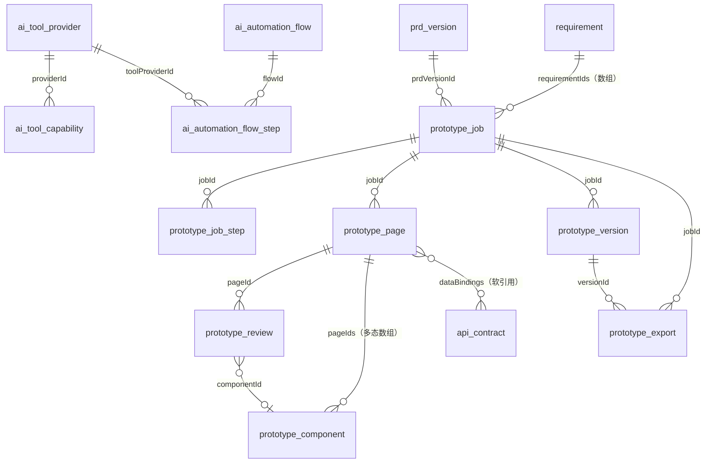
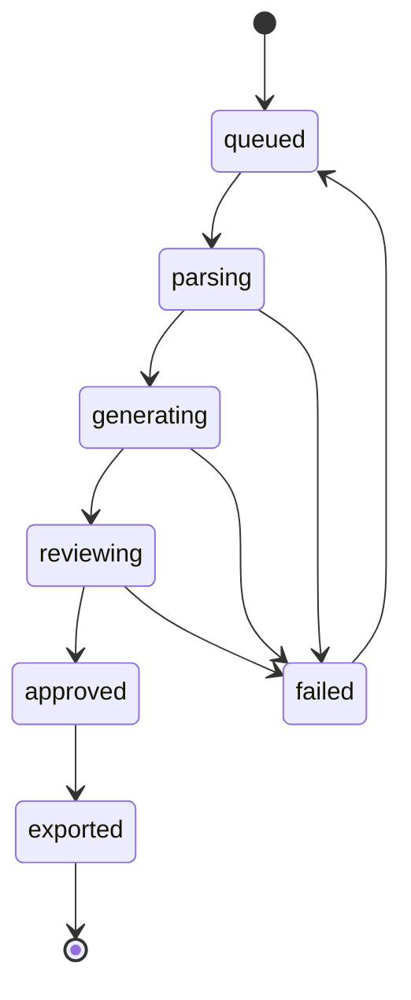

# impl-11 · AI 原型生成与 AxHub 集成实施方案

> **文档编号**：impl-11-prototype-axhub
> **文档版本**：v1.0
> **对应原型**：`makepro/src/prototypes/ai-sdlc-console`（数据源 `data-ai-flow.ts`：`AI_TOOL_PROVIDERS`（`provider-axhub`）/ `AI_TOOL_CAPABILITIES`（`AXHUB-01`~`AXHUB-06`）/ `AI_AUTOMATION_FLOWS`（`AIF-01`~`AIF-06`）/ `PROTOTYPE_JOBS` / `PROTOTYPE_JOB_STEPS` / `PROTOTYPE_PAGES` / `PROTOTYPE_COMPONENTS` / `PROTOTYPE_REVIEWS` / `PROTOTYPE_VERSIONS`；页面 `pages/PrototypePage.tsx`；批注机制 `index.tsx` + `annotation-source.json`）
> **依赖文档**：
> - `impl-00-overview.md`（术语基线、四层架构、组件清单与端口、私有化 / SaaS 出网形态）
> - `impl-01-protocol.md`（统一消息信封 `{ msgId, type, payload, traceId }`、`sdlc.<domain>.<event>` 主题命名、`SDLC-<DOMAIN>-<NNN>` 错误码、SSE 流式与幂等窗口）
> - `impl-02-agents.md`（`ag-pm` / `ag-arch` 的职责边界与输入输出 Schema、路由规则 `rr-01`/`rr-02`、Fallback 五类降级、上下文预算分配、Function Calling 约定）
> - `impl-03-state-machine.md`（迁移表与守卫表达式的写法、消费组、Redis 键、非法迁移统一响应）
> - `impl-04-data-model.md`（PostgreSQL 表结构的**唯一事实源**；本文新增表沿用其命名、审计五列与索引风格）
> - `impl-07-console.md`（pageId ↔ 数据域 ↔ REST ↔ 订阅三向映射表的列定义、门禁禁用态与乐观更新规范）
> - `impl-08-security.md`（`egressPolicy` 三档、`redactRules` `rd-01`~`rd-09`、校验点 CP-1~CP-7、`audit_log` 字段与 10 类 `category`）
> - `impl-10-management.md`（版本管理与 G1/G2 门禁证据的归属、`product_version` / `product_version_baseline` 表）
> - `impl-13-knowledge-weknora.md`（`KB_STAGE_ARTIFACT_MAP` 归档映射与 WeKnora 检索）
> **事实基线**：能力名、字段名、步骤名、权重、耗时、采纳率一律以 `data-ai-flow.ts` 为准；未定义的落地细节（表名、接口路径、事件主题、错误码、Redis 键）在本文中显式标注「本文定义」。

---

## 目录

- [1. 本文定位与范围](#1-本文定位与范围)
- [2. AxHub 能力对标与集成方式](#2-axhub-能力对标与集成方式)
- [3. 7 步生成流水线设计](#3-7-步生成流水线设计)
- [4. 数据模型](#4-数据模型)
- [5. REST 接口与事件](#5-rest-接口与事件)
- [6. 端到端自动化编排](#6-端到端自动化编排)
- [7. 原型产物如何回流平台](#7-原型产物如何回流平台)
- [8. 页面 ↔ 数据 ↔ 接口 ↔ 订阅 三向映射](#8-页面--数据--接口--订阅-三向映射)
- [9. 工时拆分与并行度](#9-工时拆分与并行度)
- [10. 验收清单与风险应对](#10-验收清单与风险应对)
- [变更记录](#变更记录)

---

## 1. 本文定位与范围

### 1.1 本文定位

本文是「AI 研发协作平台」实施落地文档体系的第 12 篇，把 `prototype`（AI 原型工坊）这一页落到可开工的实施方案，回答五个问题：

1. 「PRD 定稿后自动出原型」这一环节的价值、在 SDLC 中的位置与上下游关系；
2. 对标产品 **AxHub Make** 的六项能力（`AXHUB-01`~`AXHUB-06`）如何映射到本平台，用什么协议、鉴权、配额与出网管控接入；
3. 7 步生成流水线（权重 8/12/30/18/14/12/6）每一步的输入、输出、模型与 Agent、Prompt 要点、失败模式、降级与人工检查点；
4. 原型域的 11 张新表、22 个 REST 接口、16 个事件主题与 8 个新错误码；
5. 原型产物如何回流平台：批注锚点如何随 Make 导出包保留、如何归档进企业知识库、如何成为 G1/G2 门禁证据。

### 1.2 「PRD 定稿后自动出原型」的价值

| 价值维度 | 现状（无自动原型） | 本平台（`AIF-01`） | 量化依据 |
|:---|:---|:---|:---|
| 需求歧义暴露时点 | 歧义在编码或测试阶段才暴露，返工成本高 | 歧义在 PRD 定稿后 **142 分钟**内以可视化原型暴露，评审在原型上打锚点批注 | `AIF-01.avgEndToEndMin = 142` |
| 需求确认成本 | 文字 PRD 评审靠想象，多轮往返 | 可点击走查（HTML 包，1440 / 834 / 390 三断点）+ 锚点级批注 | `AXHUB-05.adoptionRatePct = 94`（六项能力中最高） |
| G1 门禁证据 | 需求门禁只有 PRD 文本，缺界面基线 | 导出包直接挂载为 G1 需求门禁与 G2 架构门禁的评审证据 | `AXHUB-06.outputArtifacts` 含「门禁证据附件」；`PTV-05.changeSummary`「导出 make / figma / html 三种格式并挂载为 G1 需求门禁证据」 |
| 前后端并行度 | 前端等设计稿，无法与后端契约同步开工 | 原型页面绑定后端契约（`dataBindings` 直接写 `API-03 GET /api/v2/orders`），前端脚手架可与后端并行 | `PT-02.desc`「让 `TASK-2416` 的前端脚手架可与 `TASK-2415` 拆单引擎并行推进」 |
| 设计资产复用 | 每次重画，组件不统一 | 企业组件库 `axhub-lib 5.4.2` 检索复用，18 个组件中 15 个来自库内 | `PROTOTYPE_COMPONENTS` 的 `source` 分布 |
| 失败可归因 | 需求不清导致的失败无迹可查 | 7 步流水线逐步留痕（`warnings` / `artifacts` / `tokenIn` / `tokenOut`），失败可定位到步骤 | `PT-05` 的 `PTS-29`/`PTS-30`/`PTS-33` 三条 warning 构成完整归因链 |

### 1.3 在 SDLC 中的位置

```
st-req 需求澄清（G1）                      st-arch 架构设计（G2）
┌──────────────────────────┐   ┌──────────────────────────────┐
│ requirement 页            │   │ prototype 页                  │ design 页
│ Brainstorm → PRD → 评审    │──▶│ PRD 基线 → 7 步流水线 → 原型    │──▶│ 架构文档 / 接口契约 /
│ PRD_VERSIONS(v1.0~v2.3)   │   │ 批注评审 → 版本基线 → 导出      │   │ 任务拆解 / 三点估算
│ 触发事件 sdlc.prd.baselined│   │ 产物：G1 证据 + G2 界面基线    │   │ 产物：G2 契约冻结
└──────────────────────────┘   └──────────────────────────────┘   └──────────────────────────┘
     ag-pm（mdl-claude）            ag-pm 主导 + ag-arch 协同            ag-arch（mdl-gpt5）
```

| 定位项 | 取值 | 源 |
|:---|:---|:---|
| 挂载 SDLC 环节 | `st-req`（需求澄清，G1）与 `st-arch`（架构设计，G2）**两个环节之间**，`provider-axhub.sdStageIds = ['st-req', 'st-arch']` | `AI_TOOL_PROVIDERS[provider-axhub].sdStageIds` |
| 负责 Agent | `ag-pm` 需求澄清 Agent（主导）+ `ag-arch` 架构设计 Agent（协同），`provider-axhub.agentIds = ['ag-pm', 'ag-arch']` | 同上 |
| 门禁归属 | 产物作为 **G1 需求门禁**的评审证据（原型批注闭环 + 导出包）与 **G2 架构门禁**的界面基线（页面绑定接口契约） | `PT-01.desc`、`AXHUB-06.desc` |
| 上游 | `requirement` 页产出的 `PRD_VERSIONS`，**必须是 `baseline = true` 的版本**（本例 `PRD-ORD-v2.3`） | `PrototypePage.tsx` 第 1563 行 `canGenerate` 判定 |
| 下游 | `design` 页的架构文档与接口契约（原型的 `dataBindings` 引用 `API-*`）；`board` / `coding` 页的前端任务（`TASK-2416` 前端脚手架） | `PROTOTYPE_PAGES[].dataBindings` |
| 归档终点 | WeKnora（`provider-weknora`），`AIF-01` 步骤 8 归档为 G1 门禁证据 | `AIF-01.steps[8].toolProviderId` |

### 1.4 与 `requirement` 页、`design` 页的上下游关系

| 关系 | `requirement`（需求工作台） | `prototype`（AI 原型工坊） | `design`（架构设计与任务拆解） |
|:---|:---|:---|:---|
| 职责 | 单条需求的**纵向深度作业**：Brainstorm → PRD → 评审 → 拆解 → 验收标准（impl-10 §1.5 已界定） | 把已定稿 PRD **可视化**：页面结构、组件映射、交互流与状态机、批注评审、版本基线、导出 | 把已确认需求**技术化**：限界上下文、四层架构、接口契约冻结、任务拆解与三点估算 |
| 输入 | 业务方口述纪要、客户投诉、历史 PRD、`KB-BS-2401` | `prd_version`（`baseline=true`）+ `requirement`（`REQ-2401`~`REQ-2408`）+ 业务术语表 | `requirement` + 原型页面清单 + `KB-ARCH-01` |
| 输出 | `PRD-ORD-v2.3`（13,460 字 / 32 条验收标准 / 14 条用户故事）、`sdlc.prd.baselined` 事件 | `PT-01`~`PT-05` 生成任务、`PTP-01`~`PTP-14` 页面、`PTC-01`~`PTC-18` 组件、`PTR-01`~`PTR-12` 批注、`PTV-01`~`PTV-06` 版本、make/figma/html/sketch 导出包 | `ARCH_COMPONENTS`（14 个）、`API_CONTRACTS`（14 份）、`TASKS`（24 个）、`sdlc.contract.frozen` 事件 |
| 联动点 | 「PRD 基线冻结」按钮触发 `sdlc.prd.baselined` → `AIF-01` 步骤 1 监听 | 「需求确认并导出交付包」（`AIF-01` 步骤 7）回写 `requirement.status`，批注闭环结论回灌 `prd_review` | 原型的 `dataBindings`（如 `API-03 GET /api/v2/orders（游标分页，v2.0 由 offset 改 cursor）`）是 `design` 页接口定义表的**界面侧对照**；契约变更需回查受影响页面 |
| 反向回流 | 原型失败（`PT-05`）→ **回退到需求澄清环节**（`st-req`），通知产品补齐验收标准 | — | 阻断级批注（如 `PTR-03` 退款时序）→ 需先补 ADR 再定稿（`PT-03.reviewStatus`），即回流到 `design` 页 |

> **不重复定义**：PRD 版本状态机（`草稿`/`评审中`/`已基线`/`已废弃`）见 impl-01 §4.2 与 impl-04 §3.4；架构契约冻结与任务拆解见 impl-02 §3.3。本文只定义**原型域**的状态与契约。

### 1.5 范围边界

| 在范围内 | 不在范围内 |
|:---|:---|
| `provider-axhub` 的集成元信息、协议、鉴权、配额、出网管控 | AxHub Make 产品自身的实现与商业条款 |
| 7 步生成流水线的输入 / 输出 / 模型 / Prompt / 权重 / 耗时 / 失败模式 / 降级 / 人工检查点 | 页面视觉规范与设计 token 的定义（`design-token v3` 为外部输入） |
| 原型域 11 张表、22 个接口、16 个事件、8 个错误码 | 接口自动化（`provider-hifox`）→ impl-12；知识库（`provider-weknora`）业务数据 → impl-13 |
| `AIF-01` 的完整展开与另 5 条编排流的全景 | Agent 的 Prompt 全文与 few-shot 样例 → impl-02 §4 |
| 批注锚点（`data-annotation-id`）的 wire format 与导出保真 | 前端组件类名清单与可访问性规则 → impl-07 §4、§8 |
| 原型作为 G1/G2 门禁证据的挂载方式 | 门禁 G1~G6 的内部校验算法 → impl-06 / impl-07 §3.2 |

---

## 2. AxHub 能力对标与集成方式

### 2.1 `provider-axhub` 集成元信息（逐字取自 `AI_TOOL_PROVIDERS`）

| 字段（TS） | 落库列（本文 §4.2） | 取值 |
|:---|:---|:---|
| `id` | `code` | `provider-axhub` |
| `name` | `name` | `AxHub Make` |
| `vendor` | `vendor` | `AxHub · Make 原型协作平台（AI 生成页面结构 / 企业组件库 / 批注评审 / 多人协同 / 多格式导出）` |
| `kind` | `kind` | `prototype` |
| `version` | `provider_version` | `Make 5.4.2` |
| `endpoint` | `endpoint` | `https://axhub.intra.example.com/api/v1` |
| `protocol` | `protocol` | `REST` |
| `authMode` | `auth_mode` | `OAuth2 授权码 + 项目级 Token` |
| `status` | `status` | `connected` |
| `connectedAt` | `connected_at` | `2026-01-14 10:20` |
| `capabilities` | → `ai_tool_capability` 子表（6 条） | `AI 生成页面结构` / `axhub-lib 组件库检索与映射` / `交互流与状态机可视化编排` / `锚点级批注评审` / `多人实时协同` / `Make / Figma / HTML / Sketch 导出` |
| `sdStageIds` | `sd_stage_ids` | `['st-req', 'st-arch']` |
| `agentIds` | `agent_ids` | `['ag-pm', 'ag-arch']` |
| `slaUptimePct` | `sla_uptime_pct` | `99.5` |
| `avgLatencyMs` | `avg_latency_ms` | `420` |
| `dailyCallCount` | `daily_call_count` | `1860` |
| `docsUrl` | `docs_url` | `https://axhub.intra.example.com/docs/openapi` |
| `note` | `note` | 「本平台「AI 原型工坊」的对标产品。原型任务生成完成后回写 AxHub 项目（`AXH-PRJ-*`），批注锚点与版本快照双向同步，导出产物直接作为 G1 需求门禁的评审证据。」 |
| `tone` | （不落库，impl-10 §2.2 约定 C-1） | `brand` |

### 2.2 集成方式决策

| 决策点 | 选定方案 | 理由 | 被否方案及原因 |
|:---|:---|:---|:---|
| 调用形态 | **REST**（`protocol='REST'`，OpenAPI 文档 `docsUrl`） | 与 `provider-hifox`（REST）、`provider-weknora`（REST）统一，`integration-adapter:8085` 可复用同一套 HTTP 客户端、重试与熔断组件；OpenAPI 可用 `schema-gen` 生成 TS 类型（impl-07 §5.6 第 5 条） | SDK：引入 AxHub 私有依赖，与原型「不新增依赖」约束冲突，且 SDK 版本升级绑定发布节奏；gRPC：AxHub 未提供；MCP：适合工具级细粒度调用，不适合「一次生成 8 个页面」的长任务 |
| 长任务模式 | **异步作业 + 轮询 / 事件回调**：`POST` 创建作业返回 `jobId`，AxHub 侧回调 `POST /api/v1/integrations/axhub/callbacks`，平台侧同时以 `GET /prototype-jobs/{id}/steps` 轮询兜底（30 s） | 单任务耗时 942~2,146 s（`PROTOTYPE_JOBS.durationSec`），远超 HTTP 超时；`avgLatencyMs=420` 是**单次 API 调用**时延，不是生成时延 | 同步等待：必然超时；纯轮询：无回调时延迟最高 30 s，页面进度条不平滑 |
| 鉴权 | **OAuth2 授权码**换取平台级 access token（TTL 由 AxHub 决定，本地缓存至过期前 60 s 刷新）+ **项目级 Token** 按 `axhubProjectId`（`AXH-PRJ-2401`~`AXH-PRJ-2404`）隔离 | `authMode` 逐字要求；项目级 Token 保证「A 项目的原型作业不能写 B 项目的 AxHub 空间」 | 静态 API Key：无法按项目隔离，泄露面大 |
| 密钥存储 | 客户 KMS / Vault（私有化）或平台 KMS 信封加密（SaaS），落库只存掩码（`tokenMasked`，与 impl-01 §4.7 `/integrations/pingcode/config` 同构） | impl-00 §5、impl-08 §7.2 | 明文落 `platform_config`：违反 impl-08 §1 安全红线 |
| 配额与限流 | Redis `rl:axhub:{scope}`（impl-04 §5 的 `rl:{scope}:{key}` 键模式，`scope='axhub'`）：单租户 **60 次/分钟**、单作业并发 **3 个**、日调用量软上限 **1860 × 1.5 = 2790 次**（`dailyCallCount` 为当前基线） | 超上限返回 `SDLC-PTP-503`；软上限触发 80% 告警、100% 排队 | 无限流：AxHub SLA 99.5%，被打满会连带影响其他租户 |
| 出网管控 | 见 §2.3 | — | — |
| 健康检查 | `GET /ai-tool-providers/{id}/health`（`PTP-21`），探活 AxHub `/api/v1/healthz` + 组件库版本比对（`axhubLibVersion` 是否仍为 `5.4.2`） | 组件库版本漂移是 §10.2 的风险 R-02，必须可探测 | 只探 HTTP 200：无法发现版本漂移 |

### 2.3 出网管控与 PRD 脱敏（关联 impl-08 `egressPolicy` 与 `redactRules`）

**风险前提**：PRD 是**业务侧原文**，可能含客户数据（收货人、手机号、地址、金额、卡号）、内部经营数据（GMV、成本）与内网地址。把 PRD 送给 AxHub（`https://axhub.intra.example.com`，内网域名但属**跨系统边界**）等同于出域，必须过 impl-08 的校验点。

| 校验点（impl-08 §2.3） | 在原型生成链路中的落点 | 判定 | 命中结果 |
|:---|:---|:---|:---|
| CP-1 | `PrototypePage` 新建任务表单提交前（客户端） | 用户未勾选「允许 PRD 原文送 AxHub」且档位为 `MASK` | 只送**结构化摘要**（用户故事 + 验收标准 + 字段字典），不送 PRD 全文 |
| CP-2 | `api-gateway` 入站（`PTP-01`） | PRD 正文 > 2 MB 或 > 5,000 行 | 拒绝，`SDLC-SEC-413`；本例 PRD 全文 13,460 字（约 40 KB）远低于上限 |
| CP-2b | `api-gateway` 入站 | `egressPolicyId=DENY` 且请求体含 PRD 原文 | 丢弃内容仅留元数据，`result='denied'`，`SDLC-SEC-403` |
| **CP-3** | **脱敏中间件（`ContentRedactor`）** | `mode=MASK` 时对 PRD 正文逐条跑 `rd-01`~`rd-09` | 命中即替换；规则异常 / 正则超时 > 50 ms → **fail-closed** 拒绝送 AxHub，`SDLC-SEC-403`，`detail.reason='mask-failed'` |
| CP-4 | `model-gateway` 路由前 | `mode=DENY` 且目标模型非 `mdl-local` | 强制改路由 `mdl-local`；不可用则拒绝（原型生成整体禁用，见 §3.9） |
| CP-5 | 出口代理 | AxHub 域名不在白名单 | 连接拒绝，不重试其他外部服务，`SDLC-SEC-403` |
| CP-6 | `audit_log` 写入 | 任何 PRD 送 AxHub 的行为 | 记 `category='上传上下文'`、`detail` 含命中规则集合、PRD 版本、字数、`traceId` |
| CP-7 | `wss-hub` 下行 | `DENY` 环境订阅含 PRD 原文切片的消息 | 服务端静默过滤 `payload.prdContent` |

**PRD 场景的脱敏规则映射（沿用 impl-08 §3.2 / §3.3 的 9 条，不新增规则）**：

| 规则 | PRD / 原型场景的命中位置 | 前 → 后 | 对生成质量的影响与补偿 |
|:---|:---|:---|:---|
| `rd-01` 手机号掩码 | PRD 中的客服工单样例、投诉记录引用（如 `RP-02` 的 `sourceRef`） | `13815626621` → `138****6621` | 无影响；原型只需字段形态不需真值 |
| `rd-02` 身份证号掩码 | 实名认证类验收标准的样例数据 | `330106199203124521` → `330106********4521` | 无影响；`REQ-2408` 导出与二次授权页只需展示掩码态 |
| `rd-03` 收货地址脱敏 | 订单详情 / 拆单场景的样例地址（多仓拆单需省市，正好保留） | `浙江省杭州市西湖区文三路 90 号 3 幢 501 室` → `浙江省杭州市西湖区****` | **保留省市区**恰好满足 `PTP-09`「拆单预演结果对比」的仓库维度展示需求 |
| `rd-04` 银行卡号掩码 | 退款链路（`PTR-03` 父 / 子订单退款时序）的样例卡号 | `6222020200112233445` → `***************3445` | 无影响 |
| `rd-05` 邮箱用户名掩码 | 通知类验收标准 | `linshuyuan@example.com` → `lin***@example.com` | 无影响 |
| `rd-06` 姓名掩码 | PRD 中的干系人 / 客户姓名、评审意见引用 | `林书言` → `林**` | 无影响；原型用占位头像与 `ac-user-name` |
| **`rd-07`** 金额区间模糊 | **原型页面的金额列**（`PTR-01` 已明确要求） | `¥3,286.50` → `¥1,000~5,000` | **有影响**：`PTP-01`「订单列表 · 数据表格『订单金额』列」需同时支持明文与区间两种渲染分支。`PTR-01.aiResponse` 已给出方案：「金额列改为右对齐并启用 `tabular-nums`，接入 `ac-mask-sdk` 的 `rd-07` 规则，按角色权限切换『明文 / 区间』两种渲染分支，区间态附 `title` 说明原因」；落地结果是 `PTC-01` 新增「区间展示」变体（`variantCount` 5 → 6），`PTP-01.editCount + 1` |
| `rd-08` 令牌全量替换 | PRD 附录中的集成配置片段 | `pc_live_8f3a9c2e7b14d05a6c88` → `pc_live_****c88` | 无影响 |
| `rd-09` 内网地址与连接串 | PRD 中的部署拓扑、数据库连接串、`endpoint` 引用 | `redis://10.24.3.9:6379` → `redis://{{INTERNAL_ADDR}}` | **有影响**：`PTP-08`「迁移与双写校验仪表盘」的分片拓扑图需按占位符渲染，不得回填真实内网地址 |

**双向同步的脱敏一致性**：AxHub 侧回写批注（`PTR-*`）时，`comment` / `anchorText` 可能含评审人手写的敏感值（如真实订单号）。回写入站时**再跑一次 CP-3**（服务端为权威判定，impl-08 §3.3），命中则掩码后落库并在 `prototype_review.redacted=true` 标记（本文定义列，见 §4.9）。

### 2.4 六项能力逐条展开（`AXHUB-01`~`AXHUB-06`，逐字取自 `AI_TOOL_CAPABILITIES`）

| id | 能力名 | 说明（`desc` 逐字） | 输入产物 | 输出产物 | 负责 Agent | 自动化程度 | 平均耗时 | 采纳率 | 本平台落地能力 |
|:---|:---|:---|:---|:---|:---|:---|:--:|:--:|:---|
| `AXHUB-01` | 需求文档解析与信息架构抽取 | 把 PRD 基线文档按语义块切分，识别需求条目、用户故事与验收标准，抽取实体关系与字段字典，产出可驱动页面生成的信息架构树（导航层级 + 页面清单）。 | `PRD 基线文档（PRD-ORD-v2.3）`、`需求列表（REQ-2401~2408）`、`业务术语表` | `prd-parse-tree.json`、`ia-nav-tree.json`、`entity-dict.json` | `ag-pm` | `full` | 96 s | 88% | AI 原型工坊 · 需求解析器（**步骤 1~2**） |
| `AXHUB-02` | 页面结构自动生成（低保真 → 高保真） | 按信息架构树逐页生成栅格骨架与区块布局，支持 1440 / 834 / 390 三断点，一次产出低保真线框并可一键升级为高保真视觉稿。 | `ia-nav-tree.json`、`页面优先级（P0/P1/P2）`、`断点与设备目标` | `*.make 页面文件`、`layout-grid.json`、`低保真预览 PNG` | `ag-arch` | `full` | 620 s | 82% | AI 原型工坊 · 页面结构生成（**步骤 3**） |
| `AXHUB-03` | 组件库检索与智能映射 | 在企业组件库 `axhub-lib` 中按语义检索候选组件，给出映射置信度与变体建议；库内缺失时自动派生新组件并回写为自定义组件，附带 props 契约。 | `layout-grid.json`、`axhub-lib 5.4.2 组件索引`、`设计 token v3` | `component-map.json`、`自定义组件 props 契约`、`组件复用矩阵` | `ag-arch` | `assisted` | 340 s | 76% | AI 原型工坊 · 组件选型与映射（**步骤 4**） |
| `AXHUB-04` | 交互流与状态机可视化编排 | 把验收标准中的 Given-When-Then 转成页面间交互流与业务状态机，自动补齐非法流转分支与异常态，输出可在原型内点击走查的交互图。 | `验收标准（GWT）`、`订单状态机定义（10 态 42 条流转边）`、`页面清单` | `interaction-flow.json`、`order-state-machine.svg`、`异常分支清单` | `ag-pm` | `assisted` | 260 s | 71% | AI 原型工坊 · 交互流与状态机（**步骤 5**） |
| `AXHUB-05` | 锚点级批注评审与多人协同 | 在原型任意界面元素上打批注锚点，支持建议 / 问题 / 阻断 / 确认四类，多角色并行评审，AI 对每条批注给出回应与可执行的修改方案并生成新版本。 | `*.make 页面文件`、`批注锚点`、`评审人角色矩阵` | `批注清单`、`AI 回应与修改方案`、`原型新版本快照` | `ag-pm` | `assisted` | 180 s | **94%** | AI 原型工坊 · 批注评审闭环（**步骤 7**） |
| `AXHUB-06` | 多格式导出与研发交付 | 一键导出 Make / Figma / HTML / Sketch 四种格式，附带组件清单、交互说明与切图资源，导出包可直接作为 G1 需求门禁与 G2 架构门禁的评审证据归档。 | `已批准原型版本`、`组件清单`、`设计 token` | `export-manifest.json`、`HTML 走查包`、`Figma 库`、`门禁证据附件` | `ag-arch` | `full` | 72 s | 89% | AI 原型工坊 · 产出与批注锚点（**步骤 7**） |

**六项能力的三条观察（本文分析）**：

1. **采纳率与自动化程度不成正比**：`AXHUB-05`（批注评审，`assisted`）采纳率 94% 最高，而 `AXHUB-02`（页面结构生成，`full`）只有 82%。原因是批注评审的 AI 产出**只需回应人已经提出的问题**（问题空间收敛），而页面结构生成要**猜人的信息架构偏好**（问题空间发散）。落地含义：`full` 级能力必须配「人工可改」的兜底（`prototype_page.humanEdited` / `editCount`），不能因为标了 `full` 就跳过人工检查点。
2. **`AXHUB-04` 采纳率最低（71%）且是唯一会导致整条流水线失败的能力**：`PT-05` 就失败在这一步（§3.8）。原因是它强依赖「验收标准的 GWT 结构完整率」，而这是上游 `ag-pm` 的产出质量决定的 —— 跨 Agent 的质量依赖必须在**上游**设门禁，不能在下游重试。
3. **耗时分布极不均匀**：`AXHUB-02` 620 s + `AXHUB-03` 340 s = 960 s，占 7 步总耗时（2,146 s）的 44.7%，与权重（30 + 18 = 48%）基本吻合，说明**权重就是按耗时标定的**，进度条不会出现「长时间不动」的观感问题。

### 2.5 能力 ↔ 流水线步骤 ↔ 数据实体 对照

| 能力 id | 流水线步骤（`PROTOTYPE_JOB_STEPS.name`） | 权重 | 产出数据实体（本文 §4） | `PT-01` 实测耗时 |
|:---|:---|:--:|:---|:--:|
| `AXHUB-01` | 步骤 1 解析 PRD + 步骤 2 抽取信息架构 | 8 + 12 = 20 | `prototype_job_step.artifacts`（`prd-parse-tree.json` / `glossary-26.json` / `ia-nav-tree.json` / `entity-dict-186.json` / `page-priority.csv`） | 168 + 246 = 414 s |
| `AXHUB-02` | 步骤 3 生成页面结构 | 30 | `prototype_page`（`PTP-01`~`PTP-08`，`layout-grid-214.json`，214 个布局区块） | 812 s |
| `AXHUB-03` | 步骤 4 组件选型与映射 | 18 | `prototype_component`（`PTC-01`~`PTC-18`，`component-map-18.json`） | 428 s |
| `AXHUB-04` | 步骤 5 交互流与状态机 | 14 | `prototype_page.interactions`（34 条）+ `order-state-machine.svg` | 264 s |
| —（设计 token，AxHub 未单列能力） | 步骤 6 设计 token 与视觉 | 12 | `prototype_page.status` 升级为高保真 + `design-tokens-v3.json` / `visual-hifi-8.png` / `visual-dark-8.png` | 156 s |
| `AXHUB-05` + `AXHUB-06` | 步骤 7 产出与批注锚点 | 6 | `prototype_review`（9 个锚点）+ `prototype_version`（5 个快照）+ `prototype_export`（`export-manifest.json`） | 72 s |

> **步骤 6「设计 token 与视觉」在 `AI_TOOL_CAPABILITIES` 中没有对应能力条目**（AxHub 把它并入 `AXHUB-02` 的「一键升级为高保真视觉稿」）。本文按 7 步流水线独立登记，落库时 `prototype_job_step.capability_id` 对步骤 6 置空串（§4.6），并在 §10.2 风险 R-06 中登记该口径差异。

---

## 3. 7 步生成流水线设计

### 3.0 总览

| 项 | 取值 | 源 |
|:---|:---|:---|
| 步骤数 | 7（固定，不可配置） | `PrototypeJobStepDef.name` 注释：「7 步固定：解析 PRD / 抽取信息架构 / 生成页面结构 / 组件选型与映射 / 交互流与状态机 / 设计 token 与视觉 / 产出与批注锚点」 |
| 权重 | `8 / 12 / 30 / 18 / 14 / 12 / 6`，**合计 100** | `data-ai-flow.ts` 文件头 + `PrototypePage.tsx` 第 145 行 `STEP_WEIGHTS` |
| 进度算式 | `progress = Σ(已完成步骤权重) + 当前步骤权重 × (已完成单元 ÷ 总单元)` | `PROTOTYPE_JOB_STEPS` 注释 |
| 步骤记录规模 | 7 步 × 5 任务 = **35 条**（`PTS-01`~`PTS-35`） | 同上 |
| 步骤状态 | `done` / `running` / `pending` / `failed` / `skipped` | `PrototypeJobStepDef.status` |
| 耗时自洽 | 各任务 7 步 `durationSec` 之和 = 该任务的 `durationSec` | 同上 |

**进度算式的三个真实校验点**：

| 任务 | 状态 | 算式 | `progress` |
|:---|:---|:---|:--:|
| `PT-01` / `PT-03` / `PT-04` | 七步全 `done` | `8+12+30+18+14+12+6` | 100 |
| `PT-02` | 前 3 步 `done` + 第 4 步 4/6 页 | `8+12+30 + 18 × 4 ÷ 6 = 50 + 12` | 62 |
| `PT-05` | 前 4 步 `done` + 第 5 步 `failed` | `8+12+30+18`（失败步骤不计权重） | 68 |

### 3.1 步骤 1 · 解析 PRD（权重 8）

| 项 | 内容 |
|:---|:---|
| **输入** | `prd_version`（`baseline=true`，本例 `PRD-ORD-v2.3`，13,460 字）+ `requirement`（`REQ-2401`~`REQ-2408`，`PT-01` 覆盖 7 条：`REQ-2401`/`2402`/`2403`/`2404`/`2405`/`2407`/`2408`）+ 业务术语表（WeKnora 检索） |
| **输出** | `prd-parse-tree.json`、`glossary-26.json`（`PT-01` 实测：切分 42 个语义块，识别 8 条需求、14 条用户故事、32 条验收标准，术语表命中 26 项） |
| **模型 / Agent** | `mdl-claude`（`PT-01`）/ `mdl-deepseek`（`PT-05`）/ `ag-pm` 需求澄清 Agent |
| **能力对标** | `AXHUB-01`（`automationLevel='full'`，`avgDurationSec=96`，`adoptionRatePct=88`） |
| **Prompt 要点** | ① 按**语义块**切分而非按标题层级（标题层级切分会把「验收标准」与所属用户故事拆开）；② 每个语义块标注类型（背景 / 目标 / 需求条目 / 用户故事 / 验收标准 / 非功能需求 / 开放问题）；③ **统计每章的 GWT 结构完整率**（`Given-When-Then` 三段齐备的验收标准条数 ÷ 该章验收标准总条数），完整率 < 80% 的章节写入 `warnings`；④ 抽取业务术语并与术语表比对，未登录词进 `glossary` 待人工确认；⑤ 不做任何页面推断（那是步骤 2 的事） |
| **实测耗时 / Token** | `PT-01`：168 s，`tokenIn 18600` / `tokenOut 2400`；`PT-05`：152 s，`tokenIn 6800` / `tokenOut 920` |
| **失败模式** | ① PRD 非基线（`baseline=false`）→ 前置校验拦截，返回 `SDLC-PTP-422`；② 语义块切分失败（正文结构异常）→ 降级为按标题层级切分并标 `warnings`；③ 目标章节 GWT 完整率 0% → **本文要求在此步硬阻断**（见 §3.8）；④ 上下文超 200K → 按 impl-02 §8.2 压缩，仍超限则按章节分批解析后合并 |
| **降级** | `mdl-claude` → `mdl-qwen`（`rr-01` 备用）→ 按标题层级切分（`degraded:true`，`warnings` 交人工复核，即 `AIF-01` 步骤 2 的 `fallbackAction`） |
| **人工检查点** | 无（`full` 自动化）；但 `warnings` 非空时在 `PrototypePage`「生成任务」标签的步骤条上显示琥珀标记，点击展开原文 |

### 3.2 步骤 2 · 抽取信息架构（权重 12）

| 项 | 内容 |
|:---|:---|
| **输入** | `prd-parse-tree.json` + `entity-dict`（字段字典）+ `ARCH_COMPONENTS`（14 个架构组件，用于对齐限界上下文命名） |
| **输出** | `ia-nav-tree.json`、`entity-dict-186.json`、`page-priority.csv`（`PT-01` 实测：3 层导航「订单域 / 履约域 / 合规域」、8 个一级页面、14 个实体关系、字段字典 186 项、页面优先级 `P0×4 / P1×3 / P2×1`） |
| **模型 / Agent** | `mdl-claude` / `ag-pm` |
| **能力对标** | `AXHUB-01`（与步骤 1 共用同一能力条目） |
| **Prompt 要点** | ① 导航层级**必须**与 `ARCH_COMPONENTS` 的限界上下文对齐（订单域 / 履约域 / 合规域），不得自造第四层；② 页面类型从 7 个枚举中选（`列表`/`表单`/`详情`/`看板`/`仪表盘`/`向导`/`弹窗`），选择依据是「该页的主要用户动作」而非「数据形态」；③ 优先级 `P0/P1/P2` 的判定规则：`P0` = 主链路必经页（下单 / 详情 / 状态看板）、`P1` = 高频辅助页（审计流水 / 优惠试算 / 导出）、`P2` = 运维与观测页（迁移仪表盘）；④ 字段字典须给出每字段的**脱敏规则引用**（`rd-01`~`rd-09`），供步骤 3 渲染时决定明文 / 掩码分支；⑤ 增量模式（`mode='incremental'`）下只在既有导航树上**挂子树**，不得重排既有层级（`PT-02` 实测：「在 `PT-01` 导航树上挂出『履约域』子树，新增 6 个页面与 5 个实体（拆单规则 / 子订单 / 库存分配 / 拆单异常 / 合单方案）」） |
| **实测耗时 / Token** | `PT-01`：246 s，`tokenIn 12400` / `tokenOut 3860`；`PT-05`：214 s，`tokenIn 5200` / `tokenOut 1740` |
| **失败模式** | ① 实体关系成环 → 中止并输出环路，交 `ag-arch` 人工拆解（与 `AIF-06` 步骤 3 的环形依赖处理同构）；② 页面数 > 20 → 提示拆分需求（单任务页面数上限 20，本文定义）；③ 无法从验收标准反推页面边界 → 走**模板兜底**并写 `warnings`（`PT-05` 的 `PTS-30`：「信息架构由模板兜底推导，非从验收标准反推，页面边界可能返工」） |
| **降级** | 同步骤 1；模板兜底是**最后一级**降级，触发即标记该任务为「高风险」，步骤 5 前必须人工确认（§3.8） |
| **人工检查点** | `warnings` 含「模板兜底推导」时，`PrototypePage` 在「原型结构与预览」标签的页面树上给该子树加虚线描边 + 提示「信息架构由模板兜底，页面边界可能返工」 |

### 3.3 步骤 3 · 生成页面结构（权重 30，最重）

| 项 | 内容 |
|:---|:---|
| **输入** | `ia-nav-tree.json` + `page-priority.csv` + `deviceTargets`（`desktop`/`tablet`/`mobile`）+ `fidelity`（`low`/`mid`/`high`） |
| **输出** | `PTP-01`~`PTP-08` 的 `*.make` 页面文件、`layout-grid-214.json`（214 个布局区块）、`wireframe-lowfi-8.png` |
| **模型 / Agent** | `mdl-claude` / `ag-arch` 架构设计 Agent |
| **能力对标** | `AXHUB-02`（`full`，`avgDurationSec=620`，`adoptionRatePct=82`） |
| **Prompt 要点** | ① 按 `P0 → P1 → P2` 顺序生成，保证中断时已产出的都是高价值页；② 断点固定三档 **1440 / 834 / 390**（与 `impl-07 §8` 的设计基线 1440×900 一致，`AXHUB-02.desc` 亦为此三值）；③ `layout` 从 4 个枚举选（`sidebar-content` / `top-nav` / `full-bleed` / `split`）：列表 + 详情抽屉用 `sidebar-content`、向导与对比用 `split`、看板与弹窗用 `full-bleed`；④ 每页必须产出**空态、加载态、异常态**三种兜底区块（`PTR-02` 的教训：「原型完全没有 `QUERY_TOO_WIDE` 与 `ES_DEGRADED` 这两个异常态，前端实现必然漏掉兜底提示」）；⑤ 每个区块预留 `data-annotation-id`（§7.1）；⑥ 数字列一律右对齐 + `tabular-nums`（`PTR-01` 的结论前移到生成阶段） |
| **实测耗时 / Token** | `PT-01`：812 s，`tokenIn 26800` / `tokenOut 18420`（全流水线 Token 峰值）；`PT-05`：604 s，`tokenIn 12600` / `tokenOut 9420` |
| **失败模式** | ① 单页区块数 > 60 → 拆页（避免生成不可读的巨型页面）；② `tokenOut` 触及模型最大输出（8192）→ 分页多次调用后合并，合并时校验 `route` 唯一；③ 三断点中某一档生成失败 → 只产出成功档位并在 `warnings` 记「{断点} 未生成」，不整体失败；④ AxHub 写入超时 → 重试 3 次，仍失败则本地暂存并把任务挂为 `queued`（`AIF-01` 步骤 4 的 `fallbackAction`） |
| **降级** | `mdl-claude` → `mdl-deepseek`（`rr-03` 备用）→ **线框兜底**：只产出 `layout-grid.json` 的区块占位（`fidelity='low'`），不出视觉稿，标 `degraded:true` |
| **人工检查点** | 页面生成后逐页可 `PUT /prototype-pages/{pageId}`（`PTP-09`）人工改布局与区块，改动置 `humanEdited=true`、`editCount + 1`；`fidelity='high'` 的任务在步骤 6 后强制人工走查（§3.6） |

### 3.4 步骤 4 · 组件选型与映射（权重 18）

| 项 | 内容 |
|:---|:---|
| **输入** | `layout-grid.json` + `axhub-lib 5.4.2` 组件索引 + `设计 token v3` |
| **输出** | `component-map-18.json`、`custom-components-4.fig`、组件复用矩阵（`PT-01` 实测：命中 14 个可复用组件，AI 派生 4 个自定义组件 —— 甘特条、环形图、代码 Diff 块、批注锚点变体，**平均映射置信度 91.4%**） |
| **模型 / Agent** | `mdl-claude` / `ag-arch` |
| **能力对标** | `AXHUB-03`（`assisted`，`avgDurationSec=340`，`adoptionRatePct=76`，六项中**第二低**） |
| **Prompt 要点** | ① 先库内检索后派生：`source` 优先级 `axhub-lib` > `custom` > `ai-generated`；② 每次映射输出**置信度**，`< 70%` 的区块转草稿态并标 `humanEdited` 待人工选型（`AIF-01` 步骤 3 的 `fallbackAction`）；③ 派生新组件必须给出 `propSchema`（3~6 个关键属性）与 `variantCount`，并回写为 AxHub 自定义组件；④ `pageIds` 与 `PROTOTYPE_PAGES[].componentIds` 必须**双向一致**，`reusedAcrossPages` 恒等于 `pageIds.length`；⑤ 每个组件给 `accessible` 与 `a11yNote`（不达标的写明原因），对齐 impl-07 §8 的可访问性规则 |
| **实测耗时 / Token** | `PT-01`：428 s，`tokenIn 15200` / `tokenOut 6840`；`PT-02` 步骤 4 为 `running`（234 s，`tokenIn 7600` / `tokenOut 3180`），`warnings`：「`axhub-lib 5.4.2` 缺少『四维规则编辑器』变体，AI 正在派生自定义组件，预计额外 180s」 |
| **组件来源分布（`PROTOTYPE_COMPONENTS` 18 个实测）** | `axhub-lib` **15** 个（`PTC-01`/`02`/`03`/`05`/`06`/`07`/`08`/`09`/`10`/`13`/`14`/`15`/`16`/`17`/`18`，`axhubLibVersion='5.4.2'`）；`custom` **1** 个（`PTC-04` 甘特条）；`ai-generated` **2** 个（`PTC-11` 环形图、`PTC-12` 代码 Diff 块）。`PTC-18`「批注锚点」为库内组件的**变体扩展**（`source='axhub-lib'`、`aiGenerated=false`、`reusedAcrossPages=14`，被全部 14 个页面引用） |
| **失败模式** | ① 组件库版本漂移（`axhubLibVersion != '5.4.2'`）→ 健康检查 `PTP-21` 报警，映射结果标 `stale`（§10.2 R-02）；② 库内无同类组件 → 派生并写 `warnings`（`PTS-04`：「`PTC-12`『代码 Diff 块』库内无同类组件，已按 `ai-generated` 派生并回写为自定义组件」）；③ 派生组件的 `propSchema` 与库内同名组件冲突 → 中止并要求人工命名 |
| **降级** | `mdl-claude` → `mdl-deepseek` → **纯检索兜底**：只做库内精确检索（不派生），未命中的区块留 `placeholder` 并全部转草稿态，`adoptionRatePct` 预期降至 50% 以下 |
| **人工检查点** | `PrototypePage`「组件与批注」标签的 13 列组件库表可逐行改 `source` / `variantCount` / `propSchema`；`ai-generated` 组件必须经 `architect` 确认后才可进入版本基线（否则 `PTP-17` 返回 `SDLC-PTP-422`） |

### 3.5 步骤 5 · 交互流与状态机（权重 14，**唯一会导致整条流水线失败的步骤**）

| 项 | 内容 |
|:---|:---|
| **输入** | 验收标准（GWT）+ 订单状态机定义（**10 态 42 条流转边**）+ 页面清单 |
| **输出** | `interaction-flow-34.json`（34 条页面间交互流）、`order-state-machine.svg`、异常分支清单（`PT-01` 实测：补齐 **6 条非法流转拦截分支**与 **3 个异常空态**） |
| **模型 / Agent** | `mdl-claude` / `ag-pm` |
| **能力对标** | `AXHUB-04`（`assisted`，`avgDurationSec=260`，`adoptionRatePct=71`，六项中**最低**） |
| **Prompt 要点** | ① 交互流从 GWT 的 `When` 反推 `trigger`，从 `Then` 反推 `action`；② `action` 为页内动作时 `targetPageId=null`，跨页跳转必须指向已生成的 `PTP-*`（不得指向不存在的页面）；③ 业务状态机必须与 impl-03 §2.1 的**任务 10 态**同源（原型页面 `PTP-04`「订单状态机流转看板」展示的是**订单业务状态机**，10 态 42 条流转边，与任务状态机是两套但结构同构，不得混用）；④ 自动补齐**非法流转拦截分支**（impl-03 §5.2 的 `SDLC-STATE-409` 语义在界面上的呈现）与异常空态；⑤ **GWT 缺失时不得编造交互分支**，直接返回空集合并写 `warnings`（这是 `PT-05` 失败的正确行为） |
| **实测耗时 / Token** | `PT-01`：264 s，`tokenIn 9800` / `tokenOut 5260`；`PT-04`：96 s，`tokenIn 3400` / `tokenOut 1680`（仪表盘类无业务状态机，只生成 9 条交互流）；`PT-05`：322 s，`tokenIn 9400` / **`tokenOut 240`**（两次重试均产出空图） |
| **失败模式** | ① 验收标准 GWT 完整率 0% → 无法推断交互分支，`transition` 集合为空（`PT-05` 的真实失败）；② 交互流覆盖率 < 30% → 判定不合格并重试；③ `targetPageId` 指向未生成页面 → 校验拦截；④ 状态机流转边与 impl-03 白名单冲突 → 中止并报错（不得生成非法流转的界面） |
| **降级** | `mdl-deepseek` → `mdl-gpt5`（`rr-05` 深挖同构）→ **无兜底**：这一步不能降级，因为没有交互流的原型对 G1 门禁无价值。失败即中止流水线并回退需求澄清（§3.8） |
| **人工检查点** | `PrototypePage`「原型结构与预览」标签的**交互流有向图**可逐条走查；`interactions` 支持人工增删（`PUT /prototype-pages/{pageId}`），改动计入 `editCount` |

### 3.6 步骤 6 · 设计 token 与视觉（权重 12）

| 项 | 内容 |
|:---|:---|
| **输入** | `design-token v3`（主色 `#2F5BFF`、圆角 `8px`、间距为 4 的倍数）+ 已映射组件 + `rd-07` 脱敏规则（金额列的明文 / 区间双分支） |
| **输出** | `design-tokens-v3.json`、`visual-hifi-8.png`、`visual-dark-8.png`（`PT-01` 实测：8 页高保真视觉稿 + 暗色变体，**对比度全部满足 WCAG AA**） |
| **模型 / Agent** | `mdl-claude` / `ag-arch` |
| **能力对标** | 并入 `AXHUB-02` 的「一键升级为高保真视觉稿」（AxHub 未单列能力条目，见 §2.5 注） |
| **Prompt 要点** | ① 只允许引用 token，**不得写死颜色**（impl-07 §4.2 第 2 条）；② 语义色不足时可补语义色（`PT-02` 步骤 6 待执行内容：「为拆单域补充 2 个语义色（拆单中 / 拆单异常）与暗色变体」）；③ 暗色变体必须同步产出，不得事后补；④ 文本对比度 ≥ 4.5:1，不达标即重试（`--text-1` on `--bg-card`，impl-07 §8）；⑤ 状态**不得只靠颜色**传达，必须同时有文案（`ac-tag` + `ac-tag-dot` 仅辅助）；⑥ 金额 / 手机号 / 地址一类字段按 §2.3 的规则渲染掩码分支 |
| **实测耗时 / Token** | `PT-01`：156 s，`tokenIn 6400` / `tokenOut 2180`；`PT-04`：42 s，`tokenIn 2600` / `tokenOut 940`（中保真，为容量指标补阈值三色「达标 / 预警 / 违约」） |
| **失败模式** | ① 对比度不达标 → 自动调整明度重试，连续 2 次不达标则标 `warnings` 交人工；② token 缺失（引用了 `design-token v3` 未定义的变量）→ 中止并要求补 token；③ 暗色变体生成失败 → 只交付亮色并在 `warnings` 记「暗色变体缺失」，`fidelity` 降级为 `mid` |
| **降级** | `mdl-claude` → `mdl-deepseek` → **模板套壳**：直接套用 `design-token v3` 的默认组件皮肤，不做视觉优化，`fidelity` 强制降为 `low` |
| **人工检查点** | `fidelity='high'` 的任务在此步后**强制人工视觉走查**（`PT-01` 的 `PTV-04.changeSummary`：「完成视觉走查修正：1440 / 834 / 390 三断点适配、暗色变体补齐、全部文本对比度达到 WCAG AA」）；走查结论写入 `prototype_review`（`type='确认'`） |

### 3.7 步骤 7 · 产出与批注锚点（权重 6）

| 项 | 内容 |
|:---|:---|
| **输入** | 已批准 / 已生成的页面与组件 + 设计 token |
| **输出** | 写入 AxHub 项目（`PT-01` → `AXH-PRJ-2401`）、`annotation-anchors-9.json`（9 个批注锚点）、5 个版本快照（`PTV-01`~`PTV-05`）、`export-manifest.json`、导出 make / figma / html 三种格式并挂载为 **G1 门禁证据** |
| **模型 / Agent** | `mdl-claude` / `ag-pm`（写 AxHub 与批注锚点）+ `ag-arch`（导出，`AXHUB-06.aiAgentId='ag-arch'`） |
| **能力对标** | `AXHUB-05`（批注评审，`assisted`，180 s，**94%**）+ `AXHUB-06`（多格式导出，`full`，72 s，89%） |
| **Prompt 要点** | ① 锚点 id 命名规范 `ai-sdlc-<page>-<block>`（与 `annotation-source.json` 的 `nodes[].id` 同构，见 §7.1）；② 锚点必须落在**可定位的界面元素**上（`locator.selectors` 用 `[data-annotation-id="..."]` 属性选择器），不得落在文本节点；③ 每个锚点带 `aiPrompt`（供 AxHub 侧 AI 生成批注引导）与 `hasMarkdown`；④ 导出 manifest 必须列出每种格式的 `withComments` / `withInteractions` / `sizeMb`（§7.2）；⑤ 版本快照按 `v0.1 → v0.2 → v1.0 → v1.1 → v1.2` 递增，`isBaseline=true` 只允许一个 |
| **实测耗时 / Token** | `PT-01`：72 s，`tokenIn 2100` / `tokenOut 640`（全流水线最轻）；`PT-04`：18 s，`tokenIn 1200` / `tokenOut 380` |
| **失败模式** | ① AxHub 写入超时 → 重试 3 次，仍失败则本地暂存并把任务挂为 `queued`（`AIF-01` 步骤 4 的 `fallbackAction`）；② 锚点定位失败（元素被人工删除）→ 该锚点标 `orphaned`，不阻断导出，但在 manifest 中列出（§10.2 R-04）；③ 导出格式缺失 → 只交付 make + html，Figma 库转异步补齐（`AIF-01` 步骤 7 的 `fallbackAction`）；④ 存在未闭环的**阻断级**批注 → 导出包**不得**用作 G1 门禁证据（`PrototypePage` 第 3065 行：「仍有 N 条阻断级批注未闭环，导出包不能用作 G1 门禁证据」） |
| **降级** | `mdl-claude` → `mdl-qwen` → **只导 make + html**（两种平台原生格式，不依赖 Figma / Sketch 的第三方转换器） |
| **人工检查点** | ① 批注评审（`AIF-01` 步骤 5，`executor='human'`，6 人，5,400 s）；② 需求确认并导出交付包（`AIF-01` 步骤 7，`executor='ai+human'`）；③ 阻断级批注被驳回时需**研发总监二次确认**方可放行（`PrototypePage` 第 1317 行） |

### 3.8 `PT-05` 失败案例的完整归因（**必须解释**）

`PROTOTYPE_JOBS` 中 `PT-05`「优惠核销规则配置台 · 首次尝试（失败回退）」是唯一一条 `status='failed'` 的任务。

**任务元信息**：`prdVersionId='PRD-ORD-v2.0'`（**非基线版本**）、`requirementIds=['REQ-2403']`、`triggeredBy='u-su'`、`triggeredAt='2026-02-26 11:15'`、`mode='full'`、`modelId='mdl-deepseek'`、`agentId='ag-pm'`、`statusLabel='生成失败 · 已回退需求澄清'`、`progress=68`、`pageCountPlanned=6`、`pageCountDone=6`、`componentCount=8`、**`interactionCount=0`**、`durationSec=1610`、`tokenCost=5.18`、**`retryCount=2`**、`axhubProjectId=''`（**未写入 AxHub**）、`reviewStatus='未开始'`。

**`failReason`（逐字）**：

> `PRD v2.0` 中「优惠核销规则」章节只有业务描述、缺少可验证的验收标准（该章 GWT 结构完整率 0%），AI 无法推断互斥冲突、部分核销与核销回滚三类交互分支；步骤 5「交互流与状态机」连续 2 次重试均产出空图，已按兜底策略回退至需求澄清环节。该缺口在 PRD v2.3「全部 14 条用户故事补齐 Given-When-Then 验收标准」后消除，待重新触发。

**逐步归因链（`PTS-29`~`PTS-35`）**：

| 步骤 | 状态 | 耗时 | `tokenOut` | 关键信号 |
|:--:|:---|:---|:--:|:---|
| 1 解析 PRD（`PTS-29`） | `done` | 152 s | 920 | `outputSummary`：「仅识别到 2 条业务描述性条款，**未识别到任何 GWT 结构验收标准**」；`warnings`：「**目标章节验收标准缺失（GWT 完整率 0%），后续交互推断存在高风险**」 |
| 2 抽取信息架构（`PTS-30`） | `done` | 214 s | 1740 | `warnings`：「信息架构由**模板兜底**推导，非从验收标准反推，页面边界可能返工」 |
| 3 生成页面结构（`PTS-31`） | `done` | 604 s | 9420 | 生成 6 个页面骨架（仅桌面 1440 断点），84 个布局区块；无 `warnings` |
| 4 组件选型与映射（`PTS-32`） | `done` | 318 s | 3060 | 命中 8 个 `axhub-lib` 组件（数据表格 / 筛选栏 / 标签组 / 步骤条 / 树形结构 / 抽屉 / 模态框 / 批注锚点），映射置信度均值 **82.4%**（低于 `PT-01` 的 91.4%） |
| **5 交互流与状态机（`PTS-33`）** | **`failed`** | **322 s** | **240** | `outputSummary`：「两次重试均产出空交互图：缺少验收标准导致**互斥冲突、部分核销、核销回滚**三类分支无法推断，模型返回的 `transition` 集合为空」；`warnings` 三条：① 第 1 次重试（11:38:02）仅生成 2 条交互流，**覆盖率 8%，判定不合格**；② 第 2 次重试（11:40:16）返回空图，**触发兜底策略**；③ 兜底动作：**中止流水线，任务回退至需求澄清环节（`st-req`），并通知苏文瑾补齐验收标准** |
| 6 设计 token 与视觉（`PTS-34`） | `pending` | 0 s | 0 | 「未执行：前置步骤失败，流水线在步骤 5 中止」 |
| 7 产出与批注锚点（`PTS-35`） | `pending` | 0 s | 0 | 「未执行：**未写入 AxHub 项目**，无批注锚点与导出包，任务已回退至需求澄清环节」 |

**在哪一步被检出（两个检出点，一个太晚）**：

| 检出点 | 位置 | 性质 | 代价 |
|:---|:---|:---|:---|
| **预警点** | **步骤 1**（`PTS-29.warnings`：「目标章节验收标准缺失（GWT 完整率 0%）」） | **软预警**，未阻断，流水线继续 | 若在此阻断，只浪费 152 s 与 920 `tokenOut` |
| **失败点** | **步骤 5**（`PTS-33`，两次重试均空图） | **硬失败**，中止流水线 | 已消耗 1,610 s 与 5.18（美元）Token 成本 |

`PT-05.desc` 已把这条教训固化为规则来源：

> 本次失败被沉淀为 `AIF-01` 步骤 2 的兜底规则来源：**解析阶段若检测到目标章节验收标准缺失，应提前阻断而不是走到步骤 5 才失败**，可节省约 1,610 秒与 5.18 美元 Token 成本。

**本文的落地规则（本文定义，把教训变成守卫）**：

| 规则 id | 位置 | 判定 | 动作 | 错误码 |
|:---|:---|:---|:---|:---|
| `PTP-GUARD-01` | `PTP-01` 创建任务时（前置校验） | `prd_version.baseline != true` | 直接拒绝创建，不允许用非基线 PRD 生成原型 | `SDLC-PTP-422`，`detail.guard='prdBaseline'` |
| `PTP-GUARD-02` | **步骤 1 完成后**（硬门禁，本文新增） | 目标章节的 **GWT 结构完整率 < 80%** | **提前阻断**，不进入步骤 2；任务置 `failed`，`failReason` 写「PRD {version} 的 {chapter} 章 GWT 完整率 {x}%，低于阈值 80%，无法推断交互分支」；发 `sdlc.prototype.clarify_requested`（P-15）回退 `st-req`，通知 PRD 作者 | `SDLC-PTP-422`，`detail.guard='gwtCompleteness'`，`detail.actual=0`，`detail.threshold=80` |
| `PTP-GUARD-03` | 步骤 2 完成后 | 信息架构为**模板兜底**推导（非从验收标准反推） | 不阻断，但把任务标 `highRisk=true`，步骤 5 前**必须**人工确认（`PTP-05` 的 `PTS-30.warnings`） | — |
| `PTP-GUARD-04` | 步骤 5 单次重试后 | 交互流覆盖率 < 30% | 重试 1 次；仍 < 30% 则中止（`PT-05` 的第 1 次重试覆盖率 8% 即属此类） | `SDLC-PTP-422`，`detail.guard='interactionCoverage'` |
| `PTP-GUARD-05` | 步骤 5 返回空 `transition` 集合 | `transitions.length == 0` | 立即中止，不消耗第 2 次重试（`PT-05` 白白多跑了一次 214 s） | `SDLC-PTP-422` |
| `PTP-GUARD-06` | 步骤 7 导出前 | 存在 `severity='blocker'` 且 `status != 'resolved'` 的批注 | 允许导出但**不得**挂载为 G1 门禁证据；导出 manifest 标 `gateEvidenceEligible=false` | `SDLC-PTP-422`（请求 `gateEvidence=true` 时） |

> **`PTP-GUARD-01` 的必要性说明**：`PT-05` 的 `prdVersionId='PRD-ORD-v2.0'`，而 `PRD_VERSIONS` 中只有 `PRD-ORD-v2.3` 的 `baseline=true`（`v2.3` 是唯一基线，见 `data-kb.ts` `st-req-1.note`）。当前 `PrototypePage.tsx` 第 1563 行的 `canGenerate = prdBaseline?.baseline === true && fReqs.length > 0 && fDevices.length > 0` **已在前端拦住**非基线 PRD，但 `PT-05`（2026-02-26 触发）早于该前端校验上线，属历史数据。服务端必须补 `PTP-GUARD-01`，不能只靠前端（impl-07 §6.2「前端权限只是展示层收敛」同理）。

**回退到需求澄清的完整动作**（`sdlc.prototype.clarify_requested`）：

```
① 任务置 status='failed'、statusLabel='生成失败 · 已回退需求澄清'、failReason=<归因文本>
② 已产出的中间产物（步骤 1~4 的 artifacts）保留在对象存储，标记 orphaned=true，
   不写入 AxHub（PT-05.axhubProjectId=''），避免污染 AxHub 项目空间
③ 发 sdlc.prototype.job_failed（P-07）+ sdlc.prototype.clarify_requested（P-15）
④ 回退目标：requirement 页的 Brainstorm 会话，携带 3 类缺失分支作为追问种子
   （PT-05 的三类：互斥冲突 / 部分核销 / 核销回滚）
⑤ 通知：lark-card 推 PRD 作者（PT-05 为 u-su 苏文瑾）+ product 角色群，
   template='PTP-CLARIFY'，落 notification_log（impl-04 §3.15）
⑥ 审计：audit_log（category='需求评审'，action='原型生成失败回退需求澄清'，
   target_type='原型任务'，target_id='PT-05'，detail 含 GWT 完整率、失败步骤、已消耗 Token 成本）
⑦ 重触发条件：PRD 出新基线（v2.3）后，由 ag-pm 自动比对失败原因是否已消除，
   消除则生成「待重新触发」待办（PT-05.failReason 末句「待重新触发」即此语义）
```

### 3.9 流水线级参数与门禁禁用态

| 项 | 取值 |
|:---|:---|
| 单任务页面数上限 | 20（超出提示拆分需求，`SDLC-PTP-422`） |
| 单步骤重试次数 | 2（`PT-05.retryCount=2`；`PT-04.retryCount=1`，「首次生成因压测口径缺失重试 1 次」） |
| 单任务超时 | 3,600 s（`PT-01` 最长 2,146 s，留 68% 余量）；超时返回 `SDLC-PTP-504` |
| 并发作业上限 | 3（§2.2 配额）；超出排队，`status='queued'` |
| 生成参数 | 温度 0.3 / top_p 0.9 / 最大输出 8192 / 流式（步骤进度经 SSE 推送）；步骤 3 因 `tokenOut` 峰值 18,420 需**分页多次调用**，单次仍受 8192 限制 |
| 上下文预算 | 沿用 impl-02 §8.1 的分配（System+few-shot 10% / 目标+契约 10% / RAG 30% / 切片 40% / 历史 10%），PRD 全文归入「目标 + 契约」分区，超 20K 时按章节摘要化 |
| 出域 | PRD 与原型产物**必须**先过 CP-3 脱敏（§2.3）；`mode='DENY'` 时强制 `mdl-local` |

**门禁禁用态触发条件汇总**（对齐 impl-07 §5.4「禁用按钮必须同时给出缺失原因文案」）：

| 场景 | 禁用条件 | 提示来源 | 页面文案（真实实现） |
|:---|:---|:---|:---|
| 新建生成任务（`PTP-01`） | `prd_version.baseline !== true` **或** 未选需求 **或** 未选设备目标 | `PrototypePage.tsx` 第 1563 行 `canGenerate` | 按钮加 `ac-btn--disabled`；`PTP-GUARD-01` 的服务端兜底返回 `SDLC-PTP-422` |
| 暂停 / 继续（`PTP-05`） | `!sim.running` | `PrototypePage.tsx` 第 1775 行 `disabled={!sim.running}` | 「继续」按钮在非运行态禁用 |
| 导出（`PTP-18`） | 该格式已导出或导出中（`st !== 'idle'`） | `PrototypePage.tsx` 第 2644 行 | 按钮文案切为「已导出」/「导出中…」并禁用 |
| 导出用作门禁证据 | 存在未闭环的阻断级批注 | `PrototypePage.tsx` 第 3065 行 | 「仍有 {n} 条阻断级批注未闭环，导出包不能用作 G1 门禁证据」 |
| 批注「标记解决」 | 已 `resolved` | `PrototypePage.tsx` 第 1289 行 | 按钮转 `ac-btn--disabled` |
| 批注「驳回」 | 已 `rejected`；且**阻断级批注被驳回需研发总监二次确认** | `PrototypePage.tsx` 第 1297、1317 行 | 「已驳回：驳回理由回灌 `ag-pm` 作为负样本；若为阻断级批注被驳回，需研发总监二次确认后方可放行」 |
| 锁定版本基线（`PTP-17`） | 存在 `ai-generated` 组件未经 `architect` 确认；或 `isBaseline` 已存在一个 | 本文定义（§3.4 人工检查点） | `SDLC-PTP-422` / `SDLC-PTP-423` |
| 全部 AI 动作 | `egressPolicy.mode='DENY'` 且 `mdl-local` 不可用 | impl-08 §2.3 CP-4（fail-closed） | `SDLC-SEC-403`；页面显示「当前出网档位禁止调用外部模型，AI 原型生成不可用」，**批注评审与导出（非 AI 动作）保持可用** |

---

## 4. 数据模型

### 4.1 通用约定与 ER

沿用 impl-04 §2 的通用审计五列（`id` / `created_at` / `updated_at` / `deleted_at` / `version`）、`snake_case` 命名、`varchar + CHECK` 枚举、`timestamptz` UTC；沿用 impl-10 §2.2 的约定 C-1（`tone` 不落库）与 C-2（反向引用不建数组列）。



> `prd_version` / `requirement` 为 impl-04 §3.4 / §3.2 既有表；`api_contract` / `arch_component` 属缺口 G-05（impl-04 引用了外键目标但未建表，见 impl-10 §2.9），本文按 `data.ts` 的 `ApiContract` / `ArchComponent` 登记软引用而不代为建表。

### 4.2 `ai_tool_provider`（新增）

| 字段 | 类型 | 约束 / 默认 | 说明（TS 源字段） |
|:---|:---|:---|:---|
| `code` | `varchar(32)` | NOT NULL, UNIQUE | 提供方 id（`id`：`provider-axhub` / `provider-hifox` / `provider-weknora`） |
| `name` | `varchar(64)` | NOT NULL | 对标产品名（`name`） |
| `vendor` | `varchar(256)` | NOT NULL | 厂商 / 产品定位一句话（`vendor`） |
| `kind` | `varchar(16)` | NOT NULL, CHECK IN (`prototype`,`api-test`,`knowledge`) | 能力域类型（`kind`） |
| `provider_version` | `varchar(32)` | NOT NULL | 对接版本（`version`，如 `Make 5.4.2`）；列名避开 impl-04 的乐观锁列 `version` |
| `endpoint` | `varchar(256)` | NOT NULL | 服务地址（`endpoint`） |
| `protocol` | `varchar(8)` | NOT NULL, CHECK IN (`REST`,`gRPC`,`MCP`,`SDK`) | 协议（`protocol`） |
| `auth_mode` | `varchar(64)` | NOT NULL | 鉴权方式（`authMode`） |
| `token_masked` | `varchar(128)` | NOT NULL, `default ''` | 掩码后的凭据（**本文定义**，与 impl-01 §4.7 `tokenMasked` 同构；明文只存 KMS） |
| `status` | `varchar(16)` | NOT NULL, `default 'unplugged'`, CHECK IN (`connected`,`paused`,`unplugged`) | 连接状态（`status`） |
| `connected_at` | `timestamptz` | NULL | 建连时刻（`connectedAt`） |
| `sd_stage_ids` | `varchar(16)[]` | NOT NULL, `default '{}'` | 挂载的 SDLC 环节（`sdStageIds`） |
| `agent_ids` | `varchar(24)[]` | NOT NULL, `default '{}'` | 调用该提供方的 Agent（`agentIds`） |
| `sla_uptime_pct` | `numeric(5,2)` | NOT NULL, `default 0` | SLA 可用率承诺 %（`slaUptimePct`） |
| `avg_latency_ms` | `integer` | NOT NULL, `default 0` | 单次调用平均时延（`avgLatencyMs`） |
| `daily_call_count` | `integer` | NOT NULL, `default 0` | 日调用量基线（`dailyCallCount`） |
| `quota_per_min` | `integer` | NOT NULL, `default 60` | 单租户每分钟配额（**本文定义**，§2.2） |
| `docs_url` | `varchar(256)` | NOT NULL, `default ''` | 文档地址（`docsUrl`） |
| `note` | `text` | NOT NULL, `default ''` | 说明（`note`） |
| `last_health_at` | `timestamptz` | NULL | 最近健康检查时刻（**本文定义**，`PTP-21`） |
| `lib_version_expected` | `varchar(32)` | NOT NULL, `default ''` | 期望的组件库版本（**本文定义**，`axhub` 为 `5.4.2`；漂移检测用，§10.2 R-02） |

索引：`unique(code)`；`idx_atp_kind(kind, status)`；`idx_atp_stage USING gin(sd_stage_ids)`。

### 4.3 `ai_tool_capability`（新增）

| 字段 | 类型 | 约束 / 默认 | 说明（TS 源字段） |
|:---|:---|:---|:---|
| `code` | `varchar(16)` | NOT NULL, UNIQUE | 能力编号（`id`：`AXHUB-01`~`AXHUB-06`、`HFX-01`~`HFX-06`） |
| `provider_id` | `uuid` | NOT NULL, FK→`ai_tool_provider.id` ON DELETE CASCADE | 归属提供方（`providerId`） |
| `name` | `varchar(128)` | NOT NULL | 能力名（`name`） |
| `description` | `text` | NOT NULL | 能力描述（`desc`） |
| `input_artifacts` | `text[]` | NOT NULL, `default '{}'` | 输入产物（`inputArtifacts`） |
| `output_artifacts` | `text[]` | NOT NULL, `default '{}'` | 输出产物（`outputArtifacts`） |
| `ai_agent_id` | `varchar(24)` | NOT NULL, CHECK IN (7 个 Agent id) | 主责 Agent（`aiAgentId`） |
| `automation_level` | `varchar(8)` | NOT NULL, CHECK IN (`full`,`assisted`,`manual`) | 自动化程度（`automationLevel`） |
| `avg_duration_sec` | `integer` | NOT NULL, `default 0` | 单次平均耗时（秒）（`avgDurationSec`） |
| `adoption_rate_pct` | `numeric(5,1)` | NOT NULL, `default 0` | 团队采纳率 %（`adoptionRatePct`） |
| `platform_equivalent` | `varchar(128)` | NOT NULL | 本平台落地能力名（`platformEquivalent`，如「AI 原型工坊 · 需求解析器（步骤 1~2）」） |
| `pipeline_step_orders` | `smallint[]` | NOT NULL, `default '{}'` | 对应的流水线步骤序号（**本文定义**，如 `AXHUB-01` = `{1,2}`；步骤 6 无对应能力，见 §2.5 注） |

索引：`unique(code)`；`idx_atc_provider(provider_id)`；`idx_atc_agent(ai_agent_id, automation_level)`。

### 4.4 `ai_automation_flow` + `ai_automation_flow_step`（新增 2 张）

`ai_automation_flow`：

| 字段 | 类型 | 约束 / 默认 | 说明（TS 源字段） |
|:---|:---|:---|:---|
| `code` | `varchar(16)` | NOT NULL, UNIQUE | 编排流编号（`id`：`AIF-01`~`AIF-06`） |
| `name` | `varchar(256)` | NOT NULL | 流名（`name`，如「PRD 定稿 → 原型生成 → 批注评审 → 需求确认」） |
| `trigger_event` | `varchar(96)` | NOT NULL | 触发事件名（`triggerEvent`，如 `sdlc.prd.baselined`） |
| `trigger_type` | `varchar(8)` | NOT NULL, CHECK IN (`event`,`schedule`,`manual`) | 触发类型（`triggerType`） |
| `human_checkpoints` | `text[]` | NOT NULL, `default '{}'` | 需人工确认的节点名（`humanCheckpoints`） |
| `auto_rate_pct` | `numeric(5,1)` | NOT NULL, `default 0` | 全流程自动化率 %（`autoRatePct`） |
| `auto_rate_basis` | `varchar(32)` | NOT NULL, `default 'step-count'` | **本文定义**：`autoRatePct` 的计算口径（`step-count` / `duration-weighted` / `manual`），解决 §6.4 的口径歧义 |
| `avg_end_to_end_min` | `numeric(6,1)` | NOT NULL, `default 0` | 端到端平均耗时（分钟）（`avgEndToEndMin`） |
| `overhead_min` | `numeric(5,1)` | NOT NULL, `default 0` | **本文定义**：`avg_end_to_end_min − Σ(durationSec) ÷ 60`，即排队 / 投递 / 人工响应间隙（§6.4） |
| `monthly_runs` | `integer` | NOT NULL, `default 0` | **本文定义**：月执行次数（收益测算的分母，`PrototypePage` 第 2940 行的推算口径） |
| `last_run_at` | `timestamptz` | NULL | 最近执行时刻（`lastRunAt`） |
| `last_run_status` | `varchar(8)` | NOT NULL, `default 'success'`, CHECK IN (`success`,`partial`,`failed`) | 最近执行结果（`lastRunStatus`） |

索引：`unique(code)`；`idx_aaf_trigger(trigger_event)`；`idx_aaf_status(last_run_status)`。

`ai_automation_flow_step`：

| 字段 | 类型 | 约束 / 默认 | 说明（TS 源字段） |
|:---|:---|:---|:---|
| `flow_id` | `uuid` | NOT NULL, FK→`ai_automation_flow.id` ON DELETE CASCADE | 所属流 |
| `seq` | `smallint` | NOT NULL | 步骤序号（`order`） |
| `name` | `varchar(192)` | NOT NULL | 步骤名（`name`） |
| `executor` | `varchar(16)` | NOT NULL, CHECK IN (`ai`,`human`,`ai+human`) | 执行主体（`executor`） |
| `agent_id` | `varchar(24)` | NOT NULL, `default ''` | 主责 Agent；非 Agent 步骤为空串（`agentId`） |
| `tool_provider_id` | `varchar(32)` | NOT NULL, `default ''` | 调用的 AI 能力提供方；仅用平台自有集成时为空串（`toolProviderId`） |
| `input_from` | `text` | NOT NULL | 输入来源（`inputFrom`） |
| `output_to` | `text` | NOT NULL | 输出去向（`outputTo`） |
| `duration_sec` | `integer` | NOT NULL, `default 0` | 耗时（`durationSec`） |
| `fallback_action` | `text` | NOT NULL | 失败兜底动作（`fallbackAction`） |
| `is_human_checkpoint` | `boolean` | NOT NULL, `default false` | **本文定义**：是否人工检查点（= `name ∈ flow.humanCheckpoints`，落库便于查询） |
| `pipeline_step_orders` | `smallint[]` | NOT NULL, `default '{}'` | **本文定义**：本步骤覆盖的 7 步流水线序号（如 `AIF-01` 步骤 2 = `{1,2}`、步骤 3 = `{3,4}`、步骤 4 = `{7}`），解决 §6.4 的覆盖缺口 |

索引：`unique(flow_id, seq)`；`idx_aafs_provider(tool_provider_id)`；`idx_aafs_executor(executor)`。

### 4.5 `prototype_job`（新增）

| 字段 | 类型 | 约束 / 默认 | 说明（TS 源字段） |
|:---|:---|:---|:---|
| `code` | `varchar(16)` | NOT NULL, UNIQUE | 任务编号（`id`：`PT-01`~`PT-05`） |
| `name` | `varchar(256)` | NOT NULL | 任务名（`name`） |
| `prd_version_id` | `uuid` | NOT NULL, FK→`prd_version.id` | 输入 PRD 版本（`prdVersionId`，如 `PRD-ORD-v2.3`） |
| `prd_version_label` | `varchar(16)` | NOT NULL | PRD 版本展示标签（`prdVersionLabel`，如 `v2.3`） |
| `requirement_ids` | `text[]` | NOT NULL, `default '{}'` | 覆盖的需求（`requirementIds`，`REQ-2401`~`REQ-2408`） |
| `triggered_by` | `uuid` | NOT NULL, FK→`app_user.id` | 触发人（`triggeredBy`） |
| `triggered_at` | `timestamptz` | NOT NULL | 触发时刻（`triggeredAt`） |
| `mode` | `varchar(16)` | NOT NULL, `default 'full'`, CHECK IN (`full`,`incremental`,`regenerate`) | `full` 全量重建 / `incremental` 基于既有基线增量 / `regenerate` 同输入重跑（`mode`） |
| `model_id` | `varchar(24)` | NOT NULL, CHECK IN (5 个模型 id) | 主模型（`modelId`） |
| `agent_id` | `varchar(24)` | NOT NULL, CHECK IN (`ag-pm`,`ag-arch`) | 主导 Agent（`agentId`，注释限定为需求澄清 / 架构设计二者） |
| `status` | `varchar(16)` | NOT NULL, `default 'queued'`, CHECK IN (`queued`,`parsing`,`generating`,`reviewing`,`approved`,`failed`,`exported`) | 任务状态（`status`） |
| `status_label` | `varchar(128)` | NOT NULL, `default ''` | 状态补充文案（`statusLabel`，如「生成中 · 组件选型与映射（4/6 页）」） |
| `progress` | `smallint` | NOT NULL, `default 0`, CHECK 0~100 | 7 步加权进度（`progress`），**由触发器按权重算式计算** |
| `current_page_id` | `varchar(16)` | NOT NULL, `default ''` | 当前正在生成的页面；无则空串（`currentPageId`） |
| `fidelity` | `varchar(8)` | NOT NULL, `default 'mid'`, CHECK IN (`low`,`mid`,`high`) | 保真度（`fidelity`） |
| `device_targets` | `varchar(8)[]` | NOT NULL, `default '{}'`, 元素 CHECK IN (`desktop`,`mobile`,`tablet`) | 设备目标（`deviceTargets`） |
| `page_count_planned` | `smallint` | NOT NULL, `default 0` | 计划页面数（`pageCountPlanned`） |
| `page_count_done` | `smallint` | NOT NULL, `default 0` | 已完成页面数（`pageCountDone`） |
| `component_count` | `smallint` | NOT NULL, `default 0` | 用到的组件种类数（`componentCount`） |
| `interaction_count` | `integer` | NOT NULL, `default 0` | 生成的交互流条数（`interactionCount`） |
| `duration_sec` | `integer` | NOT NULL, `default 0` | 已耗时（秒）；失败任务为终止前累计（`durationSec`），**= 7 步 `duration_sec` 之和**（触发器校验） |
| `token_cost` | `numeric(10,2)` | NOT NULL, `default 0` | Token 成本（`tokenCost`）｜**单位见 §4.12 口径说明** |
| `retry_count` | `smallint` | NOT NULL, `default 0` | 重试次数（`retryCount`） |
| `fail_reason` | `text` | NULL | 失败原因；非失败任务为 NULL（`failReason`，原型用 `null`） |
| `failed_step_order` | `smallint` | NULL | 失败步骤序号（**本文定义**，`PT-05` 为 5） |
| `export_formats` | `varchar(8)[]` | NOT NULL, `default '{}'`, 元素 CHECK IN (`make`,`figma`,`html`,`sketch`) | 导出格式（`exportFormats`） |
| `axhub_project_id` | `varchar(32)` | NOT NULL, `default ''` | 回写的 AxHub 项目 id；未写入为空串（`axhubProjectId`，如 `AXH-PRJ-2401`） |
| `review_status` | `text` | NOT NULL, `default '未开始'` | 评审状态说明文本（`reviewStatus`，原型为自由文本而非枚举） |
| `approved_by` | `uuid` | NULL, FK→`app_user.id` | 批准人；未批准为 NULL（`approvedBy`，原型用空串） |
| `approved_at` | `timestamptz` | NULL | 批准时刻（`approvedAt`） |
| `high_risk` | `boolean` | NOT NULL, `default false` | **本文定义**：`PTP-GUARD-03` 命中标记（信息架构为模板兜底） |
| `gate_evidence_eligible` | `boolean` | NOT NULL, `default false` | **本文定义**：导出包是否可用作 G1/G2 门禁证据（`PTP-GUARD-06`） |
| `description` | `text` | NOT NULL, `default ''` | 任务说明（`desc`，避开 SQL 保留字，impl-10 §2.8 同规则） |
| `trace_id` | `varchar(64)` | NOT NULL | 生成链路追踪 id |

索引：`unique(code)`；`idx_pj_status(status, triggered_at DESC)`；`idx_pj_prd(prd_version_id)`；`idx_pj_axhub(axhub_project_id) WHERE axhub_project_id <> ''`；`idx_pj_agent(agent_id, model_id)`；`idx_pj_req USING gin(requirement_ids)`。

**任务状态迁移（本文定义，7 态）**：

| # | from | to | `trigger_type` | 守卫表达式 | 失败错误码 |
|:--:|:---|:---|:---|:---|:---|
| 1 | （无） | `queued` | human / ai | `prdVersion.baseline == true && requirementIds.length >= 1 && deviceTargets.length >= 1`（`PTP-GUARD-01` + `canGenerate`） | `SDLC-PTP-422` |
| 2 | `queued` | `parsing` | system | 并发作业数 < 3（§2.2 配额） | `SDLC-PTP-503` |
| 3 | `parsing` | `generating` | ai | 步骤 1、2 均 `done` **且** GWT 完整率 ≥ 80%（`PTP-GUARD-02`） | `SDLC-PTP-422` |
| 4 | `generating` | `reviewing` | ai | 步骤 3~7 均 `done` 且 `axhubProjectId != ''` | `SDLC-PTP-422` |
| 5 | `reviewing` | `approved` | human | 无 `severity='blocker' && status != 'resolved'` 的批注 且 `approvedBy != null` | `SDLC-PTP-422` |
| 6 | `approved` | `exported` | ai+human | `exportFormats.length >= 1` 且导出 manifest 校验和一致 | `SDLC-PTP-422` |
| 7 | `parsing`/`generating`/`reviewing` | `failed` | system | 任一步骤 `failed` 或重试超限或超时 3,600 s | — |
| 8 | `failed` | `queued` | human | `regenerate` 且失败原因已消除（`PT-05.failReason` 末句「待重新触发」） | `SDLC-PTP-409` |
| 9 | `queued`/`parsing`/`generating` | `queued`（暂停） | human | `PTP-05` `action='pause'`；已 `done` 的步骤产物保留 | `SDLC-PTP-409` |



### 4.6 `prototype_job_step`（新增）

| 字段 | 类型 | 约束 / 默认 | 说明（TS 源字段） |
|:---|:---|:---|:---|
| `job_id` | `uuid` | NOT NULL, FK→`prototype_job.id` ON DELETE CASCADE | 所属任务（`jobId`） |
| `code` | `varchar(16)` | NOT NULL, UNIQUE | 步骤记录编号（`id`：`PTS-01`~`PTS-35`） |
| `seq` | `smallint` | NOT NULL, CHECK 1~7 | 步骤序号（`order`） |
| `name` | `varchar(64)` | NOT NULL, CHECK IN (`解析 PRD`,`抽取信息架构`,`生成页面结构`,`组件选型与映射`,`交互流与状态机`,`设计 token 与视觉`,`产出与批注锚点`) | 步骤名（`name`，7 步固定） |
| `weight` | `smallint` | NOT NULL, CHECK IN (8,12,30,18,14,12,6) | 权重（**本文定义**，落库避免前端硬编码 `STEP_WEIGHTS`） |
| `capability_id` | `varchar(16)` | NOT NULL, `default ''` | 对标的 `ai_tool_capability.code`；步骤 6 为空串（§2.5 注） |
| `status` | `varchar(16)` | NOT NULL, `default 'pending'`, CHECK IN (`done`,`running`,`pending`,`failed`,`skipped`) | 步骤状态（`status`） |
| `started_at` | `timestamptz` | NULL | 开始时刻（`startedAt`，原型用空串表示未开始） |
| `finished_at` | `timestamptz` | NULL | 结束时刻（`finishedAt`） |
| `duration_sec` | `integer` | NOT NULL, `default 0` | 耗时（`durationSec`） |
| `model_id` | `varchar(24)` | NOT NULL, CHECK IN (5 个模型 id) | 本步骤实际使用的模型（`modelId`） |
| `token_in` | `integer` | NOT NULL, `default 0` | 输入 token（`tokenIn`） |
| `token_out` | `integer` | NOT NULL, `default 0` | 输出 token（`tokenOut`） |
| `output_summary` | `text` | NOT NULL, `default ''` | 产物描述（`outputSummary`） |
| `artifacts` | `text[]` | NOT NULL, `default '{}'` | 产物文件名清单（`artifacts`） |
| `warnings` | `text[]` | NOT NULL, `default '{}'` | 告警清单（`warnings`） |
| `attempt` | `smallint` | NOT NULL, `default 1` | 第几次尝试（**本文定义**，`PTS-33` 为 3：首次 + 2 次重试） |
| `trace_id` | `varchar(64)` | NOT NULL | 追踪 id |

索引：`unique(code)`；`unique(job_id, seq, attempt)`；`idx_pjs_status(status)`；`idx_pjs_capability(capability_id)`；`idx_pjs_trace(trace_id)`。
**一致性约束（触发器）**：`Σ(prototype_job_step.duration_sec WHERE job_id = X AND attempt = max)` = `prototype_job.duration_sec`；`prototype_job.progress` 按 §3.0 算式重算。数据规模 7 × 5 = 35 行。

### 4.7 `prototype_page`（新增）

| 字段 | 类型 | 约束 / 默认 | 说明（TS 源字段） |
|:---|:---|:---|:---|
| `code` | `varchar(16)` | NOT NULL, UNIQUE | 页面编号（`id`：`PTP-01`~`PTP-14`） |
| `job_id` | `uuid` | NOT NULL, FK→`prototype_job.id` ON DELETE CASCADE | 所属任务（`jobId`） |
| `name` | `varchar(192)` | NOT NULL | 页面名（`name`，如「订单列表（多条件筛选 + 游标分页）」） |
| `route` | `varchar(192)` | NOT NULL | 路由（`route`，如 `/order/detail/:orderNo`） |
| `page_type` | `varchar(16)` | NOT NULL, CHECK IN (`列表`,`表单`,`详情`,`看板`,`仪表盘`,`向导`,`弹窗`) | 页面类型（`pageType`） |
| `layout` | `varchar(24)` | NOT NULL, CHECK IN (`sidebar-content`,`top-nav`,`full-bleed`,`split`) | 布局（`layout`） |
| `priority` | `varchar(4)` | NOT NULL, CHECK IN (`P0`,`P1`,`P2`) | 优先级（`priority`） |
| `status` | `varchar(16)` | NOT NULL, `default 'draft'`, CHECK IN (`generated`,`generating`,`draft`,`approved`,`rejected`) | 页面状态（`status`） |
| `component_ids` | `text[]` | NOT NULL, `default '{}'` | 引用的组件（`componentIds`，`PTC-*`），与 `prototype_component.page_ids` **双向一致**（触发器校验） |
| `data_bindings` | `text[]` | NOT NULL, `default '{}'` | 绑定的后端接口 / 数据域（`dataBindings`，如 `API-03 GET /api/v2/orders（游标分页，v2.0 由 offset 改 cursor）`） |
| `interactions` | `jsonb` | NOT NULL, `default '[]'` | `PrototypeInteractionDef[]`：`{ name, trigger, action, targetPageId }`（`targetPageId` 为 NULL 表示页内动作） |
| `annotation_ids` | `text[]` | NOT NULL, `default '{}'` | 批注锚点（`annotationIds`，`PTR-*`），长度即锚点数 |
| `ai_confidence_pct` | `smallint` | NOT NULL, `default 0`, CHECK 0~100 | AI 生成置信度 %（`aiConfidencePct`） |
| `human_edited` | `boolean` | NOT NULL, `default false` | 是否被人工编辑（`humanEdited`） |
| `edit_count` | `integer` | NOT NULL, `default 0` | 编辑次数（`editCount`） |
| `review_comment_count` | `integer` | NOT NULL, `default 0` | 评审意见条数（`reviewCommentCount`），**= `annotation_ids` 长度**（触发器校验） |
| `requirement_ids` | `text[]` | NOT NULL, `default '{}'` | 覆盖的需求（`requirementIds`） |
| `nav_domain` | `varchar(32)` | NOT NULL, `default ''` | 所属导航域（**本文定义**，取值 `订单域` / `履约域` / `合规域`，来自步骤 2 的 3 层导航） |
| `breakpoints` | `varchar(8)[]` | NOT NULL, `default '{}'` | 已生成的断点（**本文定义**，取值 `1440` / `834` / `390`） |

索引：`unique(code)`；`idx_pp_job_status(job_id, status)`；`idx_pp_type(page_type, priority)`；`idx_pp_nav(nav_domain)`；`idx_pp_comp USING gin(component_ids)`。
数据规模 14 行（`PT-01` 的 `PTP-01`~`PTP-08` 共 8 页 + `PT-02` 的 `PTP-09`~`PTP-14` 共 6 页；`PT-03`/`PT-04`/`PT-05` 在页面以汇总卡片呈现，不展开页面明细）。
**交互流自洽**：各页 `interactions` 条数之和 = 所属任务的 `interaction_count`（`PT-01` = 34，`PT-02` = 16）。

### 4.8 `prototype_component`（新增）

| 字段 | 类型 | 约束 / 默认 | 说明（TS 源字段） |
|:---|:---|:---|:---|
| `code` | `varchar(16)` | NOT NULL, UNIQUE | 组件编号（`id`：`PTC-01`~`PTC-18`） |
| `page_ids` | `text[]` | NOT NULL, `default '{}'` | 引用该组件的页面（`pageIds`），与 `prototype_page.component_ids` 双向一致 |
| `name` | `varchar(32)` | NOT NULL, CHECK IN (18 个组件名) | 组件名（`name`：`数据表格`/`筛选栏`/`状态标签`/`甘特条`/`看板列`/`抽屉`/`模态框`/`步骤条`/`指标卡`/`折线图`/`环形图`/`代码 Diff 块`/`时间线`/`树形结构`/`标签组`/`空态`/`骨架屏`/`批注锚点`） |
| `category` | `varchar(16)` | NOT NULL, CHECK IN (`布局`,`数据展示`,`表单`,`反馈`,`图表`,`导航`) | 分类（`category`） |
| `source` | `varchar(16)` | NOT NULL, CHECK IN (`axhub-lib`,`custom`,`ai-generated`) | 来源（`source`） |
| `axhub_lib_version` | `varchar(16)` | NOT NULL, `default ''` | 来源组件库版本；非库内组件为空串（`axhubLibVersion`） |
| `variant_count` | `smallint` | NOT NULL, `default 1` | 可用变体数（`variantCount`） |
| `prop_schema` | `text[]` | NOT NULL, `default '{}'` | 关键属性名 3~6 个（`propSchema`） |
| `reused_across_pages` | `smallint` | NOT NULL, `default 0` | 跨页复用次数（`reusedAcrossPages`），**= `page_ids` 长度**（触发器校验） |
| `ai_generated` | `boolean` | NOT NULL, `default false` | 是否 AI 生成（`aiGenerated`） |
| `accessible` | `boolean` | NOT NULL, `default true` | 是否达标无障碍（`accessible`） |
| `a11y_note` | `text` | NOT NULL, `default ''` | 无障碍说明或未达标原因（`a11yNote`） |
| `architect_confirmed` | `boolean` | NOT NULL, `default false` | **本文定义**：`ai-generated` 组件是否已经 `architect` 确认（§3.4 人工检查点，`PTP-17` 的守卫） |
| `map_confidence_pct` | `numeric(5,1)` | NULL | **本文定义**：映射置信度（`AXHUB-03` 产出，`< 70%` 转草稿态；`PT-01` 均值 91.4%、`PT-05` 均值 82.4%） |

索引：`unique(code)`；`idx_pc_source(source, category)`；`idx_pc_pages USING gin(page_ids)`；`idx_pc_ai(ai_generated) WHERE ai_generated`。
数据规模 18 行；来源分布 `axhub-lib` 15 / `custom` 1 / `ai-generated` 2（§3.4）。

### 4.9 `prototype_review`（新增）

| 字段 | 类型 | 约束 / 默认 | 说明（TS 源字段） |
|:---|:---|:---|:---|
| `code` | `varchar(16)` | NOT NULL, UNIQUE | 批注编号（`id`：`PTR-01`~`PTR-12`） |
| `page_id` | `uuid` | NOT NULL, FK→`prototype_page.id` ON DELETE CASCADE | 所属页面（`pageId`） |
| `component_id` | `uuid` | NULL, FK→`prototype_component.id` ON DELETE SET NULL | 锚定的组件；锚在页面空白处为 NULL（`componentId`） |
| `anchor_selector` | `text` | NOT NULL | **本文定义**：锚点定位选择器，如 `[data-annotation-id="ai-sdlc-prototype-canvas"]`（§7.1 的 wire format） |
| `reviewer_id` | `uuid` | NOT NULL, FK→`app_user.id` | 评审人（`reviewerId`） |
| `type` | `varchar(8)` | NOT NULL, CHECK IN (`建议`,`问题`,`阻断`,`确认`) | 批注类型（`type`） |
| `severity` | `varchar(8)` | NOT NULL, CHECK IN (`info`,`minor`,`major`,`blocker`) | 严重度（`severity`） |
| `anchor_text` | `varchar(256)` | NOT NULL | 锚定的界面元素描述（`anchorText`，如「订单列表 · 数据表格『订单金额』列」） |
| `comment` | `text` | NOT NULL | 批注正文（`comment`） |
| `ai_response` | `text` | NOT NULL, `default ''` | AI 的回应与修改方案（`aiResponse`） |
| `status` | `varchar(16)` | NOT NULL, `default 'open'`, CHECK IN (`open`,`resolved`,`wontfix`,`pending-ai`) | 状态（`status`） |
| `resolved_at` | `timestamptz` | NULL | 处理时刻（`resolvedAt`，原型用空串） |
| `resolved_by` | `uuid` | NULL, FK→`app_user.id` | 处理人（`resolvedBy`） |
| `revision_applied` | `text` | NOT NULL, `default ''` | 已应用的修改描述；未应用为空串（`revisionApplied`） |
| `redacted` | `boolean` | NOT NULL, `default false` | **本文定义**：入站时命中脱敏规则（§2.3 双向同步一致性） |
| `transferred_to` | `uuid` | NULL, FK→`app_user.id` | **本文定义**：「转交处理」的接收人（`PrototypePage` 第 1293 行的 `onTransfer`） |
| `escalate_at` | `timestamptz` | NULL | **本文定义**：48 h 未响应自动升级至研发总监的时刻 |
| `trace_id` | `varchar(64)` | NULL | AI 回应的追踪 id |

索引：`unique(code)`；`idx_pr_page_status(page_id, status)`；`idx_pr_severity(severity) WHERE severity = 'blocker'`；`idx_pr_reviewer(reviewer_id)`。
**批注状态迁移（本文定义）**：

| # | from | to | 触发动作（`PrototypePage` 按钮） | 守卫 | 副作用 |
|:--:|:---|:---|:---|:---|:---|
| 1 | （无） | `open` | 评审人打锚点批注 | `anchorSelector` 可定位、`comment != ''` | 发 `sdlc.prototype.review_created`；页面 `reviewCommentCount + 1` |
| 2 | `open` | `pending-ai` | 请求 AI 回应（`PTP-14`） | `aiResponse == ''` | `ag-pm` 生成回应与修改方案 |
| 3 | `pending-ai` | `resolved` | 「标记解决」（`onResolve`） | `aiResponse != ''` 且 `revisionApplied != ''` | 批注闭环记录归档 WeKnora 作为 **G1 门禁评审证据**；关联页面 `editCount + 1` |
| 4 | `open`/`pending-ai` | `resolved` | 「标记解决」（无 AI 回应，人工直接改） | `revisionApplied != ''` | 同上 |
| 5 | `open`/`pending-ai` | `wontfix` | 判定不修复（如 `PTR-09`） | `revisionApplied == ''` 且填写理由 | 理由写 `revision_applied` 的反向说明；不产生版本修订 |
| 6 | `open`/`pending-ai` | `open` + `transferred_to` | 「转交处理」（`onTransfer`） | 接收人属对应模块负责人 | 48 h 未响应自动升级至研发总监（`u-lin`）并**阻断 G1 签署** |
| 7 | `open`/`pending-ai` | `rejected`（本地态） | 「驳回」（`onReject`） | 驳回理由必填 | 理由回灌 `ag-pm` 作为**负样本**；**若为 `blocker` 级被驳回，需研发总监二次确认后方可放行** |

> 迁移 7 的 `rejected` 是 `PrototypePage` 的**本地 UI 态**（第 1215 行的 `state === 'rejected'`），落库映射为 `status='wontfix'` + `revision_applied` 记录驳回理由，避免第 5 个枚举值与 `data-ai-flow.ts` 的 4 值 `status` 冲突。

数据规模 12 行：`PTR-01`~`PTR-09` 属 `PT-01`（8 页共 9 个锚点），`PTR-10`~`PTR-12` 属 `PT-02`（3 个锚点）；状态分布 6 `resolved`（均带具体 `revisionApplied`）、1 `wontfix`、3 `open`、2 `pending-ai`；`blocker` 级 2 条（`PTR-03` 退款时序、`PTR-08` 导出二次授权字段缺失）。

### 4.10 `prototype_version`（新增）

| 字段 | 类型 | 约束 / 默认 | 说明（TS 源字段） |
|:---|:---|:---|:---|
| `code` | `varchar(16)` | NOT NULL, UNIQUE | 版本编号（`id`：`PTV-01`~`PTV-06`） |
| `job_id` | `uuid` | NOT NULL, FK→`prototype_job.id` ON DELETE CASCADE | 所属任务（`jobId`） |
| `version` | `varchar(16)` | NOT NULL | 版本号 `v0.1`~`v1.2`（`version`） |
| `created_by` | `varchar(32)` | NOT NULL | 创建者 `userId`；AI 自动出版本时为 `'ai'`（`createdBy`，**注意此列为 varchar 而非 uuid**，因需容纳 `'ai'` 字面量） |
| `change_summary` | `text` | NOT NULL | 变更摘要（`changeSummary`） |
| `page_count` | `smallint` | NOT NULL, `default 0` | 该版本页面数（`pageCount`） |
| `component_count` | `smallint` | NOT NULL, `default 0` | 已映射组件种类数（`componentCount`） |
| `diff_from_prev` | `jsonb` | NOT NULL, `default '{}'` | `PrototypeVersionDiffDef`：`{ addedPages[], removedPages[], modifiedPages[], addedComponents[] }` |
| `snapshot_url` | `varchar(256)` | NOT NULL | 快照地址（`snapshotUrl`，如 `https://axhub.intra.example.com/snapshot/AXH-PRJ-2401/v1.2`） |
| `is_baseline` | `boolean` | NOT NULL, `default false` | 是否锁定基线（`isBaseline`） |
| `approved_by` | `uuid` | NULL, FK→`app_user.id` | **本文定义**：基线批准人（`PTV-05` 为 `u-lin`） |

索引：`unique(code)`；`unique(job_id, version)`；`idx_pv_job_time(job_id, created_at DESC)`；`CREATE UNIQUE INDEX uq_ptv_single_baseline ON prototype_version (job_id) WHERE is_baseline AND deleted_at IS NULL`（**每任务至多一个基线**）。
数据规模 6 行：`PTV-01`~`PTV-05` 属 `PT-01`（`v0.1 → v0.2 → v1.0 → v1.1 → v1.2`，`v1.2` 为锁定基线），`PTV-06` 属 `PT-02`（生成中的 `v0.1`）。`component_count` 逐版累加且与 `diff_from_prev.addedComponents` 条数一致：**12 → 15 → 17 → 18 → 18**；`PT-02` 首版 12。

### 4.11 `prototype_export`（新增）

| 字段 | 类型 | 约束 / 默认 | 说明 |
|:---|:---|:---|:---|
| `job_id` | `uuid` | NOT NULL, FK→`prototype_job.id` ON DELETE CASCADE | 所属任务 |
| `version_id` | `uuid` | NOT NULL, FK→`prototype_version.id` ON DELETE CASCADE | 导出的版本 |
| `format` | `varchar(8)` | NOT NULL, CHECK IN (`make`,`figma`,`html`,`sketch`) | 导出格式（`PrototypeJobDef.exportFormats` 元素） |
| `label` | `varchar(32)` | NOT NULL | 展示名（`EXPORT_META.label`：`AxHub Make` / `Figma 库` / `HTML 走查包` / `Sketch 文档`） |
| `scope` | `text` | NOT NULL | 导出范围说明（`EXPORT_META.scope`） |
| `with_comments` | `boolean` | NOT NULL | 是否含批注锚点（`EXPORT_META.withComments`）：`make` ✓ / `figma` ✗ / `html` ✓ / `sketch` ✗ |
| `with_interactions` | `boolean` | NOT NULL | 是否含交互流（`EXPORT_META.withInteractions`）：`make` ✓ / `figma` ✗ / `html` ✓ / `sketch` ✗ |
| `size_mb` | `numeric(6,1)` | NOT NULL | 预计体积 MB（`EXPORT_META.sizeMb`）：`make` 18.4 / `figma` 42.6 / `html` 9.2 / `sketch` 26.8 |
| `page_count` | `smallint` | NOT NULL | 导出页面数（取基线版本的 `page_count`） |
| `component_count` | `smallint` | NOT NULL | 导出组件数（取基线版本的 `component_count`） |
| `manifest` | `jsonb` | NOT NULL, `default '{}'` | `export-manifest.json`（`AXHUB-06.outputArtifacts`） |
| `bundle_path` | `varchar(256)` | NOT NULL | 产物路径（`PrototypePage` 第 2639 行：`/export/{jobId}/{version}/{format}-bundle.zip`） |
| `checksum` | `varchar(128)` | NOT NULL, `default ''` | 校验和 |
| `status` | `varchar(16)` | NOT NULL, `default 'idle'`, CHECK IN (`idle`,`exporting`,`done`,`failed`) | 导出状态（`PrototypePage` 的 `exportState`） |
| `gate_evidence` | `boolean` | NOT NULL, `default false` | **是否挂载为 G1/G2 门禁证据**（`PTP-GUARD-06`：存在未闭环阻断级批注时置 false） |
| `gate_ids` | `varchar(8)[]` | NOT NULL, `default '{}'` | 挂载的门禁（`{G1, G2}`） |
| `kb_doc_id` | `varchar(32)` | NULL | 归档到 WeKnora 后的知识文档 id（`AIF-01` 步骤 8；衔接 impl-13） |
| `exported_at` | `timestamptz` | NULL | 导出完成时刻 |
| `trace_id` | `varchar(64)` | NOT NULL | 追踪 id |

索引：`unique(job_id, version_id, format)`；`idx_pe_format(format, status)`；`idx_pe_gate(gate_evidence) WHERE gate_evidence`；`idx_pe_kb(kb_doc_id)`。

### 4.12 与既有表的外键关系与口径说明

| 本文表 | 关联既有表 | 外键 / 关联方式 | 说明 |
|:---|:---|:---|:---|
| `prototype_job` | `prd_version`（impl-04 §3.4） | `prd_version_id uuid NOT NULL FK→prd_version.id` | 硬外键；`prd_version.status='confirmed'` 且 `frozen_at IS NOT NULL` 才允许创建任务（`PTP-GUARD-01`） |
| `prototype_job` | `requirement`（impl-04 §3.2） | `requirement_ids text[]`（软引用，元素为 `REQ-24xx`） | 用数组而非关联表：需求覆盖是**标签性**关系，无独立生命周期（impl-10 §2.2 约定 C-2） |
| `prototype_page` | `api_contract`（缺口 G-05 待补） | `data_bindings text[]`（软引用，元素形如 `API-03 GET /api/v2/orders（…）`） | 软引用：`dataBindings` 含方法、路径与口径说明，非纯 id；由对账任务解析出 `API-*` 前缀校验存在性 |
| `prototype_page` | `arch_component`（缺口 G-05 待补） | 经 `requirement_ids` → `REQUIREMENTS.componentIds` 间接关联 | 用于 `design` 页的界面-组件对照 |
| `prototype_export` | `gate`（缺口 G-05 待补） | `gate_ids varchar(8)[]`（软引用，元素 `G1`~`G6`） | 与 impl-04 §3.10 `pipeline_stage.gate_id` 同域 |
| `prototype_export` | `product_version`（impl-10 §2.7.1） | 经 `requirement_ids` → `product_version.requirement_ids` 间接关联 | 原型基线是版本范围的**界面侧证据** |
| `prototype_review` | `prd_review`（impl-04 §3.5） | 无外键，语义并列 | `prd_review` 是 PRD 文本评审，`prototype_review` 是原型锚点评审；`PTR-03`（退款时序）一类的阻断级批注会**回流**为 `prd_review` 条目（`AIF-01` 步骤 7） |
| `ai_automation_flow_step` | `ai_tool_provider` | `tool_provider_id varchar(32)`（软引用 `code`） | 与 impl-04 §3.16 `external_id_map.provider_id` 同风格（用 `code` 而非 uuid，因为 provider 是配置项不是业务实体） |
| `prototype_job` | `model_call_log`（impl-04 §3.20） | 经 `trace_id` 关联 | 每步骤的模型调用落 `model_call_log`（`scene='prototype_generate'`，本文定义场景值） |
| `prototype_job` | `audit_log`（impl-04 §3.18） | 经 `trace_id` 关联 | 见 §7.3 审计埋点 |

**`token_cost` 单位口径（重要，跨模块不一致，见 §10.3 I-05）**：

| 数据源 | 字段 | 注释声明的单位 |
|:---|:---|:---|
| `data-ai-flow.ts` `PrototypeJobDef.tokenCost` | `tokenCost` | **美元**（注释逐字：「Token 成本（美元）」） |
| `data-mgmt.ts` `AiProjectReportDef.tokenCost` | `tokenCost` | **元** |
| `data-mgmt.ts` `VersionDef.tokenCost` | `tokenCost` | **元**（注释：「生成发布说明草稿的模型调用成本（元）」） |
| `impl-02 §9.1` 成本公式 | `cost` | **元**（`models[].costPer1kTokens` 元/1K tokens） |
| `impl-04 §3.20` `model_call_log.cost` | `cost numeric(12,6)` | **元** |

**本文裁定**：落库列 `prototype_job.token_cost` 与 `prototype_job_step` 的成本一律以**元**计价（与 `model_call_log.cost` 同币种，由 `impl-02 §9.1` 公式 `cost = (prompt_tokens + completion_tokens) ÷ 1000 × costPer1kTokens` 计算）；`data-ai-flow.ts` 中标注为美元的 5 个值（`PT-01` 12.86 / `PT-02` 6.24 / `PT-03` 4.86 / `PT-04` 3.42 / `PT-05` 5.18）在数据迁移时按当期汇率折算为元并写入 `token_cost_currency='CNY'`（本文定义列，`varchar(3) NOT NULL DEFAULT 'CNY'`），原始值保留在 `token_cost_original`（`numeric(10,2)`）以便回溯。跨页汇总 Token 成本时**必须**先统一到元。

### 4.13 新增表数量声明

| 分组 | 表 | 张数 |
|:---|:---|:--:|
| 外部能力与编排 | `ai_tool_provider`、`ai_tool_capability`、`ai_automation_flow`、`ai_automation_flow_step` | 4 |
| 原型生成 | `prototype_job`、`prototype_job_step`、`prototype_page`、`prototype_component` | 4 |
| 评审与交付 | `prototype_review`、`prototype_version`、`prototype_export` | 3 |
| **合计** | — | **11** |

> **本文新增 11 张表，与 impl-04 既有 20 张表合计 31 张**；若与 impl-10 的 24 张一并落地则为 **55 张**，再补齐 impl-10 §2.9 缺口 G-04 / G-05 的 6 张基础表（`app_user`、`sprint`、`test_module`、`pipeline_run`、`gate`、`release_order`）后为 **61 张**。本文另需 impl-04 追加 `api_contract` 与 `arch_component` 两张表（同属缺口 G-05），追加后全库 **63 张**。impl-12 / impl-13 各自新增的表不计入本文合计口径。

---

## 5. REST 接口与事件

### 5.1 通用约定

沿用 impl-01 §4：前缀 `/api/v1/`、`Authorization: Bearer <accessToken>`、`X-Trace-Id`、响应包 `{ code, data, traceId }`、写接口带 `expectedVersion` + `idempotencyKey`（去重窗口 24 h）。流式产出用 **SSE**（`text/event-stream`），与 impl-01 §1「控制台对话流用 SSE」一致。

### 5.2 接口清单（22 个）

| # | 方法 | 路径 | 请求参数 / 体 | 响应体（`data`） | 错误码 | 幂等性 | 权限 |
|:--:|:---|:---|:---|:---|:---|:---|:---|
| `PTP-01` | POST | `/prototype-jobs` | `{ prdVersionId, requirementIds:[], mode:'full'\|'incremental'\|'regenerate', fidelity:'low'\|'mid'\|'high', deviceTargets:['desktop'\|'tablet'\|'mobile'], modelId?, agentId?:'ag-pm'\|'ag-arch', exportFormats?[], name?, idempotencyKey }` | `{ jobId, code, status:'queued', progress:0, pageCountPlanned, streamUrl:'/api/v1/prototype-jobs/{id}/stream', axhubProjectId:'' }` | `SDLC-PTP-422`（`PTP-GUARD-01`：PRD 非基线 / 未选需求 / 未选设备）、`SDLC-PTP-503`（并发作业已达 3）、`SDLC-SEC-403`（`DENY` 档且 `mdl-local` 不可用） | 幂等键 24 h；`(prdVersionId, requirementIds 集合, mode)` 相同时返回既有 `jobId` | 写：`product`（主）、`architect`；`ag-pm` 可由 `AIF-01` 步骤 1 以系统账号自动触发 |
| `PTP-02` | GET | `/prototype-jobs` | `?status=&mode=&agentId=&modelId=&prdVersionId=&q=&sort=&page=&size=&include=summary` | `{ items:[PrototypeJob], total, page, size, summary:{total, byStatus:{queued,parsing,generating,reviewing,approved,failed,exported}, avgDurationSec, totalTokenCost, avgProgress, exportedCount, failedCount} }`（`PrototypePage` 汇总卡 + 15 列任务表） | `SDLC-AI-400` | 只读；缓存 60 s | 读：`product`/`architect`/`manager`/`pmo` 全量；`developer`/`tester` 只读不含 `tokenCost` |
| `PTP-03` | GET | `/prototype-jobs/{id}` | `?include=steps,pages,components,reviews,versions,exports` | `PrototypeJob` 全字段 + 按 `include` 追加各子集合 | `SDLC-PTP-404` | 只读 | 同 `PTP-02` |
| `PTP-04` | GET | `/prototype-jobs/{id}/steps` | `?attempt=` | `{ items:[{code,seq,name,weight,capabilityId,status,startedAt,finishedAt,durationSec,modelId,tokenIn,tokenOut,outputSummary,artifacts[],warnings[],attempt}], progress, progressByWeight:[{seq,weight,cumulative,contribution}], totalDurationSec }`（**可回放的 7 步生成进度**数据源） | `SDLC-PTP-404` | 只读；生成中不缓存，完成后缓存 300 s | 读：全 7 角色 |
| `PTP-05` | POST | `/prototype-jobs/{id}/control` | `{ action:'pause'\|'resume'\|'cancel', reason?, expectedVersion, idempotencyKey }` | `{ code, status, statusLabel, progress, pausedAtStep?, resumedAtStep?, cancelledAt?, preservedArtifacts:[] }` | `SDLC-PTP-409`（状态不允许该动作，如 `exported` 不可 `pause`）、`SDLC-PTP-404` | 幂等键 24 h；`pause` 后 `resume` 从最后一个 `done` 步骤续跑（不重跑已完成步骤） | 写：`product`/`architect`/触发人本人；`cancel` 需 `manager` |
| `PTP-06` | POST | `/prototype-jobs/{id}/regenerate` | `{ scope:'all'\|'from-step', fromStep?:number, keepHumanEdits?:boolean, reason, idempotencyKey }` | `{ newJobId, code, mode:'regenerate', inheritedFrom, keptPageIds:[], discardedPageIds:[], status:'queued' }` | `SDLC-PTP-422`（`fromStep` 越界 1~7）、`SDLC-PTP-409`（原任务仍 `running`）、`SDLC-PTP-423`（原版本已 `isBaseline=true`） | 幂等键 24 h；`keepHumanEdits=true` 时保留 `humanEdited=true` 的页面并置 `status='draft'` 待复核 | 写：`product`/`architect`；`manager` 审批（重跑消耗 Token 成本） |
| `PTP-07` | GET | `/prototype-jobs/{id}/pages` | `?status=&priority=&pageType=&navDomain=&include=tree` | `{ items:[PrototypePage], tree:{domains:[{name:'订单域'\|'履约域'\|'合规域', pages:[{code,name,route,pageType,priority,status,aiConfidencePct,humanEdited,reviewCommentCount}]}]}, interactionGraph:{nodes:[],edges:[{from,to,name,trigger,action}]} }`（手绘 SVG 页面树 + 交互流有向图） | `SDLC-PTP-404` | 只读 | 读：全 7 角色 |
| `PTP-08` | GET | `/prototype-pages/{pageId}` | `?include=components,interactions,reviews,preview` | `PrototypePage` 全字段 + `components:[PrototypeComponent]` + `reviews:[PrototypeReview]` + `preview:{wireframeUrl,hifiUrl,darkUrl,breakpoints[]}` | `SDLC-PTP-404` | 只读 | 读：全 7 角色 |
| `PTP-09` | PUT | `/prototype-pages/{pageId}` | `{ name?, layout?, priority?, componentIds?[], interactions?[], dataBindings?[], status?, expectedVersion }` | `PrototypePage`（`humanEdited=true`、`editCount + 1`）+ `{ affectedComponents:[], interactionCountDelta }` | `SDLC-PTP-404`、`SDLC-PTP-409`、`SDLC-PTP-422`（`interactions[].targetPageId` 指向不存在页面 / 任务已 `exported`） | 乐观锁 | 写：`product`/`architect`/`developer`（`own`） |
| `PTP-10` | GET | `/prototype-components` | `?jobId=&source=&category=&aiGenerated=&accessible=&q=&sort=&include=reuseMatrix,insights` | `{ items:[PrototypeComponent], total, bySource:{axhub-lib,custom,ai-generated}, byCategory:{}, reuseMatrix:[{code,name,reusedAcrossPages,pageIds[]}], avgMapConfidencePct, unconfirmedAiGenerated:[] }`（13 列组件库表 + 复用度条形图） | `SDLC-AI-400`、`SDLC-PTP-404` | 只读；缓存 300 s | 读：全 7 角色 |
| `PTP-11` | GET | `/prototype-reviews` | `?jobId=&pageId=&componentId=&status=&severity=&type=&reviewerId=&include=stats` | `{ items:[PrototypeReview], total, stats:{byStatus:{open,resolved,wontfix,'pending-ai'},bySeverity:{info,minor,major,blocker},byType:{建议,问题,阻断,确认},resolvedRatioPct,openBlockers,avgResolveHours}, escalateList:[{code,createdAt,overdueHours,escalateTo}] }`（12 条批注评审 + 严重度堆叠图） | `SDLC-AI-400` | 只读 | 读：全 7 角色 |
| `PTP-12` | POST | `/prototype-reviews` | `{ pageId, componentId?, anchorSelector, anchorText, type:'建议'\|'问题'\|'阻断'\|'确认', severity:'info'\|'minor'\|'major'\|'blocker', comment, requestAiResponse?:boolean, idempotencyKey }` | `{ reviewId, code, status:'open'\|'pending-ai', createdAt, pageReviewCommentCount, eventTopic:'sdlc.prototype.review_created' }` | `SDLC-PTP-422`（`anchorSelector` 无法定位 / `type='阻断'` 但 `severity != 'blocker'`）、`SDLC-PTP-404`、`SDLC-PTP-409` | 幂等键 24 h；`(pageId, anchorSelector, reviewerId, comment 哈希)` 去重防重复打点 | 写：全 7 角色（评审人矩阵见 `AXHUB-05.inputArtifacts`） |
| `PTP-13` | POST | `/prototype-reviews/{id}/transitions` | `{ to:'resolved'\|'wontfix'\|'transferred'\|'rejected', revisionApplied?, reason?, transferredTo?, secondApproverId?, expectedVersion, idempotencyKey }` | `{ code, from, to, resolvedAt, resolvedBy, pageEditCountDelta, newVersionId?, eventTopic:'sdlc.prototype.review_resolved', gateEvidenceUpdated:boolean }` | `SDLC-PTP-422`（`to='resolved'` 但 `revisionApplied` 为空）、`SDLC-PTP-409`、`SDLC-PTP-403`（`blocker` 级 `rejected` 缺 `secondApproverId`） | 幂等键 24 h | 写：`product`/`architect`/`tester`；`blocker` 级驳回需 `manager`（研发总监）二次确认 |
| `PTP-14` | POST | `/prototype-reviews/{id}/ai-response` | `{ traceId?, regenerate?:boolean, idempotencyKey }` | `{ reviewId, aiResponse, proposedRevision:{pageId,changes[],newVariantCount?}, status:'pending-ai', agentId:'ag-pm', modelId, tokenCost, needsHuman:true }` | `SDLC-AGENT-503`、`SDLC-PTP-409`（`status='resolved'` 不再回应）、`SDLC-SEC-403` | 幂等键 24 h；`regenerate=false` 时返回既有回应 | 写：`product`/`architect`；`ag-pm` 可自动触发（`AIF-01` 步骤 6） |
| `PTP-15` | GET | `/prototype-versions` | `?jobId=&isBaseline=&include=timeline,diffs` | `{ items:[PrototypeVersion], timeline:[{code,version,createdAt,createdBy,pageCount,componentCount,isBaseline}], diffs:[{code,diffFromPrev:{addedPages[],removedPages[],modifiedPages[],addedComponents[]}}] }`（手绘 SVG 版本时间线 + 版本表 + `diffFromPrev` 四组清单） | `SDLC-PTP-404`、`SDLC-AI-400` | 只读 | 读：全 7 角色 |
| `PTP-16` | POST | `/prototype-versions` | `{ jobId, changeSummary, includedPageIds:[], includedComponentIds:[], createdBy:'ai'\|<userId>, appliedReviewIds?[], idempotencyKey }` | `{ versionId, code, version, pageCount, componentCount, diffFromPrev, snapshotUrl, isBaseline:false, eventTopic:'sdlc.prototype.version_created' }` | `SDLC-PTP-422`（`componentCount` 不等于逐版累加值 / `appliedReviewIds` 含未 `resolved` 的批注）、`SDLC-PTP-409` | 幂等键 24 h；版本号自动递增（`v0.1 → v0.2 → v1.0`，重大修订由 `product` 指定） | 写：`product`（人工出版本）；`ag-pm` 自动出版本（`createdBy='ai'`，`AIF-01` 步骤 6） |
| `PTP-17` | POST | `/prototype-versions/{id}/baseline` | `{ approvedBy, signOffIds:[], expectedVersion, idempotencyKey }` | `{ versionId, code, isBaseline:true, approvedBy, approvedAt, jobStatus:'approved', gateEvidenceEligible, eventTopic:'sdlc.prototype.version_baselined' }` | `SDLC-PTP-422`（存在未闭环 `blocker` 批注 / 存在 `ai-generated` 组件未 `architect_confirmed`）、`SDLC-PTP-423`（该任务已有基线）、`SDLC-PTP-409`、`SDLC-PTP-403` | 幂等键 24 h；`uq_ptv_single_baseline` 部分唯一索引兜底 | 审批：`manager`（本例 `PTV-05.approvedBy='u-lin'`）+ `product`/`architect` 签核 |
| `PTP-18` | POST | `/prototype-jobs/{id}/export` | `{ versionId, formats:['make'\|'figma'\|'html'\|'sketch'], gateEvidence?:boolean, gateIds?:['G1','G2'], archiveToKb?:boolean, idempotencyKey }` | `{ exports:[{format,label,status:'exporting',sizeMb,withComments,withInteractions,bundlePath}], jobId, jobStatus:'exported', eventTopic:'sdlc.prototype.export_completed' }` | `SDLC-PTP-422`（`gateEvidence=true` 但存在未闭环阻断级批注，`PTP-GUARD-06`）、`SDLC-PTP-409`（版本非基线）、`SDLC-PTP-502`（AxHub 导出服务不可达） | 幂等键 24 h；`unique(job_id, version_id, format)` 兜底，重复请求返回既有 `bundlePath` | 写：`product`/`architect`；`gateEvidence=true` 需 `manager` 审批 |
| `PTP-19` | GET | `/prototype-jobs/{id}/exports` | `?format=&status=` | `{ items:[PrototypeExport], manifest:{}, totalSizeMb, gateEvidenceFormats:[], kbDocIds:[] }` | `SDLC-PTP-404` | 只读 | 读：全 7 角色 |
| `PTP-20` | GET | `/ai-tool-providers` | `?kind=prototype\|api-test\|knowledge&status=&include=capabilities` | `{ items:[AiToolProvider], capabilities:[AiToolCapability]（按 providerId 过滤）, summary:{connectedCount,pausedCount,unpluggedCount,totalDailyCalls} }`（集成信息卡 + 6 条能力） | `SDLC-AI-400` | 只读；缓存 300 s | 读：`ops`/`manager`/`architect`/`product`；`tokenMasked` 仅 `ops`/`manager` 可见 |
| `PTP-21` | GET | `/ai-tool-providers/{id}/health` | `?probe=connectivity,libVersion,quota` | `{ providerId, status:'connected'\|'paused'\|'unplugged', checkedAt, connectivity:{ok,latencyMs,httpStatus}, libVersion:{expected:'5.4.2',actual,drifted}, quota:{usedToday,limit,remainingPct}, slaUptimePct, actualUptimePct30d, openIncidents:[] }` | `SDLC-PTP-502`（不可达）、`SDLC-PTP-404` | 只读；**不缓存**（健康检查必须实时） | 读：`ops`/`manager`；写（改 `status`）：`ops` |
| `PTP-22` | GET | `/ai-automation-flows` | `?id=&triggerType=&include=steps,roi` | `{ items:[AiAutomationFlow], steps:[AiAutomationFlowStep]（按 flowId 分组）, roi:{rows:[{flowId,name,autoRatePct,avgEndToEndMin,monthlyRuns,savedHours}],totalSavedHours,totalRuns,weightedAutoRatePct}, humanCheckpoints:[] }`（`AIF-01` 端到端流 + 6 条流概览 + 收益测算） | `SDLC-AI-400` | 只读；缓存 300 s | 读：全 7 角色 |

### 5.3 接口收敛说明

22 个接口落在任务书建议区间（15~22）的上限。若需收敛到 16 个，可合并：`PTP-03`+`PTP-04`+`PTP-07`（`GET /prototype-jobs/{id}?include=steps,pages`）、`PTP-08`+`PTP-10`（`GET /prototype-components?pageId=`）、`PTP-15`+`PTP-19`（`GET /prototype-versions?include=exports`）、`PTP-20`+`PTP-21`（`GET /ai-tool-providers/{id}?include=health`）。本文**默认不合并**，理由与 impl-10 §3.8 一致：细粒度端点便于前端精准失效（impl-07 §5.5）。

### 5.4 本文新增错误码（遵循 impl-01 §4.10 格式）

| 错误码 | HTTP | 含义 | 可重试 | 触发接口 |
|:---|:---:|:---|:---:|:---|
| `SDLC-PTP-400` | 400 | 原型域参数非法（`fidelity` / `deviceTargets` / `exportFormats` / `formats` 枚举外） | 否 | `PTP-01`/`06`/`18` |
| `SDLC-PTP-403` | 403 | 无该操作权限（`blocker` 级批注驳回缺研发总监二次确认 / 非触发人取消任务） | 否 | `PTP-05`/`13`/`17`/`18` |
| `SDLC-PTP-404` | 404 | 任务 / 步骤 / 页面 / 组件 / 批注 / 版本 / 导出 / 提供方不存在 | 否 | 全部 `GET` 与写接口 |
| `SDLC-PTP-409` | 409 | 原型任务或批注状态冲突（`exported` 任务不可 `pause`；`generating` 中重复 `regenerate`；乐观锁 `expectedVersion` 不匹配） | 是（重新拉取） | `PTP-05`/`06`/`09`/`12`/`13`/`16`/`17`/`18` |
| `SDLC-PTP-422` | 422 | 步骤或门禁守卫失败（`PTP-GUARD-01`~`PTP-GUARD-06`：PRD 非基线 / GWT 完整率 < 80% / 交互流覆盖率 < 30% / `targetPageId` 悬空 / 阻断级批注未闭环 / `componentCount` 不累加） | 否 | `PTP-01`/`04`/`06`/`09`/`12`/`13`/`16`/`17`/`18` |
| `SDLC-PTP-423` | 423 | 原型版本已锁定基线，不可再修改或重生成 | 否 | `PTP-06`/`09`/`17` |
| `SDLC-PTP-502` | 502 | AxHub Provider 不可达（连接失败 / 5xx），与 `SDLC-INTG-502` 同语义但域内独立编号 | 是 | `PTP-01`/`18`/`21` |
| `SDLC-PTP-503` | 503 | 生成流水线队列已满（并发作业 ≥ 3）或配额耗尽（`rl:axhub:*` 命中） | 是 | `PTP-01`/`14` |
| `SDLC-PTP-504` | 504 | AxHub 生成超时（单任务 > 3,600 s 或单步骤 > 900 s） | 是（`regenerate` `scope='from-step'`） | `PTP-01`/`06` |

> 复用既有错误码（不新造）：`SDLC-AUTH-403`、`SDLC-AI-400`（枚举参数越界）、`SDLC-AGENT-503`（Agent 不可用）、`SDLC-AGENT-422`（输出 Schema 校验失败，impl-02）、`SDLC-SEC-403`（出域策略禁止 / 脱敏 fail-closed）、`SDLC-SEC-413`（PRD 正文超切片上限）、`SDLC-NOTIFY-503`（回退需求澄清的通知下发失败）、`SDLC-AUDIT-403`。

> **域前缀取 `PTP` 而非 `PROTO` 的理由**：impl-01 §4.10 与 impl-03 §7.2 已把 `SDLC-PROTO-400`（未知 `type` 或信封缺字段）与 `SDLC-PROTO-409`（`seq` 乱序）占用给**协议域（protocol）**，与「原型（prototype）」无关。为避免同形不同义，原型域统一用 `PTP`，与本文接口编号前缀 `PTP-nn`、消费组 `stream:grp:prototype`、Redis 键前缀 `ptp:` 保持一致。

### 5.5 事件主题清单（16 个，遵循 impl-01 §1 下划线风格）

| # | 主题 | 发布时机 | 对应前端消息类型（impl-01 §3.2） | 消费组 | 幂等键 |
|:--:|:---|:---|:---|:---|:---|
| P-01 | `sdlc.prototype.job_created` | 任务创建成功（`status='queued'`） | `server.ack` | `stream:grp:console`、`stream:grp:prototype` | `jobId` |
| P-02 | `sdlc.prototype.job_started` | 任务开始执行（`queued → parsing`） | `server.ack` | `stream:grp:console`、`stream:grp:prototype` | `jobId` |
| P-03 | `sdlc.prototype.step_started` | 单步骤开始（`pending → running`） | `pipeline.stage_updated`（复用同构通道） | `stream:grp:console` | `(jobId, seq, attempt)` |
| P-04 | `sdlc.prototype.step_completed` | 单步骤完成（`running → done`），携带 `weight` 与累计 `progress` | `pipeline.stage_updated` | `stream:grp:console`、`stream:grp:prototype` | `(jobId, seq, attempt)` |
| P-05 | `sdlc.prototype.step_failed` | 单步骤失败（含 `warnings` 与 `attempt`） | `error` | `stream:grp:notify`、`stream:grp:console`、`stream:grp:prototype` | `(jobId, seq, attempt)` |
| P-06 | `sdlc.prototype.job_completed` | 7 步全部 `done`（`generating → reviewing`） | `notify.push` | `stream:grp:notify`、`stream:grp:console` | `jobId` |
| P-07 | `sdlc.prototype.job_failed` | 任务失败（任一步骤 `failed` 或超时），`payload` 含 `failedStepOrder` 与 `failReason` | `notify.push` | `stream:grp:notify`、`stream:grp:console`、`stream:grp:mgmt`（impl-10 §4.3） | `jobId` |
| P-08 | `sdlc.prototype.job_paused` | 任务暂停 / 继续 / 取消 | `server.ack` | `stream:grp:console` | `(jobId, action)` |
| P-09 | `sdlc.prototype.page_generated` | 单页面生成完成（驱动 `currentPageId` 与 `pageCountDone`） | `server.ack` | `stream:grp:console` | `(jobId, pageCode)` |
| P-10 | `sdlc.prototype.review_created` | 新批注落库 | `notify.push` | `stream:grp:notify`、`stream:grp:console` | `reviewId` |
| P-11 | `sdlc.prototype.review_resolved` | 批注闭环（`resolved` / `wontfix` / `transferred`），携带 `gateEvidenceUpdated` | `notify.push` | `stream:grp:notify`、`stream:grp:console`、`stream:grp:prototype` | `reviewId` |
| P-12 | `sdlc.prototype.version_created` | 新版本快照产出 | `server.ack` | `stream:grp:console`、`stream:grp:prototype` | `versionId` |
| P-13 | `sdlc.prototype.version_baselined` | 版本锁定为基线（`isBaseline=true`），任务转 `approved` | `gate.result`（G1 证据更新） | `stream:grp:notify`、`stream:grp:console`、`stream:grp:state` | `versionId` |
| P-14 | `sdlc.prototype.export_completed` | 导出完成（单格式或整批），携带 `bundlePath` / `checksum` / `gateEvidence` | `notify.push` | `stream:grp:notify`、`stream:grp:console`、`stream:grp:sync`（归档 WeKnora） | `(jobId, versionId, format)` |
| P-15 | `sdlc.prototype.clarify_requested` | 生成失败回退需求澄清（`PTP-GUARD-02` / 步骤 5 空图），携带缺失分支清单 | `notify.push` | `stream:grp:notify`、`stream:grp:state`（回退 `st-req`）、`stream:grp:console` | `(jobId, prdVersionId)` |
| P-16 | `sdlc.prototype.provider_health_changed` | AxHub 连接状态或组件库版本漂移（`PTP-21` 探测） | `notify.push` | `stream:grp:notify`、`stream:grp:console`、`stream:grp:mgmt` | `(providerId, status, libVersionActual)` |

命名校验：全部满足 `^[a-z]+(\.[a-z_]+)+$`；与 impl-03 §6.1、impl-05 §6、impl-08 §2.2/§3.1、impl-10 §4.1 的 33 个管理域主题、以及 `data-kb.ts` 的 11 个归档触发事件**无重名**。特别地，`data-ai-flow.ts` 中 `AIF-01.triggerEvent='sdlc.prd.baselined'`、`AIF-02.triggerEvent='sdlc.task.claimed'`、`AIF-03.triggerEvent='sdlc.contract.frozen'` 为**上游触发事件**（不属原型域出站事件），本文不重复定义。

### 5.6 payload 示例

**`sdlc.prototype.step_completed`**（P-04）：

```json
{ "msgId": "0192f3b1-1a01-7e01-8b01-1c2d3e4f5a01", "type": "pipeline.stage_updated",
  "traceId": "0192f3b1-1a01-7e01-8b01-1c2d3e4f5a02", "seq": 31001, "ts": "2026-03-11T14:40:26+08:00",
  "payload": { "jobId": "PT-01", "stepId": "PTS-03", "seq": 3, "name": "生成页面结构",
    "capabilityId": "AXHUB-02", "status": "done", "attempt": 1,
    "startedAt": "2026-03-11T14:26:54+08:00", "finishedAt": "2026-03-11T14:40:26+08:00",
    "durationSec": 812, "weight": 30, "progressBefore": 20, "progressAfter": 50,
    "modelId": "mdl-claude", "tokenIn": 26800, "tokenOut": 18420,
    "outputSummary": "按 P0→P1→P2 顺序生成 PTP-01~PTP-08 共 8 个页面栅格骨架，桌面 1440 / 平板 834 / 移动 390 三断点，合计 214 个布局区块。",
    "artifacts": ["PTP-01~PTP-08.make", "layout-grid-214.json", "wireframe-lowfi-8.png"],
    "warnings": [], "pageCountDone": 8 } }
```

**`sdlc.prototype.job_failed`**（P-07，以 `PT-05` 为例）：

```json
{ "msgId": "0192f3b1-1a02-7e02-8b02-2d3e4f5a6b03", "type": "notify.push",
  "traceId": "0192f3b1-1a02-7e02-8b02-2d3e4f5a6b04", "seq": 31088, "ts": "2026-02-26T11:41:50+08:00",
  "payload": { "jobId": "PT-05", "name": "优惠核销规则配置台 · 首次尝试（失败回退）",
    "prdVersionId": "PRD-ORD-v2.0", "requirementIds": ["REQ-2403"],
    "status": "failed", "statusLabel": "生成失败 · 已回退需求澄清",
    "failedStepOrder": 5, "failedStepName": "交互流与状态机", "failedStepId": "PTS-33",
    "retryCount": 2, "progress": 68, "durationSec": 1610, "tokenCost": 5.18, "tokenCostCurrency": "USD",
    "guardId": "PTP-GUARD-04", "gwtCompletenessPct": 0,
    "failReason": "PRD v2.0 中「优惠核销规则」章节只有业务描述、缺少可验证的验收标准（该章 GWT 结构完整率 0%），AI 无法推断互斥冲突、部分核销与核销回滚三类交互分支；步骤 5「交互流与状态机」连续 2 次重试均产出空图，已按兜底策略回退至需求澄清环节。",
    "missingBranches": ["互斥冲突", "部分核销", "核销回滚"],
    "axhubProjectId": "", "artifactsPreserved": true,
    "clarifyRequested": true, "notifyTo": ["u-su"], "channel": "lark-card", "template": "PTP-CLARIFY" } }
```

**`sdlc.prototype.version_baselined`**（P-13）：

```json
{ "msgId": "0192f3b1-1a03-7e03-8b03-3e4f5a6b7c05", "type": "gate.result",
  "traceId": "0192f3b1-1a03-7e03-8b03-3e4f5a6b7c06", "seq": 31204, "ts": "2026-03-13T17:05:00+08:00",
  "payload": { "jobId": "PT-01", "versionId": "PTV-05", "version": "v1.2", "isBaseline": true,
    "approvedBy": "u-lin", "signOffIds": ["u-lin", "u-su"], "axhubProjectId": "AXH-PRJ-2401",
    "snapshotUrl": "https://axhub.intra.example.com/snapshot/AXH-PRJ-2401/v1.2",
    "pageCount": 8, "componentCount": 18,
    "reviewStats": { "total": 9, "resolved": 6, "wontfix": 1, "transferredToSprint": 2, "openBlockers": 0 },
    "transferredReviews": [ { "code": "PTR-05", "topic": "操作者类型" }, { "code": "PTR-07", "topic": "分摊三列" } ],
    "gateEvidenceEligible": true, "gateIds": ["G1", "G2"],
    "jobStatus": "approved", "changeSummary": "林知远批准并锁定为基线：按 PTR-08 为导出弹窗补齐审批单号与脱敏策略版本号字段，8 页全部 approved，导出 make / figma / html 三种格式并挂载为 G1 需求门禁证据。" } }
```

**`sdlc.prototype.export_completed`**（P-14）：

```json
{ "msgId": "0192f3b1-1a04-7e04-8b04-4f5a6b7c8d07", "type": "notify.push",
  "traceId": "0192f3b1-1a04-7e04-8b04-4f5a6b7c8d08", "seq": 31210, "ts": "2026-03-13T17:12:00+08:00",
  "payload": { "jobId": "PT-01", "versionId": "PTV-05", "version": "v1.2",
    "exports": [
      { "format": "make", "label": "AxHub Make", "status": "done", "sizeMb": 18.4, "withComments": true, "withInteractions": true,
        "bundlePath": "/export/PT-01/v1.2/make-bundle.zip", "checksum": "sha256:…", "annotationAnchorCount": 9 },
      { "format": "figma", "label": "Figma 库", "status": "done", "sizeMb": 42.6, "withComments": false, "withInteractions": false,
        "bundlePath": "/export/PT-01/v1.2/figma-bundle.zip", "checksum": "sha256:…", "aiGeneratedComponents": 3 },
      { "format": "html", "label": "HTML 走查包", "status": "done", "sizeMb": 9.2, "withComments": true, "withInteractions": true,
        "bundlePath": "/export/PT-01/v1.2/html-bundle.zip", "checksum": "sha256:…", "breakpoints": ["1440", "834", "390"] } ],
    "totalSizeMb": 70.2, "gateEvidence": true, "gateIds": ["G1", "G2"],
    "archiveToKb": true, "kbArtifactId": "st-req-4", "eventTopic": "sdlc.prototype.export_completed" } }
```

**`sdlc.prototype.clarify_requested`**（P-15）：

```json
{ "msgId": "0192f3b1-1a05-7e05-8b05-5a6b7c8d9e09", "type": "notify.push",
  "traceId": "0192f3b1-1a05-7e05-8b05-5a6b7c8d9e0a", "seq": 31090, "ts": "2026-02-26T11:41:52+08:00",
  "payload": { "jobId": "PT-05", "prdVersionId": "PRD-ORD-v2.0", "requirementIds": ["REQ-2403"],
    "backToStage": "st-req", "reason": "GWT 完整率 0%，无法推断交互分支",
    "missingBranches": ["互斥冲突", "部分核销", "核销回滚"],
    "brainstormSeeds": [
      "互斥冲突：多张优惠券同时命中时的优先级与叠加规则是什么？是否允许部分叠加？",
      "部分核销：一张券只核销部分金额时，剩余额度如何处理？是否可二次使用？",
      "核销回滚：订单取消或退款时，已核销的券如何回滚？回滚失败时的最终兜底是什么？" ],
    "notifyTo": ["u-su"], "notifyRoles": ["product"], "channel": "lark-card", "template": "PTP-CLARIFY",
    "savedCostIfEarlyBlocked": { "durationSec": 1458, "tokenCost": 4.86, "note": "若在步骤 1 后按 PTP-GUARD-02 阻断，可节省步骤 2~5 的耗时与成本" } } }
```

### 5.7 消费组与 Redis 键（遵循 impl-04 §5、impl-03 §7.1）

| 键 / 组 | 类型 | TTL | 用途 | 来源 |
|:---|:---|:---|:---|:---|
| `stream:sdlc.events` | Stream | 无（`MAXLEN ~ 1e6`） | 事件总线主通道 | impl-04 §5 |
| `stream:grp:prototype` | 消费组 | 无 | **本文定义**：原型域专属消费者，负责步骤进度聚合（`progress` 重算）、AxHub 回写、批注锚点同步、版本快照一致性校验 | 本文定义 |
| `stream:grp:console` / `notify` / `sync` / `state` / `mgmt` | 消费组 | 无 | 复用（`sync` 负责 P-14 的 WeKnora 归档，`state` 负责 P-13 的 G1 门禁证据更新与 P-15 的环节回退） | impl-04 §5 / impl-03 §7.1 / impl-10 §4.3 |
| `q:ptp:retry` | ZSet | 无 | **本文定义**：原型域重试队列，退避 15/30/60/120/240 s、`maxAttempts=5`（与 impl-03 §7.2 对齐） | 本文定义 |
| `q:ptp:dead` | List | 无 | **本文定义**：原型域死信队列，人工经 `PTP-06`（`regenerate scope='from-step'`）重放 | 本文定义 |
| `lock:ptp:job:{jobId}` | String（SET NX PX 3600000） | 3,600 s | **本文定义**：单任务串行化（防同一任务被两个副本同时推进） | 本文定义 |
| `lock:ptp:version:{jobId}` | String（SET NX PX 30000） | 30 s | **本文定义**：版本快照与基线锁定串行化 | 本文定义 |
| `rl:axhub:{scope}` | String（计数） | 60 s | **本文定义**：AxHub 调用限流（`scope` = `api` / `export` / `generate`），键模式沿用 impl-04 §5 的 `rl:{scope}:{key}` | 本文定义 |
| `cache:ptpjob:{jobId}` | Hash | 60 s（生成中）/ 300 s（完成后） | 任务卡与步骤进度缓存 | 本文定义（沿用 `cache:task:{taskId}` 风格） |
| `cache:ptptree:{jobId}` | String(JSON) | 300 s | 页面树与交互流有向图缓存 | 本文定义 |
| `dedup:event:{msgId}` | String | 24 h | 事件去重 | impl-03 §7.1 |
| `idem:{clientId}:{key}` | String | 24 h | 写接口幂等 | impl-01 §6 |
| `counter:ptp:{modelId}:{yyyymmdd}` | String（INCR） | 8 d | 原型生成的日调用量与 Token 累计（与 `counter:model:{modelId}:{yyyymmdd}` 并列，便于按能力域拆分成本） | 本文定义 |
| `presence:axhub:health` | String | 90 s | AxHub 健康探测心跳（`PTP-21` 每 60 s 写一次） | 本文定义（沿用 `presence:user:{userId}` 风格） |

---

## 6. 端到端自动化编排

### 6.1 `AIF-01` 完整展开（PRD 定稿 → 原型生成 → 批注评审 → 需求确认）

**流元信息（逐字取自 `AI_AUTOMATION_FLOWS[0]`）**：

| 字段 | 取值 |
|:---|:---|
| `id` | `AIF-01` |
| `name` | PRD 定稿 → 原型生成 → 批注评审 → 需求确认 |
| `triggerEvent` | `sdlc.prd.baselined` |
| `triggerType` | `event` |
| 步骤数 | **8**（注意：与 7 步生成流水线不是一对一，映射见 §6.3） |
| `humanCheckpoints` | `['多角色批注评审（6 人）', '需求确认并导出交付包']` |
| `autoRatePct` | 78 |
| `avgEndToEndMin` | 142 |
| `lastRunAt` | `2026-03-13 17:05`（= `PT-01.approvedAt` = `PTV-05.createdAt`，三者同源） |
| `lastRunStatus` | `success` |
| `tone` | `ok` |

**8 步逐条展开**：

| 步 | 名称 | `executor` | `agentId` | `toolProviderId` | 输入来源（`inputFrom`） | 输出去向（`outputTo`） | 耗时 | 降级动作（`fallbackAction`） | 人工检查点 |
|:--:|:---|:---|:---|:---|:---|:---|:--:|:---|:--:|
| 1 | 监听 PRD 基线冻结事件 | `ai` | `ag-pm` | —（平台自有） | `PRD-ORD-v2.3（status=已基线）` | 原型生成任务草稿 | 4 s | 事件重复投递时按 `prdVersionId` 幂等去重，**24 h 内只触发一次** | — |
| 2 | 解析 PRD 并抽取信息架构 | `ai` | `ag-pm` | `provider-axhub` | PRD 全文 13,460 字 + 32 条验收标准 | `ia-nav-tree.json` / `entity-dict-186.json` | 414 s | 语义块切分失败时降级为按标题层级切分，并标记 `warnings` 交人工复核 | — |
| 3 | 生成 8 个页面结构与组件映射 | `ai` | `ag-arch` | `provider-axhub` | `ia-nav-tree.json` + `axhub-lib 5.4.2` | `PTP-01`~`PTP-08` 页面 + `component-map-18.json` | 1,240 s | 组件映射置信度 < 70% 的区块转为草稿态，标记 `humanEdited` 待人工选型 | — |
| 4 | 写入 AxHub 项目并生成批注锚点 | `ai` | `ag-pm` | `provider-axhub` | `PT-01 v1.0` 快照 | `AXH-PRJ-2401` + 9 个批注锚点 | 72 s | AxHub 写入超时重试 3 次，仍失败则本地暂存并挂起任务为 `queued` | — |
| 5 | 多角色批注评审（6 人） | **`human`** | — | `provider-axhub` | `AXH-PRJ-2401` 批注锚点 | `PTR-01`~`PTR-09` 评审记录 | **5,400 s** | 48 h 未评审自动升级提醒至研发总监林知远，**72 h 未闭环阻断 G1 签署** | ✅ |
| 6 | AI 回应批注并产出 v1.1 / v1.2 | `ai` | `ag-pm` | `provider-axhub` | `PTR-01`~`PTR-09` 中 `open` / `pending-ai` 的批注 | `PTV-04`（v1.1）/ `PTV-05`（v1.2 基线） | 680 s | **阻断级批注（`blocker`）不允许自动修改**，必须转人工确认后再生成版本 | — |
| 7 | 需求确认并导出交付包 | **`ai+human`** | `ag-pm` | `provider-axhub` | `PTV-05`（`isBaseline=true`） | `PT-01 status=exported` + make/figma/html 导出包 | 96 s | 导出格式缺失时只交付 make + html，Figma 库转异步补齐 | ✅ |
| 8 | 原型基线与评审批注归档知识库 | `ai` | `ag-pm` | **`provider-weknora`** | `PTV-05` 快照 + 9 条批注处理记录（**6 修订 / 1 不修复 / 2 转 SP-25**） | WeKnora 知识条目（**G1 需求门禁证据**） | 26 s | 归档失败进入重试队列，最多 **6 次指数退避**，超限告警至 `ag-ba` | — |

**触发事件与幂等**：`sdlc.prd.baselined` 由 `requirement` 页的「PRD 基线冻结」动作发出（`prd_version.frozen_at` 落库时，impl-04 §3.4 该列注释即「基线冻结时间（G1 门禁依据）」）。`AIF-01` 步骤 1 的降级动作明确了幂等口径：**按 `prdVersionId` 去重，24 h 内只触发一次**，与 impl-01 §6 的 24 h 去重窗口一致；重复投递落到 `dedup:event:{msgId}`。

**9 条批注的处理结果分解（步骤 8 的 `inputFrom`）**：

| 处理结果 | 条数 | 批注 | 落地位置 |
|:---|:--:|:---|:---|
| 已应用修订 | 6 | `PTR-01`（金额列右对齐 + `rd-07` 区间脱敏）、`PTR-02`（时间范围必填 + `QUERY_TOO_WIDE` / `ES_DEGRADED` 两个异常态）、`PTR-03`（父 / 子订单退款时序改「先核销后退款」+ `rollbackToken` 前置校验）、`PTR-04`（向导改自动试算 + `ruleVersion` 徽标）、`PTR-06`（审计留存策略气泡）、`PTR-08`（导出弹窗补审批单号与脱敏策略版本号字段） | `prototype_review.revision_applied` + 版本 `PTV-02`/`PTV-03`/`PTV-04`/`PTV-05` 的 `changeSummary` |
| 判定不修复 | 1 | `PTR-09`（`status='wontfix'`） | `PT-01.reviewStatus`「1 条判定不修复（`PTR-09`）」 |
| 转 `SP-25` 跟踪 | 2 | `PTR-05`（操作者类型）、`PTR-07`（分摊三列） | `PT-01.reviewStatus`「2 条转入 SP-25 跟踪」；落到 `sprint_id='SP-25'` 的待办 |

### 6.2 `autoRatePct` 与 `avgEndToEndMin` 的计算口径

**`avgEndToEndMin`（本文定义的可复算口径）**：

```
avgEndToEndMin = Σ(steps[].durationSec) ÷ 60 + overheadMin
```

`AIF-01` 复算：`Σ = 4 + 414 + 1240 + 72 + 5400 + 680 + 96 + 26 = 7,932 s = 132.2 min`，数据层给定 `142 min`，故 `overheadMin = 9.8 min`（步骤间排队、事件投递、人工响应间隙）。六条流的 `overheadMin` 复算：

| 流 | `Σ durationSec` | `Σ ÷ 60`（min） | `avgEndToEndMin` | `overheadMin` |
|:---|:--:|:--:|:--:|:--:|
| `AIF-01` | 7,932 | 132.2 | 142 | 9.8 |
| `AIF-02` | 4,252 | 70.9 | 76 | 5.1 |
| `AIF-03` | 1,356 | 22.6 | 24 | 1.4 |
| `AIF-04` | 2,978 | 49.6 | 52 | 2.4 |
| `AIF-05` | 502 | 8.4 | 18 | 9.6 |
| `AIF-06` | 2,920 | 48.7 | 56 | 7.3 |

> 六条流的 `avgEndToEndMin` 均**大于**步骤耗时之和，方向一致，验证了 `overheadMin ≥ 0` 的口径成立。落库列 `ai_automation_flow.overhead_min`（§4.4）即为此差值，避免每次前端重算。

**`autoRatePct`（三种候选口径与裁定）**：数据层的 `autoRatePct` 无法由 `steps[].executor` + `durationSec` 精确复算，三种候选口径的 `AIF-01` 结果如下：

| 口径 | 算式 | `AIF-01` 复算值 | 与给定值 78 的差 |
|:---|:---|:--:|:--:|
| A 耗时加权（含人工等待） | `(Σ ai + 0.5 × Σ ai+human) ÷ Σ all` | `(2436 + 48) ÷ 7932 = 31.3%` | −46.7 pp |
| B 耗时加权（剔除纯人工等待） | `(Σ ai + 0.5 × Σ ai+human) ÷ (Σ all − Σ human)` | `2484 ÷ 2532 = 98.1%` | +20.1 pp |
| **C 步骤数加权** | `(count(ai) + 0.5 × count(ai+human)) ÷ count(all)` | `(6 + 0.5) ÷ 8 = 81.25%` | **+3.25 pp（最接近）** |

**本文裁定**：`autoRatePct` 的语义是**口径 C（步骤数加权）**的人工标定值 —— 即「端到端流程中由 AI 独立承担的步骤比例」，`ai` 计 1.0、`ai+human` 计 0.5、`human` 计 0；数据层的 78 与理论值 81.25 相差 3.25 pp，来自人工标定时的四舍五入与对步骤 7（`ai+human`，实际人工占比更高）的下调。落库时**必须**写 `ai_automation_flow.auto_rate_basis='step-count'`（§4.4），并在 §10.3 的不一致清单 I-04 中登记，避免后续按口径 A 或 B 重算得出矛盾数字。

`PrototypePage.tsx` 第 2943 行的原文口径说明可作为佐证：「『自动化率』直接取 `autoRatePct`，代表端到端耗时中由 AI 独立承担的比例，**人工等待时间不计入节省**」—— 即分母剔除人工等待，但分子分母按**步骤**而非**耗时**聚合。

**收益测算公式（`PrototypePage` 第 2940~2944 行 + 第 2972 行，本文固化）**：

```
单流月节省人时 savedHours = avgEndToEndMin × (autoRatePct ÷ 100) × monthlyRuns ÷ 60
加权自动化率 weightedAutoRatePct = Σ(autoRatePct × monthlyRuns) ÷ Σ(monthlyRuns)
月执行总次数 totalRuns = Σ(monthlyRuns)
总节省人时 totalSavedHours = Σ(savedHours)
```

`monthlyRuns` 数据层未提供，按 `PrototypePage` 第 2940~2942 行的推算口径取值（各流触发源在 `SP-24` 内的对象规模）：

| 流 | `avgEndToEndMin` | `autoRatePct` | `monthlyRuns` 推算依据 | `monthlyRuns` | `savedHours` |
|:---|:--:|:--:|:---|:--:|:--:|
| `AIF-01` | 142 | 78% | 5 个原型任务 + 3 次 PRD 修订 | 8 | `142 × 0.78 × 8 ÷ 60 = 14.8` |
| `AIF-02` | 76 | 71% | 24 个任务各认领一次 | 24 | `76 × 0.71 × 24 ÷ 60 = 21.6` |
| `AIF-03` | 24 | 92% | 14 份契约冻结 | 14 | `24 × 0.92 × 14 ÷ 60 = 5.2` |
| `AIF-04` | 52 | 68% | 近 30 天门禁失败 6 次 | 6 | `52 × 0.68 × 6 ÷ 60 = 3.5` |
| `AIF-05` | 18 | 74% | 12 个缺陷定级 | 12 | `18 × 0.74 × 12 ÷ 60 = 2.7` |
| `AIF-06` | 56 | 84% | 每迭代规划日 1 次 | 1 | `56 × 0.84 × 1 ÷ 60 = 0.8` |
| **合计** | — | **76.9%**（加权） | — | **65** | **48.6 h/月** |

**口径限制（`PrototypePage` 第 2944 行原文，必须随数字一起披露）**：「节省人时不含返工与复核成本，属**上限口径**；实际收益需扣除人工检查点的复核工时。」本文补充两条：① `AIF-04` 的 `lastRunStatus='failed'`（连续 3 次门禁失败后停止自动重跑，转 `u-lin` 走门禁例外审批），其 3.5 h 属**未实现收益**；② `AIF-02` / `AIF-03` 的 `lastRunStatus='partial'`，按 50% 折算更稳妥，则总收益约 41.9 h/月。

### 6.3 `AIF-01` 8 步 ↔ 7 步生成流水线 的映射（含覆盖缺口）

| `AIF-01` 步骤 | 耗时 | 覆盖的流水线步骤 | 耗时对账 |
|:---|:--:|:---|:---|
| 1 监听 PRD 基线冻结事件 | 4 s | —（编排层，不属流水线） | — |
| 2 解析 PRD 并抽取信息架构 | 414 s | **步骤 1（168 s）+ 步骤 2（246 s）** | `168 + 246 = 414` ✅ |
| 3 生成 8 个页面结构与组件映射 | 1,240 s | **步骤 3（812 s）+ 步骤 4（428 s）** | `812 + 428 = 1240` ✅ |
| 4 写入 AxHub 项目并生成批注锚点 | 72 s | **步骤 7（72 s）** | `72 = 72` ✅ |
| 5 多角色批注评审（6 人） | 5,400 s | —（人工评审，流水线外） | — |
| 6 AI 回应批注并产出 v1.1 / v1.2 | 680 s | —（版本迭代，流水线外） | — |
| 7 需求确认并导出交付包 | 96 s | —（导出，流水线外） | — |
| 8 原型基线与评审批注归档知识库 | 26 s | —（归档，流水线外） | — |
| **未覆盖** | **420 s** | **步骤 5「交互流与状态机」（264 s）+ 步骤 6「设计 token 与视觉」（156 s）** | ❌ **缺口** |

**缺口分析（本文发现，登记为 §10.3 I-01）**：`AIF-01` 的 8 个步骤中，**没有任何一步覆盖 7 步流水线的步骤 5 与步骤 6**（合计 420 s = 7.0 min）。这两步是 `PT-01` 实测确实执行了的（`PTS-05` 264 s、`PTS-06` 156 s，`tokenIn` 分别 9,800 / 6,400），且步骤 5 正是 `PT-05` 失败的那一步 —— 编排流里看不见它，意味着**编排层无法对最脆弱的一步做降级与告警**。

**本文的修补方案（本文定义，落库为 `ai_automation_flow_step.pipeline_step_orders`）**：把 `AIF-01` 步骤 3 拆为三步，或在 `steps` 中补两步：

| 方案 | 内容 | 取舍 |
|:---|:---|:---|
| **方案 A（本文采用）** | 在 `AIF-01` 步骤 3 与步骤 4 之间插入 **步骤 3b「生成交互流与业务状态机」**（`executor='ai'`、`agentId='ag-pm'`、`toolProviderId='provider-axhub'`、`durationSec=264`、`pipeline_step_orders={5}`、`fallbackAction`：「GWT 完整率 < 80% 时按 `PTP-GUARD-02` 提前阻断；交互流覆盖率 < 30% 重试 1 次，返回空 `transition` 集合时立即中止并回退 `st-req`」）与 **步骤 3c「套用设计 token 产出高保真视觉」**（`executor='ai'`、`agentId='ag-arch'`、`durationSec=156`、`pipeline_step_orders={6}`、`fallbackAction`：「对比度不达 WCAG AA 自动调整明度重试 2 次，仍不达标则 `fidelity` 降为 `mid` 并标 `warnings`」） | 编排流变为 10 步，`Σ durationSec = 8,352 s = 139.2 min`，`overheadMin` 由 9.8 降到 2.8，口径更干净；**代价**是 `AIF-01.steps` 长度由 8 变 10，与数据层不一致，需同步改 `data-ai-flow.ts`（本文只登记，不代改） |
| 方案 B（备选） | 不拆步骤，只在 `AIF-01` 步骤 3 的 `pipeline_step_orders` 里写 `{3,4,5,6}`，并把 `durationSec` 由 1,240 改为 1,660 | 改动最小，但步骤 3 的语义变得含混（「生成页面结构与组件映射」却包含交互流与视觉），且 `ag-arch` 与 `ag-pm` 两个 Agent 混在一步，无法分别告警 |

### 6.4 另 5 条编排流的全景（「全流程 AI 自动化」的编排骨架）

`AI_AUTOMATION_FLOWS` 共 6 条流，串起「需求 → 原型 → 编码 → 接口测试 → 门禁 → 观测 → 知识归档」全链路；**每条流的末步都以 WeKnora（`provider-weknora`）归档收尾**，形成可检索的组织资产。

| 流 | 名称 | 触发事件 | 触发类型 | 步骤数 | 人工检查点 | 串起的 SDLC 环节 | 涉及 Agent | 涉及外部能力提供方 | `autoRatePct` | `avgEndToEndMin` | `lastRunAt` | `lastRunStatus` | `tone` |
|:---|:---|:---|:---|:--:|:---|:---|:---|:---|:--:|:--:|:---|:---|:---|
| `AIF-01` | PRD 定稿 → 原型生成 → 批注评审 → 需求确认 | `sdlc.prd.baselined` | `event` | 8 | 多角色批注评审（6 人）／需求确认并导出交付包 | `st-req` → `st-arch`（G1 / G2 证据） | `ag-pm`、`ag-arch` | `provider-axhub`、`provider-weknora` | 78 | 142 | 2026-03-13 17:05 | `success` | `ok` |
| `AIF-02` | 任务认领 → IDE AI 编码 → 同步平台 → 自动提 MR | `sdlc.task.claimed` | `event` | 8 | 本地 AI 多轮编码与逐块接受／Diff 与产物同步回平台（含冲突三方合并） | `st-arch` → `st-code`（G3） | `ag-code`、`ag-test`、`ag-review`、`ag-ops` | `provider-weknora`（末步归档；IDE 侧为平台自有集成，`toolProviderId=''`） | 71 | 76 | 2026-03-19 10:31 | `partial` | `ai` |
| `AIF-03` | 接口契约冻结 → 用例生成 → 场景编排 → CI 触发 → 报告归档 → 知识库入库 | `sdlc.contract.frozen` | `event` | 8 | 编排端到端场景与变量提取 | `st-arch` → `st-code` → `st-test` → `st-deploy`（G3/G4/G5/G6） | `ag-test`、`ag-ops` | `provider-hifox`、`provider-weknora` | **92**（六条最高） | 24 | 2026-03-19 18:02 | `partial` | `teal` |
| `AIF-04` | 门禁失败 → 覆盖率缺口分析 → 用例反向生成 → 重跑流水线 | `sdlc.pipeline.gate_failed` | `event` | 5 | 人工复核生成用例 | `st-code` → `st-test`（G3 复判） | `ag-test`、`ag-ops` | `provider-hifox`、`provider-weknora` | **68**（六条最低） | 52 | 2026-03-19 17:42 | **`failed`** | `danger` |
| `AIF-05` | 缺陷定级 → 根因分析 → 修复方案 → 回归用例补齐 → 经验入库 | `sdlc.bug.severity_assigned` | `event` | 5 | 生成修复方案与备选权衡 | `st-test` → `st-observe`（缺陷闭环） | `ag-ba`、`ag-review`、`ag-code`、`ag-test` | `provider-hifox`、`provider-weknora` | 74 | 18 | 2026-03-19 11:26 | `success` | `warn` |
| `AIF-06` | 迭代规划 → AI 排期与工时预估 → 冲突消解 → 甘特基线锁定 | `cron.sprint.planning.0730` | **`schedule`** | 8 | 人工决策高影响建议 | 全环节（排期治理，跨 `st-req`~`st-deploy`） | `ag-pm`、`ag-arch` | `provider-weknora`（末步归档；排期为平台自有能力） | 84 | 56 | 2026-03-19 07:30 | `success` | `indigo` |

**六条流的三条结构性观察（本文分析）**：

1. **触发方式的分布**：5 条 `event` + 1 条 `schedule`（`AIF-06` 的 `cron.sprint.planning.0730`，即每迭代规划日 07:30）。`schedule` 型只有排期一条，因为排期是**周期性治理动作**而非对象状态变化；其余五条都由对象生命周期事件驱动，天然幂等（按对象 id 去重）。
2. **`triggerEvent` 的命名不统一**：`AIF-01`~`AIF-03` 与 `AIF-05` 用 `sdlc.<domain>.<event>` 规范（`sdlc.prd.baselined` / `sdlc.task.claimed` / `sdlc.contract.frozen`），但 `AIF-04` 用 `sdlc.pipeline.gate_failed`、`AIF-05` 用 `sdlc.bug.severity_assigned` —— **缺 `sdlc.` 前缀**，不符合 impl-01 §1 与 impl-03 §6.1 的主题命名规范。本文登记为不一致项 I-02，建议统一为 `sdlc.gate.failed` 与 `sdlc.bug.severity_assigned`（后者同时要把 `.` 分隔的 `severity.assigned` 改为下划线风格 `severity_assigned`）。
3. **末步归档的一致性**：6 条流的末步 `toolProviderId` 全部为 `provider-weknora`，`executor` 全部为 `ai`，耗时 20~26 s（占端到端 < 3%）。这是「全流程 AI 自动化」的收口设计：**任何一条流的产物都必须成为可检索的组织资产**，否则 AI 产出会随会话消失。`AIF-01` 步骤 8 的归档对象是「`PTV-05` 快照 + 9 条批注处理记录」，归档失败时「最多 6 次指数退避，超限告警至 `ag-ba`」—— 注意此处 `maxAttempts=6`，与 impl-03 §7.2 / impl-05 §8 的 `maxAttempts=5` **不一致**，本文登记为 I-03，建议统一到 5（或明确原型归档因产物体积大而多给一次）。

### 6.5 编排层的执行语义（本文定义）

| 项 | 规则 |
|:---|:---|
| 编排引擎 | `agent-orchestrator:8082`（impl-00 §3.1），消费 `stream:sdlc.events` 上的触发事件 |
| 步骤串行 / 并行 | `AIF-01` 全串行（每步的 `inputFrom` 依赖上一步的 `outputTo`）；无并行分支 |
| 检查点续跑 | 每步完成后把 `(flowId, runId, seq, outputRef)` 写 Redis（impl-00 §6.3「会话粘性由 Redis 保存检查点，可任意副本恢复」）；中断后经 `agent.invoke` 带 `resumeRunId` 续跑（impl-01 §7.2） |
| 人工检查点的等待语义 | `executor='human'` 的步骤（`AIF-01` 步骤 5）**不计入编排超时**，但有独立的升级计时：48 h 未评审 → 升级提醒至研发总监；72 h 未闭环 → 阻断 G1 签署 |
| 降级动作的执行者 | `fallbackAction` 由 `agent-orchestrator` 执行，不落 `agent-orchestrator` 之外的服务；降级发生时写 `model_call_log.fallback_from` 并发 `agent.model.fallback`（impl-02 §7.3） |
| 失败传播 | 任一步骤 `failed` 且 `fallbackAction` 无法兜底 → 整流 `lastRunStatus='failed'`，发对应域的 `job_failed` 事件（原型域为 P-07），已产出的中间产物标 `orphaned=true` 保留但不入库 |
| `partial` 语义 | 部分步骤成功、部分降级或部分产物缺失（如 `AIF-01` 步骤 7 只交付 make + html，Figma 转异步）→ `lastRunStatus='partial'`，不阻断下游，但在 `PrototypePage` 的流概览上标琥珀 |

---

## 7. 原型产物如何回流平台

### 7.1 批注锚点（`data-annotation-id`）的保留机制

**本原型自身就在用这套机制**，因此可以逐字描述其 wire format。

**接入方式（`index.tsx`）**：

```ts
import { AnnotationViewer, type AnnotationSourceDocument, type AnnotationViewerOptions } from '@axhub/annotation';
import annotationSourceDocument from './annotation-source.json';

// 页面组件在 DOM 上打锚点属性
<div className="ac-pt" data-annotation-id="ai-sdlc-prototype-page"> … </div>

// 入口挂载 Viewer，并把当前 pageId 与目录路由回调传进去
const annotationOptions: AnnotationViewerOptions = {
  currentPageId: page,
  onDirectoryRoute: (node) => { if (typeof node.route === 'string' && PAGES[node.route]) setPage(node.route); },
};
<AnnotationViewer source={annotationSource} options={annotationOptions} />
```

**`annotation-source.json` 的 wire format（`format: "axhub-annotation-source"`）**：

| 顶层字段 | 类型 | 说明 |
|:---|:---|:---|
| `documentVersion` | number | 文档格式版本，当前 `1` |
| `format` | string | 固定 `"axhub-annotation-source"` |
| `presentation.layerSelectors` | string[] | 需要提升到独立图层的容器选择器，当前为 `[".ac-drawer.ac-drawer--open", ".ac-modal-mask--open"]`（抽屉与弹窗打开时锚点仍可定位） |
| `data.version` | number | 数据版本，当前 `2` |
| `data.prototypeName` | string | 原型名，`"ai-sdlc-console"` |
| `data.pageId` | string | 默认页，`"overview"` |
| `data.updatedAt` | number | 毫秒时间戳 |
| `data.nodes[]` | object[] | **锚点清单**，见下表 |
| `markdownMap` | `Record<anchorId, string>` | 每个锚点的 Markdown 正文（`hasMarkdown=true` 时必填） |
| `assetMap` | object | 图片等附件映射，当前为 `{}` |
| `directory.nodes[]` | object[] | 目录树，节点 `type` ∈ `folder` / `route` / `markdown` |

**`data.nodes[]` 单条结构（以 `prototype` 页为例）**：

| 字段 | 类型 | 示例 | 说明 |
|:---|:---|:---|:---|
| `id` | string | `ai-sdlc-prototype-canvas` | 锚点 id，命名规范 `ai-sdlc-<pageId>-<block>` |
| `index` | number | 顺序号 | 全局递增，决定面板排序 |
| `title` | string | `原型结构与预览` | 面板标题 |
| `pageId` | string | `prototype` | 所属页面，与 `index.tsx` 路由 id 一致 |
| `locator.selectors` | string[] | `["[data-annotation-id=\"ai-sdlc-prototype-canvas\"]"]` | **CSS 属性选择器**，是锚点 ↔ DOM 的唯一绑定 |
| `aiPrompt` | string | 「说明 7 步生成流水线的权重与进度回放。」 | 供 AxHub 侧 AI 生成批注引导 |
| `annotationText` | string | `""` | 人工批注正文（初始为空） |
| `hasMarkdown` | boolean | `true` | 是否有 `markdownMap` 条目 |
| `color` | string | `#7C3AED`（AI 紫） | 锚点颜色，按分组着色 |
| `images` | array | `[]` | 附图 |
| `createdAt` / `updatedAt` | number | 毫秒时间戳 | — |

**Make 导出包如何保留锚点**：

```
① 生成阶段（步骤 3）：每个布局区块在产出 *.make 页面文件时即写入
   data-annotation-id="ai-sdlc-<jobCode>-<pageCode>-<blockSeq>"
   —— 与 annotation-source.json 的 nodes[].id 同构，只是前缀多了 jobCode
② 锚点登记（步骤 7）：把 ① 的 id 清单写为 annotation-anchors-9.json
   （PT-01 实测产物，9 个锚点 = PROTOTYPE_PAGES[PTP-01..08].annotationIds 之和）
③ 导出（PTP-18）：
   · make  → withComments=true：锚点作为组件属性随 *.make 一并导出，
             在 AxHub Make 管理端打开后可继续多人批注协作、追加评审意见并生成新版本
   · html  → withComments=true：锚点保留为 DOM 属性 + 内联批注面板脚本，
             可脱离 AxHub 独立走查（1440 / 834 / 390 三断点）
   · figma → withComments=false：Figma 无 DOM 属性概念，锚点转为图层命名约定
             （图层名 = 锚点 id），批注以 Figma Comment 承载，**不保证回读一致**
   · sketch→ withComments=false：同 figma，仅保留视觉层
④ 回读（双向同步）：AxHub 侧新增的批注经回调入站，用 locator.selectors 反查本地
   prototype_page.code + prototype_component.code，落 prototype_review（§4.9）；
   反查失败 → 该批注标 orphaned，写入 export manifest 的 orphanedAnchors 清单（风险 R-04）
```

> `PrototypePage.tsx` 第 2658 行的原文说明可作为验收依据：「Make 导出包会完整保留每个界面元素的 `data-annotation-id` 批注锚点，在 AxHub Make 管理端打开后可以继续多人批注协作、追加评审意见并生成新版本 —— 这正是本原型自身所使用的批注机制。」

**本原型 `prototype` 页的 9 个锚点（实测清单）**：`ai-sdlc-prototype-page`、`ai-sdlc-prototype-summary`、`ai-sdlc-prototype-create`、`ai-sdlc-prototype-steps`、`ai-sdlc-prototype-jobs`、`ai-sdlc-prototype-canvas`、`ai-sdlc-prototype-reviews`、`ai-sdlc-prototype-versions`、`ai-sdlc-prototype-automation`。

### 7.2 导出产物的格式保真度

| 格式 | `label` | 范围（`scope`） | 含批注锚点 | 含交互流 | 预计体积 | 保真度评估 | 用途 |
|:---|:---|:---|:--:|:--:|:--:|:---|:---|
| `make` | AxHub Make | 页面结构 + 组件实例 + 交互流 + 版本树，可在 Make 端继续协作 | ✅（随 `data-annotation-id` 一并导出） | ✅（可点击走查） | 18.4 MB | **无损**（平台原生格式） | 继续协同评审、出新版本 |
| `figma` | Figma 库 | 高保真视觉稿 + 组件库（含 4 个 AI 派生组件）+ 设计 token v3 | ❌ | ❌（仅视觉层） | 42.6 MB | 视觉无损 / **交互与批注丢失** | 设计侧二次加工 |
| `html` | HTML 走查包 | 可点击走查的静态站点（1440 / 834 / 390 三断点）+ 交互脚本 | ✅ | ✅ | 9.2 MB | 交互无损 / 组件实例退化为静态 DOM | 业务方走查、G1 评审现场演示 |
| `sketch` | Sketch 文档 | 页面画板 + Symbol 库，仅保留视觉层，不含交互与批注 | ❌ | ❌ | 26.8 MB | **最低**（视觉 + Symbol） | 历史设计资产归档 |

> 表中「范围」列逐字引自 `PrototypePage.tsx` 第 228-233 行的 `EXPORT_META`。其中 `figma` 一行的「含 **4 个** AI 派生组件」与 `PROTOTYPE_COMPONENTS` 实测的 `aiGenerated=true` **3 个**（`PTC-04` 甘特条、`PTC-11` 环形图、`PTC-12` 代码 Diff 块）不符，与 `PTS-04.outputSummary` 的「4 个」为同一处口径漂移，详见 §10.3 **I-06**。落库时导出产物中的 AI 派生组件数一律按 `prototype_component.ai_generated`（§4.8）在查询期聚合，**不**采信 `EXPORT_META` 的硬编码文案，也不在 `prototype_export` 冗余存列（§4.11 只存 `component_count` 总数）；§5.6 的 payload 示例即写 `aiGeneratedComponents: 3`。

**门禁证据资格（`PTP-GUARD-06`）**：只有 `make` 与 `html` 两种格式**同时**满足「含批注锚点 + 含交互流」，可独立作为 G1 需求门禁证据；`figma` / `sketch` 只能作为 G2 架构门禁的**视觉基线附件**，必须与 `make` 或 `html` 同时挂载。`PT-01.exportFormats = ['make','figma','html']`、`PT-03.exportFormats = ['make','html']`、`PT-04.exportFormats = ['make','figma']`（`PT-04` 缺 `html`，故其门禁证据资格依赖 `make`）；`PT-02`（`running`）与 `PT-05`（`failed`）的 `exportFormats` 均为空数组，导出接口对其返回 `SDLC-PTP-409`。

### 7.3 归档进企业知识库（衔接 impl-13 的 `KB_STAGE_ARTIFACT_MAP`）

`data-kb.ts` 的 `KB_STAGE_ARTIFACT_MAP` 现有 **18 条**阶段产物归档映射（`st-req` 3 条 / `st-arch` 3 条 / `st-code` 3 条 / `st-test` 3 条 / `st-deploy` 3 条 / `st-observe` 3 条），其中 `st-req` 的 3 条为：

| `id` | `artifactName` | `artifactType` | `archiveTrigger` | `archiveRuleId` | `targetSpaceId` | `docId` | `retentionDays` | `versionPolicy` |
|:---|:---|:---|:---|:---|:---|:---|:--:|:---|
| `st-req-1` | PRD v2.3 基线 | `PRD` | `sdlc.prd.baselined` | `KA-01` | `KS-02` | `KD-12` | 1825 | `all-versions` |
| `st-req-2` | 用户故事 US-01~US-14 | `用户故事` | `sdlc.prd.baselined` | `KA-01` | `KS-02` | `KD-13` | 1095 | `latest` |
| `st-req-3` | 验收标准 | `验收标准` | `sdlc.gate.passed:G1` | `KA-01` | `KS-02` | `KD-13` | 1095 | `latest` |

**缺口**：18 条中**没有**原型相关的条目（`data-kb.ts` 全文检索「原型」0 命中），而 `AIF-01` 步骤 8 明确要把「`PTV-05` 快照 + 9 条批注处理记录」归档为「WeKnora 知识条目（G1 需求门禁证据）」。本文按 `KB_STAGE_ARTIFACT_MAP` 的字段规范给出**建议追加的第 19 条**（`st-req-4`），供 impl-13 落地时采纳（本文不修改 `data-kb.ts`）：

```json
{ "id": "st-req-4", "stageId": "st-req", "stageName": "需求澄清",
  "artifactName": "原型基线 PTV-05（v1.2）与 9 条批注处理记录",
  "artifactType": "原型",
  "autoArchive": true,
  "archiveTrigger": "sdlc.prototype.version_baselined",
  "archiveRuleId": "KA-01", "targetSpaceId": "KS-02",
  "docId": null, "retentionDays": 1825,
  "accessLevel": "internal", "redactRequired": true, "redactRuleIds": ["rd-01", "rd-03", "rd-05", "rd-06", "rd-07"],
  "consumedByAgentIds": ["ag-pm", "ag-arch", "ag-code", "ag-test"],
  "chunkStrategy": "heading", "embeddingModel": "bge-large-zh-v1.5",
  "versionPolicy": "baseline-only",
  "lastArchivedAt": "", "archivedCount": 0, "tone": "ai",
  "note": "原型属 st-req 环节的第 4 类产物，与 st-req-1（PRD 基线）同批归档、同挂 G1 需求门禁；versionPolicy 取 baseline-only，只索引 isBaseline=true 的 PTV-05，v0.1~v1.1 四个中间版本不入检索库（避免同一页面的多版本切片互相串味）。redactRequired=true 因为原型页面的样例数据可能含金额与收货信息，须先过 rd-07 / rd-03 再归档。" }
```

**归档口径要点**：

| 项 | 取值 | 理由 |
|:---|:---|:---|
| 所属环节 | `st-req` 需求澄清 | `provider-axhub.sdStageIds[0]='st-req'`；原型是 PRD 的**可视化衍生物**，不是架构产物 |
| 产物类型 | `原型`（新增 `artifactType` 取值） | 既有 18 条的 `artifactType` 为 `PRD` / `用户故事` / `验收标准` / `架构图` / …，无原型类 |
| 触发事件 | `sdlc.prototype.version_baselined`（P-13） | 只有锁定基线的版本才归档，中间版本不入库 |
| 归档规则 | `KA-01`（与 `st-req-1`/`st-req-2`/`st-req-3` 同规则） | 同一环节同一目标空间，规则复用 |
| 目标空间 | `KS-02` | 与 PRD、用户故事、验收标准同空间，保证 `ag-pm` 一次检索能同时命中三类需求侧产物 |
| 版本策略 | `baseline-only` | 与 `st-arch-1`（四层架构视图）一致；原型的中间版本（`v0.1`~`v1.1`）只留在 AxHub 快照，不进检索库 |
| 切片策略 | `heading` | 按页面分章切片（8 页 = 8 个切片），每片含页面名、路由、组件清单、交互流、批注处理结论 |
| 是否需脱敏 | **是**，`rd-01`/`rd-03`/`rd-05`/`rd-06`/`rd-07` | 原型页面的样例数据含金额（`rd-07`）、地址（`rd-03`）、姓名（`rd-06`）、手机号（`rd-01`）、邮箱（`rd-05`） |
| 消费 Agent | `ag-pm`（下一轮需求澄清检索同类页面）、`ag-arch`（界面-契约对照）、`ag-code`（前端实现参照）、`ag-test`（从交互流反推用例） | 与 `st-req-1` 的消费面一致并追加 `ag-code` |
| 留存 | 1825 天（5 年） | 与 `st-req-1`（PRD 基线）同级，因为二者同为 G1 门禁证据 |

**归档失败的兜底**：`AIF-01` 步骤 8 的 `fallbackAction` 为「归档失败进入重试队列，最多 6 次指数退避，超限告警至 `ag-ba`」。本文按 §6.4 观察 3 的建议把 `maxAttempts` 统一为 **5**（与 impl-03 §7.2 / impl-05 §8 对齐），超限后：① 写 `q:ptp:dead`；② `prototype_export.kb_doc_id` 保持 NULL 并在页面标「待归档」；③ 发 `notify.push` 告警 `ag-ba` 与 `ops`；④ **不阻断** G1 门禁（门禁证据以 `prototype_export.gate_evidence=true` + `bundlePath` 为准，知识库归档是检索增强而非证据本身）。

### 7.4 原型如何成为 G1 / G2 门禁证据

| 门禁 | 归属环节 | 责任人角色 | 校验要点（impl-02 §11） | 原型提供的证据 | 落库位置 |
|:--:|:---|:---|:---|:---|:---|
| **G1** | `st-req` 需求澄清 | `product`（`GATES[G1].ownerRoleId`） | PRD 基线与验收标准完备 | ① 基线版本快照 `PTV-05`（`isBaseline=true`）；② 9 条批注的处理记录（6 修订 / 1 不修复 / 2 转 `SP-25`），其中 2 条 `blocker` 级（`PTR-03` 退款时序、`PTR-08` 导出二次授权字段缺失）均已闭环；③ `make` + `html` 导出包（含批注锚点与交互流）；④ WeKnora 归档条目（建议 `st-req-4`） | `prototype_export.gate_evidence=true` + `gate_ids @> '{G1}'`；`prototype_version.is_baseline=true`；`prototype_review.status='resolved'` |
| **G2** | `st-arch` 架构设计 | `architect`（`GATES[G2].ownerRoleId`） | 接口契约冻结、任务拆解完成 | ① 页面的 `dataBindings` 逐条引用已冻结契约（如 `PTP-01` 绑定 `API-03 GET /api/v2/orders（游标分页，v2.0 由 offset 改 cursor）`、`API-02`、`API-13`），是契约的**界面侧对照**；② `figma` 导出的高保真视觉稿作为界面基线；③ 组件清单与 `propSchema`（供前端脚手架生成） | `prototype_page.data_bindings`；`prototype_export.formats @> '{figma}'` |

**门禁禁用态的联动（真实实现）**：

- `PrototypePage` 第 2216 行：「阻断级批注会阻断 `AIF-01` 步骤 6『AI 回应批注并产出新版本』，**72 小时未闭环将直接阻断 G1 需求门禁签署**」。
- `PrototypePage` 第 2224 行（全部闭环时）：「全部阻断级批注已闭环，G1 需求门禁的原型评审证据齐备（{n} 条阻断项均已产生版本修订）」。
- `PrototypePage` 第 3065 行（导出前预检项）：`{ key: 'blocker', text: '阻断级批注已全部闭环', hint: openBlockers.length === 0 ? '{n} 条阻断项均已产生版本修订' : '仍有 {n} 条阻断级批注未闭环，导出包不能用作 G1 门禁证据' }`。
- `PrototypePage` 第 1311 行（转交处理）：「已转交处理：任务指派给对应模块负责人，**48 小时未响应将自动升级至研发总监并阻断 G1 签署**」。

**当前贯穿案例的门禁实测对照**：`PT-01` 的 9 条批注全部闭环（6 `resolved` + 1 `wontfix` + 2 转 `SP-25`），`gateEvidenceEligible=true`，G1 的原型证据齐备；但 `GATES[G3].status='failed'`（覆盖率 71.4% < 85%）与 `GATES[G4].status='pending'`（用例执行率 62.1%、P0 未关闭 4 个）导致 `REL-2403.gateBlockedIds=['G3','G4']` —— 即**原型侧的 G1 证据齐备并不能替代 G3/G4**，这与 impl-10 §5.6 的版本范围建议、`PROJECT_RISKS.PR-02` 的风险预测三处口径一致。

### 7.5 审计埋点（沿用 impl-08 §5.1 字段规范与 §5.2 的 10 类 `category`）

| # | 触发动作 | `category` | `action` 文案 | `target_type` / `target_id` | `detail` 必填 | 接口 |
|:--:|:---|:---|:---|:---|:---|:---|
| B-01 | 创建原型生成任务 | `AI 调用` | 创建原型生成任务 {name}（PRD {prdVersionLabel}） | `原型任务` / `PT-01` | `prdVersionId`、`requirementIds`、`mode`、`modelId`、`agentId`、`prdWordCount`、命中脱敏规则集合、`traceId` | `PTP-01` |
| B-02 | PRD 原文送 AxHub | `上传上下文` | 上传 PRD 正文至 AxHub（{wordCount} 字 / {semanticBlocks} 语义块） | `原型任务` / `PT-01` | `endpoint`、`egressPolicy.mode`、命中规则（`rd-01`~`rd-09`）、`redacted`、`result` | `PTP-01`（CP-3 / CP-6） |
| B-03 | 出域被拒 | `上传上下文` | AxHub 出域被拒（CP-{n}） | `原型任务` / `{jobId}` | 校验点编号、`reason`（如 `mask-failed`）、`egressPolicy.mode` | `PTP-01` |
| B-04 | 步骤失败 | `AI 调用` | 原型流水线步骤 {seq}「{name}」失败（第 {attempt} 次） | `原型任务` / `PT-05` | `failedStepOrder`、`warnings`、`tokenIn`/`tokenOut`、`durationSec`、`guardId` | 步骤执行器 |
| B-05 | 生成失败回退需求澄清 | `需求评审` | 原型生成失败回退需求澄清（GWT 完整率 {x}%） | `原型任务` / `PT-05` | `prdVersionId`、`missingBranches`、`tokenCost`、`notifyTo`、`savedCostIfEarlyBlocked` | `PTP-GUARD-02` / P-15 |
| B-06 | 人工编辑页面 | `代码变更` | 人工编辑原型页面 {pageCode}（{editCount} 次） | `原型页面` / `PTP-01` | 改动字段（`layout` / `componentIds` / `interactions`）、`before`/`after` 摘要 | `PTP-09` |
| B-07 | 批注创建 | `需求评审` | 在原型 {pageCode} 打批注（{type} / {severity}） | `原型批注` / `PTR-03` | `anchorSelector`、`anchorText`、`reviewerId`、`redacted` | `PTP-12` |
| B-08 | 批注闭环 | `需求评审` | 批注 {code} 闭环（{to}），应用修订：{revisionApplied 摘要} | `原型批注` / `PTR-03` | `revisionApplied`、`newVersionId`、`gateEvidenceUpdated` | `PTP-13` |
| B-09 | **阻断级批注被驳回** | `需求评审` | 驳回阻断级批注 {code}（研发总监二次确认） | `原型批注` / `PTR-03` | `reason`、`secondApproverId`、**必须**含二次确认人；缺则 `result='denied'` | `PTP-13` |
| B-10 | 版本锁定基线 | `发布审批` | 锁定原型基线 {version}（{code}） | `原型版本` / `PTV-05` | `approvedBy`、`signOffIds`、`pageCount`、`componentCount`、`reviewStats`、`snapshotUrl` | `PTP-17` |
| B-11 | 导出交付包 | `代码变更` | 导出原型 {format} 包（{sizeMb} MB） | `原型导出` / `PT-01/v1.2/make` | `bundlePath`、`checksum`、`withComments`、`withInteractions`、`gateEvidence`、`gateIds` | `PTP-18` |
| B-12 | 归档知识库 | `外部同步` | 原型基线归档 WeKnora（{kbArtifactId}） | `原型导出` / `PT-01/v1.2` | `targetSpaceId`、`chunkStrategy`、`redactRuleIds`、`kbDocId`、重试次数 | `AIF-01` 步骤 8 |
| B-13 | AxHub 连接状态或组件库版本变更 | `配置变更` | AxHub 健康状态变更：{from} → {to}（组件库 {expected} → {actual}） | `AI 能力提供方` / `provider-axhub` | `libVersionExpected`/`actual`、`drifted`、`latencyMs`、`actualUptimePct30d` | `PTP-21` / P-16 |

---

## 8. 页面 ↔ 数据 ↔ 接口 ↔ 订阅 三向映射

### 8.1 `prototype` pageId 一行（列定义与 impl-07 §3.1 同构，可被其直接引用）

| pageId | 主要数据域（本文表 / impl-04 表） | REST 接口 | 实时订阅主题 | 刷新策略 | 关键交互 |
|:---|:---|:---|:---|:---|:---|
| `prototype` | `prototype_job`、`prototype_job_step`、`prototype_page`、`prototype_component`、`prototype_review`、`prototype_version`、`prototype_export`、`ai_tool_provider`、`ai_tool_capability`、`ai_automation_flow`(+`_step`)；关联 `prd_version`（impl-04 §3.4）、`requirement`（§3.2）、`model_call_log`（§3.20）、`api_contract`（缺口 G-05 待补） | `PTP-01`~`PTP-22`（22 个，§5.2）；复用 impl-01 §4.2 的 `GET /prd-versions?requirementId=`（选 PRD 基线）与 §4.8 的 `GET /ai/traces?agentId=&targetType=prototype&targetId=`（调用链下钻） | `sdlc.prototype.*`（P-01~P-16 全部 16 个）、`sdlc.agent.<runId>`（流式生成时的 `agent.stream.chunk` / `agent.tool_call`）、`sdlc.prd.baselined`（上游触发，用于「PRD 刚定稿」的入口提示）、`sdlc.notify.*`（回退需求澄清与升级提醒） | 首屏拉取 `PTP-02`（`include=summary`，缓存 60 s）；生成中订阅 P-03/P-04/P-09 做**步骤条与页面树的局部更新**（按 `seq` 与 `pageCode` 精准失效，不整页重拉，impl-07 §5.5）；任务完成后 `cache:ptpjob:{jobId}` TTL 由 60 s 提升到 300 s；批注区订阅 P-10/P-11 头插与状态替换；版本时间线订阅 P-12/P-13 追加节点；`PTP-21` 健康检查 60 s 轮询兜底（`presence:axhub:health`） | ① 5 标签切换（生成任务 / 原型结构与预览 / 组件与批注 / 版本与导出 / AxHub 能力与自动化编排）；② 新建任务表单：选 PRD 基线（默认 `PRD-ORD-v2.3`）、勾需求（默认 `REQ-2401`+`REQ-2403`）、选保真度（默认 `high`）、选设备（默认 `desktop`+`mobile`）、选模式（默认 `full`）、选模型（默认 `mdl-claude`），**`canGenerate = prdBaseline.baseline === true && fReqs.length > 0 && fDevices.length > 0`**，不满足时按钮加 `ac-btn--disabled`；③ **可回放的 7 步生成进度**：按 `STEP_WEIGHTS = [8,12,30,18,14,12,6]` 渲染加权进度条与累计贡献，支持暂停 / 继续（`disabled={!sim.running}`）；④ 15 列任务表（5 个任务覆盖 `exported`/`generating`/`reviewing`/`approved`/`failed` 五种状态），失败行展开 `failReason` 与失败步骤；⑤ 手绘 SVG 页面树（3 层导航：订单域 / 履约域 / 合规域）+ 线框预览 + 页面属性 + 交互流有向图；⑥ 13 列组件库表 + 复用度条形图 + 12 条批注评审（三动作「标记解决 / 转交处理 / 驳回」，已用状态转 `ac-btn--disabled`）+ 严重度堆叠图；⑦ 手绘 SVG 版本时间线 + 版本表 + `diffFromPrev` 四组清单（`addedPages`/`removedPages`/`modifiedPages`/`addedComponents`）+ **4 格式导出**（每格式显示 `withComments`/`withInteractions`/`sizeMb`/范围，导出中显示条纹进度条，完成后给出 `bundlePath`）；⑧ AxHub 集成信息卡（`provider-axhub` 全字段）+ 6 条能力卡（`AXHUB-01`~`AXHUB-06`，显示 `adoptionRatePct`）+ `AIF-01` 端到端流展开（8 步逐条 + 2 个人工检查点高亮）+ 6 条流概览 + 收益测算（`savedHours` / `weightedAutoRatePct` / `totalRuns` + 口径说明） |

### 8.2 与 `requirement` / `design` 两页的联动点

| 联动方向 | 触发 | 数据 / 事件 | 对侧页面的可见变化 |
|:---|:---|:---|:---|
| `requirement` → `prototype` | 产品在需求工作台点「PRD 基线冻结」，`prd_version.frozen_at` 落库并发 `sdlc.prd.baselined` | `AIF-01` 步骤 1 监听（按 `prdVersionId` 24 h 幂等去重）；`prototype` 页订阅同一主题后在「生成任务」标签顶部显示提示条「PRD v2.3 已于 {time} 定稿，可触发原型生成」并预填新建任务表单 | `requirement` 页的版本下拉出现 `已基线` 标记；`prototype` 页出现预填入口 |
| `prototype` → `requirement` | 生成失败回退（`PTP-GUARD-02` / 步骤 5 空图），发 `sdlc.prototype.clarify_requested`（P-15） | `payload.brainstormSeeds` 携带 3 类缺失分支（互斥冲突 / 部分核销 / 核销回滚）作为 Brainstorm 追问种子；`backToStage='st-req'` | `requirement` 页的 Brainstorm 区自动新开一轮会话，首条 `ag-pm` 消息即「上一轮原型生成失败，需补齐以下验收标准：…」；PRD 出新版本（`v2.3`）后 `failReason` 的缺口消除，`prototype` 页生成「待重新触发」待办 |
| `prototype` → `requirement` | 阻断级批注涉及需求语义变更（`PTR-03` 父 / 子订单退款时序改「先核销后退款」） | 批注闭环时回流为 `prd_review` 条目（impl-04 §3.5），`anchor_story_id` 指向受影响的用户故事 | `requirement` 页的「评审意见」面板新增一条，`storyRef` 定位到对应故事卡；PRD 出新版本时 `diffStat` 反映该改动 |
| `prototype` → `design` | 页面 `dataBindings` 引用契约（`API-03` / `API-02` / `API-13` 等） | `prototype_page.data_bindings` 与 `api_contract.id` 的软引用（§4.12） | `design` 页的「接口定义」标签在被原型引用的契约行上显示「已被 {n} 个原型页面绑定」；契约状态由 `frozen` 改回 `reviewing` 时反向告警「该契约已绑定 {n} 个原型页面，变更需重新走查」 |
| `design` → `prototype` | 契约冻结（`sdlc.contract.frozen`，`AIF-03` 的触发事件） | 契约冻结后原型的 `dataBindings` 才可用于 G2 门禁证据 | `prototype` 页的「组件与批注」标签在 `dataBindings` 未冻结的页面上标琥珀「契约 `API-10` 仍为 `draft`，本页不能作为 G2 界面基线」（对应 `PR-04` 与 `PTR-10`） |
| `prototype` → `prototype`（自环） | `PT-03` 的阻断级批注要求「先补 ADR 再定稿」（`CS-2407` 已 `paused`） | 批注 `status='open'` + `severity='blocker'`，任务停在 `reviewing` | 「版本与导出」标签的「锁定基线」按钮禁用，提示「2 条阻断级批注待 `ag-pm` 回应」 |

---

## 9. 工时拆分与并行度

角色代号沿用 impl-09 §3.2（R4 前端、R1/R2/R3 后端、R7 AI 工程、R9 测试）；表格列定义与 impl-07 §7 同构。

| 工作项 | 内容 | 复杂度 | 前端人日 | 后端人日 | 集成人日 | 主要依赖 | 并行组 |
|:---|:---|:--:|:--:|:--:|:--:|:---|:--:|
| — | 原型域基底（11 张表迁移脚本 + 触发器：`progress` / `duration_sec` / `component_ids ↔ page_ids` 双向一致 / `reused_across_pages` / `review_comment_count` / 单基线部分唯一索引 + `stream:grp:prototype` 消费者 + `q:ptp:*` 队列） | 高 | 1 | 7 | 1 | impl-04 迁移规范、impl-03 §7 消费框架 | **L** |
| — | AxHub 集成适配器（OAuth2 授权码 + 项目级 Token、REST 客户端、异步作业 + 回调、`rl:axhub:*` 限流、健康检查与组件库版本漂移探测、CP-3 脱敏前置） | 极高 | 0 | 8 | 5 | impl-08 §2.3 校验点、impl-05 适配器框架、AxHub OpenAPI | **L** |
| `prototype` · `jobs` 标签 | 汇总卡 + 新建任务表单（`canGenerate` 门禁禁用态）+ **可回放的 7 步加权进度** + 15 列任务表 + 失败归因展开 | 高 | 6 | 3 | 2 | `PTP-01`~`PTP-06`、`STEP_WEIGHTS`、SSE | M |
| `prototype` · `canvas` 标签 | 手绘 SVG 页面树（3 层导航）+ 线框预览 + 页面属性面板 + 交互流有向图 | 极高 | 8 | 2 | 1 | `PTP-07`~`PTP-09`、`prototype_page.interactions` | M |
| `prototype` · `components` 标签 | 13 列组件库表 + 复用度条形图 + 12 条批注评审（三动作 + 阻断级二次确认）+ 严重度堆叠图 | 高 | 6 | 3 | 2 | `PTP-10`~`PTP-14`、批注状态机 7 条迁移 | N |
| `prototype` · `versions` 标签 | 手绘 SVG 版本时间线 + 版本表 + `diffFromPrev` 四组清单 + **4 格式导出**（进度条 / `bundlePath` / 门禁证据资格） | 高 | 5 | 3 | 2 | `PTP-15`~`PTP-19`、`EXPORT_META`、`PTP-GUARD-06` | N |
| `prototype` · `capability` 标签 | AxHub 集成信息卡 + 6 条能力卡 + `AIF-01` 端到端流展开 + 6 条流概览 + 收益测算（含口径说明） | 中 | 5 | 2 | 1 | `PTP-20`~`PTP-22`、`ai_automation_flow(_step)` | O |
| — | 7 步流水线的 Prompt 与降级（6 个步骤 × Prompt 骨架 + 输出 Schema 校验 + `PTP-GUARD-01`~`06` 守卫 + 降级链 + 评测集） | 极高 | 0 | 5 | 6 | impl-02 §3/§4/§7、`model_call_log`、`counter:ptp:*` | **P** |
| — | 批注锚点回流（`data-annotation-id` 生成规范 + `annotation-anchors-*.json` + Make/HTML 导出保真 + 回读反查 + `orphanedAnchors`） | 高 | 2 | 4 | 4 | `@axhub/annotation` wire format、`annotation-source.json` | **P** |
| — | 知识库归档与门禁证据挂载（`st-req-4` 归档映射 + `gate_evidence` / `gate_ids` + WeKnora 回写 + 归档失败兜底） | 中 | 0 | 3 | 3 | impl-13 `KB_STAGE_ARTIFACT_MAP`、`GATES` | O |
| — | 集成测试与验收（5 个任务 × 7 步的全链路用例 + `PT-05` 失败回退用例 + 4 格式导出保真用例 + 权限与脱敏用例） | 中 | 1 | 1 | 4 | 全部 `PTP-*` 接口冻结 | **Q** |
| **合计** | 1 页 5 标签 + 基底 + 集成 + AI + 归档 + 测试 | — | **34** | **41** | **31** | — | — |

**总计 106 人日 ≈ 21.2 人周**。其中集成人日占比 29%（31/106），显著高于 impl-07 §7 的 13 页均值（27/173 = 16%），原因是原型域涉及**三方外部系统**（AxHub Make、WeKnora、对象存储）与**四种导出格式**的保真验证。

### 9.1 并行分组建议

| 组 | 内容 | 前置 | 可并行度 | 说明 |
|:--:|:---|:---|:--:|:---|
| **L** | 原型域基底 + AxHub 集成适配器 | impl-04 迁移规范、impl-08 校验点、AxHub OpenAPI 与沙箱环境可用 | 1 | **阻塞 M/N/O/P**，必须最先完成；建议 R1（表与触发器）+ R3（适配器）两人 4 周。AxHub 沙箱不可用时，适配器先用 Mock Server 打通契约（`AXHUB-01`~`06` 的 `inputArtifacts`/`outputArtifacts` 即 Mock 的输入输出规格） |
| **M** | `jobs` + `canvas` 两个标签 | L | 2 | 两标签共享任务选择器与步骤进度状态；`canvas` 的手绘 SVG 页面树与交互流有向图是本页最重的前端工作（8 人日），可复用 `impl-07 §4.1` 的 `ac-arch` / `ac-flow` 类体系 |
| **N** | `components` + `versions` 两个标签 | L | 2 | 批注评审与版本导出是**同一条闭环**（批注 → 修订 → 新版本 → 导出），必须由同一人做以避免状态口径分裂 |
| **O** | `capability` 标签 + 知识库归档与门禁证据挂载 | L + impl-13 的 `KB_STAGE_ARTIFACT_MAP` 扩展 | 1 | `capability` 标签是**只读展示**（无写操作），依赖面最窄，可由前端在等待 L 时先行开发（用 `data-ai-flow.ts` 静态数据） |
| **P** | 7 步流水线 Prompt 与降级 + 批注锚点回流 | L + impl-02 Agent 契约冻结 | 1 | R7 独立推进，与 M/N/O **完全并行**；先交付步骤 1~2（`AXHUB-01`，`full` 自动化、最稳定）与 `PTP-GUARD-02`（把 `PT-05` 的教训变成守卫，收益最直接），后交付步骤 5（`AXHUB-04`，采纳率最低 71%、唯一会致失败的步骤） |
| **Q** | 集成测试与验收 | M + N + O + P | 1 | R9 主导；`PT-05` 失败回退用例（构造一份 GWT 完整率 0% 的 PRD，验证在步骤 1 后即被 `PTP-GUARD-02` 阻断而非走到步骤 5）为**必测项**，因为它直接对应 1,610 s 与 5.18（美元）的成本节省 |

**关键路径**：`L → N → Q`（批注-版本-导出闭环是最长链条，且 `Q` 的导出保真用例依赖 `N`）。`M` / `O` / `P` 三组在 L 完成后可完全并行。建议配置：2 名前端（M + N，O 由其中一人在等待期承担）+ 2 名后端（L 的表与适配器 → N 的接口）+ 1 名 R7（P）+ 1 名 R9（Q）。

---

## 10. 验收清单与风险应对

### 10.1 验收清单

**数据一致性**

- [ ] 本文新增 11 张表全部有 `up.sql` / `down.sql`，`node-pg-migrate up` 与 `down` 可在空库上往返执行成功；每张表均含 impl-04 §2 的审计五列。
- [ ] 所有枚举列的 `CHECK` 约束取值与 `data-ai-flow.ts` 的 TS 联合类型**逐字一致**：`prototype_job.status`（7 值）、`mode`（3 值）、`fidelity`（3 值）、`device_targets` 元素（3 值）、`export_formats` 元素（4 值）、`prototype_job_step.status`（5 值）、`prototype_page.page_type`（7 值）、`layout`（4 值）、`status`（5 值）、`prototype_component.source`（3 值）、`category`（6 值）、`name`（18 值）、`prototype_review.type`（4 值）、`severity`（4 值）、`status`（4 值）、`prototype_export.format`（4 值）、`ai_tool_capability.automation_level`（3 值）、`ai_automation_flow.trigger_type`（3 值）、`last_run_status`（3 值）、`ai_automation_flow_step.executor`（3 值）。
- [ ] 触发器计算的派生列不接受外部写入：`prototype_job.progress`（按 §3.0 权重算式）、`prototype_component.reused_across_pages`（= `page_ids` 长度）、`prototype_page.review_comment_count`（= `annotation_ids` 长度）；直接 `UPDATE` 会被覆盖或抛错。
- [ ] 双向一致性可验证：`prototype_page.component_ids` 与 `prototype_component.page_ids` 互为镜像（14 页 × 18 组件全量比对无差）；`prototype_job.duration_sec` = 该任务 7 步（最大 `attempt`）的 `duration_sec` 之和（`PT-01` 2,146 / `PT-02` 1,180 / `PT-04` 942 / `PT-05` 1,610）；`prototype_job.interaction_count` = 各页 `interactions` 条数之和（`PT-01` 34 / `PT-02` 16）；`prototype_version.component_count` 逐版累加且 = `diff_from_prev.addedComponents` 累加（12 → 15 → 17 → 18 → 18）。
- [ ] 步骤权重合计 = 100（`8+12+30+18+14+12+6`），且 `prototype_job_step.weight` 落库值与 `PrototypePage.tsx` 第 145 行 `STEP_WEIGHTS` 逐项一致；进度三个校验点复算通过（`PT-01`/`PT-03`/`PT-04` = 100、`PT-02` = `50 + 18×4÷6` = 62、`PT-05` = `8+12+30+18` = 68）。
- [ ] `tone` 列在 11 张新表中**不存在**（impl-10 §2.2 约定 C-1）；`token_cost_currency` 默认 `'CNY'`，`data-ai-flow.ts` 中标注为美元的 5 个值已折算并保留 `token_cost_original`（§4.12）。
- [ ] `uq_ptv_single_baseline` 部分唯一索引存在：同一 `job_id` 插入第二条 `is_baseline=true` 时数据库抛唯一约束错误（`PT-01` 只有 `PTV-05` 为基线）。

**接口契约**

- [ ] §5.2 的 22 个接口全部以 `/api/v1/` 开头，每行含「方法 / 路径 / 请求参数或体 / 响应体 / 错误码 / 幂等性 / 权限」七列；每个接口至少列一个错误码，每个错误码至少被一个接口引用，无悬空。
- [ ] §5.4 的 9 个新增错误码全部满足 `SDLC-PTP-<NNN>` 格式，与 impl-01 §4.10、impl-02、impl-03、impl-08、impl-10 §3.10 的既有错误码**无重名**（`SDLC-PTP-*` 为本文首次引入的域）。
- [ ] `PTP-01` 的三重前置校验可验证：① `prd_version.baseline=false` → `SDLC-PTP-422` `detail.guard='prdBaseline'`；② `requirementIds=[]` → 同码；③ `deviceTargets=[]` → 同码；且服务端校验**不依赖**前端 `canGenerate`（绕过前端直调仍被拒）。
- [ ] `PTP-05` 的 `pause` → `resume` 从最后一个 `done` 步骤续跑：构造 `PT-02`（步骤 4 `running`）暂停后继续，验证步骤 1~3 不重跑（`attempt` 不变）、步骤 4 从 4/6 页续跑。
- [ ] `PTP-06` 的 `scope='from-step'` + `keepHumanEdits=true`：验证 `humanEdited=true` 的页面被保留且 `status='draft'`，其余页面进入 `discardedPageIds`。
- [ ] `PTP-13` 的 `blocker` 级 `rejected` 缺 `secondApproverId` 时返回 `SDLC-PTP-403`；补齐后成功并写审计 B-09（`detail` 含二次确认人）。
- [ ] `PTP-18` 的 `gateEvidence=true` 在存在未闭环 `blocker` 批注时返回 `SDLC-PTP-422`（`PTP-GUARD-06`），`detail` 列出未闭环批注编号。
- [ ] 幂等：重复提交同一 `idempotencyKey` 在 24 h 内返回首次结果且 `server.ack.status='duplicate'`；`PTP-18` 对同一 `(jobId, versionId, format)` 重复导出返回既有 `bundlePath`（不产生第二个 zip）。
- [ ] `PTP-21` 健康检查**不走缓存**：把 `ai_tool_provider.lib_version_expected` 改为 `5.4.3` 后立即请求，`libVersion.drifted=true` 且发 P-16。

**流水线与状态机**

- [ ] 原型任务 7 态迁移表（§4.5）的 9 条边全部有正例与反例用例；非法迁移（如 `queued → exported`）返回 `SDLC-PTP-409`。
- [ ] 批注 7 条迁移（§4.9）全部可执行；`resolved` 必带 `revisionApplied`，否则 `SDLC-PTP-422`；`transferred` 后 48 h 未响应自动升级并阻断 G1 签署（用时间旅行测试或调短阈值验证）。
- [ ] `PTP-GUARD-01`~`PTP-GUARD-06` 六道守卫各有独立用例；**`PTP-GUARD-02` 为必测项**：构造 GWT 完整率 0% 的 PRD，验证任务在**步骤 1 完成后**即被阻断（`failedStepOrder=1` 而非 5），`tokenOut` 消耗 < 1,000（对照 `PT-05` 的 1,610 s / 5.18 成本）。
- [ ] `PT-05` 的失败链路可完整复现：步骤 1 写 `warnings`（GWT 完整率 0%）→ 步骤 2 写 `warnings`（模板兜底）→ 步骤 5 第 1 次重试覆盖率 8% 判定不合格 → 第 2 次返回空 `transition` → 中止 → `status='failed'` → 发 P-07 + P-15 → `axhubProjectId=''`（未污染 AxHub）→ 通知 `u-su` → 写审计 B-04 + B-05。
- [ ] 事件去重：同一 `msgId` 重复投递 3 次，`dedup:event:{msgId}` 命中，`prototype_job.progress` 只推进一次。
- [ ] 并发：两个副本同时推进同一 `jobId`，`lock:ptp:job:{jobId}`（SET NX PX 3600000）保证只有一个成功，另一个退避重试；`q:ptp:dead` 为 0。

**AxHub 集成与安全**

- [ ] `provider-axhub` 的 17 个字段（§2.1）落库值与 `AI_TOOL_PROVIDERS` 逐字一致（含 `endpoint`、`authMode`、`slaUptimePct=99.5`、`avgLatencyMs=420`、`dailyCallCount=1860`、`docsUrl`）；`token_masked` 只存掩码，明文只在 KMS。
- [ ] 配额生效：单租户 > 60 次/分钟返回 `SDLC-PTP-503`；并发作业 > 3 时第 4 个任务 `status='queued'` 排队而非拒绝。
- [ ] CP-3 脱敏前置可验证：构造含手机号 / 地址 / 金额 / 内网连接串的 PRD，抓 AxHub 出站请求体，确认 `rd-01`/`rd-03`/`rd-07`/`rd-09` 全部命中并替换；`model_call_log.redacted=true`；写审计 B-02（`detail` 含命中规则集合）。
- [ ] fail-closed：人为让脱敏正则超时（> 50 ms），验证请求被拒（`SDLC-SEC-403`、`detail.reason='mask-failed'`）而非放行；写审计 B-03。
- [ ] `egressPolicy.mode='DENY'` 且 `mdl-local` 不可用时，`PTP-01`/`PTP-06`/`PTP-14` 全部返回 `SDLC-SEC-403`，页面显示禁用原因；**批注评审（`PTP-12`/`PTP-13`）与导出（`PTP-18`）保持可用**（非 AI 动作）。
- [ ] 组件库版本漂移可探测：把 AxHub 侧 `axhub-lib` 版本改为 `5.4.3`，`PTP-21` 返回 `libVersion.drifted=true`，发 P-16，`prototype_component` 中 `axhub_lib_version='5.4.2'` 的 15 个组件在页面标「版本待复核」。

**批注锚点与导出保真**

- [ ] `make` 与 `html` 两种导出包中，`PT-01` 的 9 个批注锚点（`PROTOTYPE_PAGES[PTP-01..08].annotationIds` 之和）**全部可按 `locator.selectors` 定位**；用 `@axhub/annotation` 的 `AnnotationViewer` 打开 `html` 走查包，批注面板可正常渲染并定位到对应 DOM 元素。
- [ ] `figma` / `sketch` 导出包的 `withComments=false` 与 `withInteractions=false` 与 `EXPORT_META` 一致，页面如实显示「否」而非留空。
- [ ] 4 种格式的 `sizeMb`（18.4 / 42.6 / 9.2 / 26.8）与实际产物体积误差 < 10%；`bundlePath` 命名符合 `/export/{jobId}/{version}/{format}-bundle.zip`。
- [ ] 锚点回读：在 AxHub Make 端对导出包新增一条批注，回调入站后能反查到本地 `prototype_page.code` + `prototype_component.code` 并落 `prototype_review`；构造一条锚点已被人工删除的批注，验证其被标 `orphaned` 并写入 manifest 的 `orphanedAnchors`，不阻断导出。
- [ ] `annotation-source.json` 的 `prototype` 页 9 个锚点（`ai-sdlc-prototype-page` / `-summary` / `-create` / `-steps` / `-jobs` / `-canvas` / `-reviews` / `-versions` / `-automation`）在 `nodes` 与 `markdownMap` 中均有对应条目，且 `locator.selectors` 能在真实 DOM 中命中。

**门禁证据与知识库归档**

- [ ] `PTV-05`（`isBaseline=true`）锁定后，`prototype_export.gate_evidence=true` 且 `gate_ids = {G1, G2}`；`PT-03`（2 条阻断级批注未闭环）的导出包 `gate_evidence=false`。
- [ ] G1 门禁读取原型证据时能取到：基线版本快照 + 9 条批注处理记录（6 修订 / 1 不修复 / 2 转 `SP-25`）+ `make`/`html` 导出包 + WeKnora 归档条目 id。
- [ ] 归档到 WeKnora 的条目字段与建议的 `st-req-4`（§7.3）一致：`stageId='st-req'`、`archiveTrigger='sdlc.prototype.version_baselined'`、`archiveRuleId='KA-01'`、`targetSpaceId='KS-02'`、`versionPolicy='baseline-only'`、`chunkStrategy='heading'`、`redactRequired=true`（`rd-01`/`rd-03`/`rd-05`/`rd-06`/`rd-07`）、`retentionDays=1825`、`consumedByAgentIds=['ag-pm','ag-arch','ag-code','ag-test']`。
- [ ] 归档失败兜底：断开 WeKnora，验证 5 次指数退避后写 `q:ptp:dead`、`prototype_export.kb_doc_id` 保持 NULL 且页面标「待归档」、告警发 `ag-ba` 与 `ops`、**G1 门禁不被阻断**。

**编排与收益口径**

- [ ] `AIF-01` 的 8 步（或按 §6.3 方案 A 补齐后的 10 步）逐步展开可见 `executor` / `agentId` / `toolProviderId` / `inputFrom` / `outputTo` / `durationSec` / `fallbackAction`，2 个人工检查点（步骤 5、步骤 7）高亮标注。
- [ ] 每步的 `pipeline_step_orders` 落库，7 步流水线的步骤 1~7 **全部被覆盖**（补 §6.3 的缺口后）；用 SQL 校验 `array_agg(DISTINCT unnest(pipeline_step_orders))` = `{1,2,3,4,5,6,7}`。
- [ ] `avgEndToEndMin = Σ durationSec ÷ 60 + overhead_min` 对 6 条流全部成立，`overhead_min ≥ 0`（§6.2 复算表）。
- [ ] `auto_rate_basis` 落库为 `'step-count'`，且按口径 C 复算 `AIF-01` = 81.25%，与数据层 78 的差 3.25 pp 在页面口径说明中披露。
- [ ] 收益测算按 §6.2 公式复算：`totalSavedHours = 48.6 h/月`、`weightedAutoRatePct = 76.9%`、`totalRuns = 65`；页面同时披露「不含返工与复核成本，属上限口径」与「`AIF-04` `lastRunStatus='failed'` 的 3.5 h 属未实现收益」。
- [ ] 6 条流的 `triggerEvent` 命名不一致（I-02）已登记；若采纳统一命名，需同步改 `data-ai-flow.ts` 与 `KB_STAGE_ARTIFACT_MAP` 的 `archiveTrigger`，本文不代改。

**文档一致性**

- [ ] §8.1 的 `prototype` 行可被 impl-07 §3.1 直接追加（列名、列序、口径完全一致）；每行的 REST 接口都在 §5.2 中存在、每个订阅主题都在 §5.5 中存在，无悬空引用。
- [ ] `prototype` 页的 9 个 `data-annotation-id` 与 §10.1「批注锚点」条目列出的 9 个 id 一致。
- [ ] 全文无 `TODO` / `待补充` / `Lorem` / `TBD` / 占位符；所有不确定点均给出明确决策与理由（含「被否方案」）。
- [ ] 术语与既有文档一致：「门禁」不写「卡点」；「智能体」与「Agent」的用法沿用 impl-02（正文用「Agent」+ `ag-*` id）；事件主题一律下划线风格；AxHub / hifox / WeKnora 三个对标产品名与 `data-ai-flow.ts` 文件头的写法一致。

### 10.2 风险与应对

| # | 风险 | 可能性 | 影响 | 检测手段 | 应对措施 | 责任人 |
|:--:|:---|:--:|:--:|:---|:---|:---|
| **R-01** | **AI 生成原型与 PRD 不一致**：页面结构、字段、交互分支与 PRD 的验收标准对不上（`PT-05` 的极端形态是完全对不上，更常见的是**局部漂移** —— 生成了 PRD 没写的功能，或漏了 PRD 写了的分支） | 高 | 高 | ① 步骤 1 的 GWT 完整率统计（`PTS-29.warnings`）；② 步骤 5 的交互流覆盖率（`PT-05` 第 1 次重试仅 8%）；③ 批注评审（`PTR-02` 就是「原型完全没有 `QUERY_TOO_WIDE` 与 `ES_DEGRADED` 两个异常态」）；④ 需求覆盖矩阵：`prototype_job.requirementIds` 与 `prototype_page.requirementIds` 的并集比对，缺口即漂移 | ① `PTP-GUARD-02` 把 GWT 完整率 < 80% 提前阻断在步骤 1（节省 1,458 s 与 4.86 成本）；② 步骤 5 后自动生成**需求-页面-交互三层覆盖矩阵**，未覆盖的验收标准逐条列出并阻断进入步骤 6；③ 把 `PTR-02` 一类教训固化为步骤 3 的 Prompt 硬要求（每页必须产出空态 / 加载态 / 异常态）；④ 人工检查点：`fidelity='high'` 的任务在步骤 6 后强制视觉与语义双走查 | `ag-pm` + `product` |
| **R-02** | **组件库版本漂移**：AxHub 侧 `axhub-lib` 由 `5.4.2` 升到 `5.4.3`，既有 `PTC-*` 的 `variantCount` / `propSchema` 失效，历史原型打开报错或渲染异常 | 中 | 高 | `PTP-21` 的 `probe=libVersion`，比对 `ai_tool_provider.lib_version_expected` 与 AxHub 实际版本；`prototype_component.axhub_lib_version` 落库每个组件的来源版本 | ① 版本 pinning：`prototype_job` 记录生成时的 `axhubLibVersion`，回显时用**当时版本**的组件索引，不跟随升级；② 漂移时发 P-16 并把受影响组件标 `stale`，页面显示「版本待复核」；③ 升级前跑一次全量回归导出（`make` + `html`），比对 `checksum` 与视觉快照；④ `axhub-lib` 升级窗口与 `release_calendar` 的「安全扫描窗口」同构管理，避开版本冻结期 | `ops` + `architect` |
| **R-03** | **导出格式保真度损失**：`figma` / `sketch` 丢失交互流与批注锚点（`withComments=false`、`withInteractions=false`），业务方拿 Figma 稿走查时看不到异常态与非法流转拦截分支，评审结论失真 | 高 | 中 | `EXPORT_META` 的 `withComments` / `withInteractions` 已在页面如实披露；导出 manifest 逐格式记录能力矩阵 | ① **门禁证据资格分级**（§7.2）：只有 `make` + `html` 可独立作为 G1 证据，`figma` / `sketch` 必须与之同时挂载；② 导出时在 Figma 库首页插入一张「本导出不含交互与批注，走查请使用 HTML 包」的说明画板；③ `html` 包体积最小（9.2 MB）且交互无损，作为**默认推荐**格式（页面把 `html` 排在 `make` 之后的第二位）；④ Sketch 仅用于历史资产归档，不进入评审流程 | `product` + `architect` |
| **R-04** | **批注锚点丢失**：人工在 Make 端删除或重排了带 `data-annotation-id` 的元素，回读的批注无法定位（`orphaned`），历史评审结论与界面脱钩 | 中 | 高 | ① 回读时 `locator.selectors` 反查失败即标 `orphaned`；② 导出 manifest 的 `orphanedAnchors` 清单；③ `prototype_page.edit_count` 突增（`PTP-01` 因 `PTR-01`/`PTR-02` 各 +1，属正常；无批注却 +N 属异常） | ① 锚点属性**只增不改**：人工编辑时前端保留 `data-annotation-id`，删除元素前弹确认「该元素承载 {n} 条批注，删除后批注将失去锚点」；② `orphaned` 批注不删除，转为**页面级批注**（`componentId=null`，`anchorText` 保留原文），仍计入闭环统计；③ 每次出新版本时校验锚点集合的差集，减少的锚点写入 `prototype_version.diff_from_prev` 的扩展字段；④ 版本基线锁定（`PTP-17`）前，`orphaned` 批注必须全部闭环或转页面级 | `product` + R4 前端 |
| **R-05** | **PRD 含敏感信息外泄**：PRD 原文含客户 PII、经营数据或内网地址，未经脱敏即送 AxHub（跨系统边界）或随导出包分发给业务方 | 中 | 极高 | ① CP-3 脱敏中间件的命中统计（impl-08 §3.5）；② `audit_log` 的 B-02 / B-03；③ 导出包的抽样扫描（对 `html` / `make` 包跑同一套 `rd-01`~`rd-09` 正则）；④ `model_call_log.redacted` | ① **fail-closed**（impl-08 §2.3 关键决策）：脱敏链路任何异常一律拒绝出域，不放行；② 导出包分发前**再跑一次**脱敏扫描（导出是第二次出域，`html` 包会发给业务方走查）；③ `rd-07` 的金额区间模糊在原型上落成**双渲染分支**（`PTR-01` 的方案：按角色权限切换明文 / 区间），而非硬编码掩码，避免实现阶段直接照搬明文；④ `DENY` 档下整个 AI 生成链路禁用，只保留人工批注与已有版本的导出；⑤ 每季度做一次导出包合规抽检，结果报 `SH-09`（安全合规部数据合规经理，其诉求为「SEC-2026-08 脱敏与审计留痕落地、个保法年度审计取证」） | `ops` + 安全合规 |
| **R-06** | **口径不一致导致跨页对照打架**：`AI_TOOL_CAPABILITIES` 的 6 条能力与 7 步流水线不是一对一（步骤 6「设计 token 与视觉」无对应能力条目，`AXHUB-01` 对应步骤 1~2、`AXHUB-05`/`AXHUB-06` 同对应步骤 7）；`AIF-01` 的 8 步又与 7 步流水线不是一对一（§6.3 缺口） | 高 | 中 | ① `prototype_job_step.capability_id` 为空串的步骤数（当前 1 个：步骤 6）；② `ai_automation_flow_step.pipeline_step_orders` 的并集是否 = `{1..7}` | ① 落库两张映射列（`ai_tool_capability.pipeline_step_orders` 与 `ai_automation_flow_step.pipeline_step_orders`），把「多对多」显式化而非靠文案描述；② 页面在「AxHub 能力与自动化编排」标签同时显示三套编号（能力 `AXHUB-0x` / 流水线步骤 1~7 / 编排流步骤 1~8）并给出对照表（§2.5 + §6.3）；③ 按 §6.3 方案 A 补 `AIF-01` 步骤 3b/3c，消除覆盖缺口（需同步改 `data-ai-flow.ts`，本文只登记） | R7 AI 工程 |
| **R-07** | **AxHub 不可用导致整条 `AIF-01` 停摆**：`slaUptimePct=99.5%` 意味着月均约 3.6 h 不可用；`PT-02` 正卡在步骤 4（组件派生），此时 AxHub 抖动会直接失败 | 中 | 中 | `PTP-21` 每 60 s 探测 + `presence:axhub:health`；`actualUptimePct30d` 与 SLA 比对；`SDLC-PTP-502` 计数 | ① 步骤 4 的 AxHub 写入超时重试 3 次，仍失败则**本地暂存**并把任务挂为 `queued`（`AIF-01` 步骤 4 的 `fallbackAction`），不丢已生成产物；② 熔断 60 s（impl-02 §7.1 场景 3）期间新任务直接排队而非失败；③ 组件派生（`ai-generated`）可在平台侧完成后**批量回写**，降低对 AxHub 实时可用性的依赖；④ SLA 违约（`actualUptimePct30d < 99.5%`）时发 P-16 并进入供应商治理流程 | `ops` |
| **R-08** | **人工评审成为瓶颈**：`AIF-01` 步骤 5 耗时 5,400 s（90 min），占端到端 142 min 的 63%；6 人评审若有一人缺席即拖长，72 h 未闭环直接阻断 G1 | 高 | 高 | `prototype_review` 的 `createdAt` → `resolvedAt` 时长分布；`escalateList`（`PTP-11` 的 `include=stats`）；`avgResolveHours` | ① 48 h 未评审自动升级至研发总监（`AIF-01` 步骤 5 的 `fallbackAction`）；② 批注按 `severity` 分级时限：`blocker` 24 h、`major` 48 h、`minor`/`info` 72 h（本文定义，比统一的 72 h 更细）；③ `AXHUB-05` 的 AI 回应（`adoptionRatePct=94%`，六项最高）前置到评审开始前 —— 评审人打开批注面板时 AI 回应已就绪，把「读批注 → 想方案 → 写回应」压缩为「读批注 + AI 回应 → 裁决」；④ `PTR-05`/`PTR-07` 一类的非阻断项允许**转下一迭代跟踪**（`PT-01.reviewStatus` 的「2 条转入 SP-25 跟踪」即此机制），不占用本轮闭环时限 | `product` + `pmo` |
| **R-09** | **`ai-generated` 组件成为技术债**：AI 派生的组件（`PTC-11` 环形图、`PTC-12` 代码 Diff 块）无 `axhubLibVersion`、无库内维护方，`propSchema` 变更后历史原型全部受影响 | 中 | 中 | `prototype_component.source='ai-generated'` 且 `architect_confirmed=false` 的计数（`PTP-10` 的 `unconfirmedAiGenerated`） | ① `ai-generated` 组件必须经 `architect` 确认（`architect_confirmed=true`）才能进入版本基线（`PTP-17` 守卫）；② 确认后**回写为 AxHub 自定义组件**（`AXHUB-03.desc`：「库内缺失时自动派生新组件并回写为自定义组件，附带 props 契约」），纳入组件库维护；③ `propSchema` 变更走与 `api_contract` 同构的冻结流程（变更需评审 + 版本号递增）；④ 每季度盘点 `custom` / `ai-generated` 组件（当前 3 个），能被库内组件替代的即替换 | `architect` |

### 10.3 与既有文档 / 数据的不一致登记（只登记，不代改）

| # | 不一致项 | 现象（可复现） | 影响 | 本文的处理 | 建议归属 |
|:--:|:---|:---|:---|:---|:---|
| **I-01** | `AIF-01` 的 8 步未覆盖 7 步流水线的步骤 5 与 6 | `AIF-01.steps` 的 `durationSec` 依次为 4 / 414 / 1240 / 72 / 5400 / 680 / 96 / 26；其中 414 = `PTS-01`(168) + `PTS-02`(246)、1240 = `PTS-03`(812) + `PTS-04`(428)、72 = `PTS-07`(72)，**`PTS-05`(264) 与 `PTS-06`(156) 无任何步骤对应** | 编排层看不见最脆弱的一步（`PT-05` 就失败在步骤 5），无法对其单独降级与告警 | §6.3 给出方案 A（补步骤 3b/3c）与方案 B（并入步骤 3），采用 A，并落 `pipeline_step_orders` 映射列 | `data-ai-flow.ts`（`AIF-01.steps`） |
| **I-02** | `triggerEvent` 命名不符 impl-01 §1 规范 | `AIF-04.triggerEvent='sdlc.pipeline.gate_failed'`、`AIF-05.triggerEvent='sdlc.bug.severity_assigned'` **缺 `sdlc.` 前缀**，且 `severity.assigned` 用 `.` 而非下划线；而 `AIF-01`~`AIF-03` 用 `sdlc.prd.baselined` / `sdlc.task.claimed` / `sdlc.contract.frozen` 是合规的 | 事件总线的主题匹配与订阅通配（`sdlc.*`）会漏掉这两条流；impl-03 §6.1 的命名规范被破坏 | 建议统一为 `sdlc.gate.failed` 与 `sdlc.bug.severity_assigned`；本文 §5.5 的新增主题全部合规 | `data-ai-flow.ts`、`data-kb.ts`（若被 `archiveTrigger` 引用） |
| **I-03** | 归档重试次数不统一 | `AIF-01` 步骤 8 的 `fallbackAction`：「最多 **6 次**指数退避」；`AIF-05` 步骤 5：「归档失败重试 **3 次**」；impl-03 §7.2 与 impl-05 §8：`maxAttempts=**5**` | 同一类失败（WeKnora 归档失败）在 6 条流中有 3 套重试上限，死信产生时点不一致，运维排查困难 | 本文 §7.3 建议统一到 5；落库时 `ai_automation_flow_step` 增 `max_attempts` 列（本文未加，避免与数据层再分叉，改为在编排配置中统一） | `data-ai-flow.ts`、impl-03 / impl-05 |
| **I-04** | `autoRatePct` 无法由 `steps` 复算 | 三种候选口径（§6.2）对 `AIF-01` 分别给出 31.3% / 98.1% / 81.25%，数据层给定 78，最接近口径 C 但仍差 3.25 pp；`PrototypePage` 第 2943 行只说「直接取 `autoRatePct`」未给算式 | 收益测算（48.6 h/月）与加权自动化率（76.9%）的可信度依赖一个无法复算的输入；跨页对照时可能被质疑 | §6.2 裁定为**口径 C（步骤数加权）**并落 `auto_rate_basis` 列，同时保留数据层的人工标定值 | `data-ai-flow.ts`（补 `autoRateBasis` 字段或注释算式） |
| **I-05** | `tokenCost` 单位跨模块不一致 | `data-ai-flow.ts` `PrototypeJobDef.tokenCost` 注释为「**美元**」；`data-mgmt.ts` `AiProjectReportDef.tokenCost` 与 `VersionDef.tokenCost` 注释为「**元**」；impl-02 §9.1 与 impl-04 §3.20 `model_call_log.cost` 亦为**元** | 跨页汇总 Token 成本（如「AI 能力观测」页的总成本）会出现币种混用，量级差约 7 倍 | §4.12 裁定落库统一为**元**，增 `token_cost_currency` / `token_cost_original` 两列保留原值 | `data-ai-flow.ts`（注释订正或统一到元） |
| **I-06** | `PTS-04.outputSummary` 的组件来源计数与 `PROTOTYPE_COMPONENTS` 不符 | `PTS-04`：「在 `axhub-lib 5.4.2` 中检索到 **14 个**可复用组件，AI 派生 **4 个**自定义组件（甘特条、环形图、代码 Diff 块、批注锚点变体）」；实际 18 个组件的 `source` 分布为 `axhub-lib` **15** / `custom` **1** / `ai-generated` **2**，其中「批注锚点」`PTC-18` 的 `source='axhub-lib'`、`aiGenerated=false` | 组件复用矩阵与「AI 派生占比」指标会算错（4/18 = 22% vs 实际 3/18 = 17%） | §3.4 按**实际数据**给出分布（15 / 1 / 2），并说明 `PTC-18` 是库内组件的**变体扩展**而非 AI 派生；`PTS-04` 的「14 个可复用」应理解为「14 个直接复用（不含 `PTC-18` 变体）」 | `data-ai-flow.ts`（`PTS-04.outputSummary` 措辞） |
| **I-07** | `KB_STAGE_ARTIFACT_MAP` 无原型类产物 | `data-kb.ts` 的 18 条映射中检索「原型」0 命中，而 `AIF-01` 步骤 8 明确要归档原型基线与批注记录为「G1 需求门禁证据」 | 原型产物无归档规则，WeKnora 侧无法自动入库，G1 证据链缺一环 | §7.3 按 `KbStageArtifactDef` 的字段规范给出建议追加的第 19 条 `st-req-4`（完整 JSON），供 impl-13 采纳 | `data-kb.ts`、impl-13 |
| **I-08** | impl-04 缺 `api_contract` / `arch_component` 表 | 本文 §4.12 需要把 `prototype_page.data_bindings` 关联到接口契约、把 `prototype_component` 关联到架构组件，但 impl-04 的 20 张表中无这两张（属 impl-10 §2.9 缺口 G-05 的同类问题） | 原型的界面-契约对照只能做软引用 + 对账，无法建外键，契约变更时无法级联告警 | §4.12 采用软引用（`text[]` + 对账任务解析 `API-*` 前缀），并登记需 impl-04 追加两张表 | impl-04 |
| **I-09** | `prototype_review.status` 与页面本地态 `rejected` 不对齐 | `PrototypeReviewDef.status` 为 4 值（`open` / `resolved` / `wontfix` / `pending-ai`），但 `PrototypePage.tsx` 第 1215 / 1297 行有第 5 个本地态 `rejected`（「已驳回」） | 落库时 `rejected` 无处安放；若直接加第 5 个枚举值会与数据层的 4 值 `CHECK` 冲突 | §4.9 裁定：`rejected` 落库为 `status='wontfix'` + `revision_applied` 记录驳回理由，本地态仅用于 UI 展示 | `data-ai-flow.ts`（可选：`status` 增 `rejected`）或 `PrototypePage.tsx`（复用 `wontfix`） |
| **I-10** | `PrototypeJobDef.reviewStatus` 是自由文本而非枚举 | `reviewStatus: string`，5 个任务的取值分别为长句（「已通过并导出：9 条批注中 6 条已应用修订、1 条判定不修复（`PTR-09`）、2 条转入 SP-25 跟踪…」/「未开始（预计 03-19 11:40 进入评审）」/「评审中（4/6 人已确认，2 条阻断级批注待 `ag-pm` 回应）」/「已通过（首次生成因压测口径缺失重试 1 次）」/「未开始」），与 `AiProjectReportDef.reviewStatus` 的 3 值枚举（`待确认`/`已确认`/`已驳回`）同名不同型 | 无法按 `reviewStatus` 做筛选与统计；跨模块同名字段语义不一致 | §4.5 落库为 `review_status text`（保留自由文本），**统计口径改用 `prototype_review` 的聚合**（`stats.byStatus` / `openBlockers`，`PTP-11`），不依赖该文本字段 | `data-ai-flow.ts`（建议拆为 `reviewStatusEnum` + `reviewStatusNote`） |

---

## 变更记录

| 版本 | 日期 | 作者 | 变更说明 |
|:---|:---|:---|:---|
| v1.0 | 2026-03-19 | AI 研发协作平台实施文档组（`ag-pm` 主笔 · `ag-arch` 校核集成与组件口径 · `product` 苏文瑾确认需求侧联动 · `architect` 严慕舟签核门禁证据资格） | 首版发布。覆盖 `prototype`（AI 原型工坊）单页 5 标签；对标 AxHub Make（`provider-axhub`，Make 5.4.2 / REST / OAuth2 + 项目级 Token / SLA 99.5% / 时延 420 ms / 日调用 1,860 次）与六项能力 `AXHUB-01`~`AXHUB-06`；展开 7 步生成流水线（权重 8/12/30/18/14/12/6，合计 100）并完整归因 `PT-05` 的失败（步骤 1 预警、步骤 5 硬失败，`PTP-GUARD-01`~`06` 六道守卫把检出点前移，可节省 1,610 s 与 5.18 成本）；新增 11 张表（与 impl-04 既有 20 张合计 31 张）、22 个 REST 接口（`PTP-01`~`PTP-22`）、16 个 `sdlc.prototype.*` 事件主题（P-01~P-16）、9 个 `SDLC-PTP-*` 错误码、13 个 Redis 键与 1 个消费组 `stream:grp:prototype`；完整展开 `AIF-01`（8 步 / 触发事件 `sdlc.prd.baselined` / `autoRatePct=78` / `avgEndToEndMin=142`）并给出另 5 条编排流全景与收益测算（48.6 人时/月、加权自动化率 76.9%、月执行 65 次）；定义批注锚点（`data-annotation-id`）的 wire format、4 格式导出保真度分级与门禁证据资格、WeKnora 归档映射建议（`st-req-4`）、G1/G2 门禁证据挂载方式；登记 9 项风险（R-01~R-09）与 10 项既有文档 / 数据不一致（I-01~I-10）；工时 106 人日（前端 34 / 后端 41 / 集成 31）分 6 个并行组（L~Q）。 |
