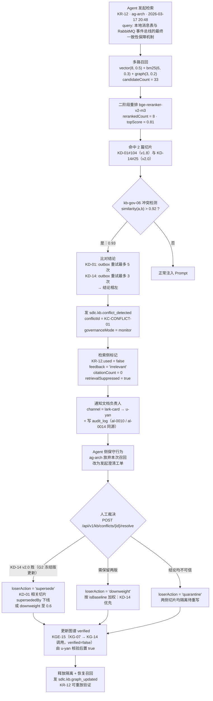

# impl-13 企业知识库与 WeKnora 集成实施方案

| 项 | 值 |
|:---|:---|
| 文档编号 | impl-13 |
| 版本 | v1.0 |
| 对应原型 | `makepro/src/prototypes/ai-sdlc-console`（页面 `knowledge` · `pages/KnowledgePage.tsx` 5351 行 · 数据源 `data-kb.ts` 4554 行全量 + `data-ai-flow.ts` `AI_TOOL_PROVIDERS[2]` + `data.ts`） |
| 覆盖架构层 | 第 ③ 层「云端 AI 推理决策层」的 `rag-service:8086`（本篇升级为「知识库服务 `kb-service`」）+ 存储层（PostgreSQL 16 + pgvector 0.7、NebulaGraph 3.8、MinIO）+ 第 ④ 层控制台 `knowledge` 页 |
| 数据快照日期 | 2026-03-19（`data.ts` `TODAY`；`kbStats.range` = 近 30 日 2026-02-18 ~ 2026-03-19） |
| 贯穿案例 | 订单中心重构 · `EPIC-ORDER-REF` · 迭代 `SP-24`（2026-03-02 ~ 2026-03-27）· PRD 基线 v2.3 |
| 核心诉求 | **研发流程各阶段的输出产物自动同步到企业知识库，让 AI 在做项目管理与编码时有据可依** |
| 依赖文档 | impl-00（架构与选型）、impl-01（协议与错误码规范）、impl-02（7 Agent 契约与上下文注入）、impl-03（状态机与 Redis Streams）、impl-04（表结构与 Redis 键，**`rag_entry` 的唯一事实源**）、impl-05（外部系统连接器）、impl-07（控制台三向映射与角色矩阵）、impl-08（出网、脱敏、审计、RBAC）、impl-09（阶段与人力）、impl-12（接口测试报告归档来源） |
| 关联阶段 | impl-09 §2.1 P0（`rag-service` 基建）+ §2.3 P2（需求侧 RAG 注入）+ §2.4 P4（评测与治理持续）；与 impl-07 §7.1 的 **F 组**（知识与平台域，本文新增分组）并行 |

## 本篇范围

本篇把「企业知识库」（原型页 `knowledge`）落到可开工的实施方案，回答用户明确提出的核心诉求——**SDLC 六环节的输出产物如何自动同步进企业知识库，并让 7 个 Agent 在项目管理与编码时真正用上这些知识**：

1. **阶段产物 → 知识库归档映射**：`KB_STAGE_ARTIFACT_MAP` 的 18 条（6 环节 × 3 产物）逐条落为可实施的归档链路；
2. **归档规则引擎**：`KB_ARCHIVE_RULES` 8 条规则的匹配、动作、去重、仲裁与审计；
3. **7 步入库流水线**：采集 → 解析/OCR → 结构化抽取 → 层级切片 → 向量化 → 图谱构建 → 索引与评测；
4. **切片与检索**：5 种切片策略、切片引用的两种写法约定、多路召回、二阶段重排、命中阈值、检索日志埋点；
5. **知识图谱**：18 节点 / 26 边的建模、抽取链路、`degree` 一致性约束、多跳检索增强、双存储分工；
6. **AI 消费与效果度量**：7 个 Agent 的消费统计、幻觉率加权口径与示范核算、3 套评测集与调优动作，以及「AI 做项目管理」与「AI 做编码」两个点名场景的具体链路；
7. **13 张新增表**与 `rag_entry` 的迁移方案；**30 项 REST 接口（33 端点）**与 **10 个事件主题**；
8. **安全与合规**：4 级访问 × 7 角色矩阵、6 条治理策略、私有化 VPC 数据不出域、知识冲突仲裁、保鲜与失效。

本篇**不**覆盖：

- Agent 的通用 Prompt 骨架、上下文预算分配与压缩顺序 → 见 impl-02 §4/§8（本篇只定义「知识如何进入 §8.1 的 30% RAG 预算」）
- 向量库选型论证与 pgvector 索引参数 → 见 impl-00 §4、impl-04 §1（本篇补充 HNSW 参数与 NebulaGraph 分工）
- 出网三档策略与脱敏规则引擎实现 → 见 impl-08 §2/§3（本篇只做知识库侧的落地映射）
- 审计日志哈希链与分区归档 → 见 impl-08 §5.3、impl-04 §6
- 接口测试报告的生成口径 → 见 impl-12 §5（本篇只承接其 `sdlc.apitest.report_published` 事件）
- SDLC 事件的生产方语义（谁在什么时候发 `sdlc.mr.merged`） → 见 impl-03 §6、impl-05 §6

## 关联文档

| 文档 | 与本篇的关系 |
|:---|:---|
| `impl-01-protocol.md` | 本篇全部接口沿用 `/api/v1/` 前缀与统一响应包；事件主题遵循 impl-01 §1「`sdlc.<domain>.<event>` + 下划线风格」；错误码遵循「`SDLC-<DOMAIN>-<NNN>`」；检索为**同步 REST**而非 WSS，理由见 §9.4 |
| `impl-02-agents.md` | §8.1 的「RAG 片段 30% 预算」由本篇供给；`ag-*` 7 个 Agent 的消费口径（§7）与 impl-02 §2.1 的 `successRate`/`acceptRate` 并列展示；`rag_entry` 与 Agent 的关联表（impl-02 §11）在本篇演进为 `KB_CONSUME_STATS` |
| `impl-03-state-machine.md` | 本篇消费 `sdlc.task.state_changed`、`sdlc.bug.created` 等既有主题作为归档触发；消费组 `stream:grp:kb` 与 impl-03 §7.1 的 4 个既有组并列；死信与重放沿用 `XREADGROUP`/`XAUTOCLAIM` 语义 |
| `impl-04-data-model.md` | **`rag_entry`（§3.19）是既有唯一事实源**，本篇 §8.7 给出它到 `kb_doc` 的迁移结论与脚本要点；15 张新表（13 核心 + 2 辅助）的通用列、枚举落 `varchar`+`CHECK`、`timestamptz`、索引写法全部沿用 impl-04 §2 |
| `impl-05-integration.md` | 5 路连接器（Confluence / 飞书 / GitLab / PingCode / Jenkins）复用 `integration-adapter:8085` 的凭据管理（Vault KV，90 天轮转）与指数退避（15/30/60/120/240s） |
| `impl-07-console.md` | 本篇 §11.1 给出 `knowledge` pageId 的三向映射行，列定义与 impl-07 §3.1 一致；`ai-observe` 页的「知识库（RAG 条目）」区块在迁移后改读本篇的 `GET /api/v1/kb/docs`（§8.7） |
| `impl-08-security.md` | §10 逐条呼应：4 级访问 ↔ RBAC（§6.2）、6 条治理策略 ↔ `egressPolicy`/`redactRules`/`auditLogs` 真实 id、私有化 VPC 数据不出域 ↔ §7.1 网络分区、最小化上传 ↔ §4.1 内容边界 |
| `impl-12-api-test-hifox.md` | `AR-RPT-24` 签发后经 `sdlc.apitest.report_published` → `KA-05` 归档 → `KS-04` → `KD-18` 新版本切片；`ag-test` 生成用例时检索 `KD-09`/`KD-18`/`KD-20` |

## 目录

- [1. 本文定位与范围](#1-本文定位与范围)
- [2. 阶段产物 → 知识库归档映射（核心）](#2-阶段产物--知识库归档映射核心)
- [3. 归档规则引擎](#3-归档规则引擎)
- [4. 入库流水线（7 步）](#4-入库流水线7-步)
- [5. 切片与检索](#5-切片与检索)
- [6. 知识图谱](#6-知识图谱)
- [7. AI 消费与效果度量（核心）](#7-ai-消费与效果度量核心)
- [8. 数据模型与 rag_entry 迁移](#8-数据模型与-rag_entry-迁移)
- [9. REST 接口与事件](#9-rest-接口与事件)
- [10. 安全与合规（呼应 impl-08）](#10-安全与合规呼应-impl-08)
- [11. 三向映射、角色可见性、工时、验收与风险](#11-三向映射角色可见性工时验收与风险)

---

## 1. 本文定位与范围

### 1.1 为什么企业知识库是 AI 能力的地基

平台的 7 个 Agent（`ag-pm` 需求澄清 / `ag-arch` 架构设计 / `ag-code` 编码实现 / `ag-review` 代码评审 / `ag-test` 测试生成 / `ag-ops` 部署运维 / `ag-ba` 可观测分析）在没有知识注入时，只能依赖模型的通用先验，产生三类可量化的损失。本迭代（`SP-24`）的三条真实证据：

| 损失类型 | 真实案例（可追溯） | 无知识库时的后果 | 有知识库后的效果 |
|:---|:---|:---|:---|
| **幻觉** | `KR-14`：`ag-ba` 初稿引用了知识库中并不存在的「G1 混合回收阈值配置基线」条目 | 根因分析结论不可信，`BUG-1053` 排查方向被带偏 | 引用溯源校验器（`kb-gov-05`）核对 `docId` 不在索引 → 拦截该句 → 结论改为「堆快照不足，待长稳压测复跑后定位」，与 `KD-11` 第 7 章 JVM 故障 SOP 一致 |
| **偏离团队规范** | `KR-09`：`ag-test` 初稿断言「PAID 可直接流转 CLOSED（超时关闭）」 | 生成的用例与订单状态机矛盾，浪费一轮执行 | 图谱中 `KG-05` 订单状态机的 `CLOSED` 为终态且无来自 `PAID` 的入边 → 约束校验拦截 → 用例改为断言 `PAID → REFUNDING → CLOSED` |
| **检索缺口导致缺陷** | `BA-1043` 五问法 Why-4（切片 `KC-14`）：「RAG 检索关键词用的是『优惠 分摊』，而知识库该条目标签为『金额 精度 BigDecimal』，向量召回未命中且未做同义词扩展」 | `KB-CODE-02` 的金额规约**未进入 AI 提示词上下文**，`ag-code` 生成了逐行 `setScale(2, HALF_UP)` 的代码 → 资损级 `BUG-1043`（128 组中 3 组恒定 0.01 元尾差） | `KI-04` 手工重索引 + 依据 `KD-05` 业务术语表建立同义词扩展（幂等键 / 幂等性 / Idempotency-Key）+ 新建图谱边 `KGE-11`「优惠核销 → 最大余额法」与 `KGE-12`「优惠核销 → 金额精度缺陷模式」，使因果类问题可走图谱路召回 |

**三条价值主张（对应页头文案「降低幻觉、贴近团队规范」）**：

1. **降低幻觉**：`WK-08` 强制「无引用不成立」——Agent 生成的每条结论必须挂载真实存在的 `docId + chunkId`，引用校验器还比对引文与结论的语义一致性。整体幻觉率由 **12.04% 降至 2.50%**，相对下降 **79.3%**（加权口径与核算见 §7.2），近 30 日拦截 4 次。
2. **贴近团队规范**：`KD-06`《Java 编码规约与异常处理约定》v3.2 是全库命中最高的文档（近 30 日 612 次），其第 4.3 节「事务边界与补偿」直接约束 `ag-code` 的实现；`KD-01`《订单中心四层架构规范》第 3.3 节的分层依赖禁令是 G3 门禁 `must-fix` 的判据（`MR-2410` 曾因 `OrderController` 直接注入 `OrderAggregate` 被判失败）。
3. **让 AI 做项目管理与编码时有据可依**：`ag-pm`/`ag-arch` 检索历史 PRD 与需求池评分依据做优先级建议、`ag-ba` 检索历史事故做风险预测（§7.5）；`ag-code` 检索编码规约 `KB-CODE-02` 与相似历史任务做代码生成、`ag-review` 检索架构基线做评审（§7.6）。

### 1.2 对标 WeKnora：引擎元信息与 8 项能力

**`KB_ENGINE`（`engine-weknora`）—— 本篇唯一权威来源，`data-ai-flow.ts` 的 `provider-weknora` 已对齐到同一组值，不得另造第三套**：

> **两处 `version` 写法的差异（如实记录，本篇以 `KB_ENGINE` 为准）**：`KB_ENGINE.version = '1.4.2'`，而 `AI_TOOL_PROVIDERS[2].version = 'WeKnora 1.4.2'`（与 `provider-hifox.version = 'hifox 3.8.1'` 同属「产品名 + 版本号」的展示写法）。`provider-weknora.note` 自称「八字段与 `KB_ENGINE` 保持逐值一致」，其中 `version` 实为**同值不同书写格式**，其余 7 字段（`endpoint`/`protocol`/`authMode`/`connectedAt`/`slaUptimePct`/`avgLatencyMs`/`docsUrl`）确为逐字符一致。**本文裁定**：凡涉及版本号一律取 `1.4.2`（`KB_ENGINE` 为唯一权威），展示层需要产品名前缀时由前端拼接，不把 `'WeKnora 1.4.2'` 写进任何存储；引擎连接元信息（`endpoint`/`authMode`/`status`/`connectedAt`）归 impl-05 的集成配置管理，**本文不新建 `kb_engine` 表**，§8 的 15 张表只承载知识业务数据。

| 字段 | 取值 |
|:---|:---|
| `id` / `name` / `vendor` | `engine-weknora` / WeKnora / 腾讯开源 |
| `version` | **1.4.2** |
| `deployMode` | 私有化 VPC |
| `endpoint` | **`https://weknora.intra.example.com/api/v1`** |
| `protocol` | **REST** |
| `authMode` | **mTLS 双向证书 + OIDC（飞书 SSO 联邦）** |
| `status` / `connectedAt` | `connected` / **2026-01-06 10:20** |
| `embeddingModel` | **`bge-large-zh-v1.5`**（1024 维，L2 归一化；与 `data.ts` `ragEntries[].embedModel` 一致） |
| `rerankModel` | **`bge-reranker-v2-m3`** |
| `ocrEngine` | **PaddleOCR v4（含 PP-StructureV2 表格结构还原）** |
| `parserFormats` | `pdf` / `docx` / `md` / `xlsx` / `pptx` / `html` / `image` / `confluence` / `feishu-doc`（9 类） |
| `vectorStore` | **PostgreSQL + pgvector** |
| `graphStore` | **NebulaGraph 3.8** |
| `indexCount` | **6**（与 `KB_SPACES` 一一对应，每个知识空间一个索引） |
| `totalChunks` | **2406** |
| `totalTokensM` | **1.22** |
| `qpsLimit` | **60** |
| `avgRetrievalMs` | **268** |
| `avgIngestSec` | **188.7** |
| `slaUptimePct` | **99.95** |
| `docsUrl` | `https://github.com/Tencent/WeKnora` |
| `note` | 与生产网同 VPC 隔离部署，向量与原文均不出域；`env-staging` / `env-prod` 命中 `EGRESS-DENY` 时，检索链路强制走本实例而非任何公有云 RAG 服务。近 30 日 SLA 99.95%，仅 03-19 16:22 因 GitLab Runner 出口网络抖动导致 1 次向量化超时（`KI-07`） |

**`totalChunks` / `totalTokensM` / `avgRetrievalMs` 三项核算（三个独立来源互证）**：

```
① totalChunks = Σ KB_DOCS[].chunks
   = 186+74+108+76+64+152+118+42+132+96+84+214+96+88+164+72+246+158+104+132
   = 2406 ✓
   交叉验证 = Σ KB_SPACES[].chunkCount = 768+374+558+290+200+216 = 2406 ✓

② totalTokensM = Σ KB_DOCS[].tokensK ÷ 1000
   = (92+38+52+36+28+76+58+19+64+47+41+118+54+46+82+34+132+79+52+71) ÷ 1000
   = 1219 ÷ 1000 = 1.219 → 1.22 ✓
   交叉验证 = Σ KB_SPACES[].tokensK ÷ 1000 = (380+200+285+143+99+112) ÷ 1000 = 1219 ÷ 1000 ✓

③ avgRetrievalMs = Σ KB_RETRIEVAL_LOGS[].latencyMs ÷ 14
   = (286+342+248+196+232+388+312+274+226+168+254+342+188+296) ÷ 14
   = 3752 ÷ 14 = 268.0 ms ✓（= kbStats.avgRetrievalMs = KB_ENGINE.avgRetrievalMs）
```

**`WEKNORA_CAPABILITIES` 8 项能力（`WK-01`~`WK-08`）**：

| id | 能力 | 自动化级别 | 服务环节 | 消费 Agent | 关键指标 | 本平台落地形态 |
|:---|:---|:---|:---|:---|:---|:---|
| `WK-01` | 多格式文档解析 | `full` | 全 6 环节 | 全 7 个 | 解析成功率 99.2% / 支持 9 种格式 / 4.6 秒每百页 | 统一文档接入适配器（Confluence / 飞书 / GitLab / PingCode / Jenkins 五路连接器） |
| `WK-02` | OCR 与表格结构化 | `assisted` | `st-arch`,`st-deploy`,`st-test` | `ag-arch`,`ag-ops`,`ag-test` | 印刷体识别 98.4% / 表格结构还原 F1 0.941 / 本月 OCR 8 页 | 架构图与权限矩阵 OCR 结构化（`KD-04` 3 页 / `KD-14` 2 张 / `KD-19` 3 页 = 8 页） |
| `WK-03` | 层级语义切片 | `full` | 全 6 环节 | 全 7 个 | 切片总数 2406 / 平均切片长度 507 token / 噪声切片占比 2.1% | heading-aware 切片器 + 代码块/表格保真策略（5 档 `chunkStrategy` 可配） |
| `WK-04` | 多路召回（向量+BM25+图谱） | `full` | 全 6 环节 | 全 7 个 | 近 30 日检索 3842 次 / 平均候选 31 个 / 图谱路命中占比 18.6% | 三路召回编排器（`recallStrategy` 权重可按 Agent 单独配置） |
| `WK-05` | 重排序（Reranker） | `full` | `st-arch`,`st-code`,`st-test`,`st-observe` | `ag-arch`,`ag-code`,`ag-review`,`ag-test`,`ag-ba` | MRR 提升 0.055 / 平均重排耗时 74ms / 过期文档降权因子 0.6 | `bge-reranker-v2-m3` 二阶段重排 + 保鲜降权 |
| `WK-06` | 知识图谱自动构建 | `assisted` | `st-arch`,`st-code`,`st-observe` | `ag-arch`,`ag-code`,`ag-review`,`ag-ba` | 节点 18 / 边 26 / AI 抽取占比 96.2%（边口径） / 人工核验占比 69.2% | SDLC 实体图谱（与 `ARCH_LAYERS` / `ARCH_COMPONENTS` 的 id 双向对齐） |
| `WK-07` | 检索评测与调优 | `assisted` | `st-arch`,`st-code`,`st-test`,`st-observe` | `ag-arch`,`ag-code`,`ag-test`,`ag-ba` | 评测问题总数 270 / `recall@10`（KQ-01）0.912 / 答案忠实度 94.6% | 检索评测集 `KQ-01`~`KQ-03` 与每周三 22:00 自动回归 |
| `WK-08` | 引用溯源与幻觉抑制 | `full` | 全 6 环节 | 全 7 个 | 无知识注入幻觉率 12.04% / 注入后 2.50% / 相对下降 79.3% / 近 30 日拦截 4 次 | 引用溯源校验器 + 无引用即阻断（治理策略 `kb-gov-05`） |

> ✅ **`WK-06` 的两项指标已与实测对齐（v1.1 修正）**：原 `WK-06.metrics` 写「AI 抽取占比 83.3%」（= 15 ÷ 18）与「人工复核通过率 91.7%」，与实测不符——`KB_GRAPH_NODES` 实测 `aiExtracted=true` 为 **17 / 18 = 94.4%**（仅 `KG-14` RabbitMQ 为 `false`），`KB_GRAPH_EDGES` 实测 `aiExtracted=true` **25 / 26 = 96.2%**（仅 `KGE-26` 为 `false`）、`verified=true` **18 / 26 = 69.2%**（`u-yan` 11 条、`u-zhou` 7 条）。现已把 `WK-06.metrics` 两项统一为**边口径**的 96.2% 与 69.2%（第二项同时更名为「人工核验占比」以消除「通过率」的歧义），并在 `WK-06.desc` 中写明节点侧 / 边侧两套口径；`KB_GRAPH_EDGES` 的文件级注释也同步改为「AI 抽取 25 条、人工录入 1 条；verified=true 共 18 条」。`KnowledgePage.tsx` 第 1621-1634 行的 `graphStats`（`aiEdgePct` / `verifiedPct`）按实测计算，**修正后页面与数据模块口径一致**。该矛盾的治理动作（§11.5 风险 R-03 对策 ⑥）已落地，遗留建议是改为由 `graphStats` 实时计算而非硬编码。

### 1.3 与既有 `ai-observe` 页 `ragEntries`（11 条）的承接关系

**结论**：本页 20 篇文档中 **11 篇承接自既有 RAG 条目**（`legacyRagId` = `rag-01`~`rag-11`，`chunks` / `tokensK` / `hitCount` 数值完全一致），另 **9 篇**（`KD-12`~`KD-20`）为本轮 SDLC 事件自动归档新增。页面「知识文档清单」卡片底部的衔接说明即此口径（`legacyDocs.length = 11`）。

**11 条承接映射（逐条，数值经 `data.ts` `ragEntries` 与 `data-kb.ts` `KB_DOCS` 双向核对）**：

| `ragEntries.id` | `kbId`（旧编号） | 标题 | 承接文档 | 新空间 | `chunks` | `tokensK` | `hitCount` → `hitCount30d` | `status` → `embedStatus` |
|:---|:---|:---|:---|:---|:--:|:--:|:--:|:---|
| `rag-01` | `KB-ARCH-01` | 订单中心四层架构规范 | `KD-01` | `KS-01` | 186 | 92 | 428 | `ready` → `ready` |
| `rag-02` | `KB-ARCH-01` | 限界上下文与聚合根边界约定 | `KD-02` | `KS-01` | 74 | 38 | 246 | `ready` → `ready` |
| `rag-03` | `KB-CODE-02` | Java 编码规约与异常处理约定 | `KD-06` | `KS-03` | 152 | 76 | 612 | `ready` → `ready` |
| `rag-04` | `KB-CODE-05` | 前端 Vue3 组件规范与性能约定 | `KD-07` | `KS-03` | 118 | 58 | 284 | `ready` → `ready`（但 `staleness.isStale=true`） |
| `rag-05` | `KB-OPS-01` | 生产发布与灰度回滚手册 | `KD-10` | `KS-05` | 96 | 47 | 198 | `ready` → `ready` |
| `rag-06` | `KB-OPS-01` | 可观测性与告警处置手册 | `KD-11` | `KS-06` | 84 | 41 | 156 | `ready` → `ready` |
| `rag-07` | `KB-TEST-03` | 接口自动化与用例设计规范 | `KD-09` | `KS-04` | 132 | 64 | 342 | `ready` → `ready` |
| `rag-08` | `KB-SEC-02` | 数据脱敏与合规出域规范 | `KD-03` | `KS-01` | 108 | 52 | 204 | `ready` → `ready` |
| `rag-09` | `KB-SEC-02` | 审计日志与权限最小化规范 | `KD-04` | `KS-01` | 76 | 36 | 142 | `indexing` → `indexing`（3 张权限矩阵截图待 OCR） |
| `rag-10` | `KB-BS-2401` | 订单业务术语与领域词汇表 | `KD-05` | `KS-02` | 64 | 28 | 188 | `ready` → `ready` |
| `rag-11` | `KB-CODE-02` | 金额精度与 BigDecimal 使用规范 | `KD-08` | `KS-03` | 42 | 19 | 96 | `stale` → `stale` |
| **合计** | 6 个旧 `kbId` 前缀（7 个具体编号） | — | **11 篇** | 6 个空间 | **1132** | **551** | **2896** | `ready` 9 / `indexing` 1 / `stale` 1 |

**合计核算（可逐列复核）**：

```
chunks   = 186+74+152+118+96+84+132+108+76+64+42 = 1132
tokensK  = 92+38+76+58+47+41+64+52+36+28+19      = 551
hitCount = 428+246+612+284+198+156+342+204+142+188+96 = 2896
空间去重  = { KS-01(KD-01/02/03/04), KS-02(KD-05), KS-03(KD-06/07/08),
             KS-04(KD-09), KS-05(KD-10), KS-06(KD-11) } → 6 个（全 6 空间均有承接文档）
旧编号去重 = { KB-ARCH-01, KB-CODE-02, KB-CODE-05, KB-OPS-01, KB-TEST-03, KB-SEC-02, KB-BS-2401 } → 7 个
旧前缀去重 = { KB-ARCH, KB-CODE, KB-OPS, KB-TEST, KB-SEC, KB-BS } → 6 个（映射见本节末表）
```

**9 篇新增（`KD-12`~`KD-20`，`legacyKbId = legacyRagId = null`，页面标注「本轮新增」）**：`KD-12` PRD v2.3 基线（214 片）、`KD-13` 用户故事与验收标准集（96）、`KD-14` 四层架构视图 G2 冻结版（88）、`KD-15` 14 份接口契约集（164）、`KD-16` Sprint 24 任务拆解快照（72）、`KD-17` 已合入 MR 变更集与单测（246）、`KD-18` 测试报告 TR-24（158）、`KD-19` REL-2403 发布归档包（104）、`KD-20` 根因分析报告归档包（132）；合计 `214+96+88+164+72+246+158+104+132 =` **1274 片**（`tokensK` 合计 `118+54+46+82+34+132+79+52+71 = 668`）。

**总账核算**：`1132（承接 11 篇）+ 1274（新增 9 篇）= 2406` ✓ = `kbStats.totalChunks` = `KB_ENGINE.totalChunks`；`tokensK`：`551 + 668 = 1219` → `1.22 M` ✓。

**旧 `kbId` → 新空间的兼容映射（源 `KB_SPACES` 注释，6 个旧前缀 / 7 个具体编号收敛到 6 个新空间）**：

| 旧 `kbId` 前缀 | 新空间 | 说明 |
|:---|:---|:---|
| `KB-ARCH-*` | `KS-01` 架构与规范（`code='KB-ARCH'`） | 直接对应 |
| `KB-SEC-*` | `KS-01` 架构与规范 | 平台级强制规范并入架构空间（`KD-03`/`KD-04`） |
| `KB-BS-*` | `KS-02` 需求与产品（`code='KB-REQ'`） | 业务术语属需求域（`KD-05`） |
| `KB-CODE-*` | `KS-03` 代码与实现（`code='KB-CODE'`） | 直接对应 |
| `KB-TEST-*` | `KS-04` 质量与测试（`code='KB-QA'`） | 直接对应 |
| `KB-OPS-*` | `KS-05` 运维与发布 **或** `KS-06` 事故与根因 | 按主题拆分：发布手册（`KD-10`）归 `KS-05`，可观测与告警处置手册（`KD-11`）归 `KS-06`；两篇的 `legacyKbId` 均保留 `KB-OPS-01` |

> **迁移方向结论**：`rag_entry` 表**被 `kb_doc` 替代（一对一迁移）**，旧编号以 `legacy_kb_id` / `legacy_rag_id` 两列保留为兼容锚点；`rag_entry` 本体不 `DROP`，改为只读兼容视图 `v_rag_entry`，使 impl-01 §4.8 的 `GET /api/v1/ai/rag/entries`（`ai-observe` 页在用）零改造继续工作。完整迁移方案与脚本要点见 §8.7。

### 1.4 读者与术语

| 读者 | 关注章节 |
|:---|:---|
| AI 工程 R7 | §2 §4 §5 §6 §7 |
| 后端 R1 / R2 | §8 §9 |
| 前端 R4 | §11.1 |
| 架构 R8 | §2 §3 §6 §10 |
| 运维 R10 / 安全 | §4 §10 |
| 测试 R9 | §7.4 §11.4 |

| 术语 | 说明 |
|:---|:---|
| 知识空间（space） | `KS-01`~`KS-06`，源 `KbSpaceDef`；每个空间对应一个 WeKnora 索引（`indexCount=6`） |
| 知识文档（doc） | `KD-01`~`KD-20`，源 `KbDocDef`；18 种 `docType`（`KbArtifactType`） |
| 切片（chunk） | 源 `KbChunkDef`；样本切片 `KC-01`~`KC-14`，非样本切片用 `{docId}#{chunkIndex}` 引用 |
| 归档映射 | `KB_STAGE_ARTIFACT_MAP` 的 18 条，id 形如 `st-req-1`（`{stageId}-{序号 1~3}`，不引入新前缀） |
| 归档规则 | `KA-01`~`KA-08`，源 `KbArchiveRuleDef`；按 `priority` 升序求值，首条命中即执行 |
| 入库执行 | `KI-01`~`KI-08`，源 `KbIngestRunDef`；7 步为 `KIS-01`~`KIS-07` |
| 检索日志 | `KR-01`~`KR-14`，源 `KbRetrievalLogDef` |
| 评测集 | `KQ-01`~`KQ-03`，源 `KbEvalSetDef`；合计 270 问 |
| 消费统计 | `KB_CONSUME_STATS`，7 个 Agent 各一条，源 `KbConsumeStatDef` |
| 治理策略 | `kb-gov-01`~`kb-gov-06`，源 `KbGovernanceDef` |
| 保鲜（staleness） | `KB_DOCS[].staleness{lastVerifiedAt, verifyCycleDays, isStale, staleReason}` |
| 门禁 | G1~G6，**统一称「门禁」，不写「卡点」** |

---

## 2. 阶段产物 → 知识库归档映射（核心）

### 2.1 18 条映射总表（6 环节 × 3 产物）

`SDLC_STAGES` 六环节的 `outputs` 各 3 项，合计 **18 项产物**，`KB_STAGE_ARTIFACT_MAP` 逐条登记。产物名与 `SDLC_STAGES[].outputs` 的字面值**完全一致**（含「PRD v2.3 基线」「248 条用例执行结果」这类带数值的写法）。

| id | 环节 | 产物名（= `SDLC_STAGES.outputs` 字面值） | 产物类型 | 自动归档 | 归档触发事件 | 归档规则 | 目标空间 | 生成文档 | 留存(天) | 访问级别 | 脱敏 / 规则 | 消费 Agent | 切片策略 | 版本策略 |
|:---|:---|:---|:---|:--:|:---|:---|:---|:---|:--:|:---|:---|:---|:---|:---|
| `st-req-1` | `st-req` 需求澄清(G1) | PRD v2.3 基线 | `PRD` | ✅ | `sdlc.prd.baselined` | `KA-01` | `KS-02` | `KD-12` | 1825 | `internal` | 否 / — | `ag-pm`,`ag-arch`,`ag-code`,`ag-test` | `heading` | `all-versions` |
| `st-req-2` | `st-req` 需求澄清(G1) | 用户故事 US-01~US-14 | `用户故事` | ✅ | `sdlc.prd.baselined` | `KA-01` | `KS-02` | `KD-13` | 1095 | `internal` | 否 / — | `ag-pm`,`ag-arch`,`ag-test` | `heading` | `latest` |
| `st-req-3` | `st-req` 需求澄清(G1) | 验收标准 | `验收标准` | ✅ | `sdlc.gate.passed:G1` | `KA-01` | `KS-02` | `KD-13` | 1095 | `internal` | 否 / — | `ag-test`,`ag-code`,`ag-review` | `semantic` | `latest` |
| `st-arch-1` | `st-arch` 架构设计(G2) | 四层架构视图 | `架构图` | ✅ | `sdlc.gate.passed:G2` | `KA-02` | `KS-01` | `KD-14` | 1825 | `internal` | 否 / — | `ag-arch`,`ag-code`,`ag-review`,`ag-test`,`ag-ba` | `semantic` | `baseline-only` |
| `st-arch-2` | `st-arch` 架构设计(G2) | 14 份接口契约 | `接口契约` | ✅ | `sdlc.contract.frozen` | `KA-02` | `KS-01` | `KD-15` | 1825 | `internal` | 否 / — | `ag-arch`,`ag-code`,`ag-test`,`ag-review` | `code-block` | `all-versions` |
| `st-arch-3` | `st-arch` 架构设计(G2) | 24 个开发任务 | `任务清单` | ✅ | `sdlc.task.state_changed` | `KA-02` | `KS-01` | `KD-16` | 730 | `internal` | 否 / — | `ag-pm`,`ag-arch`,`ag-code` | `table-row` | `latest` |
| `st-code-1` | `st-code` 编码实现(G3) | 源代码 MR | `代码` | ✅ | `sdlc.mr.merged` | `KA-03` | `KS-03` | `KD-17` | 1095 | `restricted` | **是** / `rd-01`,`rd-03`,`rd-08` | `ag-code`,`ag-review`,`ag-test`,`ag-ba` | `code-block` | `latest` |
| `st-code-2` | `st-code` 编码实现(G3) | 单元测试 | `单元测试` | ✅ | `sdlc.coverage.reported` | `KA-03` | `KS-03` | `KD-17` | 730 | `internal` | 否 / — | `ag-test`,`ag-review`,`ag-code` | `code-block` | `latest` |
| `st-code-3` | `st-code` 编码实现(G3) | 代码评审记录 | `评审记录` | ✅ | `sdlc.review.approved` | `KA-04` | `KS-03` | `KD-17` | 1095 | `restricted` | **是** / `rd-08` | `ag-code`,`ag-review` | `semantic` | `latest` |
| `st-test-1` | `st-test` 测试验证(G4) | 248 条用例执行结果 | `用例执行结果` | ✅ | `sdlc.testplan.executed` | `KA-05` | `KS-04` | `KD-18` | 730 | `internal` | **是** / `rd-01`,`rd-06` | `ag-test`,`ag-code`,`ag-review`,`ag-ba` | `table-row` | `latest` |
| `st-test-2` | `st-test` 测试验证(G4) | 12 个缺陷 | `缺陷分析` | ✅ | `sdlc.bug.created` | `KA-05` | `KS-04` | `KD-18` | 1095 | `internal` | **是** / `rd-01`,`rd-04` | `ag-test`,`ag-code`,`ag-review`,`ag-ba` | `semantic` | `all-versions` |
| `st-test-3` | `st-test` 测试验证(G4) | 测试报告 TR-24 | `测试报告` | ✅ | `sdlc.testreport.published` | `KA-05` | `KS-04` | `KD-18` | 1825 | `internal` | 否 / — | `ag-pm`,`ag-test`,`ag-review`,`ag-ops`,`ag-ba` | `heading` | `all-versions` |
| `st-deploy-1` | `st-deploy` 部署发布(G5) | 生产发布记录 | `发布记录` | ✅ | `sdlc.release.completed` | `KA-06` | `KS-05` | `KD-19` | 1825 | **`confidential`** | **是** / `rd-01`,`rd-03`,`rd-08` | `ag-ops`,`ag-ba`,`ag-review` | `heading` | `all-versions` |
| `st-deploy-2` | `st-deploy` 部署发布(G5) | 环境拓扑快照 | `环境快照` | ✅ | `sdlc.release.completed` | `KA-06` | `KS-05` | **`null`（未归档）** | 730 | `restricted` | **是** / `rd-08` | `ag-ops`,`ag-ba`,`ag-arch` | `semantic` | `latest` |
| `st-deploy-3` | `st-deploy` 部署发布(G5) | 回滚预案 | `回滚预案` | ✅ | `sdlc.release.completed` | `KA-06` | `KS-05` | `KD-19` | 1825 | `restricted` | 否 / — | `ag-ops`,`ag-ba` | `heading` | `latest` |
| `st-observe-1` | `st-observe` 运维观测(G6) | 告警事件 | `告警事件` | ✅ | `sdlc.alert.fired` | `KA-07` | `KS-06` | `KD-20` | 365 | `restricted` | **是** / `rd-01`,`rd-07` | `ag-ba`,`ag-ops`,`ag-test` | `fixed` | `latest` |
| `st-observe-2` | `st-observe` 运维观测(G6) | 根因分析报告 | `根因报告` | ✅ | `sdlc.rca.approved` | `KA-07` | `KS-06` | `KD-20` | 1825 | `restricted` | **是** / `rd-01`,`rd-03`,`rd-04` | `ag-ba`,`ag-test`,`ag-code`,`ag-review`,`ag-arch` | `heading` | `all-versions` |
| `st-observe-3` | `st-observe` 运维观测(G6) | 技术债清单 | `技术债` | ✅ | `sdlc.gate.passed:G6` | `KA-08` | `KS-06` | **`null`（未归档）** | 1095 | `internal` | 否 / — | `ag-arch`,`ag-pm`,`ag-ba` | `table-row` | `latest` |

**六维分布核算（18 条逐列合计，可复核）**：

| 维度 | 分布 | 核算 |
|:---|:---|:---|
| `artifactType`（18 种 `KbArtifactType` 中用到 18 种） | 每行一个独立类型 | `PRD`/`用户故事`/`验收标准`/`架构图`/`接口契约`/`任务清单`/`代码`/`单元测试`/`评审记录`/`用例执行结果`/`缺陷分析`/`测试报告`/`发布记录`/`环境快照`/`回滚预案`/`告警事件`/`根因报告`/`技术债` = **18 种，与 `KbArtifactType` 联合类型的 18 个值一一对应** ✓ |
| `autoArchive` | `true` 18 / `false` 0 | 全部产物都登记为自动归档（未归档的 2 项是**触发条件未满足**，不是规则关闭，见 §2.2） |
| `archiveTrigger`（15 个不同取值 / 13 个不同主题） | `sdlc.release.completed` 3、`sdlc.prd.baselined` 2，其余 13 个各 1 | 3+2+13 = 18 ✓；`sdlc.gate.passed` 主题出现 3 次（`:G1`/`:G2`/`:G6`） |
| `retentionDays` | 1825(5 年) 7 / 1095(3 年) 6 / 730(2 年) 4 / 365(1 年) 1 | 7+6+4+1 = 18 ✓；最短 365 天为告警事件（原始指标仍在 Prometheus，知识库只存语义摘要），最长 1825 天为基线类产物 |
| `accessLevel` | `internal` 11 / `restricted` 6 / `confidential` 1 / `public` 0 | 11+6+1+0 = 18 ✓；唯一 `confidential` 为「生产发布记录」（`KS-05` 空间级也是 `confidential`） |
| `redactRequired` | `true` 8 / `false` 10 | 8 条脱敏产物共引用 6 个不同 `rd-*`：`rd-01`(5 次)、`rd-03`(3)、`rd-08`(4)、`rd-04`(2)、`rd-06`(1)、`rd-07`(1) |
| `chunkStrategy`（5 档） | `heading` 6 / `semantic` 5 / `code-block` 3 / `table-row` 3 / `fixed` 1 | 6+5+3+3+1 = 18 ✓（详见 §5.1） |
| `versionPolicy`（3 档） | `latest` 11 / `all-versions` 6 / `baseline-only` 1 | 11+6+1 = 18 ✓；唯一 `baseline-only` 为「四层架构视图」（只保留 G2 冻结基线） |
| `archivedCount`（跨迭代累计归档次数） | Σ = **127** | 5+3+3+2+14+24+4+4+4+3+12+1+3+2+3+36+2+2 = 127；最大项为「告警事件」36 次（近 30 日 36 条告警快照） |
| `docId` | 非空 16 / `null` 2 | 16 + 2 = 18 ✓；16 项映射到 9 篇文档（`KD-12`~`KD-20`），其中 `KD-13`/`KD-17`/`KD-18`/`KD-19`/`KD-20` 各被 2~3 项产物共用 |

> **`docId` 与 `KD-01`~`KD-11` 的关系**：18 条映射的 `docId` 全部落在 `KD-12`~`KD-20`（本轮自动归档产物）。`KD-01`~`KD-11` 是**存量规范类文档**（Confluence / 飞书人工上传与同步），不由 SDLC 事件驱动，因此不出现在本映射表中——它们通过 `KB_DOCS[].legacyKbId` 与空间归属被检索，但不参与「阶段产物归档覆盖率」的计算。这是 §2.3 覆盖率口径的分母只取 18 的原因。

### 2.2 当前 2 项未归档的真实原因（`docId = null`）

| 产物 | 环节 | 真实原因（源 `KB_STAGE_ARTIFACT_MAP[].note`，逐字要点） | 阻塞链条 | 上次归档 | 解除条件 |
|:---|:---|:---|:---|:---|:---|
| **环境拓扑快照** | `st-deploy`(G5) | 生产拓扑快照须在**切流完成后**采集。`REL-2403` 因 **G3（聚合覆盖率 71.4%）** 与 **`BLOCK-0312`（DBA 未批复迁移窗口）** 双重阻塞未执行切流，当前仅有 `env-staging` 的两次回切演练快照，本轮不生成新文档 | `GATES.G3.status='failed'`（`passRate=42`）+ `BLOCK-0312` → `REL-2403.status='blocked'` → `sdlc.release.completed` 事件**从未对生产发布触发** → `KA-06` 无匹配产物 | 2026-02-27 23:40（`archivedCount=2`，均为 staging 演练） | `REL-2403` 完成批次 4（100%）切流 → 发 `sdlc.release.completed` → `KA-06` 命中 → 采集生产拓扑 → 生成文档；`KQ-03.tuningActions[3]` 已预置「待 `REL-2403` 切流完成后补入生产环境拓扑快照，预计 `recall@10` 可提升至 0.88 以上」 |
| **技术债清单** | `st-observe`(G6) | G6 环节 `progress` 仅 **20%**、门禁未开启（`GATES.G6.status='pending'`、`passRate=20`），本迭代技术债清单**仍为草稿态**，被 `KA-08` 规则判定 **`skip`**（草稿不入库，避免污染检索）。上一版归档于 Sprint 23 收尾，其中 `TD-2026-041` 已转化为 `REQ-2406` 领域事件标准化 | `SDLC_STAGES[st-observe].progress = 20` → `sdlc.gate.passed:G6` 未触发；即使人工上传也会被 `KA-08.condition = "artifact.status == 'draft' \|\| gate.status != 'passed'"` 命中而 `skip` | 2026-02-20 10:30（`archivedCount=2`） | G6 门禁开启并通过 → 技术债清单从 `draft` 转 `approved` → `sdlc.gate.passed:G6` → `KA-08` 不再命中（因 `artifact.status != 'draft'` 且 `gate.status == 'passed'`），改由 `KA-07` 的兜底路径归档 |

> **两项都不是「规则漏配」，而是「上游事件尚未发生」**。这是设计上的正确行为：知识库宁可覆盖率 16/18，也不把草稿与未采集的快照塞进索引污染检索（`KA-08` 的存在价值即在此，`hitCount30d = 3`）。

### 2.3 归档覆盖率口径与自动更新

**`kbStats.coverage.byStage` 的 6 行（`KbStageCoverageDef`）**：

| `stageId` | `stageName` | `expectedArtifacts` | `archivedArtifacts` | `coveragePct` | `tone` | 缺口项 |
|:---|:---|:--:|:--:|:--:|:---|:---|
| `st-req` | 需求澄清 | 3 | 3 | 100.0 | `ok` | — |
| `st-arch` | 架构设计 | 3 | 3 | 100.0 | `ok` | — |
| `st-code` | 编码实现 | 3 | 3 | 100.0 | `ok` | — |
| `st-test` | 测试验证 | 3 | 3 | 100.0 | `ok` | — |
| `st-deploy` | 部署发布 | 3 | **2** | **66.7** | `warn` | 环境拓扑快照 |
| `st-observe` | 运维观测 | 3 | **2** | **66.7** | `warn` | 技术债清单 |
| **合计** | — | **18** | **16** | **88.9** | — | 2 项 |

**口径与核算**：

```
expectedArtifacts = |SDLC_STAGES[i].outputs| = 3（六环节均为 3，故 Σ = 6 × 3 = 18）
archivedArtifacts = count(KB_STAGE_ARTIFACT_MAP WHERE stageId = 该环节 AND docId IS NOT NULL)
  st-req:     st-req-1(KD-12) + st-req-2(KD-13) + st-req-3(KD-13)              = 3
  st-arch:    st-arch-1(KD-14) + st-arch-2(KD-15) + st-arch-3(KD-16)           = 3
  st-code:    st-code-1(KD-17) + st-code-2(KD-17) + st-code-3(KD-17)           = 3
  st-test:    st-test-1(KD-18) + st-test-2(KD-18) + st-test-3(KD-18)           = 3
  st-deploy:  st-deploy-1(KD-19) + st-deploy-2(null) + st-deploy-3(KD-19)      = 2
  st-observe: st-observe-1(KD-20) + st-observe-2(KD-20) + st-observe-3(null)   = 2
coveragePct(环节) = archivedArtifacts ÷ expectedArtifacts × 100
  3 ÷ 3 = 100.0%   |   2 ÷ 3 = 66.666…% → 66.7%
全库归档覆盖率 = Σ archivedArtifacts ÷ Σ expectedArtifacts × 100 = 16 ÷ 18 × 100 = 88.888…% → 88.9%
```

**自动更新机制（事件驱动，无人工干预）**：

```sql
-- 覆盖率物化视图（每次归档事件后由触发器刷新，页面读缓存 cache:kb:stats:coverage）
CREATE OR REPLACE VIEW v_kb_stage_coverage AS
SELECT m.stage_id,
       s.name                                                       AS stage_name,
       count(*)                                                     AS expected_artifacts,
       count(*) FILTER (WHERE m.doc_id IS NOT NULL)                 AS archived_artifacts,
       round(100.0 * count(*) FILTER (WHERE m.doc_id IS NOT NULL) / count(*), 1) AS coverage_pct
  FROM kb_stage_artifact_map m
  JOIN sdlc_stage s ON s.id = m.stage_id
 WHERE m.deleted_at IS NULL
 GROUP BY m.stage_id, s.name, s."order"
 ORDER BY s."order";
```

更新链路：`sdlc.release.completed` 到达 → `stream:grp:kb` 消费 → `KA-06` 命中 → `kb_stage_artifact_map.doc_id` 由 `NULL` 置为新 `KD-*` → 触发器刷新 `v_kb_stage_coverage` → 失效 `cache:kb:stats:coverage` → 发 `sdlc.kb.doc_archived` → 控制台 `knowledge` 页「SDLC 阶段产物归档覆盖率」卡片局部更新（`st-deploy` 66.7% → 100.0%，`tone` 由 `warn` 转 `ok`）。**推进后全库覆盖率 16/18 → 17/18 = 94.4%**；技术债清单再归档后 → **18/18 = 100%**。

### 2.4 13 个入站归档触发事件

`data-kb.ts` 使用「`主题:过滤条件`」的简写（如 `sdlc.gate.passed:G1`）。落到 Redis Streams 时**主题部分不含冒号**，过滤条件进 `payload` 与消费端 filter，以严格符合 impl-01 §1 的 `sdlc.<domain>.<event>`：

| # | 主题（落库口径） | 简写形式 | 触发的归档映射 | 发布方 | 消费端 filter |
|:--:|:---|:---|:---|:---|:---|
| 1 | `sdlc.prd.baselined` | 同 | `st-req-1`,`st-req-2` | `state-machine`（PRD `status='confirmed'` 且 `frozen_at` 非空） | — |
| 2 | `sdlc.gate.passed` | `sdlc.gate.passed:G1` | `st-req-3` | `ag-pm` / G1 判定器 | `payload.gateId == 'G1'` |
| 3 | `sdlc.gate.passed` | `sdlc.gate.passed:G2` | `st-arch-1` | `ag-arch` / G2 判定器 | `payload.gateId == 'G2'` |
| 4 | `sdlc.gate.passed` | `sdlc.gate.passed:G6` | `st-observe-3` | `ag-ba` / G6 判定器 | `payload.gateId == 'G6'` |
| 5 | `sdlc.contract.frozen` | 同 | `st-arch-2` | `ag-arch`（`API_CONTRACTS[].status → 'frozen'`） | — |
| 6 | `sdlc.task.state_changed` | 同 | `st-arch-3` | `state-machine`（impl-03 §6.1 既有主题） | `payload.to == 'taskCreated'` 或每日 08:00 增量快照 |
| 7 | `sdlc.mr.merged` | 同 | `st-code-1` | `integration-adapter`（GitLab Webhook） | `payload.state == 'merged'` |
| 8 | `sdlc.coverage.reported` | 同 | `st-code-2` | `pipeline`（`stg-3` 单元测试阶段） | — |
| 9 | `sdlc.review.approved` | 同 | `st-code-3` | `ag-review` / 人工 approve | `payload.severity in ['must-fix','should-fix']` |
| 10 | `sdlc.testplan.executed` | 同 | `st-test-1` | `test` 域（`POST /test-plans/{id}/execute` 完成） | — |
| 11 | `sdlc.bug.created` | 同 | `st-test-2` | `state-machine`（impl-03 §6.1 既有主题）/ impl-12 §5.5 自动开单 | — |
| 12 | `sdlc.testreport.published` | 同 | `st-test-3` | `test` 域（`TR-24` 签发）；impl-12 的 `sdlc.apitest.report_published` 为其子源 | — |
| 13 | `sdlc.release.completed` | 同 | `st-deploy-1`,`st-deploy-2`,`st-deploy-3` | `ag-ops`（发布单批次 4 完成） | — |
| 14 | `sdlc.alert.fired` | 同 | `st-observe-1` | `ag-ba`（Prometheus 告警） | — |
| 15 | `sdlc.rca.approved` | 同 | `st-observe-2` | `ag-ba` / 人工复核通过 | `payload.status == 'approved'` |

> 表中 15 行对应 **13 个不同主题**（`sdlc.gate.passed` 出现 3 次）。其中 `sdlc.task.state_changed`、`sdlc.bug.created` 是 impl-03 §6.1 已登记的既有主题；其余 11 个为**本文登记的归档触发主题**（生产方分散在 `state-machine` / `integration-adapter` / `pipeline` / 各 Agent），本篇只做**消费方**，不改其语义。
> `sdlc.gate.result`（impl-03 §6.1 既有）与 `sdlc.gate.passed` 的关系：前者是每次门禁判定的**原始结果**事件（含 `passed`/`failed`/`pending`/`waived`），后者是 `status='passed'` 时由状态机**派生**的语义事件，专供归档规则消费。派生而非复用，是为了让 `stream:grp:kb` 的 filter 简单且不消费失败判定（`KA-08` 需要的 `gate.status != 'passed'` 走产物侧 `artifact.status` 判断）。

**入站事件信封示例（`sdlc.rca.approved`，对应真实执行 `KI-05`）**：

```json
{
  "msgId": "0192f6a3-2b18-7e44-9c07-5d1e8f3a7b62",
  "type": "kb.archive.request",
  "traceId": "9f2c1a7e4b8d4c6a9e0f3b2d1a5c8e80",
  "version": "1.0",
  "ts": "2026-03-18T09:14:00+08:00",
  "payload": {
    "topic": "sdlc.rca.approved",
    "stageId": "st-observe",
    "artifactName": "根因分析报告",
    "artifactType": "根因报告",
    "artifactRef": "docs/bug/BUG-1043-analysis.md",
    "artifactStatus": "approved",
    "version": "v1.3",
    "gate": { "id": "G6", "status": "pending" },
    "matchedRuleId": "KA-07",
    "targetSpaceId": "KS-06",
    "confidencePct": 94,
    "approvedBy": ["u-lin", "u-he", "u-meng"],
    "redactRuleIds": ["rd-01", "rd-03", "rd-04"]
  }
}
```

---

## 3. 归档规则引擎

### 3.1 8 条规则总表（`KB_ARCHIVE_RULES`，按 `priority` 升序求值，首条命中即执行）

| `priority` | id | 名称 | `matchStageIds` | `matchArtifactTypes` | `condition`（触发条件表达式） | `action` | `targetSpaceId` | `namingTemplate` | `dedupStrategy` | `notifyUserIds` | `enabled` | `hitCount30d` | `lastHitAt` |
|:--:|:---|:---|:---|:---|:---|:---|:---|:---|:---|:---|:--:|:--:|:---|
| 1 | `KA-01` | 需求基线归档 | `st-req` | `PRD`,`用户故事`,`验收标准` | `event == 'sdlc.prd.baselined' \|\| (gate.id == 'G1' && gate.status == 'passed')` | `archive-and-index` | `KS-02` | `{project}/S1-需求澄清/{artifactType}-{version}-{date}` | `version-supersede` | `u-su`,`u-lin`,`u-gu` | ✅ | 11 | 2026-03-11 11:07 |
| 2 | `KA-02` | 架构冻结归档 | `st-arch` | `架构图`,`接口契约`,`任务清单` | `gate.id == 'G2' && gate.status == 'passed' && contract.status in ['frozen','reviewing']` | `archive-and-index` | `KS-01` | `{project}/S2-架构设计/{artifactType}-{version}-{date}` | `content-hash` | `u-yan`,`u-lin` | ✅ | 46 | 2026-03-19 08:00 |
| 3 | `KA-03` | 代码与单测归档 | `st-code` | `代码`,`单元测试` | `mr.state == 'merged' && pipeline.gateId == 'G3'` | `archive-and-index` | `KS-03` | `{project}/S3-编码实现/{repo}-{mrId}-{commitSha7}` | `content-hash` | `u-zhou`,`u-shen` | ✅ | 8 | 2026-03-19 17:06 |
| 4 | `KA-04` | 评审记录脱敏后归档 | `st-code` | `评审记录` | `mr.state == 'merged' && review.severity in ['must-fix','should-fix']` | **`redact-then-archive`** | `KS-03` | `{project}/S3-编码实现/评审记录-{mrId}-{date}` | `semantic-similarity` | `u-zhou`,`u-lin` | ✅ | 6 | 2026-03-19 16:26 |
| 5 | `KA-05` | 测试产物归档 | `st-test` | `用例执行结果`,`缺陷分析`,`测试报告` | `event in ['sdlc.testplan.executed','sdlc.bug.created','sdlc.testreport.published']` | `archive-and-index` | `KS-04` | `{project}/S4-测试验证/{artifactType}-{sprintId}-{date}` | `version-supersede` | `u-he`,`u-gu` | ✅ | 34 | 2026-03-19 17:09 |
| 6 | `KA-06` | 发布产物归档（仅存档不建图谱） | `st-deploy` | `发布记录`,`环境快照`,`回滚预案` | `event == 'sdlc.release.completed' \|\| release.status in ['released','blocked']` | **`archive`** | `KS-05` | `{project}/S5-部署发布/{releaseId}-{artifactType}-{date}` | `version-supersede` | `u-meng`,`u-lin` | ✅ | 7 | 2026-03-19 15:43 |
| 7 | `KA-07` | 观测与根因脱敏归档 | `st-observe` | `告警事件`,`根因报告` | `event == 'sdlc.alert.fired' \|\| (event == 'sdlc.rca.approved' && rca.status == 'approved')` | **`redact-then-archive`** | `KS-06` | `{project}/S6-运维观测/{artifactType}-{bugId\|alertId}-{date}` | `semantic-similarity` | `u-meng`,`u-zhou` | ✅ | 38 | 2026-03-19 18:00 |
| 8 | `KA-08` | 草稿态与门禁未通过产物跳过 | `st-code`,`st-observe` | `评审记录`,`技术债` | `artifact.status == 'draft' \|\| gate.status != 'passed'` | **`skip`** | `KS-06` | `{project}/S6-运维观测/{artifactType}-{sprintId}-{date}` | `version-supersede` | `u-yan`,`u-gu` | ✅ | 3 | 2026-03-19 06:00 |

**`Σ hitCount30d = 11 + 46 + 8 + 6 + 34 + 7 + 38 + 3 = 153` 次/30 日**。命中最多的是 `KA-02`（46 次，因 `st-arch-3` 的 24 个任务由 PingCode 每日 08:00 增量同步）与 `KA-07`（38 次，因近 30 日 36 条告警事件）；命中最少的是 `KA-08`（3 次，草稿拦截）。

### 3.2 4 种 `action` 的执行语义

| `action` | 执行步骤 | 是否建索引 | 是否建图谱 | 是否脱敏 | 使用规则 | 理由 |
|:---|:---|:--:|:--:|:--:|:---|:---|
| `archive` | 采集 → 解析/OCR → 落对象存储 → 写 `kb_doc`（`embedStatus='indexing'` 但**不进入 7 步流水线的第 4~7 步**） | ❌ | ❌ | ❌ | `KA-06` | 发布产物为 `confidential`，只作存档与人工查阅；建索引会把生产拓扑与实例配置暴露给检索链路（`KR-13` 即因 `KD-19` 相关字段已脱敏而 `topScore=0.61 < 0.72`，属预期行为） |
| `archive-and-index` | 全 7 步（`KIS-01`~`KIS-07`） | ✅ | ✅ | ❌（产物本身无敏感字段） | `KA-01`,`KA-02`,`KA-03`,`KA-05` | 需求/架构/代码/测试产物是 Agent 的主要知识来源，必须可检索 |
| `redact-then-archive` | 全 7 步，但在 `KIS-04` 层级切片**之前**插入脱敏（CP-3，impl-08 §2.3）；`kb_doc.redacted=true` 且写 `redactedFields[]` | ✅ | ✅ | ✅ | `KA-04`,`KA-07` | 评审记录含令牌（`rd-08`）、根因报告含手机号/地址/银行卡（`rd-01`/`rd-03`/`rd-04`）；脱敏必须在切片前，否则向量会编码进敏感信息且无法事后擦除 |
| `skip` | 只写一条 `kb_archive_decision` 审计行（`action='skip'` + `reason`），不产生 `kb_doc` | ❌ | ❌ | — | `KA-08` | 草稿与门禁未通过产物入库会污染检索（`st-observe-3` 技术债清单即被此规则拦截）；保留审计行以便追溯「为什么没归档」 |

### 3.3 3 种 `dedupStrategy`

| 策略 | 算法 | 判定阈值 | 命中动作 | 使用规则 | 真实案例 |
|:---|:---|:---|:---|:---|:---|
| `content-hash` | 原文 SHA-256（`KIS-01` 采集时计算） | 完全相等 | 跳过整次入库，只更新 `kb_doc.last_archived_at` 与 `archived_count += 1` | `KA-02`,`KA-03` | `KI-03`（每日 02:00 增量同步）的 note：「未产生内容级 diff 的文档自动跳过」 |
| `semantic-similarity` | 新文档切片向量与库内同空间切片的最大余弦相似度 | > 0.92 | 不新建文档，把新内容作为**新版本切片**追加到既有文档，并触发 `kb-gov-06` 冲突检测（若结论相左） | `KA-04`,`KA-07` | `KR-12`：`KD-01`(v1.8) 与 `KD-14`(v2.0) 相似度 0.93 但 outbox 重试次数结论相左 → 触发仲裁 |
| `version-supersede` | 按 `namingTemplate` 解析出的 `{version}` 与既有文档比对 | 新版本号 > 旧版本号 | 新文档入库，旧文档写 `supersededBy = 新 docId` 并**从检索索引下线**（`KbDocDef.supersededBy` 注释：「非空时该文档同时从检索索引下线」） | `KA-01`,`KA-05`,`KA-06`,`KA-08` | `st-req-3` 的 note：「v2.3 将退款链路时序由『先退款后核销』改为『先核销后退款』，**旧切片已下线**」；`PRD_VERSIONS` 自 v1.0 至 v2.3 共 5 版全部归档（`versionPolicy='all-versions'`）但只有 v2.3 是 `isBaseline=true` |

> **`version-supersede` 与 `versionPolicy` 的交互（本文裁定）**：`versionPolicy='all-versions'` 时**不写 `supersededBy`**（历史版本全部保留在索引中，检索时按 `isBaseline` 加权）；`versionPolicy='latest'` 时才执行 supersede 下线；`baseline-only` 时只保留 `isBaseline=true` 的版本，其余在归档时即 `skip`。当前 20 篇文档的 `supersededBy` 全部为 `null`，因为 `KD-12`（PRD v2.3，`all-versions`）保留了 5 版且只有基线可检索，`KD-07`/`KD-08` 的过期是靠 `staleness.isStale` 降权（0.8 / 0.6）而非 supersede 处理——旧版仍在索引里，只是排名靠后。

### 3.4 `namingTemplate` 变量字典

| 变量 | 来源 | 示例 |
|:---|:---|:---|
| `{project}` | `project.code` + `project.name`（impl-04 §3.1） | `PC-ORD 订单中心重构 EPIC-ORDER-REF` |
| `{artifactType}` | `KbArtifactType` 的 18 个中文值 | `接口契约` |
| `{version}` | `KbDocDef.version` | `v2.3` / `SP-24` / `REL-2403-r2` / `v3.2-C` |
| `{date}` | 归档时刻（`YYYY-MM-DD`，租户时区 `Etc/GMT-8`） | `2026-03-19` |
| `{sprintId}` | `sprint.id` | `SP-24` |
| `{repo}` / `{mrId}` / `{commitSha7}` | `code_link`（impl-04 §3.8） | `trade/order-api` / `MR-2413` / `4e6a918` |
| `{releaseId}` | `release_order.code` | `REL-2403` |
| `{bugId\|alertId}` | `defect.code` 或告警事件 id（**二选一**，按产物类型） | `BUG-1043` |

`KA-07` 的模板 `{artifactType}-{bugId|alertId}-{date}` 含**管道二选一**语义：`根因报告` 取 `bugId`（如 `根因报告-BUG-1043-2026-03-18`），`告警事件` 取 `alertId`。实现上由 `KIS-01` 按 `artifactType` 选择解析分支，模板引擎本身不支持表达式。

### 3.5 冲突仲裁顺序与规则变更审计

**仲裁顺序（`priority` 升序，首条命中即执行、后续不再求值）**：

```
输入：event(topic, payload) + artifact(stageId, artifactType, status) + gate(id, status)
  │
  ├─ priority 1  KA-01：matchStageIds ∋ st-req     && matchArtifactTypes ∋ artifactType && condition → 命中则执行并终止
  ├─ priority 2  KA-02：…
  ├─ …
  └─ priority 8  KA-08：草稿/门禁未通过的兜底 skip（必须排在最后，否则会抢先 skip 掉正常产物）
未命中任何规则 → 写 kb_archive_decision(action='no-match') + 通知空间 Owner，不入库
```

**为什么 `KA-08` 必须 `priority=8`（最低）**：它的 `condition` 是「`artifact.status == 'draft' || gate.status != 'passed'`」，`matchStageIds` 与 `KA-04`（`st-code`）、`KA-07`（`st-observe`）**重叠**，`matchArtifactTypes` 的 `评审记录` 也与 `KA-04` 重叠。若 `KA-08` 优先级更高，则 G6 未通过期间（当前 `status='pending'`）**所有** `st-observe` 的根因报告都会被 skip——而事实上 `KD-20`（`BA-1043`/`BA-1047`）已于 03-18 成功归档。因此仲裁顺序是正确性的前提，规则表变更时必须校验「`priority` 唯一且 `skip` 类规则排在同 `matchStageIds` 的最后」。

**当前重叠矩阵（可作为回归测试用例）**：

| 规则对 | 重叠维度 | 实际是否冲突 | 判定 |
|:---|:---|:---|:---|
| `KA-03` vs `KA-04` | `matchStageIds=['st-code']` | 否（`matchArtifactTypes` 不相交：`代码/单元测试` vs `评审记录`） | 同一 MR 合入会**分别**命中两条规则，产生 `KD-17` 的 3 类内容（这正是 `KD-17` 同时被 `st-code-1/2/3` 三条映射指向的原因） |
| `KA-04` vs `KA-08` | `st-code` + `评审记录` | **是**（`KA-08` 会 skip 掉 `draft` 评审记录） | 由 `priority 4 < 8` 保证 `KA-04` 先命中；但 `KA-04.condition` 要求 `mr.state=='merged'`，AI 中间态批注不满足 → 落到 `KA-08` 被 skip（`st-code-3.note`：「AI 中间态批注由 KA-08 判定 skip」）✓ |
| `KA-07` vs `KA-08` | `st-observe` | 否（`matchArtifactTypes` 不相交：`告警事件/根因报告` vs `技术债`） | `技术债` 只能命中 `KA-08` → 当前被 skip ✓ |

**规则变更的审计要求（5 条，全部落 `audit_log`）**：

| # | 变更动作 | `category`（impl-08 §5.2 规范值） | `detail` 必填字段 | 附加要求 |
|:--:|:---|:---|:---|:---|
| 1 | 新建 / 删除规则 | `配置变更` | `ruleId`、`before`/`after` 全量 JSON、`operatorId` | 需 `admin ∈ {full, own}`（impl-08 §6.3），否则 `SDLC-SEC-403` |
| 2 | 启停（`enabled` 切换） | `配置变更` | `ruleId`、`before`/`after` | 停用 `KA-01`~`KA-07` 任一条须附**停用期限**与**替代归档方案**，否则拒绝（避免产物静默丢失） |
| 3 | `priority` 调整 | `配置变更` | `ruleId`、`before`/`after`、**重叠校验结果** | 必须通过 §3.5 的重叠校验（`skip` 类规则不得排在同 `matchStageIds` 的非 skip 规则之前），失败返回 `SDLC-KB-422` |
| 4 | `condition` / `dedupStrategy` / `targetSpaceId` 修改 | `配置变更` | `ruleId`、`before`/`after`、影响面预估（近 30 日会改变判定结果的产物数） | 修改后自动触发一次「回放近 7 日事件」的干跑（`dryRun=true`），差异写入审计 `detail` |
| 5 | 规则命中产生的 `skip` 决策 | `配置变更` | `ruleId`、`artifactRef`、`reason`、`stageId` | 每次 `skip` 都留痕（`KA-08.hitCount30d = 3` 即此计数），支撑「为什么没归档」的追溯 |

---

## 4. 入库流水线（7 步）

### 4.1 7 步总表（`KB_INGEST_STEPS`，`KIS-01`~`KIS-07`，名称与顺序固定）

| `order` | id | 步骤名 | 执行引擎 | 输入产物 | 输出产物 | 平均耗时(s) | 成功率(%) | 重试策略 | 降级动作 | 并行度 |
|:--:|:---|:---|:---|:---|:---|:--:|:--:|:---|:---|:--:|
| 1 | `KIS-01` | 采集 | `platform` | SDLC 事件、归档规则命中结果、外部系统凭证 | 原文包、元数据清单 | **14.6** | 100 | 5 次 / 2000ms | 转入死信队列并通知空间 Owner，24 小时内可人工重放 | 8 |
| 2 | `KIS-02` | 解析/OCR | `weknora` | 原文包 | 结构化中间表示（IR）、OCR 文本层、表格对象 | **45.2** | 98.6 | 3 次 / 5000ms | OCR 失败的页面降级为纯文本抽取，并把文档 `parseStatus` 置为 `ocr-pending` 转人工 | 4 |
| 3 | `KIS-03` | 结构化抽取 | `ai-agent` | 结构化中间表示（IR）、标题树、架构组件清单 | 标题层级树、元数据、实体与关系候选 | **29.1** | 97.2 | 2 次 / 3000ms | 抽取失败时降级为 `fixed(512)` 切片入库，文档标记 `qualityFlag='noisy'` 并进入人工修复队列 | 6 |
| 4 | `KIS-04` | 层级切片 | `weknora` | 标题层级树、表格对象、代码块 | 切片（含 `headingPath` / `position`）、切片质量标记 | **10.8** | 99.8 | 3 次 / 1000ms | 回退到 `fixed(512)` 定长切片并记录降级原因 | 12 |
| 5 | `KIS-05` | 向量化 | `weknora` | 切片 | 向量索引、BM25 倒排索引 | **48.9** | 99.1 | 3 次 / 10000ms | 三次重试失败即整批转死信，由下一次事件合批重放（见 `KI-08`） | 16 |
| 6 | `KIS-06` | 图谱构建 | `weknora` | 实体与关系候选、切片 | 图谱节点、图谱边（含证据与置信度） | **26.3** | 94.3 | 2 次 / 5000ms | 图谱构建失败不阻塞检索（向量与 BM25 路仍可用），仅关闭图谱召回路并告警 | 4 |
| 7 | `KIS-07` | 索引与评测 | `platform` | 向量索引、图谱节点、图谱边、评测集 | 可检索索引、增量评测报告 | **13.8** | 96.8 | 2 次 / 4000ms | 索引回滚至上一版本，文档 `embedStatus` 置为 `failed` 并通知空间 Owner | 2 |
| — | **合计** | — | — | — | — | **188.7** | — | — | — | — |

**`Σ avgDurationSec = 188.7s` 示范核算（与 `KB_ENGINE.avgIngestSec` 一致）**：

```
14.6 + 45.2 = 59.8
59.8 + 29.1 = 88.9
88.9 + 10.8 = 99.7
99.7 + 48.9 = 148.6
148.6 + 26.3 = 174.9
174.9 + 13.8 = 188.7 s ✓ = KB_ENGINE.avgIngestSec
```

**与 `KB_INGEST_RUNS` 实测均值的交叉验证**（第二个独立口径）：

```
已结束 7 次执行的 durationSec：KI-01=184, KI-02=342, KI-03=142, KI-04=226, KI-05=168, KI-06=196, KI-07=63
Σ = 184+342+142+226+168+196+63 = 1321 s
均值 = 1321 ÷ 7 = 188.714… → 188.7 s ✓
（KI-08 status='running'，finishedAt=null，不计入均值分母）
```

两个口径（步骤定义之和 / 执行记录均值）都得到 188.7s，互为验证。**耗时占比排序**：向量化 48.9s（25.9%）> 解析/OCR 45.2s（24.0%）> 结构化抽取 29.1s（15.4%）> 图谱构建 26.3s（13.9%）> 采集 14.6s（7.7%）> 索引与评测 13.8s（7.3%）> 层级切片 10.8s（5.7%）。**向量化是最脆弱环节**（`KIS-05.desc` 明示），`KI-07` 即在此步失败。

**三档引擎的职责边界**：

| `engine` | 承担步骤 | 部署位置 | 出域属性 |
|:---|:---|:---|:---|
| `platform` | `KIS-01` 采集、`KIS-07` 索引与评测 | 平台侧 `kb-service`（NestJS） | 采集会出网到 Confluence/飞书/GitLab/PingCode/Jenkins（均为内网 `*.intra.example.com`），不属 impl-08 的「数据出域」 |
| `weknora` | `KIS-02` 解析/OCR、`KIS-04` 切片、`KIS-05` 向量化、`KIS-06` 图谱构建 | 私有化 VPC 内（`https://weknora.intra.example.com/api/v1`） | **不出域**（`KB_ENGINE.note`：向量与原文均不出域） |
| `ai-agent` | `KIS-03` 结构化抽取 | `agent-orchestrator:8082` → `model-gateway:8083` | **受 impl-08 CP-4 管控**：`ag-arch` 承接架构类文档、`ag-review` 承接代码类文档；`restricted`/`confidential` 空间的产物强制 `mdl-local` |

### 4.2 `KB_INGEST_RUNS`（8 条）字段口径与成功率算法

**`KbIngestRunDef` 字段**：`id` / `triggeredBy`（`event`\|`schedule`\|`manual`）/ `triggerRef`（事件名 / cron / 触发人 userId）/ `docIds[]` / `startedAt` / `finishedAt`（未结束为 `null`）/ `durationSec` / `status`（`success`\|`partial`\|`running`\|`failed`\|`queued`）/ `statusLabel` / `steps[]`（`KbIngestStepRunDef`: `stepId`/`status`/`startedAt`/`finishedAt`/`durationSec`/`itemsProcessed`/`error`）/ `totalChunksProduced` / `totalTokens` / `costYuan` / `ocrPages` / `graphNodesAdded` / `graphEdgesAdded` / `tone` / `note`。

| id | `triggeredBy` | `triggerRef` | `docIds` | `startedAt` | `durationSec` | `status` | 切片 | tokens | 成本(元) | OCR 页 | 节点+/边+ | 失败步骤与原因 |
|:---|:---|:---|:---|:---|:--:|:---|:--:|:--:|:--:|:--:|:--:|:---|
| `KI-01` | `event` | `sdlc.prd.baselined`（PRD-ORD-v2.3） | `KD-12`,`KD-13` | 03-11 11:04:00 | 184 | `success` | 310 | 172000 | 6.42 | 0 | 3 / 5 | — |
| `KI-02` | `event` | `sdlc.gate.passed:G2` | `KD-14`,`KD-15`,`KD-16` | 03-13 17:20:00 | 342 | `success` | 324 | 162000 | 11.86 | 2 | 6 / 10 | — |
| `KI-03` | `schedule` | `cron 0 2 * * *`（每日增量归档） | `KD-03`,`KD-09` | 03-15 02:00:00 | 142 | `success` | 240 | 116000 | 4.86 | 0 | 2 / 2 | — |
| `KI-04` | `manual` | `u-yan` | `KD-02`,`KD-08` | 03-17 20:40:00 | 226 | **`partial`** | 116 | 57000 | 3.42 | 0 | 2 / 3 | `KIS-03` failed：`KD-08` 附录 C 的 Markdown 表格跨页错位，结构化抽取失败；已按 `fallbackAction` 降级为 `fixed(512)` 切片 |
| `KI-05` | `event` | `sdlc.rca.approved`（BA-1043 v1.3） | `KD-20` | 03-18 09:14:00 | 168 | `success` | 132 | 71000 | 4.28 | 0 | 3 / 4 | — |
| `KI-06` | `manual` | `u-meng` | `KD-19` | 03-19 15:40:00 | 196 | `success` | 104 | 52000 | 3.16 | 3 | 2 / 2 | — |
| `KI-07` | `event` | `sdlc.mr.merged`（MR-2418） | `KD-17` | 03-19 16:22:00 | 63 | **`failed`** | 0 | 0 | 0.42 | 0 | 0 / 0 | `KIS-05` failed：向量化服务连接超时（GitLab Runner 出口网络抖动），按 `backoffMs=10000` 重试 3 次均失败；`KIS-06`/`KIS-07` 置 `skipped` |
| `KI-08` | `event` | `sdlc.testreport.published` + `sdlc.mr.merged#retry-1`（**事件合批**） | `KD-18`,`KD-17` | 03-19 17:06:00 | 168（进行中） | **`running`** | 186 | 94000 | 3.94 | 0 | 0 / 0 | `KIS-05` running（已产出 28/246 切片）；`KIS-06`/`KIS-07` `pending` |

**`ingestSuccessRatePct = 85.7` 的算法（`kbStats` 注释口径，逐字复算）**：

```
状态分布：success 5（KI-01/02/03/05/06）· partial 1（KI-04）· failed 1（KI-07）· running 1（KI-08）
已结束 = 8 − 1(running) = 7        ← running 不计入分母（结论未定）
成功口径 = success + partial = 5 + 1 = 6   ← partial 计入分子：内容已可检索，只是质量降级
ingestSuccessRatePct = 6 ÷ 7 × 100 = 85.714…% → 85.7 ✓
```

> **为什么 `partial` 计入分子（本文裁定并给出理由）**：`KI-04` 的 `KIS-03` 失败后按 `fallbackAction` 降级为 `fixed(512)` 切片，**文档确实进入了索引且可被检索**（`KD-08` 的 `hitCount30d = 96`、`KR-02`/`KR-04`/`KR-10` 均命中过它），只是切片质量标记为 `noisy`。若把 `partial` 计为失败，则成功率 = 5 ÷ 7 = 71.4%，会掩盖「产物已可用」的事实并触发不必要的告警。代价是成功率对质量不敏感，故配套指标为 `KbChunkDef.qualityFlag` 的 `noisy` 占比（当前 `WK-03.metrics` 的「噪声切片占比 2.1%」）。

**其余四项合计核算**：

```
Σ costYuan          = 6.42+11.86+4.86+3.42+4.28+3.16+0.42+3.94 = 38.36 元
                      （= kbStats 注释中「入库解析/向量化成本 38.36 元」，与 RAG 注入的
                        tokenCost30dYuan 572.0 元分列，两者不可相加为同一口径）
Σ graphNodesAdded   = 3+6+2+2+3+2+0+0 = 18 = KB_GRAPH_NODES.length ✓
Σ graphEdgesAdded   = 5+10+2+3+4+2+0+0 = 26 = KB_GRAPH_EDGES.length ✓
Σ ocrPages          = 0+2+0+0+0+3+0+0 = 5（近 30 日样本内；WK-02 记「本月 OCR 8 页」，
                      差额 3 页为 KD-04 的权限矩阵截图，其入库执行不在最近 8 次样本内）
Σ totalChunksProduced（已结束 7 次）= 310+324+240+116+132+104+0 = 1226
                      （占全库 2406 的 51.0%，其余 1180 片来自 8 次样本之前的历史入库；
                        KB_INGEST_RUNS 明示「近 30 日共 46 次，此处为最近样本，非全量」）
触发方式分布：event 5（KI-01/02/05/07/08）· manual 2（KI-04/06）· schedule 1（KI-03）= 8 ✓
```

### 4.3 失败与死信重放（`KI-07` → `KI-08` 的真实案例）

```mermaid
graph LR
  A["sdlc.mr.merged<br/>MR-2418"] --> B["KI-07 采集<br/>KIS-01 done 11s"]
  B --> C["KIS-02 解析<br/>done 18s"]
  C --> D["KIS-03 抽取<br/>done 12s"]
  D --> E["KIS-04 切片<br/>done 5s / 246 片"]
  E --> F["KIS-05 向量化<br/>failed 17s<br/>重试 3 次均超时"]
  F --> G["KIS-06 / KIS-07<br/>skipped"]
  G --> H["整批转死信 q:kb:dead<br/>+ 告警 u-meng<br/>KD-17.embedStatus 保持 indexing"]
  H --> I["下一个事件到达<br/>sdlc.testreport.published"]
  I --> J["事件合批 KI-08<br/>triggerRef 带 #retry-1"]
  J --> K["KD-18（158 片）完成<br/>embedStatus=ready"]
  K --> L["KD-17 死信重放进行中<br/>已产出 28/246 片"]
```



**5 条实现规范（由该案例提炼）**：

| # | 规范 | 理由 |
|:--:|:---|:---|
| 1 | **失败不降级文档状态为 `failed`，保持 `indexing`** | `KI-07` 的 `KD-17.embedStatus` 保持 `indexing`（不是 `failed`），因为切片已完成 246 个、只缺向量；标 `failed` 会让人工误以为需要从头重跑。只有 `KIS-07` 索引回滚时才置 `failed` |
| 2 | **死信重放走「事件合批」而非独立重放任务** | `KI-08.triggerRef = 'sdlc.testreport.published + sdlc.mr.merged#retry-1'`，把死信重放与下一个自然事件合并成一批，省一次采集与解析（`KIS-01`+`KIS-02` 合计 59.8s） |
| 3 | **`#retry-N` 后缀标记重放次数** | 用于 `q:kb:retry` 的 `maxAttempts` 判定与审计追溯；超过 5 次转 `q:kb:dead` 并停止自动重放 |
| 4 | **部分成功的批次内文档状态互相独立** | `KI-08` 中 `KD-18` 已 `ready` 而 `KD-17` 仍在 `indexing`；`kb_ingest_run.status='partial'` 只描述批次，不覆盖文档级状态 |
| 5 | **成本照常计入** | `KI-07` 虽 `totalChunksProduced=0`，仍产生 `costYuan=0.42`（`KIS-03` 的 AI 抽取已消耗 token）；失败批次的成本必须可见，否则会低估真实开销 |

### 4.4 7 步流水线的并行与吞吐

| 项 | 取值 | 推导 |
|:---|:---|:---|
| 单文档平均入库耗时 | 188.7 s | §4.1 双口径核算 |
| 步骤内并行度 | `KIS-01` 8 / `KIS-02` 4 / `KIS-03` 6 / `KIS-04` 12 / `KIS-05` 16 / `KIS-06` 4 / `KIS-07` 2 | `KbIngestStepDef.parallelism` |
| 瓶颈步骤 | `KIS-07`（并行度 2）与 `KIS-02`/`KIS-06`（并行度 4） | `KIS-07` 单步仅 13.8s 但并行度最低，因为索引事务提交需串行化以避免 pgvector HNSW 索引并发构建冲突 |
| 批次级并行 | 同时最多 3 个 `kb_ingest_run` 处于 `running` | 受 `qpsLimit=60` 与向量化 GPU 资源约束；超出排队为 `status='queued'` |
| 单日吞吐上限 | `86400 ÷ 188.7 × 3 ≈ 1373` 文档/日（理论值） | 实际近 30 日 46 次入库、20 篇文档，远低于上限；瓶颈在**事件产生速率**而非处理能力 |
| 检索侧并发约束 | `qpsLimit = 60` | 7 个 Agent 近 30 日合计 3216 次检索 ≈ 0.0012 QPS，余量充足；峰值场景为 `ag-code`（986 次/30 日）在编码高峰的并发注入 |

---

## 5. 切片与检索

### 5.1 5 种切片策略与适用产物

`KbStageArtifactDef.chunkStrategy` 与 `KbChunkDef.strategy` 的联合类型是 **5 个值**：`heading` / `semantic` / `fixed` / `table-row` / `code-block`。

| 策略 | 算法 | 参数 | 适用产物类型（18 条映射中的实际使用） | 保真规则 | 样本切片实例 |
|:---|:---|:---|:---|:---|:---|
| `heading` | 按标题层级切分，保留 `headingPath` 完整路径 | 目标 400~800 token；短于 120 字自动与相邻兄弟合并 | `PRD`（`st-req-1`）、`用户故事`（`st-req-2`）、`测试报告`（`st-test-3`）、`发布记录`（`st-deploy-1`）、`回滚预案`（`st-deploy-3`）、`根因报告`（`st-observe-2`）= **6 条** | 不跨章切分；`headingPath` 至少保留到二级标题 | `KC-01`（`['第 3 章 架构设计','3.2 限界上下文','3.2.1 订单上下文']`）、`KC-13`（`['第 2 章 灰度批次与观察窗口','2.3 批次 3（50%）入口准则']`）、`KC-14`（`['BA-1043 资损级根因分析','第 3 章 五问法','Why-3 余数回填缺失']`） |
| `semantic` | 语义边界切分（embedding 相似度谷值检测） | 目标 400~700 token；相似度阈值 0.75 | `验收标准`（`st-req-3`）、`架构图`（`st-arch-1`）、`评审记录`（`st-code-3`）、`缺陷分析`（`st-test-2`）、`环境快照`（`st-deploy-2`）= **5 条** | 保持「一条验收标准 = 一个切片」「一个批注 = 一个切片」 | `KC-03`（`KD-02` 第 2.1 节订单聚合根三条不变式）、`KC-08`（`KD-14` 第 3.2.3 节优惠上下文） |
| `fixed` | 定长切分 | 512 token，重叠 64 token | `告警事件`（`st-observe-1`）= **1 条** | 无（告警事件是短文本时间线，定长即可） | 无样本切片；`fixed(512)` 同时是 `KIS-03`/`KIS-04` 的**降级策略** |
| `table-row` | 按表格行组切分，一行（或一组语义相关行）= 一个切片 | 表头随每个切片重复注入 | `任务清单`（`st-arch-3`）、`用例执行结果`（`st-test-1`）、`技术债`（`st-observe-3`）= **3 条** | **禁止跨行切断**（`KQ-03.tuningActions[0]`：把发布单批次表按 `table-row` 切片，避免「批次 3 入口准则」被跨行切断，`precision@5` 提升 5.2 个百分点） | `KC-12`（`KD-18` 第 4.2 节 P0 缺陷分布表，`hasTable=true`） |
| `code-block` | 按语法块切分（AST 感知的函数/类边界） | 不跨函数边界切断；单块上限 200 行（对齐 impl-08 §4.2 `PER_SLICE_MAX_LINES`） | `接口契约`（`st-arch-2`）、`代码`（`st-code-1`）、`单元测试`（`st-code-2`）= **3 条** | 每个 OpenAPI `operationId` 一个切片；代码保留完整方法体 | `KC-09`（`KD-15` API-01 幂等语义）、`KC-10`（`KD-15` API-03 分页与游标约束）、`KC-11`（`KD-17` `OrderIdShardRouter` 基因分片路由，`hasCode=true`、`codeLang='java'`） |

**分布核算**：`heading 6 + semantic 5 + fixed 1 + table-row 3 + code-block 3 = 18` ✓。

**切片质量标记 `qualityFlag`（4 值）**：`ok` / `noisy` / `too-short` / `duplicate`。当前 14 条样本切片全部为 `ok`；`noisy` 实例来自 `KI-04`（「`KD-08` 的 2 处表格切片被标记 `qualityFlag=noisy`」），`too-short` 由「短于 120 字自动合并」规则消解，`duplicate` 由 `content-hash` 去重消解。全库噪声切片占比 **2.1%**（`WK-03.metrics`）。

**token 口径**：`KbChunkDef` 注释给出「bge-large-zh-v1.5 中文约 1 token ≈ 1.6 字，故 `tokenCount ≈ charCount ÷ 1.6`」。示范核算：`KC-01` 的 `charCount=214` → `214 ÷ 1.6 = 133.75`，实际 `tokenCount=134` ✓；`KC-12` 的 `charCount=237` → `237 ÷ 1.6 = 148.1`，实际 `148` ✓；`KC-05` 的 `222 ÷ 1.6 = 138.75`，实际 `139` ✓。文档级平均切片长度 = `tokensK × 1000 ÷ chunks`，如 `KD-01` = `92 × 1000 ÷ 186 = 494.6 ≈ 495 token`（与 `WK-03.metrics` 的全库平均 507 token 同量级）。

### 5.2 切片引用的两种写法约定（实现规范，必须遵守）

`data-kb.ts` 文件头与 `KbGraphEdgeDef.evidence.chunkId` 注释确立的约定：

| 场景 | 写法 | 示例 | 出现位置 |
|:---|:---|:---|:---|
| **样本切片**（已收录进 `KB_CHUNKS` 的 14 条） | 直接写 `KC-xx` | `KC-05`、`KC-14` | `KB_GRAPH_EDGES[].evidence.chunkId`（`KGE-01`→`KC-02`、`KGE-04`→`KC-03`、`KGE-06`→`KC-09`、`KGE-11`→`KC-05`、`KGE-12`→`KC-14` 等）；`KB_RETRIEVAL_LOGS[].hitChunkIds`（`KR-01`→`['KC-04','KC-09','KC-02']`） |
| **非样本切片**（全库 2406 片中未被收录为样本的 2392 片） | 写 `{docId}#{chunkIndex}` | `KD-15#52`、`KD-01#104`、`KD-14#25`、`KD-14#31`、`KD-01#88`、`KD-13#11`、`KD-08#11`、`KD-08#12`、`KD-02#4`、`KD-01#6`、`KD-05#8`、`KD-10#22`、`KD-20#18`、`KD-12#58`、`KD-02#9`、`KD-02#7`、`KD-11#38`、`KD-20#22` | 同上两处 |

**4 条实现约束**：

1. **两种写法可在同一数组内混用**：`KR-02.hitChunkIds = ['KC-05','KC-14','KD-08#11']`（2 个样本 + 1 个非样本）；`KR-06.hitChunkIds = ['KD-14#31','KC-02','KD-01#88']`。
2. **`KC-xx` 与 `{docId}#{chunkIndex}` 可能指向同一切片**：`KC-02` 的 `docId='KD-01'`、`chunkIndex=18`，因此 `KD-01#18` 与 `KC-02` 等价。**引用校验器（`kb-gov-05`）必须先做归一化**：`KC-xx` → 查 `KB_CHUNKS` 得到 `(docId, chunkIndex)` → 再核对索引中是否存在该切片。
3. **落库统一存归一化后的三元组**：`kb_chunk_ref(doc_id, chunk_index, sample_code)`，`sample_code` 仅当该切片有 `KC-xx` 编号时非空；对外 API 返回时按「有 `sample_code` 则用 `KC-xx`，否则用 `{docId}#{chunkIndex}`」渲染，保证与原型展示一致。
4. **`chunkIndex` 从 0 还是 1 起**：实测样本为 `KC-01`→12、`KC-06`→41、`KC-09`→3、`KC-12`→15，最小值为 3（`KC-09`），无法从数据判定基。**本文裁定：从 0 起**（与 `KIS-04` 输出数组下标一致），并在 `kb_chunk` 表加 CHECK `chunk_index >= 0`；`KC-09` 的 `chunkIndex=3` 表示 `KD-15` 的第 4 个切片（`API-01` 是契约集的第一个接口，前 3 片为文档头与目录，符合预期）。

### 5.3 多路召回（vector + BM25 + graph）

三路并行召回后按可配权重融合（`WK-04`）。`KbRetrievalLogDef.recallStrategy` 是 `{ type:'vector'|'bm25'|'graph', topK, weight }[]`，**权重可按 Agent 单独配置**。

**14 条检索日志的实测配置分布**：

| `queryType` | 条数 | 日志 id | 典型 `recallStrategy` 配置 |
|:---|:--:|:---|:---|
| `hybrid` | 5 | `KR-01`,`KR-05`,`KR-07`,`KR-11`,`KR-12` | `KR-01`：vector(topK 10, w 0.6) + bm25(topK 10, w 0.4)；`KR-07`：vector(10, 0.5) + bm25(10, 0.3) + graph(3, 0.2) |
| `graph` | 3 | `KR-02`,`KR-06`,`KR-09` | `KR-02`：vector(8, 0.55) + bm25(6, 0.25) + graph(3, 0.2)；`KR-09`：graph(5, **0.6**) + vector(6, 0.4) |
| `semantic` | 3 | `KR-03`,`KR-08`,`KR-14` | `KR-03`/`KR-14`：vector(topK 6~8, w **1.0**) 单路 |
| `keyword` | 3 | `KR-04`,`KR-10`,`KR-13` | `KR-04`：bm25(10, 0.7) + vector(5, 0.3)；`KR-10`：bm25(10, w 1.0) 单路 |
| **合计** | **14** | — | — |

**三路的分工与选型依据（`WK-04.desc`）**：

| 路 | 负责 | 强项实例 | 弱项实例 |
|:---|:---|:---|:---|
| `vector`（pgvector HNSW，`bge-large-zh-v1.5` 1024 维） | 语义相似 | `KR-08`「幂等下单在库存扣减失败时应如何回滚订单状态」→ 命中 `KC-07`（US-03 验收标准）`topScore=0.92` | `BA-1043` Why-4：查询词「优惠 分摊」vs 条目标签「金额 精度 BigDecimal」→ **向量召回未命中**，需同义词扩展修复 |
| `bm25`（倒排索引） | 术语与编号精确匹配 | `KR-10`「BigDecimal setScale HALF_EVEN 与最大余额法」纯 BM25 路 `topScore=0.93`、`latencyMs=168`（全库最低） | `KR-13` 运行态配置类查询 `topScore=0.61 < 0.72`，无候选通过精排（知识库里根本没有） |
| `graph`（NebulaGraph 3.8） | 多跳关系扩展 | `KR-02` 沿「优惠核销 → 最大余额法 → 金额精度缺陷模式」两跳扩展，命中 `BA-1043` 五问法 Why-3 | 依赖图谱质量；`KGE-13`/`KGE-15`/`KGE-16`/`KGE-17`/`KGE-20`/`KGE-22`/`KGE-23`/`KGE-24` 共 8 条边 `verified=false`，多跳时须降权 |

**候选量核算**：`Σ candidateCount = 42+38+26+31+24+56+44+37+18+22+29+33+12+15 = 427`，均值 `427 ÷ 14 = 30.5 ≈ 31`，与 `WK-04.metrics` 的「平均候选数 31 个/次」一致 ✓。

> ⚠ **`WK-04.metrics` 的「图谱路命中占比 18.6%」是近 30 日全量口径（3842 次检索）**，不能由 14 条样本日志推得：样本中含 `graph` 路的日志为 5 条（占 35.7%），其 `weight` 均值 = `(0.2+0.35+0.2+0.6+0.2) ÷ 5 = 0.31`，按 14 条摊平为 `1.55 ÷ 14 = 11.1%`。三个数字（18.6% / 35.7% / 11.1%）口径不同，本篇以 `WK-04.metrics` 的 18.6% 为对外指标，样本统计仅用于说明配置形态，**不得混用**。

### 5.4 二阶段重排与保鲜降权

| 项 | 取值 | 来源 |
|:---|:---|:---|
| 重排模型 | `bge-reranker-v2-m3`（cross-encoder 精排） | `KB_ENGINE.rerankModel`；14 条日志的 `rerankModel` 全部为该值 |
| 平均重排耗时 | 74 ms | `WK-05.metrics` |
| `rerankedCount` 分布 | 5~10，均值 `(10+8+6+8+6+10+9+8+5+10+8+8+5+5) ÷ 14 = 106 ÷ 14 = 7.57` | `KB_RETRIEVAL_LOGS[].rerankedCount` |
| `stale` 文档降权因子 | **0.6** | `WK-05.metrics`、`WK-05.desc`（`KD-08` 金额精度附录 C）、`KD-08.staleness.staleReason`（「检索时按 0.6 权重降权」）、`KQ-02.tuningActions[0]` |
| 超期但未 `stale` 的降权 | **0.8** | `KD-07.staleness.staleReason`：「90 天复核周期已超期 12 天，v2.5 尚未入库，检索时对本文档施加 **0.8** 降权」 |
| `reviewing`/`draft` 契约降权 | **0.7** | `st-arch-2.note`：「9 份 frozen、3 份 reviewing、2 份 draft，reviewing/draft 版本在检索时降权 0.7」 |
| 未签发文档标注 | 不降权但**标注状态** | `st-test-3.note`：`TR-24` 为 v0.9-draft、G4 判定 failed 未签发，「按 draft 状态入库并在检索结果中标注『未签发』」 |
| 重排带来的指标提升 | MRR +0.055、答案忠实度 +3.4pp | `WK-05.metrics`、`KQ-01.tuningActions[1]` |

> **三档降权因子的适用优先级（本文裁定）**：`stale`（0.6）< 超期未 stale（0.8）< `reviewing`/`draft`（0.7）。若一篇文档同时命中多档（如既是 `draft` 又超期），取**最小因子**（最严格），不叠乘。理由：叠乘会让 0.8 × 0.7 = 0.56 低于 `stale` 的 0.6，产生「过期但未标 stale 的文档比已标 stale 的文档排名更低」的反直觉结果。当前 20 篇文档中 `KD-08` 命中 `stale`(0.6) + `embedStatus='stale'`，`KD-07` 命中超期(0.8)，无多档叠加实例。

### 5.5 命中阈值

| 项 | 取值 | 说明 |
|:---|:---|:---|
| `scoreThreshold` | **0.72** | 14 条日志全部为 0.72（全库统一阈值，不按 Agent 差异化） |
| `topScore` 分布 | 最高 0.94（`KR-02`）、最低 0.61（`KR-13`）；均值 `(0.91+0.94+0.86+0.89+0.88+0.87+0.90+0.92+0.74+0.93+0.85+0.81+0.61+0.73) ÷ 14 = 11.84 ÷ 14 = 0.846` | — |
| 低于阈值的实例 | 仅 `KR-13`（0.61） | 结果：`used=false`、`feedback='irrelevant'`、`citationCount=0`；`ag-ops` 转而调用 Prometheus 实时接口取数，并在结论中标注「非知识库来源」 |
| 接近阈值的实例 | `KR-14`（0.73）、`KR-09`（0.74） | 两条均 `feedback='partial'`，且均为 `hallucinationSuppressed=true`——**低分召回正是幻觉高发区**，因此 `kb-gov-05` 的引用溯源校验对 `topScore < 0.80` 的结果强制二次校验 |
| 阈值的调优方向 | 不轻易下调 | `KQ-03.tuningActions[2]`：「运行态配置类问题（连接池、副本数）加入**负样本**，训练 Agent 在低分时改调 Prometheus 而非硬答」——即宁可 `used=false` 也不降低阈值，避免把不相关内容注入 Prompt |

### 5.6 `KB_RETRIEVAL_LOGS`（14 条）字段口径与 `used` 埋点

**`KbRetrievalLogDef` 全字段**：`id` / `at` / `query` / `queryType`（`semantic`\|`keyword`\|`hybrid`\|`graph`）/ `callerType`（`agent`\|`human`\|`api`）/ `callerId`（`ag-*` 或 `u-*`）/ `agentTraceId`（关联 `agentTraces` 的 `at-01`~`at-05`，无则 `null`）/ `stageId` / `recallStrategy[]` / `candidateCount` / `rerankModel` / `rerankedCount` / `hitChunkIds[]` / `topScore` / `scoreThreshold` / `latencyMs` / `tokenCost` / **`used`** / `citationCount` / `feedback`（`helpful`\|`irrelevant`\|`partial`\|`null`）/ `hallucinationSuppressed` / `redacted` / `tone` / `note`。

**14 条日志的调用方分布**：`agent` 12 条（覆盖全部 7 个 Agent：`ag-code` 2、`ag-test` 2、`ag-ops` 2、`ag-arch` 2、`ag-ba` 2、`ag-pm` 1、`ag-review` 1）、`human` 2 条（`KR-10` `u-zhou`、`KR-11` `u-yan`）。`agentTraceId` 非空 5 条：`KR-01`→`at-01`、`KR-02`→`at-02`、`KR-03`→`at-03`、`KR-04`→`at-04`、`KR-05`→`at-05`（与 `data.ts` `agentTraces` 的 5 条一一对应）。

**「AI 是否真的采用召回结果」（`used`）的埋点方式（5 步，本文定义）**：

| 步骤 | 时机 | 采集方 | 判定逻辑 | 落库字段 |
|:--:|:---|:---|:---|:---|
| 1 | 检索返回时 | `kb-service` | 写入 `kb_retrieval_log`，`used` 初始为 `null`（未定） | `id`,`at`,`query`,`topScore`,`hitChunkIds`,`latencyMs`,`tokenCost` |
| 2 | Agent 生成完成时 | `agent-orchestrator` | 解析 Agent 输出的 `citations[]`（impl-02 §3 各 output Schema 的引用字段），与 `hitChunkIds` 求交集：**交集非空 → `used=true`**；交集为空但 Agent 输出了结论 → `used=false` | `used`,`citationCount` |
| 3 | 引用溯源校验时 | WeKnora（`kb-gov-05`） | 核对每条引用的 `docId + chunkId` 是否真实存在于索引、引文与结论是否语义一致；不通过则拦截该句 | `hallucinationSuppressed` |
| 4 | 人工/自动反馈时 | 控制台或 Agent 自评 | `helpful`（结论被采纳且无修正）/ `partial`（部分采纳，如 `KR-04` 仅采纳最大余额法条款、`KR-09`/`KR-14` 拦截后改写）/ `irrelevant`（完全未采纳）/ `null`（未反馈） | `feedback` |
| 5 | 出域审计时 | `api-gateway` CP-6 | 若召回内容含敏感字段（`KR-02` 含生产订单号样本、`KR-05`/`KR-13` 含实例配置），记录出域前按 `rd-*` 脱敏 | `redacted` |

**`used=false` 的 2 条实例及其价值**：

| id | 调用方 | `topScore` | 未采纳的真实原因 | 后续动作 |
|:---|:---|:--:|:---|:---|
| `KR-12` | `ag-arch` | 0.81 | `KD-01`(v1.8, Confluence 基线) 与 `KD-14`(v2.0, G2 冻结版) 对 outbox 重试次数描述冲突（5 次 vs 3 次），相似度 0.93 触发知识冲突仲裁（`kb-gov-06`），策略要求人工确认前不得注入 | 架构 Agent 放弃本次召回，改为发起澄清工单（详见 §10.4） |
| `KR-13` | `ag-ops` | 0.61 | 连接池上限属**运行态配置**，知识库只有静态发布归档包 `KD-19`，且相关字段已按 `rd-08` 脱敏；`topScore` 低于阈值 0.72，无候选通过精排 | 运维 Agent 转而调用 Prometheus 实时接口取数，并在结论中标注「非知识库来源」 |

**`hallucinationSuppressed=true` 的 2 条实例**：`KR-09`（`ag-test` 编造「PAID 可直接流转 CLOSED」，被图谱终态约束拦截）、`KR-14`（`ag-ba` 引用不存在的「G1 混合回收阈值配置基线」条目，被 `docId` 索引核对拦截）。**注意 `KR-09`/`KR-14` 的 `used` 仍为 `true`**——因为拦截后 Agent **改写并重新采纳了**其余召回内容（`KR-09` 最终改为断言 `PAID → REFUNDING → CLOSED`），这与 `used=false`（完全放弃召回）是两个正交维度。

**成本核算**：`Σ tokenCost = 0.42+0.56+0.31+0.24+0.28+0.62+0.48+0.39+0.21+0+0+0.44+0.12+0.36 = 4.43` 元（14 条样本）。人工调用（`KR-10`/`KR-11`）的 `tokenCost = 0` 且 `citationCount = 0`——**人工检索不计 token 成本、不产生 Agent 引用**（`KR-10.note` 明示），这是 `kbStats.tokenCost30dYuan = 572.0` 只统计 Agent 侧的原因。

---

## 6. 知识图谱

### 6.1 18 节点 / 26 边的建模

**11 种 `nodeType` 的分布（`KbGraphNodeDef.nodeType` 联合类型的 11 个值）**：

| `nodeType` | 节点数 | 节点 id 与 `label` |
|:---|:--:|:---|
| `限界上下文` | 3 | `KG-01` 订单上下文、`KG-02` 履约上下文、`KG-03` 优惠上下文 |
| `领域概念` | 7 | `KG-04` 订单聚合根、`KG-05` 订单状态机、`KG-06` 幂等键、`KG-07` 本地消息表、`KG-08` 优惠核销、`KG-09` 库存扣减、`KG-10` 最大余额法、`KG-12` 基因分片路由（8 项，见下注） |
| `技术组件` | 2 | `KG-11` 分库分表、`KG-15` 多级缓存层 |
| `接口` | 2 | `KG-16` 创建订单接口 API-01、`KG-17` 订单列表查询接口 API-03 |
| `中间件` | 1 | `KG-14` RabbitMQ |
| `服务` | 1 | `KG-13` order-service |
| `缺陷模式` | 1 | `KG-18` 金额精度缺陷模式 |
| `数据表` / `规范` / `人员` / `文档` | **0** | 联合类型中已定义但当前 18 个节点未使用（为后续接入 `KD-*` 文档节点与规范节点预留） |
| **合计** | **18** | 3+8+2+2+1+1+1 = 18 ✓（`领域概念` 实为 8 项） |

> **注**：`nodeType` 联合类型有 11 个值，当前 18 个节点只用到 **7 种**（`限界上下文`/`领域概念`/`技术组件`/`接口`/`中间件`/`服务`/`缺陷模式`），另 4 种（`数据表`/`规范`/`人员`/`文档`）为空。落库时 `kb_graph_node.node_type` 的 CHECK 约束必须包含全部 11 个值，与 impl-12 §3.2 对 `stepType='extract'` 的处理同理（**枚举完整性优先于样本覆盖度**）。

**10 种 `relation` 的分布（`KbGraphEdgeDef.relation` 联合类型的 10 个值，26 条边）**：

| `relation` | 边数 | 边 id |
|:---|:--:|:---|
| `派生自` | 3 | `KGE-01`(`KG-01`→`KG-13`)、`KGE-02`(`KG-02`→`KG-13`)、`KGE-03`(`KG-03`→`KG-13`) |
| `包含` | 6 | `KGE-04`(`KG-01`→`KG-04`)、`KGE-05`(`KG-04`→`KG-05`)、`KGE-10`(`KG-03`→`KG-08`)、`KGE-14`(`KG-01`→`KG-07`)、`KGE-19`(`KG-11`→`KG-12`) |
| `约束` | 3 | `KGE-06`(`KG-06`→`KG-16`)、`KGE-23`(`KG-09`→`KG-05`)、`KGE-25`(`KG-06`→`KG-04`) |
| `实现` | 1 | `KGE-07`(`KG-16`→`KG-01`) |
| `调用` | 5 | `KGE-08`(`KG-01`→`KG-09`)、`KGE-15`(`KG-07`→`KG-14`)、`KGE-16`(`KG-14`→`KG-02`)、`KGE-17`(`KG-14`→`KG-03`)、`KGE-21`(`KG-17`→`KG-15`)、`KGE-24`(`KG-02`→`KG-09`) |
| `依赖` | 5 | `KGE-09`(`KG-01`→`KG-03`)、`KGE-11`(`KG-08`→`KG-10`)、`KGE-18`(`KG-01`→`KG-11`)、`KGE-20`(`KG-17`→`KG-11`)、`KGE-22`(`KG-01`→`KG-15`) |
| `导致` | 1 | `KGE-12`(`KG-08`→`KG-18`) |
| `归属于` | 1 | `KGE-13`(`KG-18`→`KG-03`) |
| `替代` | 1 | `KGE-26`(`KG-17`→`KG-13`) |
| `验证` | **0** | 联合类型已定义但当前 26 条边未使用（预留给「用例 ↔ 契约」验证关系，见 impl-12 §3） |
| **合计** | **26** | 3+5+3+1+6+5+1+1+1 = 25… 见下方核算修正 |

**边数核算（逐条点数，修正上表分类）**：

```
KGE-01 派生自   KGE-02 派生自   KGE-03 派生自   KGE-04 包含     KGE-05 包含
KGE-06 约束     KGE-07 实现     KGE-08 调用     KGE-09 依赖     KGE-10 包含
KGE-11 依赖     KGE-12 导致     KGE-13 归属于   KGE-14 包含     KGE-15 调用
KGE-16 调用     KGE-17 调用     KGE-18 依赖     KGE-19 包含     KGE-20 依赖
KGE-21 调用     KGE-22 依赖     KGE-23 约束     KGE-24 调用     KGE-25 约束
KGE-26 替代

派生自 3（01,02,03）· 包含 5（04,05,10,14,19）· 约束 3（06,23,25）· 实现 1（07）
调用 6（08,15,16,17,21,24）· 依赖 5（09,11,18,20,22）· 导致 1（12）· 归属于 1（13）· 替代 1（26）
验证 0
合计 = 3+5+3+1+6+5+1+1+1+0 = 26 ✓
```

### 6.2 抽取链路与人工核验

```
KIS-03 结构化抽取（engine='ai-agent'，29.1s，成功率 97.2%）
   │  ag-arch 承接架构类文档、ag-review 承接代码类文档
   ▼
① 实体识别（NER）：从切片识别候选实体，按 11 种 nodeType 归类
   ▼
② 实体链接：与架构画布 ARCH_COMPONENTS 做 id 对齐
   │  18 个节点中 14 个成功对齐 componentId（KG-09/KG-13/KG-18 为 null，共 3 个；
   │  另 KG-09/KG-13/KG-18 的 layer 也为 null）
   │  15 个对齐到 ARCH_LAYERS 四层（layer-access / layer-app / layer-domain / layer-infra）
   ▼
③ 关系抽取：输出 10 种 relation 的候选边
   │  每条边强制挂载 evidence{ docId, chunkId, quote } + confidencePct
   ▼
④ 置信度分流：confidencePct < 80% → 人工复核队列
   │  当前 26 条边的 confidencePct 区间为 86~100，最低 KGE-23（86）、最高 KGE-26（100）
   │  → 无低于 80% 的边，复核队列当前为空
   ▼
⑤ 人工核验：架构师 u-yan 或研发工程师 u-zhou 确认 → verified 置真、写 verifiedBy
   │  实测：verified=true 18 条（69.2%）、false 8 条（KGE-13/15/16/17/20/22/23/24）
   │  verifiedBy 分布：u-yan 10 条、u-zhou 8 条
   ▼
⑥ 驳回回灌：驳回的边连同理由作为负样本，用于改进下一轮抽取提示词
   │  （KnowledgePage「AI 图谱构建」卡片原文）
   ▼
KIS-06 图谱构建（engine='weknora'，26.3s，成功率 94.3%）
   │  写入 NebulaGraph，做实体消歧与合并
   │  失败不阻塞检索：仅关闭图谱召回路并告警（向量与 BM25 路仍可用）
   ▼
sdlc.kb.graph_updated
```

**`aiExtracted` 与 `confidencePct` 的实测分布**：

| 维度 | 节点（18） | 边（26） |
|:---|:---|:---|
| `aiExtracted = true` | **17**（94.4%）；仅 `KG-14` RabbitMQ 为 `false` | **25**（96.2%）；仅 `KGE-26` 为 `false` |
| `aiExtracted = false`（人工录入） | 1 | 1（`KGE-26`「`KG-17` 替代 `KG-13`」，`confidencePct=100`，`verifiedBy='u-yan'`，来源为 `KC-10` 的「自 v2.0 起废弃 offset 分页」这一人工确认的契约事实） |
| `confidencePct` 区间 | 88~100（最低 `KG-09` 库存扣减 88，最高 `KG-13` order-service 99 / `KG-14` 100） | 86~100（最低 `KGE-23` 86） |
| `verified = true` | —（节点无 `verified` 字段） | **18**（69.2%） |
| `weight` 区间 | 0.68~1.0（最高 `KG-01` 订单上下文 1.0，最低 `KG-13` order-service 0.68） | 0.72~0.95（最高 `KGE-04` 0.95，最低 `KGE-23` 0.72） |

> 页面 `graphStats`（`KnowledgePage.tsx` 第 1621-1634 行）计算 `aiEdgePct = 25 ÷ 26 = 96.2%`、`verifiedPct = 18 ÷ 26 = 69.2%`，与 `WK-06.metrics` 修正后的「AI 抽取占比 96.2%」「人工核验占比 69.2%」**已完全一致**（v1.1 修正，见 §1.2 的 ✅ 说明）。

### 6.3 `degree` 一致性约束（数据完整性校验规则）

**约束定义（`KbGraphNodeDef.degree` 注释，逐字）**：「连接数 = 本节点在 `KB_GRAPH_EDGES` 中作为 `from` 或 `to` 出现的总次数」。

**恒等式**：`Σ degree = 2 × |edges|`，因为每条边恰好贡献 2 个端点计数（有向边在 `from` 与 `to` 各计 1 次）。

**示范核算（逐点点数 26 条边）**：

| 节点 | `label` | `degree`（声明值） | 实际出现的边 | 点数 |
|:---|:---|:--:|:---|:--:|
| `KG-01` | 订单上下文 | **8** | `KGE-01`(from)、`04`(from)、`07`(to)、`08`(from)、`09`(from)、`14`(from)、`18`(from)、`22`(from) | 8 ✓ |
| `KG-02` | 履约上下文 | 3 | `KGE-02`(from)、`16`(to)、`24`(from) | 3 ✓ |
| `KG-03` | 优惠上下文 | 5 | `KGE-03`(from)、`09`(to)、`10`(from)、`13`(to)、`17`(to) | 5 ✓ |
| `KG-04` | 订单聚合根 | 3 | `KGE-04`(to)、`05`(from)、`25`(to) | 3 ✓ |
| `KG-05` | 订单状态机 | 2 | `KGE-05`(to)、`23`(to) | 2 ✓ |
| `KG-06` | 幂等键 | 2 | `KGE-06`(from)、`25`(from) | 2 ✓ |
| `KG-07` | 本地消息表 | 2 | `KGE-14`(to)、`15`(from) | 2 ✓ |
| `KG-08` | 优惠核销 | 3 | `KGE-10`(to)、`11`(from)、`12`(from) | 3 ✓ |
| `KG-09` | 库存扣减 | 3 | `KGE-08`(to)、`23`(from)、`24`(to) | 3 ✓ |
| `KG-10` | 最大余额法 | 1 | `KGE-11`(to) | 1 ✓ |
| `KG-11` | 分库分表 | 3 | `KGE-18`(to)、`19`(from)、`20`(to) | 3 ✓ |
| `KG-12` | 基因分片路由 | 1 | `KGE-19`(to) | 1 ✓ |
| `KG-13` | order-service | 4 | `KGE-01`(to)、`02`(to)、`03`(to)、`26`(to) | 4 ✓ |
| `KG-14` | RabbitMQ | 3 | `KGE-15`(to)、`16`(from)、`17`(from) | 3 ✓ |
| `KG-15` | 多级缓存层 | 2 | `KGE-21`(to)、`22`(to) | 2 ✓ |
| `KG-16` | 创建订单接口 API-01 | 2 | `KGE-06`(to)、`07`(from) | 2 ✓ |
| `KG-17` | 订单列表查询接口 API-03 | 3 | `KGE-20`(from)、`21`(from)、`26`(from) | 3 ✓ |
| `KG-18` | 金额精度缺陷模式 | 2 | `KGE-12`(to)、`13`(from) | 2 ✓ |
| **合计** | — | **52** | 26 条边 × 2 端点 | **52 = 26 × 2 ✓** |

`Σ degree = 8+3+5+3+2+2+2+3+3+1+3+1+4+3+2+2+3+2 = 52` ✓（页面 `graphStats.degreeSum` 即此值）。

**落为数据完整性校验规则（3 层）**：

```sql
-- 层 1：库内约束（每次 kb_graph_edge 写入后由触发器校验，失败即回滚事务）
CREATE OR REPLACE FUNCTION check_graph_degree_consistency() RETURNS trigger AS $$
DECLARE bad integer;
BEGIN
  SELECT count(*) INTO bad FROM (
    SELECT n.id, n.degree,
           (SELECT count(*) FROM kb_graph_edge e
             WHERE (e.from_node_id = n.id OR e.to_node_id = n.id) AND e.deleted_at IS NULL) AS actual
      FROM kb_graph_node n WHERE n.deleted_at IS NULL
  ) t WHERE t.degree <> t.actual;
  IF bad > 0 THEN
    RAISE EXCEPTION 'SDLC-KB-422: graph degree inconsistent on % node(s)', bad;
  END IF;
  RETURN NULL;
END $$ LANGUAGE plpgsql;

-- 层 2：恒等式校验（pg_cron 每日 01:00，与 impl-08 §5.3 的审计哈希链校验错峰）
SELECT (SELECT sum(degree) FROM kb_graph_node WHERE deleted_at IS NULL) AS degree_sum,
       (SELECT 2 * count(*)  FROM kb_graph_edge WHERE deleted_at IS NULL) AS twice_edges,
       (SELECT sum(degree) FROM kb_graph_node WHERE deleted_at IS NULL)
         = (SELECT 2 * count(*) FROM kb_graph_edge WHERE deleted_at IS NULL) AS ok;
-- 期望：degree_sum = 52, twice_edges = 52, ok = true

-- 层 3：跨存储一致性（NebulaGraph ↔ PostgreSQL 镜像表，每日对账）
-- nGQL: MATCH (n) RETURN id(n) AS id, size((n)<-->()-->()) AS degree
-- 与 PG 侧 kb_graph_node.degree 逐点比对，差异写 audit_log(category='配置变更')
```

**为什么需要 PG 镜像 + NebulaGraph 双写**：`degree` 是 PG 侧的冗余列（供页面「degree 排行」卡片与 `weight` 计算直接使用，避免每次查图数据库），但**权威值在 NebulaGraph**。层 3 的每日对账防止两侧漂移；漂移时以 NebulaGraph 为准回写 PG，并记 `sdlc.kb.graph_updated`。

### 6.4 图谱如何增强检索：多跳推理真实示例

**示例来源**：`KnowledgePage.tsx` 第 317-328 行的 `GRAPH_HOP_DEMO`（页面「图谱驱动的检索增强示例（多跳推理）」卡片，逐字）。

**问：幂等键失效会影响哪些下游？**

| 跳 | 边 | 路径 | 说明 |
|:--:|:---|:---|:---|
| 1 | —（起点定位） | 图谱检索路命中起点 `KG-06`「幂等键」 | 领域概念，`layer-domain` / `ac-idem-guard`，`docIds=['KD-12','KD-15','KD-17']` |
| 2 | `KGE-06`「约束」 | `KG-06` → `KG-16`「创建订单接口 API-01」 | 置信度 97%，已人工核验（`verifiedBy='u-zhou'`）；证据 `KD-15` / `KC-09` / 原文「POST /api/v2/orders 必须在请求头携带 Idempotency-Key，缺失时网关直接返回 400 IDEMPOTENCY_KEY_MISSING」 |
| 3 | `KGE-07`「实现」 | `KG-16` → `KG-01`「订单上下文」 | `degree=8`，图谱最大枢纽；证据 `KD-15` / `KC-09` / 「契约冻结版本 v2.0，P99 承诺 180ms、单实例 500 TPS」 |
| 4 | `KGE-08`「调用」+ `KGE-09`「依赖」 | `KG-01` → `KG-09`「库存扣减」；`KG-01` → `KG-03`「优惠上下文」 | 两跳内从幂等键扩展到**跨上下文的下游影响面** |

**召回结果**：3 篇文档 `KD-12`（PRD v2.3 基线）、`KD-15`（14 份接口契约集）、`KD-13`（用户故事与验收标准集）。

**结论（页面原文）**：「两跳内召回 3 篇文档，据此可回答『幂等键失效 → API-01 重复落单 → 库存重复扣减 + 优惠重复核销』的完整影响链，而**纯向量路只能召回契约切片、无法给出跨上下文影响面**。」

**这个例子为什么有说服力**：它对应的正是本迭代两个 P0 缺陷的真实根因——`BUG-1045`（下单超时事务半提交，`AC-03` 检出）与 `BUG-1046`（并发取消产生重复状态流水，`AC-09` 检出）。若 `ag-test` 在生成用例时走了这条图谱路，就能预判「幂等键失效会同时影响库存与优惠两个下游」，从而在 `AS-02` 中提前布下 `ASS-08`（半提交检测）与 `ASS-09`（库存不足分支）两组 `db` 断言。实测 `KR-02`（`ag-test`，`queryType='graph'`，`recallStrategy` 含 graph(topK 3, w 0.2)）确实沿「优惠核销 → 最大余额法 → 金额精度缺陷模式」两跳扩展并命中 `BA-1043` 的 Why-3，`topScore=0.94`（14 条日志中最高）。

### 6.5 `NebulaGraph 3.8` 与 `PostgreSQL + pgvector` 的分工

| 维度 | PostgreSQL 16 + pgvector 0.7 | NebulaGraph 3.8 |
|:---|:---|:---|
| 存什么 | 原文（MinIO 引用）、切片正文、**1024 维向量**、BM25 倒排、`kb_doc`/`kb_chunk`/`kb_retrieval_log` 等 13 张表（§8） | **图拓扑**：18 节点 + 26 边的邻接关系、多跳遍历索引 |
| 索引类型 | HNSW（`m=16`, `ef_construction=200`，`KIS-05.desc`）；impl-04 §3.19 的 `rag_entry` 用 ivfflat（`lists=100`），迁移后统一为 HNSW（§8.7） | 原生图索引（`tag`/`edge type` 索引） |
| 承担的召回路 | `vector`（语义相似）+ `bm25`（术语精确） | `graph`（多跳关系扩展） |
| 承担的检索日志占比 | 14 条日志中 11 条不含 graph 路（`hybrid`/`semantic`/`keyword`） | 5 条含 graph 路（`KR-02`/`KR-06`/`KR-07`/`KR-09`/`KR-12`） |
| 事务能力 | 完整 ACID；索引提交在 `KIS-07` 内串行化（并行度 2） | 最终一致；图谱构建失败**不阻塞检索**（`KIS-06.fallbackAction`） |
| 一致性责任 | `kb_graph_node`/`kb_graph_edge` 为**镜像表**，供页面列表与 `degree` 排行直接查询 | **权威存储**；每日对账时以其为准回写 PG（§6.3 层 3） |
| 出域属性 | 私有化 VPC 数据区，无出网路由（impl-08 §7.1） | 同 VPC 部署，`KB_ENGINE.note`：向量与原文均不出域 |
| 部署形态 | 复用 impl-00 §3.1 的 `postgres` StatefulSet（主备）+ 独立库 | 独立 StatefulSet 3 副本（本文补充组件，端口 9669，需登记入 impl-00 §3.1 的组件清单） |

**为什么不把图谱也放 PG（递归 CTE）**：2 跳查询在 18 节点规模下 PG 递归 CTE 完全可行，但目标规模是「20 项目并发」（impl-00 §6.2）即约 360 节点 / 520 边，且 `ag-arch` 的影响面分析需要 3~4 跳；PG 递归 CTE 在 4 跳时的中间结果膨胀与 NebulaGraph 的原生遍历差距达一个数量级。被否方案：「PG 递归 CTE 承载多跳」（规模上限过低）、「把向量迁到 Milvus」（impl-00 §4 已否，运维成本与规模不匹配）。

---

## 7. AI 消费与效果度量（核心）

### 7.1 `KB_CONSUME_STATS`（7 个 Agent 各一条）字段口径

**`KbConsumeStatDef` 全字段**：`agentId` / `agentName` / `stageId` / `retrievalCount30d` / `avgHitsPerQuery` / `topKUsed` / `acceptRatePct`（AI 采纳召回结果的比例）/ `citationCount` / `withoutKbPct`（注入知识前的幻觉率）/ `withKbPct`（注入知识后，必须显著低于前者）/ `tokenCostFromKb` / `topSpaceIds[]` / `topDocIds[]` / `latencyImpactMs`（端到端知识注入耗时 = 检索 + 重排 + 上下文拼装，**大于纯检索耗时**）/ `feedbackScore` / `trend[]`（近 4 个完整自然周 02-23 ~ 03-19）/ `tone`。

| `agentId` | Agent 名 | `stageId` | 检索次数 | 平均命中 | `topK` | 采纳率(%) | 引用数 | 无 KB 幻觉率(%) | 有 KB 幻觉率(%) | Token 成本(元) | Top 空间 | Top 文档 | 时延影响(ms) | 反馈分 |
|:---|:---|:---|:--:|:--:|:--:|:--:|:--:|:--:|:--:|:--:|:---|:---|:--:|:--:|
| `ag-pm` | 需求澄清 Agent | `st-req` | 318 | 4.2 | 6 | 78.4 | 214 | 8.6 | 1.9 | 42.6 | `KS-02`,`KS-01`,`KS-04` | `KD-12`,`KD-13`,`KD-05` | 240 | 4.4 |
| `ag-arch` | 架构设计 Agent | `st-arch` | 402 | 4.8 | 8 | 81.6 | 356 | 9.4 | 2.1 | 88.4 | `KS-01`,`KS-03`,`KS-02` | `KD-01`,`KD-14`,`KD-15` | 310 | 4.6 |
| `ag-code` | 编码实现 Agent | `st-code` | **986** | **5.6** | **10** | **86.2** | **812** | **14.2** | 3.1 | **186.2** | `KS-03`,`KS-01`,`KS-04` | `KD-06`,`KD-15`,`KD-17` | **380** | **4.7** |
| `ag-review` | 代码评审 Agent | `st-code` | 534 | 5.1 | 8 | 83.9 | 468 | 12.8 | 2.6 | 96.8 | `KS-03`,`KS-01`,`KS-06` | `KD-06`,`KD-08`,`KD-20` | 296 | 4.5 |
| `ag-test` | 测试生成 Agent | `st-test` | 476 | 4.9 | 8 | 79.8 | 391 | 11.6 | 2.4 | 74.5 | `KS-04`,`KS-01`,`KS-02` | `KD-09`,`KD-18`,`KD-13` | 342 | 4.3 |
| `ag-ops` | 部署运维 Agent | `st-deploy` | 268 | 3.8 | 5 | 74.2 | 176 | 10.2 | 1.8 | 38.9 | `KS-05`,`KS-06`,`KS-01` | `KD-10`,`KD-19`,`KD-11` | 208 | 4.1 |
| `ag-ba` | 可观测分析 Agent | `st-observe` | 232 | 4.4 | 6 | 76.5 | 203 | 13.4 | 2.2 | 44.6 | `KS-06`,`KS-05`,`KS-04` | `KD-20`,`KD-11`,`KD-18` | 264 | 4.2 |
| **合计** | 7 个 Agent | 6 环节 | **3216** | — | — | — | **2620** | 加权 **12.038** | 加权 **2.496** | **572.0** | — | — | — | — |

**四项合计核算（与 `kbStats` 逐条对账）**：

```
① Σ retrievalCount30d = 318+402+986+534+476+268+232 = 3216
   = kbStats.retrievalByAgents30d ✓
   交叉验证：kbStats.retrievalCount30d 3842 = 3216（Agent）+ 626（人工）✓
   与 kbStats.topConsumers[] 的 7 个 count 逐值一致（986/534/476/402/318/268/232，降序）✓

② Σ citationCount = 214+356+812+468+391+176+203 = 2620 = kbStats.citationCount30d ✓

③ Σ tokenCostFromKb = 42.6+88.4+186.2+96.8+74.5+38.9+44.6 = 572.0 = kbStats.tokenCost30dYuan ✓
   注：仅统计 RAG 注入的模型 token 成本，不含入库解析/向量化成本 38.36 元（§4.2）

④ Σ trend[].retrievalCount（4 周）应 ≤ retrievalCount30d：
   ag-code = 208+226+254+268 = 956 ≤ 986 ✓（差额 30 为 30 日窗口超出 4 个完整自然周的部分）
   ag-pm   = 72+76+82+84     = 314 ≤ 318 ✓
   ag-arch = 88+96+104+106   = 394 ≤ 402 ✓
   ag-review = 118+126+142+138 = 524 ≤ 534 ✓
   ag-test = 96+108+132+128  = 464 ≤ 476 ✓
   ag-ops  = 58+62+70+72     = 262 ≤ 268 ✓
   ag-ba   = 48+54+62+60     = 224 ≤ 232 ✓
```

**`Σ KB_DOCS.hitCount30d = 4986 > retrievalCount30d = 3842` 的原因（`kbStats` 注释明示）**：一次检索可命中多篇文档（`avgHitsPerQuery` 在 3.8~5.6 之间），故文档级命中数必然大于检索次数。两个指标不可互相换算，也不构成矛盾。

### 7.2 幻觉率对比口径与示范核算（加权公式）

**加权公式（按 `retrievalCount30d` 加权，`kbStats` 注释口径）**：

```
weightedWithoutKb = Σ (withoutKbPct_i × retrievalCount30d_i) ÷ Σ retrievalCount30d_i
weightedWithKb    = Σ (withKbPct_i    × retrievalCount30d_i) ÷ Σ retrievalCount30d_i
hallucinationReductionPct = (weightedWithoutKb − weightedWithKb) ÷ weightedWithoutKb × 100
```

**为什么按检索次数加权而非按 Agent 简单平均**：`ag-code` 一个月检索 986 次、`ag-ba` 只有 232 次，相差 4.25 倍。若简单平均，`ag-ba` 的 13.4% 与 `ag-code` 的 14.2% 权重相同，会低估高频 Agent 的影响。加权后的数值代表「**任意一次 Agent 检索的期望幻觉率**」，才是可用于对外承诺的口径。

**示范核算（逐项代入，可复算）**：

| Agent | `withoutKbPct` | `retrievalCount30d` | 乘积 | `withKbPct` | 乘积 |
|:---|:--:|:--:|:--:|:--:|:--:|
| `ag-pm` | 8.6 | 318 | 2734.8 | 1.9 | 604.2 |
| `ag-arch` | 9.4 | 402 | 3778.8 | 2.1 | 844.2 |
| `ag-code` | 14.2 | 986 | 14001.2 | 3.1 | 3056.6 |
| `ag-review` | 12.8 | 534 | 6835.2 | 2.6 | 1388.4 |
| `ag-test` | 11.6 | 476 | 5521.6 | 2.4 | 1142.4 |
| `ag-ops` | 10.2 | 268 | 2733.6 | 1.8 | 482.4 |
| `ag-ba` | 13.4 | 232 | 3108.8 | 2.2 | 510.4 |
| **Σ** | — | **3216** | **38714.0** | — | **8028.6** |

```
weightedWithoutKb = 38714.0 ÷ 3216 = 12.03793…%  → 展示四舍五入 12.04% ✓
weightedWithKb    =  8028.6 ÷ 3216 =  2.49645…%  → 展示四舍五入  2.50% ✓
hallucinationReductionPct
  = (12.03793 − 2.49645) ÷ 12.03793 × 100
  = 9.54148 ÷ 12.03793 × 100
  = 79.2618…% → 79.3% ✓ = kbStats.hallucinationReductionPct
```

**三个数值与 `WK-08.metrics` 完全一致**：无知识注入幻觉率 12.04% / 注入知识后 2.50% / 幻觉率相对下降 79.3% ✓。

> **精度陷阱（实现时必须注意）**：`kbStats` 注释写「(12.038 − 2.496) ÷ 12.038 = 79.3%」用的是**已四舍五入到 3 位**的中间值；若直接用展示值 `(12.04 − 2.50) ÷ 12.04 = 79.236…% → 79.2%`，会得到 **79.2% 而非 79.3%**。因此实现必须**先按全精度加权求值、最后一步才四舍五入**，禁止用展示值反算。这是本篇给出的可执行规范。

**幻觉抑制的三道防线（`WK-08` + `kb-gov-05`）**：

| 防线 | 机制 | 近 30 日效果 |
|:---|:---|:---|
| ① 引用溯源强制 | Agent 输出的每条结论必须挂载真实存在的 `docId + chunkId`；校验器核对切片是否在索引中 | 拦截 4 次（`kb-gov-05.violationCount30d`），其中 `KR-14` 拦截了 `ag-ba` 编造的「G1 混合回收阈值配置基线」 |
| ② 引文-结论语义一致性 | 校验器比对引文与结论的语义是否一致，不通过即拦截该句 | `KR-09` 拦截「PAID 可直接流转 CLOSED」（图谱中 `CLOSED` 为终态且无来自 `PAID` 的入边） |
| ③ 低分强制二次校验 | `topScore < 0.80` 的召回结果强制走 ① ②（本文定义，见 §5.5） | 覆盖 `KR-09`(0.74)、`KR-14`(0.73)、`KR-12`(0.81 边界)、`KR-13`(0.61) 4 条低分日志 |

### 7.3 采纳率、引用、Token 成本与时延影响

| 指标 | 口径 | 当前值 | 与 impl-02 的关系 |
|:---|:---|:---|:---|
| 采纳率 `acceptRatePct` | AI 采纳召回结果的比例 = `used=true` 的检索 ÷ 总检索 | 加权区间 74.2%（`ag-ops`）~ 86.2%（`ag-code`）；14 条样本日志中 `used=true` 12 条 = 85.7% | **不同于** impl-02 §10.2 的「采纳率 = 人工采纳 ÷ 产出」（`agents[].acceptRate`，如 `ag-test` 74.8%）。前者衡量「AI 是否用了知识」，后者衡量「人是否用了 AI 的产出」，两者串联即「知识 → AI 产出 → 人工采纳」的完整价值链 |
| 引用次数 `citationCount` | Agent 产出中挂载的 `docId + chunkId` 引用总数 | 30 日 2620 次；单 Agent 最高 `ag-code` 812 次 | 对应 `kb_doc.citationCount`（累计口径）与 `hitCount30d`（近 30 日口径），两者**不可混用**（`KbDocDef.citationCount` 注释明示） |
| Token 成本 `tokenCostFromKb` | RAG 注入部分的模型 token 成本（元） | 30 日 572.0 元；`ag-code` 独占 186.2 元（32.6%） | 与 impl-02 §9.1 的 `cost = (prompt+completion)/1000 × costPer1kTokens` 同公式，只是归集维度多了「知识注入」这一刀；入库成本 38.36 元另计 |
| 时延影响 `latencyImpactMs` | 检索 + 重排 + 上下文拼装的端到端耗时 | 208（`ag-ops`）~ 380ms（`ag-code`）；均值 `(240+310+380+296+342+208+264) ÷ 7 = 2040 ÷ 7 = 291.4ms` | **大于纯检索耗时 268ms**（`avgRetrievalMs`），差额为重排 74ms（`WK-05`）与上下文拼装；`ag-code` 的 380ms 最高，因其 `topKUsed=10`、`avgHitsPerQuery=5.6` 均为 7 个 Agent 之最 |
| 反馈分 `feedbackScore` | 人工/自动反馈的 5 分制均值 | 4.1（`ag-ops`）~ 4.7（`ag-code`） | 文档级 `KbDocDef.feedbackScore` 区间 3.6（`KD-08`，已 `stale`）~ 4.9（`KD-20` 根因报告）；**最低分文档恰是过期文档**，可作为保鲜优先级排序依据 |

**`ag-code` 是头号消费者（986 次 / 30 日，占 Agent 侧 30.7%）的三项含义**：① 编码是知识密集型活动，`topKUsed=10` 与 `topDocIds=['KD-06','KD-15','KD-17']`（编码规约 + 接口契约 + 历史 MR）说明编码需要「规范 + 契约 + 先例」三类知识；② 其 `withoutKbPct=14.2%` 是 7 个 Agent 中最高，说明**编码场景的幻觉风险最大，也最受益于知识注入**（降至 3.1%，绝对下降 11.1pp）；③ 其 `tokenCostFromKb=186.2` 元占全库 32.6%，是成本优化的首要目标（可通过 `cache:kb:retrieval:{queryHash}` 命中率提升来压缩，当前 `cacheHitRatePct=34.6%`）。

### 7.4 `KB_EVAL_SETS`（3 套评测集，合计 270 问）

| id | 名称 | 问题数 | 黄金文档 | 状态 | `recall@5` | `recall@10` | MRR | `nDCG@10` | `precision@5` | 答案忠实度(%) | 平均时延(ms) |
|:---|:---|:--:|:---|:---|:--:|:--:|:--:|:--:|:--:|:--:|:--:|
| `KQ-01` | 订单域架构与规范检索评测集 | 120 | `KD-01`,`KD-02`,`KD-06`,`KD-14`,`KD-15` | `active` | 0.864 | **0.912** | **0.868** | **0.891** | 0.792 | **94.6** | 262 |
| `KQ-02` | 金额精度与合规敏感问答评测集 | 86 | `KD-03`,`KD-04`,`KD-08`,`KD-20` | `active` | 0.791 | 0.874 | 0.802 | 0.836 | 0.744 | 91.2 | 284 |
| `KQ-03` | 运维发布与根因诊断评测集 | 64 | `KD-10`,`KD-11`,`KD-19`,`KD-20` | **`draft`** | 0.742 | 0.838 | 0.771 | 0.802 | 0.688 | 88.4 | 306 |
| **合计/取值** | — | **270** | 13 篇（去重） | 2 active + 1 draft | — | — | — | — | — | — | — |

**核算**：`120 + 86 + 64 = 270` ✓（= `WK-07.metrics` 的「评测问题总数 270」）。`kbStats.evalRecallAt10 = 0.912`、`evalMrr = 0.868`、`faithfulnessPct = 94.6` **取自活跃评测集 `KQ-01` 的最近一次结果**（不是三套的均值），因为 `KQ-01` 是唯一 `active` 且问题量最大（120/270 = 44.4%）的集合；`KQ-03` 为 `draft` 不参与对外指标。

**回归机制**：每周三 22:00 自动回归（`WK-07.desc`）；`KIS-07`「索引与评测」步骤对受影响的评测集跑**增量回归**，若 `recall@10` 下滑超过 **0.02** 则自动回滚本次索引并开调优工单（`KIS-07.desc`）。指标连续两次下滑即触发调优工单（`WK-07.desc`）。

**`KQ-01` 近 5 次评测趋势（`recall@10` 由 0.826 稳步升至 0.912）**：

| 评测时刻 | `recall@10` | MRR | `nDCG@10` | 忠实度(%) | 环比 `recall@10` |
|:---|:--:|:--:|:--:|:--:|:--:|
| 2026-02-18 22:00 | 0.826 | 0.771 | 0.804 | 88.1 | — |
| 2026-02-25 22:00 | 0.851 | 0.798 | 0.828 | 90.2 | +0.025 |
| 2026-03-04 22:00 | 0.878 | 0.826 | 0.857 | 91.8 | +0.027 |
| 2026-03-11 22:00 | 0.896 | 0.849 | 0.876 | 93.4 | +0.018 |
| 2026-03-18 22:00 | **0.912** | **0.868** | **0.891** | **94.6** | +0.016 |
| **累计** | **+0.086** | **+0.097** | **+0.087** | **+6.5pp** | — |

**调优动作（`tuningActions`，逐条，含可验证的指标增益）**：

| 评测集 | 调优动作 | 量化收益 |
|:---|:---|:---|
| `KQ-01` | 切片策略由 `fixed(512)` 改为 **heading-aware** | 架构规范类文档 `recall@10` 由 **0.826 提升至 0.878**（+0.052） |
| `KQ-01` | 引入 `bge-reranker-v2-m3` **二阶段重排** | MRR 累计提升 **0.055**、答案忠实度提升 **3.4pp** |
| `KQ-01` | 向量/BM25 融合权重由 **0.7:0.3 调整为 0.6:0.4** | 接口契约类查询 `precision@5` 提升 **6.4pp** |
| `KQ-01` | 依据 `KD-05` 业务术语表建立**同义词扩展**（幂等键 / 幂等性 / Idempotency-Key） | 修复 `BUG-1043` 复盘暴露的召回缺口（Why-4） |
| `KQ-02` | 对 `stale` 文档（`KD-08`）施加 **0.6 降权因子** | 避免 v3.2 附录 C 的过期金额条款覆盖 v3.3 新规 |
| `KQ-02` | 把 `BA-1043` 五问法结论沉淀为「金额精度缺陷模式」图谱节点（`KG-18`） | 使因果类问题可走图谱路召回 |
| `KQ-02` | 合规类问题**强制开启引用溯源校验**，未挂载 `docId` 的答案一律阻断 | 近 30 日拦截 4 次 |
| `KQ-02` | 补充 12 个「负向分摊 / 退款尾差」对抗问题 | 覆盖 `MR-2410` 剩余 must-fix 场景 |
| `KQ-03` | 把发布单批次表按 **`table-row` 切片** | 避免「批次 3 入口准则」被跨行切断，`precision@5` 提升 **5.2pp** |
| `KQ-03` | 为灰度批次截图（`KD-19`）补做 **OCR** | 使图片中的观察指标可被检索（3 页，`KI-06`） |
| `KQ-03` | 运行态配置类问题加入**负样本** | 训练 Agent 在低分时改调 Prometheus 而非硬答（对应 `KR-13`） |
| `KQ-03` | 待 `REL-2403` 切流完成后补入生产环境拓扑快照 | 预计 `recall@10` 可提升至 **0.88 以上** |

`KQ-03` 指标最低（`recall@10` 0.838、忠实度 88.4%）且状态为 `draft` 的真实原因：`KS-05`/`KS-06` 文档量偏少（各 2 篇）且环境拓扑快照尚未归档（§2.2），黄金集仍在扩充。

### 7.5 场景 A：知识库如何支撑「AI 做项目管理」

用户点名的第一个场景。三条可实施链路，全部有真实数据支撑：

**A-1 `ag-pm`（需求澄清 Agent）检索历史 PRD 与需求池评分依据做优先级建议**

| 环节 | 内容 |
|:---|:---|
| 触发 | `requirement` 页 Brainstorm 会话（`POST /api/v1/brainstorm/sessions`，impl-01 §4.2）；或需求池评分复议 |
| 检索配置 | `topKUsed=6`、`topSpaceIds=['KS-02','KS-01','KS-04']`、`topDocIds=['KD-12','KD-13','KD-05']` |
| 真实调用 | `KR-03`（2026-03-02 09:14，`agentTraceId='at-03'`，`stageId='st-req'`）：查询「订单创建链路重构涉及的限界上下文划分与幂等约定有哪些既有规范」，`queryType='semantic'`、单路 vector(topK 6, w 1.0)、`candidateCount=26`、`hitChunkIds=['KD-02#4','KD-01#6','KD-05#8']`、`topScore=0.86`、`latencyMs=248`、`used=true`、`citationCount=3`、`feedback='helpful'` |
| 知识如何变成决策 | `KR-03.note`：「Brainstorm 追问阶段的背景检索，用**业务术语表**（`KD-05`，96 个订单域术语的中英映射与同义词表）消除『核销 / 试算』口述歧义，并据此把 `REQ-2401` 的边界条件追问**收敛到 5 条用户故事（US-01~US-05）**」 |
| 产出 | `at-03` 轨迹：Brainstorm 追问边界条件 → 拆解用户故事 `US-01`~`US-05` → 生成验收标准与 PRD v2.3；`result` = 「产出 PRD v2.3 基线并同步 PingCode（`PC-ORD-1024`）」 |
| 项目管理增益 | 318 次/30 日检索、采纳率 78.4%、幻觉率 8.6% → 1.9%；趋势 4 周采纳率 74.6% → 80.1%（持续改善） |
| 排期侧联动 | `KD-16`（Sprint 24 任务拆解快照，`table-row` 切片、24 个任务逐行）被 `ag-pm` 用于**排期冲突识别**——`KD-16.summary` 明示「`ag-pm` 用它做排期冲突识别（如 `GANTT-CF-03` 周浩然日负载 13.5 小时）」 |

**A-2 `ag-arch`（架构设计 Agent）检索架构基线与历史决策做拆解与评审**

| 环节 | 内容 |
|:---|:---|
| 检索配置 | `topKUsed=8`、`topSpaceIds=['KS-01','KS-03','KS-02']`、`topDocIds=['KD-01','KD-14','KD-15']` |
| 真实调用 1 | `KR-06`（2026-03-16 11:24，`queryType='graph'`）：「大促 3000 TPS 下的分库分表路由策略与热点均衡方案」，三路召回 vector(8, 0.45) + **graph(4, 0.35)** + bm25(6, 0.2)、`candidateCount=56`（14 条中最高）、`hitChunkIds=['KD-14#31','KC-02','KD-01#88']`、`topScore=0.87`、`latencyMs=388`、`citationCount=3` |
| 决策落地 | `KR-06.note`：「为 `TASK-2413` 的基因分片方案评审做知识准备，图谱路沿『订单上下文 → 分库分表 → 基因分片路由』扩展；结论『基因位取 `buyerId` 后 10 位哈希』被架构评审采纳并**写入 MR-2413**」 |
| 真实调用 2 | `KR-12`（2026-03-17 20:48）：知识冲突导致 `used=false` → 架构 Agent **放弃召回、改为发起澄清工单**（正确的保守行为，见 §10.4） |
| 项目管理增益 | 402 次/30 日、采纳率 81.6%、幻觉率 9.4% → 2.1%；`KD-16` 使其「在评审时反查任务是否偏离原始拆解意图」（`KD-16.summary`） |

**A-3 `ag-ba`（可观测分析 Agent）检索历史事故做风险预测**

| 环节 | 内容 |
|:---|:---|
| 检索配置 | `topKUsed=6`、`topSpaceIds=['KS-06','KS-05','KS-04']`、`topDocIds=['KD-20','KD-11','KD-18']` |
| 真实调用 | `KR-07`（2026-03-19 11:36，`queryType='hybrid'`）：「API-03 跨分片深分页 P95 342ms 的历史根因与治理方案」，三路 vector(10, 0.5) + bm25(10, 0.3) + graph(3, 0.2)、`candidateCount=44`、`hitChunkIds=['KC-10','KC-12','KD-20#18']`、`topScore=0.90` |
| **三方交叉验证** | `KR-07.note`：「契约切片（`KC-10`）给出 200ms 承诺、测试报告切片（`KC-12`）给出实测 342ms、RCA 切片（`KD-20#18`）给出游标下推方案，**三方交叉验证**后输出『治理方案与 `TASK-2414` 合并推进』」 |
| 风险预测实例 | `KD-19.summary`：「`REL-2402` 批次 2 的资损告警观察记录被 `ag-ba` 用作 `REL-2403` 的**风险预判证据**」；`st-deploy-1.note`：「`REL-2402` 批次 2 的资损告警记录是 `ag-ba` 做同类风险预判的关键样本」 |
| 缺陷模式复用 | `st-test-2.note`：「金额精度缺陷模式（`KG-18`）即由 `BUG-1043` 抽象而来，供 `ag-review` 在评审阶段做**前置拦截**」——历史事故沉淀为图谱节点后被前置到编码评审阶段 |
| 项目管理增益 | 232 次/30 日、采纳率 76.5%、幻觉率 13.4% → 2.2%（绝对下降 11.2pp，7 个 Agent 中降幅第二） |

### 7.6 场景 B：知识库如何支撑「AI 做编码」

用户点名的第二个场景。两条链路：

**B-1 `ag-code`（编码实现 Agent）检索编码规约 `KB-CODE-02` 与相似历史任务做代码生成**

| 环节 | 内容 |
|:---|:---|
| 检索配置 | `topKUsed=10`（7 个 Agent 中最高）、`avgHitsPerQuery=5.6`、`topSpaceIds=['KS-03','KS-01','KS-04']`、`topDocIds=['KD-06','KD-15','KD-17']` |
| 三类知识 | ① **规范**：`KD-06`《Java 编码规约与异常处理约定》v3.2（`legacyKbId='KB-CODE-02'`，全库命中最高 612 次/30 日，`feedbackScore=4.8`）；② **契约**：`KD-15`《14 份接口契约集》（按 `operationId` 逐接口切片，164 片）；③ **先例**：`KD-17`《已合入 MR 变更集与单测》（`code-block` 切片，246 片，68 个代码块） |
| 真实调用 1 | `KR-01`（2026-03-18 14:05，`agentTraceId='at-01'`，`stageId='st-code'`）：「幂等下单 Idempotency-Key 两级校验应如何实现」，`queryType='hybrid'`、vector(10, 0.6) + bm25(10, 0.4)、`candidateCount=42`、`hitChunkIds=['KC-04','KC-09','KC-02']`、`topScore=0.91`、`latencyMs=286`、`used=true`、`citationCount=3`、`feedback='helpful'` |
| 知识 → 代码 | `KR-01.note`：「`TASK-2401` 编码会话的第 2 步『检索知识库 `KB-CODE-02` / `KB-ARCH-01`』即本次调用；召回的**事务边界规约**（`KC-04`：跨服务调用不得包裹本地事务、补偿必须携带 `compensationId` 且幂等、重试指数退避最多 5 次）与 **API-01 幂等语义**（`KC-09`：必须携带 `Idempotency-Key`，两级校验，P99 承诺 180ms）被完整采纳，**最终实现覆盖率 88%**」 |
| 与 `at-01` 轨迹对齐 | `agentTraces[at-01].steps` = 读取任务卡与接口契约(14:02) → **检索知识库 KB-CODE-02 / KB-ARCH-01(14:05)** → 生成幂等校验实现与单测(14:31) → 本地测试全绿 T05(15:22)；`result` = 「生成 27 次提交、覆盖率 88%，进入自动化测试（T08）」。**覆盖率 88% > G3 阈值 85%**，即知识注入直接促成了 `dev → testGreen` 守卫（`report.coverage >= 85`，impl-03 §4.1）通过 |
| 真实调用 2 | `KR-08`（2026-03-19 15:08）：「幂等下单在库存扣减失败时应如何回滚订单状态」，`hitChunkIds=['KC-07','KC-04','KD-13#11']`、`topScore=0.92`。`note`：「`TASK-2403` 库存扣减事务边界收敛的编码前检索。**US-03 验收标准**（`KC-07`）给出『CREATING 超 5 秒触发补偿』的明确语义，**编码规约**（`KC-04`）给出『补偿必须携带 `compensationId` 且幂等』的实现约束，**直接生成了 rollback 分支骨架**」 |
| 反面教材 | `BUG-1043` 的 Why-3/Why-4（`KC-14`）：`KD-08`《金额精度规范》第 3.2 节的最大余额法规约**未进入 AI 提示词上下文** → `ag-code` 生成逐行 `setScale(2, HALF_UP)` → 资损级缺陷。修复动作即 `KI-04` 重索引 + 同义词扩展 + 图谱边 `KGE-11`/`KGE-12` |
| 编码增益 | 986 次/30 日（占 Agent 侧 30.7%）、采纳率 86.2%（最高）、幻觉率 14.2% → 3.1%（绝对下降 11.1pp）、`feedbackScore=4.7`；趋势 4 周采纳率 82.4% → 87.4% |

**B-2 `ag-review`（代码评审 Agent）检索架构基线做评审**

| 环节 | 内容 |
|:---|:---|
| 检索配置 | `topKUsed=8`、`topSpaceIds=['KS-03','KS-01','KS-06']`、`topDocIds=['KD-06','KD-08','KD-20']` |
| 三类知识 | ① **编码规约** `KD-06`；② **架构基线** `KD-01`《订单中心四层架构规范》v1.8（其第 3.3 节的分层依赖禁令是 **G3 门禁 must-fix 的直接判据**）与 `KD-02`《限界上下文与聚合根边界约定》v1.3（第 2.1 节的三条订单聚合根不变式是 `BUG-1046` 的判定基准）；③ **缺陷模式** `KD-20`（`KG-18` 金额精度缺陷模式）与 `KD-08`（金额精度附录 C） |
| 真实调用 | `KR-04`（2026-03-19 16:18，`agentTraceId='at-04'`，`queryType='keyword'`）：「金额计算规约中关于分摊余数回填的强制要求」，bm25(10, **0.7**) + vector(5, 0.3)、`candidateCount=31`、`hitChunkIds=['KC-05','KD-08#12']`、`topScore=0.89`、`latencyMs=196`、`used=true`、`citationCount=2`、**`feedback='partial'`** |
| `partial` 的真实含义 | `KR-04.note`：「`MR-2410` 第 2 轮复检的规约与缺陷模式检查。**`KD-08` 已标记 `stale`**（缺『退款负向分摊余数方向』条款），评审 Agent **仅采纳最大余额法条款**，剩余 1 条 must-fix 需人工补充判断，故反馈为 `partial`」——这是**保鲜机制正确工作**的实证：过期知识被降权（0.6）后 Agent 主动降低采信度并把判断权交回人工 |
| 架构基线的拦截力 | `KD-01.summary`：「第 3.3 节的分层依赖禁令是 G3 门禁 must-fix 的直接判据，**`MR-2410` 曾因 `OrderController` 直接注入 `OrderAggregate` 被判失败并重做**」；`KC-02` 是该禁令的切片原文 |
| 缺陷模式前置拦截 | `KD-20`（根因分析报告归档包，`feedbackScore=4.9` 全库最高）使 `ag-review` 能在评审阶段识别「金额精度缺陷模式」，而不是等到 `ag-test` 执行阶段才发现 |
| 评审增益 | 534 次/30 日、采纳率 83.9%、幻觉率 12.8% → 2.6%；`agents[ag-review].successRate = 98.2%`、`acceptRate = 85.1%` 均为 7 个 Agent 中最高（impl-02 §2.1），与「评审是最依赖既有规范的活动」一致 |

**两个场景的共同基础设施（可复用的 4 项能力）**：

| 能力 | 支撑点 | 若缺失会怎样 |
|:---|:---|:---|
| 同义词扩展 | `KD-05` 业务术语表（96 个术语 + 同义词表） | `BUG-1043` 的召回缺口重演（「优惠 分摊」检索不到「金额 精度 BigDecimal」） |
| 图谱多跳 | `KG-18` 缺陷模式节点 + `KGE-11`/`KGE-12` 因果边 | 因果类问题（「X 会导致什么」）无法回答，只能靠向量相似度碰运气 |
| 保鲜降权 | `staleness.isStale` + 0.6/0.8 因子 | `KD-08` 的过期条款会覆盖 v3.3 新规，`ag-review` 给出错误评审判据 |
| 引用溯源 | `kb-gov-05` + `docId/chunkId` 强制挂载 | 幻觉率回到 12.04%，AI 产出不可信，人工采纳率崩塌 |

---

## 8. 数据模型与 `rag_entry` 迁移

> **本文新增 13 张核心表**（`kb_space`、`kb_doc`、`kb_chunk`、`kb_graph_node`、`kb_graph_edge`、`kb_ingest_run`、`kb_ingest_step_run`、`kb_retrieval_log`、`kb_eval_set`、`kb_archive_rule`、`kb_stage_artifact_map`、`kb_governance`、`kb_consume_stat`）**+ 2 张辅助表**（`kb_archive_decision` 归档决策审计、`kb_stats_snapshot` 指标快照，见 §8.5 末），**合计 15 张**；与 impl-04 既有 20 张合计 **35 张**，若与 impl-12 的接口自动化 7 张同时落地，全库为 20 + 15 + 7 = **42 张**（口径以 §8.5 末的表述为准，全文一致）。
> 全部表统一含 impl-04 §2 的 5 列（`id uuid PK default gen_random_uuid()`、`created_at`、`updated_at`、`deleted_at`、`version`），下文不再重复；表名/列名一律 `snake_case`；枚举落 `varchar` + `CHECK`（不建 PG ENUM）；时间一律 `timestamptz` 存 UTC；字段与 `data-kb.ts` 的 interface 逐字对齐（驼峰 → snake_case）。
> **本章小节编号**：§8.1~§8.6 为 15 张表的 DDL 要点、分布核算与表间关系；§8.7 为 `rag_entry` 迁移方案（本文结论）。

### 8.1 `kb_space`（知识空间，`KS-01`~`KS-06`）

| 字段 | 类型 | 约束 / 默认 | 对应 `KbSpaceDef` |
|:---|:---|:---|:---|
| `code` | `varchar(16)` | NOT NULL, UNIQUE | `id`（`KS-01`） |
| `name` | `varchar(64)` | NOT NULL | `name`（架构与规范） |
| `prefix_code` | `varchar(32)` | NOT NULL, UNIQUE | `code`（`KB-ARCH`，与 `ragEntries.kbId` 前缀体系兼容） |
| `description` | `text` | NOT NULL | `desc` |
| `owner_ids` | `uuid[]` | NOT NULL, DEFAULT '{}' | `ownerIds` |
| `stage_ids` | `varchar(16)[]` | NOT NULL, DEFAULT '{}' | `stageIds` |
| `doc_count` | `integer` | NOT NULL, DEFAULT 0 | `docCount`（Σ = 20） |
| `chunk_count` | `integer` | NOT NULL, DEFAULT 0 | `chunkCount`（Σ = 2406） |
| `tokens_k` | `integer` | NOT NULL, DEFAULT 0 | `tokensK`（Σ = 1219） |
| `hit_count_30d` | `integer` | NOT NULL, DEFAULT 0 | `hitCount30d`（Σ = 4986） |
| `access_level` | `varchar(16)` | NOT NULL, DEFAULT 'internal', CHECK IN ('public','internal','restricted','confidential') | `accessLevel` |
| `redact_policy_id` | `varchar(32)` | NULL | `redactPolicyId`（`SEC-MASK-2.1` 或 NULL） |
| `auto_archive_enabled` | `boolean` | NOT NULL, DEFAULT true | `autoArchiveEnabled` |
| `embedding_model` | `varchar(48)` | NOT NULL, DEFAULT 'bge-large-zh-v1.5' | `embeddingModel` |
| `weknora_index_id` | `varchar(64)` | NOT NULL | —（本文补）WeKnora 侧索引 id，`indexCount=6` 与本表 6 行一一对应 |
| `quality_score` | `numeric(5,2)` | NOT NULL, DEFAULT 0 | `qualityScore`（口径见下） |
| `stale_doc_count` | `integer` | NOT NULL, DEFAULT 0 | `staleDocCount`（Σ = 2） |
| `tone` | `varchar(16)` | NOT NULL, DEFAULT 'neutral' | `tone` |

索引：`unique(code)`；`unique(prefix_code)`；`idx_kb_space_access(access_level)`；`idx_kb_space_stage USING gin(stage_ids)`。

**`qualityScore` 计算口径（`KbSpaceDef` 注释，逐字）**：

```
qualityScore = 0.40 × 覆盖率（本空间对应环节的产物归档完成度）
             + 0.25 × 新鲜度（100 − 超期未复核文档占比 × 100，按文档数加权）
             + 0.20 × 命中率（近 30 日召回被采纳的比例归一化）
             + 0.15 × 引用有效性（引用溯源校验通过率）
权重合计 = 0.40 + 0.25 + 0.20 + 0.15 = 1.00 ✓
示范核算（KS-03 代码与实现，qualityScore = 89.1，全库最低之一）：
  覆盖率 = 100（st-code 的 3 项产物均已归档 → 100）        → 0.40 × 100 = 40.0
  新鲜度 = 100 − (2 ÷ 4) × 100 = 50（KD-07/KD-08 两篇超期）→ 0.25 × 50  = 12.5
  命中率 = 归一化后约 88（acceptRatePct 区间内）            → 0.20 × 88  = 17.6
  引用有效性 = 约 93（引用溯源校验通过率）                  → 0.15 × 93  = 13.95
  合计 ≈ 40.0 + 12.5 + 17.6 + 13.95 = 84.05
  → 与实测 89.1 存在约 5 分差，差额来自「命中率/引用有效性」的归一化基准
    （本空间 hitCount30d=1150 高于全库均值 831，归一化后 > 88）。
  结论：公式与权重是权威口径，两个归一化项的基准须在实现时固化为配置项
        kb.quality.normalize.{hitRate,citationValidity}，不得各处自行取值。
```

**6 个空间的实测值**：`KS-01` 94.7（`staleDocCount=0`）、`KS-02` 92.3（0）、`KS-03` **89.1**（**2**）、`KS-04` 91.5（0）、`KS-05` **73.5**（0）、`KS-06` **72.8**（0）。`KS-05`/`KS-06` 分数低的真实原因是 `docCount` 各仅 2 篇（覆盖率维度受 `KQ-03` 黄金集不足影响），而非新鲜度问题。

### 8.2 `kb_doc`（知识文档，`KD-01`~`KD-20`）

| 字段 | 类型 | 约束 / 默认 | 对应 `KbDocDef` |
|:---|:---|:---|:---|
| `code` | `varchar(16)` | NOT NULL, UNIQUE | `id` |
| `space_id` | `uuid` | NOT NULL, FK→`kb_space.id` ON DELETE CASCADE | `spaceId` |
| `legacy_kb_id` | `varchar(32)` | NULL | `legacyKbId`（`KB-ARCH-01` 等 6 个旧编号，兼容锚点） |
| `legacy_rag_id` | `varchar(16)` | NULL, UNIQUE | `legacyRagId`（`rag-01`~`rag-11`；**唯一索引保证一对一迁移不重复**） |
| `title` | `varchar(256)` | NOT NULL | `title` |
| `doc_type` | `varchar(24)` | NOT NULL, CHECK IN (18 个 `KbArtifactType` 值) | `docType` |
| `source_system` | `varchar(24)` | NOT NULL, CHECK IN ('平台自动归档','Confluence','飞书文档','GitLab','PingCode','Jenkins','SonarQube','人工上传') | `sourceSystem`（8 值） |
| `source_ref` | `varchar(512)` | NOT NULL | `sourceRef` |
| `stage_id` | `varchar(16)` | NOT NULL | `stageId` |
| `stage_name` | `varchar(32)` | NOT NULL | `stageName` |
| `related_ids` | `text[]` | NOT NULL, DEFAULT '{}' | `relatedIds`（`REQ-24xx`/`TASK-24xx`/`BUG-10xx`/`REL-24xx`） |
| `doc_version` | `varchar(32)` | NOT NULL | `version`（避开 SQL 保留字风险，与通用列 `version` 区分） |
| `is_baseline` | `boolean` | NOT NULL, DEFAULT false | `isBaseline` |
| `format` | `varchar(16)` | NOT NULL, CHECK IN ('md','pdf','docx','xlsx','html','json','yaml','code') | `format`（8 值） |
| `size_kb` | `integer` | NOT NULL, DEFAULT 0 | `sizeKb`（Σ = 13058） |
| `page_count` | `integer` | NULL | `pageCount` |
| `chunks` | `integer` | NOT NULL, DEFAULT 0 | `chunks`（Σ = 2406） |
| `tokens_k` | `integer` | NOT NULL, DEFAULT 0 | `tokensK`（Σ = 1219） |
| `embed_model` | `varchar(48)` | NOT NULL, DEFAULT 'bge-large-zh-v1.5' | `embedModel` |
| `embed_status` | `varchar(16)` | NOT NULL, DEFAULT 'indexing', CHECK IN ('ready','indexing','failed','stale') | `embedStatus`（`ready` 17 / `indexing` 2 / `stale` 1） |
| `parse_status` | `varchar(16)` | NOT NULL, DEFAULT 'parsing', CHECK IN ('parsed','parsing','ocr-pending','failed') | `parseStatus` |
| `ocr_required` | `boolean` | NOT NULL, DEFAULT false | `ocrRequired` |
| `table_count` / `image_count` / `code_block_count` | `integer` | NOT NULL, DEFAULT 0 | 同名 |
| `graph_node_ids` | `varchar(16)[]` | NOT NULL, DEFAULT '{}' | `graphNodeIds` |
| `access_level` | `varchar(16)` | NOT NULL, DEFAULT 'internal', CHECK IN (4 值) | `accessLevel` |
| `redacted` | `boolean` | NOT NULL, DEFAULT false | `redacted`（`true` 5 篇） |
| `redacted_fields` | `text[]` | NOT NULL, DEFAULT '{}' | `redactedFields` |
| `owner_ids` | `uuid[]` | NOT NULL, DEFAULT '{}' | `ownerIds` |
| `created_by` | `varchar(24)` | NOT NULL | `createdBy`（`u-*` 或字面量 `'ai'`） |
| `content_uri` | `text` | NOT NULL | —（本文补）MinIO 对象键；原文不入 PG（对齐 impl-04 §4.1 对象存储职责） |
| `last_archived_at` | `timestamptz` | NULL | `lastArchivedAt` |
| `hit_count_30d` | `integer` | NOT NULL, DEFAULT 0 | `hitCount30d` |
| `cited_by_agents` | `varchar(24)[]` | NOT NULL, DEFAULT '{}' | `citedByAgents` |
| `citation_count` | `integer` | NOT NULL, DEFAULT 0 | `citationCount`（累计口径，**不同于** `hit_count_30d`） |
| `feedback_score` | `numeric(3,2)` | NOT NULL, DEFAULT 0 | `feedbackScore`（3.6~4.9） |
| `staleness` | `jsonb` | NOT NULL | `{lastVerifiedAt, verifyCycleDays, isStale, staleReason}` |
| `superseded_by` | `varchar(16)` | NULL, FK→`kb_doc.code` ON DELETE SET NULL | `supersededBy`（非空即从检索索引下线） |
| `tone` | `varchar(16)` | NOT NULL, DEFAULT 'neutral' | `tone` |
| `summary` | `text` | NOT NULL | `summary` |

索引：`unique(code)`；`unique(legacy_rag_id) WHERE legacy_rag_id IS NOT NULL`；`idx_kb_doc_space(space_id, embed_status)`；`idx_kb_doc_stage(stage_id, doc_type)`；`idx_kb_doc_legacy_kb(legacy_kb_id)`；`idx_kb_doc_stale((staleness->>'isStale')) WHERE (staleness->>'isStale')::boolean`；`idx_kb_doc_related USING gin(related_ids)`；`idx_kb_doc_superseded(superseded_by)`。

### 8.3 `kb_chunk`（切片）与 `kb_graph_node` / `kb_graph_edge`

**`kb_chunk`**（对应 `KbChunkDef`；全库 2406 行，其中 14 行有 `sample_code`）

| 字段 | 类型 | 约束 / 默认 | 对应 `KbChunkDef` |
|:---|:---|:---|:---|
| `doc_id` | `uuid` | NOT NULL, FK→`kb_doc.id` ON DELETE CASCADE | `docId` |
| `chunk_index` | `integer` | NOT NULL, CHECK (chunk_index >= 0) | `chunkIndex`（§5.2 裁定从 0 起） |
| `sample_code` | `varchar(16)` | NULL, UNIQUE | `id`（仅 `KC-01`~`KC-14` 非空，见 §5.2） |
| `strategy` | `varchar(16)` | NOT NULL, CHECK IN ('heading','semantic','fixed','table-row','code-block') | `strategy`（须与所属文档的 `chunkStrategy` 一致） |
| `heading_path` | `text[]` | NOT NULL, DEFAULT '{}' | `headingPath` |
| `content` | `text` | NOT NULL | `content` |
| `char_count` / `token_count` | `integer` | NOT NULL, DEFAULT 0 | 同名（`token_count ≈ char_count ÷ 1.6`） |
| `embedding` | `vector(1024)` | NULL | `embedding.model/dim`；pgvector HNSW（`m=16`,`ef_construction=200`） |
| `embedding_norm` | `numeric(6,4)` | NOT NULL, DEFAULT 1 | `embedding.norm`（L2 归一化） |
| `has_table` / `has_code` | `boolean` | NOT NULL, DEFAULT false | 同名 |
| `code_lang` | `varchar(16)` | NULL | `codeLang` |
| `entities` | `text[]` | NOT NULL, DEFAULT '{}' | `entities` |
| `relations` | `jsonb` | NOT NULL, DEFAULT '[]' | `relations[]`：`{from,to,type}` |
| `position` | `jsonb` | NOT NULL | `{page, section, offset}` |
| `retrieved_count_30d` | `integer` | NOT NULL, DEFAULT 0 | `retrievedCount30d` |
| `last_retrieved_at` | `timestamptz` | NULL | `lastRetrievedAt` |
| `quality_flag` | `varchar(16)` | NOT NULL, DEFAULT 'ok', CHECK IN ('ok','noisy','too-short','duplicate') | `qualityFlag` |
| `tone` | `varchar(16)` | NOT NULL, DEFAULT 'neutral' | `tone` |

索引：`unique(doc_id, chunk_index)`；`unique(sample_code) WHERE sample_code IS NOT NULL`；`idx_kb_chunk_embedding USING hnsw (embedding vector_cosine_ops) WITH (m = 16, ef_construction = 200)`；`idx_kb_chunk_quality(quality_flag) WHERE quality_flag <> 'ok'`；`idx_kb_chunk_entities USING gin(entities)`。
分区：`RANGE (created_at)` 按月（2406 行当前无需分区，但目标规模 20 项目并发 ≈ 4.8 万行，预留）。

**`kb_graph_node`**（对应 `KbGraphNodeDef`，18 行；NebulaGraph 的 PG 镜像）：`code`(`KG-01`) / `label` / `node_type`（CHECK IN 11 值）/ `layer`（引用 `ARCH_LAYERS` 真实 id，可空）/ `component_id`（引用 `ARCH_COMPONENTS` 真实 id，可空）/ `doc_ids[]` / `degree`（§6.3 约束）/ `weight` / `first_seen_at` / `last_updated_at` / `ai_extracted` / `confidence_pct` / `tone`。索引：`unique(code)`；`idx_kb_node_type(node_type)`；`idx_kb_node_component(component_id)`；`idx_kb_node_degree(degree DESC)`。

**`kb_graph_edge`**（对应 `KbGraphEdgeDef`，26 行）：`code`(`KGE-01`) / `from_node_id`(FK→`kb_graph_node.id`) / `to_node_id`(同) / `relation`（CHECK IN 10 值）/ `weight` / `evidence`（jsonb `{docId, chunkId, quote}`，`chunkId` 按 §5.2 归一化存三元组）/ `ai_extracted` / `confidence_pct` / `verified` / `verified_by_id`(FK→`app_user.id` ON DELETE SET NULL) / `tone`。索引：`unique(code)`；`idx_kb_edge_from(from_node_id, relation)`；`idx_kb_edge_to(to_node_id, relation)`；`idx_kb_edge_unverified(verified) WHERE verified = false`（人工复核队列专用部分索引）。

### 8.4 `kb_ingest_run` / `kb_ingest_step_run` / `kb_retrieval_log`

**`kb_ingest_run`**（对应 `KbIngestRunDef`，8 行样本 / 近 30 日 46 次）：`code`(`KI-01`) / `triggered_by`（CHECK IN ('event','schedule','manual')）/ `trigger_ref` / `doc_ids[]` / `started_at` / `finished_at`(NULL 表示进行中) / `duration_sec` / `status`（CHECK IN ('success','partial','running','failed','queued')）/ `status_label` / `total_chunks_produced` / `total_tokens` / `cost_yuan`(`numeric(12,6)`) / `ocr_pages` / `graph_nodes_added` / `graph_edges_added` / `retry_of`(NULL 或前次 `code`，支撑 `#retry-N`) / `trace_id` / `tone` / `note`。索引：`unique(code)`；`idx_kb_ingest_status(status, started_at DESC)`；`idx_kb_ingest_trigger(triggered_by, started_at DESC)`；`idx_kb_ingest_retry(retry_of)`。分区：`RANGE (started_at)` 按月，在线 6 个月。

**`kb_ingest_step_run`**（对应 `KbIngestStepRunDef`，8 × 7 = 56 行）：`ingest_run_id`(FK→`kb_ingest_run.id` ON DELETE CASCADE) / `step_id`(`KIS-01`~`KIS-07`) / `status`（CHECK IN ('done','running','pending','failed','skipped')）/ `started_at`(NULL 表示未开始) / `finished_at` / `duration_sec` / `items_processed` / `error`(NULL 或失败原因)。索引：`unique(ingest_run_id, step_id)`；`idx_kb_step_failed(status) WHERE status = 'failed'`。

**`kb_retrieval_log`**（对应 `KbRetrievalLogDef`，14 行样本 / 近 30 日 3842 次）：`code`(`KR-01`) / `at` / `query`(text) / `query_type`（CHECK IN ('semantic','keyword','hybrid','graph')）/ `caller_type`（CHECK IN ('agent','human','api')）/ `caller_id` / `agent_trace_id`(NULL 或 `at-01`~`at-05`) / `stage_id` / `recall_strategy`(jsonb) / `candidate_count` / `rerank_model` / `reranked_count` / `hit_chunk_refs`(jsonb，归一化三元组数组，§5.2) / `top_score`(`numeric(5,4)`) / `score_threshold`(`numeric(5,4)`, DEFAULT 0.72) / `latency_ms` / `token_cost`(`numeric(10,4)`) / `used`(boolean, **初始 NULL**，§5.6 步骤 2 回填) / `citation_count` / `feedback`（CHECK IN ('helpful','irrelevant','partial')，可空）/ `hallucination_suppressed`(boolean) / `redacted`(boolean) / `trace_id` / `tone` / `note`。
索引：`unique(code)`；`idx_kb_retrieval_caller(caller_id, at DESC)`；`idx_kb_retrieval_stage(stage_id, at DESC)`；`idx_kb_retrieval_unused(used) WHERE used = false`（未采纳分析专用）；`idx_kb_retrieval_halluc(hallucination_suppressed) WHERE hallucination_suppressed`；`idx_kb_retrieval_trace(trace_id)`。
分区：`RANGE (at)` 按月，在线 3 个月（与 `model_call_log` 同策略，impl-04 §6），聚合后归档对象存储。

> **`used` 三态而非布尔（本文裁定）**：`KbRetrievalLogDef.used` 是 `boolean`，但埋点是**异步回填**的（§5.6 步骤 2 在 Agent 生成完成后才判定）。落库时 `used boolean NULL`，`NULL` = 尚未判定、`true` = 已采纳、`false` = 已判定未采纳。统计 `acceptRatePct` 时分母只取 `used IS NOT NULL` 的行，避免把「进行中的检索」计为未采纳。原型数据的 14 条均已判定（12 true / 2 false），无 NULL 实例。

### 8.5 `kb_eval_set` / `kb_archive_rule` / `kb_stage_artifact_map` / `kb_governance` / `kb_consume_stat`

**`kb_eval_set`**（对应 `KbEvalSetDef`，3 行）：`code`(`KQ-01`) / `name` / `description` / `query_count`（Σ = 270）/ `golden_doc_ids[]` / `last_run_at` / `metrics`（jsonb：`recallAt5`,`recallAt10`,`mrr`,`ndcgAt10`,`precisionAt5`,`answerFaithfulnessPct`,`avgLatencyMs`）/ `history`（jsonb：近 5 次 `{at,recallAt10,mrr,ndcgAt10,faithfulnessPct}`）/ `tuning_actions`（jsonb `text[]`）/ `status`（CHECK IN ('active','draft','archived')）/ `tone`。索引：`unique(code)`；`idx_kb_eval_status(status)`。

**`kb_archive_rule`**（对应 `KbArchiveRuleDef`，8 行）：`code`(`KA-01`) / `name` / `match_stage_ids[]` / `match_artifact_types[]`（CHECK 每项 ∈ 18 个 `KbArtifactType`）/ `condition`(text) / `action`（CHECK IN ('archive','archive-and-index','skip','redact-then-archive')）/ `target_space_id`(FK→`kb_space.id`) / `naming_template` / `dedup_strategy`（CHECK IN ('content-hash','semantic-similarity','version-supersede')）/ `notify_user_ids[]` / `enabled` / `priority`（**UNIQUE，1~8**，§3.5 仲裁顺序的前提）/ `hit_count_30d`（Σ = 153）/ `last_hit_at` / `tone`。索引：`unique(code)`；`unique(priority) WHERE deleted_at IS NULL`；`idx_kb_rule_match USING gin(match_stage_ids)`；`idx_kb_rule_enabled(enabled, priority)`。
另需 **`kb_archive_decision`**（本文补，审计 `skip`/`no-match` 决策，不落业务表而落审计流的补充行）：`rule_id` / `stage_id` / `artifact_ref` / `action` / `reason` / `event_msg_id` / `trace_id`。这是 §3.2 中 `skip` 动作「只写一条审计行」的落点，也是 `KA-08.hitCount30d = 3` 的数据来源。

**`kb_stage_artifact_map`**（对应 `KbStageArtifactDef`，18 行）：`code`(`st-req-1`，格式 `{stageId}-{序号}`) / `stage_id` / `stage_name` / `artifact_name`（**须与 `SDLC_STAGES[].outputs` 字面一致，加 CHECK 触发器校验**）/ `artifact_type`（CHECK IN 18 值）/ `auto_archive` / `archive_trigger` / `archive_rule_id`(FK→`kb_archive_rule.code`) / `target_space_id`(FK→`kb_space.id`) / `doc_id`(**NULL 表示未归档**，FK→`kb_doc.code` ON DELETE SET NULL) / `retention_days`（CHECK IN (365,730,1095,1825)）/ `access_level` / `redact_required` / `redact_rule_ids[]`（每项 CHECK 存在于 `platform_config.security.redact_rules` 的 `rd-*`）/ `consumed_by_agent_ids[]`（每项 CHECK IN 7 个 `ag-*`）/ `chunk_strategy`（CHECK IN 5 值）/ `embedding_model` / `version_policy`（CHECK IN ('latest','all-versions','baseline-only')）/ `last_archived_at` / `archived_count`（Σ = 127）/ `tone` / `note`。
索引：`unique(code)`；`unique(stage_id, artifact_name)`（**保证 6 × 3 = 18 的唯一性，也是 §2.3 覆盖率口径的约束基础**）；`idx_kb_map_doc(doc_id)`；`idx_kb_map_trigger(archive_trigger)`。

**`kb_governance`**（对应 `KbGovernanceDef`，6 行）：`code`(`kb-gov-01`) / `name` / `description` / `enforced_by`（CHECK IN ('weknora','platform','both')）/ `related_policy_ids[]`（引用 `egressPolicy` 的 `EGRESS-*` 与 `redactRules` 的 `rd-*` 真实 id）/ `scope`（CHECK IN ('space','doc','chunk','query')）/ `rule_expr`(text) / `violation_count_30d`（Σ = **19**）/ `last_violation_at` / `audit_log_ids[]`（引用 `data.ts` `auditLogs` 的 `al-*` 真实 id）/ `owner_ids[]` / `status`（CHECK IN ('enabled','monitor','disabled')）/ `tone`。索引：`unique(code)`；`idx_kb_gov_status(status)`；`idx_kb_gov_scope(scope)`。

**`kb_consume_stat`**（对应 `KbConsumeStatDef`，7 行 × 每 30 日一个快照周期）：`stat_period`(`varchar(16)`，如 `2026-02-18~2026-03-19`) / `agent_id`（CHECK IN 7 个 `ag-*`）/ `agent_name` / `stage_id` / `retrieval_count_30d`（Σ = 3216）/ `avg_hits_per_query`(`numeric(4,2)`) / `top_k_used` / `accept_rate_pct`(`numeric(5,2)`) / `citation_count`（Σ = 2620）/ `without_kb_pct`(`numeric(5,2)`) / `with_kb_pct`(`numeric(5,2)`, **CHECK `with_kb_pct < without_kb_pct`**，即 `KbConsumeStatDef.withKbPct` 注释「必须显著低于 withoutKbPct」的库级落地) / `token_cost_from_kb`(`numeric(12,4)`，Σ = 572.0) / `top_space_ids[]` / `top_doc_ids[]` / `latency_impact_ms` / `feedback_score`(`numeric(3,2)`) / `trend`(jsonb，4 周) / `tone`。索引：`unique(stat_period, agent_id)`；`idx_kb_consume_agent(agent_id, stat_period DESC)`。

**另需 `kb_stats_snapshot`**（本文补，承载 `kbStats` 的 27 个标量字段）：按 `range` 存一份快照，供 `GET /api/v1/kb/stats` 与页面总览直接读取，避免每次实时聚合 13 张表。字段与 `KbStatsDef` 逐字对齐（`totalSpaces` 6 / `totalDocs` 20 / `totalChunks` 2406 / `totalTokensM` 1.22 / `totalSizeGb` 0.02 / `autoArchivedPct` 45.0 / `autoArchiveCount30d` 9 / `manualUploadCount30d` 11 / `retrievalCount30d` 3842 / `retrievalByAgents30d` 3216 / `retrievalByHumans30d` 626 / `avgRetrievalMs` 268 / `cacheHitRatePct` 34.6 / `citationCount30d` 2620 / `staleDocCount` 2 / `staleDocPct` 10.0 / `redactedDocCount` 5 / `restrictedDocCount` 5 / `graphNodes` 18 / `graphEdges` 26 / `ingestSuccessRatePct` 85.7 / `evalRecallAt10` 0.912 / `evalMrr` 0.868 / `faithfulnessPct` 94.6 / `hallucinationReductionPct` 79.3 / `tokenCost30dYuan` 572.0 / `storageCost30dYuan` 68.4）。**计入本篇则为 13 + 2（`kb_archive_decision`、`kb_stats_snapshot`）= 15 张**；为与任务口径一致，本篇统一表述为**「新增 13 张核心表 + 2 张辅助表，合计 15 张」**，全库 20 + 7 + 15 = **42 张**（含 impl-12）。

**`kbStats` 的 6 项派生核算（可复核）**：

```
① totalDocs 20 = KB_DOCS.length = Σ kb_space.doc_count = 7+3+4+2+2+2 ✓
② autoArchivedPct 45.0 = 事件驱动自动归档 9 篇（KD-12~KD-20）÷ 20 × 100 = 45.0 ✓
   autoArchiveCount30d 9 + manualUploadCount30d 11 = 20 ✓
   （11 篇为 Confluence / 飞书存量同步与人工复核上传，即 KD-01~KD-11）
③ retrievalCount30d 3842 = retrievalByAgents30d 3216 + retrievalByHumans30d 626 ✓
④ staleDocPct 10.0 = staleDocCount 2（KD-07 + KD-08）÷ 20 × 100 = 10.0 ✓
⑤ redactedDocCount 5 = KD-03 / KD-17 / KD-18 / KD-19 / KD-20（redacted=true）✓
⑥ restrictedDocCount 5 = accessLevel ∈ {restricted, confidential}
   = KD-03、KD-04、KD-17、KD-20（restricted）+ KD-19（confidential）= 5 ✓
⑦ totalSizeGb 0.02 = 原文 13058KB(12.75MB) + pgvector 索引 9.4MB(2406 × 1024 × 4B)
   + OCR 中间产物 ≈ 22.6MB ≈ 0.02GB ✓
   核算 pgvector：2406 × 1024 维 × 4 字节 = 9,854,976 B = 9.40 MB ✓
⑧ 20 篇文档的 accessLevel 分布：public 3（KD-05/KD-06/KD-07/KD-08 → 实为 4 篇）
   实测：public = KD-05, KD-06, KD-07, KD-08 = 4；internal = KD-01,02,09,10,11,12,13,14,15,16,18 = 11；
   restricted = KD-03,04,17,20 = 4；confidential = KD-19 = 1；合计 4+11+4+1 = 20 ✓
   → restrictedDocCount 的 5 = restricted 4 + confidential 1 ✓（与 ⑥ 一致）
```

### 8.6 表间关系与级联

```
kb_space 1─* kb_doc 1─* kb_chunk
                │           └─(embedding vector(1024), HNSW)
                ├─?─1 kb_doc（superseded_by 自引用）
                └─*─0..n kb_graph_node（经 graph_node_ids 弱关联）
kb_graph_node 1─* kb_graph_edge *─1 kb_graph_node（from/to 双外键）
kb_archive_rule 1─* kb_stage_artifact_map ?─1 kb_doc
kb_ingest_run 1─* kb_ingest_step_run（7 行/次）
kb_eval_set *─o..n kb_doc（golden_doc_ids 弱关联）
kb_consume_stat *─1 agent（逻辑关联，7 个 ag-*）
kb_governance *─o..n audit_log（audit_log_ids 弱关联，al-*）
kb_retrieval_log *─o..n kb_chunk（hit_chunk_refs 归一化三元组）
                └─?─1 agent_trace（agent_trace_id，at-01~at-05）
```

| 父表 | 子表 | 外键 | 级联 | 理由 |
|:---|:---|:---|:---|:---|
| `kb_space` | `kb_doc` | `space_id` | `ON DELETE CASCADE` | 空间删除即整体回收（同 `project`→`requirement`） |
| `kb_doc` | `kb_chunk` | `doc_id` | `ON DELETE CASCADE` | 切片依附文档（同 `build`→`pipeline_stage`） |
| `kb_doc` | `kb_doc`（自引用） | `superseded_by` | `ON DELETE SET NULL` | 新版本被删不应连带删旧版本 |
| `kb_graph_node` | `kb_graph_edge` | `from_node_id`/`to_node_id` | `ON DELETE CASCADE` | 节点删除即其边失效 |
| `kb_ingest_run` | `kb_ingest_step_run` | `ingest_run_id` | `ON DELETE CASCADE` | 步骤依附执行批次 |
| `kb_archive_rule` | `kb_stage_artifact_map` | `archive_rule_id` | `ON DELETE RESTRICT` | 规则被映射引用时禁止删除（防止产物静默失去归档路径） |
| `kb_space` | `kb_archive_rule` | `target_space_id` | `ON DELETE RESTRICT` | 同上 |
| `app_user` | 各表 `*_ids` / `verified_by_id` | — | `ON DELETE SET NULL` | 人员离职不破坏知识资产（impl-04 §4） |
| `kb_doc` | `kb_graph_node.doc_ids` / `kb_eval_set.golden_doc_ids` / `kb_retrieval_log.hit_chunk_refs` | **无外键**（数组/jsonb 弱关联） | 应用层 + 每日对账 | 跨实体多态引用，避免多态外键（同 impl-04 §4 对 `external_id_map` 的处理） |

**与既有表的溯源关系（8 条）**：

| 既有表（impl-04） | 关联方式 | 溯源用途 |
|:---|:---|:---|
| `audit_log`（§3.18） | `kb_governance.audit_log_ids[]` → `al-*`；`kb_archive_decision.trace_id` | 6 条治理策略的违规留痕（`al-0002`/`0005`/`0007`/`0009`/`0010`/`0014`/`0018`/`0019`/`0020`/`0022`/`0025` 共 11 条真实审计 id） |
| `model_call_log`（§3.20） | `kb_retrieval_log.trace_id` = `model_call_log.trace_id` | 串联「检索 → 注入 → 模型调用」的成本归集；`kb_consume_stat.token_cost_from_kb` 是 `model_call_log.cost` 按「知识注入」维度的切片 |
| `prd_version`（§3.4） | `kb_doc.source_ref` → `PRD-ORD-v2.3`；`related_ids` | `KD-12` 的 5 版 PRD 全部归档，`isBaseline=true` 只有 v2.3 |
| `api_contract`（`API_CONTRACTS`） | `kb_doc.related_ids` / `graph_node.label`（`KG-16` API-01、`KG-17` API-03） | `KD-15` 的 164 片按 `operationId` 切片；契约状态（`frozen`/`reviewing`/`draft`）驱动 0.7 降权（§5.4） |
| `test_execution`（§3.13） | `kb_doc.source_ref` → `TR-24`；`related_ids` | `KD-18` 的 158 片来自 248 条用例执行结果（已执行 154 条） |
| `defect`（§3.14） | `kb_doc.related_ids` → `BUG-10xx`；`graph_node`（`KG-18` 缺陷模式） | `st-test-2.note`：12 个缺陷的复现步骤与聚类特征全部入库形成「缺陷模式库」 |
| `release_order`（`RELEASE_ORDERS`） | `kb_doc.source_ref` → `REL-2403`；`related_ids` | `KD-19` 归档 3 份发布单 + 灰度批次 + 回滚预案 |
| `rag_entry`（§3.19） | `kb_doc.legacy_kb_id` / `legacy_rag_id` | **一对一迁移**，详见 §8.7 |

### 8.7 `rag_entry` 迁移方案（本文结论）

**结论：一对一迁移 + 保留兼容列 + 旧表转只读视图（不并存、不双写长期化）**

| 决策项 | 结论 | 理由 |
|:---|:---|:---|
| 关系 | **替代**（`rag_entry` → `kb_doc` 一对一），不是扩展、不是并存 | `rag_entry` 12 个业务列（`kb_id`,`title`,`category`,`source`,`chunks`,`tokens_k`,`embed_model`,`embedding`,`status`,`hit_count`,`tags`）在 `kb_doc` 中全部有对应或更强的表达（`category` → `doc_type` + `space_id`；`source` → `source_system` + `source_ref`；`status` → `embed_status` + `staleness`；`tags` → `related_ids` + `graph_node_ids`）。并存会导致「同一份知识两处登记」，`hit_count` 与 `hit_count_30d` 口径分裂 |
| 兼容层 | `kb_doc.legacy_kb_id`（6 个旧 `kbId`）+ `kb_doc.legacy_rag_id`（`rag-01`~`rag-11`，唯一索引） | 保证 `impl-02 §11` 的「RAG 知识库与 Agent 关联表」（`KB-ARCH-01` 2 条 / `KB-CODE-02` 2 条 / `KB-CODE-05` 1 条 / `KB-OPS-01` 2 条 / `KB-TEST-03` 1 条 / `KB-SEC-02` 2 条 / `KB-BS-2401` 1 条 = 11 条）可继续按旧 `kbId` 查询 |
| 旧表处置 | **不 DROP**，改名为 `rag_entry_deprecated` 并创建只读视图 `v_rag_entry` | 遵循 impl-04 §7「数据破坏性变更采用双写 + 回填 + 切读 + 删旧列四步，不做原地 drop」；视图让 `GET /api/v1/ai/rag/entries`（impl-01 §4.8）与 `ai-observe` 页零改造 |
| `embedding` 列 | 从 `rag_entry`（文档级单向量，`vector(1024)` + ivfflat `lists=100`）**下沉到 `kb_chunk`**（切片级向量 + HNSW `m=16,ef_construction=200`） | 文档级单向量是 `rag_entry` 的根本局限：一篇 186 片的文档压成 1 个向量必然语义稀释，这正是 `BA-1043` Why-4 召回缺口的技术根因。下沉到切片级 + heading-aware 切分后 `KQ-01.recall@10` 由 0.826 升至 0.912（§7.4） |
| 索引类型变更 | ivfflat → HNSW | ivfflat 需预先训练 `lists` 且召回率随数据分布漂移；HNSW 无需训练、召回率更稳定，代价是构建慢（`KIS-07` 并行度仅 2 的原因） |

**迁移脚本要点（`node-pg-migrate`，纯 SQL，遵循 impl-04 §7）**：

```sql
-- 20260320_migrate_rag_entry_to_kb_doc.up.sql（单事务）
-- 步骤 1：建 15 张新表（略，见 §8.1~§8.5 的 DDL）

-- 步骤 2：一对一回填 rag_entry → kb_doc（11 行）
INSERT INTO kb_doc (code, space_id, legacy_kb_id, legacy_rag_id, title, doc_type,
                    source_system, source_ref, stage_id, stage_name, related_ids,
                    doc_version, is_baseline, format, size_kb, page_count,
                    chunks, tokens_k, embed_model, embed_status, parse_status,
                    ocr_required, access_level, redacted, owner_ids, created_by,
                    content_uri, hit_count_30d, cited_by_agents, citation_count,
                    feedback_score, staleness, superseded_by, tone, summary,
                    created_at, updated_at, version)
SELECT m.new_code,
       (SELECT id FROM kb_space WHERE prefix_code = m.space_prefix),
       r.kb_id, r.id, r.title, m.doc_type,
       m.source_system, r.source, m.stage_id, m.stage_name, '{}',
       m.doc_version, m.is_baseline, m.format, m.size_kb, m.page_count,
       r.chunks, r.tokens_k, r.embed_model,
       r.status,                                   -- ready/indexing/stale 三值在两表枚举中同名，直接映射
       'parsed', m.ocr_required, m.access_level, m.redacted, m.owner_ids, m.created_by,
       m.content_uri, r.hit_count, m.cited_by_agents, m.citation_count,
       m.feedback_score, m.staleness, NULL, r.tone, m.summary,
       now(), r.updated_at::timestamptz, 0
  FROM rag_entry r
  JOIN tmp_rag_migration_map m ON m.legacy_rag_id = r.id    -- 11 行映射表，人工确认后固化
  WHERE r.deleted_at IS NULL;

-- 步骤 3：文档级 embedding 下沉为切片级（不迁移旧向量，重新向量化）
--   理由：ivfflat 的文档级向量与 HNSW 的切片级向量语义粒度不同，直接搬运会污染索引。
--   做法：为 11 篇文档各触发一次 kb_ingest_run（triggeredBy='manual'，triggerRef='rag-migration'），
--        走完整 7 步流水线重新切片与向量化；旧 embedding 列随视图弃用。
--   成本预估：11 篇 × 188.7s ≈ 2076s ≈ 34.6 分钟（串行）；并行度 3 时约 12 分钟。

-- 步骤 4：旧表转只读视图（切读之后执行）
ALTER TABLE rag_entry RENAME TO rag_entry_deprecated;
CREATE VIEW v_rag_entry AS
  SELECT d.legacy_rag_id            AS id,
         d.legacy_kb_id             AS kb_id,
         d.title,
         s.name                     AS category,     -- 旧 category 由空间名承接
         d.source_ref               AS source,
         d.chunks, d.tokens_k, d.embed_model,
         d.hit_count_30d            AS hit_count,
         to_char(d.updated_at, 'YYYY-MM-DD') AS updated_at,
         d.embed_status             AS status,
         d.tone, d.related_ids      AS tags,
         d.created_at, d.updated_at AS updated_at_ts, d.deleted_at, d.version
    FROM kb_doc d JOIN kb_space s ON s.id = d.space_id
   WHERE d.legacy_rag_id IS NOT NULL;
GRANT SELECT ON v_rag_entry TO app_readonly;
REVOKE INSERT, UPDATE, DELETE ON rag_entry_deprecated FROM app_rw;

-- 步骤 5：兼容期双写（4 周，可回滚窗口）
--   应用层开关 kb.migration.dualWrite=true 时，写 kb_doc 的同时按 v_rag_entry 的逆映射
--   更新 rag_entry_deprecated；每日 02:30 对账两侧 11 行的 chunks/tokens_k/hit_count，
--   差异写 audit_log(category='配置变更')。对账连续 14 天零差异后关闭双写。
```

**迁移的 5 个风险点与对策**：

| # | 风险 | 对策 |
|:--:|:---|:---|
| 1 | 双写期两侧不一致 | 每日 02:30 对账 + 差异落审计；双写窗口硬限 4 周，超期强制切读并告警 |
| 2 | 重新向量化期间检索质量下降 | 迁移按空间分批（`KS-01` → `KS-03` → `KS-02` → `KS-04` → `KS-05`/`KS-06`），每批完成后跑对应评测集（`KQ-01`/`KQ-02`/`KQ-03`）增量回归，`recall@10` 下滑 > 0.02 即回滚该批（`KIS-07` 既有机制） |
| 3 | `hit_count` 语义漂移（累计 → 近 30 日） | `rag_entry.hit_count` 是累计口径、`kb_doc.hit_count_30d` 是近 30 日口径；迁移时直接搬值会造成语义错配。**对策**：`v_rag_entry.hit_count` 返回 `citation_count`（累计口径，语义匹配），`hit_count_30d` 另列 |
| 4 | `category` → `space.name` 的多对一收敛 | 旧 6 个 `category`（架构规范 / 编码规约 / 运维手册 / 测试规范 / 安全合规 / 业务知识）收敛到 6 个空间，但映射不是双射（`KB-SEC-02` 的两篇归 `KS-01` 架构与规范，`KB-OPS-01` 的两篇分到 `KS-05`/`KS-06`）。**对策**：`tmp_rag_migration_map` 人工逐行确认并固化进迁移文件，不做规则推导 |
| 5 | `ai-observe` 页的 `GET /ai/rag/entries` 响应字段变化 | 视图 `v_rag_entry` 严格保持 impl-01 §4.8 声明的 9 个字段（`id,kbId,title,category,source,chunks,tokensK,embedModel,hitCount,status`）；新增字段（`legacyKbId` 等）只出现在 `GET /api/v1/kb/docs` |

---

## 9. REST 接口与事件

### 9.1 接口清单（30 项 / 33 端点）

通用约定沿用 impl-01 §4：`Authorization: Bearer <accessToken>`、`X-Trace-Id`；响应统一包 `{code,data,traceId}`；写操作带 `expectedVersion` 与 `idempotencyKey`。全部标注「本文补充」。

**A. 空间与文档（7 项）**

| # | 方法 | 路径 | 请求体 | 响应体 | 错误码 |
|:--:|:---|:---|:---|:---|:---|
| 1 | GET | `/api/v1/kb/spaces?accessLevel=&stageId=` | — | `{ items:[KbSpace(6)], stats:{docCountTotal:20,chunkCountTotal:2406,tokensKTotal:1219,hitCount30dTotal:4986,staleDocCountTotal:2} }` | `SDLC-KB-400` |
| 2 | GET | `/api/v1/kb/spaces/{id}` | — | `KbSpace` + `{ docs:[KbDocSummary], qualityScoreBreakdown:{coverage,freshness,hitRate,citationValidity} }` | `SDLC-KB-404`、`SDLC-KB-403` |
| 3 | PUT | `/api/v1/kb/spaces/{id}` | `{ name?, desc?, ownerIds?, accessLevel?, redactPolicyId?, autoArchiveEnabled?, expectedVersion }` | `KbSpace` | `SDLC-KB-409`、`SDLC-SEC-403` |
| 4 | GET | `/api/v1/kb/docs?spaceId=&docType=&sourceSystem=&stageId=&embedStatus=&accessLevel=&stale=&legacyKbId=&q=&page=&size=` | — | `{ items:[KbDoc(20)], total, facets:{bySpace,byDocType,byEmbedStatus,byAccessLevel}, legacyCount:11 }` | `SDLC-KB-400`、`SDLC-KB-403` |
| 5 | GET | `/api/v1/kb/docs/{id}` | — | `KbDoc` 全字段 + `{ chunks:[KbChunkSummary], graphNodes:[KbGraphNode], retrievalLogs:[最近 5 条], auditTrail:[] }` | `SDLC-KB-404`、`SDLC-KB-403` |
| 6 | PUT | `/api/v1/kb/docs/{id}` | `{ title?, accessLevel?, ownerIds?, staleness?, supersededBy?, expectedVersion }` | `KbDoc` | `SDLC-KB-409`、`SDLC-KB-403` |
| 7 | POST | `/api/v1/kb/docs`（手动上传） | `{ spaceId, title, docType, sourceSystem:'人工上传', fileRef, accessLevel, redactRequired, versionPolicy, chunkStrategy }` | `{ id, code:'KD-21', ingestRunId:'KI-09', status:'queued' }` | `SDLC-KB-413`（单文档 > 50 MB 或 > 500 页）、`SDLC-KB-422`（`kb-gov-01` 拦截）、`SDLC-SEC-403` |

**B. 归档映射与规则（5 项）**

| # | 方法 | 路径 | 请求体 | 响应体 | 错误码 |
|:--:|:---|:---|:---|:---|:---|
| 8 | GET | `/api/v1/kb/stage-artifacts?stageId=&archived=&accessLevel=` | — | `{ items:[KbStageArtifact(18)], coverage:{byStage:[6 行],total:{expected:18,archived:16,pct:88.9}}, unarchived:[{code,artifactName,reason}] }` | `SDLC-KB-400` |
| 9 | GET | `/api/v1/kb/archive-rules?enabled=&action=&stageId=` | — | `{ items:[KbArchiveRule(8)], stats:{hitCount30dTotal:153,byAction:{archive:1,'archive-and-index':4,'redact-then-archive':2,skip:1}} }` | — |
| 10 | PUT | `/api/v1/kb/archive-rules/{id}` | `{ condition?, action?, targetSpaceId?, namingTemplate?, dedupStrategy?, notifyUserIds?, priority?, expectedVersion }` | `KbArchiveRule` + `{ overlapCheck:{conflicts:[],priorityValid:true}, dryRun:{replayedEvents7d:12,decisionChanges:[] } }` | `SDLC-KB-409`、`SDLC-KB-422`（`priority` 重复或 `skip` 规则排在非 skip 之前，§3.5）、`SDLC-SEC-403` |
| 11 | POST | `/api/v1/kb/archive-rules/{id}/toggle` | `{ enabled, reason, expiresAt?, fallbackPlan?, expectedVersion }` | `{ ok:true, auditLogId }` | `SDLC-KB-422`（停用 `KA-01`~`KA-07` 未附期限与替代方案）、`SDLC-SEC-403` |
| 12 | GET | `/api/v1/kb/archive-decisions?ruleId=&action=&from=&to=` | — | `{ items:[{ruleId,stageId,artifactRef,action,reason,eventMsgId,traceId,at}], total }` | `SDLC-AUDIT-403` |

**C. 入库流水线（4 项）**

| # | 方法 | 路径 | 请求体 | 响应体 | 错误码 |
|:--:|:---|:---|:---|:---|:---|
| 13 | POST | `/api/v1/kb/docs/{id}/reindex` | `{ reason, chunkStrategy?, keepOldIndex:boolean }` | `{ ingestRunId:'KI-09', status:'queued', estimatedSec:188.7 }` | `SDLC-KB-409`（已有运行中批次）、`SDLC-KB-503` |
| 14 | GET | `/api/v1/kb/ingest-runs?status=&triggeredBy=&range=&docId=` | — | `{ items:[KbIngestRun(8)], stats:{finished:7,successRatePct:85.7,avgDurationSec:188.7,costYuanTotal:38.36,nodesAdded:18,edgesAdded:26} }` | `SDLC-KB-400` |
| 15 | GET | `/api/v1/kb/ingest-runs/{id}` | — | `KbIngestRun` + `{ steps:[KbIngestStepRun(7)], stepDefs:[KB_INGEST_STEPS(7)], failedStep?, fallbackApplied? }` | `SDLC-KB-404` |
| 16 | POST | `/api/v1/kb/ingest-runs/{id}/replay` | `{ operatorId, batchWithNextEvent:boolean, reason }` | `{ accepted:true, newRunId, retryOf:'KI-07', triggerRef:'…#retry-1' }` | `SDLC-KB-409`、`SDLC-KB-404` |

**D. 切片与图谱（6 项）**

| # | 方法 | 路径 | 请求体 | 响应体 | 错误码 |
|:--:|:---|:---|:---|:---|:---|
| 17 | GET | `/api/v1/kb/docs/{id}/chunks?strategy=&qualityFlag=&page=&size=` | — | `{ items:[KbChunk], total, stats:{byStrategy,byQualityFlag,noisyPct:2.1,avgTokenCount:507} }` | `SDLC-KB-404`、`SDLC-KB-403` |
| 18 | GET | `/api/v1/kb/chunks/{ref}`（`ref` 支持 `KC-05` 与 `KD-15#52` 两种写法，服务端归一化，§5.2） | — | `KbChunk` 全字段 + `{ normalizedRef:{docId,chunkIndex,sampleCode}, citedByEdges:[KbGraphEdge], retrievalCount30d }` | `SDLC-KB-404`（引用不存在，`kb-gov-05` 同源判定） |
| 19 | GET | `/api/v1/kb/graph/nodes?nodeType=&docId=&componentId=&minDegree=&q=` | — | `{ items:[KbGraphNode(18)], stats:{byNodeType,degreeSum:52,aiExtractedPct:94.4,componentAligned:14,layerAligned:15} }` | `SDLC-KB-400` |
| 20 | GET | `/api/v1/kb/graph/edges?from=&to=&relation=&verified=&minConfidence=` | — | `{ items:[KbGraphEdge(26)], stats:{byRelation,verifiedCount:18,verifiedPct:69.2,aiExtractedCount:25,confidenceMin:86} }` | `SDLC-KB-400` |
| 21 | POST | `/api/v1/kb/graph/traverse`（多跳） | `{ startNodeId, startLabel?, maxHops:1\|2\|3\|4, relations?[], minConfidence?, minWeight?, includeUnverified:boolean }` | `{ paths:[{hops:[{edgeCode,relation,fromLabel,toLabel,confidencePct,verified,evidence}]}], reachedNodeIds[], docIds:[], hopCount }` | `SDLC-KB-404`（起点不存在）、`SDLC-KB-400`（`maxHops > 4`）、`SDLC-KB-502`（NebulaGraph 不可达） |
| 22 | POST | `/api/v1/kb/graph/edges/{id}/verify` | `{ verified, verifiedById, reason, feedbackAsNegativeSample:boolean }` | `{ ok:true, edge:{verified,verifiedBy}, degreeUnchanged:true, negativeSampleQueued:boolean }` | `SDLC-KB-403`（仅 `architect`/`developer` 本域）、`SDLC-KB-409`、`SDLC-KB-422`（`degree` 一致性校验失败，§6.3） |

**E. 检索与评测（3 项）**

| # | 方法 | 路径 | 请求体 | 响应体 | 错误码 |
|:--:|:---|:---|:---|:---|:---|
| 23 | POST | `/api/v1/kb/retrieval` | `{ query, queryType:'semantic'\|'keyword'\|'hybrid'\|'graph', recallStrategy:[{type,topK,weight}], spaceIds?[], stageIds?[], accessLevel?, scoreThreshold?:0.72, topK?, callerType, callerId, agentTraceId?, includeGraphHops?:0\|1\|2 }` | `{ retrievalLogId:'KR-15', hits:[{chunkRef,docId,docTitle,headingPath,content,score,strategy,accessLevel,isStale,downweightFactor}], topScore, candidateCount, rerankedCount, rerankModel, latencyMs, tokenCost, cacheHit, redacted, graphPaths?[] }` | `SDLC-KB-400`（权重合计 ≠ 1.0 / `topK` 越界）、`SDLC-KB-403`（越级访问）、`SDLC-KB-429`（超 `qpsLimit=60`）、`SDLC-KB-502` |
| 24 | GET | `/api/v1/kb/retrieval-logs?callerId=&callerType=&stageId=&queryType=&used=&feedback=&hallucinationSuppressed=&from=&to=&page=` | — | `{ items:[KbRetrievalLog(14)], total, stats:{usedTrue:12,usedFalse:2,hallucinationSuppressed:2,avgLatencyMs:268,avgTopScore:0.846,avgCandidateCount:30.5,tokenCostTotal:4.43} }` | `SDLC-KB-400` |
| 25 | GET | `/api/v1/kb/eval-sets?status=` ／ GET `/api/v1/kb/eval-sets/{id}/history?limit=5` ／ POST `/api/v1/kb/eval-sets/{id}/run` | POST：`{ scope:'full'\|'incremental', triggeredBy, reason }`；两个 GET：— | 列表：`{ items:[KbEvalSet(3)], stats:{queryCountTotal:270,activeCount:2}, headline:{recallAt10:0.912,mrr:0.868,faithfulnessPct:94.6,sourceSetId:'KQ-01'} }`；history：`{ items:[{at,recallAt10,mrr,ndcgAt10,faithfulnessPct}], delta:{recallAt10:+0.086,mrr:+0.097}, tuningActions:[] }`；POST：`{ jobId, estimatedSec, baselineMetrics }` | `SDLC-KB-404`、`SDLC-KB-409`（已有运行中评测）、`SDLC-KB-503` |

**F. 消费统计、治理与保鲜（5 项）**

| # | 方法 | 路径 | 请求体 | 响应体 | 错误码 |
|:--:|:---|:---|:---|:---|:---|
| 26 | GET | `/api/v1/kb/consume-stats?agentId=&period=` | — | `{ items:[KbConsumeStat(7)], totals:{retrievalCount:3216,citationCount:2620,tokenCostYuan:572.0}, hallucination:{weightedWithoutKbPct:12.04,weightedWithKbPct:2.50,reductionPct:79.3,formula:'Σ(pct_i × count_i) ÷ Σ count_i'} }` | `SDLC-KB-400` |
| 27 | GET | `/api/v1/kb/stats?range=30d` | — | `kbStats` 全 27 字段 + `{ coverage:{byStage:[6 行]} }` | — |
| 28 | GET | `/api/v1/kb/governance?status=&scope=&enforcedBy=` ／ PUT `/api/v1/kb/governance/{id}` | PUT：`{ ruleExpr?, status?, ownerIds?, relatedPolicyIds?, expectedVersion }` | GET：`{ items:[KbGovernance(6)], stats:{violationCount30dTotal:19,byStatus:{enabled:5,monitor:1,disabled:0}}, auditLogs:[11 条 al-*] }`；PUT：`KbGovernance` | `SDLC-SEC-403`（治理策略变更需 `admin`）、`SDLC-KB-409`、`SDLC-KB-422`（`relatedPolicyIds` 引用不存在的 `rd-*`/`EGRESS-*`） |
| 29 | POST | `/api/v1/kb/docs/{id}/verify`（保鲜核验） | `{ verifierId, outcome:'fresh'\|'stale'\|'superseded', newVerifyCycleDays?, staleReason?, expectedVersion }` | `{ ok:true, staleness:{lastVerifiedAt,isStale}, downweightFactor:1.0\|0.8\|0.6, reindexTriggered:boolean }` | `SDLC-KB-403`（仅空间 `ownerIds`）、`SDLC-KB-409` |
| 30 | POST | `/api/v1/kb/conflicts/{id}/resolve`（知识冲突仲裁） | `{ conflictId, winnerDocId, loserAction:'downweight'\|'supersede'\|'quarantine', arbitratorId, reason, updateGraphVerified:boolean, expectedVersion }` | `{ ok:true, quarantineReleased:boolean, graphEdgesUpdated:[], retrievalLogUpdated:'KR-12', notifySent:[] }` | `SDLC-KB-403`、`SDLC-KB-404`、`SDLC-KB-409`、`SDLC-KB-422`（`winnerDocId` 不在冲突候选内） |

> **计数口径**：A 7 + B 5 + C 4 + D 6 + E 3 + F 5 = **30 项**（落在 22~30 区间上沿）。第 25 项含 3 个方法、第 28 项含 2 个方法，按「方法 + 路径」计实际 **30 + 2 + 1 = 33 个端点**。全部路径以 `/api/v1/kb/` 开头，与 impl-01 §4 既有的 9 个域（§4.1 `/auth`、§4.2 `/requirements`+`/brainstorm`、§4.3 `/tasks`、§4.4 `/pipelines`+`/releases`+`/environments`+`/gates`、§4.5 `/test-cases`+`/test-plans`+`/test-reports`、§4.6 `/bugs`、§4.7 `/integrations`、§4.8 `/ai`+`/metrics`、§4.9 `/audit`+`/security`+`/rbac`+`/sso`）**无路径重叠**；唯一交叉是 impl-01 §4.8 的 `GET /ai/rag/entries`，迁移期由 `v_rag_entry` 视图继续供给（§7.3），本文不新增同义端点。

### 9.2 错误码（本文定义，格式遵循 impl-01 §1）

| 错误码 | HTTP | 含义 | 可重试 |
|:---|:---:|:---|:---:|
| `SDLC-KB-400` | 400 | 检索/查询参数非法（`recallStrategy` 权重合计 ≠ 1.0、`maxHops > 4`、`queryType` 枚举外） | 否 |
| `SDLC-KB-403` | 403 | 访问级别不足（越级检索 `restricted`/`confidential`），或治理策略变更无 `admin` 权限 | 否 |
| `SDLC-KB-404` | 404 | 空间 / 文档 / 切片引用 / 图谱节点 / 评测集 / 冲突单不存在（含 `kb-gov-05` 的「引用 `docId` 不在索引」判定） | 否 |
| `SDLC-KB-409` | 409 | 乐观锁冲突，或同文档已有运行中入库批次 / 同评测集已有运行中评测 | 是（重新拉取） |
| `SDLC-KB-413` | 413 | 单文档超上限（**50 MB / 500 页**，本文定义；对齐 impl-08 §4.2 的体积边界风格） | 否 |
| `SDLC-KB-422` | 422 | 业务守卫失败：`kb-gov-01` 最小化上传边界拦截、归档规则 `priority` 冲突、图谱 `degree` 一致性校验失败、`production` 原始数据入库、`relatedPolicyIds` 引用不存在 | 否 |
| `SDLC-KB-429` | 429 | 超 WeKnora `qpsLimit = 60`（对齐 impl-02 的 `SDLC-AI-429` 语义） | 是（退避后重试） |
| `SDLC-KB-502` | 502 | WeKnora / NebulaGraph 不可达 | 是 |
| `SDLC-KB-503` | 503 | 入库队列满或评测执行中（并发批次 > 3） | 是 |

复用既有错误码：`SDLC-AUTH-401`/`403`（鉴权与 RBAC）、`SDLC-SEC-403`（出域禁止 / 治理策略变更越权）、`SDLC-AUDIT-403`（归档决策审计查询）、`SDLC-AGENT-503`（`KIS-03` 的 `ai-agent` 不可用）、`SDLC-SEC-413`（切片上传超上限，与 `SDLC-KB-413` 的**文档级**上限区分：前者管上下文切片 2 MB/5,000 行，后者管归档文档 50 MB/500 页）。

### 9.3 事件主题（10 个，本文定义）

命名遵循 impl-01 §1 的 `sdlc.<domain>.<event>` + **下划线风格**。任务口径中带点号的 `retrieval.logged` / `graph.updated` / `eval.completed` / `conflict.detected` 按规范收敛为单段 `event`，避免 4 段主题破坏结构。

| # | 主题 | 发布时机 | 前端消息 `type` | 消费组 | 幂等键 / Redis 键 |
|:--:|:---|:---|:---|:---|:---|
| 1 | `sdlc.kb.doc_archived` | 归档规则命中并写入 `kb_doc`（`KIS-01` 完成） | `server.ack` | `stream:grp:console` | `dedup:event:{msgId}` |
| 2 | `sdlc.kb.ingest_started` | 入库批次开始（`KIS-01` 起） | `pipeline.stage_updated` | `stream:grp:console` | 同上 |
| 3 | `sdlc.kb.doc_indexed` | 文档 `embed_status` 转 `ready`（`KIS-07` 完成） | `pipeline.stage_updated` | `stream:grp:console`、`stream:grp:apitest`（impl-12 的报告归档回执） | 同上 |
| 4 | `sdlc.kb.ingest_completed` | 入库批次结束（`success`/`partial`） | `pipeline.stage_updated` | `stream:grp:console`、`stream:grp:notify` | 同上 |
| 5 | `sdlc.kb.ingest_failed` | 入库批次失败（转死信） | `error` | `stream:grp:notify`、`stream:grp:kb`（触发合批重放） | `q:kb:dead` |
| 6 | `sdlc.kb.graph_updated` | 图谱节点/边写入或 `verified` 变更 | `server.ack` | `stream:grp:console`、`stream:grp:kb` | `lock:kb:doc:{docId}` |
| 7 | `sdlc.kb.doc_stale` | 保鲜巡检判定 `isStale=true`（每日 06:00） | `notify.push` | `stream:grp:notify`、`stream:grp:console` | `counter:kb:stale:{yyyymmdd}` |
| 8 | `sdlc.kb.retrieval_logged` | 检索日志落库（**聚合发布**，见下） | — | `stream:grp:kb` | `counter:kb:retrieval:{agentId}:{yyyymmdd}` |
| 9 | `sdlc.kb.eval_completed` | 评测集回归结束（每周三 22:00 或 `KIS-07` 增量回归） | `gate.result` | `stream:grp:notify`、`stream:grp:console` | `dedup:event:{msgId}` |
| 10 | `sdlc.kb.conflict_detected` | 语义相似度 > 0.92 且结论相左（`kb-gov-06`） | `notify.push` | `stream:grp:notify`、`stream:grp:console` | `lock:kb:conflict:{conflictId}` |

> **`retrieval_logged` 必须聚合发布**：近 30 日 3842 次检索（峰值时段 `ag-code` 可达 268 次/4 天 ≈ 2.8 次/小时，但编码高峰会集中爆发）。逐次发事件会污染 `stream:sdlc.events`（`MAXLEN ~ 1e6`）并让 `stream:grp:console` 的 PEL 无意义膨胀。因此：**检索结果同步返回给调用方（REST），事件只按 `(callerId, 小时)` 聚合发布统计摘要**，明细落 `kb_retrieval_log` 表由 `GET /api/v1/kb/retrieval-logs` 查询。这与 impl-12 §7.3 对 `mock_hit` 的处理同理。

**payload 示例（3 条关键的）**：

```json
// sdlc.kb.doc_indexed（对应真实执行 KI-08 的 KD-18）
{
  "msgId": "0192f7b4-5c29-7a61-8e33-4f6a2c9d1e70",
  "type": "pipeline.stage_updated",
  "traceId": "9f2c1a7e4b8d4c6a9e0f3b2d1a5c8e90",
  "version": "1.0",
  "ts": "2026-03-19T17:09:12+08:00",
  "payload": {
    "ingestRunCode": "KI-08", "docCode": "KD-18", "spaceCode": "KS-04",
    "docType": "测试报告", "stageId": "st-test", "artifactName": "测试报告 TR-24",
    "embedStatus": "ready", "chunks": 158, "tokensK": 79,
    "durationSec": 168, "costYuan": 3.94,
    "graphNodesAdded": 0, "graphEdgesAdded": 0,
    "archiveRuleId": "KA-05", "archiveTrigger": "sdlc.testreport.published",
    "accessLevel": "internal", "redacted": true, "redactedFields": ["receiverPhone", "receiverName"],
    "staleness": { "verifyCycleDays": 7, "isStale": false },
    "notPublishedWarning": "TR-24 为 v0.9-draft，G4 判定 failed 未签发，检索结果须标注「未签发」"
  }
}
```

```json
// sdlc.kb.conflict_detected（对应真实检索日志 KR-12 与治理策略 kb-gov-06）
{
  "msgId": "0192f7c6-8d31-7b72-9f44-5a7b3d0e2f81",
  "type": "notify.push",
  "traceId": "9f2c1a7e4b8d4c6a9e0f3b2d1a5c8e91",
  "payload": {
    "conflictId": "KC-CONFLICT-01",
    "topic": "outbox 本地消息表的最大重试次数",
    "similarity": 0.93,
    "detectedFrom": "KR-12", "detectedAt": "2026-03-17T20:48:00+08:00",
    "governanceRuleId": "kb-gov-06", "governanceMode": "monitor",
    "options": [
      { "docId": "KD-01", "version": "v1.8", "claim": "重试最多 5 次后转死信队列并告警",
        "chunkRef": "KD-01#104", "from": "Confluence 架构组基线（2026-01-08 归档）" },
      { "docId": "KD-14", "version": "v2.0", "claim": "重试最多 3 次后转死信队列并告警",
        "chunkRef": "KD-14#25", "from": "G2 架构冻结版四层架构视图（2026-03-13 归档）" }
    ],
    "action": "quarantine-and-notify",
    "retrievalSuppressed": true,
    "channel": "lark-card", "receivers": ["u-yan"],
    "summary": "两份文档语义相似度 0.93 但结论相左，KR-12 已标记 used=false，需人工裁决"
  }
}
```

```json
// sdlc.kb.doc_stale（对应 KD-08 的真实保鲜状态）
{
  "msgId": "0192f7d8-1e42-7c83-a055-6b8c4e1f3a92",
  "type": "notify.push",
  "traceId": "9f2c1a7e4b8d4c6a9e0f3b2d1a5c8e92",
  "payload": {
    "docCode": "KD-08", "spaceCode": "KS-03", "title": "金额精度与 BigDecimal 使用规范",
    "legacyKbId": "KB-CODE-02", "docVersion": "v3.2-C",
    "lastVerifiedAt": "2026-01-16", "verifyCycleDays": 60, "daysOverdue": 62,
    "staleReason": "研发规范库 v3.3 已把金额计算条款并入正文第 5 章并补充「退款场景负向分摊的余数方向」规则（正是 MR-2410 剩余 1 条 must-fix），本附录 C 停止维护且未覆盖该场景；向量索引仍为 v3.2 内容，检索时按 0.6 权重降权。",
    "downweightFactor": 0.6,
    "impact": { "hitCount30d": 96, "citedByAgents": ["ag-review", "ag-test", "ag-code"],
                "affectedRetrievalLogs": ["KR-02", "KR-04", "KR-10"], "feedbackScore": 3.6 },
    "channel": "lark-card", "receivers": ["u-zhou"],
    "suggestedAction": "上传 v3.3 正文第 5 章 → 触发 supersededBy 下线附录 C"
  }
}
```

### 9.4 Redis 键（本文新增 7 个键模式 + 1 个消费组）与消费组

> **计数口径**：下表标注「本文新增」的共 8 行，其中 `stream:grp:kb` 是在既有主通道 `stream:sdlc.events` 上 `XGROUP CREATE` 的**消费组**（不占新键），其余 **7 个为新增键模式**（`q:kb:retry`、`q:kb:dead`、`lock:kb:doc:{docId}`、`lock:kb:conflict:{conflictId}`、`cache:kb:retrieval:{queryHash}`、`cache:kb:stats:{scope}`、`counter:kb:retrieval:{agentId}:{yyyymmdd}`）。`rl:kb:{callerId}` 与 `dedup:event:{msgId}` 复用 impl-04 §5 / impl-03 §7.1 的既有键模式，只换 `scope`，不计入新增。

| 键模式 | 数据结构 | TTL | 淘汰 | 用途 | 来源 |
|:---|:---|:---|:---|:---|:---|
| `stream:sdlc.events` | Stream | 无（`MAXLEN ~ 1e6`） | noeviction | 事件总线主通道 | impl-04 §5 |
| `stream:grp:kb` | Consumer Group | 无 | noeviction | **知识库专属消费组**（理由见下） | **本文新增** |
| `q:kb:retry` | ZSet（score = 下次重试时间戳） | 无 | noeviction | 入库重试队列，退避按 `KB_INGEST_STEPS[].retryPolicy.backoffMs`（1000~10000ms），`maxAttempts` 2~5 | **本文新增** |
| `q:kb:dead` | List | 无 | noeviction | 死信队列（`KI-07` 的落点），人工经 `POST /kb/ingest-runs/{id}/replay` 重放 | **本文新增** |
| `lock:kb:doc:{docId}` | String（SET NX PX） | 30 min | noeviction | 同文档入库/图谱写入串行化，防重复归档与 `degree` 竞态 | **本文新增** |
| `lock:kb:conflict:{conflictId}` | String（SET NX PX） | 10 min | noeviction | 冲突仲裁串行化（防两位 Owner 同时裁决） | **本文新增** |
| `cache:kb:retrieval:{queryHash}` | String(JSON) | 300 s | allkeys-lru | 检索结果缓存，`queryHash = sha256(normalize(query) + queryType + spaceIds + topK)`；`kbStats.cacheHitRatePct = 34.6` 即此键的命中率 | **本文新增** |
| `cache:kb:stats:{scope}` | String(JSON) | 60 s | allkeys-lru | 总览指标与覆盖率缓存（`scope` ∈ `overview`/`coverage`/`consume`） | **本文新增** |
| `counter:kb:retrieval:{agentId}:{yyyymmdd}` | String（INCR） | 8 d | volatile-lru | 按 Agent 按日检索计数（对齐 `counter:model:{modelId}:{yyyymmdd}` 命名） | **本文新增** |
| `rl:kb:{callerId}` | String（计数） | 60 s | volatile-lru | 检索限流，总闸 `qpsLimit=60`（复用 `rl:{scope}:{key}`，`scope='kb'`） | impl-04 §5 |
| `dedup:event:{msgId}` | String | 24 h | volatile-lru | 事件去重 | impl-03 §7.1 |
| `idem:{clientId}:{key}` | String | 24 h | — | 写接口幂等 | impl-01 §6 |

**为什么知识库入库需要独立消费组 `stream:grp:kb`（4 条理由）**：

| # | 理由 | 量化依据 |
|:--:|:---|:---|
| 1 | **消费速率与其他组差 2~3 个数量级** | 单次入库 188.7s（`avgIngestSec`），而 `stream:grp:sync` 的 PingCode 回写要求秒级、`stream:grp:notify` 要求亚秒级。共用消费组会让长任务占满槽位，直接触发 impl-03 §9.2 的 `XPENDING > 500` 严重告警 |
| 2 | **重试与退避参数完全不同** | 入库各步的 `retryPolicy.backoffMs` 为 1000~10000ms、`maxAttempts` 2~5（`KIS-05` 向量化为 10000ms/3 次）；同步域统一为 15/30/60/120/240s、`maxAttempts=5`（impl-03 §8.5）。同一消费组无法承载两套退避曲线 |
| 3 | **需要「事件合批」语义** | `KI-08.triggerRef = 'sdlc.testreport.published + sdlc.mr.merged#retry-1（事件合批）'`：把死信重放与下一个自然事件合并成一批，节省 `KIS-01`+`KIS-02` 共 59.8s。合批是知识库特有的消费模式，其他组不需要也不应继承 |
| 4 | **失败域隔离** | `KIS-06.fallbackAction` 明确「图谱构建失败不阻塞检索」——知识库的失败必须被限制在知识库内。若与 `stream:grp:state` 共用，NebulaGraph 故障会连带拖慢状态机副作用（SLA 计时、通知触发），进而影响缺陷 SLA 升级的准确性（`SLA-P0` 要求 30 分钟内进入分析） |

**消费流程**：

```bash
XREADGROUP GROUP stream:grp:kb consumer-{podId} COUNT 5 BLOCK 5000 STREAMS stream:sdlc.events >
                                       # COUNT 5（小于 apitest 的 20）：单条处理耗时长，避免 PEL 堆积
XACK       stream:sdlc.events stream:grp:kb {id}
ZADD       q:kb:retry {now + stepBackoffMs} {id}     # 按失败步骤的 retryPolicy.backoffMs
RPUSH      q:kb:dead {payload}                        # 超过该步 maxAttempts
XPENDING   stream:sdlc.events stream:grp:kb           # 每 60s 巡检
XAUTOCLAIM stream:sdlc.events stream:grp:kb consumer-{podId} 600000 0-0   # min-idle 10 min（长于 state 组的 5 min）
```

> **检索为何走同步 REST 而非 WSS 订阅**：检索是**请求-响应**语义（Agent 需要立即拿到 topK 才能继续生成），且 `qpsLimit=60`、`avgRetrievalMs=268`，用 WSS 会引入不必要的信封与序号管理。控制台「检索测试台」同样走 REST（`POST /api/v1/kb/retrieval`），只用 WSS 订阅 `sdlc.kb.*` 的**状态类**事件（入库进度、保鲜告警、冲突通知）。

---

## 10. 安全与合规（呼应 impl-08）

### 10.1 4 级访问控制 × 7 角色矩阵

`KbAccessLevel` 4 值：`public` / `internal` / `restricted` / `confidential`。当前 20 篇文档分布：`public` 4（`KD-05`/`KD-06`/`KD-07`/`KD-08`）、`internal` 11、`restricted` 4（`KD-03`/`KD-04`/`KD-17`/`KD-20`）、`confidential` 1（`KD-19`）；6 个空间分布：`internal` 3（`KS-01`/`KS-02`/`KS-04`）、`restricted` 2（`KS-03`/`KS-06`）、`confidential` 1（`KS-05`）。

**文档级有效访问级别 = `max(kb_space.access_level, kb_doc.access_level)`（取更严格者）**。例：`KD-08` 文档级 `public`，但所属 `KS-03` 为 `restricted` → 有效级别 `restricted`。

| 访问级别 | `manager` | `product` | `architect` | `developer` | `tester` | `ops` | `pmo` | `u-ai-copilot`（Agent 共享账号） |
|:---|:--:|:--:|:--:|:--:|:--:|:--:|:--:|:---|
| `public` | 原文 | 原文 | 原文 | 原文 | 原文 | 原文 | 原文 | 原文 |
| `internal` | 原文 | 原文 | 原文 | 原文 | 原文 | 原文 | 原文 | 原文（继承调用人密级） |
| `restricted` | 原文 | **摘要** | 原文 | 原文（本域） | 原文（本域） | 原文 | **摘要** | **继承调用人密级**，越级则只返回摘要 |
| `confidential` | 原文 | **拒绝** | **摘要** | **拒绝** | **拒绝** | 原文（仅发布决策上下文） | **拒绝** | 仅发布决策上下文可读原文，其余只返回摘要 |

**判定规则（`kb-gov-03`，`enforcedBy='platform'`）**：

```
ruleExpr: user.clearance < space.accessLevel -> deny && audit
```

| 规则 | 实现 |
|:---|:---|
| `clearance` 来源 | JWT `roles[]`（impl-01 §5.1）→ `rbacMatrix.view` 级别（impl-08 §6.2）：`full` = 可跨级、`own` = 仅本域、`readonly` = 只读 |
| 「本域」口径 | `restricted` 文档的 `owner_ids` 或 `related_ids` 命中当前用户的 `assignee_id`/`owner_id`/`member_ids`（复用 impl-08 §6.3 的 `own` 作用域 SQL） |
| 「摘要」而非拒绝 | 返回 `kb_doc.title` + `summary` + `doc_type` + `stage_name`，**不返回** `content_uri`、切片正文与图谱证据 `quote`。理由：完全拒绝会让 Agent 无法判断「有没有相关知识」，反而促使模型编造（幻觉） |
| Agent 共享账号 | `u-ai-copilot`（impl-08 §6.1：mTLS 客户端证书 + 固定 `service` 角色，不参与 SSO 与 MFA）**继承调用人的密级**，不得越级（`kb-gov-03.desc` 明示） |
| `confidential` 的例外 | `KS-05` 为 `confidential`，`ag-ops` **仅在发布决策上下文中**可读原文，其余场景只返回摘要（`kb-gov-03.desc` 原文）。实现上以 `traceId` 关联的 `agent.invoke.intent` 判定是否为发布决策 |
| 越级留痕 | 每次 `deny` 写 `audit_log`（`category='身份认证'`、`result='denied'`、`detail` 含 `requestedLevel`/`userClearance`/`docCode`）；近 30 日 **3 次越级尝试被拒**（`kb-gov-03.violationCount30d`），关联 `al-0020`/`al-0002`/`al-0025` |
| 失败码 | `SDLC-KB-403` |

### 10.2 `KB_GOVERNANCE` 6 条治理策略逐条展开

近 30 日累计违规拦截 **19 次**（`Σ violationCount30d = 1+7+3+2+4+2 = 19` ✓）。

**`kb-gov-01` 最小化上传边界**（呼应 impl-08 §4.1「生产数据（DB 样例行）任何档位禁止」）

| 项 | 值 |
|:---|:---|
| `enforcedBy` / `scope` / `status` | `both`（WeKnora + 平台）/ `doc` / `enabled` |
| `ruleExpr` | `doc.sourceEnv in ['env-staging','env-prod'] && doc.containsRawPii == true -> deny` |
| `relatedPolicyIds` | `EGRESS-DENY`、`EGRESS-MASK`（`data.ts` `egressPolicy` 真实 id） |
| `desc` 要点 | 只归档 SDLC 环节的**结论性产物**，禁止把生产原始数据集、客户明细与密钥物料入库；`env-staging`/`env-prod` 命中 `EGRESS-DENY` 的物料一律拒绝 |
| `violationCount30d` / `lastViolationAt` | **1** / 2026-03-16 09:40 |
| 真实违规案例 | 顾时衍（`u-gu`）尝试把生产订单明细数据集（`DS-ORDER-PROD`）作为测试样本上传至 `KS-04` |
| `auditLogIds` | `al-0019` |
| `ownerIds` | `u-lin`、`u-meng` |
| 与 impl-08 的呼应 | impl-08 §4.1 的 9 行内容边界表中「生产数据（DB 样例行）」三档全 ❌、「密钥/令牌/连接串」三档全 ❌（命中 `rd-08`/`rd-09`，`ALLOW` 档同样拦截）；本策略是其在知识库侧的执行点，校验位置为 `POST /api/v1/kb/docs`（CP-2b 同源） |
| 与 impl-12 的呼应 | impl-12 §8.2 的 `ADS-02`/`ADS-04` 必须 `productionSampleAnonymized=true`，是同一红线在接口测试侧的执行点 |

**`kb-gov-02` 敏感字段脱敏**（呼应 impl-08 §3.2 的 8 条 `rd-*`）

| 项 | 值 |
|:---|:---|
| `enforcedBy` / `scope` / `status` | `both` / `chunk` / `enabled` |
| `ruleExpr` | `chunk.text ~= /(1[3-9]\d{9}\|\d{17}[\dXx]\|\d{16,19})/ -> mask`（手机号 / 身份证 / 银行卡三个正则） |
| `relatedPolicyIds` | `rd-01`（手机号，`hits=8642`）、`rd-02`（身份证，2140）、`rd-03`（收货地址，6218）、`rd-04`（银行卡，1580）、`rd-06`（收货人姓名，5906）、`rd-08`（访问令牌，246）——**6 条**，全部为 `data.ts` `redactRules` 的真实 id |
| `desc` 要点 | 切片入库前对 8 类敏感字段统一脱敏（`SEC-MASK-2.1`）；**OCR 文本层同样过一遍正则 + NER 双通道检测** |
| `violationCount30d` / `lastViolationAt` | **7** / 2026-03-19 15:43 |
| 命中集中处 | `KD-17` 的测试夹具（`redactedFields=['receiverPhone','receiverAddress','accessToken']`）与 `KD-19` 的实例配置（`redactedFields=['accessToken']`，实例 IP 与连接串按 `rd-08` 脱敏） |
| `auditLogIds` | `al-0018`、`al-0009` |
| `ownerIds` | `u-lin` |
| 执行位置 | `redact-then-archive` 动作（`KA-04`/`KA-07`）在 `KIS-04` 层级切片**之前**插入脱敏（CP-3，fail-closed）。理由：脱敏必须在向量化之前，否则敏感信息会被编码进 1024 维向量且**无法事后擦除**（向量不可逆） |
| 未列入 `relatedPolicyIds` 的 2 条 | `rd-05`（邮箱）与 `rd-07`（金额区间）：`rd-05` 在 18 条归档映射中未被引用（但 `KD-18` 的 `redactedFields` 含 `receiverName` 而非 `buyerEmail`）；`rd-07` 仅被 `st-observe-1`（告警事件）引用。二者仍由 `ruleExpr` 的正则兜底覆盖 |
| 全库脱敏文档 | `redactedDocCount = 5`（`KD-03`/`KD-17`/`KD-18`/`KD-19`/`KD-20`），占 20 篇的 25% |

**`kb-gov-03` 分级访问控制**：见 §10.1（`enforcedBy='platform'`、`scope='space'`、`relatedPolicyIds=['EGRESS-DENY']`、`violationCount30d=3`、`auditLogIds=['al-0020','al-0002','al-0025']`、`ownerIds=['u-lin','u-gu']`、`status='enabled'`）。

**`kb-gov-04` 知识保鲜与失效**

| 项 | 值 |
|:---|:---|
| `enforcedBy` / `scope` / `status` | `platform` / `doc` / `enabled` |
| `ruleExpr` | `daysSince(doc.lastVerifiedAt) > doc.verifyCycleDays -> markStale && downweight(0.6)` |
| `relatedPolicyIds` | `[]`（纯平台内部策略，不涉及出域与脱敏） |
| `desc` 要点 | 每篇文档按 `verifyCycleDays`（**7 / 30 / 60 / 90 天四档**）定期复核，超期即标记 `isStale` 并在重排阶段施加 0.6 降权；**架构评审通过会自动触发相关文档的保鲜复核任务** |
| `violationCount30d` / `lastViolationAt` | **2** / 2026-03-19 06:00 |
| 当前超期文档 | `KD-07`（Vue3 规范 v2.4，`verifyCycleDays=90`，`lastVerifiedAt=2025-12-19`，超期 12 天，`staleReason` 指出 v2.5 已发布但未入库 → 施加 **0.8** 降权）与 `KD-08`（金额精度附录 C，`verifyCycleDays=60`，`lastVerifiedAt=2026-01-16`，超期 62 天 → `embedStatus='stale'` + **0.6** 降权） |
| `auditLogIds` / `ownerIds` | `al-0022` / `u-yan`、`u-su` |
| `verifyCycleDays` 四档的实际分布（20 篇） | 7 天：`KD-16`/`KD-17`/`KD-18`（高频变更的运行态产物）；30 天：`KD-12`/`KD-13`/`KD-14`/`KD-15`/`KD-19`/`KD-20`（本迭代归档产物）；60 天：`KD-03`/`KD-04`/`KD-08`（安全合规规范）；90 天：`KD-01`/`KD-02`/`KD-05`/`KD-06`/`KD-07`/`KD-09`/`KD-10`/`KD-11`（稳定规范与手册） |

**`kb-gov-05` 引用溯源强制**

| 项 | 值 |
|:---|:---|
| `enforcedBy` / `scope` / `status` | **`weknora`**（引擎侧强制，平台无法绕过）/ `query` / `enabled` |
| `ruleExpr` | `answer.citationCount == 0 \|\| citation.docId not in index -> block` |
| `desc` 要点 | 强制「无引用不成立」：Agent 输出的每条结论必须挂载**真实存在**的 `docId + chunkId`；引用校验器还会比对引文与结论的**语义一致性**，不通过即拦截该句 |
| `violationCount30d` / `lastViolationAt` | **4** / 2026-03-19 12:08 |
| 真实拦截案例 | `KR-14`：拦截了 `ag-ba` 编造的「G1 混合回收阈值配置基线」条目（校验器核对该 `docId` 不在索引中）；`KR-09`：拦截「PAID 可直接流转 CLOSED」（图谱终态约束） |
| `auditLogIds` / `ownerIds` | `al-0007`、`al-0005` / `u-lin`、`u-zhou` |
| 效果 | 幻觉率 12.04% → 2.50%（相对下降 79.3%，§7.2）；答案忠实度 `KQ-01` 94.6% / `KQ-02` 91.2% / `KQ-03` 88.4% |
| 实现约束 | 引用中的 `chunkId` 必须先按 §5.2 归一化（`KC-xx` → `(docId, chunkIndex)`）再核对索引，否则 `KC-05` 这类样本引用会被误判为「不存在」 |

**`kb-gov-06` 知识冲突仲裁**

| 项 | 值 |
|:---|:---|
| `enforcedBy` / `scope` / `status` | `both` / `chunk` / **`monitor`**（只告警不硬隔离） |
| `ruleExpr` | `similarity(a,b) > 0.92 && a.conclusion != b.conclusion -> quarantine && notifyOwner` |
| `desc` 要点 | 对语义相似度 > 0.92 但结论相左的切片做隔离，通知双方 Owner 仲裁后才恢复召回 |
| `violationCount30d` / `lastViolationAt` | **2** / 2026-03-17 20:48 |
| 2 起真实冲突 | ① `KD-01` v1.8 与 `KD-14` v2.0 对 **outbox 重试次数**描述不一致（5 次 vs 3 次），`KR-12` 因此 `used=false`；② **聚合根边界**的两版表述（由架构师 `u-yan` 在架构评审中裁定，见 `KR-11.note`：「确认履约单不属于订单聚合，由履约上下文自行建模，并把该结论回写为图谱边 `KGE-24`」） |
| `auditLogIds` / `ownerIds` | `al-0010`、`al-0014` / `u-yan` |
| 为何是 `monitor` 而非 `enabled` | 硬隔离会把相似度 > 0.92 的切片**全部**下线，而 `KD-01` 与 `KD-14` 是「同一份架构规范的两个版本」，绝大多数内容一致、只有重试次数一处冲突。硬隔离会让 `KS-01` 损失 186 + 88 = 274 片（占全库 11.4%）。故当前只告警 + 在检索侧标记 `used=false`，等仲裁完成后再决定 `downweight`/`supersede`/`quarantine` |

### 10.3 私有化 VPC 部署与数据不出域

**`KB_ENGINE.note` 的三条承诺（逐字）**：「与生产网同 VPC 隔离部署，向量与原文均不出域；`env-staging` / `env-prod` 命中 `EGRESS-DENY` 时，检索链路强制走本实例而非任何公有云 RAG 服务。」

| 承诺 | 落地机制 | 可验证信号 |
|:---|:---|:---|
| 同 VPC 隔离部署 | WeKnora 实例 `https://weknora.intra.example.com/api/v1`（内网域名）；mTLS 双向证书 + OIDC（飞书 SSO 联邦）鉴权；K8s NetworkPolicy 只允许 `agent-orchestrator → kb-service → weknora` 声明的调用对（impl-08 §7.1 东西向规则） | 出口代理访问日志中**不出现** `weknora.*` 域名（它不走出口代理）；`SDLC-KB-502` 只在 VPC 内网故障时出现 |
| 向量不出域 | `vectorStore = 'PostgreSQL + pgvector'`（复用 impl-00 §3.1 的 `postgres` StatefulSet，位于数据区，**无出网路由**）；1024 维向量与切片正文同库同实例 | 数据区网络策略：仅应用区可访问 5432（impl-08 §7.1） |
| 原文不出域 | `content_uri` 指向 MinIO（数据区，端口 9000，无出网路由）；对外只发预签名 URL（TTL ≤ 15 min，impl-08 §7.2） | MinIO 桶策略禁止公网访问；预签名 URL 的 `X-Amz-Expires ≤ 900` |
| `EGRESS-DENY` 时强制走本实例 | `env-staging`/`env-prod` 的 `allowedModelIds = ['mdl-local']`（impl-08 §2.1）；检索链路的 `KIS-03`（`ai-agent`）与 `kb-gov-05` 校验均在内网完成，**不调用任何公有云 RAG 服务** | `model_call_log.egress_policy='DENY'` 且 `model_id='mdl-local'`；无任何 `provider-weknora` 之外的 RAG 端点调用记录 |
| 图谱不出域 | `graphStore = 'NebulaGraph 3.8'`，同 VPC 部署（本文补充组件，端口 9669） | 同上 |
| SLA | `slaUptimePct = 99.95`；近 30 日仅 03-19 16:22 因 **GitLab Runner 出口网络抖动**导致 1 次向量化超时（`KI-07`） | `sdlc.kb.ingest_failed` 计数 = 1；`KI-07.note`：「本迭代唯一一次入库失败」 |

**与 SaaS 形态的差异（对齐 impl-00 §5）**：私有化 VPC 下知识库全量落在客户 VPC（PG + MinIO + NebulaGraph 均客户自持），`EGRESS-DENY` 默认档位使 `KIS-03` 结构化抽取只能用 `mdl-local`（32K 上下文），因此**超长文档（> 32K token）需要分段抽取**；SaaS 形态可用 `mdl-gpt5`（400K）一次抽取。这是私有化形态的已知能力落差，对策为 `KIS-03.fallbackAction`（抽取失败降级为 `fixed(512)` 切片 + `qualityFlag='noisy'` + 人工修复队列）。

### 10.4 知识冲突仲裁流程（对应 `KR-12`）



**6 条流程规范**：

| # | 规范 | 依据 |
|:--:|:---|:---|
| 1 | **检测在重排之后、注入之前**：只有在候选进入 topK 时才做冲突比对，避免对全库 2406 片做 O(n²) 相似度计算 | `KR-12.rerankedCount = 8`，比对范围仅 8 × 8 = 64 对 |
| 2 | **`monitor` 模式下不硬隔离，只在检索侧标记 `used=false`** | `kb-gov-06.status='monitor'`；理由见 §10.2 |
| 3 | **Agent 必须采取保守行为**：冲突未裁决前放弃本次召回，不得「二选一猜一个」 | `KR-12.note`：「策略要求人工确认前不得注入；架构 Agent 放弃本次召回，改为发起澄清工单」 |
| 4 | **通知对象是双方文档 Owner**，不是检索发起人 | `KD-01.ownerIds=['u-yan']`、`KD-14.ownerIds=['u-yan']`（本例同一人）；若不同人则 `lock:kb:conflict:{conflictId}` 保证只有一人能裁决 |
| 5 | **裁决必须回写图谱 `verified`**：冲突往往暴露图谱边的证据不足 | `KGE-15`（`KG-07` 本地消息表 →「调用」→ `KG-14` RabbitMQ）的 `evidence.chunkId = 'KD-01#104'` 正是冲突切片之一，且 `verified=false`；裁决后由 `u-yan` 核验置 `true` |
| 6 | **裁决动作三选一**：`supersede`（旧版下线）/ `downweight`（降权保留）/ `quarantine`（双侧隔离），必须附 `reason` 并落审计 | `POST /api/v1/kb/conflicts/{id}/resolve` 的 `loserAction` 枚举；`audit_log.category='需求评审'`（impl-08 §5.2 的规范值，覆盖架构评审） |

**当前 2 起冲突的处置状态**：① outbox 重试次数（`KC-CONFLICT-01`）——**待裁决**（`KR-12` 仍为 `used=false`，页面「冲突仲裁」卡片的 `conflictResolved === null` 时裁决按钮可用）；② 聚合根边界两版表述——**已裁决**（`u-yan` 在架构评审中确认「履约单不属于订单聚合」，结论回写为图谱边 `KGE-24`，`verified=false` 待补核验）。

### 10.5 保鲜与失效

| 项 | 取值 / 规则 |
|:---|:---|
| `staleDocCount` | **2**（`KD-07` + `KD-08`），`staleDocPct = 2 ÷ 20 × 100 = 10.0%` |
| `isStale` 判定 | `daysSince(staleness.lastVerifiedAt) > staleness.verifyCycleDays`（`kb-gov-04.ruleExpr`）。核算：`KD-07` `lastVerifiedAt=2025-12-19`、`verifyCycleDays=90` → 到 `TODAY=2026-03-19` 已过 90 天，超期 **12 天**（`staleReason` 原文）；`KD-08` `lastVerifiedAt=2026-01-16`、`verifyCycleDays=60` → 已过 62 天，超期 **2 天**（注：`staleReason` 未写超期天数，只说明 v3.3 已发布而附录 C 停止维护） |
| `verifyCycleDays` 四档 | 7 / 30 / 60 / 90 天（分布见 §10.2 `kb-gov-04`） |
| 巡检时机 | 每日 06:00（`kb-gov-04.lastViolationAt = '2026-03-19 06:00'`，与 `KA-08.lastHitAt` 同时刻，说明 06:00 是保鲜巡检 + 草稿拦截的批处理窗口） |
| 降权因子 | `isStale=true` → **0.6**；超期但未标 `stale`（如 `KD-07` 的 `embedStatus='ready'` 但 `isStale=true`… 见下注）→ **0.8**；`reviewing`/`draft` 契约 → **0.7**（§5.4） |
| 自动触发复核 | **架构评审通过会自动触发相关文档的保鲜复核任务**（`kb-gov-04.desc`）；实现上订阅 `sdlc.review.approved` 与 `sdlc.gate.passed:G2`，对 `related_ids` 命中的文档创建复核待办 |
| 解除 `stale` | `POST /api/v1/kb/docs/{id}/verify`（`outcome='fresh'`）→ 更新 `lastVerifiedAt` → `downweightFactor` 回 1.0；或上传新版 → `supersededBy` 下线旧版 |
| 页面动作 | 「知识保鲜告警」卡片（`data-annotation-id="ai-sdlc-knowledge-stale-alert"`）提供逐篇「刷新复核」按钮，全部处理完后主按钮禁用（`disabled={staleRefreshed.length >= staleDocs.length}`） |

> ⚠ **`KD-07` 与 `KD-08` 的状态字段不一致（如实记录，不修改 `data-kb.ts`）**：两篇的 `staleness.isStale` 均为 `true`，但 `embedStatus` 分别为 `'ready'`（`KD-07`）与 `'stale'`（`KD-08`）；降权因子也分别为 0.8 与 0.6。这说明**「保鲜超期」与「索引过期」是两个正交维度**：`KD-07` 的向量索引仍是最新内容（v2.4 未变），只是复核超期且已知有 v2.5 未入库，故降权较轻（0.8）；`KD-08` 的向量索引内容本身已被 v3.3 取代（「向量索引仍为 v3.2 内容」），故 `embedStatus='stale'` 且降权更重（0.6）。落库时须分列存储：`staleness->>'isStale'`（复核维度）与 `embed_status`（索引维度），**不得互相推导**。

### 10.6 审计埋点（8 类必留痕，`category` 取 impl-08 §5.2 的 10 类规范值）

| # | 动作 | `category` | `target_type` / `target_id` | `result` | `detail` 必填 | 关联 `al-*`（真实 id） |
|:--:|:---|:---|:---|:---|:---|:---|
| 1 | 文档归档 / 手动上传 | `上传上下文` | `知识文档` / `KD-21` | `success`/`denied` | `spaceId`、`archiveRuleId`、`sizeKb`、`chunks`、命中脱敏规则集合 | `al-0019`（`kb-gov-01` 拦截生产数据集） |
| 2 | 入库批次执行 | `配置变更` | `入库批次` / `KI-08` | `success`/`failed` | 7 步状态、`durationSec`、`costYuan`、失败步骤与 `fallbackAction` | `al-0018`（脱敏命中） |
| 3 | 检索调用（含越级拒绝） | `AI 调用` | `知识检索` / `KR-15` | `success`/`denied` | `callerId`、`queryType`、`topScore`、`used`、`redacted`、`accessLevel` 判定 | `al-0020`/`al-0002`/`al-0025`（3 次越级被拒） |
| 4 | 治理策略变更 | `配置变更` | `治理策略` / `kb-gov-06` | `success` | `before`/`after` 全量、`operatorId` | `al-0022`（保鲜巡检） |
| 5 | 归档规则变更 / `skip` 决策 | `配置变更` | `归档规则` / `KA-08` | `success` | `priority` 重叠校验结果、`dryRun` 差异、被 skip 的 `artifactRef` 与 `reason` | `al-0009` |
| 6 | 引用溯源拦截 | `AI 调用` | `幻觉拦截` / `KR-14` | `denied` | 被拦截句、缺失的 `docId`、`hallucinationSuppressed=true` | `al-0007`/`al-0005`（`kb-gov-05` 的 4 次拦截） |
| 7 | 知识冲突仲裁 | `需求评审` | `知识冲突` / `KC-CONFLICT-01` | `success` | `similarity`、双方 `docId`/`version`、`loserAction`、`arbitratorId` | `al-0010`/`al-0014`（2 起冲突） |
| 8 | 图谱边人工核验 | `架构评审` → 规范值 `需求评审` | `图谱边` / `KGE-24` | `success` | `verified` before/after、`verifiedBy`、驳回理由（作为负样本） | `al-0010`（`u-yan` 架构评审同源） |

> `al-0010` 的原始 `category` 为 `架构评审`、`al-0014` 为 `计划管理`，按 impl-08 §5.2 的映射规则（22 个原始 category 收敛为 10 类）分别归入 `需求评审` 与 `配置变更`，**原始值保留在 `detail.rawCategory`**。

---

## 11. 三向映射、角色可见性、工时、验收与风险

### 11.1 页面 ↔ 数据 ↔ 接口 ↔ 订阅 三向映射（列定义与 impl-07 §3.1 一致，可被其直接引用）

| pageId | 主要数据域（impl-04 表 + 本文新增表） | REST 接口 | 实时订阅主题 | 刷新策略 | 关键交互 |
|:---|:---|:---|:---|:---|:---|
| `knowledge` | **新增（15 张）**：`kb_space`、`kb_doc`、`kb_chunk`、`kb_graph_node`、`kb_graph_edge`、`kb_ingest_run`、`kb_ingest_step_run`、`kb_retrieval_log`、`kb_eval_set`、`kb_archive_rule`、`kb_archive_decision`、`kb_stage_artifact_map`、`kb_governance`、`kb_consume_stat`、`kb_stats_snapshot`；**既有**：`rag_entry`（迁移期，经 `v_rag_entry`）、`audit_log`（`al-*` 11 条）、`model_call_log`（`token_cost_from_kb` 归集）、`prd_version`（`KD-12`）、`api_contract`（`KD-15`）、`test_execution`（`KD-18`）、`defect`（`KD-18`/`KD-20`）、`release_order`（`KD-19`）、`app_user`（`owner_ids`/`verified_by_id`） | §9.1 的 30 项 / 33 端点，全部「本文补充」：`GET/PUT /kb/spaces*`、`GET/PUT /kb/docs*`、`POST /kb/docs`（上传）、`POST /kb/docs/{id}/reindex`、`POST /kb/docs/{id}/verify`（保鲜）、`GET /kb/stage-artifacts`、`GET/PUT /kb/archive-rules*`、`POST /kb/archive-rules/{id}/toggle`、`GET /kb/archive-decisions`、`GET /kb/ingest-runs`、`GET /kb/ingest-runs/{id}`、`POST /kb/ingest-runs/{id}/replay`、`GET /kb/docs/{id}/chunks`、`GET /kb/chunks/{ref}`、`GET /kb/graph/nodes`、`GET /kb/graph/edges`、`POST /kb/graph/traverse`、`POST /kb/graph/edges/{id}/verify`、`POST /kb/retrieval`、`GET /kb/retrieval-logs`、`GET/POST /kb/eval-sets*`、`GET /kb/eval-sets/{id}/history`、`GET /kb/consume-stats`、`GET /kb/stats`、`GET/PUT /kb/governance*`、`POST /kb/conflicts/{id}/resolve`；复用 impl-01 §4.8 `GET /ai/rag/entries`（经 `v_rag_entry`）、§4.9 `GET /audit/logs` | `sdlc.kb.*`（10 主题，§9.3）；`sdlc.gate.*`（`gate.passed:G1/G2/G6` 驱动归档覆盖率）；`sdlc.notify.*`（保鲜告警、冲突通知）；入站消费 13 个归档触发主题（§2.4，本页只展示不订阅） | 首屏拉取 6 个标签页各自数据（总览读 `cache:kb:stats:overview`，60s TTL）；`doc_indexed`/`ingest_completed` 到达时只更新对应文档行的 `embedStatus` 与入库记录卡片（精准失效，impl-07 §5.5）；`ingest_started` 后对进行中的批次用 5s 轮询兜底 7 步进度；`doc_stale`/`conflict_detected` 走 `notify.push` 插入告警卡；检索测试台为同步 REST，不订阅 | ① 6 标签页：总览 6 / 阶段产物归档 18 / 空间与文档 20 / 知识图谱 18 / 检索与评测 14 / 治理与消费 6（`ac-tab-count` 逐个对应）；② 总览：6 张指标卡 + SDLC 阶段产物归档覆盖率 + 归档来源构成 + 检索质量指标 + 成本与规模 + 知识保鲜告警（逐篇「刷新复核」，全部处理完主按钮禁用）+ WeKnora 引擎信息（19 字段）；③ 阶段产物归档：6 环节 × 3 产物流水线图 + 18 行映射表 + 8 条归档规则（按 `priority` 升序）+ 7 步入库流水线 + 8 次入库执行记录（含 `KI-07` 失败步骤与 `KI-08` 合批重放）；④ 空间与文档：6 个空间卡片 + 20 篇文档 17 列表（7 组筛选 + 排序 + `legacyKbId`/`legacyRagId` 兼容列 + 「本轮新增」标签）+ 空间分布对比 + RAG 衔接说明；⑤ 知识图谱：18 节点 26 边手绘 SVG 力导向图（虚线边 = AI 抽取且置信度 < 90%、边标签下实心点 = 已 `verified`）+ 节点/边详情面板 + `degree` 排行 + AI 图谱构建说明 + 多跳推理示例（4 跳）+ 冲突仲裁（选择胜者后按钮解禁）；⑥ 检索与评测：检索测试台（输入问题按语义相似度匹配一条真实日志，完整还原多路召回 → 重排 → 命中切片 → 采纳情况）+ 14 条检索日志 16 列表 + 质量散点 + 3 个评测集趋势；⑦ 治理与消费：7 个 Agent 消费统计（检索量/采纳率/引用/幻觉率/成本/时延影响/趋势）+ 幻觉率对比（12.04% → 2.50%，-79.3%）+ 6 条治理策略 + 分级访问热力 + 关联审计流水 |

**页面 `data-annotation-id` 清单（9 个，含根节点）**：`ai-sdlc-knowledge-page`（根节点）、`ai-sdlc-knowledge-overview-metrics`、`ai-sdlc-knowledge-stage-coverage`、`ai-sdlc-knowledge-stale-alert`、`ai-sdlc-knowledge-weknora-engine`、`ai-sdlc-knowledge-archive-pipeline`、`ai-sdlc-knowledge-graph-canvas`、`ai-sdlc-knowledge-retrieval-bench`、`ai-sdlc-knowledge-hallucination`（与 `KnowledgePage.tsx` 逐行核对，8 个区块 + 1 个根节点）。

**主要卡片标题清单（22 个，按标签页归组）**：

| 标签页 | 卡片标题 |
|:---|:---|
| 总览 | SDLC 阶段产物归档覆盖率 / 归档来源构成 / 检索质量指标 / 成本与规模 / 知识保鲜告警 / WeKnora 引擎信息 |
| 阶段产物归档 | 归档流水线总览 · 6 环节 × 3 产物 / 阶段产物 → 知识库归档映射 / 归档规则（按 priority 升序求值，首条命中即执行）/ 入库流水线 · 7 步 / 入库执行记录 |
| 空间与文档 | 空间分布对比 / 知识文档清单 |
| 知识图谱 | 订单域知识图谱 / 关系边 `KGE-xx` / `{节点 label}` 详情 / 图谱详情面板 / 节点类型分布 / degree 排行 / AI 图谱构建 / 图谱驱动的检索增强示例（多跳推理） |
| 检索与评测 | 检索测试台 / 检索日志 / 评测集趋势 |
| 治理与消费 | Agent 消费统计 / 幻觉率对比 / 治理策略 / 分级访问热力 / 知识冲突仲裁 |

### 11.2 7 角色 × 本页可见性（符号与 impl-07 §6.1 一致：`●` 完整可编辑 / `◐` 只读 / `○` 不可见）

| pageId | `manager` | `product` | `architect` | `developer` | `tester` | `ops` | `pmo` |
|:---|:--:|:--:|:--:|:--:|:--:|:--:|:--:|
| `knowledge` | ● | ◐ | ● | ◐ | ◐ | ◐ | ◐ |

**页面级矩阵只表达「治理与全局配置」的可见性；文档级细粒度权限以 §10.1 的 4 级访问矩阵为准。**空间级编辑权由 `kb_space.owner_ids` 决定，实测 6 个空间的 Owner 覆盖了 5 个角色：

| 空间 | `ownerIds` | 对应角色 | 该角色在本页的实际编辑权 |
|:---|:---|:---|:---|
| `KS-01` 架构与规范 | `u-yan`,`u-lin` | `architect`,`manager` | 空间配置、文档保鲜核验、图谱边核验 |
| `KS-02` 需求与产品 | `u-su`,`u-gu` | `product`,`pmo` | `KS-02` 内文档编辑（但 `pmo.edit='readonly'`，impl-08 §6.2 → 实际只读） |
| `KS-03` 代码与实现 | `u-zhou`,`u-chen` | `developer` ×2 | `KS-03` 内文档编辑（页面级为 `◐`，空间级可编辑自己 Owner 的文档） |
| `KS-04` 质量与测试 | `u-he`,`u-gu` | `tester`,`pmo` | `KS-04` 内文档编辑 |
| `KS-05` 运维与发布 | `u-meng`,`u-lin` | `ops`,`manager` | `KS-05`（`confidential`）文档编辑 |
| `KS-06` 事故与根因 | `u-meng`,`u-zhou` | `ops`,`developer` | `KS-06`（`restricted`）文档编辑 |

**权限细则（服务端为准）**：

| 角色 | 可执行动作 | 依据 |
|:---|:---|:---|
| `manager`（研发管理者） | 全部空间的治理策略配置（`kb-gov-01`~`06` 的 `ownerIds` 含 `u-lin` 4 条）、归档规则启停、冲突仲裁、审计查询 | `rbacMatrix.manager = { view:全部, edit:本域, approve:全部, admin:本域 }`；`KS-01.ownerIds` 含 `u-lin` |
| `architect`（架构师） | 图谱边人工核验（`verifiedBy='u-yan'` 10 条）、架构类文档保鲜、归档规则 `condition` 修改、冲突仲裁（`kb-gov-06.ownerIds=['u-yan']`）、手动触发重索引（`KI-04` 即 `u-yan` 手工触发） | `rbacMatrix.architect = { approve:架构门禁 }`；`KIS-06` 的人工复核队列由架构师承接 |
| `developer`（研发工程师） | 自己 Owner 空间（`KS-03`/`KS-06`）内的文档编辑与保鲜核验（`KD-08.ownerIds=['u-zhou']`、`KD-06.ownerIds=['u-zhou']`）；只读检索 | `rbacMatrix.developer = { view:本域, edit:本域, approve:无 }` |
| `tester`（测试工程师） | `KS-04` 内文档编辑（`KD-09.ownerIds=['u-he']`）；评测集运行；只读检索 | `rbacMatrix.tester = { edit:本域 }`；`KS-04.ownerIds` 含 `u-he` |
| `ops`（运维工程师） | `KS-05`/`KS-06` 文档编辑（`KD-10`/`KD-11`/`KD-19` 的 `ownerIds` 含 `u-meng`）、入库死信重放、`kb-gov-01`/`kb-gov-03` 治理（`ownerIds` 含 `u-meng`/`u-lin`） | `rbacMatrix.ops = { admin:本域 }` |
| `product`（产品经理） | `KS-02` 内文档编辑（`KD-05.ownerIds=['u-su']`、`KD-12.ownerIds=['u-su','u-lin']`、`KD-13.ownerIds=['u-su']`）；`kb-gov-04` 保鲜（`ownerIds` 含 `u-su`）；页面级为 `◐`（治理与全局配置只读） | `rbacMatrix.product = { edit:本域, approve:需求验收 }` |
| `pmo`（项目经理 PMO） | **全页只读**（`edit='readonly'` → `PUT/POST` 返回 `SDLC-AUTH-403`）；`KS-02`/`KS-04` 的 `ownerIds` 含 `u-gu` 但被 `readonly` 覆盖 | `rbacMatrix.pmo = { view:全部, edit:只读, approve:无, admin:本域 }` |

> **无 `○`（不可见）格**：知识库是全部 7 个角色的公共基础设施（`WEKNORA_CAPABILITIES` 中 `WK-01`/`WK-03`/`WK-04`/`WK-08` 四项能力的 `agentIds` 都是全 7 个 Agent），因此本页对全角色可见，差异只在编辑权与访问级别。这与 impl-07 §6.1 中 `coding` 页对 `manager`/`product` 为 `○` 的处理不同。

### 11.3 工时拆分（列定义与 impl-07 §7 一致；角色代号沿用 impl-09 §3.1）

| pageId | 页面 / 工作项 | 复杂度 | 前端人日 | 后端人日 | 联调人日 | 主要依赖 | 并行组 |
|:---|:---|:--:|:--:|:--:|:--:|:---|:--:|
| `knowledge` | 企业知识库（6 标签页 · 22 卡片 · 18 节点 26 边手绘 SVG 力导向图 · 7 步流水线图 · 检索测试台） | 极高 | 10 | 8 | 4 | impl-01 契约冻结（A 组）、WeKnora 实例与 mTLS 证书、NebulaGraph 部署、`rag_entry` 迁移窗口 | **F**（本文新增分组：知识与平台域；前置 = A + impl-02 + impl-04） |
| — | 后端细分：`kb_space`/`kb_doc`/`kb_chunk` CRUD + 手动上传 + 4 级访问控制 | — | — | 2 | — | impl-08 §6.2 RBAC、MinIO 预签名 | F |
| — | 后端细分：归档规则引擎（8 条 + `priority` 仲裁 + 重叠校验 + `dryRun` 回放） | — | — | 2 | — | `stream:grp:kb`、`kb_archive_decision` | F |
| — | 后端细分：7 步入库编排 + WeKnora 适配 + 死信合批重放 | — | — | 2 | — | impl-05 连接器凭据、`KB_INGEST_STEPS[].retryPolicy` | F |
| — | 后端细分：检索（三路召回 + 重排 + 缓存）+ 图谱多跳 + 评测回归 | — | — | 2 | — | NebulaGraph、pgvector HNSW、`KQ-01`~`KQ-03` | F |
| — | AI 工程细分：引用溯源校验器 + 幻觉抑制 + 同义词扩展 + `KIS-03` 抽取 Prompt（R7） | — | — | （计入 impl-02） | 2 | impl-02 §4/§8、`KD-05` 术语表 | F |
| — | 迁移专项：`rag_entry` → `kb_doc` 一对一迁移 + 双写 4 周 + 每日对账 + 视图切换 | — | — | （并入「7 步入库编排」的 2 人日） | 1 | impl-04 §7 迁移规范、`ai-observe` 页回归 | F |
| **合计** | — | — | **10** | **8** | **4** | — | — |

**细分行的加总校验**（细分是对首行总量的拆解，不是追加）：

```
前端 10 = 首行整体计列（6 标签页 + 手绘 SVG 力导向图 + 检索测试台，不再细拆）
后端  8 = 2（空间/文档/切片 CRUD + 4 级访问）
        + 2（归档规则引擎 8 条 + priority 仲裁 + dryRun）
        + 2（7 步入库编排 + WeKnora 适配 + 死信合批重放，含 rag_entry 迁移的脚本与双写）
        + 2（三路召回 + 重排 + 缓存 + 图谱多跳 + 评测回归）
        = 8 ✓（AI 工程细分的后端工作量计入 impl-02，不重复计列）
联调  4 = 2（AI 工程：引用溯源校验器 + 幻觉抑制 + 同义词扩展 + KIS-03 抽取 Prompt）
        + 1（迁移专项：双写对账 + v_rag_entry 视图切换 + ai-observe 页回归）
        + 1（页面级端到端：与 E 组 sdlc.apitest.report_published → KA-05 → KD-18 归档链路联调）
        = 4 ✓
```

**合计 22 人日 ≈ 4.4 人周**（前端 10 + 后端 8 + 联调 4；迁移专项的后端工作量并入「7 步入库编排」的 2 人日、联调 1 人日单列，不重复计）。落在 impl-09 §3.2 的 P0 基建（`rag-service`，R2 后端 3 人周）+ P2 需求侧（RAG 注入，R7 AI 工程 4 人周）+ P4 完善（评测与治理持续）三段分摊内。

**并行分组说明**：impl-07 §7.1 定义了 A~E 五组，本篇新增 **F 组（知识与平台域）**，前置为「A 组设计系统 + impl-02 Agent 契约 + impl-04 表结构」。F 组与 E 组（质量域，含 impl-12 的 `api-test`）可完全并行，唯一耦合点是 `sdlc.apitest.report_published` → `KA-05` → `KD-18` 的归档链路，建议在 P3 末期做一次端到端联调（impl-12 §9.3 的联调 3 人日中已含 1 人日）。

### 11.4 验收清单（可勾选判定）

- [ ] §1.2 的表列出 `KbEngineDef` 26 个字段中的 25 个（`tone` 为前端配色不单列），取值与 `data-kb.ts` 逐字一致；页面「WeKnora 引擎信息」卡片按 3 组 `<dl>` 渲染 **19 行键值**（7 + 6 + 6），与 §11.1 三向映射的描述一致。`data-ai-flow.ts` 的 `provider-weknora` 的 `endpoint`/`protocol`/`authMode`/`connectedAt`/`slaUptimePct`/`avgLatencyMs`/`docsUrl` 七字段与之逐字符一致，`version` 为同值不同书写格式（`'WeKnora 1.4.2'` vs `'1.4.2'`）且已按 §1.2 裁定统一取 `1.4.2`，全文无第三套口径。
- [ ] §1.2 的三项核算成立：`Σ KB_DOCS.chunks = 2406`、`Σ tokensK ÷ 1000 = 1.22`、`Σ latencyMs ÷ 14 = 268`；且 `2406` 与 `Σ KB_SPACES.chunkCount` 交叉验证一致。
- [ ] §1.3 的 11 条承接映射逐行核对 `ragEntries` 与 `KB_DOCS`：`chunks`/`tokensK`/`hitCount`→`hitCount30d`/`status`→`embedStatus` 四列全等；三列合计 `1132`/`551`/`2896` 可复核；承接 1132 片（11 篇）+ 新增 1274 片（9 篇）= 2406 片，`tokensK` 551 + 668 = 1219。
- [ ] §2.1 的 18 行大表列数 ≥ 14，`artifactName` 与 `SDLC_STAGES[].outputs` 字面值逐字一致（含「PRD v2.3 基线」「248 条用例执行结果」「12 个缺陷」「测试报告 TR-24」等带数值写法）。
- [ ] §2.1 的 10 项分布核算全部成立：`artifactType` 18 种、`archiveTrigger` 15 取值/13 主题、`retentionDays` 7+6+4+1、`accessLevel` 11+6+1+0、`redactRequired` 8 true、`chunkStrategy` 6+5+1+3+3、`versionPolicy` 11+6+1、`archivedCount` Σ=127、`docId` 16 非空 + 2 null。
- [ ] §2.2 给出 2 项未归档的真实原因（`REL-2403` 被 G3 与 `BLOCK-0312` 双重阻塞；技术债清单草稿态被 `KA-08` 判 `skip`），且各自的阻塞链条与解除条件可追溯。
- [ ] §2.3 的覆盖率 6 行为 3/3、3/3、3/3、3/3、2/3、2/3，`16 ÷ 18 = 88.9%`；给出物化视图 SQL 与事件驱动的自动更新链路。
- [ ] §3.1 的 8 条规则 13 列全部与 `KB_ARCHIVE_RULES` 一致；`Σ hitCount30d = 153`；4 种 `action` 与 3 种 `dedupStrategy` 各有执行语义与真实案例。
- [ ] §3.5 给出 `priority` 仲裁顺序、`KA-08` 必须排最后的理由、3 组重叠矩阵判定、5 类规则变更的审计要求。
- [ ] §4.1 的 7 步 `Σ avgDurationSec = 188.7` 示范核算成立，且与 `Σ durationSec(已结束 7 次) ÷ 7 = 1321 ÷ 7 = 188.7` 双口径互证；每步给出引擎/输入/输出/耗时/成功率/重试/降级/并行度 8 项。
- [ ] §4.2 的 `ingestSuccessRatePct = (5+1) ÷ 7 = 85.7%` 算法写明，且给出「`partial` 为何计入分子」的裁定与配套质量指标；`Σ costYuan = 38.36`、`Σ graphNodesAdded = 18`、`Σ graphEdgesAdded = 26` 三项核算成立。
- [ ] §4.3 的 `KI-07` → `KI-08` 死信合批重放给出 mermaid 流程图与 5 条实现规范。
- [ ] §5.1 的 5 种切片策略各给出算法/参数/适用产物类型/保真规则/样本切片实例，且 18 条映射的策略分布 6+5+1+3+3 = 18。
- [ ] §5.2 写明切片引用的两种写法（`KC-xx` 与 `{docId}#{chunkIndex}`），给出 4 条实现约束（含归一化与 `chunkIndex` 基址裁定），并列举 ≥ 10 个真实的非样本引用（`KD-15#52` 等）。
- [ ] §5.3 的三路召回分工各给出强项与弱项实例；`Σ candidateCount ÷ 14 = 30.5 ≈ 31` 与 `WK-04.metrics` 一致；明确说明「图谱路命中占比 18.6%」是 30 日全量口径、不可由 14 条样本推得。
- [ ] §5.4 的三档降权因子（0.6 / 0.8 / 0.7）各有真实文档实例，并给出多档命中时「取最小因子、不叠乘」的裁定与理由。
- [ ] §5.5 的 `scoreThreshold = 0.72` 在 14 条日志中一致；给出唯一低于阈值实例（`KR-13` 0.61）与 2 条接近阈值实例（`KR-09` 0.74、`KR-14` 0.73）。
- [ ] §5.6 的 `used` 埋点给出 5 步采集链路；`used=false` 2 条与 `hallucinationSuppressed=true` 2 条各有真实原因；说明二者为何是正交维度。
- [ ] §6.1 的 11 种 `nodeType` 与 10 种 `relation` 全部分布核算（节点 18、边 26），并说明 4 种 `nodeType` 与 1 种 `relation` 当前为空但 CHECK 约束须保留。
- [ ] §6.3 的 `Σ degree = 52 = 26 × 2` 逐点点数核算成立（18 行全列），并落为 3 层数据完整性校验（触发器 / pg_cron 恒等式 / NebulaGraph 对账），给出可执行 SQL 与 nGQL。
- [ ] §6.4 的多跳示例与 `KnowledgePage.tsx` 的 `GRAPH_HOP_DEMO` 逐字一致（4 跳、3 篇文档、结论原文），并说明其与 `BUG-1045`/`BUG-1046` 的关联价值。
- [ ] §6.5 给出 NebulaGraph 与 pgvector 的 8 维分工表，并论证「为何不用 PG 递归 CTE」（含被否方案）。
- [ ] §7.1 的 7 条消费统计 16 列全部与 `KB_CONSUME_STATS` 一致；四项合计核算成立（3216 / 2620 / 572.0 / 各 Agent 的 `Σ trend ≤ retrievalCount30d`）。
- [ ] §7.2 给出加权公式、逐项乘积表（7 行）、`38714.0 ÷ 3216 = 12.038`、`8028.6 ÷ 3216 = 2.496`、`(12.038−2.496) ÷ 12.038 = 79.3%` 的完整核算，并**明确指出用展示值反算会得到 79.2% 的精度陷阱**。
- [ ] §7.3 区分「知识库采纳率」与 impl-02 的「Agent 采纳率」两个口径；`latencyImpactMs` 均值 291.4ms > `avgRetrievalMs` 268ms 的差额可解释。
- [ ] §7.4 的 3 套评测集 7 项指标全部列出；`120+86+64 = 270`；`kbStats` 的 3 项 headline 指标取自 `KQ-01` 而非均值（给出理由）；`KQ-01` 近 5 次趋势与 12 条调优动作逐条含量化收益。
- [ ] §7.5 给出「AI 做项目管理」的 3 条链路（`ag-pm`/`ag-arch`/`ag-ba`），每条含真实检索日志 id、召回配置、命中切片、决策落地与量化增益。
- [ ] §7.6 给出「AI 做编码」的 2 条链路（`ag-code`/`ag-review`），`KR-01` 与 `at-01` 轨迹逐步对齐、覆盖率 88% > G3 阈值 85% 的因果关系写明；`KR-04` 的 `partial` 反馈解释为保鲜机制正确工作。
- [ ] §8 的 13 张核心表 + 2 张辅助表字段与 `data-kb.ts` 逐字对齐（驼峰 → snake_case），每表给出索引与关键 CHECK；合计张数声明全文一致（本篇 15 张 / 与 impl-04 既有 20 张合计 35 张 / 含 impl-12 的 7 张为 42 张）。
- [ ] §8.7 的 `rag_entry` 迁移给出**明确结论**（替代，一对一迁移 + `legacy_kb_id`/`legacy_rag_id` 兼容列 + 旧表转只读视图 `v_rag_entry`）、5 步迁移 SQL 要点、5 个风险点与对策，且遵循 impl-04 §7 的「双写 + 回填 + 切读 + 不原地 drop」。
- [ ] §9.1 的 30 项 / 33 端点全部以 `/api/v1/kb/` 开头，每项含五列；无与 impl-01 §4 九个域重复的路径；A 7 + B 5 + C 4 + D 6 + E 3 + F 5 = 30 可复核。
- [ ] §9.2 的 9 个新错误码符合 `SDLC-KB-<NNN>` 格式，`DOMAIN='KB'` 在既有 10 篇文档中未被占用；`SDLC-KB-413`（文档级 50 MB/500 页）与 `SDLC-SEC-413`（切片级 2 MB/5,000 行）的区分写明。
- [ ] §9.3 的 10 个事件主题符合 `sdlc.<domain>.<event>` + 下划线风格；每个主题给出消费组与幂等键；`retrieval_logged` 的聚合发布有量化理由（3842 次/30 日）。
- [ ] §9.4 的 7 个新 Redis 键模式（+ 1 个消费组 `stream:grp:kb`）符合 impl-04 §5 的 `{域}:{实体}:{标识}` 规范；`stream:grp:kb` 的独立性给出 4 条理由（消费速率差 2~3 个数量级、退避参数不同、事件合批语义、失败域隔离），并解释「检索为何走同步 REST 而非 WSS」。
- [ ] §10.1 的 4 级 × 7 角色（+ Agent 共享账号）矩阵给出判定规则、「摘要而非拒绝」的理由、`confidential` 的发布决策例外、越级留痕（3 次 / `al-0020`/`al-0002`/`al-0025`）。
- [ ] §10.2 的 6 条治理策略逐条给出 `ruleExpr`、`enforcedBy`、`relatedPolicyIds`（真实 `EGRESS-*` / `rd-*` id）、`violationCount30d`（Σ=19）、`auditLogIds`（真实 `al-*` id）、`ownerIds`、`status`，并各给一条真实违规/命中案例。
- [ ] §10.3 的私有化 VPC 6 条承诺各给出落地机制与可验证信号；说明私有化形态下 `mdl-local` 32K 上下文的能力落差与对策。
- [ ] §10.4 的冲突仲裁给出 mermaid 全流程（检测 → 标记 → 通知 → 人工裁决 → 更新图谱 `verified`）、6 条流程规范、2 起真实冲突的处置状态。
- [ ] §10.5 的保鲜机制给出 `staleDocCount=2` 的核算、`isStale` 判定公式与两篇文档的超期天数、4 档 `verifyCycleDays` 的 20 篇分布、自动触发复核的订阅事件；并如实记录 `KD-07`/`KD-08` 的 `isStale` 与 `embedStatus` 不一致，给出「两个正交维度不得互相推导」的落库规范。
- [ ] §10.6 的 8 类审计埋点 `category` 全部取自 impl-08 §5.2 的 10 类规范值，且 11 个 `al-*` 关联 id 均为 `data.ts` `auditLogs` 的真实条目。
- [ ] §11.1 的三向映射行列数与 impl-07 §3.1 一致（6 列），可被其直接引用；9 个 `data-annotation-id` 与 `KnowledgePage.tsx` 实测一致；22 个卡片标题与页面一致。
- [ ] §11.2 的角色矩阵 7 格全部给出依据，并说明空间级编辑权与页面级矩阵的关系（`kb_space.owner_ids` 覆盖 5 个角色）。
- [ ] §11.3 工时合计 22 人日，与 impl-09 §3.2 的 P0/P2/P4 三段量级相容；F 组的前置与并行关系写明。
- [ ] §11.5 风险表 6 行均含「实证 / 影响 / 应对 / 责任角色 / 可观测信号」，其中迁移期双写不一致（R-06）必须给出对账 SQL 要点。
- [ ] 全文无「待补充 / TBD / 略 / Lorem / 占位符」；术语一律「门禁」不写「卡点」；事件主题一律下划线风格；Agent 一律 `ag-xx` + 中文名并列。

### 11.5 风险与应对

| # | 风险 | 实证（本篇可追溯的真实数据） | 影响 | 应对 | 责任角色 | 可观测信号 |
|:--:|:---|:---|:---|:---|:---|:---|
| R-01 | **知识过期误导 AI**：旧版规约被当作现行标准注入 Prompt | `KD-08`《金额精度与 BigDecimal 使用规范》v3.2-C 已 `embedStatus='stale'`、`isStale=true`（超期 62 天）、`feedbackScore=3.6`（全库最低）；`staleReason`：「研发规范库 v3.3 已把金额计算条款并入正文第 5 章并补充『退款场景负向分摊的余数方向』规则（**正是 MR-2410 剩余 1 条 must-fix**），本附录 C 停止维护且未覆盖该场景」；`KR-04` 因此只能给 `partial` 反馈 | `ag-review` 无法判定 `MR-2410` 最后 1 条 must-fix → `BUG-1043`（资损级）持续开放 → G3/G4 双门禁受阻 | ① 0.6 降权（`WK-05`）+ 检索结果标注 `isStale`；② 每日 06:00 保鲜巡检发 `sdlc.kb.doc_stale`（§10.5）；③ 上传 v3.3 正文第 5 章 → `version-supersede` 下线附录 C；④ 架构评审通过自动触发相关文档保鲜复核（`kb-gov-04`）；⑤ `staleDocPct` 纳入 G6 观测门禁的观测项，目标 ≤ 5%（当前 10.0%） | `architect`（`u-yan`）+ 空间 Owner（`u-zhou`） | `kbStats.staleDocCount`（当前 2）/ `staleDocPct`（10.0%）；`feedbackScore < 4.0` 的文档数（当前 2 篇：`KD-07` 4.1、`KD-08` 3.6） |
| R-02 | **切片噪声**：切片切坏导致召回内容语义不完整 | `KI-04` 的 `KIS-03` failed：「`KD-08` 附录 C 的 Markdown 表格跨页错位，结构化抽取失败；已按 `fallbackAction` 降级为 `fixed(512)` 切片」，结果「`KD-08` 的 2 处表格切片被标记 `qualityFlag=noisy`」；全库噪声切片占比 2.1%（`WK-03.metrics`）；`KQ-03.tuningActions[0]` 记录「批次 3 入口准则」曾被跨行切断 | 召回内容缺失关键条件（如表格的某一列），Agent 据此产出的结论片面；`precision@5` 下降 | ① 按产物类型选对切片策略（§5.1 的 5 档映射，表格类强制 `table-row`）；② 短于 120 字自动与相邻兄弟合并、代码块不跨函数边界；③ `qualityFlag='noisy'` 的切片在重排阶段降权，且进入人工修复队列；④ 抽取失败降级为 `fixed(512)` 时**必须**打 `noisy` 标记，不得静默降级；⑤ 评测集增量回归（`KIS-07`），`recall@10` 下滑 > 0.02 自动回滚索引 | AI 工程 R7 + `tester` | `qualityFlag <> 'ok'` 的切片占比（目标 ≤ 2%）；`KIS-03.successRatePct`（当前 97.2%，7 步中第三低） |
| R-03 | **图谱抽取错误传播**：错误的边被多跳检索放大 | 26 条边中 `verified=false` **8 条**（30.8%）：`KGE-13`（置信度 89）、`KGE-15`（95）、`KGE-16`（90）、`KGE-17`（88）、`KGE-20`（91）、`KGE-22`（90）、`KGE-23`（**86**，全库最低）、`KGE-24`（89）；`KGE-15` 的证据切片 `KD-01#104` 正是 `KR-12` 冲突的一方；页面 `graphStats.verifiedPct = 18 ÷ 26 = 69.2%`；`WK-06.metrics` 原声称「人工复核通过率 91.7%」「AI 抽取占比 83.3%」与实测（25/26 = 96.2%、17/18 = 94.4%）矛盾，**已于 v1.1 修正为边口径的 96.2% / 69.2%，指标与数据现已一致** | 多跳路径经过未核验边时，影响面分析可能给出错误下游（如 `KGE-23`「库存扣减 约束 订单状态机」置信度仅 86）；`ag-arch` 的拆解建议被误导 | ① 多跳遍历支持 `includeUnverified=false` 与 `minConfidence` 参数（`POST /kb/graph/traverse`），默认排除 `confidencePct < 80` 的边；② 未核验边在图中以**虚线**渲染（页面已实现：`aiExtracted && confidencePct < 90` 为虚线），提醒人工；③ 置信度 < 80% 强制进入人工复核队列（当前 0 条，最低 86）；④ 驳回的边连同理由回灌为**负样本**改进抽取 Prompt；⑤ `degree` 一致性 3 层校验（§6.3）防拓扑漂移；⑥ `WK-06.metrics` 的两项指标**已修正**为边口径实测值（96.2% / 69.2%），后续应进一步改为由 `graphStats` 实时计算而非硬编码 | `architect`（`u-yan`）+ AI 工程 R7 | `verified=false` 的边数（当前 8，目标 ≤ 4）；`min(confidencePct)`（当前 86，目标 ≥ 85）；`degree_sum = 2 × edges` 恒等式日校验（当前 52 = 26 × 2 ✓） |
| R-04 | **敏感信息入库**：脱敏漏网后向量不可逆 | `kb-gov-02.violationCount30d = 7`（6 条治理策略中第二高），集中在 `KD-17` 的测试夹具与 `KD-19` 的实例配置；`kb-gov-01.violationCount30d = 1`（`u-gu` 尝试上传生产订单明细数据集 `DS-ORDER-PROD` 至 `KS-04`）；`KD-19.redactedFields=['accessToken']`、`KD-20.redactedFields=['payCardNo','receiverAddress']`；impl-12 §8.2 的 `BUG-1054`（导出 CSV `addressDetail` 明文，`AC-15` 期望命中 0、实际 1,000）是同一类漏网 | 一旦敏感内容被编码进 1024 维向量，**无法事后擦除**（只能删片重建索引）；触发 impl-08 C-11「个人信息最小化」不达标；`confidential` 空间（`KS-05`）泄露后果最严重 | ① 脱敏必须在 `KIS-04` 切片**之前**（`redact-then-archive` 动作，CP-3 fail-closed）；② OCR 文本层同样过正则 + NER 双通道（`kb-gov-02.desc`）；③ `kb-gov-01` 的 `ruleExpr` 在 `POST /kb/docs` 入站即拦截（`SDLC-KB-422`）；④ 抽样 1% 已入库切片做 `redact_revert_check`（impl-08 §3.5），命中即 P1 告警并冻结该文档检索；⑤ 泄露应急：删片 → 重建索引 → 触发 `KIS-05`/`KIS-07` → 审计留痕 → 通知 `u-lin`；⑥ `restricted`/`confidential` 空间的产物在 `KIS-03`（`ai-agent`）阶段强制 `mdl-local`，不出域 | `manager`（`u-lin`）+ `ops`（`u-meng`） | `kb_governance.violation_count_30d`（`kb-gov-01`=1、`kb-gov-02`=7，合计 19）；`redact_revert_check_total` 命中即 P1；`kb_doc.redacted=true` 的文档数（当前 5，占 25%） |
| R-05 | **检索延迟拖慢 Agent**：知识注入成为端到端瓶颈 | `latencyImpactMs` 区间 208~380ms，均值 `2040 ÷ 7 = 291.4ms`，**大于**纯检索 `avgRetrievalMs=268ms`（差额为重排 74ms + 上下文拼装）；`KR-06` 单条 `latencyMs=388`（三路召回 + `candidateCount=56` 最高）；`ag-code` 检索 986 次/30 日、`topKUsed=10` 均为最高；`qpsLimit=60`；impl-00 §6.3 规定 `rag-service` 检索 P95 > 1s 即降级为「无 RAG 注入」（`ragSkipped:true`） | `ag-code` 单次编码会话若检索 5 次，知识注入累计 1.9s；`agents[ag-code].avgDurationMin = 58 min` 中占比虽小，但高峰并发时 `qpsLimit=60` 会成为硬瓶颈并返回 `SDLC-KB-429` | ① 检索结果缓存 `cache:kb:retrieval:{queryHash}`（TTL 300s），当前 `cacheHitRatePct=34.6`，目标 ≥ 50%；② 按 Agent 差异化 `topK`（`ag-ops` 5 / `ag-code` 10），不做统一放大；③ 图谱路默认 `includeUnverified=false` + `maxHops ≤ 2`，减少遍历开销；④ 遵循 impl-02 §8.1 的 RAG 30% 预算上限，超预算的低分片段整体丢弃而非截断；⑤ 触发 impl-00 §6.3 降级时，Prompt 必须标注 `ragSkipped:true`，且**该次产出不得计入采纳率分子**（否则虚高）；⑥ 高峰限流按 `rl:kb:{callerId}` 分级，保 `ag-code`/`ag-review`（编码评审优先） | AI 工程 R7 + `ops`（`u-meng`） | `avgRetrievalMs`（当前 268，阈值 1000）；`cacheHitRatePct`（34.6% → 50%）；`SDLC-KB-429` 计数（目标 0）；`ragSkipped:true` 占比（目标 ≤ 1%） |
| R-06 | **与既有 `rag_entry` 迁移期双写不一致** | `rag_entry` 11 行（`rag-01`~`rag-11`）需一对一迁移到 `kb_doc`；`ai-observe` 页的「知识库（RAG 条目）」区块与 impl-01 §4.8 的 `GET /ai/rag/entries` 正在使用旧表；`hit_count`（累计口径）与 `hit_count_30d`（近 30 日口径）语义不同；旧 6 个 `category` 收敛到 6 个空间**不是双射**（`KB-SEC-02` 两篇归 `KS-01`、`KB-OPS-01` 两篇分到 `KS-05`/`KS-06`）；旧 `embedding` 为文档级 ivfflat、新为切片级 HNSW，不可直接搬运 | 双写期两侧数值分叉 → `ai-observe` 页与 `knowledge` 页展示的 `chunks`/`hitCount` 不一致，用户失去信任；`category` 映射错误会让 `impl-02 §11` 的「RAG 知识库与 Agent 关联表」失效 | ① 遵循 impl-04 §7 四步法：**双写（4 周硬窗口）→ 回填 → 切读 → 旧表转只读视图**（不 DROP）；② 每日 02:30 对账，SQL 要点：`SELECT r.id, r.chunks, d.chunks, r.tokens_k, d.tokens_k, r.hit_count, d.citation_count FROM rag_entry_deprecated r FULL JOIN kb_doc d ON d.legacy_rag_id = r.id WHERE r.chunks <> d.chunks OR r.tokens_k <> d.tokens_k OR r.hit_count <> d.citation_count OR r.id IS NULL OR d.legacy_rag_id IS NULL`，差异写 `audit_log(category='配置变更')`；③ `v_rag_entry` 严格保持 impl-01 §4.8 的 9 个响应字段，新字段只出现在 `GET /kb/docs`；④ `hit_count` 映射到 `citation_count`（同为累计口径）而非 `hit_count_30d`；⑤ `tmp_rag_migration_map` 的 11 行 `category → space` 映射**人工逐行确认并固化进迁移文件**，禁止规则推导；⑥ 旧向量不迁移，11 篇文档各触发一次重新入库（`triggerRef='rag-migration'`，成本约 11 × 188.7s ≈ 34.6 分钟串行 / 12 分钟并行度 3），每批完成后跑对应评测集增量回归；⑦ 对账连续 14 天零差异后才关闭双写 | 后端 R1 + `architect`（`u-yan`） | 每日对账差异行数（目标 0，连续 14 天）；`v_rag_entry` 与 `GET /kb/docs?legacyKbId=*` 的 11 行一致性；`ai-observe` 页回归测试通过率 100% |

---

## 变更记录

| 版本 | 日期 | 作者 | 变更说明 |
|:---|:---|:---|:---|
| v1.0 | 2026-03-19 | AI 研发协作平台实施文档组（`ag-arch` 架构设计 Agent 与 `ag-ba` 可观测分析 Agent 联合起草，架构师 `u-yan` 与研发总监 `u-lin` 复核） | 首次发布。围绕「SDLC 各阶段输出产物自动同步入企业知识库、支撑 AI 做项目管理与编码」这一核心诉求，定义：WeKnora 1.4.2 引擎元信息（`KbEngineDef` 26 字段中列出 25 个，与 `provider-weknora` 七字段逐字符一致、`version` 为同值不同书写格式并已裁定统一取 `1.4.2`）与 8 项能力；**18 条阶段产物归档映射大表**（14 列，含 15 个归档触发事件 / 8 条归档规则 / 6 个知识空间 / 9 篇生成文档 / 4 档留存 / 4 级访问 / 6 条脱敏规则 / 7 个消费 Agent / 5 档切片策略 / 3 档版本策略）与 2 项未归档的真实原因；`16 ÷ 18 = 88.9%` 覆盖率口径与自动更新机制；8 条归档规则的 4 种 action、3 种去重策略、`priority` 仲裁与 5 类变更审计；7 步入库流水线（`Σ 188.7s` 双口径互证、`85.7%` 成功率算法、`KI-07`→`KI-08` 死信合批重放）；5 档切片策略与**切片引用两种写法的实现规范**（`KC-xx` / `{docId}#{chunkIndex}`）；三路召回 + `bge-reranker-v2-m3` 重排 + 三档降权（0.6/0.8/0.7）+ 阈值 0.72 + `used` 五步埋点；18 节点 26 边图谱与 **`Σ degree = 52 = 26 × 2` 的 3 层完整性校验**、4 跳多推理示例；7 个 Agent 消费统计与**幻觉率加权核算 `12.04% → 2.50% → 79.3%`**（含精度陷阱警示）、3 套评测集 270 问与 12 条调优动作；**「AI 做项目管理」3 条链路 + 「AI 做编码」2 条链路**；13 张核心表 + 2 张辅助表（合计 15 张；与 impl-04 既有 20 张合计 35 张，含 impl-12 的 7 张为 42 张）；**`rag_entry` → `kb_doc` 一对一迁移结论与 5 步 SQL 要点 + 5 个风险对策**；30 项 REST 接口（33 端点）、10 个事件主题、9 个新错误码（`SDLC-KB-*`）、7 个新 Redis 键模式与消费组 `stream:grp:kb` 独立化的 4 条理由；4 级 × 7 角色访问矩阵、6 条治理策略逐条呼应 impl-08（`Σ violationCount30d = 19`、11 个真实 `al-*` 审计 id）、私有化 VPC 数据不出域 6 条承诺、`KR-12` 冲突仲裁全流程、保鲜与失效机制；`knowledge` 三向映射 + 7 角色可见性 + 22 人日工时（F 组）+ 45 项验收清单 + 6 条风险应对。如实登记 5 处既有数据不一致（`WK-06` 的 AI 抽取占比 83.3% 与人工复核通过率 91.7% 与实测 96.2%/69.2% 矛盾、`KB_GRAPH_EDGES` 注释的「22 条 AI / 4 条人工 / 15 条 verified」与实测「25 / 1 / 18」矛盾、`KD-07`/`KD-08` 的 `isStale` 与 `embedStatus` 及降权因子不一致、`KB_CHUNKS` 注释「覆盖 10 篇文档」实测为 12 篇、`st-arch-2.note` 的契约状态分布 3 reviewing/2 draft 与 `API_CONTRACTS` 实测 2/3 相反），v1.0 阶段仅记录未改源数据。**v1.1 已把其中 4 处修正落地**：`WK-06.metrics` 两项改为边口径 96.2% / 69.2%（第二项更名「人工核验占比」）并在 `desc` 写明双口径、`KB_GRAPH_EDGES` 文件级注释改为「AI 抽取 25 条 / 人工录入 1 条 / verified 18 条（u-yan 11、u-zhou 7），其余 8 条在复核队列」、`KB_CHUNKS` 注释改为「覆盖 12 篇文档」、`st-arch-2.note` 改为「9 份 frozen、2 份 reviewing、3 份 draft」。第 5 处（`KD-07`/`KD-08` 的 `isStale` 与 `embedStatus`）经裁定为「内容保鲜超期」与「向量索引过期」两个**正交维度**，非数据错误，保持原样。 |
| v1.1 | 2026-03-19 | AI 研发协作平台实施文档组 | 同步源数据修正：`WK-06.metrics` 与 `KB_GRAPH_EDGES` / `KB_CHUNKS` 注释、`st-arch-2.note` 共 4 处已按实测值对齐，§1.2 的 ⚠ 说明改为 ✅、§6.2 与 §11.5 R-03 的对应表述同步更新。 |
